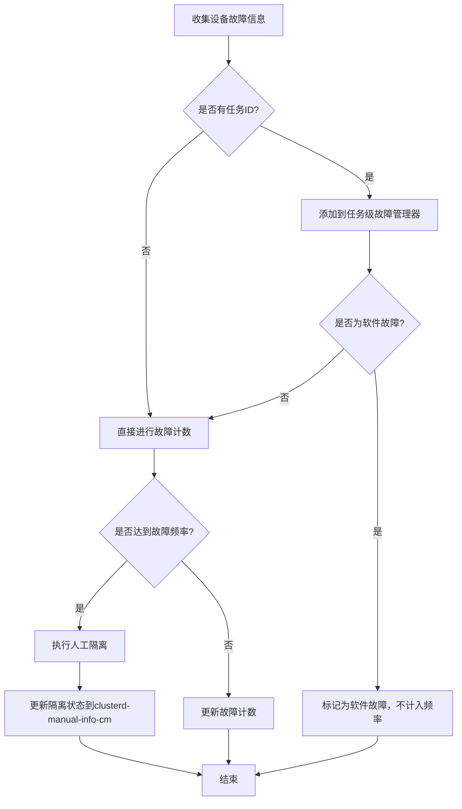
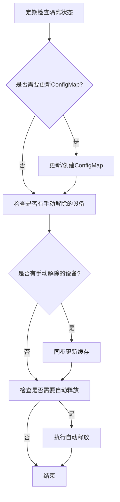

# RFC: 人工隔离准确性增强

## 1. 特性概述

本特性实现了设备的人工隔离功能，支持基于故障频率的自动隔离，并具备软件故障识别能力，避免非硬件原因导致的误隔离问题。

## 2. 需求背景

### 2.1 问题描述

1. **人工隔离需求**：当设备在特定频率下出现故障时，需要将该设备进行人工隔离，且这种隔离需要手动解除，不同于device plugin上报的preseparate、separate级别的故障。

2. **误隔离问题**：
    - dp生成的芯片故障状态缺少任务级别的全局视角
    - 准确性不足导致误隔离问题
    - 由于非硬件原因（如软件问题）导致一个任务下短时间内反复大量出现aic timeout故障
    - 导致device plugin侧感知到该故障达到了故障频率，将大量设备置为人工隔离状态
    - 最终导致大批量节点处于无法调度的状态

### 2.2 解决方案

1. **支持故障频率配置**：
    - 允许用户自定义故障频率升级人工隔离的规则
    - 避免无逃生和用户修改能力

2. **解决非硬件故障误判**：
    - 对于软件故障导致的故障不计入频率故障的计数
    - 定义规则：若一个任务下30秒内多张卡同时出现了同一个故障，则认为不是硬件故障导致，不进行频率故障计数

## 3. 设计方案

### 3.1 整体架构

```
┌───────────────────────┐       ┌───────────────────────┐       ┌───────────────────────┐
│     故障收集模块       │       │   人工隔离管理模块      │       │  Kubernetes ConfigMap  │
└──────────┬────────────┘       └──────────┬────────────┘       └──────────┬────────────┘
           │                                │                                │
           ▼                                ▼                                ▼
┌───────────────────────┐       ┌───────────────────────┐       ┌───────────────────────┐
│     故障计数模块       │       │   任务级故障管理器      │       │    全局配置管理        │
└──────────┬────────────┘       └──────────┬────────────┘       └──────────┬────────────┘
           │                                │                                │
           ▼                                ▼                                ▼
┌───────────────────────┐       ┌───────────────────────┐       ┌───────────────────────┐
│    软件故障识别        │       │   故障频率控制        │       │    故障恢复策略        │
└──────────┬────────────┘       └──────────┬────────────┘       └──────────┬────────────┘
           │                                │                                │
           └────────────────┬───────────────┴────────────────┬──────────────┘
                            ▼                                ▼
                    ┌───────────────────────┐       ┌───────────────────────┐
                    │     人工隔离执行       │       │    隔离状态维护        │
                    └───────────────────────┘       └───────────────────────┘
```

### 3.2 核心组件

#### 3.2.1 故障计数模块 (counter.go)

- **功能**：记录设备的故障次数和时间
- **数据结构**：
  ```go
  type FaultCounter struct {
      // key: node, value: dev fault info
      faults map[string]map[string]devFault
      mutex  sync.RWMutex
  }

  type devFault struct {
      // key: fault code, value: fault times
      fault map[string][]int64
  }
  ```
- **核心逻辑**：
    - 为每个设备的每个故障代码维护故障时间列表
    - 定期清理过期的故障记录
    - 判断故障频率是否达到阈值

#### 3.2.2 任务级故障管理器 (job_fault_mgr.go)

- **功能**：针对故障卡上有任务的场景，从任务维度管理故障，识别软件故障
- **核心逻辑**：
    - 收集同一任务下的所有故障
    - 滑动窗口算法（默认30秒）
    - 软件故障判断：**一个任务下30秒内多张卡同时出现了同一个故障，则认为不是硬件故障导致，不进行频率故障计数**
    - 非软件故障则传递给故障计数模块
- **适用场景**：专门处理故障卡上有任务的情况，避免软件问题导致的批量误隔离

**关键实现细节**：
```go
// AddFault 方法处理任务级故障
func (m *JobFaultManager) AddFault(newFault *Fault) {
    if newFault == nil {
        return
    }
    // 无任务ID的故障直接传递给故障计数模块
    if newFault.JobId == "" {
        Counter.AddFault(newFault)
        return
    }

    // 有任务ID的故障进入软件故障判断流程
    hwlog.RunLog.Infof("fault enters the process of determining software fault: %+v", newFault)
    // ... 任务级故障处理逻辑
}
```

**软件故障识别核心算法**：

```go
// firstItemIsSfwFault 判断第一个故障是否为软件故障
// 规则：一个任务下30秒内多张卡同时出现了同一个故障，则认为不是硬件故障导致
func firstItemIsSfwFault(faults []*Fault) bool {
    if len(faults) == 0 {
        return false
    }
    fault0 := faults[0]  // 获取第一个故障作为基准
    for idx, fault := range faults {
        if idx == 0 {
            continue
        }
        // 同一任务下，30秒内，不同设备出现相同故障 → 软件故障
        if fault.Code == fault0.Code && 
           fault.ReceiveTime <= fault0.ReceiveTime+m.slidingWindow && 
           (fault.NodeName != fault0.NodeName || fault.DevName != fault0.DevName) {
            hwlog.RunLog.Infof("fault: %+v, is software fault", fault0)
            return true
        }
    }
    hwlog.RunLog.Infof("fault: %+v, is not software fault", fault0)
    return false
}

// deleteSameWithFirstFault 处理完第一个故障后，删除相关故障记录
func (m *JobFaultManager) deleteSameWithFirstFault(faults []*Fault, isSftFault bool) []*Fault {
    fault0 := faults[0]
    var faultsAfterDelete []*Fault
    for idx, fault := range faults {
        if idx == 0 {
            continue
        }
        // 在滑动窗口内的相同故障
        if fault.Code == fault0.Code && fault.ReceiveTime <= fault0.ReceiveTime+m.slidingWindow {
            if isSftFault {
                // 软件故障：所有相关故障都不计入频率计数
                hwlog.RunLog.Infof("fault: %+v, is software fault", fault)
                continue
            }
            // 硬件故障：同一设备的故障计入频率计数
            if fault.NodeName == fault0.NodeName && fault.DevName == fault0.DevName {
                hwlog.RunLog.Infof("fault: %+v, is not software fault", fault)
                Counter.AddFault(fault)
                continue
            }
        }
        // 其他故障保留，继续处理
        faultsAfterDelete = append(faultsAfterDelete, fault)
    }
    return faultsAfterDelete
}
```

**工作流程**：
1. 收集同一任务下的所有故障记录
2. 对故障记录按时间顺序排序
3. 以第一个故障为基准，检查30秒内是否有其他设备出现相同故障
4. 如果是软件故障，所有相关故障都不计入频率计数
5. 如果是硬件故障，同一设备的故障计入频率计数
6. 处理完后删除已处理的故障记录，继续处理下一批故障

#### 3.2.3 人工隔离管理模块 (cm.go)

- **功能**：管理人工隔离状态，持久化到ConfigMap
- **核心数据结构**：
  ```go
  type Cache struct {
      manualInfo map[string]NodeCmInfo
      mutex      sync.RWMutex
  }

  type NodeCmInfo struct {
      Total []string
      // key: dev name, value: dev fault
      Detail map[string][]DevCmInfo
  }

  type DevCmInfo struct {
      FaultCode        string
      FaultLevel       string
      LastSeparateTime int64 // unit: millisecond
  }
  ```
- **核心功能**：
    - 添加/删除人工隔离设备
    - 维护隔离设备的详细信息
    - 与ConfigMap同步隔离状态

#### 3.2.4 全局配置管理 (config.go)

- **功能**：管理人工隔离策略的配置参数
- **核心配置项**：
  ```go
  type ManuallySeparatePolicy struct {
      Enabled  bool `yaml:"enabled"`
      Separate struct {
          FaultWindowHours int `yaml:"fault_window_hours"` // 故障统计窗口
          FaultThreshold   int `yaml:"fault_threshold"`   // 故障阈值
      } `yaml:"separate"`
      Release struct {
          FaultFreeHours int `yaml:"fault_free_hours"` // 自动释放时间
      } `yaml:"release"`
  }
  ```

## 4. 实现细节

### 4.1 软件故障识别算法

```go
// 检查是否为软件故障
func firstItemIsSfwFault(faults []*Fault) bool {
    if len(faults) == 0 {
        return false
    }
    fault0 := faults[0]
    for idx, fault := range faults {
        if idx == 0 {
            continue
        }
        // 同一任务下，30秒内，不同设备出现相同故障
        if fault.Code == fault0.Code && 
           (fault.NodeName != fault0.NodeName || fault.DevName != fault0.DevName) {
            return true
        }
    }
    return false
}
```

### 4.2 故障频率判断逻辑

```go
// 判断是否达到故障频率阈值
func (c *FaultCounter) isReachFrequency(faultTimes []int64) bool {
    // 故障次数未达到阈值
    if len(faultTimes) < conf.GetSeparateThreshold() {
        return false
    }
    
    // 阈值为1时直接返回
    if conf.GetSeparateThreshold() == conf.MinFaultThreshold {
        return true
    }

    // 获取最近的N次故障时间
    recentTimes := faultTimes[len(faultTimes)-conf.GetSeparateThreshold():]
    if len(recentTimes) < conf.GetSeparateThreshold() {
        return false
    }
    
    // 判断最近N次故障是否在指定时间窗口内
    if recentTimes[conf.GetSeparateThreshold()-1]-recentTimes[0] < conf.GetSeparateWindow() {
        return true
    }
    return false
}
```

### 4.3 人工隔离执行流程

```go
// 处理频率故障，执行人工隔离
func (c *FaultCounter) dealFrequencyFault(fault FaultInfo) {
    // 记录日志
    hwlog.RunLog.Infof("node: %s, dev: %s, code: %s, reach frequency threshold, set to manually separate",
        fault.NodeName, fault.DevName, fault.FaultCode)
    
    // 清理该设备的故障计数
    c.clearDevFault(fault.NodeName, fault.DevName, fault.FaultCode)
    
    // 添加到人工隔离缓存
    FaultCmInfo.AddSeparateDev(fault)
}
```

### 4.4 系统初始化流程

人工隔离功能的初始化和启动在`component/clusterd/main.go`中完成，包含以下关键步骤：

```go
func main() {
    // ... 其他初始化代码 ...
    
    // 加载全局配置
    conf.TryLoadGlobalConfig()
    // 监控全局配置变化
    go conf.WatchGlobalConfig(ctx)
    
    // 处理人工隔离NPU故障必须在故障处理器中心之前执行
    // 因为需要先加载和初始化人工隔离状态，故障处理器才能正确处理故障
    dealManuallySeparateNPUFault(ctx)
    
    // ... 其他初始化代码 ...
    
    // 启动故障处理器中心
    faultmanager.GlobalFaultProcessCenter.Work(ctx)
    
    // ... 其他初始化代码 ...
}

// dealManuallySeparateNPUFault 处理人工隔离NPU故障的初始化
func dealManuallySeparateNPUFault(ctx context.Context) {
    // 初始化人工隔离缓存（必须在处理函数之前执行）
    manualfault2.InitFaultCmInfo()

    // 从ConfigMap加载人工隔离信息
    manualfault.LoadManualCmInfo()
    // 启动人工隔离管理进程
    go manualfault.ProcessManuSep(ctx)
}
```

**初始化顺序说明**：
1. **配置加载与监控**：
    - `conf.TryLoadGlobalConfig()`：加载初始配置，包括人工隔离策略的各项参数
    - `conf.WatchGlobalConfig(ctx)`：启动配置监控，支持运行时动态更新配置

2. **人工隔离初始化**：
    - `InitFaultCmInfo()`：初始化全局人工隔离缓存
    - `LoadManualCmInfo()`：从Kubernetes ConfigMap加载已有的人工隔离信息
    - `ProcessManuSep(ctx)`：启动人工隔离管理进程，定期检查和更新隔离状态

3. **故障处理器启动**：
    - `faultmanager.GlobalFaultProcessCenter.Work(ctx)`：启动故障处理器中心


## 5. 配置说明

### 5.1 配置结构

```yaml
manuallySeparatePolicy:
  enabled: true  # 是否启用人工隔离功能
  separate:
    fault_window_hours: 24  # 故障统计窗口（小时）
    fault_threshold: 3      # 故障阈值（次）
  release:
    fault_free_hours: -1    # 自动释放时间（小时，-1表示不自动释放）
```

### 5.2 配置约束

| 配置项 | 最小值 | 最大值 | 说明 |
|-------|-------|-------|------|
| fault_window_hours | 1 | 720 | 故障统计窗口，单位小时 |
| fault_threshold | 1 | 50 | 触发人工隔离的故障次数 |
| fault_free_hours | 1 | 240 | 自动释放时间，-1表示不自动释放 |

## 6. 工作流程

### 6.1 故障处理流程



**流程说明：**
1. 当设备故障达到设定的频率阈值时，系统执行人工隔离操作
2. 隔离操作完成后，系统会将隔离状态更新到名为`clusterd-manual-info-cm`的ConfigMap中
3. 该ConfigMap位于`cluster-system`命名空间，用于持久化存储集群中所有人工隔离的芯片信息

**clusterd-manual-info-cm ConfigMap示例：**
```yaml
Name:         clusterd-manual-info-cm
Namespace:    cluster-system
Data
====
localhost.localdomain:
----
{"Total":["Ascend910-0","Ascend910-2","Ascend910-3"],"Detail":{"Ascend910-0":[{"FaultCode":"8C084E00","FaultLevel":"ManuallySeparateNPU","LastSeparateTime":1770811685650}]}}
```

**ConfigMap字段说明：**

| 参数 | 说明 |
|------|------|
| `<localhost.localdomain>` | 节点名称，对应集群中的节点名称，作为Data的key |
| `Total` | 该节点上所有人工隔离芯片的名称列表 |
| `Detail` | 芯片故障详细信息，以芯片名称为key |
| `- <Ascend910-0>` | 芯片名称，对应节点上的具体芯片 |
| `- FaultCode` | 故障码，标识触发人工隔离的具体故障类型 |
| `- FaultLevel` | 故障级别，此处固定为`ManuallySeparateNPU`表示人工隔离 |
| `- LastSeparateTime` | 达到人工隔离频率时的最后一次故障时间（毫秒）。如果已经触发人工隔离的故障再次达到人工隔离频率，该时间会被刷新 |

### 6.2 人工隔离管理流程



## 7. 测试验证

### 7.1 功能测试

1. **基本功能测试**：
    - 模拟设备故障，验证故障计数功能
    - 触发频率故障，验证人工隔离执行
    - 手动解除隔离，验证状态同步

2. **软件故障识别测试**：
    - 模拟同一任务下多张卡同时出现相同故障
    - 验证该故障被识别为软件故障，不计入频率计数

3. **配置测试**：
    - 修改故障频率配置，验证配置生效
    - 测试不同配置组合的行为

### 7.2 性能测试

1. **高并发测试**：模拟大量设备同时故障，验证系统稳定性
2. **长时间运行测试**：持续运行数天，验证内存泄漏和性能衰减

## 8. 兼容性和风险

### 8.1 兼容性

- 与现有故障处理机制兼容
- 支持动态配置更新
- 支持平滑升级和回滚

### 8.2 风险评估

| 风险 | 影响 | 缓解措施 |
|------|------|----------|
| 配置错误导致误隔离 | 设备被错误隔离，影响资源利用率 | 配置验证、灰度发布、快速回滚机制 |
| 软件故障识别不准确 | 仍可能发生误隔离 | 持续优化算法、增加人工干预机制 |
| 性能问题 | 影响系统整体性能 | 性能测试、优化数据结构和算法 |

## 9. 总结

本特性实现了基于故障频率的人工隔离功能，并通过任务级故障管理识别软件故障，有效避免了非硬件原因导致的误隔离问题。该特性具有灵活的配置选项，支持用户根据实际需求调整故障频率规则，确保系统的可靠性和可维护性。通过`clusterd-manual-info-cm` ConfigMap，用户可以直观地查看集群中所有人工隔离的芯片信息，方便进行运维管理。