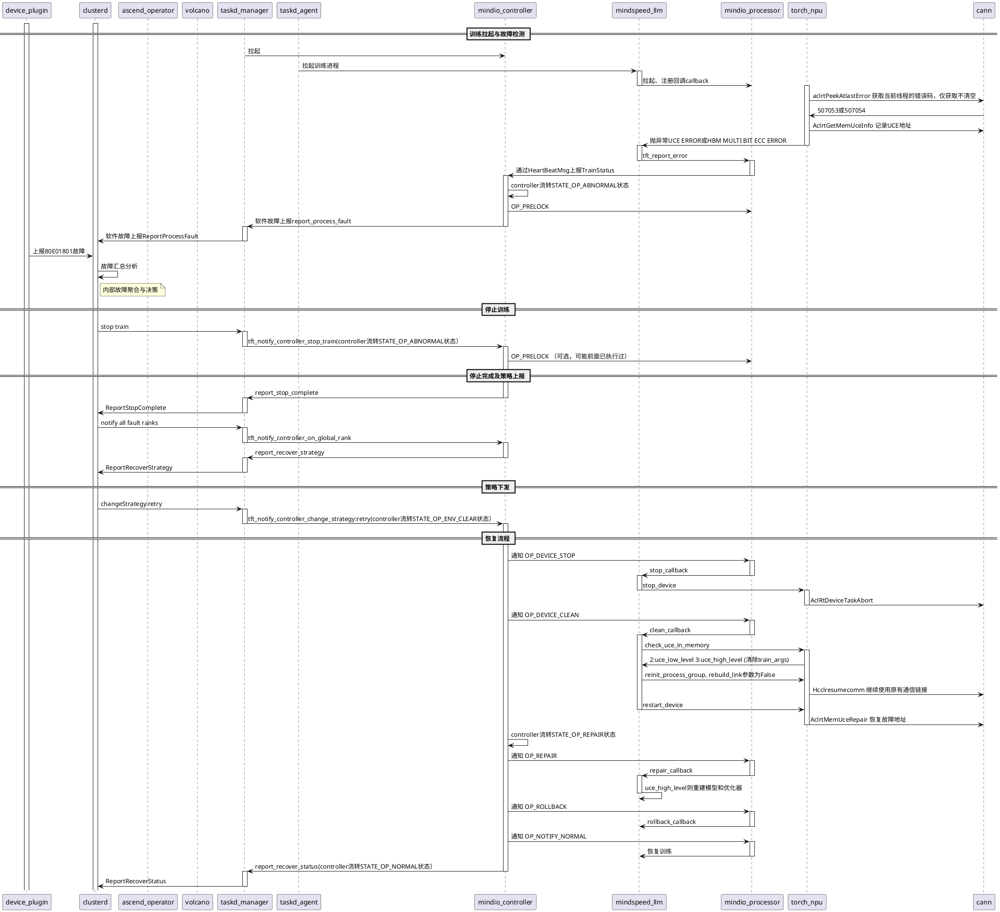
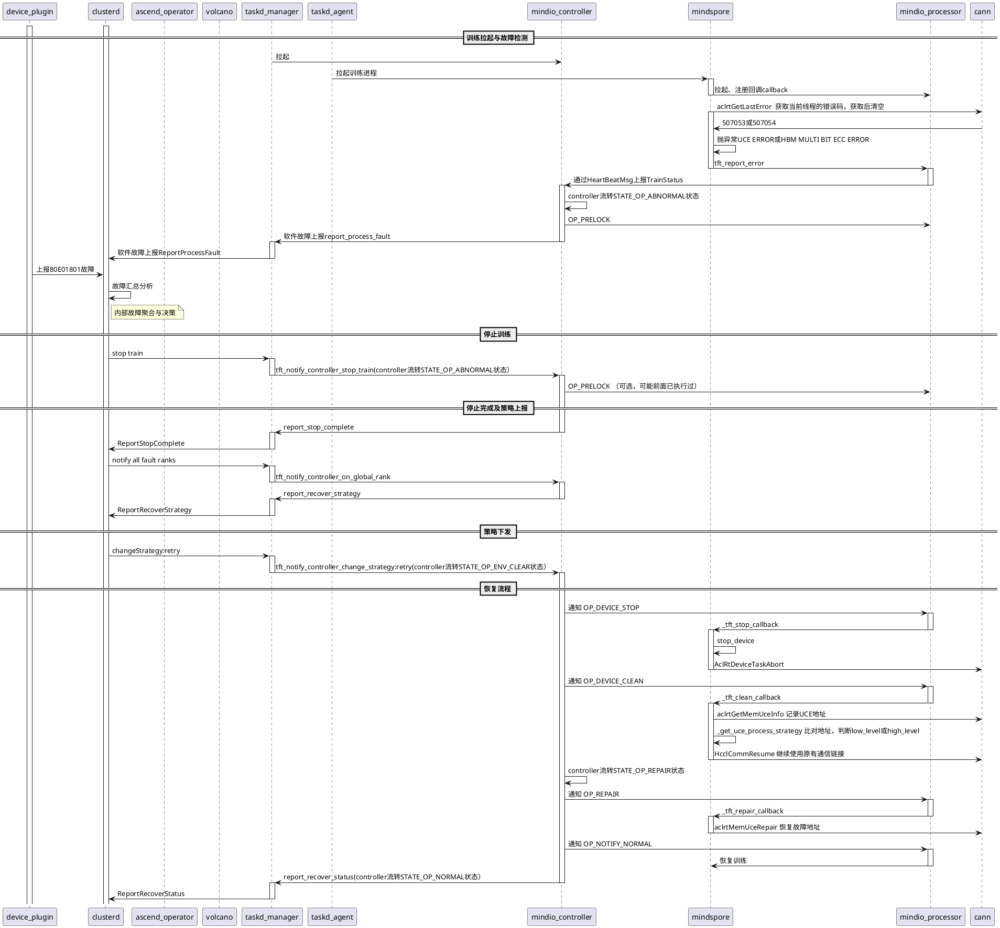

# HBM UCE进程级快恢流程（PlantUML 时序图）

## 以下为Pytorch进程级快恢时序图，使用PlantUML语法编写：

```plantuml
@startuml
participant device_plugin
participant clusterd
participant ascend_operator
participant volcano
participant taskd_manager
participant taskd_agent
participant mindio_controller
participant mindspeed_llm
participant mindio_processor
participant torch_npu
participant cann

== 训练拉起与故障检测 ==
activate device_plugin
activate clusterd

taskd_manager -> mindio_controller : 拉起
taskd_agent -> mindspeed_llm : 拉起训练进程
activate mindspeed_llm
mindspeed_llm -> mindio_processor : 拉起、注册回调callback
deactivate mindspeed_llm

activate torch_npu
torch_npu -> cann : aclrtPeekAtlastError 获取当前线程的错误码，仅获取不清空
cann -> torch_npu : 507053或507054
torch_npu -> cann : AclrtGetMemUceInfo 记录UCE地址
torch_npu -> mindspeed_llm: 抛异常UCE ERROR或HBM MULTI BIT ECC ERROR
deactivate torch_npu

activate mindspeed_llm
mindspeed_llm -> mindio_processor: tft_report_error
deactivate mindspeed_llm

activate mindio_processor
mindio_processor -> mindio_controller : 通过HeartBeatMsg上报TrainStatus
deactivate mindio_processor

activate mindio_controller
mindio_controller -> mindio_controller: controller流转STATE_OP_ABNORMAL状态
mindio_controller -> mindio_processor : OP_PRELOCK
mindio_controller -> taskd_manager : 软件故障上报report_process_fault
deactivate mindio_controller

activate taskd_manager
taskd_manager -> clusterd : 软件故障上报ReportProcessFault
deactivate taskd_manager

device_plugin -> clusterd : 上报80E01801故障

clusterd -> clusterd : 故障汇总分析
note right of clusterd
  内部故障聚合与决策
end note

== 停止训练 ==
deactivate mindio_processor
deactivate mindspeed_llm
deactivate mindio_controller

clusterd -> taskd_manager : stop train
activate taskd_manager
taskd_manager -> mindio_controller : tft_notify_controller_stop_train(controller流转STATE_OP_ABNORMAL状态）
deactivate taskd_manager
activate mindio_controller
mindio_controller -> mindio_processor : OP_PRELOCK （可选，可能前面已执行过）

== 停止完成及策略上报 ==
mindio_controller -> taskd_manager : report_stop_complete
deactivate mindio_controller
activate taskd_manager
taskd_manager -> clusterd : ReportStopComplete
deactivate taskd_manager

clusterd -> taskd_manager : notify all fault ranks
activate taskd_manager
taskd_manager -> mindio_controller : tft_notify_controller_on_global_rank
deactivate taskd_manager
activate mindio_controller

mindio_controller -> taskd_manager : report_recover_strategy
deactivate mindio_controller
activate taskd_manager
taskd_manager -> clusterd : ReportRecoverStrategy
deactivate taskd_manager

== 策略下发 ==
clusterd -> taskd_manager : changeStrategy:retry
activate taskd_manager
taskd_manager -> mindio_controller : tft_notify_controller_change_strategy:retry(controller流转STATE_OP_ENV_CLEAR状态）
deactivate taskd_manager
activate mindio_controller

== 恢复流程 ==
mindio_controller -> mindio_processor : 通知 OP_DEVICE_STOP
activate mindio_processor
mindio_processor -> mindspeed_llm : stop_callback
deactivate mindio_processor

activate mindspeed_llm
mindspeed_llm -> torch_npu : stop_device
deactivate mindspeed_llm

activate torch_npu
torch_npu -> cann : AclRtDeviceTaskAbort
deactivate torch_npu

mindio_controller -> mindio_processor : 通知 OP_DEVICE_CLEAN
activate mindio_processor
mindio_processor -> mindspeed_llm : clean_callback
deactivate mindio_processor

activate mindspeed_llm
mindspeed_llm -> torch_npu : check_uce_in_memory
activate torch_npu
torch_npu -> mindspeed_llm : 2:uce_low_level 3:uce_high_level (清除train_args)
mindspeed_llm -> torch_npu : reinit_process_group, rebuild_link参数为False
torch_npu -> cann : Hcclresumecomm 继续使用原有通信链接
mindspeed_llm -> torch_npu : restart_device
deactivate mindspeed_llm
torch_npu -> cann : AclrtMemUceRepair 恢复故障地址
deactivate torch_npu

mindio_controller -> mindio_controller : controller流转STATE_OP_REPAIR状态

mindio_controller -> mindio_processor : 通知 OP_REPAIR
activate mindio_processor
mindio_processor -> mindspeed_llm : repair_callback
deactivate mindio_processor
activate mindspeed_llm
mindspeed_llm -> mindspeed_llm : uce_high_level则重建模型和优化器
deactivate mindspeed_llm

mindio_controller -> mindio_processor : 通知 OP_ROLLBACK
activate mindio_processor
mindio_processor -> mindspeed_llm : rollback_callback
deactivate mindio_processor

mindio_controller -> mindio_processor : 通知 OP_NOTIFY_NORMAL
activate mindio_processor
mindio_processor -> mindspeed_llm : 恢复训练
deactivate mindio_processor

mindio_controller -> taskd_manager : report_recover_status(controller流转STATE_OP_NORMAL状态）
deactivate mindio_controller
activate taskd_manager
taskd_manager -> clusterd : ReportRecoverStatus
deactivate taskd_manager

@enduml
```

## 以下为mindspore进程级快恢时序图，使用PlantUML语法编写：

```plantuml
@startuml
participant device_plugin
participant clusterd
participant ascend_operator
participant volcano
participant taskd_manager
participant taskd_agent
participant mindio_controller
participant mindspore
participant mindio_processor
participant cann

== 训练拉起与故障检测 ==
activate device_plugin
activate clusterd

taskd_manager -> mindio_controller : 拉起
taskd_agent -> mindspore : 拉起训练进程
activate mindspore
mindspore -> mindio_processor : 拉起、注册回调callback
deactivate mindspore

mindspore -> cann : aclrtGetLastError  获取当前线程的错误码，获取后清空
activate mindspore
cann -> mindspore : 507053或507054
mindspore -> mindspore : 抛异常UCE ERROR或HBM MULTI BIT ECC ERROR
mindspore -> mindio_processor: tft_report_error
deactivate mindspore

activate mindio_processor
mindio_processor -> mindio_controller : 通过HeartBeatMsg上报TrainStatus
deactivate mindio_processor

activate mindio_controller
mindio_controller -> mindio_controller: controller流转STATE_OP_ABNORMAL状态
mindio_controller -> mindio_processor : OP_PRELOCK
mindio_controller -> taskd_manager : 软件故障上报report_process_fault
deactivate mindio_controller

activate taskd_manager
taskd_manager -> clusterd : 软件故障上报ReportProcessFault
deactivate taskd_manager

device_plugin -> clusterd : 上报80E01801故障

clusterd -> clusterd : 故障汇总分析
note right of clusterd
  内部故障聚合与决策
end note

== 停止训练 ==
deactivate mindio_processor
deactivate mindspore
deactivate mindio_controller

clusterd -> taskd_manager : stop train
activate taskd_manager
taskd_manager -> mindio_controller : tft_notify_controller_stop_train(controller流转STATE_OP_ABNORMAL状态）
deactivate taskd_manager
activate mindio_controller
mindio_controller -> mindio_processor : OP_PRELOCK （可选，可能前面已执行过）

== 停止完成及策略上报 ==
mindio_controller -> taskd_manager : report_stop_complete
deactivate mindio_controller
activate taskd_manager
taskd_manager -> clusterd : ReportStopComplete
deactivate taskd_manager

clusterd -> taskd_manager : notify all fault ranks
activate taskd_manager
taskd_manager -> mindio_controller : tft_notify_controller_on_global_rank
deactivate taskd_manager
activate mindio_controller

mindio_controller -> taskd_manager : report_recover_strategy
deactivate mindio_controller
activate taskd_manager
taskd_manager -> clusterd : ReportRecoverStrategy
deactivate taskd_manager

== 策略下发 ==
clusterd -> taskd_manager : changeStrategy:retry
activate taskd_manager
taskd_manager -> mindio_controller : tft_notify_controller_change_strategy:retry(controller流转STATE_OP_ENV_CLEAR状态）
deactivate taskd_manager
activate mindio_controller

== 恢复流程 ==
mindio_controller -> mindio_processor : 通知 OP_DEVICE_STOP
activate mindio_processor
mindio_processor -> mindspore : _tft_stop_callback
deactivate mindio_processor

activate mindspore
mindspore -> mindspore : stop_device
mindspore -> cann : AclRtDeviceTaskAbort
deactivate mindspore

mindio_controller -> mindio_processor : 通知 OP_DEVICE_CLEAN
activate mindio_processor
mindio_processor -> mindspore : _tft_clean_callback
deactivate mindio_processor

activate mindspore
mindspore -> cann : aclrtGetMemUceInfo 记录UCE地址
mindspore -> mindspore : _get_uce_process_strategy 比对地址，判断low_level或high_level
mindspore -> cann : HcclCommResume 继续使用原有通信链接
deactivate mindspore

mindio_controller -> mindio_controller : controller流转STATE_OP_REPAIR状态
mindio_controller -> mindio_processor : 通知 OP_REPAIR
activate mindio_processor
mindio_processor -> mindspore : _tft_repair_callback
deactivate mindio_processor
activate mindspore
mindspore -> cann: aclrtMemUceRepair 恢复故障地址
deactivate mindspore

mindio_controller -> mindio_processor : 通知 OP_NOTIFY_NORMAL
activate mindio_processor
mindio_processor -> mindspore : 恢复训练
deactivate mindio_processor

mindio_controller -> taskd_manager : report_recover_status(controller流转STATE_OP_NORMAL状态）
deactivate mindio_controller
activate taskd_manager
taskd_manager -> clusterd : ReportRecoverStatus
deactivate taskd_manager

@enduml
```

