# 亚健康热切流程（PlantUML 时序图）

以下为PyTorch亚健康热切时序图，使用PlantUML语法编写：

```plantuml
@startuml
participant device_plugin
participant clusterd
participant ascend_operator
participant volcano
participant taskd_manager
participant taskd_agent
participant mindio_controller
participant mindspeed_llm
participant mindio_processor
participant torch_npu
participant cann

== 训练拉起与故障检测 ==
activate device_plugin
device_plugin -> clusterd : 芯片故障上报(deviceinfo cm)
activate clusterd

taskd_manager -> mindio_controller : 拉起
taskd_agent -> mindspeed_llm : 拉起训练进程
activate mindspeed_llm
mindspeed_llm -> mindio_processor : 拉起、注册回调callback
deactivate mindspeed_llm

clusterd -> clusterd : 故障汇总分析
note right of clusterd
  内部故障聚合与决策
end note

== 停止训练 ==
deactivate mindio_processor
deactivate mindspeed_llm
deactivate mindio_controller

clusterd -> taskd_manager : hot switch信号，暂停训练
activate taskd_manager
taskd_manager -> mindio_controller : tft_notify_controller_prepare_action
deactivate taskd_manager

== 创建备份pod ==
clusterd -> ascend_operator : 通过标签通知ascend-operator创建备份pod
activate ascend_operator
ascend_operator -> ascend_operator : 创建备份pod
deactivate ascend_operator
volcano -> volcano : 调度备份pod

== 策略上报 ==
mindio_controller -> mindio_controller : controller检测到新节点注册上来流转STATE_OP_STEP_FINISH状态
activate mindio_controller
mindio_controller -> mindio_processor : 通知OP_PAUSE
mindio_controller -> taskd_manager : report_recover_strategy
deactivate mindio_controller
activate taskd_manager
taskd_manager -> clusterd : ReportRecoverStrategy
deactivate taskd_manager

== 删除亚健康pod ==
clusterd -> volcano : 通过标签通知volcano删除亚健康pod

== 策略下发 ==
clusterd -> clusterd : 等待亚健康pod删除成功
clusterd -> taskd_manager : changeStrategy:migration
activate taskd_manager
taskd_manager -> mindio_controller : tft_notify_controller_change_strategy:migration(controller流转STATE_OP_MIGRATION状态）
deactivate taskd_manager
activate mindio_controller

== 恢复流程 ==
mindio_controller -> mindio_processor : OP_PT_COMM
activate mindio_processor
mindio_processor -> mindspeed_llm : arf_rebuild_process_group_callback
deactivate mindio_processor

activate mindspeed_llm
mindspeed_llm -> torch_npu : reinit_process_group
deactivate mindspeed_llm
activate torch_npu
torch_npu -> cann : HcclCommDestroy
deactivate torch_npu

mindio_controller -> mindio_processor : 通知 OP_REPAIR
activate mindio_processor
mindio_processor -> mindspeed_llm : repair_callback
deactivate mindio_processor

mindio_controller -> mindio_processor : 通知 OP_ROLLBACK
activate mindio_processor
mindio_processor -> mindspeed_llm : rollback_callback
deactivate mindio_processor

mindio_controller -> mindio_processor : 通知 OP_NOTIFY_NORMAL
activate mindio_processor
mindio_processor -> mindspeed_llm : 恢复训练
deactivate mindio_processor

mindio_controller -> taskd_manager : report_recover_status(controller流转STATE_OP_NORMAL状态）
deactivate mindio_controller
activate taskd_manager
taskd_manager -> clusterd : ReportRecoverStatus
deactivate taskd_manager

deactivate device_plugin
deactivate clusterd
@enduml
```

以下为MindSpore亚健康热切时序图，使用PlantUML语法编写：

```plantuml
@startuml
participant device_plugin
participant clusterd
participant ascend_operator
participant volcano
participant taskd_manager
participant taskd_agent
participant mindio_controller
participant mindspore
participant mindio_processor
participant cann

== 训练拉起与故障检测 ==
activate device_plugin
device_plugin -> clusterd : 芯片故障上报(deviceinfo cm)
activate clusterd

taskd_manager -> mindio_controller : 拉起
taskd_agent -> mindspore : 拉起训练进程
activate mindspore
mindspore -> mindio_processor : 拉起、注册回调callback
deactivate mindspore

clusterd -> clusterd : 故障汇总分析
note right of clusterd
  内部故障聚合与决策
end note

== 停止训练 ==
deactivate mindio_processor
deactivate mindio_controller

clusterd -> taskd_manager : hot switch信号，暂停训练
activate taskd_manager
taskd_manager -> mindio_controller : tft_notify_controller_prepare_action
deactivate taskd_manager

== 创建备份pod ==
activate mindio_controller
mindio_controller -> mindio_controller : controller检测到新节点注册上来流转STATE_OP_STEP_FINISH状态
mindio_controller -> mindio_processor : 通知OP_PAUSE
deactivate mindio_controller
clusterd -> ascend_operator : 通过标签通知ascend-operator创建备份pod
activate ascend_operator
ascend_operator -> ascend_operator : 创建备份pod
deactivate ascend_operator
volcano -> volcano : 调度备份pod

== 策略上报 ==
mindio_controller -> taskd_manager : report_recover_strategy
deactivate mindio_controller
activate taskd_manager
taskd_manager -> clusterd : ReportRecoverStrategy
deactivate taskd_manager

== 删除亚健康pod ==
clusterd -> volcano : 通过标签通知volcano删除亚健康pod

== 策略下发 ==
clusterd -> clusterd : 等待亚健康pod删除成功
clusterd -> taskd_manager : changeStrategy:migration
activate taskd_manager
taskd_manager -> mindio_controller : tft_notify_controller_change_strategy:migration(controller流转STATE_OP_MIGRATION状态）
deactivate taskd_manager
activate mindio_controller

== 恢复流程 ==
mindio_controller -> mindio_processor : OP_PT_COMM
activate mindio_processor
mindio_processor -> mindspore : _tft_rebuild_groups
deactivate mindio_processor

activate mindspore
mindspore -> mindspore : _finalize_comm
mindspore -> cann : aclrtSetDevice
mindspore -> cann : HcclCommDestroy
mindspore -> cann : aclrtResetDevice
mindspore -> mindspore : _rebuild_group->CollectiveManager::CreateCommunicationGroup
mindspore -> cann : aclrtSetDevice
mindspore -> cann : HcclCommInitRootInfoConfig
mindspore -> cann : aclrtResetDevice
deactivate mindspore

mindio_controller -> mindio_processor : 通知 OP_REPAIR
activate mindio_processor
mindio_processor -> mindspore : _tft_repair_callback
deactivate mindio_processor

mindio_controller -> mindio_processor : 通知 OP_NOTIFY_NORMAL
activate mindio_processor
mindio_processor -> mindspore : 恢复训练
deactivate mindio_processor

mindio_controller -> taskd_manager : report_recover_status(controller流转STATE_OP_NORMAL状态）
deactivate mindio_controller
activate taskd_manager
taskd_manager -> clusterd : ReportRecoverStatus
deactivate taskd_manager

deactivate device_plugin
deactivate clusterd

@enduml
```

> 💡 **使用提示**：
> - 在 **VS Code** 中可安装插件：**Markdown Plantuml Preview**