# 进程级重调度流程（PlantUML 时序图）

## 以下为Pytorch进程级重调度时序图，使用PlantUML语法编写：

```plantuml
@startuml
participant device_plugin
participant noded
participant clusterd
participant ascend_operator
participant volcano
participant taskd_manager
participant mindio_controller
participant taskd_agent
participant mindspeed_llm
participant mindio_processor
participant torch_npu
participant cann

== 训练拉起与故障检测 ==
activate device_plugin
activate noded
device_plugin -> clusterd : 芯片故障上报(deviceinfo cm)
activate clusterd
noded -> clusterd : 节点故障上报(nodeinfo cm)

taskd_manager -> mindio_controller : 拉起
activate mindio_controller
taskd_agent -> mindspeed_llm : 拉起训练进程
activate mindspeed_llm
mindspeed_llm -> mindio_processor : 拉起、注册回调callback
deactivate mindspeed_llm
mindio_controller -> taskd_manager : 软件故障上报report_process_fault
deactivate mindio_controller
activate taskd_manager
taskd_manager -> clusterd : 软件故障上报ReportProcessFault
deactivate taskd_manager

clusterd -> clusterd : 故障汇总分析
note right of clusterd
  内部故障聚合与决策
end note

== 停止训练 ==
deactivate mindio_processor
deactivate mindspeed_llm
deactivate mindio_controller

clusterd -> taskd_manager : stop train
activate taskd_manager
taskd_manager -> mindio_controller : tft_notify_controller_stop_train(controller流转STATE_OP_NORMAL状态）
deactivate taskd_manager
activate mindio_controller
mindio_controller -> mindio_processor : OP_PRELOCK

== 停止完成及策略上报 ==
mindio_controller -> taskd_manager : report_stop_complete
deactivate mindio_controller
activate taskd_manager
taskd_manager -> clusterd : ReportStopComplete
deactivate taskd_manager

clusterd -> taskd_manager : notify all fault ranks & exit fault nodes
activate taskd_manager
taskd_manager -> taskd_agent : exit fault nodes
activate taskd_agent
taskd_agent -> volcano : 删除故障pod ERROR，volcano删除ERROR pod
deactivate taskd_agent
activate volcano
volcano -> ascend_operator : operator检测到pod不满足最小副本要求创建新pod
deactivate volcano
taskd_manager -> mindio_controller : tft_notify_controller_on_global_rank
deactivate taskd_manager
activate mindio_controller

mindio_controller -> taskd_manager : report_recover_strategy
deactivate mindio_controller
activate taskd_manager
taskd_manager -> clusterd : ReportRecoverStrategy
deactivate taskd_manager

== 策略下发 ==
clusterd -> taskd_manager : changeStrategy:recover
activate taskd_manager
taskd_manager -> mindio_controller : tft_notify_controller_change_strategy:recover(controller流转STATE_OP_ENV_CLEAR状态）
deactivate taskd_manager
activate mindio_controller

== 恢复流程 ==
mindio_controller -> mindio_processor : 通知 OP_DEVICE_STOP
activate mindio_processor
mindio_processor -> mindspeed_llm : stop_callback
deactivate mindio_processor

activate mindspeed_llm
mindspeed_llm -> torch_npu : stop_device
deactivate mindspeed_llm

activate torch_npu
torch_npu -> cann : AclRtDeviceTaskAbort
deactivate torch_npu

mindio_controller -> mindio_processor : 通知 OP_DEVICE_CLEAN
activate mindio_processor
mindio_processor -> mindspeed_llm : clean_callback
deactivate mindio_processor

activate mindspeed_llm
mindspeed_llm -> torch_npu : restart_device
deactivate mindspeed_llm

mindio_controller -> mindio_controller : controller流转STATE_OP_REPAIR状态，等待新节点训练进程全部注册成功

mindio_controller -> mindio_processor : OP_PT_COMM
activate mindio_processor
mindio_processor -> mindspeed_llm : arf_rebuild_process_group_callback
deactivate mindio_processor

activate mindspeed_llm
mindspeed_llm -> torch_npu : reinit_process_group
deactivate mindspeed_llm
activate torch_npu
torch_npu -> cann : HcclCommDestroy
deactivate torch_npu

mindio_controller -> mindio_processor : 通知 OP_REPAIR
activate mindio_processor
mindio_processor -> mindspeed_llm : repair_callback
deactivate mindio_processor

mindio_controller -> mindio_processor : 通知 OP_ROLLBACK
activate mindio_processor
mindio_processor -> mindspeed_llm : rollback_callback
deactivate mindio_processor

mindio_controller -> mindio_processor : 通知 OP_NOTIFY_NORMAL
activate mindio_processor
mindio_processor -> mindspeed_llm : 恢复训练
deactivate mindio_processor

mindio_controller -> taskd_manager : report_recover_status(controller流转STATE_OP_NORMAL状态）
deactivate mindio_controller
activate taskd_manager
taskd_manager -> clusterd : ReportRecoverStatus
deactivate taskd_manager

deactivate device_plugin
deactivate noded
deactivate clusterd
@enduml
```

## 以下为MindSpore进程级重调度时序图，使用PlantUML语法编写：

```plantuml
@startuml
participant device_plugin
participant noded
participant clusterd
participant ascend_operator
participant volcano
participant taskd_manager
participant mindio_controller
participant taskd_agent
participant mindspore
participant mindio_processor
participant cann

== 训练拉起与故障检测 ==
activate device_plugin
activate noded
device_plugin -> clusterd : 芯片故障上报(deviceinfo cm)
activate clusterd
noded -> clusterd : 节点故障上报(nodeinfo cm)

taskd_manager -> mindio_controller : 拉起
activate mindio_controller
taskd_agent -> mindspore : 拉起训练进程
activate mindspore
mindspore -> mindio_processor : 拉起、注册回调callback
deactivate mindspore
mindio_controller -> taskd_manager : 软件故障上报report_process_fault
deactivate mindio_controller
activate taskd_manager
taskd_manager -> clusterd : 软件故障上报ReportProcessFault
deactivate taskd_manager

clusterd -> clusterd : 故障汇总分析
note right of clusterd
  内部故障聚合与决策
end note

== 停止训练 ==
deactivate mindio_processor
deactivate mindspore
deactivate mindio_controller

clusterd -> taskd_manager : stop train
activate taskd_manager
taskd_manager -> mindio_controller : tft_notify_controller_stop_train(controller流转STATE_OP_NORMAL状态）
deactivate taskd_manager
activate mindio_controller
mindio_controller -> mindio_processor : OP_PRELOCK

== 停止完成及策略上报 ==
mindio_controller -> taskd_manager : report_stop_complete
deactivate mindio_controller
activate taskd_manager
taskd_manager -> clusterd : ReportStopComplete
deactivate taskd_manager

clusterd -> taskd_manager : notify all fault ranks & exit fault nodes
activate taskd_manager
taskd_manager -> taskd_agent : exit fault nodes
activate taskd_agent
taskd_agent -> volcano : 删除故障pod ERROR，volcano删除ERROR pod
deactivate taskd_agent
activate volcano
volcano -> ascend_operator : operator检测到pod不满足最小副本要求创建新pod
deactivate volcano
taskd_manager -> mindio_controller : tft_notify_controller_on_global_rank
deactivate taskd_manager
activate mindio_controller

mindio_controller -> taskd_manager : report_recover_strategy
deactivate mindio_controller
activate taskd_manager
taskd_manager -> clusterd : ReportRecoverStrategy
deactivate taskd_manager

== 策略下发 ==
clusterd -> taskd_manager : changeStrategy:recover
activate taskd_manager
taskd_manager -> mindio_controller : tft_notify_controller_change_strategy:recover(controller流转STATE_OP_ENV_CLEAR状态）
deactivate taskd_manager
activate mindio_controller

== 恢复流程 ==
mindio_controller -> mindio_processor : 通知 OP_DEVICE_STOP
activate mindio_processor
mindio_processor -> mindspore : _tft_stop_callback
deactivate mindio_processor

activate mindspore
mindspore -> mindspore : stop_device
mindspore -> cann : AclRtDeviceTaskAbort
deactivate mindspore

mindio_controller -> mindio_processor : 通知 OP_DEVICE_CLEAN
activate mindio_processor
mindio_processor -> mindspore : _tft_clean_callback
deactivate mindio_processor

activate mindspore
mindspore -> mindspore : _reset_snapshot_state
deactivate mindspore

mindio_controller -> mindio_controller : controller流转STATE_OP_REPAIR状态，等待新节点训练进程全部注册成功

mindio_controller -> mindio_processor : OP_PT_COMM
activate mindio_processor
mindio_processor -> mindspore : _tft_rebuild_groups
deactivate mindio_processor

activate mindspore
mindspore -> mindspore : _finalize_comm
mindspore -> cann : aclrtSetDevice
mindspore -> cann : HcclCommDestroy
mindspore -> cann : aclrtResetDevice
mindspore -> mindspore : _rebuild_group->CollectiveManager::CreateCommunicationGroup
mindspore -> cann : aclrtSetDevice
mindspore -> cann : HcclCommInitRootInfoConfig
mindspore -> cann : aclrtResetDevice
deactivate mindspore

mindio_controller -> mindio_processor : 通知 OP_REPAIR
activate mindio_processor
mindio_processor -> mindspore : _tft_repair_callback
deactivate mindio_processor

mindio_controller -> mindio_processor : 通知 OP_NOTIFY_NORMAL
activate mindio_processor
mindio_processor -> mindspore : 恢复训练
deactivate mindio_processor

mindio_controller -> taskd_manager : report_recover_status(controller流转STATE_OP_NORMAL状态）
deactivate mindio_controller
activate taskd_manager
taskd_manager -> clusterd : ReportRecoverStatus
deactivate taskd_manager

deactivate device_plugin
deactivate noded
deactivate clusterd
@enduml
```

> 💡 **使用提示**：
> - 在 **VS Code** 中可安装插件：**Markdown Plantuml Preview**