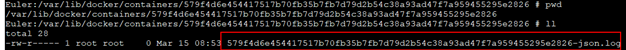
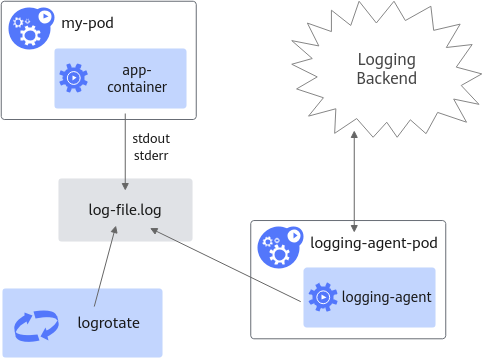
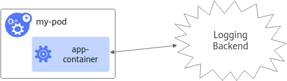

# acjob关键字段说明<a name="ZH-CN_TOPIC_0000002511426323"></a>

Ascend Job简称acjob，是MindCluster自定义的一种任务类型，当前支持通过环境变量配置资源信息及文件配置资源信息这2种方式拉起训练或推理任务。acjob各字段说明如下表所示。

**表 1**  acjob字段说明

<a name="table14213352418"></a>
<table><thead align="left"><tr id="row542113574111"><th class="cellrowborder" valign="top" width="31.8%" id="mcps1.2.5.1.1"><p id="p14222162517421"><a name="p14222162517421"></a><a name="p14222162517421"></a>字段路径</p>
</th>
<th class="cellrowborder" valign="top" width="18.2%" id="mcps1.2.5.1.2"><p id="p122214252422"><a name="p122214252422"></a><a name="p122214252422"></a>类型</p>
</th>
<th class="cellrowborder" valign="top" width="8.86%" id="mcps1.2.5.1.3"><p id="p102226251422"><a name="p102226251422"></a><a name="p102226251422"></a>格式</p>
</th>
<th class="cellrowborder" valign="top" width="41.14%" id="mcps1.2.5.1.4"><p id="p122252524219"><a name="p122252524219"></a><a name="p122252524219"></a>描述</p>
</th>
</tr>
</thead>
<tbody><tr id="row13421835184110"><td class="cellrowborder" valign="top" width="31.8%" headers="mcps1.2.5.1.1 "><p id="p12226258428"><a name="p12226258428"></a><a name="p12226258428"></a>apiVersion</p>
</td>
<td class="cellrowborder" valign="top" width="18.2%" headers="mcps1.2.5.1.2 "><p id="p1922210251424"><a name="p1922210251424"></a><a name="p1922210251424"></a>字符串（string）</p>
</td>
<td class="cellrowborder" valign="top" width="8.86%" headers="mcps1.2.5.1.3 "><p id="p922272574219"><a name="p922272574219"></a><a name="p922272574219"></a>-</p>
</td>
<td class="cellrowborder" valign="top" width="41.14%" headers="mcps1.2.5.1.4 "><p id="p1222112520428"><a name="p1222112520428"></a><a name="p1222112520428"></a>定义对象表示的版本化资源模式。服务器会转换为最新内部值，拒绝不识别的版本。更多信息参考https://git.k8s.io/community/contributors/devel/sig-architecture/api-conventions.md#types-kinds。</p>
</td>
</tr>
<tr id="row194215354410"><td class="cellrowborder" valign="top" width="31.8%" headers="mcps1.2.5.1.1 "><p id="p92222255421"><a name="p92222255421"></a><a name="p92222255421"></a>kind</p>
</td>
<td class="cellrowborder" valign="top" width="18.2%" headers="mcps1.2.5.1.2 "><p id="p12222425174212"><a name="p12222425174212"></a><a name="p12222425174212"></a>字符串（string）</p>
</td>
<td class="cellrowborder" valign="top" width="8.86%" headers="mcps1.2.5.1.3 "><p id="p15222132512424"><a name="p15222132512424"></a><a name="p15222132512424"></a>-</p>
</td>
<td class="cellrowborder" valign="top" width="41.14%" headers="mcps1.2.5.1.4 "><p id="p82229252424"><a name="p82229252424"></a><a name="p82229252424"></a>表示此对象对应的REST资源类型。值通过端点推断，不可更新，采用驼峰命名。更多信息可参考https://git.k8s.io/community/contributors/devel/sig-architecture/api-conventions.md#resources。</p>
</td>
</tr>
<tr id="row542183515419"><td class="cellrowborder" valign="top" width="31.8%" headers="mcps1.2.5.1.1 "><p id="p112222250424"><a name="p112222250424"></a><a name="p112222250424"></a>metadata</p>
</td>
<td class="cellrowborder" valign="top" width="18.2%" headers="mcps1.2.5.1.2 "><p id="p522282554211"><a name="p522282554211"></a><a name="p522282554211"></a>对象（object）</p>
</td>
<td class="cellrowborder" valign="top" width="8.86%" headers="mcps1.2.5.1.3 "><p id="p1722210253424"><a name="p1722210253424"></a><a name="p1722210253424"></a>-</p>
</td>
<td class="cellrowborder" valign="top" width="41.14%" headers="mcps1.2.5.1.4 "><p id="p1822212518427"><a name="p1822212518427"></a><a name="p1822212518427"></a>Kubernetes元数据（如命名空间、标签等）。更多信息参考https://git.k8s.io/community/contributors/devel/sig-architecture/api-conventions.md#metadata。</p>
</td>
</tr>
<tr id="row84218359419"><td class="cellrowborder" valign="top" width="31.8%" headers="mcps1.2.5.1.1 "><p id="p4222925124218"><a name="p4222925124218"></a><a name="p4222925124218"></a>spec</p>
</td>
<td class="cellrowborder" valign="top" width="18.2%" headers="mcps1.2.5.1.2 "><p id="p9222162510420"><a name="p9222162510420"></a><a name="p9222162510420"></a>对象（object）</p>
</td>
<td class="cellrowborder" valign="top" width="8.86%" headers="mcps1.2.5.1.3 "><p id="p2022262594214"><a name="p2022262594214"></a><a name="p2022262594214"></a>-</p>
</td>
<td class="cellrowborder" valign="top" width="41.14%" headers="mcps1.2.5.1.4 "><p id="p10222112504216"><a name="p10222112504216"></a><a name="p10222112504216"></a>AscendJob期望状态的规格描述。必填字段：replicaSpecs。</p>
</td>
</tr>
<tr id="row742217351412"><td class="cellrowborder" valign="top" width="31.8%" headers="mcps1.2.5.1.1 "><p id="p162229259424"><a name="p162229259424"></a><a name="p162229259424"></a>spec.replicaSpecs</p>
</td>
<td class="cellrowborder" valign="top" width="18.2%" headers="mcps1.2.5.1.2 "><p id="p92221425104216"><a name="p92221425104216"></a><a name="p92221425104216"></a>对象</p>
<p id="p8121203895220"><a name="p8121203895220"></a><a name="p8121203895220"></a>（object）</p>
</td>
<td class="cellrowborder" valign="top" width="8.86%" headers="mcps1.2.5.1.3 "><p id="p122212254428"><a name="p122212254428"></a><a name="p122212254428"></a>-</p>
</td>
<td class="cellrowborder" valign="top" width="41.14%" headers="mcps1.2.5.1.4 "><p id="p022232544210"><a name="p022232544210"></a><a name="p022232544210"></a>ReplicaType到ReplicaSpec的映射，指定MS集群配置。示例：{ "Scheduler": ReplicaSpec, "Worker": ReplicaSpec }。</p>
</td>
</tr>
<tr id="row1742263534111"><td class="cellrowborder" valign="top" width="31.8%" headers="mcps1.2.5.1.1 "><p id="p1322282554215"><a name="p1322282554215"></a><a name="p1322282554215"></a>spec.replicaSpecs.[ReplicaType]</p>
</td>
<td class="cellrowborder" valign="top" width="18.2%" headers="mcps1.2.5.1.2 "><p id="p022232574220"><a name="p022232574220"></a><a name="p022232574220"></a>对象（object）</p>
</td>
<td class="cellrowborder" valign="top" width="8.86%" headers="mcps1.2.5.1.3 "><p id="p722211257429"><a name="p722211257429"></a><a name="p722211257429"></a>-</p>
</td>
<td class="cellrowborder" valign="top" width="41.14%" headers="mcps1.2.5.1.4 "><p id="p1222325204219"><a name="p1222325204219"></a><a name="p1222325204219"></a>副本的描述。</p>
</td>
</tr>
<tr id="row7422135134119"><td class="cellrowborder" valign="top" width="31.8%" headers="mcps1.2.5.1.1 "><p id="p7222625184211"><a name="p7222625184211"></a><a name="p7222625184211"></a>spec.replicaSpecs.[ReplicaType].replicas</p>
</td>
<td class="cellrowborder" valign="top" width="18.2%" headers="mcps1.2.5.1.2 "><p id="p1122222510426"><a name="p1122222510426"></a><a name="p1122222510426"></a>整数（integer）</p>
</td>
<td class="cellrowborder" valign="top" width="8.86%" headers="mcps1.2.5.1.3 "><p id="p182228259429"><a name="p182228259429"></a><a name="p182228259429"></a>int32</p>
</td>
<td class="cellrowborder" valign="top" width="41.14%" headers="mcps1.2.5.1.4 "><p id="p3222925104212"><a name="p3222925104212"></a><a name="p3222925104212"></a>副本数量，表示给定模板所需的副本数。默认为1。</p>
</td>
</tr>
<tr id="row1984512454410"><td class="cellrowborder" valign="top" width="31.8%" headers="mcps1.2.5.1.1 "><p id="p722222554212"><a name="p722222554212"></a><a name="p722222554212"></a>spec.replicaSpecs.[ReplicaType].restartPolicy</p>
</td>
<td class="cellrowborder" valign="top" width="18.2%" headers="mcps1.2.5.1.2 "><p id="p16222152534214"><a name="p16222152534214"></a><a name="p16222152534214"></a>字符串（string）</p>
</td>
<td class="cellrowborder" valign="top" width="8.86%" headers="mcps1.2.5.1.3 "><p id="p192221525104219"><a name="p192221525104219"></a><a name="p192221525104219"></a>-</p>
</td>
<td class="cellrowborder" valign="top" width="41.14%" headers="mcps1.2.5.1.4 "><p id="p1522212584215"><a name="p1522212584215"></a><a name="p1522212584215"></a>重启策略：Always、OnFailure、Never、ExitCode。默认为Never。</p>
</td>
</tr>
<tr id="row68451345134111"><td class="cellrowborder" valign="top" width="31.8%" headers="mcps1.2.5.1.1 "><p id="p8222102594212"><a name="p8222102594212"></a><a name="p8222102594212"></a>spec.replicaSpecs.[ReplicaType].template</p>
</td>
<td class="cellrowborder" valign="top" width="18.2%" headers="mcps1.2.5.1.2 "><p id="p12222025174219"><a name="p12222025174219"></a><a name="p12222025174219"></a>对象（object）</p>
</td>
<td class="cellrowborder" valign="top" width="8.86%" headers="mcps1.2.5.1.3 "><p id="p1222262518422"><a name="p1222262518422"></a><a name="p1222262518422"></a>-</p>
</td>
<td class="cellrowborder" valign="top" width="41.14%" headers="mcps1.2.5.1.4 "><p id="p822210252428"><a name="p822210252428"></a><a name="p822210252428"></a>Kubernetes的Pod模板，更多信息参考https://kubernetes.io/docs/reference/kubernetes-api/workload-resources/pod-template-v1/。</p>
</td>
</tr>
<tr id="row108469455416"><td class="cellrowborder" valign="top" width="31.8%" headers="mcps1.2.5.1.1 "><p id="p142221259426"><a name="p142221259426"></a><a name="p142221259426"></a>spec.runPolicy</p>
</td>
<td class="cellrowborder" valign="top" width="18.2%" headers="mcps1.2.5.1.2 "><p id="p722218254428"><a name="p722218254428"></a><a name="p722218254428"></a>对象（object）</p>
</td>
<td class="cellrowborder" valign="top" width="8.86%" headers="mcps1.2.5.1.3 "><p id="p1122214257429"><a name="p1122214257429"></a><a name="p1122214257429"></a>-</p>
</td>
<td class="cellrowborder" valign="top" width="41.14%" headers="mcps1.2.5.1.4 "><p id="p10222112574211"><a name="p10222112574211"></a><a name="p10222112574211"></a>封装分布式训练作业的运行时策略（如资源清理、活动时间）。</p>
</td>
</tr>
<tr id="row0846124518419"><td class="cellrowborder" valign="top" width="31.8%" headers="mcps1.2.5.1.1 "><p id="p11222162515422"><a name="p11222162515422"></a><a name="p11222162515422"></a>spec.runPolicy.backoffLimit</p>
</td>
<td class="cellrowborder" valign="top" width="18.2%" headers="mcps1.2.5.1.2 "><p id="p142221258428"><a name="p142221258428"></a><a name="p142221258428"></a>整数（integer）</p>
</td>
<td class="cellrowborder" valign="top" width="8.86%" headers="mcps1.2.5.1.3 "><p id="p1422252516421"><a name="p1422252516421"></a><a name="p1422252516421"></a>int32</p>
</td>
<td class="cellrowborder" valign="top" width="41.14%" headers="mcps1.2.5.1.4 "><p id="p112229254422"><a name="p112229254422"></a><a name="p112229254422"></a>作业失败前允许的重试次数（可选）。</p>
</td>
</tr>
<tr id="row148461545134112"><td class="cellrowborder" valign="top" width="31.8%" headers="mcps1.2.5.1.1 "><p id="p1422282594213"><a name="p1422282594213"></a><a name="p1422282594213"></a>spec.runPolicy.activeDeadlineSeconds</p>
</td>
<td class="cellrowborder" valign="top" width="18.2%" headers="mcps1.2.5.1.2 "><p id="p1322322520429"><a name="p1322322520429"></a><a name="p1322322520429"></a>整数（integer）</p>
</td>
<td class="cellrowborder" valign="top" width="8.86%" headers="mcps1.2.5.1.3 "><p id="p3223225164215"><a name="p3223225164215"></a><a name="p3223225164215"></a>int64</p>
</td>
<td class="cellrowborder" valign="top" width="41.14%" headers="mcps1.2.5.1.4 "><p id="p1422382544210"><a name="p1422382544210"></a><a name="p1422382544210"></a>作业保持活动的最长时间（秒），值必须为正整数。当前无意义，后续版本将会删除。</p>
</td>
</tr>
<tr id="row18465458410"><td class="cellrowborder" valign="top" width="31.8%" headers="mcps1.2.5.1.1 "><p id="p622322519426"><a name="p622322519426"></a><a name="p622322519426"></a>spec.runPolicy.cleanPodPolicy</p>
</td>
<td class="cellrowborder" valign="top" width="18.2%" headers="mcps1.2.5.1.2 "><p id="p1222310257422"><a name="p1222310257422"></a><a name="p1222310257422"></a>字符串（string）</p>
</td>
<td class="cellrowborder" valign="top" width="8.86%" headers="mcps1.2.5.1.3 "><p id="p1022362513426"><a name="p1022362513426"></a><a name="p1022362513426"></a>-</p>
</td>
<td class="cellrowborder" valign="top" width="41.14%" headers="mcps1.2.5.1.4 "><p id="p1022312517421"><a name="p1022312517421"></a><a name="p1022312517421"></a>作业完成后清理Pod的策略。默认值为Running。当前无意义，后续版本将会删除。</p>
</td>
</tr>
<tr id="row8876165016412"><td class="cellrowborder" valign="top" width="31.8%" headers="mcps1.2.5.1.1 "><p id="p12231725144212"><a name="p12231725144212"></a><a name="p12231725144212"></a>spec.runPolicy.ttlSecondsAfterFinished</p>
</td>
<td class="cellrowborder" valign="top" width="18.2%" headers="mcps1.2.5.1.2 "><p id="p922316258424"><a name="p922316258424"></a><a name="p922316258424"></a>整数（integer）</p>
</td>
<td class="cellrowborder" valign="top" width="8.86%" headers="mcps1.2.5.1.3 "><p id="p3223142517423"><a name="p3223142517423"></a><a name="p3223142517423"></a>int32</p>
</td>
<td class="cellrowborder" valign="top" width="41.14%" headers="mcps1.2.5.1.4 "><p id="p7223122514216"><a name="p7223122514216"></a><a name="p7223122514216"></a>作业完成后的TTL（生存时间）。默认为无限，实际删除可能延迟。当前无意义，后续版本将会删除。</p>
</td>
</tr>
<tr id="row18771650174115"><td class="cellrowborder" valign="top" width="31.8%" headers="mcps1.2.5.1.1 "><p id="p1722392514217"><a name="p1722392514217"></a><a name="p1722392514217"></a>spec.runPolicy.schedulingPolicy</p>
</td>
<td class="cellrowborder" valign="top" width="18.2%" headers="mcps1.2.5.1.2 "><p id="p42231625114215"><a name="p42231625114215"></a><a name="p42231625114215"></a>对象（object）</p>
</td>
<td class="cellrowborder" valign="top" width="8.86%" headers="mcps1.2.5.1.3 "><p id="p132231825114219"><a name="p132231825114219"></a><a name="p132231825114219"></a>-</p>
</td>
<td class="cellrowborder" valign="top" width="41.14%" headers="mcps1.2.5.1.4 "><p id="p42234251427"><a name="p42234251427"></a><a name="p42234251427"></a>调度策略（如gang-scheduling）。</p>
</td>
</tr>
<tr id="row1387715501410"><td class="cellrowborder" valign="top" width="31.8%" headers="mcps1.2.5.1.1 "><p id="p13223122584213"><a name="p13223122584213"></a><a name="p13223122584213"></a>spec.runPolicy.schedulingPolicy.minAvailable</p>
</td>
<td class="cellrowborder" valign="top" width="18.2%" headers="mcps1.2.5.1.2 "><p id="p122352574216"><a name="p122352574216"></a><a name="p122352574216"></a>整数（integer）</p>
</td>
<td class="cellrowborder" valign="top" width="8.86%" headers="mcps1.2.5.1.3 "><p id="p222312515427"><a name="p222312515427"></a><a name="p222312515427"></a>int32</p>
</td>
<td class="cellrowborder" valign="top" width="41.14%" headers="mcps1.2.5.1.4 "><p id="p52232025124218"><a name="p52232025124218"></a><a name="p52232025124218"></a>最小可用资源数。</p>
</td>
</tr>
<tr id="row128772503414"><td class="cellrowborder" valign="top" width="31.8%" headers="mcps1.2.5.1.1 "><p id="p102236251425"><a name="p102236251425"></a><a name="p102236251425"></a>spec.runPolicy.schedulingPolicy.minResources</p>
</td>
<td class="cellrowborder" valign="top" width="18.2%" headers="mcps1.2.5.1.2 "><p id="p202235255422"><a name="p202235255422"></a><a name="p202235255422"></a>对象（object）</p>
</td>
<td class="cellrowborder" valign="top" width="8.86%" headers="mcps1.2.5.1.3 "><p id="p11223625104210"><a name="p11223625104210"></a><a name="p11223625104210"></a>-</p>
</td>
<td class="cellrowborder" valign="top" width="41.14%" headers="mcps1.2.5.1.4 "><p id="p822316254422"><a name="p822316254422"></a><a name="p822316254422"></a>按资源名称分配的最小资源集合（支持整数或字符串格式）。</p>
</td>
</tr>
<tr id="row1877105010417"><td class="cellrowborder" valign="top" width="31.8%" headers="mcps1.2.5.1.1 "><p id="p12237251422"><a name="p12237251422"></a><a name="p12237251422"></a>spec.runPolicy.schedulingPolicy.priorityClass</p>
</td>
<td class="cellrowborder" valign="top" width="18.2%" headers="mcps1.2.5.1.2 "><p id="p7223122510429"><a name="p7223122510429"></a><a name="p7223122510429"></a>字符串（string）</p>
</td>
<td class="cellrowborder" valign="top" width="8.86%" headers="mcps1.2.5.1.3 "><p id="p182231225104215"><a name="p182231225104215"></a><a name="p182231225104215"></a>-</p>
</td>
<td class="cellrowborder" valign="top" width="41.14%" headers="mcps1.2.5.1.4 "><p id="p722352504211"><a name="p722352504211"></a><a name="p722352504211"></a>优先级类名称。</p>
</td>
</tr>
<tr id="row19877175011411"><td class="cellrowborder" valign="top" width="31.8%" headers="mcps1.2.5.1.1 "><p id="p722372574217"><a name="p722372574217"></a><a name="p722372574217"></a>spec.runPolicy.schedulingPolicy.queue</p>
</td>
<td class="cellrowborder" valign="top" width="18.2%" headers="mcps1.2.5.1.2 "><p id="p10223225154218"><a name="p10223225154218"></a><a name="p10223225154218"></a>字符串（string）</p>
</td>
<td class="cellrowborder" valign="top" width="8.86%" headers="mcps1.2.5.1.3 "><p id="p182231225174215"><a name="p182231225174215"></a><a name="p182231225174215"></a>-</p>
</td>
<td class="cellrowborder" valign="top" width="41.14%" headers="mcps1.2.5.1.4 "><p id="p922342512428"><a name="p922342512428"></a><a name="p922342512428"></a>调度队列名称。</p>
</td>
</tr>
<tr id="row16877165094116"><td class="cellrowborder" valign="top" width="31.8%" headers="mcps1.2.5.1.1 "><p id="p1223192504214"><a name="p1223192504214"></a><a name="p1223192504214"></a>spec.schedulerName</p>
</td>
<td class="cellrowborder" valign="top" width="18.2%" headers="mcps1.2.5.1.2 "><p id="p15223525104219"><a name="p15223525104219"></a><a name="p15223525104219"></a>字符串（string）</p>
</td>
<td class="cellrowborder" valign="top" width="8.86%" headers="mcps1.2.5.1.3 "><p id="p822342524213"><a name="p822342524213"></a><a name="p822342524213"></a>-</p>
</td>
<td class="cellrowborder" valign="top" width="41.14%" headers="mcps1.2.5.1.4 "><p id="p1223172544211"><a name="p1223172544211"></a><a name="p1223172544211"></a>指定在开启gang-scheduling情况下的调度器，当前仅支持Volcano。</p>
</td>
</tr>
<tr id="row1411712818423"><td class="cellrowborder" valign="top" width="31.8%" headers="mcps1.2.5.1.1 "><p id="p4223162518423"><a name="p4223162518423"></a><a name="p4223162518423"></a>spec.successPolicy</p>
</td>
<td class="cellrowborder" valign="top" width="18.2%" headers="mcps1.2.5.1.2 "><p id="p1322310253428"><a name="p1322310253428"></a><a name="p1322310253428"></a>字符串（string）</p>
</td>
<td class="cellrowborder" valign="top" width="8.86%" headers="mcps1.2.5.1.3 "><p id="p18223142519428"><a name="p18223142519428"></a><a name="p18223142519428"></a>-</p>
</td>
<td class="cellrowborder" valign="top" width="41.14%" headers="mcps1.2.5.1.4 "><p id="p4223112510420"><a name="p4223112510420"></a><a name="p4223112510420"></a>标记AscendJob成功的标准，当前无意义，仅当所有Pod成功时，才会判定任务成功。后续版本将会删除。</p>
</td>
</tr>
<tr id="row1911708104212"><td class="cellrowborder" valign="top" width="31.8%" headers="mcps1.2.5.1.1 "><p id="p1422392517421"><a name="p1422392517421"></a><a name="p1422392517421"></a>status</p>
</td>
<td class="cellrowborder" valign="top" width="18.2%" headers="mcps1.2.5.1.2 "><p id="p15223125204213"><a name="p15223125204213"></a><a name="p15223125204213"></a>对象（object）</p>
</td>
<td class="cellrowborder" valign="top" width="8.86%" headers="mcps1.2.5.1.3 "><p id="p162239258428"><a name="p162239258428"></a><a name="p162239258428"></a>-</p>
</td>
<td class="cellrowborder" valign="top" width="41.14%" headers="mcps1.2.5.1.4 "><p id="p1222319255423"><a name="p1222319255423"></a><a name="p1222319255423"></a>AscendJob的最新观察状态（只读）。必填字段：conditions、replicaStatuses。</p>
</td>
</tr>
<tr id="row131171986429"><td class="cellrowborder" valign="top" width="31.8%" headers="mcps1.2.5.1.1 "><p id="p15223152514426"><a name="p15223152514426"></a><a name="p15223152514426"></a>status.completionTime</p>
</td>
<td class="cellrowborder" valign="top" width="18.2%" headers="mcps1.2.5.1.2 "><p id="p422352519426"><a name="p422352519426"></a><a name="p422352519426"></a>字符串（string）</p>
</td>
<td class="cellrowborder" valign="top" width="8.86%" headers="mcps1.2.5.1.3 "><p id="p122392518423"><a name="p122392518423"></a><a name="p122392518423"></a>date-time</p>
</td>
<td class="cellrowborder" valign="top" width="41.14%" headers="mcps1.2.5.1.4 "><p id="p6223125154213"><a name="p6223125154213"></a><a name="p6223125154213"></a>作业完成时间（RFC3339格式，UTC）。</p>
</td>
</tr>
<tr id="row5117168194218"><td class="cellrowborder" valign="top" width="31.8%" headers="mcps1.2.5.1.1 "><p id="p922332515426"><a name="p922332515426"></a><a name="p922332515426"></a>status.conditions</p>
</td>
<td class="cellrowborder" valign="top" width="18.2%" headers="mcps1.2.5.1.2 "><p id="p11223825144212"><a name="p11223825144212"></a><a name="p11223825144212"></a>数组（array）</p>
</td>
<td class="cellrowborder" valign="top" width="8.86%" headers="mcps1.2.5.1.3 "><p id="p1422514255420"><a name="p1422514255420"></a><a name="p1422514255420"></a>-</p>
</td>
<td class="cellrowborder" valign="top" width="41.14%" headers="mcps1.2.5.1.4 "><p id="p132251225144213"><a name="p132251225144213"></a><a name="p132251225144213"></a>当前作业条件数组。</p>
</td>
</tr>
<tr id="row711719810429"><td class="cellrowborder" valign="top" width="31.8%" headers="mcps1.2.5.1.1 "><p id="p1522514258428"><a name="p1522514258428"></a><a name="p1522514258428"></a>status.conditions[type]</p>
</td>
<td class="cellrowborder" valign="top" width="18.2%" headers="mcps1.2.5.1.2 "><p id="p0225142515425"><a name="p0225142515425"></a><a name="p0225142515425"></a>字符串（string）</p>
</td>
<td class="cellrowborder" valign="top" width="8.86%" headers="mcps1.2.5.1.3 "><p id="p622582594212"><a name="p622582594212"></a><a name="p622582594212"></a>-</p>
</td>
<td class="cellrowborder" valign="top" width="41.14%" headers="mcps1.2.5.1.4 "><p id="p422512259423"><a name="p422512259423"></a><a name="p422512259423"></a>作业条件的类型（如"Complete"）。</p>
</td>
</tr>
<tr id="row6117188134218"><td class="cellrowborder" valign="top" width="31.8%" headers="mcps1.2.5.1.1 "><p id="p92251625194210"><a name="p92251625194210"></a><a name="p92251625194210"></a>status.conditions[status]</p>
</td>
<td class="cellrowborder" valign="top" width="18.2%" headers="mcps1.2.5.1.2 "><p id="p322520259426"><a name="p322520259426"></a><a name="p322520259426"></a>字符串（string）</p>
</td>
<td class="cellrowborder" valign="top" width="8.86%" headers="mcps1.2.5.1.3 "><p id="p12225152512425"><a name="p12225152512425"></a><a name="p12225152512425"></a>-</p>
</td>
<td class="cellrowborder" valign="top" width="41.14%" headers="mcps1.2.5.1.4 "><p id="p4225112510424"><a name="p4225112510424"></a><a name="p4225112510424"></a>条件状态：True、False、Unknown。</p>
</td>
</tr>
<tr id="row181171780428"><td class="cellrowborder" valign="top" width="31.8%" headers="mcps1.2.5.1.1 "><p id="p62251125104217"><a name="p62251125104217"></a><a name="p62251125104217"></a>status.conditions[lastTransitionTime]</p>
</td>
<td class="cellrowborder" valign="top" width="18.2%" headers="mcps1.2.5.1.2 "><p id="p02251125194218"><a name="p02251125194218"></a><a name="p02251125194218"></a>字符串（string）</p>
</td>
<td class="cellrowborder" valign="top" width="8.86%" headers="mcps1.2.5.1.3 "><p id="p1022542514426"><a name="p1022542514426"></a><a name="p1022542514426"></a>date-time</p>
</td>
<td class="cellrowborder" valign="top" width="41.14%" headers="mcps1.2.5.1.4 "><p id="p1722572514429"><a name="p1722572514429"></a><a name="p1722572514429"></a>条件状态转换的时间。</p>
</td>
</tr>
<tr id="row13118485429"><td class="cellrowborder" valign="top" width="31.8%" headers="mcps1.2.5.1.1 "><p id="p16225925114213"><a name="p16225925114213"></a><a name="p16225925114213"></a>status.conditions[lastUpdateTime]</p>
</td>
<td class="cellrowborder" valign="top" width="18.2%" headers="mcps1.2.5.1.2 "><p id="p62258253423"><a name="p62258253423"></a><a name="p62258253423"></a>字符串（string）</p>
</td>
<td class="cellrowborder" valign="top" width="8.86%" headers="mcps1.2.5.1.3 "><p id="p222512252420"><a name="p222512252420"></a><a name="p222512252420"></a>date-time</p>
</td>
<td class="cellrowborder" valign="top" width="41.14%" headers="mcps1.2.5.1.4 "><p id="p32251525194212"><a name="p32251525194212"></a><a name="p32251525194212"></a>条件更新后的最终时间。</p>
</td>
</tr>
<tr id="row1511812815424"><td class="cellrowborder" valign="top" width="31.8%" headers="mcps1.2.5.1.1 "><p id="p122253250424"><a name="p122253250424"></a><a name="p122253250424"></a>status.conditions[message]</p>
</td>
<td class="cellrowborder" valign="top" width="18.2%" headers="mcps1.2.5.1.2 "><p id="p1722552544213"><a name="p1722552544213"></a><a name="p1722552544213"></a>字符串（string）</p>
</td>
<td class="cellrowborder" valign="top" width="8.86%" headers="mcps1.2.5.1.3 "><p id="p16225225134219"><a name="p16225225134219"></a><a name="p16225225134219"></a>-</p>
</td>
<td class="cellrowborder" valign="top" width="41.14%" headers="mcps1.2.5.1.4 "><p id="p2225192504213"><a name="p2225192504213"></a><a name="p2225192504213"></a>条件的详细描述。</p>
</td>
</tr>
<tr id="row11183854217"><td class="cellrowborder" valign="top" width="31.8%" headers="mcps1.2.5.1.1 "><p id="p222502564213"><a name="p222502564213"></a><a name="p222502564213"></a>status.conditions[reason]</p>
</td>
<td class="cellrowborder" valign="top" width="18.2%" headers="mcps1.2.5.1.2 "><p id="p19225325124217"><a name="p19225325124217"></a><a name="p19225325124217"></a>字符串（string）</p>
</td>
<td class="cellrowborder" valign="top" width="8.86%" headers="mcps1.2.5.1.3 "><p id="p11225325154214"><a name="p11225325154214"></a><a name="p11225325154214"></a>-</p>
</td>
<td class="cellrowborder" valign="top" width="41.14%" headers="mcps1.2.5.1.4 "><p id="p172251525174217"><a name="p172251525174217"></a><a name="p172251525174217"></a>条件转换的原因。</p>
</td>
</tr>
<tr id="row191188894218"><td class="cellrowborder" valign="top" width="31.8%" headers="mcps1.2.5.1.1 "><p id="p222522515425"><a name="p222522515425"></a><a name="p222522515425"></a>status.lastReconcileTime</p>
</td>
<td class="cellrowborder" valign="top" width="18.2%" headers="mcps1.2.5.1.2 "><p id="p102255258429"><a name="p102255258429"></a><a name="p102255258429"></a>字符串（string）</p>
</td>
<td class="cellrowborder" valign="top" width="8.86%" headers="mcps1.2.5.1.3 "><p id="p16225925134218"><a name="p16225925134218"></a><a name="p16225925134218"></a>date-time</p>
</td>
<td class="cellrowborder" valign="top" width="41.14%" headers="mcps1.2.5.1.4 "><p id="p7225625184211"><a name="p7225625184211"></a><a name="p7225625184211"></a>作业最后一次调和的时间（RFC3339格式，UTC）。</p>
</td>
</tr>
<tr id="row141184854213"><td class="cellrowborder" valign="top" width="31.8%" headers="mcps1.2.5.1.1 "><p id="p022552511427"><a name="p022552511427"></a><a name="p022552511427"></a>status.replicaStatuses</p>
</td>
<td class="cellrowborder" valign="top" width="18.2%" headers="mcps1.2.5.1.2 "><p id="p162251425144216"><a name="p162251425144216"></a><a name="p162251425144216"></a>对象（object）</p>
</td>
<td class="cellrowborder" valign="top" width="8.86%" headers="mcps1.2.5.1.3 "><p id="p622512511423"><a name="p622512511423"></a><a name="p622512511423"></a>-</p>
</td>
<td class="cellrowborder" valign="top" width="41.14%" headers="mcps1.2.5.1.4 "><p id="p162259257422"><a name="p162259257422"></a><a name="p162259257422"></a>副本类型到副本状态的映射。</p>
</td>
</tr>
<tr id="row161185818421"><td class="cellrowborder" valign="top" width="31.8%" headers="mcps1.2.5.1.1 "><p id="p18225112518426"><a name="p18225112518426"></a><a name="p18225112518426"></a>status.replicaStatuses.[ReplicaType].active</p>
</td>
<td class="cellrowborder" valign="top" width="18.2%" headers="mcps1.2.5.1.2 "><p id="p0225102594213"><a name="p0225102594213"></a><a name="p0225102594213"></a>整数（integer）</p>
</td>
<td class="cellrowborder" valign="top" width="8.86%" headers="mcps1.2.5.1.3 "><p id="p9225825164215"><a name="p9225825164215"></a><a name="p9225825164215"></a>int32</p>
</td>
<td class="cellrowborder" valign="top" width="41.14%" headers="mcps1.2.5.1.4 "><p id="p422582515427"><a name="p422582515427"></a><a name="p422582515427"></a>正在运行的Pod数量。</p>
</td>
</tr>
<tr id="row151181824210"><td class="cellrowborder" valign="top" width="31.8%" headers="mcps1.2.5.1.1 "><p id="p10225142594212"><a name="p10225142594212"></a><a name="p10225142594212"></a>status.replicaStatuses.[ReplicaType].failed</p>
</td>
<td class="cellrowborder" valign="top" width="18.2%" headers="mcps1.2.5.1.2 "><p id="p1522582584217"><a name="p1522582584217"></a><a name="p1522582584217"></a>整数（integer）</p>
</td>
<td class="cellrowborder" valign="top" width="8.86%" headers="mcps1.2.5.1.3 "><p id="p222512574213"><a name="p222512574213"></a><a name="p222512574213"></a>int32</p>
</td>
<td class="cellrowborder" valign="top" width="41.14%" headers="mcps1.2.5.1.4 "><p id="p8225172574210"><a name="p8225172574210"></a><a name="p8225172574210"></a>已失败的Pod数量。</p>
</td>
</tr>
<tr id="row13118283426"><td class="cellrowborder" valign="top" width="31.8%" headers="mcps1.2.5.1.1 "><p id="p522519250421"><a name="p522519250421"></a><a name="p522519250421"></a>status.replicaStatuses.[ReplicaType].succeeded</p>
</td>
<td class="cellrowborder" valign="top" width="18.2%" headers="mcps1.2.5.1.2 "><p id="p9225425104215"><a name="p9225425104215"></a><a name="p9225425104215"></a>整数（integer）</p>
</td>
<td class="cellrowborder" valign="top" width="8.86%" headers="mcps1.2.5.1.3 "><p id="p1022518252427"><a name="p1022518252427"></a><a name="p1022518252427"></a>int32</p>
</td>
<td class="cellrowborder" valign="top" width="41.14%" headers="mcps1.2.5.1.4 "><p id="p722522511420"><a name="p722522511420"></a><a name="p722522511420"></a>已成功的Pod数量。</p>
</td>
</tr>
<tr id="row151183813422"><td class="cellrowborder" valign="top" width="31.8%" headers="mcps1.2.5.1.1 "><p id="p1522514256426"><a name="p1522514256426"></a><a name="p1522514256426"></a>status.replicaStatuses.[ReplicaType].labelSelector</p>
</td>
<td class="cellrowborder" valign="top" width="18.2%" headers="mcps1.2.5.1.2 "><p id="p322511256427"><a name="p322511256427"></a><a name="p322511256427"></a>对象（object）</p>
</td>
<td class="cellrowborder" valign="top" width="8.86%" headers="mcps1.2.5.1.3 "><p id="p20225102513423"><a name="p20225102513423"></a><a name="p20225102513423"></a>-</p>
</td>
<td class="cellrowborder" valign="top" width="41.14%" headers="mcps1.2.5.1.4 "><p id="p17225425164212"><a name="p17225425164212"></a><a name="p17225425164212"></a>Pod标签选择器（定义如何筛选Pod）。</p>
</td>
</tr>
<tr id="row161188813423"><td class="cellrowborder" valign="top" width="31.8%" headers="mcps1.2.5.1.1 "><p id="p182251625154210"><a name="p182251625154210"></a><a name="p182251625154210"></a>status.replicaStatuses.[ReplicaType].labelSelector.matchExpressions</p>
</td>
<td class="cellrowborder" valign="top" width="18.2%" headers="mcps1.2.5.1.2 "><p id="p92261125164218"><a name="p92261125164218"></a><a name="p92261125164218"></a>数组（array）</p>
</td>
<td class="cellrowborder" valign="top" width="8.86%" headers="mcps1.2.5.1.3 "><p id="p152266255421"><a name="p152266255421"></a><a name="p152266255421"></a>-</p>
</td>
<td class="cellrowborder" valign="top" width="41.14%" headers="mcps1.2.5.1.4 "><p id="p3226102564212"><a name="p3226102564212"></a><a name="p3226102564212"></a>标签匹配规则（支持In、NotIn、Exists、DoesNotExist等操作符）。</p>
</td>
</tr>
<tr id="row51190816422"><td class="cellrowborder" valign="top" width="31.8%" headers="mcps1.2.5.1.1 "><p id="p4226132518422"><a name="p4226132518422"></a><a name="p4226132518422"></a>status.replicaStatuses.[ReplicaType].labelSelector.matchLabels</p>
</td>
<td class="cellrowborder" valign="top" width="18.2%" headers="mcps1.2.5.1.2 "><p id="p6226132511425"><a name="p6226132511425"></a><a name="p6226132511425"></a>对象（object）</p>
</td>
<td class="cellrowborder" valign="top" width="8.86%" headers="mcps1.2.5.1.3 "><p id="p19226102512420"><a name="p19226102512420"></a><a name="p19226102512420"></a>-</p>
</td>
<td class="cellrowborder" valign="top" width="41.14%" headers="mcps1.2.5.1.4 "><p id="p1322692518425"><a name="p1322692518425"></a><a name="p1322692518425"></a>标签匹配的键值对（等价于matchExpressions条件）。</p>
</td>
</tr>
<tr id="row91191815420"><td class="cellrowborder" valign="top" width="31.8%" headers="mcps1.2.5.1.1 "><p id="p12261325124214"><a name="p12261325124214"></a><a name="p12261325124214"></a>status.startTime</p>
</td>
<td class="cellrowborder" valign="top" width="18.2%" headers="mcps1.2.5.1.2 "><p id="p11226132584210"><a name="p11226132584210"></a><a name="p11226132584210"></a>字符串（string）</p>
</td>
<td class="cellrowborder" valign="top" width="8.86%" headers="mcps1.2.5.1.3 "><p id="p3226172512424"><a name="p3226172512424"></a><a name="p3226172512424"></a>date-time</p>
</td>
<td class="cellrowborder" valign="top" width="41.14%" headers="mcps1.2.5.1.4 "><p id="p182261525104217"><a name="p182261525104217"></a><a name="p182261525104217"></a>作业开始时间（RFC3339格式，UTC）。</p>
</td>
</tr>
</tbody>
</table>

# 边缘容器日志输出指导<a name="ZH-CN_TOPIC_0000002479226424"></a>

**使用背景<a name="zh-cn_topic_0000001589264561_section15670165114555"></a>**

由于边缘设备（如Atlas 500 A2 智能小站）存储空间有限，并且边缘设备多采用eMMC等flash作为存储介质，该介质存在使用寿命的限制。为避免存储空间过快被写满从而影响业务或存储介质过快达到使用寿命，用户可以参考本章节边缘容器日志的输出建议，使边缘容器以合适的方式输出日志。

**输出方式<a name="zh-cn_topic_0000001589264561_section5556162785617"></a>**

当前Atlas硬件上运行的边缘容器应用一般是通过K8s兼容的边缘管理平台来进行管理，如华为云IEF或基于KubeEdge搭建的第三方边缘平台等。在该平台下，容器日志的输出方式主要分为以下三种：

-   容器控制台标准输出（STDOUT和STDERR）方式
-   （推荐）挂载到主机目录方式
-   容器日志直接输出到日志服务

>[!NOTE] 说明 
>如果系统中有日志服务器，建议直接在容器中将日志输出到日志服务中；如果没有，建议采用挂载到主机目录的方式输出日志，减少日志对硬件和其他业务影响的风险。

**容器控制台标准输出方式<a name="zh-cn_topic_0000001589264561_section8645749571"></a>**

在这种方式下，应用将容器的日志输出到标准输出。缺省情况下，Docker引擎捕捉所有容器的标准输出，使用JSON格式写入到文件里，该文件会保存到主机的/var/lib/docker/containers/_\{containerid\}_目录下，如[图1](#zh-cn_topic_0000001589264561_zh-cn_topic_0000001182332559_zh-cn_topic_0000001092717454_fig167489420139)所示。

**图 1** _\{containerid\}_-json.log文件所在路径示例<a name="zh-cn_topic_0000001589264561_zh-cn_topic_0000001182332559_zh-cn_topic_0000001092717454_fig167489420139"></a>  


>[!NOTE] 说明 
>如果边缘管理平台不支持该目录下日志文件的绕接或日志绕接配置错误，会导致**/var/lib/docker**被占满，从而影响新容器的部署及其他容器业务的正常运行。故不建议采用该方式。

**（推荐）挂载到主机目录方式<a name="zh-cn_topic_0000001589264561_section139871046185718"></a>**

该方式下边缘平台日志收集的方式如[图2](#zh-cn_topic_0000001589264561_zh-cn_topic_0000001182452463_zh-cn_topic_0000001140102079_fig13294175199)所示。

**图 2**  方案架构<a name="zh-cn_topic_0000001589264561_zh-cn_topic_0000001182452463_zh-cn_topic_0000001140102079_fig13294175199"></a>  


应用将容器日志挂载到边缘主机上。边缘管理平台提供主机上日志收集能力，并将主机文件日志进行绕接。

>[!NOTE] 说明 
>-   应用可以将容器日志挂载到主机上的非关键大容量目录，建议不要挂载到eMMC等存储介质上，避免影响硬件整体寿命。
>-   边缘容器管理平台一般会支持该能力，以减少对系统目录**var/lib/docker**的影响。基于安全性考虑，该配置需要符合所在组织的安全要求。

**容器日志直接输出到日志服务<a name="zh-cn_topic_0000001589264561_section195870131582"></a>**

如[图3](#zh-cn_topic_0000001589264561_zh-cn_topic_0000001136212966_zh-cn_topic_0000001093005606_fig8724931363)所示，应用环境里如果有日志服务器，可以将日志直接输出到外部日志服务器，使日志不在边缘环境里落盘，最大限度减少对硬件和其他业务的影响。

**图 3**  方案架构<a name="zh-cn_topic_0000001589264561_zh-cn_topic_0000001136212966_zh-cn_topic_0000001093005606_fig8724931363"></a>  


# Ascend Docker Runtime默认挂载内容<a name="ZH-CN_TOPIC_0000002511346331"></a>

Ascend Docker Runtime会根据实际环境情况默认以只读方式挂载以下目录和文件到容器中。

**表 1**  默认挂载目录和文件（Atlas 200 AI加速模块（RC场景））

<a name="zh-cn_topic_0000001538584750_table11867194212594"></a>
<table><thead align="left"><tr id="zh-cn_topic_0000001538584750_row188668424598"><th class="cellrowborder" valign="top" width="42.94%" id="mcps1.2.3.1.1"><p id="zh-cn_topic_0000001538584750_p1786664285920"><a name="zh-cn_topic_0000001538584750_p1786664285920"></a><a name="zh-cn_topic_0000001538584750_p1786664285920"></a>路径</p>
</th>
<th class="cellrowborder" valign="top" width="57.06%" id="mcps1.2.3.1.2"><p id="zh-cn_topic_0000001538584750_p1186614245917"><a name="zh-cn_topic_0000001538584750_p1186614245917"></a><a name="zh-cn_topic_0000001538584750_p1186614245917"></a>说明</p>
</th>
</tr>
</thead>
<tbody><tr id="zh-cn_topic_0000001538584750_row18866174214591"><td class="cellrowborder" valign="top" width="42.94%" headers="mcps1.2.3.1.1 "><p id="zh-cn_topic_0000001538584750_p11866194245916"><a name="zh-cn_topic_0000001538584750_p11866194245916"></a><a name="zh-cn_topic_0000001538584750_p11866194245916"></a>/dev/davinci<em id="zh-cn_topic_0000001538584750_i6866154214591"><a name="zh-cn_topic_0000001538584750_i6866154214591"></a><a name="zh-cn_topic_0000001538584750_i6866154214591"></a>X</em></p>
</td>
<td class="cellrowborder" valign="top" width="57.06%" headers="mcps1.2.3.1.2 "><p id="zh-cn_topic_0000001538584750_p19866442115914"><a name="zh-cn_topic_0000001538584750_p19866442115914"></a><a name="zh-cn_topic_0000001538584750_p19866442115914"></a>NPU设备，X是ID号。例如：davinci0。</p>
</td>
</tr>
<tr id="zh-cn_topic_0000001538584750_row686710426597"><td class="cellrowborder" valign="top" width="42.94%" headers="mcps1.2.3.1.1 "><p id="zh-cn_topic_0000001538584750_p1286619426598"><a name="zh-cn_topic_0000001538584750_p1286619426598"></a><a name="zh-cn_topic_0000001538584750_p1286619426598"></a>/dev/davinci_manager</p>
</td>
<td class="cellrowborder" valign="top" width="57.06%" headers="mcps1.2.3.1.2 "><p id="zh-cn_topic_0000001538584750_p4867204213598"><a name="zh-cn_topic_0000001538584750_p4867204213598"></a><a name="zh-cn_topic_0000001538584750_p4867204213598"></a>管理设备。</p>
</td>
</tr>
<tr id="zh-cn_topic_0000001538584750_row686744245910"><td class="cellrowborder" valign="top" width="42.94%" headers="mcps1.2.3.1.1 "><p id="zh-cn_topic_0000001538584750_p20867742205912"><a name="zh-cn_topic_0000001538584750_p20867742205912"></a><a name="zh-cn_topic_0000001538584750_p20867742205912"></a>/usr/local/Ascend/driver/tools</p>
</td>
<td class="cellrowborder" valign="top" width="57.06%" headers="mcps1.2.3.1.2 "><p id="zh-cn_topic_0000001538584750_p13867342115914"><a name="zh-cn_topic_0000001538584750_p13867342115914"></a><a name="zh-cn_topic_0000001538584750_p13867342115914"></a>目录，驱动提供的工具包。</p>
</td>
</tr>
<tr id="zh-cn_topic_0000001538584750_row14867184211597"><td class="cellrowborder" valign="top" width="42.94%" headers="mcps1.2.3.1.1 "><p id="zh-cn_topic_0000001538584750_p286724217596"><a name="zh-cn_topic_0000001538584750_p286724217596"></a><a name="zh-cn_topic_0000001538584750_p286724217596"></a>/usr/local/Ascend/driver/lib64</p>
</td>
<td class="cellrowborder" valign="top" width="57.06%" headers="mcps1.2.3.1.2 "><p id="zh-cn_topic_0000001538584750_p15867114213595"><a name="zh-cn_topic_0000001538584750_p15867114213595"></a><a name="zh-cn_topic_0000001538584750_p15867114213595"></a>目录，驱动提供的用户态库。</p>
</td>
</tr>
<tr id="zh-cn_topic_0000001538584750_row0867114235920"><td class="cellrowborder" valign="top" width="42.94%" headers="mcps1.2.3.1.1 "><p id="zh-cn_topic_0000001538584750_p1486744211591"><a name="zh-cn_topic_0000001538584750_p1486744211591"></a><a name="zh-cn_topic_0000001538584750_p1486744211591"></a>/usr/local/sbin/npu-smi</p>
</td>
<td class="cellrowborder" valign="top" width="57.06%" headers="mcps1.2.3.1.2 "><p id="zh-cn_topic_0000001538584750_p1867194217591"><a name="zh-cn_topic_0000001538584750_p1867194217591"></a><a name="zh-cn_topic_0000001538584750_p1867194217591"></a>文件，NPU-SMI工具。</p>
</td>
</tr>
<tr id="zh-cn_topic_0000001538584750_row3867184285913"><td class="cellrowborder" valign="top" width="42.94%" headers="mcps1.2.3.1.1 "><p id="zh-cn_topic_0000001538584750_p16867242195910"><a name="zh-cn_topic_0000001538584750_p16867242195910"></a><a name="zh-cn_topic_0000001538584750_p16867242195910"></a>/etc/hdcBasic.cfg</p>
</td>
<td class="cellrowborder" valign="top" width="57.06%" headers="mcps1.2.3.1.2 "><p id="zh-cn_topic_0000001538584750_p1867342195912"><a name="zh-cn_topic_0000001538584750_p1867342195912"></a><a name="zh-cn_topic_0000001538584750_p1867342195912"></a>文件，hdc基础文件。</p>
</td>
</tr>
<tr id="zh-cn_topic_0000001538584750_row6867742185918"><td class="cellrowborder" valign="top" width="42.94%" headers="mcps1.2.3.1.1 "><p id="zh-cn_topic_0000001538584750_p10867194295913"><a name="zh-cn_topic_0000001538584750_p10867194295913"></a><a name="zh-cn_topic_0000001538584750_p10867194295913"></a>/etc/sys_version.conf</p>
</td>
<td class="cellrowborder" valign="top" width="57.06%" headers="mcps1.2.3.1.2 "><p id="zh-cn_topic_0000001538584750_p1886764211596"><a name="zh-cn_topic_0000001538584750_p1886764211596"></a><a name="zh-cn_topic_0000001538584750_p1886764211596"></a>文件，驱动的版本信息。</p>
</td>
</tr>
<tr id="row106333551708"><td class="cellrowborder" valign="top" width="42.94%" headers="mcps1.2.3.1.1 "><p id="p86341855402"><a name="p86341855402"></a><a name="p86341855402"></a><span id="ph64821539116"><a name="ph64821539116"></a><a name="ph64821539116"></a>/dev/dvpp_cmdlist</span></p>
</td>
<td class="cellrowborder" valign="top" width="57.06%" headers="mcps1.2.3.1.2 "><p id="p126346551801"><a name="p126346551801"></a><a name="p126346551801"></a><span id="ph5652191013117"><a name="ph5652191013117"></a><a name="ph5652191013117"></a>设备文件，支撑</span><span id="ph1179718161783"><a name="ph1179718161783"></a><a name="ph1179718161783"></a>推理业务</span><span id="ph29810121310"><a name="ph29810121310"></a><a name="ph29810121310"></a>。</span></p>
</td>
</tr>
<tr id="row1590713394811"><td class="cellrowborder" valign="top" width="42.94%" headers="mcps1.2.3.1.1 "><p id="p2852104120811"><a name="p2852104120811"></a><a name="p2852104120811"></a>/var/queue_schedule</p>
</td>
<td class="cellrowborder" valign="top" width="57.06%" headers="mcps1.2.3.1.2 "><p id="p1685217413816"><a name="p1685217413816"></a><a name="p1685217413816"></a>管理FlowGW调度框架。</p>
<div class="note" id="note128531841183"><a name="note128531841183"></a><div class="notebody"><p id="p385314411285"><a name="p385314411285"></a><a name="p385314411285"></a>挂载此目录需同时满足以下条件：</p>
<a name="ul1485334120814"></a><a name="ul1485334120814"></a><ul id="ul1485334120814"><li><span id="ph19255162231216"><a name="ph19255162231216"></a><a name="ph19255162231216"></a>MindCluster</span>版本≥6.0.0。</li><li>HDK版本≥24.1.RC2。</li></ul>
</div></div>
</td>
</tr>
</tbody>
</table>

**表 2**  默认挂载目录和文件（Atlas 200I SoC A1 核心板）

<a name="zh-cn_topic_0000001538584750_table2868154235914"></a>
<table><thead align="left"><tr id="zh-cn_topic_0000001538584750_row28681342165917"><th class="cellrowborder" valign="top" width="45.06%" id="mcps1.2.3.1.1"><p id="zh-cn_topic_0000001538584750_p0867942145913"><a name="zh-cn_topic_0000001538584750_p0867942145913"></a><a name="zh-cn_topic_0000001538584750_p0867942145913"></a>路径</p>
</th>
<th class="cellrowborder" valign="top" width="54.94%" id="mcps1.2.3.1.2"><p id="zh-cn_topic_0000001538584750_p16867174295911"><a name="zh-cn_topic_0000001538584750_p16867174295911"></a><a name="zh-cn_topic_0000001538584750_p16867174295911"></a>说明</p>
</th>
</tr>
</thead>
<tbody><tr id="zh-cn_topic_0000001538584750_row1986817428592"><td class="cellrowborder" valign="top" width="45.06%" headers="mcps1.2.3.1.1 "><p id="zh-cn_topic_0000001538584750_p178684421592"><a name="zh-cn_topic_0000001538584750_p178684421592"></a><a name="zh-cn_topic_0000001538584750_p178684421592"></a>/dev/davinci<em id="zh-cn_topic_0000001538584750_i186813420591"><a name="zh-cn_topic_0000001538584750_i186813420591"></a><a name="zh-cn_topic_0000001538584750_i186813420591"></a>X</em></p>
</td>
<td class="cellrowborder" valign="top" width="54.94%" headers="mcps1.2.3.1.2 "><p id="zh-cn_topic_0000001538584750_p18868104205918"><a name="zh-cn_topic_0000001538584750_p18868104205918"></a><a name="zh-cn_topic_0000001538584750_p18868104205918"></a>NPU设备，X是ID号。例如：davinci0。</p>
</td>
</tr>
<tr id="zh-cn_topic_0000001538584750_row2868114218599"><td class="cellrowborder" valign="top" width="45.06%" headers="mcps1.2.3.1.1 "><p id="zh-cn_topic_0000001538584750_p98681442135920"><a name="zh-cn_topic_0000001538584750_p98681442135920"></a><a name="zh-cn_topic_0000001538584750_p98681442135920"></a>/dev/davinci_manager</p>
</td>
<td class="cellrowborder" valign="top" width="54.94%" headers="mcps1.2.3.1.2 "><p id="zh-cn_topic_0000001538584750_p1386864211598"><a name="zh-cn_topic_0000001538584750_p1386864211598"></a><a name="zh-cn_topic_0000001538584750_p1386864211598"></a>davinci相关的设备管理设备。</p>
</td>
</tr>
<tr id="zh-cn_topic_0000001538584750_row98684422596"><td class="cellrowborder" valign="top" width="45.06%" headers="mcps1.2.3.1.1 "><p id="zh-cn_topic_0000001538584750_p18681242195919"><a name="zh-cn_topic_0000001538584750_p18681242195919"></a><a name="zh-cn_topic_0000001538584750_p18681242195919"></a>/usr/local/bin/npu-smi</p>
</td>
<td class="cellrowborder" valign="top" width="54.94%" headers="mcps1.2.3.1.2 "><p id="zh-cn_topic_0000001538584750_p486820429599"><a name="zh-cn_topic_0000001538584750_p486820429599"></a><a name="zh-cn_topic_0000001538584750_p486820429599"></a>文件，NPU-SMI工具。</p>
</td>
</tr>
<tr id="zh-cn_topic_0000001538584750_row148684424593"><td class="cellrowborder" valign="top" width="45.06%" headers="mcps1.2.3.1.1 "><p id="zh-cn_topic_0000001538584750_p28683426599"><a name="zh-cn_topic_0000001538584750_p28683426599"></a><a name="zh-cn_topic_0000001538584750_p28683426599"></a>/etc/hdcBasic.cfg</p>
</td>
<td class="cellrowborder" valign="top" width="54.94%" headers="mcps1.2.3.1.2 "><p id="zh-cn_topic_0000001538584750_p786874212598"><a name="zh-cn_topic_0000001538584750_p786874212598"></a><a name="zh-cn_topic_0000001538584750_p786874212598"></a>文件，hdc基础文件。</p>
</td>
</tr>
<tr id="zh-cn_topic_0000001538584750_row18687427596"><td class="cellrowborder" valign="top" width="45.06%" headers="mcps1.2.3.1.1 "><p id="zh-cn_topic_0000001538584750_p586864210596"><a name="zh-cn_topic_0000001538584750_p586864210596"></a><a name="zh-cn_topic_0000001538584750_p586864210596"></a>/etc/sys_version.conf</p>
</td>
<td class="cellrowborder" valign="top" width="54.94%" headers="mcps1.2.3.1.2 "><p id="zh-cn_topic_0000001538584750_p16868442175916"><a name="zh-cn_topic_0000001538584750_p16868442175916"></a><a name="zh-cn_topic_0000001538584750_p16868442175916"></a>文件，驱动的版本信息。</p>
</td>
</tr>
<tr id="row984843012211"><td class="cellrowborder" valign="top" width="45.06%" headers="mcps1.2.3.1.1 "><p id="p47452311928"><a name="p47452311928"></a><a name="p47452311928"></a><span id="ph117455311827"><a name="ph117455311827"></a><a name="ph117455311827"></a>/dev/dvpp_cmdlist</span></p>
</td>
<td class="cellrowborder" valign="top" width="54.94%" headers="mcps1.2.3.1.2 "><p id="p67451231925"><a name="p67451231925"></a><a name="p67451231925"></a><span id="ph14323558036"><a name="ph14323558036"></a><a name="ph14323558036"></a>设备文件，支撑</span>推理业务<span id="ph20323125816316"><a name="ph20323125816316"></a><a name="ph20323125816316"></a>。</span></p>
</td>
</tr>
<tr id="row1995616491811"><td class="cellrowborder" valign="top" width="45.06%" headers="mcps1.2.3.1.1 "><p id="p1987915515820"><a name="p1987915515820"></a><a name="p1987915515820"></a>/var/queue_schedule</p>
</td>
<td class="cellrowborder" valign="top" width="54.94%" headers="mcps1.2.3.1.2 "><p id="p1088055112813"><a name="p1088055112813"></a><a name="p1088055112813"></a>管理FlowGW调度框架。</p>
<div class="note" id="note9880751387"><a name="note9880751387"></a><div class="notebody"><p id="p7880135120810"><a name="p7880135120810"></a><a name="p7880135120810"></a>挂载此目录需同时满足以下条件：</p>
<a name="ul13880155113813"></a><a name="ul13880155113813"></a><ul id="ul13880155113813"><li>使用的<span id="ph27951822155918"><a name="ph27951822155918"></a><a name="ph27951822155918"></a>MindCluster</span>组件版本≥ 6.0.0。</li><li>HDK版本≥24.1.RC2。</li></ul>
</div></div>
</td>
</tr>
</tbody>
</table>

**表 3**  默认挂载目录和文件（Atlas 200I A2 加速模块和Atlas 200I DK A2 开发者套件）

<a name="zh-cn_topic_0000001538584750_table1986129115"></a>
<table><thead align="left"><tr id="zh-cn_topic_0000001538584750_row158718919114"><th class="cellrowborder" valign="top" width="42.86%" id="mcps1.2.3.1.1"><p id="zh-cn_topic_0000001538584750_p2871497112"><a name="zh-cn_topic_0000001538584750_p2871497112"></a><a name="zh-cn_topic_0000001538584750_p2871497112"></a>路径</p>
</th>
<th class="cellrowborder" valign="top" width="57.14%" id="mcps1.2.3.1.2"><p id="zh-cn_topic_0000001538584750_p148716919110"><a name="zh-cn_topic_0000001538584750_p148716919110"></a><a name="zh-cn_topic_0000001538584750_p148716919110"></a>说明</p>
</th>
</tr>
</thead>
<tbody><tr id="zh-cn_topic_0000001538584750_row887398115"><td class="cellrowborder" valign="top" width="42.86%" headers="mcps1.2.3.1.1 "><p id="zh-cn_topic_0000001538584750_p3873913114"><a name="zh-cn_topic_0000001538584750_p3873913114"></a><a name="zh-cn_topic_0000001538584750_p3873913114"></a>/dev/davinciX</p>
</td>
<td class="cellrowborder" valign="top" width="57.14%" headers="mcps1.2.3.1.2 "><p id="zh-cn_topic_0000001538584750_p987149212"><a name="zh-cn_topic_0000001538584750_p987149212"></a><a name="zh-cn_topic_0000001538584750_p987149212"></a>NPU设备，X是ID号。例如：davinci0。</p>
</td>
</tr>
<tr id="zh-cn_topic_0000001538584750_row88720918119"><td class="cellrowborder" valign="top" width="42.86%" headers="mcps1.2.3.1.1 "><p id="zh-cn_topic_0000001538584750_p587191016"><a name="zh-cn_topic_0000001538584750_p587191016"></a><a name="zh-cn_topic_0000001538584750_p587191016"></a>/dev/davinci_manager</p>
</td>
<td class="cellrowborder" valign="top" width="57.14%" headers="mcps1.2.3.1.2 "><p id="zh-cn_topic_0000001538584750_p18878915118"><a name="zh-cn_topic_0000001538584750_p18878915118"></a><a name="zh-cn_topic_0000001538584750_p18878915118"></a>davinci相关的设备管理设备。</p>
</td>
</tr>
<tr id="zh-cn_topic_0000001538584750_row17871991715"><td class="cellrowborder" valign="top" width="42.86%" headers="mcps1.2.3.1.1 "><p id="zh-cn_topic_0000001538584750_p5871596110"><a name="zh-cn_topic_0000001538584750_p5871596110"></a><a name="zh-cn_topic_0000001538584750_p5871596110"></a>/dev/svm0</p>
</td>
<td class="cellrowborder" valign="top" width="57.14%" headers="mcps1.2.3.1.2 "><p id="zh-cn_topic_0000001538584750_p4874911116"><a name="zh-cn_topic_0000001538584750_p4874911116"></a><a name="zh-cn_topic_0000001538584750_p4874911116"></a>内存管理的设备。</p>
</td>
</tr>
<tr id="zh-cn_topic_0000001538584750_row12871991110"><td class="cellrowborder" valign="top" width="42.86%" headers="mcps1.2.3.1.1 "><p id="zh-cn_topic_0000001538584750_p118714910112"><a name="zh-cn_topic_0000001538584750_p118714910112"></a><a name="zh-cn_topic_0000001538584750_p118714910112"></a>/dev/ts_aisle</p>
</td>
<td class="cellrowborder" valign="top" width="57.14%" headers="mcps1.2.3.1.2 "><p id="zh-cn_topic_0000001538584750_p14871191816"><a name="zh-cn_topic_0000001538584750_p14871191816"></a><a name="zh-cn_topic_0000001538584750_p14871191816"></a>aicpudrv驱动设备，为任务调度提供事件驱动的渠道接口。</p>
</td>
</tr>
<tr id="zh-cn_topic_0000001538584750_row387694111"><td class="cellrowborder" valign="top" width="42.86%" headers="mcps1.2.3.1.1 "><p id="zh-cn_topic_0000001538584750_p158717920111"><a name="zh-cn_topic_0000001538584750_p158717920111"></a><a name="zh-cn_topic_0000001538584750_p158717920111"></a>/dev/upgrade</p>
</td>
<td class="cellrowborder" rowspan="2" valign="top" width="57.14%" headers="mcps1.2.3.1.2 "><p id="zh-cn_topic_0000001538584750_p787109313"><a name="zh-cn_topic_0000001538584750_p787109313"></a><a name="zh-cn_topic_0000001538584750_p787109313"></a>驱动设备。</p>
<p id="zh-cn_topic_0000001538584750_p488199419"><a name="zh-cn_topic_0000001538584750_p488199419"></a><a name="zh-cn_topic_0000001538584750_p488199419"></a></p>
</td>
</tr>
<tr id="zh-cn_topic_0000001538584750_row1888792116"><td class="cellrowborder" valign="top" headers="mcps1.2.3.1.1 "><p id="zh-cn_topic_0000001538584750_p2881297112"><a name="zh-cn_topic_0000001538584750_p2881297112"></a><a name="zh-cn_topic_0000001538584750_p2881297112"></a>/dev/sys</p>
</td>
</tr>
<tr id="zh-cn_topic_0000001538584750_row16881191116"><td class="cellrowborder" valign="top" width="42.86%" headers="mcps1.2.3.1.1 "><p id="zh-cn_topic_0000001538584750_p3881291514"><a name="zh-cn_topic_0000001538584750_p3881291514"></a><a name="zh-cn_topic_0000001538584750_p3881291514"></a>/dev/vdec</p>
</td>
<td class="cellrowborder" rowspan="5" valign="top" width="57.14%" headers="mcps1.2.3.1.2 "><p id="zh-cn_topic_0000001538584750_p19885910111"><a name="zh-cn_topic_0000001538584750_p19885910111"></a><a name="zh-cn_topic_0000001538584750_p19885910111"></a>设备文件，支撑推理业务。</p>
</td>
</tr>
<tr id="zh-cn_topic_0000001538584750_row2088891710"><td class="cellrowborder" valign="top" headers="mcps1.2.3.1.1 "><p id="zh-cn_topic_0000001538584750_p1088691118"><a name="zh-cn_topic_0000001538584750_p1088691118"></a><a name="zh-cn_topic_0000001538584750_p1088691118"></a>/dev/vpc</p>
</td>
</tr>
<tr id="zh-cn_topic_0000001538584750_row158819919112"><td class="cellrowborder" valign="top" headers="mcps1.2.3.1.1 "><p id="zh-cn_topic_0000001538584750_p1188891316"><a name="zh-cn_topic_0000001538584750_p1188891316"></a><a name="zh-cn_topic_0000001538584750_p1188891316"></a>/dev/pngd</p>
</td>
</tr>
<tr id="zh-cn_topic_0000001538584750_row588179715"><td class="cellrowborder" valign="top" headers="mcps1.2.3.1.1 "><p id="zh-cn_topic_0000001538584750_p168829515"><a name="zh-cn_topic_0000001538584750_p168829515"></a><a name="zh-cn_topic_0000001538584750_p168829515"></a>/dev/venc</p>
</td>
</tr>
<tr id="zh-cn_topic_0000001538584750_row488199215"><td class="cellrowborder" valign="top" headers="mcps1.2.3.1.1 "><p id="zh-cn_topic_0000001538584750_p38889319"><a name="zh-cn_topic_0000001538584750_p38889319"></a><a name="zh-cn_topic_0000001538584750_p38889319"></a>/dev/dvpp_cmdlist</p>
</td>
</tr>
<tr id="zh-cn_topic_0000001538584750_row5881891118"><td class="cellrowborder" valign="top" width="42.86%" headers="mcps1.2.3.1.1 "><p id="zh-cn_topic_0000001538584750_p38815916118"><a name="zh-cn_topic_0000001538584750_p38815916118"></a><a name="zh-cn_topic_0000001538584750_p38815916118"></a>/dev/log_drv</p>
</td>
<td class="cellrowborder" valign="top" width="57.14%" headers="mcps1.2.3.1.2 "><p id="zh-cn_topic_0000001538584750_p108811910116"><a name="zh-cn_topic_0000001538584750_p108811910116"></a><a name="zh-cn_topic_0000001538584750_p108811910116"></a>日志驱动设备。</p>
</td>
</tr>
<tr id="zh-cn_topic_0000001538584750_row188829510"><td class="cellrowborder" valign="top" width="42.86%" headers="mcps1.2.3.1.1 "><p id="zh-cn_topic_0000001538584750_p165082055743"><a name="zh-cn_topic_0000001538584750_p165082055743"></a><a name="zh-cn_topic_0000001538584750_p165082055743"></a>/etc/sys_version.conf</p>
</td>
<td class="cellrowborder" valign="top" width="57.14%" headers="mcps1.2.3.1.2 "><p id="zh-cn_topic_0000001538584750_p1488791019"><a name="zh-cn_topic_0000001538584750_p1488791019"></a><a name="zh-cn_topic_0000001538584750_p1488791019"></a>文件，驱动的版本信息。</p>
</td>
</tr>
<tr id="zh-cn_topic_0000001538584750_row1788391510"><td class="cellrowborder" valign="top" width="42.86%" headers="mcps1.2.3.1.1 "><p id="zh-cn_topic_0000001538584750_p205071551147"><a name="zh-cn_topic_0000001538584750_p205071551147"></a><a name="zh-cn_topic_0000001538584750_p205071551147"></a>/etc/hdcBasic.cfg</p>
</td>
<td class="cellrowborder" valign="top" width="57.14%" headers="mcps1.2.3.1.2 "><p id="zh-cn_topic_0000001538584750_p207918322811"><a name="zh-cn_topic_0000001538584750_p207918322811"></a><a name="zh-cn_topic_0000001538584750_p207918322811"></a>文件，hdc基础文件。</p>
</td>
</tr>
<tr id="zh-cn_topic_0000001538584750_row4405101113211"><td class="cellrowborder" valign="top" width="42.86%" headers="mcps1.2.3.1.1 "><p id="zh-cn_topic_0000001538584750_p767371282114"><a name="zh-cn_topic_0000001538584750_p767371282114"></a><a name="zh-cn_topic_0000001538584750_p767371282114"></a>/usr/local/sbin/npu-smi</p>
</td>
<td class="cellrowborder" valign="top" width="57.14%" headers="mcps1.2.3.1.2 "><p id="zh-cn_topic_0000001538584750_p8406151192117"><a name="zh-cn_topic_0000001538584750_p8406151192117"></a><a name="zh-cn_topic_0000001538584750_p8406151192117"></a>文件，NPU-SMI工具。</p>
</td>
</tr>
<tr id="zh-cn_topic_0000001538584750_row191323162119"><td class="cellrowborder" valign="top" width="42.86%" headers="mcps1.2.3.1.1 "><p id="zh-cn_topic_0000001538584750_p202501407219"><a name="zh-cn_topic_0000001538584750_p202501407219"></a><a name="zh-cn_topic_0000001538584750_p202501407219"></a>/usr/local/Ascend/driver/lib64</p>
</td>
<td class="cellrowborder" rowspan="2" valign="top" width="57.14%" headers="mcps1.2.3.1.2 "><p id="zh-cn_topic_0000001538584750_p14913103162113"><a name="zh-cn_topic_0000001538584750_p14913103162113"></a><a name="zh-cn_topic_0000001538584750_p14913103162113"></a>目录，驱动提供的用户态库。</p>
</td>
</tr>
<tr id="zh-cn_topic_0000001538584750_row591373112319"><td class="cellrowborder" valign="top" headers="mcps1.2.3.1.1 "><p id="zh-cn_topic_0000001538584750_p52527011210"><a name="zh-cn_topic_0000001538584750_p52527011210"></a><a name="zh-cn_topic_0000001538584750_p52527011210"></a>/usr/lib64/aicpu_kernels/</p>
</td>
</tr>
<tr id="zh-cn_topic_0000001538584750_row71535348212"><td class="cellrowborder" valign="top" width="42.86%" headers="mcps1.2.3.1.1 "><p id="zh-cn_topic_0000001538584750_p92491501323"><a name="zh-cn_topic_0000001538584750_p92491501323"></a><a name="zh-cn_topic_0000001538584750_p92491501323"></a>/var/slogd</p>
</td>
<td class="cellrowborder" valign="top" width="57.14%" headers="mcps1.2.3.1.2 "><p id="zh-cn_topic_0000001538584750_p189302374220"><a name="zh-cn_topic_0000001538584750_p189302374220"></a><a name="zh-cn_topic_0000001538584750_p189302374220"></a>文件，日志组件。</p>
</td>
</tr>
<tr id="zh-cn_topic_0000001538584750_row15553144182114"><td class="cellrowborder" valign="top" width="42.86%" headers="mcps1.2.3.1.1 "><p id="zh-cn_topic_0000001538584750_p1455394452117"><a name="zh-cn_topic_0000001538584750_p1455394452117"></a><a name="zh-cn_topic_0000001538584750_p1455394452117"></a>/var/dmp_daemon</p>
</td>
<td class="cellrowborder" valign="top" width="57.14%" headers="mcps1.2.3.1.2 "><p id="zh-cn_topic_0000001538584750_p3553444112118"><a name="zh-cn_topic_0000001538584750_p3553444112118"></a><a name="zh-cn_topic_0000001538584750_p3553444112118"></a>文件，dmp守护进程。</p>
</td>
</tr>
<tr id="row4773105231920"><td class="cellrowborder" valign="top" width="42.86%" headers="mcps1.2.3.1.1 "><p id="p37731952181911"><a name="p37731952181911"></a><a name="p37731952181911"></a>/usr/lib64/libcrypto.so.1.1</p>
</td>
<td class="cellrowborder" rowspan="2" valign="top" width="57.14%" headers="mcps1.2.3.1.2 "><p id="p1354341203715"><a name="p1354341203715"></a><a name="p1354341203715"></a>文件，驱动所需动态库。</p>
<p id="p10927155142111"><a name="p10927155142111"></a><a name="p10927155142111"></a><span id="ph9796114014252"><a name="ph9796114014252"></a><a name="ph9796114014252"></a>openEuler</span> 22.03需要挂载该路径。</p>
</td>
</tr>
<tr id="row2418501193"><td class="cellrowborder" valign="top" headers="mcps1.2.3.1.1 "><p id="p144145021912"><a name="p144145021912"></a><a name="p144145021912"></a>/usr/lib64/libyaml-0.so.2</p>
</td>
</tr>
<tr id="row1826901502019"><td class="cellrowborder" valign="top" width="42.86%" headers="mcps1.2.3.1.1 "><p id="p226991514205"><a name="p226991514205"></a><a name="p226991514205"></a>/usr/lib/aarch64-linux-gnu/libcrypto.so.1.1</p>
</td>
<td class="cellrowborder" rowspan="2" valign="top" width="57.14%" headers="mcps1.2.3.1.2 "><p id="p19161449374"><a name="p19161449374"></a><a name="p19161449374"></a>文件，驱动所需动态库。</p>
<p id="p540120472227"><a name="p540120472227"></a><a name="p540120472227"></a><span id="ph1052114212228"><a name="ph1052114212228"></a><a name="ph1052114212228"></a>Ubuntu</span> 22.04需要挂载该路径。</p>
</td>
</tr>
<tr id="row211711176202"><td class="cellrowborder" valign="top" headers="mcps1.2.3.1.1 "><p id="p1111821752013"><a name="p1111821752013"></a><a name="p1111821752013"></a>/usr/lib/aarch64-linux-gnu/libyaml-0.so.2</p>
</td>
</tr>
<tr id="zh-cn_topic_0000001538584750_row989119916"><td class="cellrowborder" valign="top" width="42.86%" headers="mcps1.2.3.1.1 "><p id="zh-cn_topic_0000001538584750_p11506655744"><a name="zh-cn_topic_0000001538584750_p11506655744"></a><a name="zh-cn_topic_0000001538584750_p11506655744"></a>/usr/lib64/libaicpu_processer.so</p>
</td>
<td class="cellrowborder" rowspan="9" valign="top" width="57.14%" headers="mcps1.2.3.1.2 "><p id="zh-cn_topic_0000001538584750_p1189591513"><a name="zh-cn_topic_0000001538584750_p1189591513"></a><a name="zh-cn_topic_0000001538584750_p1189591513"></a>文件，驱动所需动态库。</p>
</td>
</tr>
<tr id="zh-cn_topic_0000001538584750_row108919919120"><td class="cellrowborder" valign="top" headers="mcps1.2.3.1.1 "><p id="zh-cn_topic_0000001538584750_p175057555415"><a name="zh-cn_topic_0000001538584750_p175057555415"></a><a name="zh-cn_topic_0000001538584750_p175057555415"></a>/usr/lib64/libaicpu_prof.so</p>
</td>
</tr>
<tr id="zh-cn_topic_0000001538584750_row108912918120"><td class="cellrowborder" valign="top" headers="mcps1.2.3.1.1 "><p id="zh-cn_topic_0000001538584750_p450413551641"><a name="zh-cn_topic_0000001538584750_p450413551641"></a><a name="zh-cn_topic_0000001538584750_p450413551641"></a>/usr/lib64/libaicpu_sharder.so</p>
</td>
</tr>
<tr id="zh-cn_topic_0000001538584750_row389149511"><td class="cellrowborder" valign="top" headers="mcps1.2.3.1.1 "><p id="zh-cn_topic_0000001538584750_p1625520017218"><a name="zh-cn_topic_0000001538584750_p1625520017218"></a><a name="zh-cn_topic_0000001538584750_p1625520017218"></a>/usr/lib64/libadump.so</p>
</td>
</tr>
<tr id="zh-cn_topic_0000001538584750_row989199714"><td class="cellrowborder" valign="top" headers="mcps1.2.3.1.1 "><p id="zh-cn_topic_0000001538584750_p425514020216"><a name="zh-cn_topic_0000001538584750_p425514020216"></a><a name="zh-cn_topic_0000001538584750_p425514020216"></a>/usr/lib64/libtsd_eventclient.so</p>
</td>
</tr>
<tr id="zh-cn_topic_0000001538584750_row78919917112"><td class="cellrowborder" valign="top" headers="mcps1.2.3.1.1 "><p id="zh-cn_topic_0000001538584750_p5254304219"><a name="zh-cn_topic_0000001538584750_p5254304219"></a><a name="zh-cn_topic_0000001538584750_p5254304219"></a>/usr/lib64/libaicpu_scheduler.so</p>
</td>
</tr>
<tr id="zh-cn_topic_0000001538584750_row58918913114"><td class="cellrowborder" valign="top" headers="mcps1.2.3.1.1 "><p id="zh-cn_topic_0000001538584750_p9946242610"><a name="zh-cn_topic_0000001538584750_p9946242610"></a><a name="zh-cn_topic_0000001538584750_p9946242610"></a>/usr/lib64/libdcmi.so</p>
</td>
</tr>
<tr id="zh-cn_topic_0000001538584750_row19901097112"><td class="cellrowborder" valign="top" headers="mcps1.2.3.1.1 "><p id="zh-cn_topic_0000001538584750_p625330423"><a name="zh-cn_topic_0000001538584750_p625330423"></a><a name="zh-cn_topic_0000001538584750_p625330423"></a>/usr/lib64/libmpi_dvpp_adapter.so</p>
</td>
</tr>
<tr id="zh-cn_topic_0000001538584750_row14901996110"><td class="cellrowborder" valign="top" headers="mcps1.2.3.1.1 "><p id="zh-cn_topic_0000001538584750_p62511103210"><a name="zh-cn_topic_0000001538584750_p62511103210"></a><a name="zh-cn_topic_0000001538584750_p62511103210"></a>/usr/lib64/libstackcore.so</p>
</td>
</tr>
<tr id="row88572085920"><td class="cellrowborder" valign="top" width="42.86%" headers="mcps1.2.3.1.1 "><p id="p17250112212918"><a name="p17250112212918"></a><a name="p17250112212918"></a>/var/queue_schedule</p>
</td>
<td class="cellrowborder" valign="top" width="57.14%" headers="mcps1.2.3.1.2 "><p id="p192505227918"><a name="p192505227918"></a><a name="p192505227918"></a>管理FlowGW调度框架。</p>
<div class="note" id="note62503223913"><a name="note62503223913"></a><div class="notebody"><p id="p325017223919"><a name="p325017223919"></a><a name="p325017223919"></a>挂载此目录需同时满足以下条件：</p>
<a name="ul112517221897"></a><a name="ul112517221897"></a><ul id="ul112517221897"><li>使用的<span id="ph1829535411599"><a name="ph1829535411599"></a><a name="ph1829535411599"></a>MindCluster</span>组件版本≥6.0.0。</li><li>HDK版本≥24.1.RC2。</li></ul>
</div></div>
</td>
</tr>
</tbody>
</table>

**表 4**  默认挂载目录和文件（Atlas 500 智能小站（型号 3000））

<a name="zh-cn_topic_0000001538584750_table13873642175917"></a>
<table><thead align="left"><tr id="zh-cn_topic_0000001538584750_row148691342115913"><th class="cellrowborder" valign="top" width="42.86%" id="mcps1.2.3.1.1"><p id="zh-cn_topic_0000001538584750_p198681442105913"><a name="zh-cn_topic_0000001538584750_p198681442105913"></a><a name="zh-cn_topic_0000001538584750_p198681442105913"></a>路径</p>
</th>
<th class="cellrowborder" valign="top" width="57.14%" id="mcps1.2.3.1.2"><p id="zh-cn_topic_0000001538584750_p138688426598"><a name="zh-cn_topic_0000001538584750_p138688426598"></a><a name="zh-cn_topic_0000001538584750_p138688426598"></a>说明</p>
</th>
</tr>
</thead>
<tbody><tr id="zh-cn_topic_0000001538584750_row787174210591"><td class="cellrowborder" valign="top" width="42.86%" headers="mcps1.2.3.1.1 "><p id="zh-cn_topic_0000001538584750_p88691842165915"><a name="zh-cn_topic_0000001538584750_p88691842165915"></a><a name="zh-cn_topic_0000001538584750_p88691842165915"></a>/dev/davinci<em id="zh-cn_topic_0000001538584750_i10869842135910"><a name="zh-cn_topic_0000001538584750_i10869842135910"></a><a name="zh-cn_topic_0000001538584750_i10869842135910"></a>X</em></p>
</td>
<td class="cellrowborder" valign="top" width="57.14%" headers="mcps1.2.3.1.2 "><p id="zh-cn_topic_0000001538584750_p1286934211593"><a name="zh-cn_topic_0000001538584750_p1286934211593"></a><a name="zh-cn_topic_0000001538584750_p1286934211593"></a>NPU设备，X是ID号。例如：davinci0。</p>
</td>
</tr>
<tr id="zh-cn_topic_0000001538584750_row387110422595"><td class="cellrowborder" valign="top" width="42.86%" headers="mcps1.2.3.1.1 "><p id="zh-cn_topic_0000001538584750_p7871144225917"><a name="zh-cn_topic_0000001538584750_p7871144225917"></a><a name="zh-cn_topic_0000001538584750_p7871144225917"></a>/dev/davinci_manager</p>
</td>
<td class="cellrowborder" valign="top" width="57.14%" headers="mcps1.2.3.1.2 "><p id="zh-cn_topic_0000001538584750_p3871542135911"><a name="zh-cn_topic_0000001538584750_p3871542135911"></a><a name="zh-cn_topic_0000001538584750_p3871542135911"></a>管理设备。</p>
</td>
</tr>
<tr id="zh-cn_topic_0000001538584750_row8871142175915"><td class="cellrowborder" valign="top" width="42.86%" headers="mcps1.2.3.1.1 "><p id="zh-cn_topic_0000001538584750_p58711042135916"><a name="zh-cn_topic_0000001538584750_p58711042135916"></a><a name="zh-cn_topic_0000001538584750_p58711042135916"></a>/dev/hisi_hdc</p>
</td>
<td class="cellrowborder" valign="top" width="57.14%" headers="mcps1.2.3.1.2 "><p id="zh-cn_topic_0000001538584750_p387154245916"><a name="zh-cn_topic_0000001538584750_p387154245916"></a><a name="zh-cn_topic_0000001538584750_p387154245916"></a>管理设备。</p>
</td>
</tr>
<tr id="zh-cn_topic_0000001538584750_row12872194215598"><td class="cellrowborder" valign="top" width="42.86%" headers="mcps1.2.3.1.1 "><p id="zh-cn_topic_0000001538584750_p487194275916"><a name="zh-cn_topic_0000001538584750_p487194275916"></a><a name="zh-cn_topic_0000001538584750_p487194275916"></a>/dev/devmm_svm</p>
</td>
<td class="cellrowborder" valign="top" width="57.14%" headers="mcps1.2.3.1.2 "><p id="zh-cn_topic_0000001538584750_p2087164216592"><a name="zh-cn_topic_0000001538584750_p2087164216592"></a><a name="zh-cn_topic_0000001538584750_p2087164216592"></a>管理设备。</p>
</td>
</tr>
<tr id="zh-cn_topic_0000001538584750_row88721342105918"><td class="cellrowborder" valign="top" width="42.86%" headers="mcps1.2.3.1.1 "><p id="zh-cn_topic_0000001538584750_p2087234295918"><a name="zh-cn_topic_0000001538584750_p2087234295918"></a><a name="zh-cn_topic_0000001538584750_p2087234295918"></a>/home/data/miniD/driver/lib64</p>
</td>
<td class="cellrowborder" valign="top" width="57.14%" headers="mcps1.2.3.1.2 "><p id="zh-cn_topic_0000001538584750_p178723423590"><a name="zh-cn_topic_0000001538584750_p178723423590"></a><a name="zh-cn_topic_0000001538584750_p178723423590"></a>目录，驱动提供的用户态库。</p>
</td>
</tr>
<tr id="row55411437135115"><td class="cellrowborder" valign="top" width="42.86%" headers="mcps1.2.3.1.1 "><p id="p166931402492"><a name="p166931402492"></a><a name="p166931402492"></a>/usr/local/dcmi</p>
</td>
<td class="cellrowborder" valign="top" width="57.14%" headers="mcps1.2.3.1.2 "><p id="p569354064910"><a name="p569354064910"></a><a name="p569354064910"></a>目录，DCMI头文件和库。</p>
</td>
</tr>
<tr id="zh-cn_topic_0000001538584750_row13872104235912"><td class="cellrowborder" valign="top" width="42.86%" headers="mcps1.2.3.1.1 "><p id="zh-cn_topic_0000001538584750_p11872194255913"><a name="zh-cn_topic_0000001538584750_p11872194255913"></a><a name="zh-cn_topic_0000001538584750_p11872194255913"></a>/usr/local/lib/libdcmi.so</p>
</td>
<td class="cellrowborder" valign="top" width="57.14%" headers="mcps1.2.3.1.2 "><p id="zh-cn_topic_0000001538584750_p1387224216598"><a name="zh-cn_topic_0000001538584750_p1387224216598"></a><a name="zh-cn_topic_0000001538584750_p1387224216598"></a>文件，DCMI动态库。</p>
</td>
</tr>
<tr id="zh-cn_topic_0000001538584750_row2087314425592"><td class="cellrowborder" valign="top" width="42.86%" headers="mcps1.2.3.1.1 "><p id="zh-cn_topic_0000001538584750_p087216425598"><a name="zh-cn_topic_0000001538584750_p087216425598"></a><a name="zh-cn_topic_0000001538584750_p087216425598"></a>/usr/local/bin/npu-smi</p>
</td>
<td class="cellrowborder" valign="top" width="57.14%" headers="mcps1.2.3.1.2 "><p id="zh-cn_topic_0000001538584750_p13872842185916"><a name="zh-cn_topic_0000001538584750_p13872842185916"></a><a name="zh-cn_topic_0000001538584750_p13872842185916"></a>文件，NPU-SMI工具。</p>
</td>
</tr>
<tr id="row0585743849"><td class="cellrowborder" valign="top" width="42.86%" headers="mcps1.2.3.1.1 "><p id="p116611944848"><a name="p116611944848"></a><a name="p116611944848"></a>/dev/dvpp_cmdlist</p>
</td>
<td class="cellrowborder" valign="top" width="57.14%" headers="mcps1.2.3.1.2 "><p id="p36612444419"><a name="p36612444419"></a><a name="p36612444419"></a>设备文件，支撑推理业务。</p>
</td>
</tr>
<tr id="row7454129398"><td class="cellrowborder" valign="top" width="42.86%" headers="mcps1.2.3.1.1 "><p id="p77801831498"><a name="p77801831498"></a><a name="p77801831498"></a>/var/queue_schedule</p>
</td>
<td class="cellrowborder" valign="top" width="57.14%" headers="mcps1.2.3.1.2 "><p id="p678017311293"><a name="p678017311293"></a><a name="p678017311293"></a>管理FlowGW调度框架。</p>
<div class="note" id="note10780131896"><a name="note10780131896"></a><div class="notebody"><p id="p1978012311699"><a name="p1978012311699"></a><a name="p1978012311699"></a>挂载此目录需同时满足以下条件：</p>
<a name="ul2078018315916"></a><a name="ul2078018315916"></a><ul id="ul2078018315916"><li>使用的<span id="ph20635620901"><a name="ph20635620901"></a><a name="ph20635620901"></a>MindCluster</span>组件版本≥6.0.0。</li><li>HDK版本≥24.1.RC2。</li></ul>
</div></div>
</td>
</tr>
</tbody>
</table>

**表 5**  默认挂载目录和文件（Atlas 500 A2 智能小站）

<a name="zh-cn_topic_0000001538584750_table1023983110534"></a>
<table><thead align="left"><tr id="zh-cn_topic_0000001538584750_row11240193115538"><th class="cellrowborder" valign="top" width="42.86%" id="mcps1.2.3.1.1"><p id="zh-cn_topic_0000001538584750_p16240731145317"><a name="zh-cn_topic_0000001538584750_p16240731145317"></a><a name="zh-cn_topic_0000001538584750_p16240731145317"></a>路径</p>
</th>
<th class="cellrowborder" valign="top" width="57.14%" id="mcps1.2.3.1.2"><p id="zh-cn_topic_0000001538584750_p32401731185310"><a name="zh-cn_topic_0000001538584750_p32401731185310"></a><a name="zh-cn_topic_0000001538584750_p32401731185310"></a>说明</p>
</th>
</tr>
</thead>
<tbody><tr id="zh-cn_topic_0000001538584750_row424018316537"><td class="cellrowborder" valign="top" width="42.86%" headers="mcps1.2.3.1.1 "><p id="zh-cn_topic_0000001538584750_p91141812145416"><a name="zh-cn_topic_0000001538584750_p91141812145416"></a><a name="zh-cn_topic_0000001538584750_p91141812145416"></a>/dev/davinciX</p>
</td>
<td class="cellrowborder" valign="top" width="57.14%" headers="mcps1.2.3.1.2 "><p id="zh-cn_topic_0000001538584750_p1733622015418"><a name="zh-cn_topic_0000001538584750_p1733622015418"></a><a name="zh-cn_topic_0000001538584750_p1733622015418"></a>NPU设备，X是ID号。例如：davinci0。</p>
</td>
</tr>
<tr id="zh-cn_topic_0000001538584750_row1724013155312"><td class="cellrowborder" valign="top" width="42.86%" headers="mcps1.2.3.1.1 "><p id="zh-cn_topic_0000001538584750_p3785534175420"><a name="zh-cn_topic_0000001538584750_p3785534175420"></a><a name="zh-cn_topic_0000001538584750_p3785534175420"></a>/dev/davinci_manager</p>
</td>
<td class="cellrowborder" valign="top" width="57.14%" headers="mcps1.2.3.1.2 "><p id="zh-cn_topic_0000001538584750_p19759114295414"><a name="zh-cn_topic_0000001538584750_p19759114295414"></a><a name="zh-cn_topic_0000001538584750_p19759114295414"></a>davinci相关的设备管理设备。</p>
</td>
</tr>
<tr id="zh-cn_topic_0000001538584750_row175343390145"><td class="cellrowborder" valign="top" width="42.86%" headers="mcps1.2.3.1.1 "><p id="zh-cn_topic_0000001538584750_p8535939101418"><a name="zh-cn_topic_0000001538584750_p8535939101418"></a><a name="zh-cn_topic_0000001538584750_p8535939101418"></a>/dev/svm0</p>
</td>
<td class="cellrowborder" valign="top" width="57.14%" headers="mcps1.2.3.1.2 "><p id="zh-cn_topic_0000001538584750_p0535113961415"><a name="zh-cn_topic_0000001538584750_p0535113961415"></a><a name="zh-cn_topic_0000001538584750_p0535113961415"></a>内存管理的设备。</p>
</td>
</tr>
<tr id="zh-cn_topic_0000001538584750_row081724113149"><td class="cellrowborder" valign="top" width="42.86%" headers="mcps1.2.3.1.1 "><p id="zh-cn_topic_0000001538584750_p7817154161415"><a name="zh-cn_topic_0000001538584750_p7817154161415"></a><a name="zh-cn_topic_0000001538584750_p7817154161415"></a>/dev/ts_aisle</p>
</td>
<td class="cellrowborder" valign="top" width="57.14%" headers="mcps1.2.3.1.2 "><p id="zh-cn_topic_0000001538584750_p08177412149"><a name="zh-cn_topic_0000001538584750_p08177412149"></a><a name="zh-cn_topic_0000001538584750_p08177412149"></a>aicpudrv驱动设备，为任务调度提供事件驱动的渠道接口。</p>
</td>
</tr>
<tr id="zh-cn_topic_0000001538584750_row97701421617"><td class="cellrowborder" valign="top" width="42.86%" headers="mcps1.2.3.1.1 "><p id="zh-cn_topic_0000001538584750_p1677111219613"><a name="zh-cn_topic_0000001538584750_p1677111219613"></a><a name="zh-cn_topic_0000001538584750_p1677111219613"></a>/dev/upgrade</p>
</td>
<td class="cellrowborder" rowspan="2" valign="top" width="57.14%" headers="mcps1.2.3.1.2 "><p id="zh-cn_topic_0000001538584750_p4771821368"><a name="zh-cn_topic_0000001538584750_p4771821368"></a><a name="zh-cn_topic_0000001538584750_p4771821368"></a>驱动设备。</p>
<p id="zh-cn_topic_0000001538584750_p139858917612"><a name="zh-cn_topic_0000001538584750_p139858917612"></a><a name="zh-cn_topic_0000001538584750_p139858917612"></a></p>
</td>
</tr>
<tr id="zh-cn_topic_0000001538584750_row19985159863"><td class="cellrowborder" valign="top" headers="mcps1.2.3.1.1 "><p id="zh-cn_topic_0000001538584750_p398514910612"><a name="zh-cn_topic_0000001538584750_p398514910612"></a><a name="zh-cn_topic_0000001538584750_p398514910612"></a>/dev/sys</p>
</td>
</tr>
<tr id="zh-cn_topic_0000001538584750_row68010161568"><td class="cellrowborder" valign="top" width="42.86%" headers="mcps1.2.3.1.1 "><p id="zh-cn_topic_0000001538584750_p1280616867"><a name="zh-cn_topic_0000001538584750_p1280616867"></a><a name="zh-cn_topic_0000001538584750_p1280616867"></a>/dev/vdec</p>
</td>
<td class="cellrowborder" rowspan="5" valign="top" width="57.14%" headers="mcps1.2.3.1.2 "><p id="zh-cn_topic_0000001538584750_p1572782173418"><a name="zh-cn_topic_0000001538584750_p1572782173418"></a><a name="zh-cn_topic_0000001538584750_p1572782173418"></a>设备文件，支撑推理业务。</p>
</td>
</tr>
<tr id="zh-cn_topic_0000001538584750_row512410151477"><td class="cellrowborder" valign="top" headers="mcps1.2.3.1.1 "><p id="zh-cn_topic_0000001538584750_p1412417155713"><a name="zh-cn_topic_0000001538584750_p1412417155713"></a><a name="zh-cn_topic_0000001538584750_p1412417155713"></a>/dev/vpc</p>
</td>
</tr>
<tr id="zh-cn_topic_0000001538584750_row96243616713"><td class="cellrowborder" valign="top" headers="mcps1.2.3.1.1 "><p id="zh-cn_topic_0000001538584750_p362143610714"><a name="zh-cn_topic_0000001538584750_p362143610714"></a><a name="zh-cn_topic_0000001538584750_p362143610714"></a>/dev/pngd</p>
</td>
</tr>
<tr id="zh-cn_topic_0000001538584750_row196382414717"><td class="cellrowborder" valign="top" headers="mcps1.2.3.1.1 "><p id="zh-cn_topic_0000001538584750_p1763815414719"><a name="zh-cn_topic_0000001538584750_p1763815414719"></a><a name="zh-cn_topic_0000001538584750_p1763815414719"></a>/dev/venc</p>
</td>
</tr>
<tr id="zh-cn_topic_0000001538584750_row16599816203215"><td class="cellrowborder" valign="top" headers="mcps1.2.3.1.1 "><p id="zh-cn_topic_0000001538584750_p1659910166323"><a name="zh-cn_topic_0000001538584750_p1659910166323"></a><a name="zh-cn_topic_0000001538584750_p1659910166323"></a>/dev/dvpp_cmdlist</p>
</td>
</tr>
<tr id="zh-cn_topic_0000001538584750_row2279321123214"><td class="cellrowborder" valign="top" width="42.86%" headers="mcps1.2.3.1.1 "><p id="zh-cn_topic_0000001538584750_p3279192113211"><a name="zh-cn_topic_0000001538584750_p3279192113211"></a><a name="zh-cn_topic_0000001538584750_p3279192113211"></a>/dev/log_drv</p>
</td>
<td class="cellrowborder" valign="top" width="57.14%" headers="mcps1.2.3.1.2 "><p id="zh-cn_topic_0000001538584750_p7279192111324"><a name="zh-cn_topic_0000001538584750_p7279192111324"></a><a name="zh-cn_topic_0000001538584750_p7279192111324"></a>日志驱动设备。</p>
</td>
</tr>
<tr id="zh-cn_topic_0000001538584750_row9232145311019"><td class="cellrowborder" valign="top" width="42.86%" headers="mcps1.2.3.1.1 "><p id="zh-cn_topic_0000001538584750_p223317531407"><a name="zh-cn_topic_0000001538584750_p223317531407"></a><a name="zh-cn_topic_0000001538584750_p223317531407"></a>/usr/local/Ascend/driver/lib64</p>
</td>
<td class="cellrowborder" rowspan="2" valign="top" width="57.14%" headers="mcps1.2.3.1.2 "><p id="zh-cn_topic_0000001538584750_p62338531306"><a name="zh-cn_topic_0000001538584750_p62338531306"></a><a name="zh-cn_topic_0000001538584750_p62338531306"></a>目录，驱动提供的用户态库。</p>
</td>
</tr>
<tr id="zh-cn_topic_0000001538584750_row1172341822420"><td class="cellrowborder" valign="top" headers="mcps1.2.3.1.1 "><p id="zh-cn_topic_0000001538584750_p7205142018244"><a name="zh-cn_topic_0000001538584750_p7205142018244"></a><a name="zh-cn_topic_0000001538584750_p7205142018244"></a>/usr/lib64/aicpu_kernels</p>
</td>
</tr>
<tr id="zh-cn_topic_0000001538584750_row127775519018"><td class="cellrowborder" valign="top" width="42.86%" headers="mcps1.2.3.1.1 "><p id="zh-cn_topic_0000001538584750_p8777559012"><a name="zh-cn_topic_0000001538584750_p8777559012"></a><a name="zh-cn_topic_0000001538584750_p8777559012"></a>/usr/local/sbin/npu-smi</p>
</td>
<td class="cellrowborder" valign="top" width="57.14%" headers="mcps1.2.3.1.2 "><p id="zh-cn_topic_0000001538584750_p1377195514015"><a name="zh-cn_topic_0000001538584750_p1377195514015"></a><a name="zh-cn_topic_0000001538584750_p1377195514015"></a>文件，NPU-SMI工具。</p>
</td>
</tr>
<tr id="zh-cn_topic_0000001538584750_row4981195619016"><td class="cellrowborder" valign="top" width="42.86%" headers="mcps1.2.3.1.1 "><p id="zh-cn_topic_0000001538584750_p206061719115"><a name="zh-cn_topic_0000001538584750_p206061719115"></a><a name="zh-cn_topic_0000001538584750_p206061719115"></a>/etc/sys_version.conf</p>
</td>
<td class="cellrowborder" valign="top" width="57.14%" headers="mcps1.2.3.1.2 "><p id="zh-cn_topic_0000001538584750_p10601117412"><a name="zh-cn_topic_0000001538584750_p10601117412"></a><a name="zh-cn_topic_0000001538584750_p10601117412"></a>文件，驱动的版本信息。</p>
</td>
</tr>
<tr id="zh-cn_topic_0000001538584750_row974117581204"><td class="cellrowborder" valign="top" width="42.86%" headers="mcps1.2.3.1.1 "><p id="zh-cn_topic_0000001538584750_p165913171314"><a name="zh-cn_topic_0000001538584750_p165913171314"></a><a name="zh-cn_topic_0000001538584750_p165913171314"></a>/etc/ld.so.conf.d/mind_so.conf</p>
</td>
<td class="cellrowborder" valign="top" width="57.14%" headers="mcps1.2.3.1.2 "><p id="zh-cn_topic_0000001538584750_p658111714114"><a name="zh-cn_topic_0000001538584750_p658111714114"></a><a name="zh-cn_topic_0000001538584750_p658111714114"></a>驱动动态库路径配置文件</p>
</td>
</tr>
<tr id="zh-cn_topic_0000001538584750_row16158163414"><td class="cellrowborder" valign="top" width="42.86%" headers="mcps1.2.3.1.1 "><p id="zh-cn_topic_0000001538584750_p20158935113"><a name="zh-cn_topic_0000001538584750_p20158935113"></a><a name="zh-cn_topic_0000001538584750_p20158935113"></a>/etc/hdcBasic.cfg</p>
</td>
<td class="cellrowborder" valign="top" width="57.14%" headers="mcps1.2.3.1.2 "><p id="zh-cn_topic_0000001538584750_p1915812317110"><a name="zh-cn_topic_0000001538584750_p1915812317110"></a><a name="zh-cn_topic_0000001538584750_p1915812317110"></a>文件，hdc基础文件。</p>
</td>
</tr>
<tr id="zh-cn_topic_0000001538584750_row84221482011"><td class="cellrowborder" valign="top" width="42.86%" headers="mcps1.2.3.1.1 "><p id="zh-cn_topic_0000001538584750_p124221581918"><a name="zh-cn_topic_0000001538584750_p124221581918"></a><a name="zh-cn_topic_0000001538584750_p124221581918"></a>/var/dmp_daemon</p>
</td>
<td class="cellrowborder" valign="top" width="57.14%" headers="mcps1.2.3.1.2 "><p id="zh-cn_topic_0000001538584750_p154226813114"><a name="zh-cn_topic_0000001538584750_p154226813114"></a><a name="zh-cn_topic_0000001538584750_p154226813114"></a>文件，dmp守护进程。</p>
</td>
</tr>
<tr id="zh-cn_topic_0000001538584750_row116051118118"><td class="cellrowborder" valign="top" width="42.86%" headers="mcps1.2.3.1.1 "><p id="zh-cn_topic_0000001538584750_p560531113116"><a name="zh-cn_topic_0000001538584750_p560531113116"></a><a name="zh-cn_topic_0000001538584750_p560531113116"></a>/var/slogd</p>
</td>
<td class="cellrowborder" valign="top" width="57.14%" headers="mcps1.2.3.1.2 "><p id="zh-cn_topic_0000001538584750_p46056111118"><a name="zh-cn_topic_0000001538584750_p46056111118"></a><a name="zh-cn_topic_0000001538584750_p46056111118"></a>文件，日志组件。</p>
</td>
</tr>
<tr id="row08099714240"><td class="cellrowborder" valign="top" width="42.86%" headers="mcps1.2.3.1.1 "><p id="p1759334492418"><a name="p1759334492418"></a><a name="p1759334492418"></a>/usr/lib64/libcrypto.so.1.1</p>
</td>
<td class="cellrowborder" rowspan="2" valign="top" width="57.14%" headers="mcps1.2.3.1.2 "><p id="p41371512123710"><a name="p41371512123710"></a><a name="p41371512123710"></a>文件，驱动所需动态库。</p>
<p id="p195937445243"><a name="p195937445243"></a><a name="p195937445243"></a><span id="ph3593184412244"><a name="ph3593184412244"></a><a name="ph3593184412244"></a>openEuler</span> 22.03或<span id="ph959324412415"><a name="ph959324412415"></a><a name="ph959324412415"></a>EulerOS</span> 2.11及以上需要挂载该路径。</p>
</td>
</tr>
<tr id="row5838189192417"><td class="cellrowborder" valign="top" headers="mcps1.2.3.1.1 "><p id="p2059315446244"><a name="p2059315446244"></a><a name="p2059315446244"></a>/usr/lib64/libyaml-0.so.2</p>
</td>
</tr>
<tr id="row325513118245"><td class="cellrowborder" valign="top" width="42.86%" headers="mcps1.2.3.1.1 "><p id="p959316445241"><a name="p959316445241"></a><a name="p959316445241"></a>/usr/lib/aarch64-linux-gnu/libcrypto.so.1.1</p>
</td>
<td class="cellrowborder" rowspan="2" valign="top" width="57.14%" headers="mcps1.2.3.1.2 "><p id="p469285716395"><a name="p469285716395"></a><a name="p469285716395"></a>文件，驱动所需动态库。</p>
<p id="p165931844152419"><a name="p165931844152419"></a><a name="p165931844152419"></a><span id="ph15593164414247"><a name="ph15593164414247"></a><a name="ph15593164414247"></a>Ubuntu</span> 22.04需要挂载该路径。</p>
<p id="p453474217249"><a name="p453474217249"></a><a name="p453474217249"></a></p>
</td>
</tr>
<tr id="row3534194217242"><td class="cellrowborder" valign="top" headers="mcps1.2.3.1.1 "><p id="p953494282412"><a name="p953494282412"></a><a name="p953494282412"></a>/usr/lib/aarch64-linux-gnu/libyaml-0.so.2</p>
</td>
</tr>
<tr id="zh-cn_topic_0000001538584750_row1666318232319"><td class="cellrowborder" valign="top" width="42.86%" headers="mcps1.2.3.1.1 "><p id="zh-cn_topic_0000001538584750_p135803395414"><a name="zh-cn_topic_0000001538584750_p135803395414"></a><a name="zh-cn_topic_0000001538584750_p135803395414"></a>/usr/lib64/libsemanage.so.2</p>
</td>
<td class="cellrowborder" rowspan="12" valign="top" width="57.14%" headers="mcps1.2.3.1.2 "><p id="zh-cn_topic_0000001538584750_p28911240182511"><a name="zh-cn_topic_0000001538584750_p28911240182511"></a><a name="zh-cn_topic_0000001538584750_p28911240182511"></a>文件，驱动所需动态库。</p>
</td>
</tr>
<tr id="zh-cn_topic_0000001538584750_row71821847239"><td class="cellrowborder" valign="top" headers="mcps1.2.3.1.1 "><p id="zh-cn_topic_0000001538584750_p85796395418"><a name="zh-cn_topic_0000001538584750_p85796395418"></a><a name="zh-cn_topic_0000001538584750_p85796395418"></a>/usr/lib64/libmmpa.so</p>
</td>
</tr>
<tr id="zh-cn_topic_0000001538584750_row111170712310"><td class="cellrowborder" valign="top" headers="mcps1.2.3.1.1 "><p id="zh-cn_topic_0000001538584750_p25771539843"><a name="zh-cn_topic_0000001538584750_p25771539843"></a><a name="zh-cn_topic_0000001538584750_p25771539843"></a>/usr/lib64/libdrvdsmi.so</p>
</td>
</tr>
<tr id="zh-cn_topic_0000001538584750_row166051381237"><td class="cellrowborder" valign="top" headers="mcps1.2.3.1.1 "><p id="zh-cn_topic_0000001538584750_p3576113911410"><a name="zh-cn_topic_0000001538584750_p3576113911410"></a><a name="zh-cn_topic_0000001538584750_p3576113911410"></a>/usr/lib64/libdcmi.so</p>
</td>
</tr>
<tr id="zh-cn_topic_0000001538584750_row19801191230"><td class="cellrowborder" valign="top" headers="mcps1.2.3.1.1 "><p id="zh-cn_topic_0000001538584750_p1057510391544"><a name="zh-cn_topic_0000001538584750_p1057510391544"></a><a name="zh-cn_topic_0000001538584750_p1057510391544"></a>/usr/lib64/libstackcore.so</p>
</td>
</tr>
<tr id="zh-cn_topic_0000001538584750_row472511122310"><td class="cellrowborder" valign="top" headers="mcps1.2.3.1.1 "><p id="zh-cn_topic_0000001538584750_p1957413391646"><a name="zh-cn_topic_0000001538584750_p1957413391646"></a><a name="zh-cn_topic_0000001538584750_p1957413391646"></a>/usr/lib64/libmpi_dvpp_adapter.so</p>
</td>
</tr>
<tr id="zh-cn_topic_0000001538584750_row72932134239"><td class="cellrowborder" valign="top" headers="mcps1.2.3.1.1 "><p id="zh-cn_topic_0000001538584750_p65733390417"><a name="zh-cn_topic_0000001538584750_p65733390417"></a><a name="zh-cn_topic_0000001538584750_p65733390417"></a>/usr/lib64/libaicpu_scheduler.so</p>
</td>
</tr>
<tr id="zh-cn_topic_0000001538584750_row127171614192320"><td class="cellrowborder" valign="top" headers="mcps1.2.3.1.1 "><p id="zh-cn_topic_0000001538584750_p057283911412"><a name="zh-cn_topic_0000001538584750_p057283911412"></a><a name="zh-cn_topic_0000001538584750_p057283911412"></a>/usr/lib64/libaicpu_processer.so</p>
</td>
</tr>
<tr id="zh-cn_topic_0000001538584750_row970931410111"><td class="cellrowborder" valign="top" headers="mcps1.2.3.1.1 "><p id="zh-cn_topic_0000001538584750_p1357123911416"><a name="zh-cn_topic_0000001538584750_p1357123911416"></a><a name="zh-cn_topic_0000001538584750_p1357123911416"></a>/usr/lib64/libaicpu_prof.so</p>
</td>
</tr>
<tr id="zh-cn_topic_0000001538584750_row129961716612"><td class="cellrowborder" valign="top" headers="mcps1.2.3.1.1 "><p id="zh-cn_topic_0000001538584750_p5569133918412"><a name="zh-cn_topic_0000001538584750_p5569133918412"></a><a name="zh-cn_topic_0000001538584750_p5569133918412"></a>/usr/lib64/libaicpu_sharder.so</p>
</td>
</tr>
<tr id="zh-cn_topic_0000001538584750_row198131201110"><td class="cellrowborder" valign="top" headers="mcps1.2.3.1.1 "><p id="zh-cn_topic_0000001538584750_p12568739540"><a name="zh-cn_topic_0000001538584750_p12568739540"></a><a name="zh-cn_topic_0000001538584750_p12568739540"></a>/usr/lib64/libadump.so</p>
</td>
</tr>
<tr id="zh-cn_topic_0000001538584750_row2038118222116"><td class="cellrowborder" valign="top" headers="mcps1.2.3.1.1 "><p id="zh-cn_topic_0000001538584750_p756723910412"><a name="zh-cn_topic_0000001538584750_p756723910412"></a><a name="zh-cn_topic_0000001538584750_p756723910412"></a>/usr/lib64/libtsd_eventclient.so</p>
</td>
</tr>
<tr id="row620342498"><td class="cellrowborder" valign="top" width="42.86%" headers="mcps1.2.3.1.1 "><p id="p157612531895"><a name="p157612531895"></a><a name="p157612531895"></a>/var/queue_schedule</p>
</td>
<td class="cellrowborder" valign="top" width="57.14%" headers="mcps1.2.3.1.2 "><p id="p2076218531290"><a name="p2076218531290"></a><a name="p2076218531290"></a>管理FlowGW调度框架。</p>
<div class="note" id="note177621753592"><a name="note177621753592"></a><div class="notebody"><p id="p476220537918"><a name="p476220537918"></a><a name="p476220537918"></a>挂载此目录需同时满足以下条件：</p>
<a name="ul1276295317916"></a><a name="ul1276295317916"></a><ul id="ul1276295317916"><li>使用的<span id="ph2021171712116"><a name="ph2021171712116"></a><a name="ph2021171712116"></a>MindCluster</span>组件版本≥6.0.0。</li><li>HDK版本≥24.1.RC2。</li></ul>
</div></div>
</td>
</tr>
</tbody>
</table>

**表 6**  默认挂载目录和文件（其他设备）

<a name="zh-cn_topic_0000001538584750_table3875124214592"></a>
<table><thead align="left"><tr id="zh-cn_topic_0000001538584750_row108732429599"><th class="cellrowborder" valign="top" width="42.88%" id="mcps1.2.3.1.1"><p id="zh-cn_topic_0000001538584750_p178731442195915"><a name="zh-cn_topic_0000001538584750_p178731442195915"></a><a name="zh-cn_topic_0000001538584750_p178731442195915"></a>路径</p>
</th>
<th class="cellrowborder" valign="top" width="57.120000000000005%" id="mcps1.2.3.1.2"><p id="zh-cn_topic_0000001538584750_p138731242155912"><a name="zh-cn_topic_0000001538584750_p138731242155912"></a><a name="zh-cn_topic_0000001538584750_p138731242155912"></a>说明</p>
</th>
</tr>
</thead>
<tbody><tr id="zh-cn_topic_0000001538584750_row38744423593"><td class="cellrowborder" valign="top" width="42.88%" headers="mcps1.2.3.1.1 "><p id="zh-cn_topic_0000001538584750_p787324211590"><a name="zh-cn_topic_0000001538584750_p787324211590"></a><a name="zh-cn_topic_0000001538584750_p787324211590"></a>/dev/davinci<em id="zh-cn_topic_0000001538584750_i387310423593"><a name="zh-cn_topic_0000001538584750_i387310423593"></a><a name="zh-cn_topic_0000001538584750_i387310423593"></a>X</em></p>
</td>
<td class="cellrowborder" valign="top" width="57.120000000000005%" headers="mcps1.2.3.1.2 "><p id="zh-cn_topic_0000001538584750_p15873144214592"><a name="zh-cn_topic_0000001538584750_p15873144214592"></a><a name="zh-cn_topic_0000001538584750_p15873144214592"></a>NPU设备，X是ID号。例如：davinci0。</p>
</td>
</tr>
<tr id="zh-cn_topic_0000001538584750_row38741342185913"><td class="cellrowborder" valign="top" width="42.88%" headers="mcps1.2.3.1.1 "><p id="zh-cn_topic_0000001538584750_p68741742145916"><a name="zh-cn_topic_0000001538584750_p68741742145916"></a><a name="zh-cn_topic_0000001538584750_p68741742145916"></a>/dev/davinci_manager</p>
</td>
<td class="cellrowborder" valign="top" width="57.120000000000005%" headers="mcps1.2.3.1.2 "><p id="zh-cn_topic_0000001538584750_p1187434295917"><a name="zh-cn_topic_0000001538584750_p1187434295917"></a><a name="zh-cn_topic_0000001538584750_p1187434295917"></a>管理设备。</p>
</td>
</tr>
<tr id="zh-cn_topic_0000001538584750_row78741542165914"><td class="cellrowborder" valign="top" width="42.88%" headers="mcps1.2.3.1.1 "><p id="zh-cn_topic_0000001538584750_p1487424219591"><a name="zh-cn_topic_0000001538584750_p1487424219591"></a><a name="zh-cn_topic_0000001538584750_p1487424219591"></a>/dev/hisi_hdc</p>
</td>
<td class="cellrowborder" valign="top" width="57.120000000000005%" headers="mcps1.2.3.1.2 "><p id="zh-cn_topic_0000001538584750_p19874542195913"><a name="zh-cn_topic_0000001538584750_p19874542195913"></a><a name="zh-cn_topic_0000001538584750_p19874542195913"></a>管理设备。</p>
</td>
</tr>
<tr id="zh-cn_topic_0000001538584750_row787444205915"><td class="cellrowborder" valign="top" width="42.88%" headers="mcps1.2.3.1.1 "><p id="zh-cn_topic_0000001538584750_p1287494218595"><a name="zh-cn_topic_0000001538584750_p1287494218595"></a><a name="zh-cn_topic_0000001538584750_p1287494218595"></a>/dev/devmm_svm</p>
</td>
<td class="cellrowborder" valign="top" width="57.120000000000005%" headers="mcps1.2.3.1.2 "><p id="zh-cn_topic_0000001538584750_p1787419426594"><a name="zh-cn_topic_0000001538584750_p1787419426594"></a><a name="zh-cn_topic_0000001538584750_p1787419426594"></a>管理设备。</p>
</td>
</tr>
<tr id="zh-cn_topic_0000001538584750_row19874842135911"><td class="cellrowborder" valign="top" width="42.88%" headers="mcps1.2.3.1.1 "><p id="zh-cn_topic_0000001538584750_p1487416427593"><a name="zh-cn_topic_0000001538584750_p1487416427593"></a><a name="zh-cn_topic_0000001538584750_p1487416427593"></a>/usr/local/Ascend/driver/lib64</p>
</td>
<td class="cellrowborder" valign="top" width="57.120000000000005%" headers="mcps1.2.3.1.2 "><p id="zh-cn_topic_0000001538584750_p7874242165917"><a name="zh-cn_topic_0000001538584750_p7874242165917"></a><a name="zh-cn_topic_0000001538584750_p7874242165917"></a>目录，驱动提供的用户态库。</p>
</td>
</tr>
<tr id="zh-cn_topic_0000001538584750_row0875142155911"><td class="cellrowborder" valign="top" width="42.88%" headers="mcps1.2.3.1.1 "><p id="zh-cn_topic_0000001538584750_p16874194214597"><a name="zh-cn_topic_0000001538584750_p16874194214597"></a><a name="zh-cn_topic_0000001538584750_p16874194214597"></a>/usr/local/Ascend/driver/include</p>
</td>
<td class="cellrowborder" valign="top" width="57.120000000000005%" headers="mcps1.2.3.1.2 "><p id="zh-cn_topic_0000001538584750_p13874142185913"><a name="zh-cn_topic_0000001538584750_p13874142185913"></a><a name="zh-cn_topic_0000001538584750_p13874142185913"></a>目录，驱动提供的头文件。</p>
</td>
</tr>
<tr id="zh-cn_topic_0000001538584750_row18875134295915"><td class="cellrowborder" valign="top" width="42.88%" headers="mcps1.2.3.1.1 "><p id="zh-cn_topic_0000001538584750_p6875164218595"><a name="zh-cn_topic_0000001538584750_p6875164218595"></a><a name="zh-cn_topic_0000001538584750_p6875164218595"></a>/usr/local/dcmi</p>
</td>
<td class="cellrowborder" valign="top" width="57.120000000000005%" headers="mcps1.2.3.1.2 "><p id="zh-cn_topic_0000001538584750_p18875742105918"><a name="zh-cn_topic_0000001538584750_p18875742105918"></a><a name="zh-cn_topic_0000001538584750_p18875742105918"></a>目录，DCMI头文件和库。</p>
</td>
</tr>
<tr id="zh-cn_topic_0000001538584750_row3875642155916"><td class="cellrowborder" valign="top" width="42.88%" headers="mcps1.2.3.1.1 "><p id="zh-cn_topic_0000001538584750_p38751842125918"><a name="zh-cn_topic_0000001538584750_p38751842125918"></a><a name="zh-cn_topic_0000001538584750_p38751842125918"></a>/usr/local/bin/npu-smi</p>
</td>
<td class="cellrowborder" valign="top" width="57.120000000000005%" headers="mcps1.2.3.1.2 "><p id="zh-cn_topic_0000001538584750_p387515428595"><a name="zh-cn_topic_0000001538584750_p387515428595"></a><a name="zh-cn_topic_0000001538584750_p387515428595"></a>文件，NPU-SMI工具。</p>
</td>
</tr>
<tr id="row52491274519"><td class="cellrowborder" valign="top" width="42.88%" headers="mcps1.2.3.1.1 "><p id="p177901181058"><a name="p177901181058"></a><a name="p177901181058"></a>/dev/dvpp_cmdlist</p>
</td>
<td class="cellrowborder" valign="top" width="57.120000000000005%" headers="mcps1.2.3.1.2 "><p id="p7790883516"><a name="p7790883516"></a><a name="p7790883516"></a>设备文件，支撑数字视觉预处理功能。</p>
</td>
</tr>
<tr id="row1947629112814"><td class="cellrowborder" valign="top" width="42.88%" headers="mcps1.2.3.1.1 "><p id="p13476199182813"><a name="p13476199182813"></a><a name="p13476199182813"></a>/var/queue_schedule</p>
</td>
<td class="cellrowborder" valign="top" width="57.120000000000005%" headers="mcps1.2.3.1.2 "><p id="p1147769202816"><a name="p1147769202816"></a><a name="p1147769202816"></a>管理FlowGW调度框架。</p>
<div class="note" id="note5313124329"><a name="note5313124329"></a><div class="notebody"><p id="p8961729651"><a name="p8961729651"></a><a name="p8961729651"></a>挂载此目录需同时满足以下条件：</p>
<a name="ul162103181675"></a><a name="ul162103181675"></a><ul id="ul162103181675"><li>使用的<span id="ph260367112"><a name="ph260367112"></a><a name="ph260367112"></a>MindCluster</span>组件版本≥6.0.0。</li><li>HDK版本≥24.1.RC2。</li></ul>
</div></div>
</td>
</tr>
</tbody>
</table>

# Ascend Docker Runtime命令说明<a name="ZH-CN_TOPIC_0000002511346347"></a>

Ascend Docker Runtime安装后，会在安装目录生成可执行工具，涉及到的指令为内部命令，用户请勿直接使用，相关指令如[表1](#zh-cn_topic_0000001538744718_table0615184315110)所示。

**表 1**  命令说明

<a name="zh-cn_topic_0000001538744718_table0615184315110"></a>
<table><thead align="left"><tr id="zh-cn_topic_0000001538744718_row061664319112"><th class="cellrowborder" valign="top" width="19.97%" id="mcps1.2.6.1.1"><p id="zh-cn_topic_0000001538744718_p46161543414"><a name="zh-cn_topic_0000001538744718_p46161543414"></a><a name="zh-cn_topic_0000001538744718_p46161543414"></a>工具名</p>
</th>
<th class="cellrowborder" valign="top" width="20.03%" id="mcps1.2.6.1.2"><p id="zh-cn_topic_0000001538744718_p9616343615"><a name="zh-cn_topic_0000001538744718_p9616343615"></a><a name="zh-cn_topic_0000001538744718_p9616343615"></a>短指令</p>
</th>
<th class="cellrowborder" valign="top" width="20%" id="mcps1.2.6.1.3"><p id="zh-cn_topic_0000001538744718_p1561644313114"><a name="zh-cn_topic_0000001538744718_p1561644313114"></a><a name="zh-cn_topic_0000001538744718_p1561644313114"></a>长指令</p>
</th>
<th class="cellrowborder" valign="top" width="19.97%" id="mcps1.2.6.1.4"><p id="zh-cn_topic_0000001538744718_p17616443112"><a name="zh-cn_topic_0000001538744718_p17616443112"></a><a name="zh-cn_topic_0000001538744718_p17616443112"></a>其他参数类型</p>
</th>
<th class="cellrowborder" valign="top" width="20.03%" id="mcps1.2.6.1.5"><p id="zh-cn_topic_0000001538744718_p14616943811"><a name="zh-cn_topic_0000001538744718_p14616943811"></a><a name="zh-cn_topic_0000001538744718_p14616943811"></a>其他参数位置</p>
</th>
</tr>
</thead>
<tbody><tr id="zh-cn_topic_0000001538744718_row6616743117"><td class="cellrowborder" rowspan="6" valign="top" width="19.97%" headers="mcps1.2.6.1.1 "><p id="zh-cn_topic_0000001538744718_p8811226233"><a name="zh-cn_topic_0000001538744718_p8811226233"></a><a name="zh-cn_topic_0000001538744718_p8811226233"></a>ascend-docker-cli</p>
</td>
<td class="cellrowborder" valign="top" width="20.03%" headers="mcps1.2.6.1.2 "><p id="zh-cn_topic_0000001538744718_p742716165314"><a name="zh-cn_topic_0000001538744718_p742716165314"></a><a name="zh-cn_topic_0000001538744718_p742716165314"></a>p</p>
</td>
<td class="cellrowborder" valign="top" width="20%" headers="mcps1.2.6.1.3 "><p id="zh-cn_topic_0000001538744718_p20427646339"><a name="zh-cn_topic_0000001538744718_p20427646339"></a><a name="zh-cn_topic_0000001538744718_p20427646339"></a>pid</p>
</td>
<td class="cellrowborder" valign="top" width="19.97%" headers="mcps1.2.6.1.4 "><p id="zh-cn_topic_0000001538744718_p66161143214"><a name="zh-cn_topic_0000001538744718_p66161143214"></a><a name="zh-cn_topic_0000001538744718_p66161143214"></a>-</p>
</td>
<td class="cellrowborder" valign="top" width="20.03%" headers="mcps1.2.6.1.5 "><p id="zh-cn_topic_0000001538744718_p126165434112"><a name="zh-cn_topic_0000001538744718_p126165434112"></a><a name="zh-cn_topic_0000001538744718_p126165434112"></a>-</p>
</td>
</tr>
<tr id="zh-cn_topic_0000001538744718_row106162432116"><td class="cellrowborder" valign="top" headers="mcps1.2.6.1.1 "><p id="zh-cn_topic_0000001538744718_p9427121619312"><a name="zh-cn_topic_0000001538744718_p9427121619312"></a><a name="zh-cn_topic_0000001538744718_p9427121619312"></a>r</p>
</td>
<td class="cellrowborder" valign="top" headers="mcps1.2.6.1.2 "><p id="zh-cn_topic_0000001538744718_p54271046937"><a name="zh-cn_topic_0000001538744718_p54271046937"></a><a name="zh-cn_topic_0000001538744718_p54271046937"></a>rootfs</p>
</td>
<td class="cellrowborder" valign="top" headers="mcps1.2.6.1.3 "><p id="zh-cn_topic_0000001538744718_p961684319116"><a name="zh-cn_topic_0000001538744718_p961684319116"></a><a name="zh-cn_topic_0000001538744718_p961684319116"></a>-</p>
</td>
<td class="cellrowborder" valign="top" headers="mcps1.2.6.1.4 "><p id="zh-cn_topic_0000001538744718_p136160431212"><a name="zh-cn_topic_0000001538744718_p136160431212"></a><a name="zh-cn_topic_0000001538744718_p136160431212"></a>-</p>
</td>
</tr>
<tr id="zh-cn_topic_0000001538744718_row1616164318118"><td class="cellrowborder" valign="top" headers="mcps1.2.6.1.1 "><p id="zh-cn_topic_0000001538744718_p194270161639"><a name="zh-cn_topic_0000001538744718_p194270161639"></a><a name="zh-cn_topic_0000001538744718_p194270161639"></a>o</p>
</td>
<td class="cellrowborder" valign="top" headers="mcps1.2.6.1.2 "><p id="zh-cn_topic_0000001538744718_p104278460313"><a name="zh-cn_topic_0000001538744718_p104278460313"></a><a name="zh-cn_topic_0000001538744718_p104278460313"></a>options</p>
</td>
<td class="cellrowborder" valign="top" headers="mcps1.2.6.1.3 "><p id="zh-cn_topic_0000001538744718_p961712432112"><a name="zh-cn_topic_0000001538744718_p961712432112"></a><a name="zh-cn_topic_0000001538744718_p961712432112"></a>-</p>
</td>
<td class="cellrowborder" valign="top" headers="mcps1.2.6.1.4 "><p id="zh-cn_topic_0000001538744718_p8617943419"><a name="zh-cn_topic_0000001538744718_p8617943419"></a><a name="zh-cn_topic_0000001538744718_p8617943419"></a>-</p>
</td>
</tr>
<tr id="zh-cn_topic_0000001538744718_row166179431016"><td class="cellrowborder" valign="top" headers="mcps1.2.6.1.1 "><p id="zh-cn_topic_0000001538744718_p842771610316"><a name="zh-cn_topic_0000001538744718_p842771610316"></a><a name="zh-cn_topic_0000001538744718_p842771610316"></a>f</p>
</td>
<td class="cellrowborder" valign="top" headers="mcps1.2.6.1.2 "><p id="zh-cn_topic_0000001538744718_p17427134619318"><a name="zh-cn_topic_0000001538744718_p17427134619318"></a><a name="zh-cn_topic_0000001538744718_p17427134619318"></a>mount-file</p>
</td>
<td class="cellrowborder" valign="top" headers="mcps1.2.6.1.3 "><p id="zh-cn_topic_0000001538744718_p6617543816"><a name="zh-cn_topic_0000001538744718_p6617543816"></a><a name="zh-cn_topic_0000001538744718_p6617543816"></a>-</p>
</td>
<td class="cellrowborder" valign="top" headers="mcps1.2.6.1.4 "><p id="zh-cn_topic_0000001538744718_p136179438110"><a name="zh-cn_topic_0000001538744718_p136179438110"></a><a name="zh-cn_topic_0000001538744718_p136179438110"></a>-</p>
</td>
</tr>
<tr id="zh-cn_topic_0000001538744718_row461724318120"><td class="cellrowborder" valign="top" headers="mcps1.2.6.1.1 "><p id="zh-cn_topic_0000001538744718_p144271816836"><a name="zh-cn_topic_0000001538744718_p144271816836"></a><a name="zh-cn_topic_0000001538744718_p144271816836"></a>l</p>
</td>
<td class="cellrowborder" valign="top" headers="mcps1.2.6.1.2 "><p id="zh-cn_topic_0000001538744718_p1942774619319"><a name="zh-cn_topic_0000001538744718_p1942774619319"></a><a name="zh-cn_topic_0000001538744718_p1942774619319"></a>allow-link</p>
</td>
<td class="cellrowborder" valign="top" headers="mcps1.2.6.1.3 "><p id="zh-cn_topic_0000001538744718_p1561712431611"><a name="zh-cn_topic_0000001538744718_p1561712431611"></a><a name="zh-cn_topic_0000001538744718_p1561712431611"></a>-</p>
</td>
<td class="cellrowborder" valign="top" headers="mcps1.2.6.1.4 "><p id="zh-cn_topic_0000001538744718_p14617194314116"><a name="zh-cn_topic_0000001538744718_p14617194314116"></a><a name="zh-cn_topic_0000001538744718_p14617194314116"></a>-</p>
</td>
</tr>
<tr id="zh-cn_topic_0000001538744718_row116174431311"><td class="cellrowborder" valign="top" headers="mcps1.2.6.1.1 "><p id="zh-cn_topic_0000001538744718_p1242791617310"><a name="zh-cn_topic_0000001538744718_p1242791617310"></a><a name="zh-cn_topic_0000001538744718_p1242791617310"></a>i</p>
</td>
<td class="cellrowborder" valign="top" headers="mcps1.2.6.1.2 "><p id="zh-cn_topic_0000001538744718_p342712461838"><a name="zh-cn_topic_0000001538744718_p342712461838"></a><a name="zh-cn_topic_0000001538744718_p342712461838"></a>mount-dir</p>
</td>
<td class="cellrowborder" valign="top" headers="mcps1.2.6.1.3 "><p id="zh-cn_topic_0000001538744718_p1961713431416"><a name="zh-cn_topic_0000001538744718_p1961713431416"></a><a name="zh-cn_topic_0000001538744718_p1961713431416"></a>-</p>
</td>
<td class="cellrowborder" valign="top" headers="mcps1.2.6.1.4 "><p id="zh-cn_topic_0000001538744718_p176171436115"><a name="zh-cn_topic_0000001538744718_p176171436115"></a><a name="zh-cn_topic_0000001538744718_p176171436115"></a>-</p>
</td>
</tr>
<tr id="zh-cn_topic_0000001538744718_row186172438110"><td class="cellrowborder" rowspan="11" valign="top" width="19.97%" headers="mcps1.2.6.1.1 "><p id="zh-cn_topic_0000001538744718_p34219818414"><a name="zh-cn_topic_0000001538744718_p34219818414"></a><a name="zh-cn_topic_0000001538744718_p34219818414"></a>ascend-docker-plugin-install-helper</p>
</td>
<td class="cellrowborder" valign="top" width="20.03%" headers="mcps1.2.6.1.2 "><p id="zh-cn_topic_0000001538744718_p19617943318"><a name="zh-cn_topic_0000001538744718_p19617943318"></a><a name="zh-cn_topic_0000001538744718_p19617943318"></a>-</p>
</td>
<td class="cellrowborder" valign="top" width="20%" headers="mcps1.2.6.1.3 "><p id="zh-cn_topic_0000001538744718_p297862116415"><a name="zh-cn_topic_0000001538744718_p297862116415"></a><a name="zh-cn_topic_0000001538744718_p297862116415"></a>add</p>
</td>
<td class="cellrowborder" valign="top" width="19.97%" headers="mcps1.2.6.1.4 "><p id="zh-cn_topic_0000001538744718_p14617204314111"><a name="zh-cn_topic_0000001538744718_p14617204314111"></a><a name="zh-cn_topic_0000001538744718_p14617204314111"></a>-</p>
</td>
<td class="cellrowborder" valign="top" width="20.03%" headers="mcps1.2.6.1.5 "><p id="zh-cn_topic_0000001538744718_p16618124312113"><a name="zh-cn_topic_0000001538744718_p16618124312113"></a><a name="zh-cn_topic_0000001538744718_p16618124312113"></a>1</p>
</td>
</tr>
<tr id="zh-cn_topic_0000001538744718_row176188435113"><td class="cellrowborder" valign="top" headers="mcps1.2.6.1.1 "><p id="zh-cn_topic_0000001538744718_p46181643818"><a name="zh-cn_topic_0000001538744718_p46181643818"></a><a name="zh-cn_topic_0000001538744718_p46181643818"></a>-</p>
</td>
<td class="cellrowborder" valign="top" headers="mcps1.2.6.1.2 "><p id="zh-cn_topic_0000001538744718_p397811211640"><a name="zh-cn_topic_0000001538744718_p397811211640"></a><a name="zh-cn_topic_0000001538744718_p397811211640"></a>rm</p>
</td>
<td class="cellrowborder" valign="top" headers="mcps1.2.6.1.3 "><p id="zh-cn_topic_0000001538744718_p1861819432013"><a name="zh-cn_topic_0000001538744718_p1861819432013"></a><a name="zh-cn_topic_0000001538744718_p1861819432013"></a>-</p>
</td>
<td class="cellrowborder" valign="top" headers="mcps1.2.6.1.4 "><p id="zh-cn_topic_0000001538744718_p161817436117"><a name="zh-cn_topic_0000001538744718_p161817436117"></a><a name="zh-cn_topic_0000001538744718_p161817436117"></a>1</p>
</td>
</tr>
<tr id="zh-cn_topic_0000001538744718_row1261810431416"><td class="cellrowborder" valign="top" headers="mcps1.2.6.1.1 "><p id="zh-cn_topic_0000001538744718_p761810431616"><a name="zh-cn_topic_0000001538744718_p761810431616"></a><a name="zh-cn_topic_0000001538744718_p761810431616"></a>h</p>
</td>
<td class="cellrowborder" valign="top" headers="mcps1.2.6.1.2 "><p id="zh-cn_topic_0000001538744718_p166187431316"><a name="zh-cn_topic_0000001538744718_p166187431316"></a><a name="zh-cn_topic_0000001538744718_p166187431316"></a>-</p>
</td>
<td class="cellrowborder" valign="top" headers="mcps1.2.6.1.3 "><p id="zh-cn_topic_0000001538744718_p81741521654"><a name="zh-cn_topic_0000001538744718_p81741521654"></a><a name="zh-cn_topic_0000001538744718_p81741521654"></a>-</p>
</td>
<td class="cellrowborder" valign="top" headers="mcps1.2.6.1.4 "><p id="zh-cn_topic_0000001538744718_p1261816431817"><a name="zh-cn_topic_0000001538744718_p1261816431817"></a><a name="zh-cn_topic_0000001538744718_p1261816431817"></a>-</p>
</td>
</tr>
<tr id="zh-cn_topic_0000001538744718_row1061816436110"><td class="cellrowborder" valign="top" headers="mcps1.2.6.1.1 "><p id="zh-cn_topic_0000001538744718_p196181843512"><a name="zh-cn_topic_0000001538744718_p196181843512"></a><a name="zh-cn_topic_0000001538744718_p196181843512"></a>-</p>
</td>
<td class="cellrowborder" valign="top" headers="mcps1.2.6.1.2 "><p id="zh-cn_topic_0000001538744718_p126188439117"><a name="zh-cn_topic_0000001538744718_p126188439117"></a><a name="zh-cn_topic_0000001538744718_p126188439117"></a>-</p>
</td>
<td class="cellrowborder" valign="top" headers="mcps1.2.6.1.3 "><p id="zh-cn_topic_0000001538744718_p10192061850"><a name="zh-cn_topic_0000001538744718_p10192061850"></a><a name="zh-cn_topic_0000001538744718_p10192061850"></a>destPath</p>
</td>
<td class="cellrowborder" valign="top" headers="mcps1.2.6.1.4 "><p id="zh-cn_topic_0000001538744718_p76193433119"><a name="zh-cn_topic_0000001538744718_p76193433119"></a><a name="zh-cn_topic_0000001538744718_p76193433119"></a>2</p>
</td>
</tr>
<tr id="zh-cn_topic_0000001538744718_row76190431817"><td class="cellrowborder" valign="top" headers="mcps1.2.6.1.1 "><p id="zh-cn_topic_0000001538744718_p162019431814"><a name="zh-cn_topic_0000001538744718_p162019431814"></a><a name="zh-cn_topic_0000001538744718_p162019431814"></a>-</p>
</td>
<td class="cellrowborder" valign="top" headers="mcps1.2.6.1.2 "><p id="zh-cn_topic_0000001538744718_p7620114314118"><a name="zh-cn_topic_0000001538744718_p7620114314118"></a><a name="zh-cn_topic_0000001538744718_p7620114314118"></a>-</p>
</td>
<td class="cellrowborder" valign="top" headers="mcps1.2.6.1.3 "><p id="zh-cn_topic_0000001538744718_p1619136957"><a name="zh-cn_topic_0000001538744718_p1619136957"></a><a name="zh-cn_topic_0000001538744718_p1619136957"></a>srcPath</p>
</td>
<td class="cellrowborder" valign="top" headers="mcps1.2.6.1.4 "><p id="zh-cn_topic_0000001538744718_p16620184311116"><a name="zh-cn_topic_0000001538744718_p16620184311116"></a><a name="zh-cn_topic_0000001538744718_p16620184311116"></a>3</p>
</td>
</tr>
<tr id="zh-cn_topic_0000001538744718_row8620124310116"><td class="cellrowborder" valign="top" headers="mcps1.2.6.1.1 "><p id="zh-cn_topic_0000001538744718_p186203431713"><a name="zh-cn_topic_0000001538744718_p186203431713"></a><a name="zh-cn_topic_0000001538744718_p186203431713"></a>-</p>
</td>
<td class="cellrowborder" valign="top" headers="mcps1.2.6.1.2 "><p id="zh-cn_topic_0000001538744718_p362012432111"><a name="zh-cn_topic_0000001538744718_p362012432111"></a><a name="zh-cn_topic_0000001538744718_p362012432111"></a>-</p>
</td>
<td class="cellrowborder" valign="top" headers="mcps1.2.6.1.3 "><p id="zh-cn_topic_0000001538744718_p1119206158"><a name="zh-cn_topic_0000001538744718_p1119206158"></a><a name="zh-cn_topic_0000001538744718_p1119206158"></a>installPath</p>
</td>
<td class="cellrowborder" valign="top" headers="mcps1.2.6.1.4 "><p id="zh-cn_topic_0000001538744718_p1362004319110"><a name="zh-cn_topic_0000001538744718_p1362004319110"></a><a name="zh-cn_topic_0000001538744718_p1362004319110"></a>安装时为4</p>
</td>
</tr>
<tr id="zh-cn_topic_0000001538744718_row562014432017"><td class="cellrowborder" valign="top" headers="mcps1.2.6.1.1 "><p id="zh-cn_topic_0000001538744718_p362064312112"><a name="zh-cn_topic_0000001538744718_p362064312112"></a><a name="zh-cn_topic_0000001538744718_p362064312112"></a>-</p>
</td>
<td class="cellrowborder" valign="top" headers="mcps1.2.6.1.2 "><p id="zh-cn_topic_0000001538744718_p262018439118"><a name="zh-cn_topic_0000001538744718_p262018439118"></a><a name="zh-cn_topic_0000001538744718_p262018439118"></a>-</p>
</td>
<td class="cellrowborder" valign="top" headers="mcps1.2.6.1.3 "><p id="zh-cn_topic_0000001538744718_p61956955"><a name="zh-cn_topic_0000001538744718_p61956955"></a><a name="zh-cn_topic_0000001538744718_p61956955"></a>reserveDefault</p>
</td>
<td class="cellrowborder" valign="top" headers="mcps1.2.6.1.4 "><p id="zh-cn_topic_0000001538744718_p1662017431915"><a name="zh-cn_topic_0000001538744718_p1662017431915"></a><a name="zh-cn_topic_0000001538744718_p1662017431915"></a>安装时为5，卸载时为4</p>
</td>
</tr>
<tr id="row29416591138"><td class="cellrowborder" valign="top" headers="mcps1.2.6.1.1 "><p id="p19942135921317"><a name="p19942135921317"></a><a name="p19942135921317"></a>-</p>
</td>
<td class="cellrowborder" valign="top" headers="mcps1.2.6.1.2 "><p id="p12942105951317"><a name="p12942105951317"></a><a name="p12942105951317"></a>-</p>
</td>
<td class="cellrowborder" valign="top" headers="mcps1.2.6.1.3 "><p id="p420017310239"><a name="p420017310239"></a><a name="p420017310239"></a>installScene</p>
</td>
<td class="cellrowborder" valign="top" headers="mcps1.2.6.1.4 "><p id="p82001435233"><a name="p82001435233"></a><a name="p82001435233"></a>安装时为6，卸载时为5</p>
</td>
</tr>
<tr id="row4729103441412"><td class="cellrowborder" valign="top" headers="mcps1.2.6.1.1 "><p id="p1572913347142"><a name="p1572913347142"></a><a name="p1572913347142"></a>-</p>
</td>
<td class="cellrowborder" valign="top" headers="mcps1.2.6.1.2 "><p id="p972912348144"><a name="p972912348144"></a><a name="p972912348144"></a>-</p>
</td>
<td class="cellrowborder" valign="top" headers="mcps1.2.6.1.3 "><p id="p520033172318"><a name="p520033172318"></a><a name="p520033172318"></a>cgroupInfo</p>
</td>
<td class="cellrowborder" valign="top" headers="mcps1.2.6.1.4 "><p id="p19200837239"><a name="p19200837239"></a><a name="p19200837239"></a>安装时为7，卸载时为6</p>
</td>
</tr>
<tr id="row1548213111410"><td class="cellrowborder" valign="top" headers="mcps1.2.6.1.1 "><p id="p14828315142"><a name="p14828315142"></a><a name="p14828315142"></a>-</p>
</td>
<td class="cellrowborder" valign="top" headers="mcps1.2.6.1.2 "><p id="p8482131181418"><a name="p8482131181418"></a><a name="p8482131181418"></a>-</p>
</td>
<td class="cellrowborder" valign="top" headers="mcps1.2.6.1.3 "><p id="p15200637233"><a name="p15200637233"></a><a name="p15200637233"></a>osName</p>
</td>
<td class="cellrowborder" valign="top" headers="mcps1.2.6.1.4 "><p id="p82017312312"><a name="p82017312312"></a><a name="p82017312312"></a>安装时为8，卸载时为7</p>
</td>
</tr>
<tr id="row885713161410"><td class="cellrowborder" valign="top" headers="mcps1.2.6.1.1 "><p id="p58571138148"><a name="p58571138148"></a><a name="p58571138148"></a>-</p>
</td>
<td class="cellrowborder" valign="top" headers="mcps1.2.6.1.2 "><p id="p1685717351413"><a name="p1685717351413"></a><a name="p1685717351413"></a>-</p>
</td>
<td class="cellrowborder" valign="top" headers="mcps1.2.6.1.3 "><p id="p1520163172314"><a name="p1520163172314"></a><a name="p1520163172314"></a>osVersion</p>
</td>
<td class="cellrowborder" valign="top" headers="mcps1.2.6.1.4 "><p id="p0201736235"><a name="p0201736235"></a><a name="p0201736235"></a>安装时为9，卸载时为8</p>
</td>
</tr>
<tr id="zh-cn_topic_0000001538744718_row146209438117"><td class="cellrowborder" rowspan="2" valign="top" width="19.97%" headers="mcps1.2.6.1.1 "><p id="zh-cn_topic_0000001538744718_p19762345867"><a name="zh-cn_topic_0000001538744718_p19762345867"></a><a name="zh-cn_topic_0000001538744718_p19762345867"></a>ascend-docker-runtime</p>
<p id="zh-cn_topic_0000001538744718_p156203435115"><a name="zh-cn_topic_0000001538744718_p156203435115"></a><a name="zh-cn_topic_0000001538744718_p156203435115"></a></p>
</td>
<td class="cellrowborder" valign="top" width="20.03%" headers="mcps1.2.6.1.2 "><p id="zh-cn_topic_0000001538744718_p13620243516"><a name="zh-cn_topic_0000001538744718_p13620243516"></a><a name="zh-cn_topic_0000001538744718_p13620243516"></a>0</p>
</td>
<td class="cellrowborder" valign="top" width="20%" headers="mcps1.2.6.1.3 "><p id="zh-cn_topic_0000001538744718_p24111859667"><a name="zh-cn_topic_0000001538744718_p24111859667"></a><a name="zh-cn_topic_0000001538744718_p24111859667"></a>create</p>
</td>
<td class="cellrowborder" valign="top" width="19.97%" headers="mcps1.2.6.1.4 "><p id="zh-cn_topic_0000001538744718_p1362074311118"><a name="zh-cn_topic_0000001538744718_p1362074311118"></a><a name="zh-cn_topic_0000001538744718_p1362074311118"></a>-</p>
</td>
<td class="cellrowborder" valign="top" width="20.03%" headers="mcps1.2.6.1.5 "><p id="zh-cn_topic_0000001538744718_p8620204318119"><a name="zh-cn_topic_0000001538744718_p8620204318119"></a><a name="zh-cn_topic_0000001538744718_p8620204318119"></a>-</p>
</td>
</tr>
<tr id="zh-cn_topic_0000001538744718_row26206433119"><td class="cellrowborder" valign="top" headers="mcps1.2.6.1.1 "><p id="zh-cn_topic_0000001538744718_p16620143414"><a name="zh-cn_topic_0000001538744718_p16620143414"></a><a name="zh-cn_topic_0000001538744718_p16620143414"></a>b</p>
</td>
<td class="cellrowborder" valign="top" headers="mcps1.2.6.1.2 "><p id="zh-cn_topic_0000001538744718_p154110591664"><a name="zh-cn_topic_0000001538744718_p154110591664"></a><a name="zh-cn_topic_0000001538744718_p154110591664"></a>bundle</p>
</td>
<td class="cellrowborder" valign="top" headers="mcps1.2.6.1.3 "><p id="zh-cn_topic_0000001538744718_p5620104318116"><a name="zh-cn_topic_0000001538744718_p5620104318116"></a><a name="zh-cn_topic_0000001538744718_p5620104318116"></a>-</p>
</td>
<td class="cellrowborder" valign="top" headers="mcps1.2.6.1.4 "><p id="zh-cn_topic_0000001538744718_p1862034312117"><a name="zh-cn_topic_0000001538744718_p1862034312117"></a><a name="zh-cn_topic_0000001538744718_p1862034312117"></a>-</p>
</td>
</tr>
<tr id="zh-cn_topic_0000001538744718_row1962114431418"><td class="cellrowborder" valign="top" width="19.97%" headers="mcps1.2.6.1.1 "><p id="zh-cn_topic_0000001538744718_p75417201577"><a name="zh-cn_topic_0000001538744718_p75417201577"></a><a name="zh-cn_topic_0000001538744718_p75417201577"></a>ascend-docker-destroy</p>
</td>
<td class="cellrowborder" valign="top" width="20.03%" headers="mcps1.2.6.1.2 "><p id="zh-cn_topic_0000001538744718_p66211443512"><a name="zh-cn_topic_0000001538744718_p66211443512"></a><a name="zh-cn_topic_0000001538744718_p66211443512"></a>-</p>
</td>
<td class="cellrowborder" valign="top" width="20%" headers="mcps1.2.6.1.3 "><p id="zh-cn_topic_0000001538744718_p186217438110"><a name="zh-cn_topic_0000001538744718_p186217438110"></a><a name="zh-cn_topic_0000001538744718_p186217438110"></a>-</p>
</td>
<td class="cellrowborder" valign="top" width="19.97%" headers="mcps1.2.6.1.4 "><p id="zh-cn_topic_0000001538744718_p4929659973"><a name="zh-cn_topic_0000001538744718_p4929659973"></a><a name="zh-cn_topic_0000001538744718_p4929659973"></a>cardId</p>
</td>
<td class="cellrowborder" valign="top" width="20.03%" headers="mcps1.2.6.1.5 "><p id="zh-cn_topic_0000001538744718_p362104320116"><a name="zh-cn_topic_0000001538744718_p362104320116"></a><a name="zh-cn_topic_0000001538744718_p362104320116"></a>1</p>
</td>
</tr>
<tr id="zh-cn_topic_0000001538744718_row5621114319120"><td class="cellrowborder" valign="top" width="19.97%" headers="mcps1.2.6.1.1 "><p id="zh-cn_topic_0000001538744718_p12621743815"><a name="zh-cn_topic_0000001538744718_p12621743815"></a><a name="zh-cn_topic_0000001538744718_p12621743815"></a>-</p>
</td>
<td class="cellrowborder" valign="top" width="20.03%" headers="mcps1.2.6.1.2 "><p id="zh-cn_topic_0000001538744718_p66211143918"><a name="zh-cn_topic_0000001538744718_p66211143918"></a><a name="zh-cn_topic_0000001538744718_p66211143918"></a>-</p>
</td>
<td class="cellrowborder" valign="top" width="20%" headers="mcps1.2.6.1.3 "><p id="zh-cn_topic_0000001538744718_p862116431113"><a name="zh-cn_topic_0000001538744718_p862116431113"></a><a name="zh-cn_topic_0000001538744718_p862116431113"></a>-</p>
</td>
<td class="cellrowborder" valign="top" width="19.97%" headers="mcps1.2.6.1.4 "><p id="zh-cn_topic_0000001538744718_p2092913591074"><a name="zh-cn_topic_0000001538744718_p2092913591074"></a><a name="zh-cn_topic_0000001538744718_p2092913591074"></a>deviceId</p>
</td>
<td class="cellrowborder" valign="top" width="20.03%" headers="mcps1.2.6.1.5 "><p id="zh-cn_topic_0000001538744718_p462194314112"><a name="zh-cn_topic_0000001538744718_p462194314112"></a><a name="zh-cn_topic_0000001538744718_p462194314112"></a>2</p>
</td>
</tr>
<tr id="zh-cn_topic_0000001538744718_row06218435116"><td class="cellrowborder" valign="top" width="19.97%" headers="mcps1.2.6.1.1 "><p id="zh-cn_topic_0000001538744718_p1062113433110"><a name="zh-cn_topic_0000001538744718_p1062113433110"></a><a name="zh-cn_topic_0000001538744718_p1062113433110"></a>-</p>
</td>
<td class="cellrowborder" valign="top" width="20.03%" headers="mcps1.2.6.1.2 "><p id="zh-cn_topic_0000001538744718_p362124317120"><a name="zh-cn_topic_0000001538744718_p362124317120"></a><a name="zh-cn_topic_0000001538744718_p362124317120"></a>-</p>
</td>
<td class="cellrowborder" valign="top" width="20%" headers="mcps1.2.6.1.3 "><p id="zh-cn_topic_0000001538744718_p662114431119"><a name="zh-cn_topic_0000001538744718_p662114431119"></a><a name="zh-cn_topic_0000001538744718_p662114431119"></a>-</p>
</td>
<td class="cellrowborder" valign="top" width="19.97%" headers="mcps1.2.6.1.4 "><p id="zh-cn_topic_0000001538744718_p992910591075"><a name="zh-cn_topic_0000001538744718_p992910591075"></a><a name="zh-cn_topic_0000001538744718_p992910591075"></a>vDeviceId</p>
</td>
<td class="cellrowborder" valign="top" width="20.03%" headers="mcps1.2.6.1.5 "><p id="zh-cn_topic_0000001538744718_p36213439117"><a name="zh-cn_topic_0000001538744718_p36213439117"></a><a name="zh-cn_topic_0000001538744718_p36213439117"></a>3</p>
</td>
</tr>
</tbody>
</table>

>[!NOTE] 说明 
>-   因为Ascend Docker Runtime会将输入参数直接传递至runc或者docker-runc，所以runc/docker-runc的相关参数也会被Ascend Docker Runtime接受，用户请自行参考所在环境的runc/docker-runc的命令行选项使用相关参数。
>-   ascend-docker-hook工具会忽略参数运行，运行时会接受标准输入。

# 容器和二进制部署差异<a name="ZH-CN_TOPIC_0000002479386442"></a>

**表 1**  组件两种安装方式差异

<a name="zh-cn_topic_0000001447284928_table19317191474517"></a>
<table><thead align="left"><tr id="zh-cn_topic_0000001447284928_row931891410459"><th class="cellrowborder" valign="top" width="12.920000000000002%" id="mcps1.2.3.1.1"><p id="zh-cn_topic_0000001447284928_p183181114114512"><a name="zh-cn_topic_0000001447284928_p183181114114512"></a><a name="zh-cn_topic_0000001447284928_p183181114114512"></a>安装方式</p>
</th>
<th class="cellrowborder" valign="top" width="87.08%" id="mcps1.2.3.1.2"><p id="zh-cn_topic_0000001447284928_p03184149451"><a name="zh-cn_topic_0000001447284928_p03184149451"></a><a name="zh-cn_topic_0000001447284928_p03184149451"></a>差异</p>
</th>
</tr>
</thead>
<tbody><tr id="zh-cn_topic_0000001447284928_row13318314124512"><td class="cellrowborder" valign="top" width="12.920000000000002%" headers="mcps1.2.3.1.1 "><p id="zh-cn_topic_0000001447284928_p10318171474517"><a name="zh-cn_topic_0000001447284928_p10318171474517"></a><a name="zh-cn_topic_0000001447284928_p10318171474517"></a>二进制</p>
</td>
<td class="cellrowborder" valign="top" width="87.08%" headers="mcps1.2.3.1.2 "><a name="zh-cn_topic_0000001447284928_ul76037434915"></a><a name="zh-cn_topic_0000001447284928_ul76037434915"></a><ul id="zh-cn_topic_0000001447284928_ul76037434915"><li>以系统服务的方式部署在物理机上。</li><li>配置Capability之后可以使用普通用户（hwMindX）运行。</li></ul>
</td>
</tr>
<tr id="zh-cn_topic_0000001447284928_row14318141413450"><td class="cellrowborder" valign="top" width="12.920000000000002%" headers="mcps1.2.3.1.1 "><p id="zh-cn_topic_0000001447284928_p1031861444512"><a name="zh-cn_topic_0000001447284928_p1031861444512"></a><a name="zh-cn_topic_0000001447284928_p1031861444512"></a>容器</p>
</td>
<td class="cellrowborder" valign="top" width="87.08%" headers="mcps1.2.3.1.2 "><p id="p2175175685520"><a name="p2175175685520"></a><a name="p2175175685520"></a><span id="zh-cn_topic_0000001447284928_ph1319220540374"><a name="zh-cn_topic_0000001447284928_ph1319220540374"></a><a name="zh-cn_topic_0000001447284928_ph1319220540374"></a>K8s</span>作为调度管理平台，需要使用特权容器和root用户。</p>
</td>
</tr>
</tbody>
</table>

# 使用ServiceAccount和KubeConfig差异<a name="ZH-CN_TOPIC_0000002511346357"></a>

**表 1** K8s认证授权方式差异

<a name="zh-cn_topic_0000001497205377_table75257815113"></a>
<table><thead align="left"><tr id="zh-cn_topic_0000001497205377_row15525118145113"><th class="cellrowborder" valign="top" width="16.29%" id="mcps1.2.4.1.1"><p id="zh-cn_topic_0000001497205377_p9525158145118"><a name="zh-cn_topic_0000001497205377_p9525158145118"></a><a name="zh-cn_topic_0000001497205377_p9525158145118"></a>认证凭据</p>
</th>
<th class="cellrowborder" valign="top" width="29.880000000000003%" id="mcps1.2.4.1.2"><p id="zh-cn_topic_0000001497205377_p1052519835117"><a name="zh-cn_topic_0000001497205377_p1052519835117"></a><a name="zh-cn_topic_0000001497205377_p1052519835117"></a>组件</p>
</th>
<th class="cellrowborder" valign="top" width="53.83%" id="mcps1.2.4.1.3"><p id="zh-cn_topic_0000001497205377_p1852511895110"><a name="zh-cn_topic_0000001497205377_p1852511895110"></a><a name="zh-cn_topic_0000001497205377_p1852511895110"></a>差异</p>
</th>
</tr>
</thead>
<tbody><tr id="zh-cn_topic_0000001497205377_row1652518845116"><td class="cellrowborder" valign="top" width="16.29%" headers="mcps1.2.4.1.1 "><p id="zh-cn_topic_0000001497205377_p8525158125120"><a name="zh-cn_topic_0000001497205377_p8525158125120"></a><a name="zh-cn_topic_0000001497205377_p8525158125120"></a>ServiceAccount</p>
</td>
<td class="cellrowborder" valign="top" width="29.880000000000003%" headers="mcps1.2.4.1.2 "><a name="zh-cn_topic_0000001497205377_ul1644420126542"></a><a name="zh-cn_topic_0000001497205377_ul1644420126542"></a><ul id="zh-cn_topic_0000001497205377_ul1644420126542"><li><span id="zh-cn_topic_0000001497205377_ph1566531814589"><a name="zh-cn_topic_0000001497205377_ph1566531814589"></a><a name="zh-cn_topic_0000001497205377_ph1566531814589"></a>Ascend Operator</span></li><li><span id="zh-cn_topic_0000001497205377_ph1024012311247"><a name="zh-cn_topic_0000001497205377_ph1024012311247"></a><a name="zh-cn_topic_0000001497205377_ph1024012311247"></a>Ascend Device Plugin</span></li><li><span id="zh-cn_topic_0000001497205377_ph76931253162712"><a name="zh-cn_topic_0000001497205377_ph76931253162712"></a><a name="zh-cn_topic_0000001497205377_ph76931253162712"></a>NodeD</span></li><li><span id="zh-cn_topic_0000001497205377_ph183921109162"><a name="zh-cn_topic_0000001497205377_ph183921109162"></a><a name="zh-cn_topic_0000001497205377_ph183921109162"></a>Volcano</span></li><li><span id="ph121677312446"><a name="ph121677312446"></a><a name="ph121677312446"></a>ClusterD</span></li></ul>
</td>
<td class="cellrowborder" valign="top" width="53.83%" headers="mcps1.2.4.1.3 "><p id="zh-cn_topic_0000001497205377_p642869165011"><a name="zh-cn_topic_0000001497205377_p642869165011"></a><a name="zh-cn_topic_0000001497205377_p642869165011"></a>ServiceAccount的token文件内容会明文挂载到物理机上，有暴露风险。</p>
</td>
</tr>
<tr id="zh-cn_topic_0000001497205377_row165259812513"><td class="cellrowborder" valign="top" width="16.29%" headers="mcps1.2.4.1.1 "><p id="zh-cn_topic_0000001497205377_p17525188165119"><a name="zh-cn_topic_0000001497205377_p17525188165119"></a><a name="zh-cn_topic_0000001497205377_p17525188165119"></a>导入的KubeConfig文件</p>
</td>
<td class="cellrowborder" valign="top" width="29.880000000000003%" headers="mcps1.2.4.1.2 "><p id="p93261547132019"><a name="p93261547132019"></a><a name="p93261547132019"></a><span id="zh-cn_topic_0000001497205377_ph829115811272"><a name="zh-cn_topic_0000001497205377_ph829115811272"></a><a name="zh-cn_topic_0000001497205377_ph829115811272"></a>Resilience Controller</span></p>
</td>
<td class="cellrowborder" valign="top" width="53.83%" headers="mcps1.2.4.1.3 "><p id="zh-cn_topic_0000001497205377_p13869610105012"><a name="zh-cn_topic_0000001497205377_p13869610105012"></a><a name="zh-cn_topic_0000001497205377_p13869610105012"></a>通过<span id="zh-cn_topic_0000001497205377_ph653374761416"><a name="zh-cn_topic_0000001497205377_ph653374761416"></a><a name="zh-cn_topic_0000001497205377_ph653374761416"></a>集群调度组件</span>提供的加密工具导入后为密文落盘，工具不提供解密导出功能，安全性较高。如果既配置了ServiceAccount，也导入了KubeConfig文件，后者优先级更高。</p>
</td>
</tr>
</tbody>
</table>

# 高可用集群中的调度组件<a name="ZH-CN_TOPIC_0000002479226440"></a>

生产环境中，Kubernetes集群通常会部署多个管理节点，以避免单个管理节点故障导致整个集群不可用。Kubernetes官方提供了两种高可用的集群搭建方案，请参见[Kubernetes文档](https://kubernetes.io/zh/docs/setup/production-environment/tools/kubeadm/ha-topology/)中高可用拓扑选项。集群调度组件基于官方“**Stacked etcd topology**”方案进行验证，各组件能够在多个管理节点场景下正常运行，且功能正常。

多管理节点场景需要保证所有管理节点配置一致，如集群调度组件镜像、日志目录、运行用户、节点标签等配置需一致。多管理节点下集群调度组件的安装请参见[安装部署](./installation_guide.md#安装部署)章节。多管理节点的安装请参见K8s官方文档[利用kubeadm创建高可用集群](https://kubernetes.io/zh-cn/docs/setup/production-environment/tools/kubeadm/high-availability/)。

# 使用Containerd的集群调度组件<a name="ZH-CN_TOPIC_0000002479226400"></a>

Kubernetes  1.20版本之后，将不再支持使用Docker作为CRI（container runtime interface）。生产环境中，如果对使用的K8s有高版本要求时，需要考虑改用其它CRI。集群调度组件基于主流CRI  Containerd的1.4.4版本进行安装和验证，各组件能够在Containerd  +  Kubernetes场景下正常运行，且功能正常。

Containerd安装流程请参见[官方资料](https://github.com/containerd/containerd/blob/master/BUILDING.md)。集群调度组件安装时默认使用Ascend Docker Runtime，可以配置Containerd使用Ascend Docker Runtime替代runc，用于在启动容器时自动挂载设备，对Containerd需要做的配置请参见[安装部署](./installation_guide.md#安装部署)章节的Containerd场景下安装Ascend Docker Runtime。

# 模型训练任务说明<a name="ZH-CN_TOPIC_0000002479226458"></a>

使用其他调度器时，根据服务器类型，对训练任务的约束如下。当使用集群调度组件的Volcano作为调度器时，调度任务时已经满足如下使用约束。

**表 1**  训练任务使用说明

<a name="table2251851172715"></a>
<table><thead align="left"><tr id="row1426351202717"><th class="cellrowborder" valign="top" width="20%" id="mcps1.2.4.1.1"><p id="p1626105117274"><a name="p1626105117274"></a><a name="p1626105117274"></a>产品名称</p>
</th>
<th class="cellrowborder" valign="top" width="20%" id="mcps1.2.4.1.2"><p id="p1226351182715"><a name="p1226351182715"></a><a name="p1226351182715"></a>训练场景</p>
</th>
<th class="cellrowborder" valign="top" width="60%" id="mcps1.2.4.1.3"><p id="p1926115110279"><a name="p1926115110279"></a><a name="p1926115110279"></a>使用说明</p>
</th>
</tr>
</thead>
<tbody><tr id="row326155119271"><td class="cellrowborder" rowspan="2" valign="top" width="20%" headers="mcps1.2.4.1.1 "><p id="p32614515273"><a name="p32614515273"></a><a name="p32614515273"></a><span id="ph1181011812299"><a name="ph1181011812299"></a><a name="ph1181011812299"></a>Atlas 800 训练服务器（NPU满配）</span></p>
<p id="p102616512270"><a name="p102616512270"></a><a name="p102616512270"></a></p>
</td>
<td class="cellrowborder" valign="top" width="20%" headers="mcps1.2.4.1.2 "><p id="p5261151172716"><a name="p5261151172716"></a><a name="p5261151172716"></a>单机场景</p>
</td>
<td class="cellrowborder" valign="top" width="60%" headers="mcps1.2.4.1.3 "><p id="p77141494309"><a name="p77141494309"></a><a name="p77141494309"></a>可申请NPU的数目为1、2、4、8。</p>
<p id="p185881543163017"><a name="p185881543163017"></a><a name="p185881543163017"></a>当申请NPU数目为2、4时，根据亲和性约束分配的NPU只能在同一台服务器同一个环内（0~3号NPU为一个环，4~7号NPU为一个环）。</p>
<p id="p102655116277"><a name="p102655116277"></a><a name="p102655116277"></a>例如申请了2个NPU进行训练，则分配的2个NPU要么都在同一台服务器的0~3号上或者都在4~7号上。不能出现一个在0~3号上，另一个在4~7号上。</p>
</td>
</tr>
<tr id="row52618519270"><td class="cellrowborder" valign="top" headers="mcps1.2.4.1.1 "><p id="p1526175115279"><a name="p1526175115279"></a><a name="p1526175115279"></a>分布式场景</p>
</td>
<td class="cellrowborder" valign="top" headers="mcps1.2.4.1.2 "><p id="p178849347316"><a name="p178849347316"></a><a name="p178849347316"></a>可申请NPU数目为1N、2N、4N、8N。</p>
<p id="p172611510279"><a name="p172611510279"></a><a name="p172611510279"></a>N表示节点个数，其中每个节点的NPU调度约束同单机场景。</p>
</td>
</tr>
<tr id="row1826951172711"><td class="cellrowborder" rowspan="2" valign="top" width="20%" headers="mcps1.2.4.1.1 "><p id="p826165112711"><a name="p826165112711"></a><a name="p826165112711"></a><span id="ph33362565317"><a name="ph33362565317"></a><a name="ph33362565317"></a>Atlas 800 训练服务器（NPU半配）</span></p>
<p id="p182705119278"><a name="p182705119278"></a><a name="p182705119278"></a></p>
</td>
<td class="cellrowborder" valign="top" width="20%" headers="mcps1.2.4.1.2 "><p id="p16616135918317"><a name="p16616135918317"></a><a name="p16616135918317"></a>单机场景</p>
</td>
<td class="cellrowborder" valign="top" width="60%" headers="mcps1.2.4.1.3 "><p id="p182725132716"><a name="p182725132716"></a><a name="p182725132716"></a>可申请NPU的数目为1、2、4。</p>
</td>
</tr>
<tr id="row1727551132714"><td class="cellrowborder" valign="top" headers="mcps1.2.4.1.1 "><p id="p26161459183110"><a name="p26161459183110"></a><a name="p26161459183110"></a>分布式场景</p>
</td>
<td class="cellrowborder" valign="top" headers="mcps1.2.4.1.2 "><p id="p1956123214326"><a name="p1956123214326"></a><a name="p1956123214326"></a>可申请NPU数目为1N、2N、4N。N表示节点个数。</p>
</td>
</tr>
<tr id="row83031728327"><td class="cellrowborder" rowspan="2" valign="top" width="20%" headers="mcps1.2.4.1.1 "><p id="p030419223219"><a name="p030419223219"></a><a name="p030419223219"></a><span id="ph1435231416346"><a name="ph1435231416346"></a><a name="ph1435231416346"></a>Atlas 200T A2 Box16 异构子框</span></p>
<p id="p62201442326"><a name="p62201442326"></a><a name="p62201442326"></a></p>
</td>
<td class="cellrowborder" valign="top" width="20%" headers="mcps1.2.4.1.2 "><p id="p230416293218"><a name="p230416293218"></a><a name="p230416293218"></a>单机场景</p>
</td>
<td class="cellrowborder" valign="top" width="60%" headers="mcps1.2.4.1.3 "><p id="p202281257143415"><a name="p202281257143415"></a><a name="p202281257143415"></a>可申请NPU的数目为1、2、3、4、5、6、7、8、10、12、14、16。</p>
<a name="ul14261149163515"></a><a name="ul14261149163515"></a><ul id="ul14261149163515"><li>当申请NPU数目小于8时，根据亲和性约束分配的NPU只能在同一台服务器同一个环内（0~7号NPU为一个环，8~16号NPU为一个环）。</li><li>当申请NPU数目为10、12、14时，需要将所需的NPU平均分配到两个环，相对的物理地址也一致。例如申请了2个NPU进行训练，则分配的2个NPU要么都在同一台服务器的0~7号上或者都在8~16号上。不能出现一个在0~7号上，另一个在8~16号上。</li></ul>
</td>
</tr>
<tr id="row20219245321"><td class="cellrowborder" valign="top" headers="mcps1.2.4.1.1 "><p id="p95591734153713"><a name="p95591734153713"></a><a name="p95591734153713"></a>分布式场景</p>
</td>
<td class="cellrowborder" valign="top" headers="mcps1.2.4.1.2 "><p id="p881212548376"><a name="p881212548376"></a><a name="p881212548376"></a>可申请NPU的数目为1N、2N、3N、4N、5N、6N、7N、8N、10N、12N、14N、16N。</p>
<a name="ul153831715113813"></a><a name="ul153831715113813"></a><ul id="ul153831715113813"><li>N表示节点个数，其中每个节点的NPU调度约束同单机场景。</li><li>申请NPU的数目为10N、12N、14N时，需要将所需的NPU平均分配到两个环，相对的物理地址可以不一致。</li></ul>
</td>
</tr>
<tr id="row8392059113816"><td class="cellrowborder" rowspan="2" valign="top" width="20%" headers="mcps1.2.4.1.1 "><p id="p163965933816"><a name="p163965933816"></a><a name="p163965933816"></a><span id="ph20714203916"><a name="ph20714203916"></a><a name="ph20714203916"></a>Atlas 800T A2 训练服务器</span>或<span id="ph366416144394"><a name="ph366416144394"></a><a name="ph366416144394"></a>Atlas 900 A2 PoD 集群基础单元</span></p>
<p id="p2077250203910"><a name="p2077250203910"></a><a name="p2077250203910"></a></p>
</td>
<td class="cellrowborder" valign="top" width="20%" headers="mcps1.2.4.1.2 "><p id="p16953101913920"><a name="p16953101913920"></a><a name="p16953101913920"></a>单机场景</p>
</td>
<td class="cellrowborder" valign="top" width="60%" headers="mcps1.2.4.1.3 "><p id="p2402599384"><a name="p2402599384"></a><a name="p2402599384"></a>可申请NPU的数目为1、2、3、4、5、6、7、8。</p>
</td>
</tr>
<tr id="row1677130173911"><td class="cellrowborder" valign="top" headers="mcps1.2.4.1.1 "><p id="p19531919123915"><a name="p19531919123915"></a><a name="p19531919123915"></a>分布式场景</p>
</td>
<td class="cellrowborder" valign="top" headers="mcps1.2.4.1.2 "><p id="p18772120173911"><a name="p18772120173911"></a><a name="p18772120173911"></a>可申请NPU的数目为1N、2N、3N、4N、5N、6N、7N、8N、16N。N表示节点个数。</p>
</td>
</tr>
<tr id="row140031116473"><td class="cellrowborder" rowspan="2" valign="top" width="20%" headers="mcps1.2.4.1.1 "><p id="p18993101513479"><a name="p18993101513479"></a><a name="p18993101513479"></a><span id="ph11548211143817"><a name="ph11548211143817"></a><a name="ph11548211143817"></a>Atlas 900 A3 SuperPoD 超节点</span></p>
</td>
<td class="cellrowborder" valign="top" width="20%" headers="mcps1.2.4.1.2 "><p id="p425423854716"><a name="p425423854716"></a><a name="p425423854716"></a>单机场景</p>
</td>
<td class="cellrowborder" valign="top" width="60%" headers="mcps1.2.4.1.3 "><p id="p19401181104712"><a name="p19401181104712"></a><a name="p19401181104712"></a>可申请NPU的数目为1、2、4、6、8、10、12、14、16。</p>
</td>
</tr>
<tr id="row17140171317472"><td class="cellrowborder" valign="top" headers="mcps1.2.4.1.1 "><p id="p0254143813479"><a name="p0254143813479"></a><a name="p0254143813479"></a>分布式场景</p>
</td>
<td class="cellrowborder" valign="top" headers="mcps1.2.4.1.2 "><p id="p9141413194710"><a name="p9141413194710"></a><a name="p9141413194710"></a>可申请NPU的数目为2、4、6、8、10、12、14、16。若为逻辑超节点亲和任务，即任务YAML中的sp-block字段配置了逻辑超节点大小，则申请NPU的数目只能为16。</p>
</td>
</tr>
<tr id="row22120464408"><td class="cellrowborder" colspan="3" valign="top" headers="mcps1.2.4.1.1 mcps1.2.4.1.2 mcps1.2.4.1.3 "><p id="p1889218054115"><a name="p1889218054115"></a><a name="p1889218054115"></a>注：</p>
<p id="p4703164155014"><a name="p4703164155014"></a><a name="p4703164155014"></a>对不使用NPU的Pod，不做NPU数量的要求。</p>
</td>
</tr>
</tbody>
</table>

# hccl.json文件说明<a name="ZH-CN_TOPIC_0000002511346379"></a>

Ascend Operator将在训练启动时，为训练任务生成集合通信所需的RankTable文件。集合通信根据RankTable文件中的设备ID以及IP构建集合通信域，完成集合通信的信息交换。

-   使用Ascend Operator ConfigMap挂载RankTable时，需要在创建任务时，同时在训练YAML中创建名称为rings-config-_<任务名\>_的ConfigMap，并将该ConfigMap挂载进训练容器的“/user/serverid/devindex/config“路径下。Ascend Operator将根据Ascend Device Plugin在任务Pod中写的Annotation信息，构建出任务的集合通信文件RankTable File，并将其内容写入ConfigMap中，在训练容器中映射为“/user/serverid/devindex/config/hccl.json“文件。
-   使用共享存储的方式挂载RankTable时，需要在创建任务时，同时在训练YAML中挂载共享存储或者本地存储的目录，并将该目录挂载进训练容器的“/user/serverid/devindex/config“路径下。Ascend Operator将根据Ascend Device Plugin或volcano-scheduler在任务Pod中写的Annotation信息，构建出任务的集合通信文件RankTable File，并将其内容写入_“/共享存储或者本地存储目录_/hccl.json”文件中，在训练容器中映射为“/user/serverid/devindex/config/hccl.json“文件。
-   不同产品型号的hccl.json有不同的文件内容，详细说明如下所示。

**Atlas 训练系列产品、Atlas A2 训练系列产品、推理服务器（插Atlas 300I Duo 推理卡）、Atlas 800T A2 训练服务器、Atlas 800I A2 推理服务器、A200I A2 Box 异构组件<a name="section19616113871318"></a>**

hccl.json文件示例如下：

```
hccl.json:
----
{
    "status": "completed",  // Ascend Operator是否写入完成
    "server_list": [{    // 节点列表
        "device": [{   // NPU列表
            "device_id": "1",  // NPU的设备ID
            "device_ip": "192.168.101.xx",   // NPU的设备IP
            "rank_id": "0" // NPU对应的训练rank ID
        }, {
            "device_id": "2",
            "device_ip": "192.168.102.xx",
            "rank_id": "1"
        }, {
            "device_id": "3",
            "device_ip": "192.168.103.xx",
            "rank_id": "2"
        }, {
...
        }],
        "server_id": "xx-xx-xx-xx",   // AI Server标识，全局唯一
        "host_ip": "xx.xx.xx.xx",      // AI Server的Host IP地址
        "container_ip": "192.168.149.xx",   // Pod IP
	"hardware_type":"800I-A2-32G"       // 产品型号
    }]
    "server_count": "1",   // 任务总服务器数量
    "version": "1.0"
}
```

**Atlas A3 训练系列产品<a name="section285395510348"></a>**

hccl.json文件示例如下：

```
{
    "version": "1.2",
    "server_count": "1",
    "server_list": [    // 节点列表
        {
            "server_id": "xx-xx-xx-xx",  //AI Server标识，全局唯一
            "host_ip": "xx.xx.xx.xx",      // AI Server的Host IP地址
            "device": [
                {
                    "device_id": "0",     // NPU的设备ID
                    "device_ip": "xx.xx.xx.xx",  // NPU的设备IP
                    "rank_id": "0",              // NPU对应的训练rank ID
                    "super_device_id": "37748736"   //NPU的设备ID
                },
...
                {
                    "device_id": "7",
                    "device_ip": "xx.xx.xx.xx",
                    "rank_id": "7",
                    "super_device_id": "38600711"
                }
            ],
        }
    ],
    "super_pod_list": [   //超节点列表
        {
            "super_pod_id": "0",  //逻辑超节点ID
            "server_list": [
                {
                    "server_id": "xx-xx-xx-xx"   //AI Server标识，全局唯一
                }
            ]
        }
    ],
    "status": "completed"   // 状态
}
```

# 环境变量说明<a name="ZH-CN_TOPIC_0000002479226386"></a>

**MindCluster组件使用的环境变量<a name="section1562121818463"></a>**

MindCluster组件使用的环境变量说明如[表1](#table1132513610543)所示。

**表 1**  环境变量说明

<a name="table1132513610543"></a>
<table><thead align="left"><tr id="row3325153613546"><th class="cellrowborder" valign="top" width="21.05%" id="mcps1.2.6.1.1"><p id="p1432514369543"><a name="p1432514369543"></a><a name="p1432514369543"></a>环境变量名称</p>
</th>
<th class="cellrowborder" valign="top" width="26.06%" id="mcps1.2.6.1.2"><p id="p13325163613545"><a name="p13325163613545"></a><a name="p13325163613545"></a>来源</p>
</th>
<th class="cellrowborder" valign="top" width="7.5200000000000005%" id="mcps1.2.6.1.3"><p id="p1617920467132"><a name="p1617920467132"></a><a name="p1617920467132"></a>是否必选</p>
</th>
<th class="cellrowborder" valign="top" width="20.89%" id="mcps1.2.6.1.4"><p id="p163251636185410"><a name="p163251636185410"></a><a name="p163251636185410"></a>取值</p>
</th>
<th class="cellrowborder" valign="top" width="24.48%" id="mcps1.2.6.1.5"><p id="p1632518365549"><a name="p1632518365549"></a><a name="p1632518365549"></a>作用</p>
</th>
</tr>
</thead>
<tbody><tr id="row832513369540"><td class="cellrowborder" valign="top" width="21.05%" headers="mcps1.2.6.1.1 "><p id="p551954655412"><a name="p551954655412"></a><a name="p551954655412"></a>POD_IP</p>
</td>
<td class="cellrowborder" valign="top" width="26.06%" headers="mcps1.2.6.1.2 "><p id="p145187469541"><a name="p145187469541"></a><a name="p145187469541"></a>部署组件的YAML中写入</p>
</td>
<td class="cellrowborder" valign="top" width="7.5200000000000005%" headers="mcps1.2.6.1.3 "><p id="p417994641310"><a name="p417994641310"></a><a name="p417994641310"></a>是</p>
</td>
<td class="cellrowborder" valign="top" width="20.89%" headers="mcps1.2.6.1.4 "><p id="p1151894685417"><a name="p1151894685417"></a><a name="p1151894685417"></a>当前容器所在Pod的Pod IP</p>
</td>
<td class="cellrowborder" valign="top" width="24.48%" headers="mcps1.2.6.1.5 "><p id="p19517946115420"><a name="p19517946115420"></a><a name="p19517946115420"></a><span id="ph9255132215122"><a name="ph9255132215122"></a><a name="ph9255132215122"></a>ClusterD</span>、TaskD用于启动gRPC服务</p>
</td>
</tr>
<tr id="row1546154104015"><td class="cellrowborder" valign="top" width="21.05%" headers="mcps1.2.6.1.1 "><p id="p54611941114013"><a name="p54611941114013"></a><a name="p54611941114013"></a><span id="ph16807164611407"><a name="ph16807164611407"></a><a name="ph16807164611407"></a>POD_UID</span></p>
</td>
<td class="cellrowborder" valign="top" width="26.06%" headers="mcps1.2.6.1.2 "><p id="p1746110416401"><a name="p1746110416401"></a><a name="p1746110416401"></a><span id="ph5965474111"><a name="ph5965474111"></a><a name="ph5965474111"></a>部署组件的YAML中写入</span></p>
</td>
<td class="cellrowborder" valign="top" width="7.5200000000000005%" headers="mcps1.2.6.1.3 "><p id="p7461134114018"><a name="p7461134114018"></a><a name="p7461134114018"></a><span id="ph1175812117414"><a name="ph1175812117414"></a><a name="ph1175812117414"></a>否</span></p>
</td>
<td class="cellrowborder" valign="top" width="20.89%" headers="mcps1.2.6.1.4 "><p id="p746119417404"><a name="p746119417404"></a><a name="p746119417404"></a><span id="ph17430131413410"><a name="ph17430131413410"></a><a name="ph17430131413410"></a>当前容器所在Pod的Pod </span><span id="ph4686520164118"><a name="ph4686520164118"></a><a name="ph4686520164118"></a>UID</span></p>
</td>
<td class="cellrowborder" valign="top" width="24.48%" headers="mcps1.2.6.1.5 "><p id="p134612041174015"><a name="p134612041174015"></a><a name="p134612041174015"></a><span id="ph178451828194712"><a name="ph178451828194712"></a><a name="ph178451828194712"></a>用于解析ranktable文件的server_id字段</span></p>
</td>
</tr>
<tr id="row4997834165812"><td class="cellrowborder" valign="top" width="21.05%" headers="mcps1.2.6.1.1 "><p id="p2997163455817"><a name="p2997163455817"></a><a name="p2997163455817"></a>ASCEND_DOCKER_RUNTIME</p>
</td>
<td class="cellrowborder" valign="top" width="26.06%" headers="mcps1.2.6.1.2 "><p id="p1899713342587"><a name="p1899713342587"></a><a name="p1899713342587"></a>容器创建时Ascend Docker Runtime写入</p>
</td>
<td class="cellrowborder" valign="top" width="7.5200000000000005%" headers="mcps1.2.6.1.3 "><p id="p10179746111314"><a name="p10179746111314"></a><a name="p10179746111314"></a>否</p>
</td>
<td class="cellrowborder" valign="top" width="20.89%" headers="mcps1.2.6.1.4 "><p id="p2997203435816"><a name="p2997203435816"></a><a name="p2997203435816"></a>"true"</p>
</td>
<td class="cellrowborder" valign="top" width="24.48%" headers="mcps1.2.6.1.5 "><p id="p82551522161219"><a name="p82551522161219"></a><a name="p82551522161219"></a><span id="ph1255162231219"><a name="ph1255162231219"></a><a name="ph1255162231219"></a>Ascend Device Plugin</span>用于判断当前节点容器默认运行时是否是Ascend Docker Runtime</p>
</td>
</tr>
<tr id="row153973277417"><td class="cellrowborder" valign="top" width="21.05%" headers="mcps1.2.6.1.1 "><p id="p183971271144"><a name="p183971271144"></a><a name="p183971271144"></a>HOSTNAME</p>
</td>
<td class="cellrowborder" valign="top" width="26.06%" headers="mcps1.2.6.1.2 "><p id="p183974271043"><a name="p183974271043"></a><a name="p183974271043"></a>K8s创建容器时写入</p>
</td>
<td class="cellrowborder" valign="top" width="7.5200000000000005%" headers="mcps1.2.6.1.3 "><p id="p11796463135"><a name="p11796463135"></a><a name="p11796463135"></a>是</p>
</td>
<td class="cellrowborder" valign="top" width="20.89%" headers="mcps1.2.6.1.4 "><p id="p183971427547"><a name="p183971427547"></a><a name="p183971427547"></a>当前容器所在Pod的Pod名称</p>
</td>
<td class="cellrowborder" valign="top" width="24.48%" headers="mcps1.2.6.1.5 "><p id="p193973271641"><a name="p193973271641"></a><a name="p193973271641"></a><span id="ph05132575516"><a name="ph05132575516"></a><a name="ph05132575516"></a>Ascend Device Plugin</span>用于获取当前Pod名称</p>
</td>
</tr>
<tr id="row1397719393414"><td class="cellrowborder" valign="top" width="21.05%" headers="mcps1.2.6.1.1 "><p id="p13977133918419"><a name="p13977133918419"></a><a name="p13977133918419"></a>NODE_NAME</p>
</td>
<td class="cellrowborder" valign="top" width="26.06%" headers="mcps1.2.6.1.2 "><p id="p1850311114812"><a name="p1850311114812"></a><a name="p1850311114812"></a>部署组件的YAML中写入</p>
</td>
<td class="cellrowborder" valign="top" width="7.5200000000000005%" headers="mcps1.2.6.1.3 "><p id="p11791446181311"><a name="p11791446181311"></a><a name="p11791446181311"></a>是</p>
</td>
<td class="cellrowborder" valign="top" width="20.89%" headers="mcps1.2.6.1.4 "><p id="p797718398414"><a name="p797718398414"></a><a name="p797718398414"></a>当前容器所在节点的节点名称</p>
</td>
<td class="cellrowborder" valign="top" width="24.48%" headers="mcps1.2.6.1.5 "><p id="p660105143216"><a name="p660105143216"></a><a name="p660105143216"></a><span id="ph7747193411555"><a name="ph7747193411555"></a><a name="ph7747193411555"></a>Ascend Device Plugin</span>、<span id="ph76931253162712"><a name="ph76931253162712"></a><a name="ph76931253162712"></a>NodeD</span>、<span id="ph16899408574"><a name="ph16899408574"></a><a name="ph16899408574"></a>ClusterD</span>用于获取当前节点名称</p>
</td>
</tr>
<tr id="row720195110420"><td class="cellrowborder" valign="top" width="21.05%" headers="mcps1.2.6.1.1 "><p id="p520651448"><a name="p520651448"></a><a name="p520651448"></a>LD_LIBRARY_PATH</p>
</td>
<td class="cellrowborder" valign="top" width="26.06%" headers="mcps1.2.6.1.2 "><p id="p620185112418"><a name="p620185112418"></a><a name="p620185112418"></a>Dockerfile中写入</p>
</td>
<td class="cellrowborder" valign="top" width="7.5200000000000005%" headers="mcps1.2.6.1.3 "><p id="p81797465131"><a name="p81797465131"></a><a name="p81797465131"></a>是</p>
</td>
<td class="cellrowborder" valign="top" width="20.89%" headers="mcps1.2.6.1.4 "><p id="p3207511542"><a name="p3207511542"></a><a name="p3207511542"></a>文件路径</p>
</td>
<td class="cellrowborder" valign="top" width="24.48%" headers="mcps1.2.6.1.5 "><p id="p62014512416"><a name="p62014512416"></a><a name="p62014512416"></a><span id="ph1307134565518"><a name="ph1307134565518"></a><a name="ph1307134565518"></a>Ascend Device Plugin</span>和<span id="ph122556224122"><a name="ph122556224122"></a><a name="ph122556224122"></a>NPU Exporter</span>用于初始化DCMI</p>
</td>
</tr>
<tr id="row934713468410"><td class="cellrowborder" valign="top" width="21.05%" headers="mcps1.2.6.1.1 "><p id="p2034784610413"><a name="p2034784610413"></a><a name="p2034784610413"></a>BATCH_BIND_NUM</p>
</td>
<td class="cellrowborder" valign="top" width="26.06%" headers="mcps1.2.6.1.2 "><p id="p166821480138"><a name="p166821480138"></a><a name="p166821480138"></a>-</p>
</td>
<td class="cellrowborder" valign="top" width="7.5200000000000005%" headers="mcps1.2.6.1.3 "><p id="p1417919464133"><a name="p1417919464133"></a><a name="p1417919464133"></a>否</p>
</td>
<td class="cellrowborder" valign="top" width="20.89%" headers="mcps1.2.6.1.4 "><p id="p19347134611420"><a name="p19347134611420"></a><a name="p19347134611420"></a>数字字符串</p>
</td>
<td class="cellrowborder" valign="top" width="24.48%" headers="mcps1.2.6.1.5 "><p id="p8347646242"><a name="p8347646242"></a><a name="p8347646242"></a>指定<span id="ph525518226126"><a name="ph525518226126"></a><a name="ph525518226126"></a>Volcano</span>设置批量绑定Pod的数量</p>
</td>
</tr>
<tr id="row1688385315419"><td class="cellrowborder" valign="top" width="21.05%" headers="mcps1.2.6.1.1 "><p id="p58844531048"><a name="p58844531048"></a><a name="p58844531048"></a>MULTI_SCHEDULER_ENABLE</p>
</td>
<td class="cellrowborder" valign="top" width="26.06%" headers="mcps1.2.6.1.2 "><p id="p3941132315152"><a name="p3941132315152"></a><a name="p3941132315152"></a>-</p>
</td>
<td class="cellrowborder" valign="top" width="7.5200000000000005%" headers="mcps1.2.6.1.3 "><p id="p417919468137"><a name="p417919468137"></a><a name="p417919468137"></a>否</p>
</td>
<td class="cellrowborder" valign="top" width="20.89%" headers="mcps1.2.6.1.4 "><p id="p1988435316420"><a name="p1988435316420"></a><a name="p1988435316420"></a>"true"或者"false"</p>
</td>
<td class="cellrowborder" valign="top" width="24.48%" headers="mcps1.2.6.1.5 "><p id="p10884853844"><a name="p10884853844"></a><a name="p10884853844"></a>指定<span id="ph197013447502"><a name="ph197013447502"></a><a name="ph197013447502"></a>Volcano</span>是否是多调度器场景</p>
</td>
</tr>
<tr id="row75024186161"><td class="cellrowborder" valign="top" width="21.05%" headers="mcps1.2.6.1.1 "><p id="p12502518191617"><a name="p12502518191617"></a><a name="p12502518191617"></a>SCHEDULER_POD_NAME</p>
</td>
<td class="cellrowborder" valign="top" width="26.06%" headers="mcps1.2.6.1.2 "><p id="p16502151811166"><a name="p16502151811166"></a><a name="p16502151811166"></a>-</p>
</td>
<td class="cellrowborder" valign="top" width="7.5200000000000005%" headers="mcps1.2.6.1.3 "><p id="p35021718191611"><a name="p35021718191611"></a><a name="p35021718191611"></a>否</p>
</td>
<td class="cellrowborder" valign="top" width="20.89%" headers="mcps1.2.6.1.4 "><p id="p1502161851611"><a name="p1502161851611"></a><a name="p1502161851611"></a>字符串</p>
</td>
<td class="cellrowborder" valign="top" width="24.48%" headers="mcps1.2.6.1.5 "><p id="p3502151811614"><a name="p3502151811614"></a><a name="p3502151811614"></a>指定<span id="ph173455215016"><a name="ph173455215016"></a><a name="ph173455215016"></a>Volcano</span>调度器Pod名称</p>
</td>
</tr>
<tr id="row135681822151618"><td class="cellrowborder" valign="top" width="21.05%" headers="mcps1.2.6.1.1 "><p id="p17568422121616"><a name="p17568422121616"></a><a name="p17568422121616"></a>SCHEDULER_NUM</p>
</td>
<td class="cellrowborder" valign="top" width="26.06%" headers="mcps1.2.6.1.2 "><p id="p2063634513176"><a name="p2063634513176"></a><a name="p2063634513176"></a>-</p>
</td>
<td class="cellrowborder" valign="top" width="7.5200000000000005%" headers="mcps1.2.6.1.3 "><p id="p240744321712"><a name="p240744321712"></a><a name="p240744321712"></a>否</p>
</td>
<td class="cellrowborder" valign="top" width="20.89%" headers="mcps1.2.6.1.4 "><p id="p16568422181618"><a name="p16568422181618"></a><a name="p16568422181618"></a>数字字符串</p>
</td>
<td class="cellrowborder" valign="top" width="24.48%" headers="mcps1.2.6.1.5 "><p id="p125688229169"><a name="p125688229169"></a><a name="p125688229169"></a>指定<span id="ph1470765814504"><a name="ph1470765814504"></a><a name="ph1470765814504"></a>Volcano</span>调度器数量</p>
</td>
</tr>
<tr id="row22338257167"><td class="cellrowborder" valign="top" width="21.05%" headers="mcps1.2.6.1.1 "><p id="p623317259160"><a name="p623317259160"></a><a name="p623317259160"></a>PANIC_ON_ERROR</p>
</td>
<td class="cellrowborder" valign="top" width="26.06%" headers="mcps1.2.6.1.2 "><p id="p14233182515169"><a name="p14233182515169"></a><a name="p14233182515169"></a>-</p>
</td>
<td class="cellrowborder" valign="top" width="7.5200000000000005%" headers="mcps1.2.6.1.3 "><p id="p123352591613"><a name="p123352591613"></a><a name="p123352591613"></a>否</p>
</td>
<td class="cellrowborder" valign="top" width="20.89%" headers="mcps1.2.6.1.4 "><p id="p184493293188"><a name="p184493293188"></a><a name="p184493293188"></a>"true"或者"false"</p>
</td>
<td class="cellrowborder" valign="top" width="24.48%" headers="mcps1.2.6.1.5 "><p id="p1123362571612"><a name="p1123362571612"></a><a name="p1123362571612"></a>指定<span id="ph88797405114"><a name="ph88797405114"></a><a name="ph88797405114"></a>Volcano</span>调度器发生错误时是否需要panic</p>
</td>
</tr>
<tr id="row3860142012215"><td class="cellrowborder" valign="top" width="21.05%" headers="mcps1.2.6.1.1 "><p id="p986002016216"><a name="p986002016216"></a><a name="p986002016216"></a>KUBECONFIG</p>
</td>
<td class="cellrowborder" valign="top" width="26.06%" headers="mcps1.2.6.1.2 "><p id="p1786062052112"><a name="p1786062052112"></a><a name="p1786062052112"></a>-</p>
</td>
<td class="cellrowborder" valign="top" width="7.5200000000000005%" headers="mcps1.2.6.1.3 "><p id="p138601820172119"><a name="p138601820172119"></a><a name="p138601820172119"></a>否</p>
</td>
<td class="cellrowborder" valign="top" width="20.89%" headers="mcps1.2.6.1.4 "><p id="p68609207217"><a name="p68609207217"></a><a name="p68609207217"></a>文件路径</p>
</td>
<td class="cellrowborder" valign="top" width="24.48%" headers="mcps1.2.6.1.5 "><p id="p138601201217"><a name="p138601201217"></a><a name="p138601201217"></a>指定<span id="ph1211981118516"><a name="ph1211981118516"></a><a name="ph1211981118516"></a>Volcano</span>连接K8s api-server的kubeconfig路径</p>
</td>
</tr>
<tr id="row367692719226"><td class="cellrowborder" valign="top" width="21.05%" headers="mcps1.2.6.1.1 "><p id="p1567612716225"><a name="p1567612716225"></a><a name="p1567612716225"></a>HOME</p>
</td>
<td class="cellrowborder" valign="top" width="26.06%" headers="mcps1.2.6.1.2 "><p id="p79984452315"><a name="p79984452315"></a><a name="p79984452315"></a>K8s创建容器时写入</p>
</td>
<td class="cellrowborder" valign="top" width="7.5200000000000005%" headers="mcps1.2.6.1.3 "><p id="p267652732215"><a name="p267652732215"></a><a name="p267652732215"></a>是</p>
</td>
<td class="cellrowborder" valign="top" width="20.89%" headers="mcps1.2.6.1.4 "><p id="p106761527172213"><a name="p106761527172213"></a><a name="p106761527172213"></a>文件夹路径</p>
</td>
<td class="cellrowborder" valign="top" width="24.48%" headers="mcps1.2.6.1.5 "><p id="p12676162752215"><a name="p12676162752215"></a><a name="p12676162752215"></a>指定<span id="ph358851725113"><a name="ph358851725113"></a><a name="ph358851725113"></a>Volcano</span>获取当前用户home路径</p>
</td>
</tr>
<tr id="row280113181243"><td class="cellrowborder" valign="top" width="21.05%" headers="mcps1.2.6.1.1 "><p id="p58021618122419"><a name="p58021618122419"></a><a name="p58021618122419"></a>DEBUG_SOCKET_DIR</p>
</td>
<td class="cellrowborder" valign="top" width="26.06%" headers="mcps1.2.6.1.2 "><p id="p380231817246"><a name="p380231817246"></a><a name="p380231817246"></a>-</p>
</td>
<td class="cellrowborder" valign="top" width="7.5200000000000005%" headers="mcps1.2.6.1.3 "><p id="p98021218152419"><a name="p98021218152419"></a><a name="p98021218152419"></a>否</p>
</td>
<td class="cellrowborder" valign="top" width="20.89%" headers="mcps1.2.6.1.4 "><p id="p580211822411"><a name="p580211822411"></a><a name="p580211822411"></a>socket文件路径</p>
</td>
<td class="cellrowborder" valign="top" width="24.48%" headers="mcps1.2.6.1.5 "><p id="p2080271872413"><a name="p2080271872413"></a><a name="p2080271872413"></a>指定<span id="ph763312545113"><a name="ph763312545113"></a><a name="ph763312545113"></a>Volcano</span>侦听的socket路径</p>
</td>
</tr>
<tr id="row4413163224914"><td class="cellrowborder" valign="top" width="21.05%" headers="mcps1.2.6.1.1 "><p id="p8414532114912"><a name="p8414532114912"></a><a name="p8414532114912"></a>HCCL_CONNECT_TIMEOUT</p>
</td>
<td class="cellrowborder" valign="top" width="26.06%" headers="mcps1.2.6.1.2 "><p id="p1414132124914"><a name="p1414132124914"></a><a name="p1414132124914"></a>训练脚本中写入</p>
</td>
<td class="cellrowborder" valign="top" width="7.5200000000000005%" headers="mcps1.2.6.1.3 "><p id="p441413264910"><a name="p441413264910"></a><a name="p441413264910"></a>否</p>
</td>
<td class="cellrowborder" valign="top" width="20.89%" headers="mcps1.2.6.1.4 "><p id="p1441403294911"><a name="p1441403294911"></a><a name="p1441403294911"></a>HCCL建链的超时时间</p>
</td>
<td class="cellrowborder" valign="top" width="24.48%" headers="mcps1.2.6.1.5 "><p id="p14414173211494"><a name="p14414173211494"></a><a name="p14414173211494"></a>表示借轨超时时间</p>
</td>
</tr>
<tr id="row367991725011"><td class="cellrowborder" valign="top" width="21.05%" headers="mcps1.2.6.1.1 "><p id="p1868091711507"><a name="p1868091711507"></a><a name="p1868091711507"></a>TTP_PORT</p>
</td>
<td class="cellrowborder" valign="top" width="26.06%" headers="mcps1.2.6.1.2 "><p id="p068061745013"><a name="p068061745013"></a><a name="p068061745013"></a>部署组件的YAML中写入</p>
</td>
<td class="cellrowborder" valign="top" width="7.5200000000000005%" headers="mcps1.2.6.1.3 "><p id="p126801178500"><a name="p126801178500"></a><a name="p126801178500"></a>是</p>
</td>
<td class="cellrowborder" valign="top" width="20.89%" headers="mcps1.2.6.1.4 "><p id="p76801717155013"><a name="p76801717155013"></a><a name="p76801717155013"></a>MindIO TTP用的通信端口</p>
</td>
<td class="cellrowborder" valign="top" width="24.48%" headers="mcps1.2.6.1.5 "><p id="p16801717115017"><a name="p16801717115017"></a><a name="p16801717115017"></a>用于启动MindIO Controller</p>
</td>
</tr>
<tr id="row752214485612"><td class="cellrowborder" valign="top" width="21.05%" headers="mcps1.2.6.1.1 "><p id="p6522144435620"><a name="p6522144435620"></a><a name="p6522144435620"></a>SSH_CLIENT</p>
</td>
<td class="cellrowborder" valign="top" width="26.06%" headers="mcps1.2.6.1.2 "><p id="p13522244115614"><a name="p13522244115614"></a><a name="p13522244115614"></a>SSH 服务器设置的环境变量，它包含有关客户端连接的信息</p>
</td>
<td class="cellrowborder" valign="top" width="7.5200000000000005%" headers="mcps1.2.6.1.3 "><p id="p15522844135612"><a name="p15522844135612"></a><a name="p15522844135612"></a>是</p>
</td>
<td class="cellrowborder" valign="top" width="20.89%" headers="mcps1.2.6.1.4 "><p id="p1452294419562"><a name="p1452294419562"></a><a name="p1452294419562"></a>当前客户端连接的信息</p>
</td>
<td class="cellrowborder" valign="top" width="24.48%" headers="mcps1.2.6.1.5 "><p id="p1819710501811"><a name="p1819710501811"></a><a name="p1819710501811"></a>安装Ascend Docker Runtime时，记录该信息到操作日志中</p>
</td>
</tr>
<tr id="row1599145520253"><td class="cellrowborder" valign="top" width="21.05%" headers="mcps1.2.6.1.1 "><p id="p243611662611"><a name="p243611662611"></a><a name="p243611662611"></a>TASKD_LOG_PATH</p>
</td>
<td class="cellrowborder" valign="top" width="26.06%" headers="mcps1.2.6.1.2 "><p id="p184361916122614"><a name="p184361916122614"></a><a name="p184361916122614"></a>-</p>
</td>
<td class="cellrowborder" valign="top" width="7.5200000000000005%" headers="mcps1.2.6.1.3 "><p id="p74361316122613"><a name="p74361316122613"></a><a name="p74361316122613"></a>否</p>
</td>
<td class="cellrowborder" valign="top" width="20.89%" headers="mcps1.2.6.1.4 "><p id="p18436141602618"><a name="p18436141602618"></a><a name="p18436141602618"></a>字符串</p>
</td>
<td class="cellrowborder" valign="top" width="24.48%" headers="mcps1.2.6.1.5 "><p id="p20436131610266"><a name="p20436131610266"></a><a name="p20436131610266"></a>表示TaskD组件运行日志的落盘路径</p>
</td>
</tr>
<tr id="row175821139261"><td class="cellrowborder" valign="top" width="21.05%" headers="mcps1.2.6.1.1 "><p id="p2436131613265"><a name="p2436131613265"></a><a name="p2436131613265"></a>MINDX_SERVER_IP</p>
</td>
<td class="cellrowborder" valign="top" width="26.06%" headers="mcps1.2.6.1.2 "><p id="p194361016142615"><a name="p194361016142615"></a><a name="p194361016142615"></a>容器创建时由Ascend Operator写入</p>
</td>
<td class="cellrowborder" valign="top" width="7.5200000000000005%" headers="mcps1.2.6.1.3 "><p id="p144361516112613"><a name="p144361516112613"></a><a name="p144361516112613"></a>是</p>
</td>
<td class="cellrowborder" valign="top" width="20.89%" headers="mcps1.2.6.1.4 "><p id="p743691622614"><a name="p743691622614"></a><a name="p743691622614"></a>字符串</p>
</td>
<td class="cellrowborder" valign="top" width="24.48%" headers="mcps1.2.6.1.5 "><p id="p74361616102612"><a name="p74361616102612"></a><a name="p74361616102612"></a>表示任务与ClusterD通信的IP地址，同时也是clusterd-grpc-svc的svc IP</p>
</td>
</tr>
<tr id="row85836362618"><td class="cellrowborder" valign="top" width="21.05%" headers="mcps1.2.6.1.1 "><p id="p154369164264"><a name="p154369164264"></a><a name="p154369164264"></a>MINDX_TASK_ID</p>
</td>
<td class="cellrowborder" valign="top" width="26.06%" headers="mcps1.2.6.1.2 "><p id="p54369169263"><a name="p54369169263"></a><a name="p54369169263"></a>容器创建时Ascend Operator写入</p>
</td>
<td class="cellrowborder" valign="top" width="7.5200000000000005%" headers="mcps1.2.6.1.3 "><p id="p1643631622610"><a name="p1643631622610"></a><a name="p1643631622610"></a>否</p>
</td>
<td class="cellrowborder" valign="top" width="20.89%" headers="mcps1.2.6.1.4 "><p id="p10209113613371"><a name="p10209113613371"></a><a name="p10209113613371"></a>MindIE推理任务场景下，取值为acjob任务中label字段下jobID字段的值</p>
</td>
<td class="cellrowborder" valign="top" width="24.48%" headers="mcps1.2.6.1.5 "><p id="p1243681613269"><a name="p1243681613269"></a><a name="p1243681613269"></a><span id="ph186526581449"><a name="ph186526581449"></a><a name="ph186526581449"></a>Elastic Agent</span>/<span id="ph36521758643"><a name="ph36521758643"></a><a name="ph36521758643"></a>TaskD</span>向ClusterD注册gRPC服务和TaskD profiling功能保存日志需要提供MINDX_TASK_ID信息</p>
</td>
</tr>
<tr id="row1236713220310"><td class="cellrowborder" valign="top" width="21.05%" headers="mcps1.2.6.1.1 "><p id="p536715321535"><a name="p536715321535"></a><a name="p536715321535"></a>GROUP_BASE_DIR</p>
</td>
<td class="cellrowborder" valign="top" width="26.06%" headers="mcps1.2.6.1.2 "><p id="p1936715321836"><a name="p1936715321836"></a><a name="p1936715321836"></a>任务启动脚本中写入</p>
</td>
<td class="cellrowborder" valign="top" width="7.5200000000000005%" headers="mcps1.2.6.1.3 "><p id="p1736763210311"><a name="p1736763210311"></a><a name="p1736763210311"></a>否</p>
</td>
<td class="cellrowborder" valign="top" width="20.89%" headers="mcps1.2.6.1.4 "><p id="p33672321835"><a name="p33672321835"></a><a name="p33672321835"></a>文件夹路径</p>
</td>
<td class="cellrowborder" valign="top" width="24.48%" headers="mcps1.2.6.1.5 "><p id="p1367532132"><a name="p1367532132"></a><a name="p1367532132"></a>表示TaskD组件的并行域信息导出路径</p>
</td>
</tr>
<tr id="row145411152475"><td class="cellrowborder" valign="top" width="21.05%" headers="mcps1.2.6.1.1 "><p id="p1254218574719"><a name="p1254218574719"></a><a name="p1254218574719"></a>MINDIO_WAIT_MINDX_TIME</p>
</td>
<td class="cellrowborder" valign="top" width="26.06%" headers="mcps1.2.6.1.2 "><p id="p19542185164718"><a name="p19542185164718"></a><a name="p19542185164718"></a>任务YAML中写入</p>
</td>
<td class="cellrowborder" valign="top" width="7.5200000000000005%" headers="mcps1.2.6.1.3 "><p id="p1554255194711"><a name="p1554255194711"></a><a name="p1554255194711"></a>否</p>
</td>
<td class="cellrowborder" valign="top" width="20.89%" headers="mcps1.2.6.1.4 "><p id="p155425512477"><a name="p155425512477"></a><a name="p155425512477"></a>数字字符串，取值范围为[1, 3600]</p>
</td>
<td class="cellrowborder" valign="top" width="24.48%" headers="mcps1.2.6.1.5 "><p id="p1754212584718"><a name="p1754212584718"></a><a name="p1754212584718"></a>不开启进程级重调度，开启弹性训练时等待故障Pod调度的超时时间</p>
</td>
</tr>
</tbody>
</table>

**Ascend Operator环境变量说明<a name="section1272862810184"></a>**

Ascend Operator为不同AI框架的分布式训练任务（acjob）提供相应的环境变量，该环境变量的相关说明如下表所示。

**表 2** Ascend Operator注入的训练环境变量

<a name="table154271816163912"></a>
<table><thead align="left"><tr id="row2428151693919"><th class="cellrowborder" valign="top" width="12.379999999999999%" id="mcps1.2.6.1.1"><p id="p13428016113914"><a name="p13428016113914"></a><a name="p13428016113914"></a>框架名称</p>
</th>
<th class="cellrowborder" valign="top" width="16.869999999999997%" id="mcps1.2.6.1.2"><p id="p194281416103914"><a name="p194281416103914"></a><a name="p194281416103914"></a>环境变量名称</p>
</th>
<th class="cellrowborder" valign="top" width="27.77%" id="mcps1.2.6.1.3"><p id="p1342841653915"><a name="p1342841653915"></a><a name="p1342841653915"></a>功能</p>
</th>
<th class="cellrowborder" valign="top" width="19.79%" id="mcps1.2.6.1.4"><p id="p18871191318405"><a name="p18871191318405"></a><a name="p18871191318405"></a>取值</p>
</th>
<th class="cellrowborder" valign="top" width="23.189999999999998%" id="mcps1.2.6.1.5"><p id="p64281016193910"><a name="p64281016193910"></a><a name="p64281016193910"></a>说明</p>
</th>
</tr>
</thead>
<tbody><tr id="row7428171663918"><td class="cellrowborder" rowspan="6" valign="top" width="12.379999999999999%" headers="mcps1.2.6.1.1 "><p id="p542811620396"><a name="p542811620396"></a><a name="p542811620396"></a><span id="ph19355165113512"><a name="ph19355165113512"></a><a name="ph19355165113512"></a>PyTorch</span></p>
<p id="p7428416183920"><a name="p7428416183920"></a><a name="p7428416183920"></a></p>
<p id="p134282016123915"><a name="p134282016123915"></a><a name="p134282016123915"></a></p>
<p id="p154281016143919"><a name="p154281016143919"></a><a name="p154281016143919"></a></p>
<p id="p756674313435"><a name="p756674313435"></a><a name="p756674313435"></a></p>
<p id="p788164613431"><a name="p788164613431"></a><a name="p788164613431"></a></p>
<p id="p397553410353"><a name="p397553410353"></a><a name="p397553410353"></a></p>
</td>
<td class="cellrowborder" valign="top" width="16.869999999999997%" headers="mcps1.2.6.1.2 "><p id="p16428101633914"><a name="p16428101633914"></a><a name="p16428101633914"></a>MASTER_ADDR</p>
</td>
<td class="cellrowborder" valign="top" width="27.77%" headers="mcps1.2.6.1.3 "><p id="p4428181673917"><a name="p4428181673917"></a><a name="p4428181673917"></a>与Master节点通信的IP地址</p>
</td>
<td class="cellrowborder" valign="top" width="19.79%" headers="mcps1.2.6.1.4 "><p id="p5871413104013"><a name="p5871413104013"></a><a name="p5871413104013"></a>合法的IP地址，格式为字符串，要求为常规IPv4或IPv6格式</p>
</td>
<td class="cellrowborder" valign="top" width="23.189999999999998%" headers="mcps1.2.6.1.5 "><a name="ul695319973016"></a><a name="ul695319973016"></a><ul id="ul695319973016"><li>Master Pod中设置为podIP。</li><li>Worker Pod中设置为Master Pod对应svc的clusterIP。</li></ul>
</td>
</tr>
<tr id="row84281516153918"><td class="cellrowborder" valign="top" headers="mcps1.2.6.1.1 "><p id="p17428016193912"><a name="p17428016193912"></a><a name="p17428016193912"></a>MASTER_PORT</p>
</td>
<td class="cellrowborder" valign="top" headers="mcps1.2.6.1.2 "><p id="p642871613915"><a name="p642871613915"></a><a name="p642871613915"></a>与Master节点通信的端口</p>
</td>
<td class="cellrowborder" valign="top" headers="mcps1.2.6.1.3 "><p id="p196391835162819"><a name="p196391835162819"></a><a name="p196391835162819"></a>支持配置为字符串、数字，取值范围为0~65520</p>
</td>
<td class="cellrowborder" valign="top" headers="mcps1.2.6.1.4 "><p id="p182011320145513"><a name="p182011320145513"></a><a name="p182011320145513"></a>Master Pod对应svc中名称为ascendjob-port的值，默认为2222。</p>
</td>
</tr>
<tr id="row1542861610390"><td class="cellrowborder" valign="top" headers="mcps1.2.6.1.1 "><p id="p13428161673916"><a name="p13428161673916"></a><a name="p13428161673916"></a>WORLD_SIZE</p>
</td>
<td class="cellrowborder" valign="top" headers="mcps1.2.6.1.2 "><p id="p124284165399"><a name="p124284165399"></a><a name="p124284165399"></a>任务使用的总NPU数</p>
</td>
<td class="cellrowborder" valign="top" headers="mcps1.2.6.1.3 "><p id="p1481964632819"><a name="p1481964632819"></a><a name="p1481964632819"></a>大于0的整数</p>
</td>
<td class="cellrowborder" valign="top" headers="mcps1.2.6.1.4 "><p id="p442812163396"><a name="p442812163396"></a><a name="p442812163396"></a>任务使用的总卡数，例如64个NPU任务，则取值为64。</p>
</td>
</tr>
<tr id="row1428216163912"><td class="cellrowborder" valign="top" headers="mcps1.2.6.1.1 "><p id="p204282016153919"><a name="p204282016153919"></a><a name="p204282016153919"></a>RANK</p>
</td>
<td class="cellrowborder" valign="top" headers="mcps1.2.6.1.2 "><p id="p210753716532"><a name="p210753716532"></a><a name="p210753716532"></a>本节点Pod的Node Rank</p>
</td>
<td class="cellrowborder" valign="top" headers="mcps1.2.6.1.3 "><p id="p0871121315406"><a name="p0871121315406"></a><a name="p0871121315406"></a>大于或等于0的整数</p>
</td>
<td class="cellrowborder" valign="top" headers="mcps1.2.6.1.4 "><p id="p44288167393"><a name="p44288167393"></a><a name="p44288167393"></a>Master为0，Worker从1开始逐一增加。</p>
</td>
</tr>
<tr id="row205661943184311"><td class="cellrowborder" valign="top" headers="mcps1.2.6.1.1 "><p id="p175665433439"><a name="p175665433439"></a><a name="p175665433439"></a>LOCAL_WORLD_SIZE</p>
</td>
<td class="cellrowborder" valign="top" headers="mcps1.2.6.1.2 "><p id="p55661843164319"><a name="p55661843164319"></a><a name="p55661843164319"></a>每个节点Pod使用的NPU数</p>
</td>
<td class="cellrowborder" valign="top" headers="mcps1.2.6.1.3 "><p id="p1087181334010"><a name="p1087181334010"></a><a name="p1087181334010"></a>大于或等于0的整数</p>
</td>
<td class="cellrowborder" valign="top" headers="mcps1.2.6.1.4 "><p id="p3566204318433"><a name="p3566204318433"></a><a name="p3566204318433"></a>例如Pod使用4个NPU，则配置为4。</p>
</td>
</tr>
<tr id="row138804664312"><td class="cellrowborder" valign="top" headers="mcps1.2.6.1.1 "><p id="p1788154612438"><a name="p1788154612438"></a><a name="p1788154612438"></a>LOCAL_RANK</p>
</td>
<td class="cellrowborder" valign="top" headers="mcps1.2.6.1.2 "><p id="p10677635145611"><a name="p10677635145611"></a><a name="p10677635145611"></a>每个节点Pod使用的NPU的逻辑ID列表</p>
</td>
<td class="cellrowborder" valign="top" headers="mcps1.2.6.1.3 "><p id="p1687119132409"><a name="p1687119132409"></a><a name="p1687119132409"></a>字符串</p>
</td>
<td class="cellrowborder" valign="top" headers="mcps1.2.6.1.4 "><p id="p688746194315"><a name="p688746194315"></a><a name="p688746194315"></a>根据Pod使用NPU数量进行配置，从0开始。例如，Pod使用4个NPU，则配置为{0,1,2,3}。</p>
</td>
</tr>
<tr id="row16916943102412"><td class="cellrowborder" rowspan="2" valign="top" width="12.379999999999999%" headers="mcps1.2.6.1.1 "><p id="p9425933142120"><a name="p9425933142120"></a><a name="p9425933142120"></a><span id="ph3425633192112"><a name="ph3425633192112"></a><a name="ph3425633192112"></a>PyTorch</span>、MindSpore、<span id="ph1742583312216"><a name="ph1742583312216"></a><a name="ph1742583312216"></a>TensorFlow</span></p>
<p id="p37048619498"><a name="p37048619498"></a><a name="p37048619498"></a></p>
<p id="p7868336195017"><a name="p7868336195017"></a><a name="p7868336195017"></a></p>
<p id="p18298181492719"><a name="p18298181492719"></a><a name="p18298181492719"></a></p>
</td>
<td class="cellrowborder" valign="top" width="16.869999999999997%" headers="mcps1.2.6.1.2 "><p id="p19161443172416"><a name="p19161443172416"></a><a name="p19161443172416"></a>HostNetwork</p>
</td>
<td class="cellrowborder" valign="top" width="27.77%" headers="mcps1.2.6.1.3 "><p id="p2093218562259"><a name="p2093218562259"></a><a name="p2093218562259"></a>表示当前任务YAML的hostNetwork字段的值。</p>
</td>
<td class="cellrowborder" valign="top" width="19.79%" headers="mcps1.2.6.1.4 "><a name="ul960434424111"></a><a name="ul960434424111"></a><ul id="ul960434424111"><li>true：使用HostIP创建Pod。</li><li>false：不适用HostIP创建Pod。</li></ul>
</td>
<td class="cellrowborder" valign="top" width="23.189999999999998%" headers="mcps1.2.6.1.5 "><p id="p474032616460"><a name="p474032616460"></a><a name="p474032616460"></a>当集群规模较大（节点数量&gt;1000时），推荐使用HostIP创建Pod。</p>
</td>
</tr>
<tr id="row11721153544311"><td class="cellrowborder" valign="top" headers="mcps1.2.6.1.1 "><p id="p99031145174312"><a name="p99031145174312"></a><a name="p99031145174312"></a><span>MINDX_SERVER_IP</span></p>
</td>
<td class="cellrowborder" valign="top" headers="mcps1.2.6.1.2 "><p id="p49794118443"><a name="p49794118443"></a><a name="p49794118443"></a>表示<span>任务与</span><span id="ph767616278495"><a name="ph767616278495"></a><a name="ph767616278495"></a>ClusterD</span><span>通信的IP地址，同时也是</span>clusterd-grpc-svc的svc ip。</p>
</td>
<td class="cellrowborder" valign="top" headers="mcps1.2.6.1.3 "><p id="p2021818824510"><a name="p2021818824510"></a><a name="p2021818824510"></a>合法的IP地址，格式为字符串，要求为常规IPv4或IPv6格式。</p>
</td>
<td class="cellrowborder" valign="top" headers="mcps1.2.6.1.4 "><p id="p872210353431"><a name="p872210353431"></a><a name="p872210353431"></a>-</p>
</td>
</tr>
<tr id="row99115919216"><td class="cellrowborder" valign="top" width="12.379999999999999%" headers="mcps1.2.6.1.1 "><p id="p1542874222714"><a name="p1542874222714"></a><a name="p1542874222714"></a><span id="ph04289425272"><a name="ph04289425272"></a><a name="ph04289425272"></a>PyTorch</span>、MindSpore、<span id="ph12428154272711"><a name="ph12428154272711"></a><a name="ph12428154272711"></a>TensorFlow</span></p>
</td>
<td class="cellrowborder" valign="top" width="16.869999999999997%" headers="mcps1.2.6.1.2 "><p id="p1189132935"><a name="p1189132935"></a><a name="p1189132935"></a><span>HCCL_LOGIC_SUPERPOD_ID</span></p>
</td>
<td class="cellrowborder" valign="top" width="27.77%" headers="mcps1.2.6.1.3 "><p id="p148917321033"><a name="p148917321033"></a><a name="p148917321033"></a>相同ID的芯片间使用灵衢网络通信，不同ID的芯片间使用RoCE网络通信。</p>
</td>
<td class="cellrowborder" valign="top" width="19.79%" headers="mcps1.2.6.1.4 "><p id="p19891532930"><a name="p19891532930"></a><a name="p19891532930"></a>大于或等于0的整数</p>
</td>
<td class="cellrowborder" valign="top" width="23.189999999999998%" headers="mcps1.2.6.1.5 "><p id="p1189232739"><a name="p1189232739"></a><a name="p1189232739"></a>HCCL使用此环境变量用于动态组网，限制芯片间网络通信方式。</p>
<div class="note" id="note4836193915520"><a name="note4836193915520"></a><div class="notebody"><p id="p143153051215"><a name="p143153051215"></a><a name="p143153051215"></a>当前环境变量仅支持在以下条件下使用：</p>
<a name="ul29353417120"></a><a name="ul29353417120"></a><ul id="ul29353417120"><li>硬件：<span id="ph077885871817"><a name="ph077885871817"></a><a name="ph077885871817"></a>Atlas 900 A3 SuperPoD 超节点</span>。</li><li>软件：MindCluster 7.0.RC1及以上版本、CANN 8.0.0及以上版本。</li></ul>
</div></div>
</td>
</tr>
<tr id="row0703116194918"><td class="cellrowborder" rowspan="2" valign="top" width="12.379999999999999%" headers="mcps1.2.6.1.1 "><p id="p1761245152714"><a name="p1761245152714"></a><a name="p1761245152714"></a><span id="ph361144510277"><a name="ph361144510277"></a><a name="ph361144510277"></a>PyTorch</span>、MindSpore、<span id="ph76117456272"><a name="ph76117456272"></a><a name="ph76117456272"></a>TensorFlow</span></p>
<p id="p7298171492717"><a name="p7298171492717"></a><a name="p7298171492717"></a></p>
</td>
<td class="cellrowborder" valign="top" width="16.869999999999997%" headers="mcps1.2.6.1.2 "><p id="p1022716206493"><a name="p1022716206493"></a><a name="p1022716206493"></a>MINDX_TASK_ID</p>
</td>
<td class="cellrowborder" valign="top" width="27.77%" headers="mcps1.2.6.1.3 "><p id="p922752054917"><a name="p922752054917"></a><a name="p922752054917"></a><span id="ph159662220018"><a name="ph159662220018"></a><a name="ph159662220018"></a>Elastic Agent</span>/<span id="ph126107511246"><a name="ph126107511246"></a><a name="ph126107511246"></a>TaskD</span>向<span id="ph1722782017491"><a name="ph1722782017491"></a><a name="ph1722782017491"></a>ClusterD</span>注册gRPC服务需要提供MINDX_TASK_ID信息。</p>
<p id="p11227154910536"><a name="p11227154910536"></a><a name="p11227154910536"></a>MindIE推理任务场景下，取值为acjob任务中label字段下jobID字段的值。</p>
</td>
<td class="cellrowborder" valign="top" width="19.79%" headers="mcps1.2.6.1.4 "><p id="p6227142012497"><a name="p6227142012497"></a><a name="p6227142012497"></a>字符串</p>
</td>
<td class="cellrowborder" valign="top" width="23.189999999999998%" headers="mcps1.2.6.1.5 "><p id="p1622752054919"><a name="p1622752054919"></a><a name="p1622752054919"></a>任务的UID。</p>
<p id="p7227102014916"><a name="p7227102014916"></a><a name="p7227102014916"></a></p>
</td>
</tr>
<tr id="row1586823610504"><td class="cellrowborder" valign="top" headers="mcps1.2.6.1.1 "><p id="p186863665020"><a name="p186863665020"></a><a name="p186863665020"></a>APP_TYPE</p>
</td>
<td class="cellrowborder" valign="top" headers="mcps1.2.6.1.2 "><p id="p128682367506"><a name="p128682367506"></a><a name="p128682367506"></a>取值为acjob任务中label字段下app字段的值。</p>
</td>
<td class="cellrowborder" valign="top" headers="mcps1.2.6.1.3 "><p id="p3868133612507"><a name="p3868133612507"></a><a name="p3868133612507"></a>字符串</p>
</td>
<td class="cellrowborder" valign="top" headers="mcps1.2.6.1.4 "><p id="p3868173675015"><a name="p3868173675015"></a><a name="p3868173675015"></a>-</p>
</td>
</tr>
<tr id="row8906345192017"><td class="cellrowborder" rowspan="8" valign="top" width="12.379999999999999%" headers="mcps1.2.6.1.1 "><p id="p687175715434"><a name="p687175715434"></a><a name="p687175715434"></a>MindSpore</p>
<p id="p16201203117487"><a name="p16201203117487"></a><a name="p16201203117487"></a></p>
<p id="p204163510439"><a name="p204163510439"></a><a name="p204163510439"></a></p>
<p id="p1711725164512"><a name="p1711725164512"></a><a name="p1711725164512"></a></p>
<p id="p1971017224517"><a name="p1971017224517"></a><a name="p1971017224517"></a></p>
<p id="p75734064516"><a name="p75734064516"></a><a name="p75734064516"></a></p>
<p id="p1477358184417"><a name="p1477358184417"></a><a name="p1477358184417"></a></p>
<p id="p1351443318348"><a name="p1351443318348"></a><a name="p1351443318348"></a></p>
<p id="p156585919429"><a name="p156585919429"></a><a name="p156585919429"></a></p>
</td>
<td class="cellrowborder" valign="top" width="16.869999999999997%" headers="mcps1.2.6.1.2 "><p id="p11907257102019"><a name="p11907257102019"></a><a name="p11907257102019"></a>NPU_POD</p>
</td>
<td class="cellrowborder" valign="top" width="27.77%" headers="mcps1.2.6.1.3 "><p id="p13907155719207"><a name="p13907155719207"></a><a name="p13907155719207"></a>标记当前Pod是否挂载了芯片。</p>
</td>
<td class="cellrowborder" valign="top" width="19.79%" headers="mcps1.2.6.1.4 "><a name="ul590735782017"></a><a name="ul590735782017"></a><ul id="ul590735782017"><li>true：当前pod已挂载芯片。</li><li>false：当前pod未挂载芯片。</li></ul>
</td>
<td class="cellrowborder" valign="top" width="23.189999999999998%" headers="mcps1.2.6.1.5 "><p id="p1090715782017"><a name="p1090715782017"></a><a name="p1090715782017"></a>-</p>
</td>
</tr>
<tr id="row2871057114311"><td class="cellrowborder" valign="top" headers="mcps1.2.6.1.1 "><p id="p8871057144312"><a name="p8871057144312"></a><a name="p8871057144312"></a>MS_SERVER_NUM</p>
</td>
<td class="cellrowborder" valign="top" headers="mcps1.2.6.1.2 "><p id="p19871813154015"><a name="p19871813154015"></a><a name="p19871813154015"></a>指定角色为MS_PSERVER的进程数量</p>
</td>
<td class="cellrowborder" valign="top" headers="mcps1.2.6.1.3 "><p id="p2864162515474"><a name="p2864162515474"></a><a name="p2864162515474"></a>0</p>
</td>
<td class="cellrowborder" valign="top" headers="mcps1.2.6.1.4 "><p id="p1874575436"><a name="p1874575436"></a><a name="p1874575436"></a>暂不支持PS模式，设置固定值0。</p>
</td>
</tr>
<tr id="row9716135318434"><td class="cellrowborder" valign="top" headers="mcps1.2.6.1.1 "><p id="p371613538438"><a name="p371613538438"></a><a name="p371613538438"></a>MS_WORKER_NUM</p>
</td>
<td class="cellrowborder" valign="top" headers="mcps1.2.6.1.2 "><p id="p0716115364317"><a name="p0716115364317"></a><a name="p0716115364317"></a>任务使用的总NPU数</p>
</td>
<td class="cellrowborder" valign="top" headers="mcps1.2.6.1.3 "><p id="p787121312405"><a name="p787121312405"></a><a name="p787121312405"></a>大于0的整数</p>
</td>
<td class="cellrowborder" valign="top" headers="mcps1.2.6.1.4 "><p id="p9871142312514"><a name="p9871142312514"></a><a name="p9871142312514"></a>任务使用的总NPU数，例如64个NPU任务，则取值为64。</p>
</td>
</tr>
<tr id="row15416851194316"><td class="cellrowborder" valign="top" headers="mcps1.2.6.1.1 "><p id="p1641613512434"><a name="p1641613512434"></a><a name="p1641613512434"></a>MS_LOCAL_WORKER</p>
</td>
<td class="cellrowborder" valign="top" headers="mcps1.2.6.1.2 "><p id="p1871114029"><a name="p1871114029"></a><a name="p1871114029"></a>每个节点Pod使用的NPU数</p>
</td>
<td class="cellrowborder" valign="top" headers="mcps1.2.6.1.3 "><p id="p10871213144015"><a name="p10871213144015"></a><a name="p10871213144015"></a>大于0的整数</p>
</td>
<td class="cellrowborder" valign="top" headers="mcps1.2.6.1.4 "><p id="p1599443785216"><a name="p1599443785216"></a><a name="p1599443785216"></a>例如Pod使用4个NPU，则配置为4。</p>
</td>
</tr>
<tr id="row611695124512"><td class="cellrowborder" valign="top" headers="mcps1.2.6.1.1 "><p id="p4117195134517"><a name="p4117195134517"></a><a name="p4117195134517"></a>MS_SCHED_HOST</p>
</td>
<td class="cellrowborder" valign="top" headers="mcps1.2.6.1.2 "><p id="p115148526440"><a name="p115148526440"></a><a name="p115148526440"></a>指定Scheduler的IP地址</p>
</td>
<td class="cellrowborder" valign="top" headers="mcps1.2.6.1.3 "><p id="p15871161312408"><a name="p15871161312408"></a><a name="p15871161312408"></a>合法的IP地址</p>
</td>
<td class="cellrowborder" valign="top" headers="mcps1.2.6.1.4 "><a name="ul134891523153513"></a><a name="ul134891523153513"></a><ul id="ul134891523153513"><li>Scheduler Pod中设置为podIP</li><li>Worker Pod设置为Scheduler Pod对应svc的clusterIP。</li></ul>
</td>
</tr>
<tr id="row1471013244518"><td class="cellrowborder" valign="top" headers="mcps1.2.6.1.1 "><p id="p1271016264511"><a name="p1271016264511"></a><a name="p1271016264511"></a>MS_SCHED_PORT</p>
</td>
<td class="cellrowborder" valign="top" headers="mcps1.2.6.1.2 "><p id="p1171010224518"><a name="p1171010224518"></a><a name="p1171010224518"></a>与Scheduler通信的端口</p>
</td>
<td class="cellrowborder" valign="top" headers="mcps1.2.6.1.3 "><p id="p13871613144013"><a name="p13871613144013"></a><a name="p13871613144013"></a>1024～65535范围内的端口号。</p>
</td>
<td class="cellrowborder" valign="top" headers="mcps1.2.6.1.4 "><p id="p136821316145311"><a name="p136821316145311"></a><a name="p136821316145311"></a>Scheduler Pod对应svc中名称为ascendjob-port的值，默认取值为2222。</p>
</td>
</tr>
<tr id="row55726034515"><td class="cellrowborder" valign="top" headers="mcps1.2.6.1.1 "><p id="p17573120164511"><a name="p17573120164511"></a><a name="p17573120164511"></a>MS_ROLE</p>
</td>
<td class="cellrowborder" valign="top" headers="mcps1.2.6.1.2 "><p id="p1457320184519"><a name="p1457320184519"></a><a name="p1457320184519"></a>指定本进程角色</p>
</td>
<td class="cellrowborder" valign="top" headers="mcps1.2.6.1.3 "><a name="ul9226735436"></a><a name="ul9226735436"></a><ul id="ul9226735436"><li>MS_SCHED：表示Scheduler进程，一个训练任务只启动一个Scheduler，负责组网，容器恢复等，<strong id="b18226143174315"><a name="b18226143174315"></a><a name="b18226143174315"></a>不会执行训练代码</strong>。</li><li>MS_WORKER：表示Worker进程，一般设置分布式训练进程为此角色。</li></ul>
</td>
<td class="cellrowborder" valign="top" headers="mcps1.2.6.1.4 "><p id="p1457316017453"><a name="p1457316017453"></a><a name="p1457316017453"></a>Worker进程会向Scheduler进程注册从而完成组网。</p>
</td>
</tr>
<tr id="row9477165812440"><td class="cellrowborder" valign="top" headers="mcps1.2.6.1.1 "><p id="p1747775874419"><a name="p1747775874419"></a><a name="p1747775874419"></a>MS_NODE_RANK</p>
</td>
<td class="cellrowborder" valign="top" headers="mcps1.2.6.1.2 "><p id="p91701339918"><a name="p91701339918"></a><a name="p91701339918"></a>本节点Pod的Node Rank</p>
</td>
<td class="cellrowborder" valign="top" headers="mcps1.2.6.1.3 "><p id="p3871413144015"><a name="p3871413144015"></a><a name="p3871413144015"></a>大于或等于0的整数</p>
</td>
<td class="cellrowborder" valign="top" headers="mcps1.2.6.1.4 "><p id="p5312103318576"><a name="p5312103318576"></a><a name="p5312103318576"></a>Scheduler Pod设置为0。</p>
<a name="ul350115366586"></a><a name="ul350115366586"></a><ul id="ul350115366586"><li>当Scheduler挂载芯片时，Worker Pod从1开始递增。</li><li>当Scheduler不挂载芯片时，Worker Pod从0开始递增。</li></ul>
</td>
</tr>
<tr id="row736875617444"><td class="cellrowborder" rowspan="7" valign="top" width="12.379999999999999%" headers="mcps1.2.6.1.1 "><p id="p10368156114420"><a name="p10368156114420"></a><a name="p10368156114420"></a><span id="ph12195638125217"><a name="ph12195638125217"></a><a name="ph12195638125217"></a>TensorFlow</span></p>
<p id="p147091538135013"><a name="p147091538135013"></a><a name="p147091538135013"></a></p>
<p id="p1182154174413"><a name="p1182154174413"></a><a name="p1182154174413"></a></p>
<p id="p15496174405014"><a name="p15496174405014"></a><a name="p15496174405014"></a></p>
<p id="p16608736115011"><a name="p16608736115011"></a><a name="p16608736115011"></a></p>
<p id="p58121518449"><a name="p58121518449"></a><a name="p58121518449"></a></p>
<p id="p37734944410"><a name="p37734944410"></a><a name="p37734944410"></a></p>
<p id="p893002673510"><a name="p893002673510"></a><a name="p893002673510"></a></p>
</td>
<td class="cellrowborder" valign="top" width="16.869999999999997%" headers="mcps1.2.6.1.2 "><p id="p8263121415503"><a name="p8263121415503"></a><a name="p8263121415503"></a>CM_CHIEF_IP</p>
</td>
<td class="cellrowborder" valign="top" width="27.77%" headers="mcps1.2.6.1.3 "><p id="p17368115654418"><a name="p17368115654418"></a><a name="p17368115654418"></a>与CHIEF通信的IP</p>
</td>
<td class="cellrowborder" valign="top" width="19.79%" headers="mcps1.2.6.1.4 "><p id="p79867231273"><a name="p79867231273"></a><a name="p79867231273"></a>合法的IP地址，格式为字符串，要求为常规IPv4或IPv6格式</p>
</td>
<td class="cellrowborder" valign="top" width="23.189999999999998%" headers="mcps1.2.6.1.5 "><a name="ul102323572366"></a><a name="ul102323572366"></a><ul id="ul102323572366"><li>chief Pod中设置为podIP。</li><li>Worker Pod设置为chief Pod对应svc的clusterIP。</li></ul>
</td>
</tr>
<tr id="row18709738135012"><td class="cellrowborder" valign="top" headers="mcps1.2.6.1.1 "><p id="p18709238115018"><a name="p18709238115018"></a><a name="p18709238115018"></a>CM_CHIEF_PORT</p>
</td>
<td class="cellrowborder" valign="top" headers="mcps1.2.6.1.2 "><p id="p187091238165016"><a name="p187091238165016"></a><a name="p187091238165016"></a>与CHIEF通信的端口</p>
</td>
<td class="cellrowborder" valign="top" headers="mcps1.2.6.1.3 "><p id="p6871111384013"><a name="p6871111384013"></a><a name="p6871111384013"></a>支持配置为字符串、数字，取值范围0~65520</p>
</td>
<td class="cellrowborder" valign="top" headers="mcps1.2.6.1.4 "><p id="p2558810068"><a name="p2558810068"></a><a name="p2558810068"></a>Scheduler Pod对应svc中名称为ascendjob-port的值，默认取值为2222。</p>
</td>
</tr>
<tr id="row01811354154420"><td class="cellrowborder" valign="top" headers="mcps1.2.6.1.1 "><p id="p1418215547442"><a name="p1418215547442"></a><a name="p1418215547442"></a>CM_CHIEF_DEVICE</p>
</td>
<td class="cellrowborder" valign="top" headers="mcps1.2.6.1.2 "><p id="p718285417445"><a name="p718285417445"></a><a name="p718285417445"></a>用于指定CHIEF节点中统计Server端集群信息的Device逻辑ID</p>
</td>
<td class="cellrowborder" valign="top" headers="mcps1.2.6.1.3 "><p id="p4871121315402"><a name="p4871121315402"></a><a name="p4871121315402"></a>0</p>
</td>
<td class="cellrowborder" valign="top" headers="mcps1.2.6.1.4 "><p id="p13182195412441"><a name="p13182195412441"></a><a name="p13182195412441"></a>取值固定取值为0。</p>
</td>
</tr>
<tr id="row1949611447503"><td class="cellrowborder" valign="top" headers="mcps1.2.6.1.1 "><p id="p16496114485016"><a name="p16496114485016"></a><a name="p16496114485016"></a>CM_WORKER_SIZE</p>
</td>
<td class="cellrowborder" valign="top" headers="mcps1.2.6.1.2 "><p id="p1149634410506"><a name="p1149634410506"></a><a name="p1149634410506"></a>任务使用的总NPU数</p>
</td>
<td class="cellrowborder" valign="top" headers="mcps1.2.6.1.3 "><p id="p140293415346"><a name="p140293415346"></a><a name="p140293415346"></a>取值范围为0~32768</p>
</td>
<td class="cellrowborder" valign="top" headers="mcps1.2.6.1.4 "><p id="p14401120121415"><a name="p14401120121415"></a><a name="p14401120121415"></a>任务使用的总卡数，例如64个NPU任务，则取值为64。</p>
</td>
</tr>
<tr id="row18608103620502"><td class="cellrowborder" valign="top" headers="mcps1.2.6.1.1 "><p id="p860893611501"><a name="p860893611501"></a><a name="p860893611501"></a>CM_LOCAL_WORKER</p>
</td>
<td class="cellrowborder" valign="top" headers="mcps1.2.6.1.2 "><p id="p19608103665014"><a name="p19608103665014"></a><a name="p19608103665014"></a>每个Pod使用的NPU数</p>
</td>
<td class="cellrowborder" valign="top" headers="mcps1.2.6.1.3 "><p id="p1987113139401"><a name="p1987113139401"></a><a name="p1987113139401"></a>大于0的整数</p>
</td>
<td class="cellrowborder" valign="top" headers="mcps1.2.6.1.4 "><p id="p182881124181417"><a name="p182881124181417"></a><a name="p182881124181417"></a>例如Pod使用4个NPU，则配置为4。</p>
</td>
</tr>
<tr id="row88121951194420"><td class="cellrowborder" valign="top" headers="mcps1.2.6.1.1 "><p id="p4812951174410"><a name="p4812951174410"></a><a name="p4812951174410"></a>CM_WORKER_IP</p>
</td>
<td class="cellrowborder" valign="top" headers="mcps1.2.6.1.2 "><p id="p1790162214197"><a name="p1790162214197"></a><a name="p1790162214197"></a>Pod的podIP</p>
</td>
<td class="cellrowborder" valign="top" headers="mcps1.2.6.1.3 "><p id="p124691910181618"><a name="p124691910181618"></a><a name="p124691910181618"></a>合法的IP地址，格式为字符串，要求为常规IPv4或IPv6格式</p>
</td>
<td class="cellrowborder" valign="top" headers="mcps1.2.6.1.4 "><p id="p98128515444"><a name="p98128515444"></a><a name="p98128515444"></a>当前Pod的podIP。</p>
</td>
</tr>
<tr id="row177104964413"><td class="cellrowborder" valign="top" headers="mcps1.2.6.1.1 "><p id="p1477164984418"><a name="p1477164984418"></a><a name="p1477164984418"></a>CM_RANK</p>
</td>
<td class="cellrowborder" valign="top" headers="mcps1.2.6.1.2 "><p id="p137794919443"><a name="p137794919443"></a><a name="p137794919443"></a>本节点Pod的Node Rank</p>
</td>
<td class="cellrowborder" valign="top" headers="mcps1.2.6.1.3 "><p id="p1871713194015"><a name="p1871713194015"></a><a name="p1871713194015"></a>大于或等于0的整数</p>
</td>
<td class="cellrowborder" valign="top" headers="mcps1.2.6.1.4 "><a name="ul2345519387"></a><a name="ul2345519387"></a><ul id="ul2345519387"><li>chief设置为0</li><li>worker从1开始递增</li></ul>
</td>
</tr>
<tr id="row1058205923118"><td class="cellrowborder" valign="top" width="12.379999999999999%" headers="mcps1.2.6.1.1 "><p id="p1181155914329"><a name="p1181155914329"></a><a name="p1181155914329"></a><span id="ph1551815244211"><a name="ph1551815244211"></a><a name="ph1551815244211"></a>PyTorch</span>、MindSpore</p>
</td>
<td class="cellrowborder" valign="top" width="16.869999999999997%" headers="mcps1.2.6.1.2 "><p id="p318119595325"><a name="p318119595325"></a><a name="p318119595325"></a>PROCESS_RECOVER</p>
</td>
<td class="cellrowborder" valign="top" width="27.77%" headers="mcps1.2.6.1.3 "><p id="p1318195912322"><a name="p1318195912322"></a><a name="p1318195912322"></a>进程级别重调度、进程级在线恢复及弹性训练总开关。</p>
</td>
<td class="cellrowborder" valign="top" width="19.79%" headers="mcps1.2.6.1.4 "><a name="ul65501334344"></a><a name="ul65501334344"></a><ul id="ul65501334344"><li>on：开启本功能。</li><li>off：关闭本功能。</li></ul>
</td>
<td class="cellrowborder" rowspan="2" valign="top" width="23.189999999999998%" headers="mcps1.2.6.1.5 "><p id="p682072453313"><a name="p682072453313"></a><a name="p682072453313"></a>进程级别重调度、进程级在线恢复、进程级原地恢复和弹性训练场景下注入该环境变量。</p>
</td>
</tr>
<tr id="row242413586587"><td class="cellrowborder" valign="top" headers="mcps1.2.6.1.1 "><p id="p311314413594"><a name="p311314413594"></a><a name="p311314413594"></a><span id="ph611313425919"><a name="ph611313425919"></a><a name="ph611313425919"></a>PyTorch</span></p>
</td>
<td class="cellrowborder" valign="top" headers="mcps1.2.6.1.2 "><p id="p151133465910"><a name="p151133465910"></a><a name="p151133465910"></a>HIGH_AVAILABILITY</p>
</td>
<td class="cellrowborder" valign="top" headers="mcps1.2.6.1.3 "><p id="p1911315414598"><a name="p1911315414598"></a><a name="p1911315414598"></a>MindSpeed-LLM进程级恢复功能开关。</p>
</td>
<td class="cellrowborder" valign="top" headers="mcps1.2.6.1.4 "><p id="p61131485917"><a name="p61131485917"></a><a name="p61131485917"></a>任务可用恢复策略。</p>
<a name="ul2113204145911"></a><a name="ul2113204145911"></a><ul id="ul2113204145911"><li>retry：进程级在线恢复。</li><li>recover：进程级别重调度。</li><li>dump：保存临终遗言。</li><li>elastic-training：弹性训练。</li></ul>
</td>
</tr>
<tr id="row83631024143218"><td class="cellrowborder" valign="top" width="12.379999999999999%" headers="mcps1.2.6.1.1 "><p id="p1018165914322"><a name="p1018165914322"></a><a name="p1018165914322"></a><span id="ph12546182614219"><a name="ph12546182614219"></a><a name="ph12546182614219"></a>PyTorch</span>、MindSpore</p>
</td>
<td class="cellrowborder" valign="top" width="16.869999999999997%" headers="mcps1.2.6.1.2 "><p id="p118117596323"><a name="p118117596323"></a><a name="p118117596323"></a>ELASTIC_PROCESS_RECOVER_ENABLE</p>
</td>
<td class="cellrowborder" valign="top" width="27.77%" headers="mcps1.2.6.1.3 "><p id="p1518175973216"><a name="p1518175973216"></a><a name="p1518175973216"></a><span id="ph1072282311518"><a name="ph1072282311518"></a><a name="ph1072282311518"></a>Elastic Agent</span>侧进程级别重调度、进程级在线恢复、临终CKPT恢复功能开关。</p>
</td>
<td class="cellrowborder" valign="top" width="19.79%" headers="mcps1.2.6.1.4 "><a name="ul167945693511"></a><a name="ul167945693511"></a><ul id="ul167945693511"><li>取值为1：开启本功能。</li><li>取值为其他值：关闭本功能。关闭本功能时，MindIO侧相关功能需同时关闭。</li></ul>
</td>
<td class="cellrowborder" rowspan="4" valign="top" width="23.189999999999998%" headers="mcps1.2.6.1.5 "><p id="p923972485920"><a name="p923972485920"></a><a name="p923972485920"></a>进程级别重调度、进程级在线恢复、进程级原地恢复场景下注入该环境变量。</p>
</td>
</tr>
<tr id="row0765193853210"><td class="cellrowborder" valign="top" headers="mcps1.2.6.1.1 "><p id="p1918295993216"><a name="p1918295993216"></a><a name="p1918295993216"></a><span id="ph5168103016219"><a name="ph5168103016219"></a><a name="ph5168103016219"></a>PyTorch</span>、MindSpore</p>
</td>
<td class="cellrowborder" valign="top" headers="mcps1.2.6.1.2 "><p id="p17182145910321"><a name="p17182145910321"></a><a name="p17182145910321"></a>ENABLE_RESTART_FAULT_PROCESS</p>
</td>
<td class="cellrowborder" valign="top" headers="mcps1.2.6.1.3 "><p id="p71821759193216"><a name="p71821759193216"></a><a name="p71821759193216"></a><span id="ph249610307518"><a name="ph249610307518"></a><a name="ph249610307518"></a>Elastic Agent</span>/<span id="ph1513354715617"><a name="ph1513354715617"></a><a name="ph1513354715617"></a>TaskD</span>组件开启故障进程级原地恢复功能开关。</p>
</td>
<td class="cellrowborder" valign="top" headers="mcps1.2.6.1.4 "><a name="ul1032320399361"></a><a name="ul1032320399361"></a><ul id="ul1032320399361"><li>on：开启本功能。</li><li>其他值：关闭本功能。</li></ul>
<div class="note" id="note21949542365"><a name="note21949542365"></a><a name="note21949542365"></a><span class="notetitle">[!NOTE] 说明</span><div class="notebody"><a name="ul11833105863616"></a><a name="ul11833105863616"></a><ul id="ul11833105863616"><li><span id="ph1982841320618"><a name="ph1982841320618"></a><a name="ph1982841320618"></a>PyTorch</span>框架下，本功能由<span id="ph193151321661"><a name="ph193151321661"></a><a name="ph193151321661"></a>Elastic Agent</span>提供。</li><li>MindSpore框架下，本功能由<span id="ph5518105017616"><a name="ph5518105017616"></a><a name="ph5518105017616"></a>TaskD</span>提供。</li></ul>
</div></div>
</td>
</tr>
<tr id="row1276511386323"><td class="cellrowborder" valign="top" headers="mcps1.2.6.1.1 "><p id="p618295953218"><a name="p618295953218"></a><a name="p618295953218"></a>MindSpore</p>
</td>
<td class="cellrowborder" valign="top" headers="mcps1.2.6.1.2 "><p id="p518245917328"><a name="p518245917328"></a><a name="p518245917328"></a>MINDIO_FOR_MINDSPORE</p>
</td>
<td class="cellrowborder" valign="top" headers="mcps1.2.6.1.3 "><p id="p818275973217"><a name="p818275973217"></a><a name="p818275973217"></a>MindIO使能MindSpore开关。</p>
</td>
<td class="cellrowborder" valign="top" headers="mcps1.2.6.1.4 "><p id="p1418212592323"><a name="p1418212592323"></a><a name="p1418212592323"></a>取值为1：开启MindIO使能MindSpore开关。</p>
</td>
</tr>
<tr id="row10116337329"><td class="cellrowborder" valign="top" headers="mcps1.2.6.1.1 "><p id="p14182125983213"><a name="p14182125983213"></a><a name="p14182125983213"></a>MindSpore</p>
</td>
<td class="cellrowborder" valign="top" headers="mcps1.2.6.1.2 "><p id="p1518285953219"><a name="p1518285953219"></a><a name="p1518285953219"></a>MS_ENABLE_TFT</p>
</td>
<td class="cellrowborder" valign="top" headers="mcps1.2.6.1.3 "><p id="p18182105963210"><a name="p18182105963210"></a><a name="p18182105963210"></a>MindSpore使能进程级恢复开关。</p>
</td>
<td class="cellrowborder" valign="top" headers="mcps1.2.6.1.4 "><pre class="screen" id="screen15182185953212"><a name="screen15182185953212"></a><a name="screen15182185953212"></a>'{TTP:1,UCE:1,ARF:1,HCCE:1,RSC:1}'     # 分别开启临终遗言、<span id="ph15161018131912"><a name="ph15161018131912"></a><a name="ph15161018131912"></a>片上内存</span>故障的进程级在线恢复、进程级别重调度、网络故障的进程级在线恢复和Pod级别重调度</pre>
</td>
</tr>
</tbody>
</table>

**Ascend Docker Runtime环境变量说明<a name="section109964810209"></a>**

Ascend Docker Runtime为容器注入相应的环境变量。

<a name="table974781182117"></a>
<table><thead align="left"><tr id="row274717113212"><th class="cellrowborder" valign="top" width="19.25%" id="mcps1.1.5.1.1"><p id="p12747111152116"><a name="p12747111152116"></a><a name="p12747111152116"></a>环境变量名称</p>
</th>
<th class="cellrowborder" valign="top" width="31.69%" id="mcps1.1.5.1.2"><p id="p1274761110215"><a name="p1274761110215"></a><a name="p1274761110215"></a>功能</p>
</th>
<th class="cellrowborder" valign="top" width="22.59%" id="mcps1.1.5.1.3"><p id="p19747911172119"><a name="p19747911172119"></a><a name="p19747911172119"></a>取值</p>
</th>
<th class="cellrowborder" valign="top" width="26.47%" id="mcps1.1.5.1.4"><p id="p574781122116"><a name="p574781122116"></a><a name="p574781122116"></a>说明</p>
</th>
</tr>
</thead>
<tbody><tr id="row1574714113219"><td class="cellrowborder" valign="top" width="19.25%" headers="mcps1.1.5.1.1 "><p id="p919219311386"><a name="p919219311386"></a><a name="p919219311386"></a>ASCEND_DOCKER_RUNTIME</p>
</td>
<td class="cellrowborder" valign="top" width="31.69%" headers="mcps1.1.5.1.2 "><p id="p435772911817"><a name="p435772911817"></a><a name="p435772911817"></a>标识当前环境是否安装了<span id="ph18645168685"><a name="ph18645168685"></a><a name="ph18645168685"></a>Ascend Docker Runtime</span>插件。</p>
</td>
<td class="cellrowborder" valign="top" width="22.59%" headers="mcps1.1.5.1.3 "><p id="p1974212138103"><a name="p1974212138103"></a><a name="p1974212138103"></a>True</p>
</td>
<td class="cellrowborder" valign="top" width="26.47%" headers="mcps1.1.5.1.4 "><p id="p680414262819"><a name="p680414262819"></a><a name="p680414262819"></a>当未安装<span id="ph954618315101"><a name="ph954618315101"></a><a name="ph954618315101"></a>Ascend Docker Runtime</span>时不存在该环境变量。</p>
</td>
</tr>
</tbody>
</table>

**Ascend Device Plugin环境变量说明<a name="section1419516175219"></a>**

Ascend Device Plugin为容器注入相应的环境变量，该环境变量的相关说明请参见下表。

**表 3**  Ascend Device Plugin向容器中注入的环境变量

<a name="table4446195872218"></a>
<table><thead align="left"><tr id="row54461658172215"><th class="cellrowborder" valign="top" width="19.25%" id="mcps1.2.5.1.1"><p id="p14446758112210"><a name="p14446758112210"></a><a name="p14446758112210"></a>环境变量名称</p>
</th>
<th class="cellrowborder" valign="top" width="31.69%" id="mcps1.2.5.1.2"><p id="p7446165852215"><a name="p7446165852215"></a><a name="p7446165852215"></a>功能</p>
</th>
<th class="cellrowborder" valign="top" width="34.94%" id="mcps1.2.5.1.3"><p id="p1844616581224"><a name="p1844616581224"></a><a name="p1844616581224"></a>取值</p>
</th>
<th class="cellrowborder" valign="top" width="14.12%" id="mcps1.2.5.1.4"><p id="p744718589224"><a name="p744718589224"></a><a name="p744718589224"></a>说明</p>
</th>
</tr>
</thead>
<tbody><tr id="row1344735814229"><td class="cellrowborder" valign="top" width="19.25%" headers="mcps1.2.5.1.1 "><p id="p14835172272118"><a name="p14835172272118"></a><a name="p14835172272118"></a>ASCEND_VISIBLE_DEVICES</p>
</td>
<td class="cellrowborder" valign="top" width="31.69%" headers="mcps1.2.5.1.2 "><p id="p18595122218813"><a name="p18595122218813"></a><a name="p18595122218813"></a>如果任务需要使用NPU设备，必须使用ASCEND_VISIBLE_DEVICES指定被挂载至容器中的NPU设备，否则挂载NPU设备失败。使用设备序号指定设备时，支持单个和范围指定且支持混用；使用芯片名称指定设备时，支持同时指定多个同类型的芯片名称。</p>
</td>
<td class="cellrowborder" valign="top" width="34.94%" headers="mcps1.2.5.1.3 "><a name="ul16489101673214"></a><a name="ul16489101673214"></a><ul id="ul16489101673214"><li>挂载物理芯片（NPU）<a name="ul9241931215"></a><a name="ul9241931215"></a><ul id="ul9241931215"><li>ASCEND_VISIBLE_DEVICES=0表示将0号NPU设备（/dev/davinci0）挂载入容器中。</li><li>ASCEND_VISIBLE_DEVICES=1,3表示将1号和3号NPU设备挂载入容器中。</li></ul>
</li><li>挂载虚拟芯片（vNPU）<a name="ul533394417152"></a><a name="ul533394417152"></a><ul id="ul533394417152"><li><strong id="b1119185321411"><a name="b1119185321411"></a><a name="b1119185321411"></a>静态虚拟化</strong>：和物理芯片使用方式相同，只需要把物理芯片ID换成虚拟芯片ID（vNPU ID）即可。</li><li><strong id="b1988854124810"><a name="b1988854124810"></a><a name="b1988854124810"></a>动态虚拟化</strong>：<p id="p1393919203"><a name="p1393919203"></a><a name="p1393919203"></a>ASCEND_VISIBLE_DEVICES=0表示从0号NPU设备中划分出一定数量的AI Core。</p>
</li></ul>
</li></ul>
</td>
<td class="cellrowborder" valign="top" width="14.12%" headers="mcps1.2.5.1.4 "><p id="p4981310103316"><a name="p4981310103316"></a><a name="p4981310103316"></a>-</p>
</td>
</tr>
<tr id="row104475586227"><td class="cellrowborder" valign="top" width="19.25%" headers="mcps1.2.5.1.1 "><p id="p5917164318302"><a name="p5917164318302"></a><a name="p5917164318302"></a>ASCEND_ALLOW_LINK</p>
</td>
<td class="cellrowborder" valign="top" width="31.69%" headers="mcps1.2.5.1.2 "><p id="p1773110245711"><a name="p1773110245711"></a><a name="p1773110245711"></a>是否允许挂载的文件或目录中存在软链接，在<span id="ph11710328131520"><a name="ph11710328131520"></a><a name="ph11710328131520"></a>Atlas 500 A2 智能小站</span>、<span id="ph385319465515"><a name="ph385319465515"></a><a name="ph385319465515"></a>Atlas 200I A2 加速模块</span>和<span id="ph168536464518"><a name="ph168536464518"></a><a name="ph168536464518"></a>Atlas 200I DK A2 开发者套件</span>场景下必须指定该参数。</p>
</td>
<td class="cellrowborder" valign="top" width="34.94%" headers="mcps1.2.5.1.3 "><a name="ul16406112610593"></a><a name="ul16406112610593"></a><ul id="ul16406112610593"><li>ASCEND_ALLOW_LINK=True，表示在<span id="ph109941459205812"><a name="ph109941459205812"></a><a name="ph109941459205812"></a>Atlas 500 A2 智能小站</span>、<span id="ph9101165810385"><a name="ph9101165810385"></a><a name="ph9101165810385"></a>Atlas 200I A2 加速模块</span>和<span id="ph171012058173816"><a name="ph171012058173816"></a><a name="ph171012058173816"></a>Atlas 200I DK A2 开发者套件</span>场景下允许挂载带有软链接的驱动文件。</li><li>ASCEND_ALLOW_LINK=False或者不指定该参数，<span id="ph0202012175913"><a name="ph0202012175913"></a><a name="ph0202012175913"></a>Atlas 500 A2 智能小站</span>、<span id="ph195460318396"><a name="ph195460318396"></a><a name="ph195460318396"></a>Atlas 200I A2 加速模块</span>和<span id="ph195461832392"><a name="ph195461832392"></a><a name="ph195461832392"></a>Atlas 200I DK A2 开发者套件</span>将无法使用<span id="ph1693111431934"><a name="ph1693111431934"></a><a name="ph1693111431934"></a>Ascend Docker Runtime</span>。</li></ul>
</td>
<td class="cellrowborder" valign="top" width="14.12%" headers="mcps1.2.5.1.4 "><p id="p842971483310"><a name="p842971483310"></a><a name="p842971483310"></a>-</p>
</td>
</tr>
<tr id="row944820587222"><td class="cellrowborder" valign="top" width="19.25%" headers="mcps1.2.5.1.1 "><p id="p95611850103014"><a name="p95611850103014"></a><a name="p95611850103014"></a>ASCEND_RUNTIME_OPTIONS</p>
</td>
<td class="cellrowborder" valign="top" width="31.69%" headers="mcps1.2.5.1.2 "><p id="p8489116113211"><a name="p8489116113211"></a><a name="p8489116113211"></a>对参数ASCEND_VISIBLE_DEVICES中指定的芯片ID作出限制：</p>
<a name="ul144892016163215"></a><a name="ul144892016163215"></a><ul id="ul144892016163215"><li>NODRV：表示不挂载驱动相关目录。</li><li>VIRTUAL：表示挂载的是虚拟芯片。</li><li>NODRV,VIRTUAL：表示挂载的是虚拟芯片，并且不挂载驱动相关目录。</li></ul>
</td>
<td class="cellrowborder" valign="top" width="34.94%" headers="mcps1.2.5.1.3 "><a name="ul13490111643219"></a><a name="ul13490111643219"></a><ul id="ul13490111643219"><li>ASCEND_RUNTIME_OPTIONS=NODRV</li><li>ASCEND_RUNTIME_OPTIONS=VIRTUAL</li><li>ASCEND_RUNTIME_OPTIONS=NODRV,VIRTUAL</li></ul>
</td>
<td class="cellrowborder" valign="top" width="14.12%" headers="mcps1.2.5.1.4 "><p id="p12634827107"><a name="p12634827107"></a><a name="p12634827107"></a>-</p>
</td>
</tr>
<tr id="row12448258102214"><td class="cellrowborder" valign="top" width="19.25%" headers="mcps1.2.5.1.1 "><p id="p670014243116"><a name="p670014243116"></a><a name="p670014243116"></a>WORLD_SIZE</p>
</td>
<td class="cellrowborder" valign="top" width="31.69%" headers="mcps1.2.5.1.2 "><p id="p864074413433"><a name="p864074413433"></a><a name="p864074413433"></a>任务使用的总NPU数</p>
</td>
<td class="cellrowborder" valign="top" width="34.94%" headers="mcps1.2.5.1.3 "><p id="p0448195816221"><a name="p0448195816221"></a><a name="p0448195816221"></a>大于或等于0的整数</p>
</td>
<td class="cellrowborder" valign="top" width="14.12%" headers="mcps1.2.5.1.4 "><p id="p12448175819225"><a name="p12448175819225"></a><a name="p12448175819225"></a>仅在动态vNPU调度场景下写入</p>
</td>
</tr>
<tr id="row444825812224"><td class="cellrowborder" valign="top" width="19.25%" headers="mcps1.2.5.1.1 "><p id="p18548133119311"><a name="p18548133119311"></a><a name="p18548133119311"></a>LOCAL_WORLD_SIZE</p>
</td>
<td class="cellrowborder" valign="top" width="31.69%" headers="mcps1.2.5.1.2 "><p id="p1544811580224"><a name="p1544811580224"></a><a name="p1544811580224"></a>每个节点Pod使用的NPU数</p>
</td>
<td class="cellrowborder" valign="top" width="34.94%" headers="mcps1.2.5.1.3 "><p id="p124481958182216"><a name="p124481958182216"></a><a name="p124481958182216"></a>大于或等于0的整数</p>
</td>
<td class="cellrowborder" valign="top" width="14.12%" headers="mcps1.2.5.1.4 "><p id="p58719114199"><a name="p58719114199"></a><a name="p58719114199"></a>仅在动态vNPU调度场景下写入</p>
</td>
</tr>
<tr id="row104496589220"><td class="cellrowborder" valign="top" width="19.25%" headers="mcps1.2.5.1.1 "><p id="p121611235103119"><a name="p121611235103119"></a><a name="p121611235103119"></a>LOCAL_RANK</p>
</td>
<td class="cellrowborder" valign="top" width="31.69%" headers="mcps1.2.5.1.2 "><p id="p17449135862212"><a name="p17449135862212"></a><a name="p17449135862212"></a>每个节点Pod使用的NPU的逻辑ID列表</p>
</td>
<td class="cellrowborder" valign="top" width="34.94%" headers="mcps1.2.5.1.3 "><p id="p19449195862211"><a name="p19449195862211"></a><a name="p19449195862211"></a>字符串</p>
</td>
<td class="cellrowborder" valign="top" width="14.12%" headers="mcps1.2.5.1.4 "><p id="p1146351211190"><a name="p1146351211190"></a><a name="p1146351211190"></a>仅在动态vNPU调度场景下写入</p>
<p id="p6874184518912"><a name="p6874184518912"></a><a name="p6874184518912"></a>。从0开始。例如，Pod使用4个NPU，则配置为{0,1,2,3}。</p>
</td>
</tr>
<tr id="row94491758152215"><td class="cellrowborder" valign="top" width="19.25%" headers="mcps1.2.5.1.1 "><p id="p11387173923113"><a name="p11387173923113"></a><a name="p11387173923113"></a>CM_WORKER_SIZE</p>
</td>
<td class="cellrowborder" valign="top" width="31.69%" headers="mcps1.2.5.1.2 "><p id="p2060611341733"><a name="p2060611341733"></a><a name="p2060611341733"></a>任务使用的总NPU数</p>
</td>
<td class="cellrowborder" valign="top" width="34.94%" headers="mcps1.2.5.1.3 "><p id="p175059581931"><a name="p175059581931"></a><a name="p175059581931"></a>大于或等于0的整数</p>
</td>
<td class="cellrowborder" valign="top" width="14.12%" headers="mcps1.2.5.1.4 "><p id="p1144121411913"><a name="p1144121411913"></a><a name="p1144121411913"></a>仅在动态vNPU调度场景下写入</p>
</td>
</tr>
<tr id="row852263004118"><td class="cellrowborder" valign="top" width="19.25%" headers="mcps1.2.5.1.1 "><p id="p6682243163118"><a name="p6682243163118"></a><a name="p6682243163118"></a>CM_LOCAL_WORKER</p>
</td>
<td class="cellrowborder" valign="top" width="31.69%" headers="mcps1.2.5.1.2 "><p id="p1652315308418"><a name="p1652315308418"></a><a name="p1652315308418"></a>每个节点Pod使用的NPU数</p>
</td>
<td class="cellrowborder" valign="top" width="34.94%" headers="mcps1.2.5.1.3 "><p id="p8523183016419"><a name="p8523183016419"></a><a name="p8523183016419"></a>大于或等于0的整数</p>
</td>
<td class="cellrowborder" valign="top" width="14.12%" headers="mcps1.2.5.1.4 "><p id="p172801915141918"><a name="p172801915141918"></a><a name="p172801915141918"></a>仅在动态vNPU调度场景下写入</p>
</td>
</tr>
<tr id="row5591144615418"><td class="cellrowborder" valign="top" width="19.25%" headers="mcps1.2.5.1.1 "><p id="p981974693115"><a name="p981974693115"></a><a name="p981974693115"></a>MS_WORKER_NUM</p>
</td>
<td class="cellrowborder" valign="top" width="31.69%" headers="mcps1.2.5.1.2 "><p id="p18592164674119"><a name="p18592164674119"></a><a name="p18592164674119"></a>任务使用的总NPU数</p>
</td>
<td class="cellrowborder" valign="top" width="34.94%" headers="mcps1.2.5.1.3 "><p id="p75921846164116"><a name="p75921846164116"></a><a name="p75921846164116"></a>大于或等于0的整数</p>
</td>
<td class="cellrowborder" valign="top" width="14.12%" headers="mcps1.2.5.1.4 "><p id="p681013167197"><a name="p681013167197"></a><a name="p681013167197"></a>仅在动态vNPU调度场景下写入</p>
</td>
</tr>
<tr id="row106157553419"><td class="cellrowborder" valign="top" width="19.25%" headers="mcps1.2.5.1.1 "><p id="p238210507316"><a name="p238210507316"></a><a name="p238210507316"></a>MS_LOCAL_WORKER</p>
</td>
<td class="cellrowborder" valign="top" width="31.69%" headers="mcps1.2.5.1.2 "><p id="p7615175584116"><a name="p7615175584116"></a><a name="p7615175584116"></a>每个节点Pod使用的NPU数</p>
</td>
<td class="cellrowborder" valign="top" width="34.94%" headers="mcps1.2.5.1.3 "><p id="p1861512552417"><a name="p1861512552417"></a><a name="p1861512552417"></a>大于或等于0的整数</p>
</td>
<td class="cellrowborder" valign="top" width="14.12%" headers="mcps1.2.5.1.4 "><p id="p141912187193"><a name="p141912187193"></a><a name="p141912187193"></a>仅在动态vNPU调度场景下写入</p>
</td>
</tr>
<tr id="row68086313429"><td class="cellrowborder" valign="top" width="19.25%" headers="mcps1.2.5.1.1 "><p id="p191309111324"><a name="p191309111324"></a><a name="p191309111324"></a>PERF_DUMP_PATH</p>
</td>
<td class="cellrowborder" valign="top" width="31.69%" headers="mcps1.2.5.1.2 "><p id="p108081433426"><a name="p108081433426"></a><a name="p108081433426"></a>迭代时延和分组信息保存路径</p>
</td>
<td class="cellrowborder" valign="top" width="34.94%" headers="mcps1.2.5.1.3 "><p id="p1580813144212"><a name="p1580813144212"></a><a name="p1580813144212"></a>字符串</p>
</td>
<td class="cellrowborder" valign="top" width="14.12%" headers="mcps1.2.5.1.4 "><p id="p178081936422"><a name="p178081936422"></a><a name="p178081936422"></a>仅在慢节点检测场景下写入</p>
</td>
</tr>
<tr id="row12300187154212"><td class="cellrowborder" valign="top" width="19.25%" headers="mcps1.2.5.1.1 "><p id="p5127115133214"><a name="p5127115133214"></a><a name="p5127115133214"></a>PERF_DUMP_CONFIG</p>
</td>
<td class="cellrowborder" valign="top" width="31.69%" headers="mcps1.2.5.1.2 "><p id="p18300117124210"><a name="p18300117124210"></a><a name="p18300117124210"></a>迭代时延和分组信息启停开关</p>
</td>
<td class="cellrowborder" valign="top" width="34.94%" headers="mcps1.2.5.1.3 "><p id="p030097134211"><a name="p030097134211"></a><a name="p030097134211"></a>字符串</p>
</td>
<td class="cellrowborder" valign="top" width="14.12%" headers="mcps1.2.5.1.4 "><p id="p173004774211"><a name="p173004774211"></a><a name="p173004774211"></a>仅在慢节点检测场景下写入</p>
</td>
</tr>
<tr id="row37994263123"><td class="cellrowborder" valign="top" width="19.25%" headers="mcps1.2.5.1.1 "><p id="p137996260128"><a name="p137996260128"></a><a name="p137996260128"></a>KUBELET_PORT</p>
</td>
<td class="cellrowborder" valign="top" width="31.69%" headers="mcps1.2.5.1.2 "><p id="p10799152631217"><a name="p10799152631217"></a><a name="p10799152631217"></a>指定当前节点kubelet默认端口号（若用户未自定义kubelet端口，则无需配置）。</p>
</td>
<td class="cellrowborder" valign="top" width="34.94%" headers="mcps1.2.5.1.3 "><p id="p87991626151210"><a name="p87991626151210"></a><a name="p87991626151210"></a>0~65535的整数</p>
</td>
<td class="cellrowborder" valign="top" width="14.12%" headers="mcps1.2.5.1.4 "><p id="p14725107114711"><a name="p14725107114711"></a><a name="p14725107114711"></a>若用户修改kubelet默认端口，需要设置该环境变量的值为自定义端口号。</p>
<p id="p77993260127"><a name="p77993260127"></a><a name="p77993260127"></a>若用户未修改kubelet默认端口，则忽略该环境变量。</p>
</td>
</tr>
<tr id="row51837375126"><td class="cellrowborder" valign="top" width="19.25%" headers="mcps1.2.5.1.1 "><p id="p19183153721215"><a name="p19183153721215"></a><a name="p19183153721215"></a>HOST_IP</p>
</td>
<td class="cellrowborder" valign="top" width="31.69%" headers="mcps1.2.5.1.2 "><p id="p1518315370122"><a name="p1518315370122"></a><a name="p1518315370122"></a>指定当前节点的物理IP。</p>
</td>
<td class="cellrowborder" valign="top" width="34.94%" headers="mcps1.2.5.1.3 "><p id="p734323061419"><a name="p734323061419"></a><a name="p734323061419"></a>合法的IP地址，格式为字符串，要求为常规IPv4格式</p>
</td>
<td class="cellrowborder" valign="top" width="14.12%" headers="mcps1.2.5.1.4 "><p id="p1183143771214"><a name="p1183143771214"></a><a name="p1183143771214"></a>固定配置项，初始YAML文件已提供。</p>
</td>
</tr>
</tbody>
</table>

**Elastic Agent环境变量说明<a name="section8853192413411"></a>**

>[!NOTE] 说明 
>Elastic Agent组件即将日落。

使用Elastic Agent组件时可以配置的环境变量。如需了解其他来自源码的环境变量，请参见[PyTorch相关资料](https://pytorch.ac.cn/#google_vignette)。

**表 4** Elastic Agent环境变量说明

<a name="table159711045543"></a>
<table><thead align="left"><tr id="row109717454411"><th class="cellrowborder" valign="top" width="19.25%" id="mcps1.2.5.1.1"><p id="p1897164513415"><a name="p1897164513415"></a><a name="p1897164513415"></a>环境变量名称</p>
</th>
<th class="cellrowborder" valign="top" width="20.72%" id="mcps1.2.5.1.2"><p id="p49711245944"><a name="p49711245944"></a><a name="p49711245944"></a>功能</p>
</th>
<th class="cellrowborder" valign="top" width="14.19%" id="mcps1.2.5.1.3"><p id="p119716457417"><a name="p119716457417"></a><a name="p119716457417"></a>取值</p>
</th>
<th class="cellrowborder" valign="top" width="45.839999999999996%" id="mcps1.2.5.1.4"><p id="p797164512417"><a name="p797164512417"></a><a name="p797164512417"></a>说明</p>
</th>
</tr>
</thead>
<tbody><tr id="row1097110458417"><td class="cellrowborder" valign="top" width="19.25%" headers="mcps1.2.5.1.1 "><p id="p16501154910413"><a name="p16501154910413"></a><a name="p16501154910413"></a>ELASTIC_LOG_PATH</p>
</td>
<td class="cellrowborder" valign="top" width="20.72%" headers="mcps1.2.5.1.2 "><p id="p174982492048"><a name="p174982492048"></a><a name="p174982492048"></a><span id="ph1272719340716"><a name="ph1272719340716"></a><a name="ph1272719340716"></a>Elastic Agent</span>组件运行日志的落盘路径。</p>
</td>
<td class="cellrowborder" valign="top" width="14.19%" headers="mcps1.2.5.1.3 "><p id="p19494949546"><a name="p19494949546"></a><a name="p19494949546"></a>字符串</p>
</td>
<td class="cellrowborder" valign="top" width="45.839999999999996%" headers="mcps1.2.5.1.4 "><p id="p1249154918417"><a name="p1249154918417"></a><a name="p1249154918417"></a>配置时需区分该日志的节点名称。参考示例：</p>
<pre class="screen" id="screen1333264631214"><a name="screen1333264631214"></a><a name="screen1333264631214"></a>ELASTIC_LOG_PATH=/job/code/alllogs/$MINDX_TASK_ID/elasticlogs/elastic-log$XDL_IP-$RANK 
请将<strong id="b1623882751713"><a name="b1623882751713"></a><a name="b1623882751713"></a>$XDL_IP</strong>替换成实际使用的节点IP。
请将<strong id="b016573418154"><a name="b016573418154"></a><a name="b016573418154"></a>$RANK</strong>替换成实际使用的节点RANK。</pre>
</td>
</tr>
<tr id="row397995514414"><td class="cellrowborder" valign="top" width="19.25%" headers="mcps1.2.5.1.1 "><p id="p16980185594110"><a name="p16980185594110"></a><a name="p16980185594110"></a>ELASTIC_PROCESS_RECOVER_ENABLE</p>
</td>
<td class="cellrowborder" valign="top" width="20.72%" headers="mcps1.2.5.1.2 "><p id="p1098015594113"><a name="p1098015594113"></a><a name="p1098015594113"></a><span id="ph1764143514215"><a name="ph1764143514215"></a><a name="ph1764143514215"></a>Elastic Agent</span>侧进程级别重调度、进程级在线恢复、临终CheckPoint恢复功能开关。</p>
</td>
<td class="cellrowborder" valign="top" width="14.19%" headers="mcps1.2.5.1.3 "><p id="p09801355144111"><a name="p09801355144111"></a><a name="p09801355144111"></a>字符串</p>
</td>
<td class="cellrowborder" valign="top" width="45.839999999999996%" headers="mcps1.2.5.1.4 "><a name="ul1436916744312"></a><a name="ul1436916744312"></a><ul id="ul1436916744312"><li>取值为1：开启本功能。</li><li>其他值：关闭本功能。<p id="p121131599216"><a name="p121131599216"></a><a name="p121131599216"></a>关闭本功能时，MindIO侧相关功能需同时关闭。</p>
<div class="note" id="note2086611177509"><a name="note2086611177509"></a><div class="notebody"><p id="p1478116510530"><a name="p1478116510530"></a><a name="p1478116510530"></a>MindIO侧相关功能开关说明如下：</p>
<a name="ul208627229515"></a><a name="ul208627229515"></a><ul id="ul208627229515"><li>enable-high-availability：故障快速恢复特性开关，默认关闭，配置后即开启临终遗言功能。</li><li>enable-worker-reboot：进程级别重调度功能开关，默认关闭，配置后在发生一般性故障时，进行进程级别调度，继续训练。本开关开启时，需同时开启enable-high-availability。</li></ul>
</div></div>
</li></ul>
</td>
</tr>
<tr id="row0615134982716"><td class="cellrowborder" valign="top" width="19.25%" headers="mcps1.2.5.1.1 "><p id="p8615124913271"><a name="p8615124913271"></a><a name="p8615124913271"></a>ENABLE_RESTART_FAULT_PROCESS</p>
</td>
<td class="cellrowborder" valign="top" width="20.72%" headers="mcps1.2.5.1.2 "><p id="p8615749132716"><a name="p8615749132716"></a><a name="p8615749132716"></a><span id="ph97981526102819"><a name="ph97981526102819"></a><a name="ph97981526102819"></a>Elastic Agent</span>组件开启进程级别原地恢复功能的开关。</p>
</td>
<td class="cellrowborder" valign="top" width="14.19%" headers="mcps1.2.5.1.3 "><p id="p1761620496274"><a name="p1761620496274"></a><a name="p1761620496274"></a>字符串</p>
</td>
<td class="cellrowborder" valign="top" width="45.839999999999996%" headers="mcps1.2.5.1.4 "><p id="p20864131183019"><a name="p20864131183019"></a><a name="p20864131183019"></a>取值为“on”或“其他值”。</p>
<a name="ul0406214203015"></a><a name="ul0406214203015"></a><ul id="ul0406214203015"><li>on：开启本功能</li><li>其他值：关闭本功能</li></ul>
</td>
</tr>
<tr id="row9124131755016"><td class="cellrowborder" valign="top" width="19.25%" headers="mcps1.2.5.1.1 "><p id="p12124161735013"><a name="p12124161735013"></a><a name="p12124161735013"></a>RESTART_FAULT_PROCESS_TYPE</p>
</td>
<td class="cellrowborder" valign="top" width="20.72%" headers="mcps1.2.5.1.2 "><p id="p5124191714502"><a name="p5124191714502"></a><a name="p5124191714502"></a><span id="ph17327438155018"><a name="ph17327438155018"></a><a name="ph17327438155018"></a>Elastic Agent</span>通知MindIO重启故障进程的类型。</p>
</td>
<td class="cellrowborder" valign="top" width="14.19%" headers="mcps1.2.5.1.3 "><p id="p1412431745018"><a name="p1412431745018"></a><a name="p1412431745018"></a>字符串</p>
</td>
<td class="cellrowborder" valign="top" width="45.839999999999996%" headers="mcps1.2.5.1.4 "><p id="p2027133085115"><a name="p2027133085115"></a><a name="p2027133085115"></a>取值为“worker”或“pod”。</p>
<a name="ul125707417516"></a><a name="ul125707417516"></a><ul id="ul125707417516"><li>worker：不退出Pod，只重启故障进程</li><li>pod：重启Pod</li></ul>
</td>
</tr>
<tr id="row1067914437137"><td class="cellrowborder" valign="top" width="19.25%" headers="mcps1.2.5.1.1 "><p id="p46797432139"><a name="p46797432139"></a><a name="p46797432139"></a>ELASTIC_GRPC_SECURE_CONNECT</p>
</td>
<td class="cellrowborder" valign="top" width="20.72%" headers="mcps1.2.5.1.2 "><p id="p1167934351317"><a name="p1167934351317"></a><a name="p1167934351317"></a><span id="ph26771810151419"><a name="ph26771810151419"></a><a name="ph26771810151419"></a>Elastic Agent</span>组件安全链接开关，取值为"on"时，表示打开配置。</p>
</td>
<td class="cellrowborder" valign="top" width="14.19%" headers="mcps1.2.5.1.3 "><p id="p1767964311138"><a name="p1767964311138"></a><a name="p1767964311138"></a>字符串</p>
</td>
<td class="cellrowborder" valign="top" width="45.839999999999996%" headers="mcps1.2.5.1.4 "><p id="p1493383912142"><a name="p1493383912142"></a><a name="p1493383912142"></a>取值为“on”或“其他值”。</p>
<a name="ul69338394148"></a><a name="ul69338394148"></a><ul id="ul69338394148"><li>on：开启本功能</li><li>其他值：关闭本功能</li></ul>
</td>
</tr>
<tr id="row13491183156"><td class="cellrowborder" valign="top" width="19.25%" headers="mcps1.2.5.1.1 "><p id="p63498181151"><a name="p63498181151"></a><a name="p63498181151"></a>ELASTIC_GRPC_SECURE_CERTIFICATES_PATH</p>
</td>
<td class="cellrowborder" valign="top" width="20.72%" headers="mcps1.2.5.1.2 "><p id="p11591151163211"><a name="p11591151163211"></a><a name="p11591151163211"></a>有效的安全证书地址。</p>
</td>
<td class="cellrowborder" valign="top" width="14.19%" headers="mcps1.2.5.1.3 "><p id="p1349318131514"><a name="p1349318131514"></a><a name="p1349318131514"></a>字符串</p>
</td>
<td class="cellrowborder" valign="top" width="45.839999999999996%" headers="mcps1.2.5.1.4 "><p id="p1334971801510"><a name="p1334971801510"></a><a name="p1334971801510"></a>-</p>
</td>
</tr>
<tr id="row1720115818520"><td class="cellrowborder" valign="top" width="19.25%" headers="mcps1.2.5.1.1 "><p id="p18202188165214"><a name="p18202188165214"></a><a name="p18202188165214"></a>RANK_TABLE_FILE</p>
</td>
<td class="cellrowborder" valign="top" width="20.72%" headers="mcps1.2.5.1.2 "><p id="p320288195211"><a name="p320288195211"></a><a name="p320288195211"></a>RankTable文件路径</p>
</td>
<td class="cellrowborder" valign="top" width="14.19%" headers="mcps1.2.5.1.3 "><p id="p152028835217"><a name="p152028835217"></a><a name="p152028835217"></a>字符串</p>
</td>
<td class="cellrowborder" valign="top" width="45.839999999999996%" headers="mcps1.2.5.1.4 "><p id="p13202589520"><a name="p13202589520"></a><a name="p13202589520"></a>hccl.json文件的路径</p>
</td>
</tr>
<tr id="row1223545210523"><td class="cellrowborder" valign="top" width="19.25%" headers="mcps1.2.5.1.1 "><p id="p4235135275219"><a name="p4235135275219"></a><a name="p4235135275219"></a>PROCESS_RECOVER</p>
</td>
<td class="cellrowborder" valign="top" width="20.72%" headers="mcps1.2.5.1.2 "><p id="p72360528528"><a name="p72360528528"></a><a name="p72360528528"></a>进程级别重调度或进程级在线恢复开关</p>
</td>
<td class="cellrowborder" valign="top" width="14.19%" headers="mcps1.2.5.1.3 "><p id="p18236165285211"><a name="p18236165285211"></a><a name="p18236165285211"></a>字符串</p>
</td>
<td class="cellrowborder" valign="top" width="45.839999999999996%" headers="mcps1.2.5.1.4 "><p id="p4482132175410"><a name="p4482132175410"></a><a name="p4482132175410"></a>取值为“on”或“其他值”。</p>
<a name="ul4482132110546"></a><a name="ul4482132110546"></a><ul id="ul4482132110546"><li>on：开启本功能</li><li>其他值：关闭本功能</li></ul>
</td>
</tr>
</tbody>
</table>

**TaskD环境变量说明<a name="section6616275583"></a>**

使用TaskD组件时可以配置的环境变量。如需了解其他来自源码的环境变量，请参见[PyTorch相关资料](https://pytorch.ac.cn/#google_vignette)。

**表 5** TaskD环境变量说明

<a name="table13568156155815"></a>
<table><thead align="left"><tr id="row656845655811"><th class="cellrowborder" valign="top" width="19.25%" id="mcps1.2.5.1.1"><p id="p135681056205819"><a name="p135681056205819"></a><a name="p135681056205819"></a>环境变量名称</p>
</th>
<th class="cellrowborder" valign="top" width="20.72%" id="mcps1.2.5.1.2"><p id="p3568856145817"><a name="p3568856145817"></a><a name="p3568856145817"></a>功能</p>
</th>
<th class="cellrowborder" valign="top" width="14.19%" id="mcps1.2.5.1.3"><p id="p15681156175815"><a name="p15681156175815"></a><a name="p15681156175815"></a>取值</p>
</th>
<th class="cellrowborder" valign="top" width="45.839999999999996%" id="mcps1.2.5.1.4"><p id="p356819567588"><a name="p356819567588"></a><a name="p356819567588"></a>说明</p>
</th>
</tr>
</thead>
<tbody><tr id="row145681356185818"><td class="cellrowborder" valign="top" width="19.25%" headers="mcps1.2.5.1.1 "><p id="p15568145625818"><a name="p15568145625818"></a><a name="p15568145625818"></a>TASKD_LOG_PATH</p>
</td>
<td class="cellrowborder" valign="top" width="20.72%" headers="mcps1.2.5.1.2 "><p id="p356810567585"><a name="p356810567585"></a><a name="p356810567585"></a>指定<span id="ph109681535165911"><a name="ph109681535165911"></a><a name="ph109681535165911"></a>TaskD</span>组件运行日志的落盘路径。</p>
</td>
<td class="cellrowborder" valign="top" width="14.19%" headers="mcps1.2.5.1.3 "><p id="p2056845610584"><a name="p2056845610584"></a><a name="p2056845610584"></a>字符串</p>
</td>
<td class="cellrowborder" valign="top" width="45.839999999999996%" headers="mcps1.2.5.1.4 "><p id="p81122113238"><a name="p81122113238"></a><a name="p81122113238"></a>如未指定使用默认的./taskd_log/taskd.log-worker-{<em id="i9902194882315"><a name="i9902194882315"></a><a name="i9902194882315"></a>RANK</em>}，即当前执行路径下的taskd_log目录。</p>
<p id="p9605191302214"><a name="p9605191302214"></a><a name="p9605191302214"></a><em id="i14825132702813"><a name="i14825132702813"></a><a name="i14825132702813"></a>{RANK}</em>为当前训练进程的全局rank号。</p>
</td>
</tr>
<tr id="row192538238245"><td class="cellrowborder" valign="top" width="19.25%" headers="mcps1.2.5.1.1 "><p id="p1025302382413"><a name="p1025302382413"></a><a name="p1025302382413"></a>TASKD_FILE_LOG_LEVEL</p>
</td>
<td class="cellrowborder" valign="top" width="20.72%" headers="mcps1.2.5.1.2 "><p id="p194928136379"><a name="p194928136379"></a><a name="p194928136379"></a>指定需要记录到日志文件的日志等级。</p>
</td>
<td class="cellrowborder" valign="top" width="14.19%" headers="mcps1.2.5.1.3 "><p id="p1025382317241"><a name="p1025382317241"></a><a name="p1025382317241"></a>字符串</p>
</td>
<td class="cellrowborder" valign="top" width="45.839999999999996%" headers="mcps1.2.5.1.4 "><p id="p1325342311244"><a name="p1325342311244"></a><a name="p1325342311244"></a>-</p>
</td>
</tr>
<tr id="row419321413819"><td class="cellrowborder" valign="top" width="19.25%" headers="mcps1.2.5.1.1 "><p id="p2194151415382"><a name="p2194151415382"></a><a name="p2194151415382"></a>TASKD_STD_LOG_LEVEL</p>
</td>
<td class="cellrowborder" valign="top" width="20.72%" headers="mcps1.2.5.1.2 "><p id="p164982036123915"><a name="p164982036123915"></a><a name="p164982036123915"></a>指定需要打印的日志等级。</p>
</td>
<td class="cellrowborder" valign="top" width="14.19%" headers="mcps1.2.5.1.3 "><p id="p11946148381"><a name="p11946148381"></a><a name="p11946148381"></a>字符串</p>
</td>
<td class="cellrowborder" valign="top" width="45.839999999999996%" headers="mcps1.2.5.1.4 "><p id="p14194114153810"><a name="p14194114153810"></a><a name="p14194114153810"></a>-</p>
</td>
</tr>
<tr id="row1426720294242"><td class="cellrowborder" valign="top" width="19.25%" headers="mcps1.2.5.1.1 "><p id="p826822918246"><a name="p826822918246"></a><a name="p826822918246"></a>TASKD_LOG_STDOUT</p>
</td>
<td class="cellrowborder" valign="top" width="20.72%" headers="mcps1.2.5.1.2 "><p id="p136210472614"><a name="p136210472614"></a><a name="p136210472614"></a>指定日志是否需要打印。</p>
</td>
<td class="cellrowborder" valign="top" width="14.19%" headers="mcps1.2.5.1.3 "><p id="p1426852915248"><a name="p1426852915248"></a><a name="p1426852915248"></a>bool</p>
</td>
<td class="cellrowborder" valign="top" width="45.839999999999996%" headers="mcps1.2.5.1.4 "><p id="p112688296242"><a name="p112688296242"></a><a name="p112688296242"></a>取值为True或False。</p>
</td>
</tr>
<tr id="row132125015319"><td class="cellrowborder" valign="top" width="19.25%" headers="mcps1.2.5.1.1 "><p id="p15743135118319"><a name="p15743135118319"></a><a name="p15743135118319"></a>ENABLE_RESTART_FAULT_PROCESS</p>
</td>
<td class="cellrowborder" valign="top" width="20.72%" headers="mcps1.2.5.1.2 "><p id="p167431051103111"><a name="p167431051103111"></a><a name="p167431051103111"></a><span id="ph209016413213"><a name="ph209016413213"></a><a name="ph209016413213"></a>TaskD</span>组件开启进程级别原地恢复功能的开关。</p>
</td>
<td class="cellrowborder" valign="top" width="14.19%" headers="mcps1.2.5.1.3 "><p id="p77431451133116"><a name="p77431451133116"></a><a name="p77431451133116"></a>字符串</p>
</td>
<td class="cellrowborder" valign="top" width="45.839999999999996%" headers="mcps1.2.5.1.4 "><p id="p2743451143119"><a name="p2743451143119"></a><a name="p2743451143119"></a>取值为“on”或“其他值”。</p>
<a name="ul2074375119318"></a><a name="ul2074375119318"></a><ul id="ul2074375119318"><li>on：开启本功能</li><li>其他值：关闭本功能</li></ul>
</td>
</tr>
<tr id="row19466121015317"><td class="cellrowborder" valign="top" width="19.25%" headers="mcps1.2.5.1.1 "><p id="p1773781110538"><a name="p1773781110538"></a><a name="p1773781110538"></a>RESTART_FAULT_PROCESS_TYPE</p>
</td>
<td class="cellrowborder" valign="top" width="20.72%" headers="mcps1.2.5.1.2 "><p id="p9737201111536"><a name="p9737201111536"></a><a name="p9737201111536"></a><span id="ph701183416"><a name="ph701183416"></a><a name="ph701183416"></a>TaskD</span>通知MindIO重启故障进程的类型。</p>
</td>
<td class="cellrowborder" valign="top" width="14.19%" headers="mcps1.2.5.1.3 "><p id="p157371711155310"><a name="p157371711155310"></a><a name="p157371711155310"></a>字符串</p>
</td>
<td class="cellrowborder" valign="top" width="45.839999999999996%" headers="mcps1.2.5.1.4 "><p id="p5737201115312"><a name="p5737201115312"></a><a name="p5737201115312"></a>取值为“worker”或“pod”。</p>
<a name="ul1773761185313"></a><a name="ul1773761185313"></a><ul id="ul1773761185313"><li>worker：不退出Pod，只重启故障进程</li><li>pod：重启Pod</li></ul>
</td>
</tr>
<tr id="row2096552912436"><td class="cellrowborder" valign="top" width="19.25%" headers="mcps1.2.5.1.1 "><p id="p209651529164320"><a name="p209651529164320"></a><a name="p209651529164320"></a>TASKD_PROCESS_ENABLE</p>
</td>
<td class="cellrowborder" valign="top" width="20.72%" headers="mcps1.2.5.1.2 "><p id="p996552917439"><a name="p996552917439"></a><a name="p996552917439"></a><span id="ph177961612182020"><a name="ph177961612182020"></a><a name="ph177961612182020"></a>TaskD</span>组件开启进程级别重调度、进程级在线恢复、进程级别原地恢复和弹性训练功能的开关。</p>
</td>
<td class="cellrowborder" valign="top" width="14.19%" headers="mcps1.2.5.1.3 "><p id="p49651129154319"><a name="p49651129154319"></a><a name="p49651129154319"></a>字符串</p>
</td>
<td class="cellrowborder" valign="top" width="45.839999999999996%" headers="mcps1.2.5.1.4 "><p id="p10517152514454"><a name="p10517152514454"></a><a name="p10517152514454"></a>取值为“on”或“off”。</p>
<a name="ul15176250457"></a><a name="ul15176250457"></a><ul id="ul15176250457"><li>on：开启本功能</li><li>off：关闭本功能</li></ul>
</td>
</tr>
<tr id="row880436125"><td class="cellrowborder" valign="top" width="19.25%" headers="mcps1.2.5.1.1 "><p id="p49243171212"><a name="p49243171212"></a><a name="p49243171212"></a>LOCAL_PROXY_ENABLE</p>
</td>
<td class="cellrowborder" valign="top" width="20.72%" headers="mcps1.2.5.1.2 "><p id="p149124314120"><a name="p149124314120"></a><a name="p149124314120"></a>是否开启本地代理（安全加固需要）。</p>
</td>
<td class="cellrowborder" valign="top" width="14.19%" headers="mcps1.2.5.1.3 "><p id="p1917430129"><a name="p1917430129"></a><a name="p1917430129"></a>字符串</p>
</td>
<td class="cellrowborder" valign="top" width="45.839999999999996%" headers="mcps1.2.5.1.4 "><p id="p175401551191312"><a name="p175401551191312"></a><a name="p175401551191312"></a>取值为“on”或“off”。</p>
<a name="ul18540251111311"></a><a name="ul18540251111311"></a><ul id="ul18540251111311"><li>on：开启本功能</li><li>off：关闭本功能</li></ul>
<p id="p281428171414"><a name="p281428171414"></a><a name="p281428171414"></a>默认值为“off”，通信安全加固场景需要设置为“on”。</p>
</td>
</tr>
<tr id="row395610101259"><td class="cellrowborder" valign="top" width="19.25%" headers="mcps1.2.5.1.1 "><p id="p395641062511"><a name="p395641062511"></a><a name="p395641062511"></a>HCCL_ASYNC_ERROR_HANDLING</p>
</td>
<td class="cellrowborder" valign="top" width="20.72%" headers="mcps1.2.5.1.2 "><p id="p1395611015257"><a name="p1395611015257"></a><a name="p1395611015257"></a>是否开启watchdog功能。</p>
</td>
<td class="cellrowborder" valign="top" width="14.19%" headers="mcps1.2.5.1.3 "><p id="p209571510142516"><a name="p209571510142516"></a><a name="p209571510142516"></a>字符串</p>
</td>
<td class="cellrowborder" valign="top" width="45.839999999999996%" headers="mcps1.2.5.1.4 "><p id="p12957181032515"><a name="p12957181032515"></a><a name="p12957181032515"></a>取值为0或1。</p>
<a name="ul5894173619262"></a><a name="ul5894173619262"></a><ul id="ul5894173619262"><li>0：表示关闭本功能</li><li>1：表示开启本功能</li></ul>
<p id="p135881152503"><a name="p135881152503"></a><a name="p135881152503"></a>默认值为1。</p>
</td>
</tr>
</tbody>
</table>

**NodeD环境变量说明<a name="section10131935141216"></a>**

**表 6** NodeD环境变量说明

<a name="table11131133571214"></a>
<table><thead align="left"><tr id="row21321355128"><th class="cellrowborder" valign="top" width="19.25%" id="mcps1.2.5.1.1"><p id="p111321135151215"><a name="p111321135151215"></a><a name="p111321135151215"></a>环境变量名称</p>
</th>
<th class="cellrowborder" valign="top" width="21.23%" id="mcps1.2.5.1.2"><p id="p1132113531220"><a name="p1132113531220"></a><a name="p1132113531220"></a>功能</p>
</th>
<th class="cellrowborder" valign="top" width="13.969999999999999%" id="mcps1.2.5.1.3"><p id="p1313203513128"><a name="p1313203513128"></a><a name="p1313203513128"></a>取值</p>
</th>
<th class="cellrowborder" valign="top" width="45.550000000000004%" id="mcps1.2.5.1.4"><p id="p2132635151217"><a name="p2132635151217"></a><a name="p2132635151217"></a>说明</p>
</th>
</tr>
</thead>
<tbody><tr id="row6132133531220"><td class="cellrowborder" valign="top" width="19.25%" headers="mcps1.2.5.1.1 "><p id="p5132173510122"><a name="p5132173510122"></a><a name="p5132173510122"></a>XDL_IP</p>
</td>
<td class="cellrowborder" valign="top" width="21.23%" headers="mcps1.2.5.1.2 "><p id="p11132113515121"><a name="p11132113515121"></a><a name="p11132113515121"></a>用于获取Pod所在host的IP地址，慢节点使用，用于记录、匹配慢节点信息。</p>
</td>
<td class="cellrowborder" valign="top" width="13.969999999999999%" headers="mcps1.2.5.1.3 "><p id="p2191174416149"><a name="p2191174416149"></a><a name="p2191174416149"></a>字符串</p>
</td>
<td class="cellrowborder" valign="top" width="45.550000000000004%" headers="mcps1.2.5.1.4 "><p id="p1919024413145"><a name="p1919024413145"></a><a name="p1919024413145"></a>部署NodeD组件的YAML中写入该环境变量。</p>
</td>
</tr>
</tbody>
</table>

# Ascend Device Plugin通信文件<a name="ZH-CN_TOPIC_0000002479386384"></a>

**Socket文件通信<a name="zh-cn_topic_0000001446805124_section16108175614459"></a>**

在Ascend Device Plugin插件中，会生成用于通信的sock文件，sock文件的类型如下所示。

-   Ascend910.sock
-   Ascend310.sock
-   Ascend310P.sock
-   davinci-mini.sock
-   Ascend910-X.sock：X可取值为2c、4c、8c、16c、12c.3cpu.32g、12c.3cpu.32g.dvpp、12c.3cpu.32g.ndvpp、6c.1cpu.16g、3c.0.5cpu.8g、10c.3cpu.16g、10c.3cpu.16g.dvpp、10c.3cpu.16g.ndvpp、5c.1cpu.8g、4c.1cpu.5g、10c.3cpu.32g、10c.3cpu.32g.dvpp、10c.3cpu.32g.ndvpp和5c.1cpu.16g
-   Ascend310P-X.sock：X可取值1c、2c、4c、2c.1cpu、4c.3cpu、4c.3cpu.ndvpp、4c.4cpu.dvpp

上述sock文件仅用于和本机的K8s通信。

# 芯片故障码参考文档<a name="ZH-CN_TOPIC_0000002511426289"></a>

各个产品芯片故障码的详细说明，可以参见[表1](#table87909405314)。

**表 1**  产品故障码参考文档

<a name="table87909405314"></a>
<table><thead align="left"><tr id="row177908401835"><th class="cellrowborder" valign="top" width="50%" id="mcps1.2.3.1.1"><p id="p11791124010310"><a name="p11791124010310"></a><a name="p11791124010310"></a>产品形态</p>
</th>
<th class="cellrowborder" valign="top" width="50%" id="mcps1.2.3.1.2"><p id="p197917401435"><a name="p197917401435"></a><a name="p197917401435"></a>参考文档</p>
</th>
</tr>
</thead>
<tbody><tr id="row17911840332"><td class="cellrowborder" valign="top" width="50%" headers="mcps1.2.3.1.1 "><p id="p127918404313"><a name="p127918404313"></a><a name="p127918404313"></a><span id="ph195502416419"><a name="ph195502416419"></a><a name="ph195502416419"></a>Atlas 训练系列产品</span></p>
</td>
<td class="cellrowborder" valign="top" width="50%" headers="mcps1.2.3.1.2 "><a name="ul122352309412"></a><a name="ul122352309412"></a><ul id="ul122352309412"><li><span id="ph21041132154417"><a name="ph21041132154417"></a><a name="ph21041132154417"></a><a href="https://support.huawei.com/enterprise/zh/doc/EDOC1100438308?idPath=23710424|251366513|254884019|261408772|252764743" target="_blank" rel="noopener noreferrer">《Atlas 中心训练服务器 24.1.0 健康管理故障定义》</a></span></li><li><span id="ph1448102114444"><a name="ph1448102114444"></a><a name="ph1448102114444"></a><a href="https://support.huawei.com/enterprise/zh/doc/EDOC1100438309?idPath=23710424|251366513|254884019|261408772|252764743" target="_blank" rel="noopener noreferrer">《Atlas 中心训练服务器 24.1.0 黑匣子错误码信息列表》</a></span></li></ul>
</td>
</tr>
<tr id="row37919401233"><td class="cellrowborder" valign="top" width="50%" headers="mcps1.2.3.1.1 "><p id="p107915401532"><a name="p107915401532"></a><a name="p107915401532"></a><span id="ph1497953519417"><a name="ph1497953519417"></a><a name="ph1497953519417"></a><term id="zh-cn_topic_0000001519959665_term57208119917"><a name="zh-cn_topic_0000001519959665_term57208119917"></a><a name="zh-cn_topic_0000001519959665_term57208119917"></a>Atlas A2 训练系列产品</term></span></p>
</td>
<td class="cellrowborder" valign="top" width="50%" headers="mcps1.2.3.1.2 "><a name="ul2031010401645"></a><a name="ul2031010401645"></a><ul id="ul2031010401645"><li><span id="ph1330013519464"><a name="ph1330013519464"></a><a name="ph1330013519464"></a><a href="https://support.huawei.com/enterprise/zh/doc/EDOC1100438307?idPath=23710424|251366513|254884019|261408772|252764743" target="_blank" rel="noopener noreferrer">《Atlas A2 中心推理和训练硬件 24.1.0 健康管理故障定义》</a></span></li><li><span id="ph12996512465"><a name="ph12996512465"></a><a name="ph12996512465"></a><a href="https://support.huawei.com/enterprise/zh/doc/EDOC1100438301?idPath=23710424|251366513|254884019|261408772|252764743" target="_blank" rel="noopener noreferrer">《Atlas A2 中心推理和训练硬件 24.1.0 黑匣子错误码信息列表》</a></span></li></ul>
</td>
</tr>
<tr id="row579110401237"><td class="cellrowborder" valign="top" width="50%" headers="mcps1.2.3.1.1 "><p id="p9791540637"><a name="p9791540637"></a><a name="p9791540637"></a><span id="ph16273462411"><a name="ph16273462411"></a><a name="ph16273462411"></a><term id="zh-cn_topic_0000001519959665_term26764913715"><a name="zh-cn_topic_0000001519959665_term26764913715"></a><a name="zh-cn_topic_0000001519959665_term26764913715"></a>Atlas A3 训练系列产品</term></span></p>
</td>
<td class="cellrowborder" valign="top" width="50%" headers="mcps1.2.3.1.2 "><a name="ul16528044134114"></a><a name="ul16528044134114"></a><ul id="ul16528044134114"><li><span id="zh-cn_topic_0000002122971381_ph58131040151411"><a name="zh-cn_topic_0000002122971381_ph58131040151411"></a><a name="zh-cn_topic_0000002122971381_ph58131040151411"></a>《<a href="https://support.huawei.com/enterprise/zh/doc/EDOC1100431906" target="_blank" rel="noopener noreferrer">Atlas A3 中心推理和训练硬件 24.1.RC3 健康管理故障定义</a>》</span></li><li><span id="ph20429191554712"><a name="ph20429191554712"></a><a name="ph20429191554712"></a>《<a href="https://support.huawei.com/enterprise/zh/doc/EDOC1100431909" target="_blank" rel="noopener noreferrer">Atlas A3 中心推理和训练硬件 24.1.RC3 黑匣子错误码信息列表</a>》</span></li></ul>
</td>
</tr>
<tr id="row107914401933"><td class="cellrowborder" valign="top" width="50%" headers="mcps1.2.3.1.1 "><p id="p67916409316"><a name="p67916409316"></a><a name="p67916409316"></a>推理服务器（插<span id="ph5719594410"><a name="ph5719594410"></a><a name="ph5719594410"></a>Atlas 300I 推理卡</span>）</p>
</td>
<td class="cellrowborder" valign="top" width="50%" headers="mcps1.2.3.1.2 "><p id="p960810310434"><a name="p960810310434"></a><a name="p960810310434"></a><span id="ph3881647174217"><a name="ph3881647174217"></a><a name="ph3881647174217"></a><a href="https://support.huawei.com/enterprise/zh/doc/EDOC1100438311?idPath=23710424|251366513|254884019|261408772|252764743" target="_blank" rel="noopener noreferrer">《Atlas 300I 推理卡 24.1.0 黑匣子错误码信息列表（型号 3000, 3010）》</a></span></p>
</td>
</tr>
<tr id="row1279217401637"><td class="cellrowborder" valign="top" width="50%" headers="mcps1.2.3.1.1 "><p id="p6792240534"><a name="p6792240534"></a><a name="p6792240534"></a><span id="ph1770121112515"><a name="ph1770121112515"></a><a name="ph1770121112515"></a>Atlas 200I SoC A1 核心板</span></p>
</td>
<td class="cellrowborder" valign="top" width="50%" headers="mcps1.2.3.1.2 "><a name="ul4965171342118"></a><a name="ul4965171342118"></a><ul id="ul4965171342118"><li><span id="ph4226172494317"><a name="ph4226172494317"></a><a name="ph4226172494317"></a><a href="https://support.huawei.com/enterprise/zh/doc/EDOC1100441355?idPath=23710424|251366513|254884019|261408772|252764743" target="_blank" rel="noopener noreferrer">《Atlas 200I SoC A1核心板 24.1.0 健康管理故障定义》</a></span></li><li><span id="ph22264249438"><a name="ph22264249438"></a><a name="ph22264249438"></a><a href="https://support.huawei.com/enterprise/zh/doc/EDOC1100441356?idPath=23710424|251366513|254884019|261408772|252764743" target="_blank" rel="noopener noreferrer">《Atlas 200I SoC A1核心板 24.1.0 黑匣子错误码信息列表》</a></span></li></ul>
</td>
</tr>
<tr id="row165711616751"><td class="cellrowborder" valign="top" width="50%" headers="mcps1.2.3.1.1 "><p id="p457131614514"><a name="p457131614514"></a><a name="p457131614514"></a><span id="ph3876635959"><a name="ph3876635959"></a><a name="ph3876635959"></a>Atlas 推理系列产品</span>（不包含<span id="ph087614351958"><a name="ph087614351958"></a><a name="ph087614351958"></a>Atlas 200I SoC A1 核心板</span>）</p>
</td>
<td class="cellrowborder" valign="top" width="50%" headers="mcps1.2.3.1.2 "><a name="ul141494117518"></a><a name="ul141494117518"></a><ul id="ul141494117518"><li><span id="ph19425185844312"><a name="ph19425185844312"></a><a name="ph19425185844312"></a><a href="https://support.huawei.com/enterprise/zh/doc/EDOC1100441357?idPath=23710424|251366513|254884019|261408772|252764743" target="_blank" rel="noopener noreferrer">《Atlas 中心推理卡 24.1.0 健康管理故障定义》</a></span></li><li><span id="ph8733205154316"><a name="ph8733205154316"></a><a name="ph8733205154316"></a><a href="https://support.huawei.com/enterprise/zh/doc/EDOC1100441354?idPath=23710424|251366513|254884019|261408772|252764743" target="_blank" rel="noopener noreferrer">《Atlas 中心推理卡 24.1.0 黑匣子错误码信息列表》</a></span></li></ul>
</td>
</tr>
</tbody>
</table>

# 节点故障码参考文档<a name="ZH-CN_TOPIC_0000002479386430"></a>

各个产品节点故障码的详细说明，可以参见[表1](#table87909405314)。

**表 1**  节点故障码参考文档

<a name="table87909405314"></a>
<table><thead align="left"><tr id="row177908401835"><th class="cellrowborder" valign="top" width="50.05%" id="mcps1.2.3.1.1"><p id="p11791124010310"><a name="p11791124010310"></a><a name="p11791124010310"></a>产品形态</p>
</th>
<th class="cellrowborder" valign="top" width="49.95%" id="mcps1.2.3.1.2"><p id="p197917401435"><a name="p197917401435"></a><a name="p197917401435"></a>参考文档</p>
</th>
</tr>
</thead>
<tbody><tr id="row17911840332"><td class="cellrowborder" valign="top" width="50.05%" headers="mcps1.2.3.1.1 "><p id="p48753291657"><a name="p48753291657"></a><a name="p48753291657"></a><span id="ph157633217501"><a name="ph157633217501"></a><a name="ph157633217501"></a>Atlas 800T A2 训练服务器</span></p>
</td>
<td class="cellrowborder" valign="top" width="49.95%" headers="mcps1.2.3.1.2 "><p id="p1270525931711"><a name="p1270525931711"></a><a name="p1270525931711"></a><span id="ph5706259151718"><a name="ph5706259151718"></a><a name="ph5706259151718"></a>《<a href="https://support.huawei.com/enterprise/zh/doc/EDOC1100317321" target="_blank" rel="noopener noreferrer">Atlas 800T A2 训练服务器 iBMC 告警处理</a>》</span></p>
</td>
</tr>
<tr id="row37919401233"><td class="cellrowborder" valign="top" width="50.05%" headers="mcps1.2.3.1.1 "><p id="p2087402912515"><a name="p2087402912515"></a><a name="p2087402912515"></a><span id="ph1584468101616"><a name="ph1584468101616"></a><a name="ph1584468101616"></a>Atlas 900 A2 PoD 集群基础单元</span></p>
</td>
<td class="cellrowborder" valign="top" width="49.95%" headers="mcps1.2.3.1.2 "><p id="p2088110123121"><a name="p2088110123121"></a><a name="p2088110123121"></a><a href="https://support.huawei.com/enterprise/zh/doc/EDOC1100313926?idPath=23710424|251366513|22892968|252309113|254184911" target="_blank" rel="noopener noreferrer">《Atlas 900 RCK A2 计算节点 iBMC 告警处理》</a></p>
</td>
</tr>
</tbody>
</table>

# 名词说明<a name="ZH-CN_TOPIC_0000002511426337"></a>

本章节介绍了集群调度组件用户指南中部分名词，方便用户更好的理解文档内容和步骤，名词介绍如[表1](#zh-cn_topic_0000001497364769_table163361144124517)所示。

**表 1**  名词解释

<a name="zh-cn_topic_0000001497364769_table163361144124517"></a>
<table><thead align="left"><tr id="zh-cn_topic_0000001497364769_row133361344154514"><th class="cellrowborder" valign="top" width="17.37%" id="mcps1.2.3.1.1"><p id="zh-cn_topic_0000001497364769_p183361144204513"><a name="zh-cn_topic_0000001497364769_p183361144204513"></a><a name="zh-cn_topic_0000001497364769_p183361144204513"></a>名词</p>
</th>
<th class="cellrowborder" valign="top" width="82.63000000000001%" id="mcps1.2.3.1.2"><p id="zh-cn_topic_0000001497364769_p193361944194517"><a name="zh-cn_topic_0000001497364769_p193361944194517"></a><a name="zh-cn_topic_0000001497364769_p193361944194517"></a>说明</p>
</th>
</tr>
</thead>
<tbody><tr id="zh-cn_topic_0000001497364769_row1682672413509"><td class="cellrowborder" valign="top" width="17.37%" headers="mcps1.2.3.1.1 "><p id="zh-cn_topic_0000001497364769_p182617242502"><a name="zh-cn_topic_0000001497364769_p182617242502"></a><a name="zh-cn_topic_0000001497364769_p182617242502"></a>多机多卡训练</p>
</td>
<td class="cellrowborder" valign="top" width="82.63000000000001%" headers="mcps1.2.3.1.2 "><p id="zh-cn_topic_0000001497364769_p7827162412505"><a name="zh-cn_topic_0000001497364769_p7827162412505"></a><a name="zh-cn_topic_0000001497364769_p7827162412505"></a>同时使用多台训练服务器上的多块芯片进行分布式训练。</p>
</td>
</tr>
<tr id="zh-cn_topic_0000001497364769_row1826572819506"><td class="cellrowborder" valign="top" width="17.37%" headers="mcps1.2.3.1.1 "><p id="zh-cn_topic_0000001497364769_p1926512818508"><a name="zh-cn_topic_0000001497364769_p1926512818508"></a><a name="zh-cn_topic_0000001497364769_p1926512818508"></a>单机单卡训练</p>
</td>
<td class="cellrowborder" valign="top" width="82.63000000000001%" headers="mcps1.2.3.1.2 "><p id="zh-cn_topic_0000001497364769_p313031913544"><a name="zh-cn_topic_0000001497364769_p313031913544"></a><a name="zh-cn_topic_0000001497364769_p313031913544"></a>使用1台训练服务器上的1颗芯片进行训练。</p>
</td>
</tr>
</tbody>
</table>

>[!NOTE] 说明 
>更多关于集群调度组件支持的产品形态，请参见[支持的产品形态和OS清单](./installation_guide.md#支持的产品形态和os清单)章节。

# 公网地址<a name="ZH-CN_TOPIC_0000002511346387"></a>

包含的公网地址请参见[MindCluster 7.3.0 公网地址.xlsx](resource/MindCluster 7.3.0 公网地址.xlsx)。

**表 1** 集群调度组件代码非公网地址说明

<a name="zh-cn_topic_0000001447124752_table52574541269"></a>
<table><thead align="left"><tr id="zh-cn_topic_0000001447124752_row192571354152616"><th class="cellrowborder" valign="top" width="50%" id="mcps1.2.3.1.1"><p id="zh-cn_topic_0000001447124752_p15257954202613"><a name="zh-cn_topic_0000001447124752_p15257954202613"></a><a name="zh-cn_topic_0000001447124752_p15257954202613"></a>url</p>
</th>
<th class="cellrowborder" valign="top" width="50%" id="mcps1.2.3.1.2"><p id="zh-cn_topic_0000001447124752_p1325765442617"><a name="zh-cn_topic_0000001447124752_p1325765442617"></a><a name="zh-cn_topic_0000001447124752_p1325765442617"></a>说明</p>
</th>
</tr>
</thead>
<tbody><tr id="zh-cn_topic_0000001447124752_row1725710541264"><td class="cellrowborder" valign="top" width="50%" headers="mcps1.2.3.1.1 "><p id="zh-cn_topic_0000001447124752_p2257195416263"><a name="zh-cn_topic_0000001447124752_p2257195416263"></a><a name="zh-cn_topic_0000001447124752_p2257195416263"></a>huawei.com/Ascend910</p>
</td>
<td class="cellrowborder" valign="top" width="50%" headers="mcps1.2.3.1.2 "><p id="zh-cn_topic_0000001447124752_p42571154172614"><a name="zh-cn_topic_0000001447124752_p42571154172614"></a><a name="zh-cn_topic_0000001447124752_p42571154172614"></a><span id="ph330225218818"><a name="ph330225218818"></a><a name="ph330225218818"></a>Atlas 训练系列产品</span>资源名称，非网址，不访问。</p>
</td>
</tr>
<tr id="zh-cn_topic_0000001447124752_row1925715411266"><td class="cellrowborder" valign="top" width="50%" headers="mcps1.2.3.1.1 "><p id="zh-cn_topic_0000001447124752_p12257165432610"><a name="zh-cn_topic_0000001447124752_p12257165432610"></a><a name="zh-cn_topic_0000001447124752_p12257165432610"></a>huawei.com/Ascend310P</p>
</td>
<td class="cellrowborder" valign="top" width="50%" headers="mcps1.2.3.1.2 "><p id="zh-cn_topic_0000001447124752_p19190182214288"><a name="zh-cn_topic_0000001447124752_p19190182214288"></a><a name="zh-cn_topic_0000001447124752_p19190182214288"></a><span id="ph1511592384"><a name="ph1511592384"></a><a name="ph1511592384"></a>Atlas 推理系列产品</span>资源名称，非网址，不访问。</p>
</td>
</tr>
<tr id="zh-cn_topic_0000001447124752_row1796213611273"><td class="cellrowborder" valign="top" width="50%" headers="mcps1.2.3.1.1 "><p id="zh-cn_topic_0000001447124752_p199629361278"><a name="zh-cn_topic_0000001447124752_p199629361278"></a><a name="zh-cn_topic_0000001447124752_p199629361278"></a>huawei.com/Ascend310</p>
</td>
<td class="cellrowborder" valign="top" width="50%" headers="mcps1.2.3.1.2 "><p id="zh-cn_topic_0000001447124752_p1868018227288"><a name="zh-cn_topic_0000001447124752_p1868018227288"></a><a name="zh-cn_topic_0000001447124752_p1868018227288"></a><span id="ph97104582114"><a name="ph97104582114"></a><a name="ph97104582114"></a><term id="zh-cn_topic_0000001519959665_term169221139190"><a name="zh-cn_topic_0000001519959665_term169221139190"></a><a name="zh-cn_topic_0000001519959665_term169221139190"></a>Atlas 200/300/500 推理产品</term></span>资源名称，非网址，不访问。</p>
</td>
</tr>
<tr id="zh-cn_topic_0000001447124752_row1858173219274"><td class="cellrowborder" valign="top" width="50%" headers="mcps1.2.3.1.1 "><p id="zh-cn_topic_0000001447124752_p78586321279"><a name="zh-cn_topic_0000001447124752_p78586321279"></a><a name="zh-cn_topic_0000001447124752_p78586321279"></a>huawei.com/Ascend*</p>
</td>
<td class="cellrowborder" valign="top" width="50%" headers="mcps1.2.3.1.2 "><p id="zh-cn_topic_0000001447124752_p97383316282"><a name="zh-cn_topic_0000001447124752_p97383316282"></a><a name="zh-cn_topic_0000001447124752_p97383316282"></a>Ascend*切分芯片资源名称，非网址，不访问。</p>
</td>
</tr>
<tr id="zh-cn_topic_0000001447124752_row0937142273115"><td class="cellrowborder" valign="top" width="50%" headers="mcps1.2.3.1.1 "><p id="zh-cn_topic_0000001447124752_p1593702215310"><a name="zh-cn_topic_0000001447124752_p1593702215310"></a><a name="zh-cn_topic_0000001447124752_p1593702215310"></a>https://datatracker.ietf.org/doc/html/rfc5280#section-4.2.1.3</p>
</td>
<td class="cellrowborder" valign="top" width="50%" headers="mcps1.2.3.1.2 "><p id="zh-cn_topic_0000001447124752_p13937162253119"><a name="zh-cn_topic_0000001447124752_p13937162253119"></a><a name="zh-cn_topic_0000001447124752_p13937162253119"></a>注释参考信息，不访问。</p>
</td>
</tr>
<tr id="zh-cn_topic_0000001447124752_row177612299571"><td class="cellrowborder" valign="top" width="50%" headers="mcps1.2.3.1.1 "><p id="zh-cn_topic_0000001447124752_p887312369577"><a name="zh-cn_topic_0000001447124752_p887312369577"></a><a name="zh-cn_topic_0000001447124752_p887312369577"></a>huawei.com/Ascend310P-V</p>
</td>
<td class="cellrowborder" valign="top" width="50%" headers="mcps1.2.3.1.2 "><p id="zh-cn_topic_0000001447124752_p887314360573"><a name="zh-cn_topic_0000001447124752_p887314360573"></a><a name="zh-cn_topic_0000001447124752_p887314360573"></a><span id="ph1623844892113"><a name="ph1623844892113"></a><a name="ph1623844892113"></a>Atlas 推理系列产品</span>混插模式：<span id="ph1717141395"><a name="ph1717141395"></a><a name="ph1717141395"></a>Atlas 300V 视频解析卡</span>资源名称，非网址，不访问。</p>
</td>
</tr>
<tr id="zh-cn_topic_0000001447124752_row102961331155720"><td class="cellrowborder" valign="top" width="50%" headers="mcps1.2.3.1.1 "><p id="zh-cn_topic_0000001447124752_p178731836155710"><a name="zh-cn_topic_0000001447124752_p178731836155710"></a><a name="zh-cn_topic_0000001447124752_p178731836155710"></a>huawei.com/Ascend310P-VPro</p>
</td>
<td class="cellrowborder" valign="top" width="50%" headers="mcps1.2.3.1.2 "><p id="zh-cn_topic_0000001447124752_p587318364573"><a name="zh-cn_topic_0000001447124752_p587318364573"></a><a name="zh-cn_topic_0000001447124752_p587318364573"></a><span id="ph1657684145613"><a name="ph1657684145613"></a><a name="ph1657684145613"></a>Atlas 推理系列产品</span>混插模式：<span id="ph193309207439"><a name="ph193309207439"></a><a name="ph193309207439"></a>Atlas 300V Pro 视频解析卡</span>资源名称，非网址，不访问。</p>
</td>
</tr>
<tr id="zh-cn_topic_0000001447124752_row4136183365711"><td class="cellrowborder" valign="top" width="50%" headers="mcps1.2.3.1.1 "><p id="zh-cn_topic_0000001447124752_p11873103665719"><a name="zh-cn_topic_0000001447124752_p11873103665719"></a><a name="zh-cn_topic_0000001447124752_p11873103665719"></a>huawei.com/Ascend310P-IPro</p>
</td>
<td class="cellrowborder" valign="top" width="50%" headers="mcps1.2.3.1.2 "><p id="p950611793513"><a name="p950611793513"></a><a name="p950611793513"></a><span id="ph105081471353"><a name="ph105081471353"></a><a name="ph105081471353"></a>Atlas 推理系列产品</span>混插模式：<span id="ph916315614437"><a name="ph916315614437"></a><a name="ph916315614437"></a>Atlas 300I Pro 推理卡</span>资源名称，非网址，不访问。</p>
</td>
</tr>
</tbody>
</table>

# 安全说明<a name="ZH-CN_TOPIC_0000002479386374"></a>

断点续训展示的代码为开源代码，其中涉及到的脚本（Python以及shell）需要设置相同的用户和用户组。出于安全的考虑，建议用户对其中的输入参数、文件目录、文件路径等信息进行校验。

输入参数校验项目包括但不限于：

-   涉及使用外部变量作为命令的一部分都进行严格的参数校验和防注入措施。
-   从环境变量中获取的外部变量在用于命令拼接之前都要做严格的校验和防注入措施。
-   所有的进程理应最小权限原则，避免由于注入导致严重后果。
-   代码中不存在直接使用外部变量作为命令。
-   遵守各类编程语言安全规范。

文件路径校验项目包括但不限于：

-   路径长度有做限制。
-   路径有做特殊字符过滤和防绕过机制。
-   不存在命令注入。
-   进程满足最小权限原则。
-   白名单中不存在高危路径。
-   文件路径真实性有校验，有做抛异常处理。
-   命令注入是可控外部变量导致的非预期行为。
-   恢复策略只支持Python  3.7和Python  3.9版本。
-   脚本适配中，用户需要根据情况对异常进行捕获并按照业务逻辑处理。

# 用户信息列表<a name="ZH-CN_TOPIC_0000002479226450"></a>

请周期性地更新用户的密码，避免长期使用同一个密码带来的风险。

**系统用户<a name="zh-cn_topic_0000001515257736_zh-cn_topic_0000001446965016_section1069715500319"></a>**

<a name="zh-cn_topic_0000001515257736_zh-cn_topic_0000001446965016_table67371013165211"></a>
<table><thead align="left"><tr id="zh-cn_topic_0000001515257736_zh-cn_topic_0000001446965016_row87381813175220"><th class="cellrowborder" valign="top" width="20%" id="mcps1.1.5.1.1"><p id="zh-cn_topic_0000001515257736_zh-cn_topic_0000001446965016_p673861315217"><a name="zh-cn_topic_0000001515257736_zh-cn_topic_0000001446965016_p673861315217"></a><a name="zh-cn_topic_0000001515257736_zh-cn_topic_0000001446965016_p673861315217"></a>用户</p>
</th>
<th class="cellrowborder" valign="top" width="30%" id="mcps1.1.5.1.2"><p id="zh-cn_topic_0000001515257736_zh-cn_topic_0000001446965016_p1673841311526"><a name="zh-cn_topic_0000001515257736_zh-cn_topic_0000001446965016_p1673841311526"></a><a name="zh-cn_topic_0000001515257736_zh-cn_topic_0000001446965016_p1673841311526"></a>描述</p>
</th>
<th class="cellrowborder" valign="top" width="20%" id="mcps1.1.5.1.3"><p id="zh-cn_topic_0000001515257736_zh-cn_topic_0000001446965016_p1373817131520"><a name="zh-cn_topic_0000001515257736_zh-cn_topic_0000001446965016_p1373817131520"></a><a name="zh-cn_topic_0000001515257736_zh-cn_topic_0000001446965016_p1373817131520"></a>初始密码</p>
</th>
<th class="cellrowborder" valign="top" width="30%" id="mcps1.1.5.1.4"><p id="zh-cn_topic_0000001515257736_zh-cn_topic_0000001446965016_p67391913185218"><a name="zh-cn_topic_0000001515257736_zh-cn_topic_0000001446965016_p67391913185218"></a><a name="zh-cn_topic_0000001515257736_zh-cn_topic_0000001446965016_p67391913185218"></a>密码修改方法</p>
</th>
</tr>
</thead>
<tbody><tr id="zh-cn_topic_0000001515257736_zh-cn_topic_0000001446965016_row1156837172612"><td class="cellrowborder" valign="top" width="20%" headers="mcps1.1.5.1.1 "><p id="zh-cn_topic_0000001515257736_zh-cn_topic_0000001446965016_p156897192620"><a name="zh-cn_topic_0000001515257736_zh-cn_topic_0000001446965016_p156897192620"></a><a name="zh-cn_topic_0000001515257736_zh-cn_topic_0000001446965016_p156897192620"></a>root</p>
</td>
<td class="cellrowborder" valign="top" width="30%" headers="mcps1.1.5.1.2 "><p id="p1465724319348"><a name="p1465724319348"></a><a name="p1465724319348"></a>-</p>
</td>
<td class="cellrowborder" valign="top" width="20%" headers="mcps1.1.5.1.3 "><p id="zh-cn_topic_0000001515257736_zh-cn_topic_0000001446965016_p55696742616"><a name="zh-cn_topic_0000001515257736_zh-cn_topic_0000001446965016_p55696742616"></a><a name="zh-cn_topic_0000001515257736_zh-cn_topic_0000001446965016_p55696742616"></a>用户自定义</p>
</td>
<td class="cellrowborder" valign="top" width="30%" headers="mcps1.1.5.1.4 "><p id="zh-cn_topic_0000001515257736_zh-cn_topic_0000001446965016_p35693711268"><a name="zh-cn_topic_0000001515257736_zh-cn_topic_0000001446965016_p35693711268"></a><a name="zh-cn_topic_0000001515257736_zh-cn_topic_0000001446965016_p35693711268"></a>使用<strong id="zh-cn_topic_0000001515257736_zh-cn_topic_0000001446965016_b425792852611"><a name="zh-cn_topic_0000001515257736_zh-cn_topic_0000001446965016_b425792852611"></a><a name="zh-cn_topic_0000001515257736_zh-cn_topic_0000001446965016_b425792852611"></a>passwd</strong>命令修改。</p>
</td>
</tr>
<tr id="zh-cn_topic_0000001515257736_zh-cn_topic_0000001446965016_row1805162174412"><td class="cellrowborder" valign="top" width="20%" headers="mcps1.1.5.1.1 "><p id="zh-cn_topic_0000001515257736_zh-cn_topic_0000001446965016_p7866323143014"><a name="zh-cn_topic_0000001515257736_zh-cn_topic_0000001446965016_p7866323143014"></a><a name="zh-cn_topic_0000001515257736_zh-cn_topic_0000001446965016_p7866323143014"></a>HwHiAiUser</p>
</td>
<td class="cellrowborder" valign="top" width="30%" headers="mcps1.1.5.1.2 "><p id="zh-cn_topic_0000001515257736_zh-cn_topic_0000001446965016_p58051221445"><a name="zh-cn_topic_0000001515257736_zh-cn_topic_0000001446965016_p58051221445"></a><a name="zh-cn_topic_0000001515257736_zh-cn_topic_0000001446965016_p58051221445"></a>驱动run包的运行用户。</p>
</td>
<td class="cellrowborder" valign="top" width="20%" headers="mcps1.1.5.1.3 "><p id="zh-cn_topic_0000001515257736_zh-cn_topic_0000001446965016_p11805227447"><a name="zh-cn_topic_0000001515257736_zh-cn_topic_0000001446965016_p11805227447"></a><a name="zh-cn_topic_0000001515257736_zh-cn_topic_0000001446965016_p11805227447"></a>用户自定义</p>
</td>
<td class="cellrowborder" valign="top" width="30%" headers="mcps1.1.5.1.4 "><p id="zh-cn_topic_0000001515257736_zh-cn_topic_0000001446965016_p17806112134413"><a name="zh-cn_topic_0000001515257736_zh-cn_topic_0000001446965016_p17806112134413"></a><a name="zh-cn_topic_0000001515257736_zh-cn_topic_0000001446965016_p17806112134413"></a>使用<strong id="zh-cn_topic_0000001515257736_zh-cn_topic_0000001446965016_b1967145724418"><a name="zh-cn_topic_0000001515257736_zh-cn_topic_0000001446965016_b1967145724418"></a><a name="zh-cn_topic_0000001515257736_zh-cn_topic_0000001446965016_b1967145724418"></a>passwd</strong>命令修改。</p>
</td>
</tr>
<tr id="zh-cn_topic_0000001515257736_zh-cn_topic_0000001446965016_row88421712183819"><td class="cellrowborder" valign="top" width="20%" headers="mcps1.1.5.1.1 "><p id="zh-cn_topic_0000001515257736_zh-cn_topic_0000001446965016_p08431712163813"><a name="zh-cn_topic_0000001515257736_zh-cn_topic_0000001446965016_p08431712163813"></a><a name="zh-cn_topic_0000001515257736_zh-cn_topic_0000001446965016_p08431712163813"></a>hwMindX</p>
</td>
<td class="cellrowborder" valign="top" width="30%" headers="mcps1.1.5.1.2 "><p id="zh-cn_topic_0000001515257736_zh-cn_topic_0000001446965016_p48431412203812"><a name="zh-cn_topic_0000001515257736_zh-cn_topic_0000001446965016_p48431412203812"></a><a name="zh-cn_topic_0000001515257736_zh-cn_topic_0000001446965016_p48431412203812"></a><span id="zh-cn_topic_0000001515257736_zh-cn_topic_0000001446965016_ph653374761416"><a name="zh-cn_topic_0000001515257736_zh-cn_topic_0000001446965016_ph653374761416"></a><a name="zh-cn_topic_0000001515257736_zh-cn_topic_0000001446965016_ph653374761416"></a>集群调度组件</span>默认的运行用户，默认设置为nologin。</p>
</td>
<td class="cellrowborder" valign="top" width="20%" headers="mcps1.1.5.1.3 "><p id="zh-cn_topic_0000001515257736_zh-cn_topic_0000001446965016_p10843181212384"><a name="zh-cn_topic_0000001515257736_zh-cn_topic_0000001446965016_p10843181212384"></a><a name="zh-cn_topic_0000001515257736_zh-cn_topic_0000001446965016_p10843181212384"></a>无</p>
</td>
<td class="cellrowborder" valign="top" width="30%" headers="mcps1.1.5.1.4 "><p id="zh-cn_topic_0000001515257736_zh-cn_topic_0000001446965016_p13843171220388"><a name="zh-cn_topic_0000001515257736_zh-cn_topic_0000001446965016_p13843171220388"></a><a name="zh-cn_topic_0000001515257736_zh-cn_topic_0000001446965016_p13843171220388"></a>-</p>
</td>
</tr>
<tr id="zh-cn_topic_0000001515257736_zh-cn_topic_0000001446965016_row1832515515410"><td class="cellrowborder" valign="top" width="20%" headers="mcps1.1.5.1.1 "><p id="zh-cn_topic_0000001515257736_zh-cn_topic_0000001446965016_p1283462057"><a name="zh-cn_topic_0000001515257736_zh-cn_topic_0000001446965016_p1283462057"></a><a name="zh-cn_topic_0000001515257736_zh-cn_topic_0000001446965016_p1283462057"></a>HwBaseUser</p>
</td>
<td class="cellrowborder" valign="top" width="30%" headers="mcps1.1.5.1.2 "><p id="zh-cn_topic_0000001515257736_zh-cn_topic_0000001446965016_p188341321353"><a name="zh-cn_topic_0000001515257736_zh-cn_topic_0000001446965016_p188341321353"></a><a name="zh-cn_topic_0000001515257736_zh-cn_topic_0000001446965016_p188341321353"></a><span id="zh-cn_topic_0000001515257736_zh-cn_topic_0000001446965016_ph271718714435"><a name="zh-cn_topic_0000001515257736_zh-cn_topic_0000001446965016_ph271718714435"></a><a name="zh-cn_topic_0000001515257736_zh-cn_topic_0000001446965016_ph271718714435"></a>Atlas 200I SoC A1 核心板</span>上驱动相关设备运行用户，安装驱动时由驱动run包或者用户自行创建，默认设置为nologin。</p>
</td>
<td class="cellrowborder" valign="top" width="20%" headers="mcps1.1.5.1.3 "><p id="zh-cn_topic_0000001515257736_zh-cn_topic_0000001446965016_p158341721658"><a name="zh-cn_topic_0000001515257736_zh-cn_topic_0000001446965016_p158341721658"></a><a name="zh-cn_topic_0000001515257736_zh-cn_topic_0000001446965016_p158341721658"></a>无</p>
</td>
<td class="cellrowborder" valign="top" width="30%" headers="mcps1.1.5.1.4 "><p id="zh-cn_topic_0000001515257736_zh-cn_topic_0000001446965016_p168341621451"><a name="zh-cn_topic_0000001515257736_zh-cn_topic_0000001446965016_p168341621451"></a><a name="zh-cn_topic_0000001515257736_zh-cn_topic_0000001446965016_p168341621451"></a>-</p>
</td>
</tr>
<tr id="zh-cn_topic_0000001515257736_zh-cn_topic_0000001446965016_row5251726517"><td class="cellrowborder" valign="top" width="20%" headers="mcps1.1.5.1.1 "><p id="zh-cn_topic_0000001515257736_zh-cn_topic_0000001446965016_p108351821351"><a name="zh-cn_topic_0000001515257736_zh-cn_topic_0000001446965016_p108351821351"></a><a name="zh-cn_topic_0000001515257736_zh-cn_topic_0000001446965016_p108351821351"></a>HwDmUser</p>
</td>
<td class="cellrowborder" valign="top" width="30%" headers="mcps1.1.5.1.2 "><p id="zh-cn_topic_0000001515257736_zh-cn_topic_0000001446965016_p12969132451610"><a name="zh-cn_topic_0000001515257736_zh-cn_topic_0000001446965016_p12969132451610"></a><a name="zh-cn_topic_0000001515257736_zh-cn_topic_0000001446965016_p12969132451610"></a><span id="zh-cn_topic_0000001515257736_zh-cn_topic_0000001446965016_ph1911112276484"><a name="zh-cn_topic_0000001515257736_zh-cn_topic_0000001446965016_ph1911112276484"></a><a name="zh-cn_topic_0000001515257736_zh-cn_topic_0000001446965016_ph1911112276484"></a>Atlas 200I SoC A1 核心板</span>上驱动相关设备运行用户，安装驱动时由驱动run包或者用户自行创建，默认设置为nologin。</p>
</td>
<td class="cellrowborder" valign="top" width="20%" headers="mcps1.1.5.1.3 "><p id="zh-cn_topic_0000001515257736_zh-cn_topic_0000001446965016_p1583519214517"><a name="zh-cn_topic_0000001515257736_zh-cn_topic_0000001446965016_p1583519214517"></a><a name="zh-cn_topic_0000001515257736_zh-cn_topic_0000001446965016_p1583519214517"></a>无</p>
</td>
<td class="cellrowborder" valign="top" width="30%" headers="mcps1.1.5.1.4 "><p id="zh-cn_topic_0000001515257736_zh-cn_topic_0000001446965016_p108351222517"><a name="zh-cn_topic_0000001515257736_zh-cn_topic_0000001446965016_p108351222517"></a><a name="zh-cn_topic_0000001515257736_zh-cn_topic_0000001446965016_p108351222517"></a>-</p>
</td>
</tr>
</tbody>
</table>

**集群调度组件容器内用户<a name="zh-cn_topic_0000001515257736_zh-cn_topic_0000001446965016_section222461118323"></a>**

<a name="zh-cn_topic_0000001515257736_zh-cn_topic_0000001446965016_table51751424205511"></a>
<table><thead align="left"><tr id="zh-cn_topic_0000001515257736_zh-cn_topic_0000001446965016_row81762245559"><th class="cellrowborder" valign="top" width="20%" id="mcps1.1.5.1.1"><p id="zh-cn_topic_0000001515257736_zh-cn_topic_0000001446965016_p217692410558"><a name="zh-cn_topic_0000001515257736_zh-cn_topic_0000001446965016_p217692410558"></a><a name="zh-cn_topic_0000001515257736_zh-cn_topic_0000001446965016_p217692410558"></a>用户</p>
</th>
<th class="cellrowborder" valign="top" width="30%" id="mcps1.1.5.1.2"><p id="zh-cn_topic_0000001515257736_zh-cn_topic_0000001446965016_p12176152465513"><a name="zh-cn_topic_0000001515257736_zh-cn_topic_0000001446965016_p12176152465513"></a><a name="zh-cn_topic_0000001515257736_zh-cn_topic_0000001446965016_p12176152465513"></a>描述</p>
</th>
<th class="cellrowborder" valign="top" width="20%" id="mcps1.1.5.1.3"><p id="zh-cn_topic_0000001515257736_zh-cn_topic_0000001446965016_p1176192412552"><a name="zh-cn_topic_0000001515257736_zh-cn_topic_0000001446965016_p1176192412552"></a><a name="zh-cn_topic_0000001515257736_zh-cn_topic_0000001446965016_p1176192412552"></a>初始密码</p>
</th>
<th class="cellrowborder" valign="top" width="30%" id="mcps1.1.5.1.4"><p id="zh-cn_topic_0000001515257736_zh-cn_topic_0000001446965016_p12177824135518"><a name="zh-cn_topic_0000001515257736_zh-cn_topic_0000001446965016_p12177824135518"></a><a name="zh-cn_topic_0000001515257736_zh-cn_topic_0000001446965016_p12177824135518"></a>密码修改方法</p>
</th>
</tr>
</thead>
<tbody><tr id="zh-cn_topic_0000001515257736_zh-cn_topic_0000001446965016_row2028611772714"><td class="cellrowborder" valign="top" width="20%" headers="mcps1.1.5.1.1 "><p id="zh-cn_topic_0000001515257736_zh-cn_topic_0000001446965016_p1983217270"><a name="zh-cn_topic_0000001515257736_zh-cn_topic_0000001446965016_p1983217270"></a><a name="zh-cn_topic_0000001515257736_zh-cn_topic_0000001446965016_p1983217270"></a>root</p>
</td>
<td class="cellrowborder" valign="top" width="30%" headers="mcps1.1.5.1.2 "><p id="p76169105353"><a name="p76169105353"></a><a name="p76169105353"></a>-</p>
</td>
<td class="cellrowborder" valign="top" width="20%" headers="mcps1.1.5.1.3 "><p id="zh-cn_topic_0000001515257736_zh-cn_topic_0000001446965016_p199816212271"><a name="zh-cn_topic_0000001515257736_zh-cn_topic_0000001446965016_p199816212271"></a><a name="zh-cn_topic_0000001515257736_zh-cn_topic_0000001446965016_p199816212271"></a>无</p>
</td>
<td class="cellrowborder" valign="top" width="30%" headers="mcps1.1.5.1.4 "><p id="zh-cn_topic_0000001515257736_p1450472611295"><a name="zh-cn_topic_0000001515257736_p1450472611295"></a><a name="zh-cn_topic_0000001515257736_p1450472611295"></a>-</p>
</td>
</tr>
<tr id="zh-cn_topic_0000001515257736_zh-cn_topic_0000001446965016_row1545291413910"><td class="cellrowborder" valign="top" width="20%" headers="mcps1.1.5.1.1 "><p id="zh-cn_topic_0000001515257736_zh-cn_topic_0000001446965016_p1455518204391"><a name="zh-cn_topic_0000001515257736_zh-cn_topic_0000001446965016_p1455518204391"></a><a name="zh-cn_topic_0000001515257736_zh-cn_topic_0000001446965016_p1455518204391"></a>HwHiAiUser</p>
</td>
<td class="cellrowborder" valign="top" width="30%" headers="mcps1.1.5.1.2 "><p id="zh-cn_topic_0000001515257736_zh-cn_topic_0000001446965016_p1255502012392"><a name="zh-cn_topic_0000001515257736_zh-cn_topic_0000001446965016_p1255502012392"></a><a name="zh-cn_topic_0000001515257736_zh-cn_topic_0000001446965016_p1255502012392"></a>驱动run包的运行用户，非<span id="zh-cn_topic_0000001515257736_zh-cn_topic_0000001446965016_ph1020803244817"><a name="zh-cn_topic_0000001515257736_zh-cn_topic_0000001446965016_ph1020803244817"></a><a name="zh-cn_topic_0000001515257736_zh-cn_topic_0000001446965016_ph1020803244817"></a>Atlas 200I SoC A1 核心板</span>上的<span id="zh-cn_topic_0000001515257736_ph6991162371310"><a name="zh-cn_topic_0000001515257736_ph6991162371310"></a><a name="zh-cn_topic_0000001515257736_ph6991162371310"></a>集群调度组件</span>容器内默认为nologin，该用户不可登录。</p>
</td>
<td class="cellrowborder" valign="top" width="20%" headers="mcps1.1.5.1.3 "><p id="zh-cn_topic_0000001515257736_zh-cn_topic_0000001446965016_p2055582012399"><a name="zh-cn_topic_0000001515257736_zh-cn_topic_0000001446965016_p2055582012399"></a><a name="zh-cn_topic_0000001515257736_zh-cn_topic_0000001446965016_p2055582012399"></a>无</p>
</td>
<td class="cellrowborder" valign="top" width="30%" headers="mcps1.1.5.1.4 "><p id="p64171083719"><a name="p64171083719"></a><a name="p64171083719"></a>-</p>
</td>
</tr>
<tr id="zh-cn_topic_0000001515257736_zh-cn_topic_0000001446965016_row68812712386"><td class="cellrowborder" valign="top" width="20%" headers="mcps1.1.5.1.1 "><p id="zh-cn_topic_0000001515257736_zh-cn_topic_0000001446965016_p114496115391"><a name="zh-cn_topic_0000001515257736_zh-cn_topic_0000001446965016_p114496115391"></a><a name="zh-cn_topic_0000001515257736_zh-cn_topic_0000001446965016_p114496115391"></a>hwMindX</p>
</td>
<td class="cellrowborder" valign="top" width="30%" headers="mcps1.1.5.1.2 "><p id="zh-cn_topic_0000001515257736_zh-cn_topic_0000001446965016_p14494153911"><a name="zh-cn_topic_0000001515257736_zh-cn_topic_0000001446965016_p14494153911"></a><a name="zh-cn_topic_0000001515257736_zh-cn_topic_0000001446965016_p14494153911"></a><span id="zh-cn_topic_0000001515257736_ph132871727111315"><a name="zh-cn_topic_0000001515257736_ph132871727111315"></a><a name="zh-cn_topic_0000001515257736_ph132871727111315"></a>集群调度组件</span>容器内默认的运行用户，默认设置为nologin。</p>
</td>
<td class="cellrowborder" valign="top" width="20%" headers="mcps1.1.5.1.3 "><p id="zh-cn_topic_0000001515257736_zh-cn_topic_0000001446965016_p5449719399"><a name="zh-cn_topic_0000001515257736_zh-cn_topic_0000001446965016_p5449719399"></a><a name="zh-cn_topic_0000001515257736_zh-cn_topic_0000001446965016_p5449719399"></a>无</p>
</td>
<td class="cellrowborder" valign="top" width="30%" headers="mcps1.1.5.1.4 "><p id="p14174019378"><a name="p14174019378"></a><a name="p14174019378"></a>-</p>
</td>
</tr>
<tr id="zh-cn_topic_0000001515257736_zh-cn_topic_0000001446965016_row1540681410116"><td class="cellrowborder" valign="top" width="20%" headers="mcps1.1.5.1.1 "><p id="zh-cn_topic_0000001515257736_zh-cn_topic_0000001446965016_p740751415117"><a name="zh-cn_topic_0000001515257736_zh-cn_topic_0000001446965016_p740751415117"></a><a name="zh-cn_topic_0000001515257736_zh-cn_topic_0000001446965016_p740751415117"></a>HwBaseUser</p>
</td>
<td class="cellrowborder" valign="top" width="30%" headers="mcps1.1.5.1.2 "><p id="zh-cn_topic_0000001515257736_zh-cn_topic_0000001446965016_p6407181411112"><a name="zh-cn_topic_0000001515257736_zh-cn_topic_0000001446965016_p6407181411112"></a><a name="zh-cn_topic_0000001515257736_zh-cn_topic_0000001446965016_p6407181411112"></a><span id="zh-cn_topic_0000001515257736_zh-cn_topic_0000001446965016_ph524633774815"><a name="zh-cn_topic_0000001515257736_zh-cn_topic_0000001446965016_ph524633774815"></a><a name="zh-cn_topic_0000001515257736_zh-cn_topic_0000001446965016_ph524633774815"></a>Atlas 200I SoC A1 核心板</span>上驱动相关设备运行用户，<span id="zh-cn_topic_0000001515257736_ph6723122913137"><a name="zh-cn_topic_0000001515257736_ph6723122913137"></a><a name="zh-cn_topic_0000001515257736_ph6723122913137"></a>集群调度组件</span>容器内由用户自行创建。</p>
</td>
<td class="cellrowborder" valign="top" width="20%" headers="mcps1.1.5.1.3 "><p id="zh-cn_topic_0000001515257736_zh-cn_topic_0000001446965016_p1020613481116"><a name="zh-cn_topic_0000001515257736_zh-cn_topic_0000001446965016_p1020613481116"></a><a name="zh-cn_topic_0000001515257736_zh-cn_topic_0000001446965016_p1020613481116"></a>无</p>
</td>
<td class="cellrowborder" valign="top" width="30%" headers="mcps1.1.5.1.4 "><p id="p18417207373"><a name="p18417207373"></a><a name="p18417207373"></a>-</p>
</td>
</tr>
<tr id="zh-cn_topic_0000001515257736_zh-cn_topic_0000001446965016_row12371620171114"><td class="cellrowborder" valign="top" width="20%" headers="mcps1.1.5.1.1 "><p id="zh-cn_topic_0000001515257736_zh-cn_topic_0000001446965016_p6238192091115"><a name="zh-cn_topic_0000001515257736_zh-cn_topic_0000001446965016_p6238192091115"></a><a name="zh-cn_topic_0000001515257736_zh-cn_topic_0000001446965016_p6238192091115"></a>HwDmUser</p>
</td>
<td class="cellrowborder" valign="top" width="30%" headers="mcps1.1.5.1.2 "><p id="zh-cn_topic_0000001515257736_zh-cn_topic_0000001446965016_p12238132051119"><a name="zh-cn_topic_0000001515257736_zh-cn_topic_0000001446965016_p12238132051119"></a><a name="zh-cn_topic_0000001515257736_zh-cn_topic_0000001446965016_p12238132051119"></a><span id="zh-cn_topic_0000001515257736_zh-cn_topic_0000001446965016_ph207831642114814"><a name="zh-cn_topic_0000001515257736_zh-cn_topic_0000001446965016_ph207831642114814"></a><a name="zh-cn_topic_0000001515257736_zh-cn_topic_0000001446965016_ph207831642114814"></a>Atlas 200I SoC A1 核心板</span>上驱动相关设备运行用户，<span id="zh-cn_topic_0000001515257736_ph1980243217134"><a name="zh-cn_topic_0000001515257736_ph1980243217134"></a><a name="zh-cn_topic_0000001515257736_ph1980243217134"></a>集群调度组件</span>容器内由用户自行创建。</p>
</td>
<td class="cellrowborder" valign="top" width="20%" headers="mcps1.1.5.1.3 "><p id="zh-cn_topic_0000001515257736_zh-cn_topic_0000001446965016_p023882015118"><a name="zh-cn_topic_0000001515257736_zh-cn_topic_0000001446965016_p023882015118"></a><a name="zh-cn_topic_0000001515257736_zh-cn_topic_0000001446965016_p023882015118"></a>无</p>
</td>
<td class="cellrowborder" valign="top" width="30%" headers="mcps1.1.5.1.4 "><p id="p2041714015372"><a name="p2041714015372"></a><a name="p2041714015372"></a>-</p>
</td>
</tr>
</tbody>
</table>

**nginx容器内用户（非安全加固场景不涉及）<a name="section1462355162610"></a>**

<a name="table17296946102719"></a>
<table><thead align="left"><tr id="row202961346142720"><th class="cellrowborder" valign="top" width="20%" id="mcps1.1.5.1.1"><p id="p12961946132710"><a name="p12961946132710"></a><a name="p12961946132710"></a>用户</p>
</th>
<th class="cellrowborder" valign="top" width="30%" id="mcps1.1.5.1.2"><p id="p5296246152712"><a name="p5296246152712"></a><a name="p5296246152712"></a>描述</p>
</th>
<th class="cellrowborder" valign="top" width="20%" id="mcps1.1.5.1.3"><p id="p629624622717"><a name="p629624622717"></a><a name="p629624622717"></a>初始密码</p>
</th>
<th class="cellrowborder" valign="top" width="30%" id="mcps1.1.5.1.4"><p id="p1029654622719"><a name="p1029654622719"></a><a name="p1029654622719"></a>密码修改方法</p>
</th>
</tr>
</thead>
<tbody><tr id="row14296174692720"><td class="cellrowborder" valign="top" width="20%" headers="mcps1.1.5.1.1 "><p id="p926917509274"><a name="p926917509274"></a><a name="p926917509274"></a>nginx</p>
</td>
<td class="cellrowborder" valign="top" width="30%" headers="mcps1.1.5.1.2 "><p id="p1026965020276"><a name="p1026965020276"></a><a name="p1026965020276"></a>nginx容器运行账户</p>
</td>
<td class="cellrowborder" valign="top" width="20%" headers="mcps1.1.5.1.3 "><p id="p82685506279"><a name="p82685506279"></a><a name="p82685506279"></a>无</p>
</td>
<td class="cellrowborder" valign="top" width="30%" headers="mcps1.1.5.1.4 "><p id="p1126725019270"><a name="p1126725019270"></a><a name="p1126725019270"></a>-</p>
</td>
</tr>
</tbody>
</table>

**Dockerfile示例中alpha基础镜像中的用户<a name="zh-cn_topic_0000001515257736_zh-cn_topic_0000001446965016_section16137174143318"></a>**

<a name="zh-cn_topic_0000001515257736_zh-cn_topic_0000001446965016_table1296743132013"></a>
<table><thead align="left"><tr id="zh-cn_topic_0000001515257736_zh-cn_topic_0000001446965016_row1496164310206"><th class="cellrowborder" valign="top" width="33.3033303330333%" id="mcps1.1.4.1.1"><p id="zh-cn_topic_0000001515257736_zh-cn_topic_0000001446965016_p791516575255"><a name="zh-cn_topic_0000001515257736_zh-cn_topic_0000001446965016_p791516575255"></a><a name="zh-cn_topic_0000001515257736_zh-cn_topic_0000001446965016_p791516575255"></a>用户</p>
</th>
<th class="cellrowborder" valign="top" width="33.36333633363336%" id="mcps1.1.4.1.2"><p id="zh-cn_topic_0000001515257736_zh-cn_topic_0000001446965016_p691535712515"><a name="zh-cn_topic_0000001515257736_zh-cn_topic_0000001446965016_p691535712515"></a><a name="zh-cn_topic_0000001515257736_zh-cn_topic_0000001446965016_p691535712515"></a>初始密码</p>
</th>
<th class="cellrowborder" valign="top" width="33.33333333333333%" id="mcps1.1.4.1.3"><p id="zh-cn_topic_0000001515257736_zh-cn_topic_0000001446965016_p17915857142514"><a name="zh-cn_topic_0000001515257736_zh-cn_topic_0000001446965016_p17915857142514"></a><a name="zh-cn_topic_0000001515257736_zh-cn_topic_0000001446965016_p17915857142514"></a>密码修改方法</p>
</th>
</tr>
</thead>
<tbody><tr id="zh-cn_topic_0000001515257736_zh-cn_topic_0000001446965016_row49774352018"><td class="cellrowborder" valign="top" width="33.3033303330333%" headers="mcps1.1.4.1.1 "><p id="zh-cn_topic_0000001515257736_zh-cn_topic_0000001446965016_p1497104315209"><a name="zh-cn_topic_0000001515257736_zh-cn_topic_0000001446965016_p1497104315209"></a><a name="zh-cn_topic_0000001515257736_zh-cn_topic_0000001446965016_p1497104315209"></a>root</p>
</td>
<td class="cellrowborder" valign="top" width="33.36333633363336%" headers="mcps1.1.4.1.2 "><p id="zh-cn_topic_0000001515257736_zh-cn_topic_0000001446965016_p353412318"><a name="zh-cn_topic_0000001515257736_zh-cn_topic_0000001446965016_p353412318"></a><a name="zh-cn_topic_0000001515257736_zh-cn_topic_0000001446965016_p353412318"></a>无</p>
</td>
<td class="cellrowborder" valign="top" width="33.33333333333333%" headers="mcps1.1.4.1.3 "><p id="zh-cn_topic_0000001515257736_zh-cn_topic_0000001446965016_p397643122017"><a name="zh-cn_topic_0000001515257736_zh-cn_topic_0000001446965016_p397643122017"></a><a name="zh-cn_topic_0000001515257736_zh-cn_topic_0000001446965016_p397643122017"></a>-</p>
</td>
</tr>
<tr id="zh-cn_topic_0000001515257736_zh-cn_topic_0000001446965016_row89794332011"><td class="cellrowborder" valign="top" width="33.3033303330333%" headers="mcps1.1.4.1.1 "><p id="zh-cn_topic_0000001515257736_zh-cn_topic_0000001446965016_p169718436205"><a name="zh-cn_topic_0000001515257736_zh-cn_topic_0000001446965016_p169718436205"></a><a name="zh-cn_topic_0000001515257736_zh-cn_topic_0000001446965016_p169718436205"></a>bin</p>
</td>
<td class="cellrowborder" valign="top" width="33.36333633363336%" headers="mcps1.1.4.1.2 "><p id="zh-cn_topic_0000001515257736_zh-cn_topic_0000001446965016_p15134193112"><a name="zh-cn_topic_0000001515257736_zh-cn_topic_0000001446965016_p15134193112"></a><a name="zh-cn_topic_0000001515257736_zh-cn_topic_0000001446965016_p15134193112"></a>无</p>
</td>
<td class="cellrowborder" valign="top" width="33.33333333333333%" headers="mcps1.1.4.1.3 "><p id="zh-cn_topic_0000001515257736_zh-cn_topic_0000001446965016_p11971443192015"><a name="zh-cn_topic_0000001515257736_zh-cn_topic_0000001446965016_p11971443192015"></a><a name="zh-cn_topic_0000001515257736_zh-cn_topic_0000001446965016_p11971443192015"></a>-</p>
</td>
</tr>
<tr id="zh-cn_topic_0000001515257736_zh-cn_topic_0000001446965016_row4971743122018"><td class="cellrowborder" valign="top" width="33.3033303330333%" headers="mcps1.1.4.1.1 "><p id="zh-cn_topic_0000001515257736_zh-cn_topic_0000001446965016_p69724310202"><a name="zh-cn_topic_0000001515257736_zh-cn_topic_0000001446965016_p69724310202"></a><a name="zh-cn_topic_0000001515257736_zh-cn_topic_0000001446965016_p69724310202"></a>daemon</p>
</td>
<td class="cellrowborder" valign="top" width="33.36333633363336%" headers="mcps1.1.4.1.2 "><p id="zh-cn_topic_0000001515257736_zh-cn_topic_0000001446965016_p10516493115"><a name="zh-cn_topic_0000001515257736_zh-cn_topic_0000001446965016_p10516493115"></a><a name="zh-cn_topic_0000001515257736_zh-cn_topic_0000001446965016_p10516493115"></a>无</p>
</td>
<td class="cellrowborder" valign="top" width="33.33333333333333%" headers="mcps1.1.4.1.3 "><p id="zh-cn_topic_0000001515257736_zh-cn_topic_0000001446965016_p89724316208"><a name="zh-cn_topic_0000001515257736_zh-cn_topic_0000001446965016_p89724316208"></a><a name="zh-cn_topic_0000001515257736_zh-cn_topic_0000001446965016_p89724316208"></a>-</p>
</td>
</tr>
<tr id="zh-cn_topic_0000001515257736_zh-cn_topic_0000001446965016_row19971343152011"><td class="cellrowborder" valign="top" width="33.3033303330333%" headers="mcps1.1.4.1.1 "><p id="zh-cn_topic_0000001515257736_zh-cn_topic_0000001446965016_p15971543162018"><a name="zh-cn_topic_0000001515257736_zh-cn_topic_0000001446965016_p15971543162018"></a><a name="zh-cn_topic_0000001515257736_zh-cn_topic_0000001446965016_p15971543162018"></a>adm</p>
</td>
<td class="cellrowborder" valign="top" width="33.36333633363336%" headers="mcps1.1.4.1.2 "><p id="zh-cn_topic_0000001515257736_zh-cn_topic_0000001446965016_p35114123111"><a name="zh-cn_topic_0000001515257736_zh-cn_topic_0000001446965016_p35114123111"></a><a name="zh-cn_topic_0000001515257736_zh-cn_topic_0000001446965016_p35114123111"></a>无</p>
</td>
<td class="cellrowborder" valign="top" width="33.33333333333333%" headers="mcps1.1.4.1.3 "><p id="zh-cn_topic_0000001515257736_zh-cn_topic_0000001446965016_p99734342016"><a name="zh-cn_topic_0000001515257736_zh-cn_topic_0000001446965016_p99734342016"></a><a name="zh-cn_topic_0000001515257736_zh-cn_topic_0000001446965016_p99734342016"></a>-</p>
</td>
</tr>
<tr id="zh-cn_topic_0000001515257736_zh-cn_topic_0000001446965016_row16971243142015"><td class="cellrowborder" valign="top" width="33.3033303330333%" headers="mcps1.1.4.1.1 "><p id="zh-cn_topic_0000001515257736_zh-cn_topic_0000001446965016_p49744342020"><a name="zh-cn_topic_0000001515257736_zh-cn_topic_0000001446965016_p49744342020"></a><a name="zh-cn_topic_0000001515257736_zh-cn_topic_0000001446965016_p49744342020"></a>lp</p>
</td>
<td class="cellrowborder" valign="top" width="33.36333633363336%" headers="mcps1.1.4.1.2 "><p id="zh-cn_topic_0000001515257736_zh-cn_topic_0000001446965016_p125144113117"><a name="zh-cn_topic_0000001515257736_zh-cn_topic_0000001446965016_p125144113117"></a><a name="zh-cn_topic_0000001515257736_zh-cn_topic_0000001446965016_p125144113117"></a>无</p>
</td>
<td class="cellrowborder" valign="top" width="33.33333333333333%" headers="mcps1.1.4.1.3 "><p id="zh-cn_topic_0000001515257736_zh-cn_topic_0000001446965016_p1097204318206"><a name="zh-cn_topic_0000001515257736_zh-cn_topic_0000001446965016_p1097204318206"></a><a name="zh-cn_topic_0000001515257736_zh-cn_topic_0000001446965016_p1097204318206"></a>-</p>
</td>
</tr>
<tr id="zh-cn_topic_0000001515257736_zh-cn_topic_0000001446965016_row397104316208"><td class="cellrowborder" valign="top" width="33.3033303330333%" headers="mcps1.1.4.1.1 "><p id="zh-cn_topic_0000001515257736_zh-cn_topic_0000001446965016_p297104362016"><a name="zh-cn_topic_0000001515257736_zh-cn_topic_0000001446965016_p297104362016"></a><a name="zh-cn_topic_0000001515257736_zh-cn_topic_0000001446965016_p297104362016"></a>sync</p>
</td>
<td class="cellrowborder" valign="top" width="33.36333633363336%" headers="mcps1.1.4.1.2 "><p id="zh-cn_topic_0000001515257736_zh-cn_topic_0000001446965016_p1651415316"><a name="zh-cn_topic_0000001515257736_zh-cn_topic_0000001446965016_p1651415316"></a><a name="zh-cn_topic_0000001515257736_zh-cn_topic_0000001446965016_p1651415316"></a>无</p>
</td>
<td class="cellrowborder" valign="top" width="33.33333333333333%" headers="mcps1.1.4.1.3 "><p id="zh-cn_topic_0000001515257736_zh-cn_topic_0000001446965016_p29764319205"><a name="zh-cn_topic_0000001515257736_zh-cn_topic_0000001446965016_p29764319205"></a><a name="zh-cn_topic_0000001515257736_zh-cn_topic_0000001446965016_p29764319205"></a>-</p>
</td>
</tr>
<tr id="zh-cn_topic_0000001515257736_zh-cn_topic_0000001446965016_row109710437203"><td class="cellrowborder" valign="top" width="33.3033303330333%" headers="mcps1.1.4.1.1 "><p id="zh-cn_topic_0000001515257736_zh-cn_topic_0000001446965016_p131051524152717"><a name="zh-cn_topic_0000001515257736_zh-cn_topic_0000001446965016_p131051524152717"></a><a name="zh-cn_topic_0000001515257736_zh-cn_topic_0000001446965016_p131051524152717"></a>shutdown</p>
</td>
<td class="cellrowborder" valign="top" width="33.36333633363336%" headers="mcps1.1.4.1.2 "><p id="zh-cn_topic_0000001515257736_zh-cn_topic_0000001446965016_p1859423112"><a name="zh-cn_topic_0000001515257736_zh-cn_topic_0000001446965016_p1859423112"></a><a name="zh-cn_topic_0000001515257736_zh-cn_topic_0000001446965016_p1859423112"></a>无</p>
</td>
<td class="cellrowborder" valign="top" width="33.33333333333333%" headers="mcps1.1.4.1.3 "><p id="zh-cn_topic_0000001515257736_zh-cn_topic_0000001446965016_p1397443102017"><a name="zh-cn_topic_0000001515257736_zh-cn_topic_0000001446965016_p1397443102017"></a><a name="zh-cn_topic_0000001515257736_zh-cn_topic_0000001446965016_p1397443102017"></a>-</p>
</td>
</tr>
<tr id="zh-cn_topic_0000001515257736_zh-cn_topic_0000001446965016_row1997194313205"><td class="cellrowborder" valign="top" width="33.3033303330333%" headers="mcps1.1.4.1.1 "><p id="zh-cn_topic_0000001515257736_zh-cn_topic_0000001446965016_p1598174332011"><a name="zh-cn_topic_0000001515257736_zh-cn_topic_0000001446965016_p1598174332011"></a><a name="zh-cn_topic_0000001515257736_zh-cn_topic_0000001446965016_p1598174332011"></a>halt</p>
</td>
<td class="cellrowborder" valign="top" width="33.36333633363336%" headers="mcps1.1.4.1.2 "><p id="zh-cn_topic_0000001515257736_zh-cn_topic_0000001446965016_p1557420311"><a name="zh-cn_topic_0000001515257736_zh-cn_topic_0000001446965016_p1557420311"></a><a name="zh-cn_topic_0000001515257736_zh-cn_topic_0000001446965016_p1557420311"></a>无</p>
</td>
<td class="cellrowborder" valign="top" width="33.33333333333333%" headers="mcps1.1.4.1.3 "><p id="zh-cn_topic_0000001515257736_zh-cn_topic_0000001446965016_p998194322015"><a name="zh-cn_topic_0000001515257736_zh-cn_topic_0000001446965016_p998194322015"></a><a name="zh-cn_topic_0000001515257736_zh-cn_topic_0000001446965016_p998194322015"></a>-</p>
</td>
</tr>
<tr id="zh-cn_topic_0000001515257736_zh-cn_topic_0000001446965016_row12981243192016"><td class="cellrowborder" valign="top" width="33.3033303330333%" headers="mcps1.1.4.1.1 "><p id="zh-cn_topic_0000001515257736_zh-cn_topic_0000001446965016_p1998184392018"><a name="zh-cn_topic_0000001515257736_zh-cn_topic_0000001446965016_p1998184392018"></a><a name="zh-cn_topic_0000001515257736_zh-cn_topic_0000001446965016_p1998184392018"></a>mail</p>
</td>
<td class="cellrowborder" valign="top" width="33.36333633363336%" headers="mcps1.1.4.1.2 "><p id="zh-cn_topic_0000001515257736_zh-cn_topic_0000001446965016_p0516411311"><a name="zh-cn_topic_0000001515257736_zh-cn_topic_0000001446965016_p0516411311"></a><a name="zh-cn_topic_0000001515257736_zh-cn_topic_0000001446965016_p0516411311"></a>无</p>
</td>
<td class="cellrowborder" valign="top" width="33.33333333333333%" headers="mcps1.1.4.1.3 "><p id="zh-cn_topic_0000001515257736_zh-cn_topic_0000001446965016_p1998243112013"><a name="zh-cn_topic_0000001515257736_zh-cn_topic_0000001446965016_p1998243112013"></a><a name="zh-cn_topic_0000001515257736_zh-cn_topic_0000001446965016_p1998243112013"></a>-</p>
</td>
</tr>
<tr id="zh-cn_topic_0000001515257736_zh-cn_topic_0000001446965016_row129844317206"><td class="cellrowborder" valign="top" width="33.3033303330333%" headers="mcps1.1.4.1.1 "><p id="zh-cn_topic_0000001515257736_zh-cn_topic_0000001446965016_p1198204312020"><a name="zh-cn_topic_0000001515257736_zh-cn_topic_0000001446965016_p1198204312020"></a><a name="zh-cn_topic_0000001515257736_zh-cn_topic_0000001446965016_p1198204312020"></a>news</p>
</td>
<td class="cellrowborder" valign="top" width="33.36333633363336%" headers="mcps1.1.4.1.2 "><p id="zh-cn_topic_0000001515257736_zh-cn_topic_0000001446965016_p1450417313"><a name="zh-cn_topic_0000001515257736_zh-cn_topic_0000001446965016_p1450417313"></a><a name="zh-cn_topic_0000001515257736_zh-cn_topic_0000001446965016_p1450417313"></a>无</p>
</td>
<td class="cellrowborder" valign="top" width="33.33333333333333%" headers="mcps1.1.4.1.3 "><p id="zh-cn_topic_0000001515257736_zh-cn_topic_0000001446965016_p1986431206"><a name="zh-cn_topic_0000001515257736_zh-cn_topic_0000001446965016_p1986431206"></a><a name="zh-cn_topic_0000001515257736_zh-cn_topic_0000001446965016_p1986431206"></a>-</p>
</td>
</tr>
<tr id="zh-cn_topic_0000001515257736_zh-cn_topic_0000001446965016_row298114319202"><td class="cellrowborder" valign="top" width="33.3033303330333%" headers="mcps1.1.4.1.1 "><p id="zh-cn_topic_0000001515257736_zh-cn_topic_0000001446965016_p19981243182015"><a name="zh-cn_topic_0000001515257736_zh-cn_topic_0000001446965016_p19981243182015"></a><a name="zh-cn_topic_0000001515257736_zh-cn_topic_0000001446965016_p19981243182015"></a>uucp</p>
</td>
<td class="cellrowborder" valign="top" width="33.36333633363336%" headers="mcps1.1.4.1.2 "><p id="zh-cn_topic_0000001515257736_zh-cn_topic_0000001446965016_p954414314"><a name="zh-cn_topic_0000001515257736_zh-cn_topic_0000001446965016_p954414314"></a><a name="zh-cn_topic_0000001515257736_zh-cn_topic_0000001446965016_p954414314"></a>无</p>
</td>
<td class="cellrowborder" valign="top" width="33.33333333333333%" headers="mcps1.1.4.1.3 "><p id="zh-cn_topic_0000001515257736_zh-cn_topic_0000001446965016_p169894310201"><a name="zh-cn_topic_0000001515257736_zh-cn_topic_0000001446965016_p169894310201"></a><a name="zh-cn_topic_0000001515257736_zh-cn_topic_0000001446965016_p169894310201"></a>-</p>
</td>
</tr>
<tr id="zh-cn_topic_0000001515257736_zh-cn_topic_0000001446965016_row1798243112011"><td class="cellrowborder" valign="top" width="33.3033303330333%" headers="mcps1.1.4.1.1 "><p id="zh-cn_topic_0000001515257736_zh-cn_topic_0000001446965016_p198443152014"><a name="zh-cn_topic_0000001515257736_zh-cn_topic_0000001446965016_p198443152014"></a><a name="zh-cn_topic_0000001515257736_zh-cn_topic_0000001446965016_p198443152014"></a>operator</p>
</td>
<td class="cellrowborder" valign="top" width="33.36333633363336%" headers="mcps1.1.4.1.2 "><p id="zh-cn_topic_0000001515257736_zh-cn_topic_0000001446965016_p1351415318"><a name="zh-cn_topic_0000001515257736_zh-cn_topic_0000001446965016_p1351415318"></a><a name="zh-cn_topic_0000001515257736_zh-cn_topic_0000001446965016_p1351415318"></a>无</p>
</td>
<td class="cellrowborder" valign="top" width="33.33333333333333%" headers="mcps1.1.4.1.3 "><p id="zh-cn_topic_0000001515257736_zh-cn_topic_0000001446965016_p1098643182016"><a name="zh-cn_topic_0000001515257736_zh-cn_topic_0000001446965016_p1098643182016"></a><a name="zh-cn_topic_0000001515257736_zh-cn_topic_0000001446965016_p1098643182016"></a>-</p>
</td>
</tr>
<tr id="zh-cn_topic_0000001515257736_zh-cn_topic_0000001446965016_row119820433202"><td class="cellrowborder" valign="top" width="33.3033303330333%" headers="mcps1.1.4.1.1 "><p id="zh-cn_topic_0000001515257736_zh-cn_topic_0000001446965016_p149824342017"><a name="zh-cn_topic_0000001515257736_zh-cn_topic_0000001446965016_p149824342017"></a><a name="zh-cn_topic_0000001515257736_zh-cn_topic_0000001446965016_p149824342017"></a>man</p>
</td>
<td class="cellrowborder" valign="top" width="33.36333633363336%" headers="mcps1.1.4.1.2 "><p id="zh-cn_topic_0000001515257736_zh-cn_topic_0000001446965016_p1574103110"><a name="zh-cn_topic_0000001515257736_zh-cn_topic_0000001446965016_p1574103110"></a><a name="zh-cn_topic_0000001515257736_zh-cn_topic_0000001446965016_p1574103110"></a>无</p>
</td>
<td class="cellrowborder" valign="top" width="33.33333333333333%" headers="mcps1.1.4.1.3 "><p id="zh-cn_topic_0000001515257736_zh-cn_topic_0000001446965016_p199804382010"><a name="zh-cn_topic_0000001515257736_zh-cn_topic_0000001446965016_p199804382010"></a><a name="zh-cn_topic_0000001515257736_zh-cn_topic_0000001446965016_p199804382010"></a>-</p>
</td>
</tr>
<tr id="zh-cn_topic_0000001515257736_zh-cn_topic_0000001446965016_row189864352020"><td class="cellrowborder" valign="top" width="33.3033303330333%" headers="mcps1.1.4.1.1 "><p id="zh-cn_topic_0000001515257736_zh-cn_topic_0000001446965016_p998943172017"><a name="zh-cn_topic_0000001515257736_zh-cn_topic_0000001446965016_p998943172017"></a><a name="zh-cn_topic_0000001515257736_zh-cn_topic_0000001446965016_p998943172017"></a>postmaster</p>
</td>
<td class="cellrowborder" valign="top" width="33.36333633363336%" headers="mcps1.1.4.1.2 "><p id="zh-cn_topic_0000001515257736_zh-cn_topic_0000001446965016_p0520411316"><a name="zh-cn_topic_0000001515257736_zh-cn_topic_0000001446965016_p0520411316"></a><a name="zh-cn_topic_0000001515257736_zh-cn_topic_0000001446965016_p0520411316"></a>无</p>
</td>
<td class="cellrowborder" valign="top" width="33.33333333333333%" headers="mcps1.1.4.1.3 "><p id="zh-cn_topic_0000001515257736_zh-cn_topic_0000001446965016_p10987430206"><a name="zh-cn_topic_0000001515257736_zh-cn_topic_0000001446965016_p10987430206"></a><a name="zh-cn_topic_0000001515257736_zh-cn_topic_0000001446965016_p10987430206"></a>-</p>
</td>
</tr>
<tr id="zh-cn_topic_0000001515257736_zh-cn_topic_0000001446965016_row898124314208"><td class="cellrowborder" valign="top" width="33.3033303330333%" headers="mcps1.1.4.1.1 "><p id="zh-cn_topic_0000001515257736_zh-cn_topic_0000001446965016_p1598124352013"><a name="zh-cn_topic_0000001515257736_zh-cn_topic_0000001446965016_p1598124352013"></a><a name="zh-cn_topic_0000001515257736_zh-cn_topic_0000001446965016_p1598124352013"></a>cron</p>
</td>
<td class="cellrowborder" valign="top" width="33.36333633363336%" headers="mcps1.1.4.1.2 "><p id="zh-cn_topic_0000001515257736_zh-cn_topic_0000001446965016_p1457413115"><a name="zh-cn_topic_0000001515257736_zh-cn_topic_0000001446965016_p1457413115"></a><a name="zh-cn_topic_0000001515257736_zh-cn_topic_0000001446965016_p1457413115"></a>无</p>
</td>
<td class="cellrowborder" valign="top" width="33.33333333333333%" headers="mcps1.1.4.1.3 "><p id="zh-cn_topic_0000001515257736_zh-cn_topic_0000001446965016_p39817431207"><a name="zh-cn_topic_0000001515257736_zh-cn_topic_0000001446965016_p39817431207"></a><a name="zh-cn_topic_0000001515257736_zh-cn_topic_0000001446965016_p39817431207"></a>-</p>
</td>
</tr>
<tr id="zh-cn_topic_0000001515257736_zh-cn_topic_0000001446965016_row15996439206"><td class="cellrowborder" valign="top" width="33.3033303330333%" headers="mcps1.1.4.1.1 "><p id="zh-cn_topic_0000001515257736_zh-cn_topic_0000001446965016_p4994434206"><a name="zh-cn_topic_0000001515257736_zh-cn_topic_0000001446965016_p4994434206"></a><a name="zh-cn_topic_0000001515257736_zh-cn_topic_0000001446965016_p4994434206"></a>ftp</p>
</td>
<td class="cellrowborder" valign="top" width="33.36333633363336%" headers="mcps1.1.4.1.2 "><p id="zh-cn_topic_0000001515257736_zh-cn_topic_0000001446965016_p1510416310"><a name="zh-cn_topic_0000001515257736_zh-cn_topic_0000001446965016_p1510416310"></a><a name="zh-cn_topic_0000001515257736_zh-cn_topic_0000001446965016_p1510416310"></a>无</p>
</td>
<td class="cellrowborder" valign="top" width="33.33333333333333%" headers="mcps1.1.4.1.3 "><p id="zh-cn_topic_0000001515257736_zh-cn_topic_0000001446965016_p19910434203"><a name="zh-cn_topic_0000001515257736_zh-cn_topic_0000001446965016_p19910434203"></a><a name="zh-cn_topic_0000001515257736_zh-cn_topic_0000001446965016_p19910434203"></a>-</p>
</td>
</tr>
<tr id="zh-cn_topic_0000001515257736_zh-cn_topic_0000001446965016_row1899443102017"><td class="cellrowborder" valign="top" width="33.3033303330333%" headers="mcps1.1.4.1.1 "><p id="zh-cn_topic_0000001515257736_zh-cn_topic_0000001446965016_p179974312208"><a name="zh-cn_topic_0000001515257736_zh-cn_topic_0000001446965016_p179974312208"></a><a name="zh-cn_topic_0000001515257736_zh-cn_topic_0000001446965016_p179974312208"></a>sshd</p>
</td>
<td class="cellrowborder" valign="top" width="33.36333633363336%" headers="mcps1.1.4.1.2 "><p id="zh-cn_topic_0000001515257736_zh-cn_topic_0000001446965016_p185104123111"><a name="zh-cn_topic_0000001515257736_zh-cn_topic_0000001446965016_p185104123111"></a><a name="zh-cn_topic_0000001515257736_zh-cn_topic_0000001446965016_p185104123111"></a>无</p>
</td>
<td class="cellrowborder" valign="top" width="33.33333333333333%" headers="mcps1.1.4.1.3 "><p id="zh-cn_topic_0000001515257736_zh-cn_topic_0000001446965016_p7995433203"><a name="zh-cn_topic_0000001515257736_zh-cn_topic_0000001446965016_p7995433203"></a><a name="zh-cn_topic_0000001515257736_zh-cn_topic_0000001446965016_p7995433203"></a>-</p>
</td>
</tr>
<tr id="zh-cn_topic_0000001515257736_zh-cn_topic_0000001446965016_row11991143202013"><td class="cellrowborder" valign="top" width="33.3033303330333%" headers="mcps1.1.4.1.1 "><p id="zh-cn_topic_0000001515257736_zh-cn_topic_0000001446965016_p599104315200"><a name="zh-cn_topic_0000001515257736_zh-cn_topic_0000001446965016_p599104315200"></a><a name="zh-cn_topic_0000001515257736_zh-cn_topic_0000001446965016_p599104315200"></a>at</p>
</td>
<td class="cellrowborder" valign="top" width="33.36333633363336%" headers="mcps1.1.4.1.2 "><p id="zh-cn_topic_0000001515257736_zh-cn_topic_0000001446965016_p4517410313"><a name="zh-cn_topic_0000001515257736_zh-cn_topic_0000001446965016_p4517410313"></a><a name="zh-cn_topic_0000001515257736_zh-cn_topic_0000001446965016_p4517410313"></a>无</p>
</td>
<td class="cellrowborder" valign="top" width="33.33333333333333%" headers="mcps1.1.4.1.3 "><p id="zh-cn_topic_0000001515257736_zh-cn_topic_0000001446965016_p1399144310202"><a name="zh-cn_topic_0000001515257736_zh-cn_topic_0000001446965016_p1399144310202"></a><a name="zh-cn_topic_0000001515257736_zh-cn_topic_0000001446965016_p1399144310202"></a>-</p>
</td>
</tr>
<tr id="zh-cn_topic_0000001515257736_zh-cn_topic_0000001446965016_row799204317208"><td class="cellrowborder" valign="top" width="33.3033303330333%" headers="mcps1.1.4.1.1 "><p id="zh-cn_topic_0000001515257736_zh-cn_topic_0000001446965016_p49934322013"><a name="zh-cn_topic_0000001515257736_zh-cn_topic_0000001446965016_p49934322013"></a><a name="zh-cn_topic_0000001515257736_zh-cn_topic_0000001446965016_p49934322013"></a>squid</p>
</td>
<td class="cellrowborder" valign="top" width="33.36333633363336%" headers="mcps1.1.4.1.2 "><p id="zh-cn_topic_0000001515257736_zh-cn_topic_0000001446965016_p11613423116"><a name="zh-cn_topic_0000001515257736_zh-cn_topic_0000001446965016_p11613423116"></a><a name="zh-cn_topic_0000001515257736_zh-cn_topic_0000001446965016_p11613423116"></a>无</p>
</td>
<td class="cellrowborder" valign="top" width="33.33333333333333%" headers="mcps1.1.4.1.3 "><p id="zh-cn_topic_0000001515257736_zh-cn_topic_0000001446965016_p19997437200"><a name="zh-cn_topic_0000001515257736_zh-cn_topic_0000001446965016_p19997437200"></a><a name="zh-cn_topic_0000001515257736_zh-cn_topic_0000001446965016_p19997437200"></a>-</p>
</td>
</tr>
<tr id="zh-cn_topic_0000001515257736_zh-cn_topic_0000001446965016_row1899154311205"><td class="cellrowborder" valign="top" width="33.3033303330333%" headers="mcps1.1.4.1.1 "><p id="zh-cn_topic_0000001515257736_zh-cn_topic_0000001446965016_p109913438207"><a name="zh-cn_topic_0000001515257736_zh-cn_topic_0000001446965016_p109913438207"></a><a name="zh-cn_topic_0000001515257736_zh-cn_topic_0000001446965016_p109913438207"></a>xfs</p>
</td>
<td class="cellrowborder" valign="top" width="33.36333633363336%" headers="mcps1.1.4.1.2 "><p id="zh-cn_topic_0000001515257736_zh-cn_topic_0000001446965016_p17613418316"><a name="zh-cn_topic_0000001515257736_zh-cn_topic_0000001446965016_p17613418316"></a><a name="zh-cn_topic_0000001515257736_zh-cn_topic_0000001446965016_p17613418316"></a>无</p>
</td>
<td class="cellrowborder" valign="top" width="33.33333333333333%" headers="mcps1.1.4.1.3 "><p id="zh-cn_topic_0000001515257736_zh-cn_topic_0000001446965016_p1399343112019"><a name="zh-cn_topic_0000001515257736_zh-cn_topic_0000001446965016_p1399343112019"></a><a name="zh-cn_topic_0000001515257736_zh-cn_topic_0000001446965016_p1399343112019"></a>-</p>
</td>
</tr>
<tr id="zh-cn_topic_0000001515257736_zh-cn_topic_0000001446965016_row109911435207"><td class="cellrowborder" valign="top" width="33.3033303330333%" headers="mcps1.1.4.1.1 "><p id="zh-cn_topic_0000001515257736_zh-cn_topic_0000001446965016_p1099104315209"><a name="zh-cn_topic_0000001515257736_zh-cn_topic_0000001446965016_p1099104315209"></a><a name="zh-cn_topic_0000001515257736_zh-cn_topic_0000001446965016_p1099104315209"></a>games</p>
</td>
<td class="cellrowborder" valign="top" width="33.36333633363336%" headers="mcps1.1.4.1.2 "><p id="zh-cn_topic_0000001515257736_zh-cn_topic_0000001446965016_p1466463113"><a name="zh-cn_topic_0000001515257736_zh-cn_topic_0000001446965016_p1466463113"></a><a name="zh-cn_topic_0000001515257736_zh-cn_topic_0000001446965016_p1466463113"></a>无</p>
</td>
<td class="cellrowborder" valign="top" width="33.33333333333333%" headers="mcps1.1.4.1.3 "><p id="zh-cn_topic_0000001515257736_zh-cn_topic_0000001446965016_p129974302014"><a name="zh-cn_topic_0000001515257736_zh-cn_topic_0000001446965016_p129974302014"></a><a name="zh-cn_topic_0000001515257736_zh-cn_topic_0000001446965016_p129974302014"></a>-</p>
</td>
</tr>
<tr id="zh-cn_topic_0000001515257736_zh-cn_topic_0000001446965016_row7991343122016"><td class="cellrowborder" valign="top" width="33.3033303330333%" headers="mcps1.1.4.1.1 "><p id="zh-cn_topic_0000001515257736_zh-cn_topic_0000001446965016_p49917432203"><a name="zh-cn_topic_0000001515257736_zh-cn_topic_0000001446965016_p49917432203"></a><a name="zh-cn_topic_0000001515257736_zh-cn_topic_0000001446965016_p49917432203"></a>cyrus</p>
</td>
<td class="cellrowborder" valign="top" width="33.36333633363336%" headers="mcps1.1.4.1.2 "><p id="zh-cn_topic_0000001515257736_zh-cn_topic_0000001446965016_p4618443119"><a name="zh-cn_topic_0000001515257736_zh-cn_topic_0000001446965016_p4618443119"></a><a name="zh-cn_topic_0000001515257736_zh-cn_topic_0000001446965016_p4618443119"></a>无</p>
</td>
<td class="cellrowborder" valign="top" width="33.33333333333333%" headers="mcps1.1.4.1.3 "><p id="zh-cn_topic_0000001515257736_zh-cn_topic_0000001446965016_p109924316201"><a name="zh-cn_topic_0000001515257736_zh-cn_topic_0000001446965016_p109924316201"></a><a name="zh-cn_topic_0000001515257736_zh-cn_topic_0000001446965016_p109924316201"></a>-</p>
</td>
</tr>
<tr id="zh-cn_topic_0000001515257736_zh-cn_topic_0000001446965016_row179974310206"><td class="cellrowborder" valign="top" width="33.3033303330333%" headers="mcps1.1.4.1.1 "><p id="zh-cn_topic_0000001515257736_zh-cn_topic_0000001446965016_p18999432209"><a name="zh-cn_topic_0000001515257736_zh-cn_topic_0000001446965016_p18999432209"></a><a name="zh-cn_topic_0000001515257736_zh-cn_topic_0000001446965016_p18999432209"></a>vpopmail</p>
</td>
<td class="cellrowborder" valign="top" width="33.36333633363336%" headers="mcps1.1.4.1.2 "><p id="zh-cn_topic_0000001515257736_zh-cn_topic_0000001446965016_p116941313"><a name="zh-cn_topic_0000001515257736_zh-cn_topic_0000001446965016_p116941313"></a><a name="zh-cn_topic_0000001515257736_zh-cn_topic_0000001446965016_p116941313"></a>无</p>
</td>
<td class="cellrowborder" valign="top" width="33.33333333333333%" headers="mcps1.1.4.1.3 "><p id="zh-cn_topic_0000001515257736_zh-cn_topic_0000001446965016_p9100104314205"><a name="zh-cn_topic_0000001515257736_zh-cn_topic_0000001446965016_p9100104314205"></a><a name="zh-cn_topic_0000001515257736_zh-cn_topic_0000001446965016_p9100104314205"></a>-</p>
</td>
</tr>
<tr id="zh-cn_topic_0000001515257736_zh-cn_topic_0000001446965016_row41001743122020"><td class="cellrowborder" valign="top" width="33.3033303330333%" headers="mcps1.1.4.1.1 "><p id="zh-cn_topic_0000001515257736_zh-cn_topic_0000001446965016_p1210034314205"><a name="zh-cn_topic_0000001515257736_zh-cn_topic_0000001446965016_p1210034314205"></a><a name="zh-cn_topic_0000001515257736_zh-cn_topic_0000001446965016_p1210034314205"></a>ntp</p>
</td>
<td class="cellrowborder" valign="top" width="33.36333633363336%" headers="mcps1.1.4.1.2 "><p id="zh-cn_topic_0000001515257736_zh-cn_topic_0000001446965016_p19610412317"><a name="zh-cn_topic_0000001515257736_zh-cn_topic_0000001446965016_p19610412317"></a><a name="zh-cn_topic_0000001515257736_zh-cn_topic_0000001446965016_p19610412317"></a>无</p>
</td>
<td class="cellrowborder" valign="top" width="33.33333333333333%" headers="mcps1.1.4.1.3 "><p id="zh-cn_topic_0000001515257736_zh-cn_topic_0000001446965016_p151001343182017"><a name="zh-cn_topic_0000001515257736_zh-cn_topic_0000001446965016_p151001343182017"></a><a name="zh-cn_topic_0000001515257736_zh-cn_topic_0000001446965016_p151001343182017"></a>-</p>
</td>
</tr>
<tr id="zh-cn_topic_0000001515257736_zh-cn_topic_0000001446965016_row21001437208"><td class="cellrowborder" valign="top" width="33.3033303330333%" headers="mcps1.1.4.1.1 "><p id="zh-cn_topic_0000001515257736_zh-cn_topic_0000001446965016_p17100114317208"><a name="zh-cn_topic_0000001515257736_zh-cn_topic_0000001446965016_p17100114317208"></a><a name="zh-cn_topic_0000001515257736_zh-cn_topic_0000001446965016_p17100114317208"></a>smmsp</p>
</td>
<td class="cellrowborder" valign="top" width="33.36333633363336%" headers="mcps1.1.4.1.2 "><p id="zh-cn_topic_0000001515257736_zh-cn_topic_0000001446965016_p136114113120"><a name="zh-cn_topic_0000001515257736_zh-cn_topic_0000001446965016_p136114113120"></a><a name="zh-cn_topic_0000001515257736_zh-cn_topic_0000001446965016_p136114113120"></a>无</p>
</td>
<td class="cellrowborder" valign="top" width="33.33333333333333%" headers="mcps1.1.4.1.3 "><p id="zh-cn_topic_0000001515257736_zh-cn_topic_0000001446965016_p1110017432207"><a name="zh-cn_topic_0000001515257736_zh-cn_topic_0000001446965016_p1110017432207"></a><a name="zh-cn_topic_0000001515257736_zh-cn_topic_0000001446965016_p1110017432207"></a>-</p>
</td>
</tr>
<tr id="zh-cn_topic_0000001515257736_zh-cn_topic_0000001446965016_row6100114315206"><td class="cellrowborder" valign="top" width="33.3033303330333%" headers="mcps1.1.4.1.1 "><p id="zh-cn_topic_0000001515257736_zh-cn_topic_0000001446965016_p910084312205"><a name="zh-cn_topic_0000001515257736_zh-cn_topic_0000001446965016_p910084312205"></a><a name="zh-cn_topic_0000001515257736_zh-cn_topic_0000001446965016_p910084312205"></a>guest</p>
</td>
<td class="cellrowborder" valign="top" width="33.36333633363336%" headers="mcps1.1.4.1.2 "><p id="zh-cn_topic_0000001515257736_zh-cn_topic_0000001446965016_p1261541312"><a name="zh-cn_topic_0000001515257736_zh-cn_topic_0000001446965016_p1261541312"></a><a name="zh-cn_topic_0000001515257736_zh-cn_topic_0000001446965016_p1261541312"></a>无</p>
</td>
<td class="cellrowborder" valign="top" width="33.33333333333333%" headers="mcps1.1.4.1.3 "><p id="zh-cn_topic_0000001515257736_zh-cn_topic_0000001446965016_p111008430201"><a name="zh-cn_topic_0000001515257736_zh-cn_topic_0000001446965016_p111008430201"></a><a name="zh-cn_topic_0000001515257736_zh-cn_topic_0000001446965016_p111008430201"></a>-</p>
</td>
</tr>
<tr id="zh-cn_topic_0000001515257736_zh-cn_topic_0000001446965016_row19696121911282"><td class="cellrowborder" valign="top" width="33.3033303330333%" headers="mcps1.1.4.1.1 "><p id="zh-cn_topic_0000001515257736_zh-cn_topic_0000001446965016_p1469615190288"><a name="zh-cn_topic_0000001515257736_zh-cn_topic_0000001446965016_p1469615190288"></a><a name="zh-cn_topic_0000001515257736_zh-cn_topic_0000001446965016_p1469615190288"></a>nobody</p>
</td>
<td class="cellrowborder" valign="top" width="33.36333633363336%" headers="mcps1.1.4.1.2 "><p id="zh-cn_topic_0000001515257736_zh-cn_topic_0000001446965016_p1165414317"><a name="zh-cn_topic_0000001515257736_zh-cn_topic_0000001446965016_p1165414317"></a><a name="zh-cn_topic_0000001515257736_zh-cn_topic_0000001446965016_p1165414317"></a>无</p>
</td>
<td class="cellrowborder" valign="top" width="33.33333333333333%" headers="mcps1.1.4.1.3 "><p id="zh-cn_topic_0000001515257736_zh-cn_topic_0000001446965016_p5696151942811"><a name="zh-cn_topic_0000001515257736_zh-cn_topic_0000001446965016_p5696151942811"></a><a name="zh-cn_topic_0000001515257736_zh-cn_topic_0000001446965016_p5696151942811"></a>-</p>
</td>
</tr>
</tbody>
</table>

**Dockerfile示例中Ubuntu基础镜像中的用户<a name="zh-cn_topic_0000001515257736_zh-cn_topic_0000001446965016_section158195363315"></a>**

<a name="zh-cn_topic_0000001515257736_zh-cn_topic_0000001446965016_table3440182712386"></a>
<table><thead align="left"><tr id="zh-cn_topic_0000001515257736_zh-cn_topic_0000001446965016_row944072719386"><th class="cellrowborder" valign="top" width="33.33333333333333%" id="mcps1.1.4.1.1"><p id="zh-cn_topic_0000001515257736_zh-cn_topic_0000001446965016_p956519471382"><a name="zh-cn_topic_0000001515257736_zh-cn_topic_0000001446965016_p956519471382"></a><a name="zh-cn_topic_0000001515257736_zh-cn_topic_0000001446965016_p956519471382"></a>用户</p>
</th>
<th class="cellrowborder" valign="top" width="33.33333333333333%" id="mcps1.1.4.1.2"><p id="zh-cn_topic_0000001515257736_zh-cn_topic_0000001446965016_p35651471381"><a name="zh-cn_topic_0000001515257736_zh-cn_topic_0000001446965016_p35651471381"></a><a name="zh-cn_topic_0000001515257736_zh-cn_topic_0000001446965016_p35651471381"></a>初始密码</p>
</th>
<th class="cellrowborder" valign="top" width="33.33333333333333%" id="mcps1.1.4.1.3"><p id="zh-cn_topic_0000001515257736_zh-cn_topic_0000001446965016_p1356574783810"><a name="zh-cn_topic_0000001515257736_zh-cn_topic_0000001446965016_p1356574783810"></a><a name="zh-cn_topic_0000001515257736_zh-cn_topic_0000001446965016_p1356574783810"></a>密码修改方法</p>
</th>
</tr>
</thead>
<tbody><tr id="zh-cn_topic_0000001515257736_zh-cn_topic_0000001446965016_row54417271381"><td class="cellrowborder" valign="top" width="33.33333333333333%" headers="mcps1.1.4.1.1 "><p id="zh-cn_topic_0000001515257736_zh-cn_topic_0000001446965016_p3654400387"><a name="zh-cn_topic_0000001515257736_zh-cn_topic_0000001446965016_p3654400387"></a><a name="zh-cn_topic_0000001515257736_zh-cn_topic_0000001446965016_p3654400387"></a>root</p>
</td>
<td class="cellrowborder" valign="top" width="33.33333333333333%" headers="mcps1.1.4.1.2 "><p id="zh-cn_topic_0000001515257736_zh-cn_topic_0000001446965016_p20749145820385"><a name="zh-cn_topic_0000001515257736_zh-cn_topic_0000001446965016_p20749145820385"></a><a name="zh-cn_topic_0000001515257736_zh-cn_topic_0000001446965016_p20749145820385"></a>无</p>
</td>
<td class="cellrowborder" valign="top" width="33.33333333333333%" headers="mcps1.1.4.1.3 "><p id="zh-cn_topic_0000001515257736_zh-cn_topic_0000001446965016_p58402123395"><a name="zh-cn_topic_0000001515257736_zh-cn_topic_0000001446965016_p58402123395"></a><a name="zh-cn_topic_0000001515257736_zh-cn_topic_0000001446965016_p58402123395"></a>-</p>
</td>
</tr>
<tr id="zh-cn_topic_0000001515257736_zh-cn_topic_0000001446965016_row544110274386"><td class="cellrowborder" valign="top" width="33.33333333333333%" headers="mcps1.1.4.1.1 "><p id="zh-cn_topic_0000001515257736_zh-cn_topic_0000001446965016_p16513402384"><a name="zh-cn_topic_0000001515257736_zh-cn_topic_0000001446965016_p16513402384"></a><a name="zh-cn_topic_0000001515257736_zh-cn_topic_0000001446965016_p16513402384"></a>daemon</p>
</td>
<td class="cellrowborder" valign="top" width="33.33333333333333%" headers="mcps1.1.4.1.2 "><p id="zh-cn_topic_0000001515257736_zh-cn_topic_0000001446965016_p3749165863820"><a name="zh-cn_topic_0000001515257736_zh-cn_topic_0000001446965016_p3749165863820"></a><a name="zh-cn_topic_0000001515257736_zh-cn_topic_0000001446965016_p3749165863820"></a>无</p>
</td>
<td class="cellrowborder" valign="top" width="33.33333333333333%" headers="mcps1.1.4.1.3 "><p id="zh-cn_topic_0000001515257736_zh-cn_topic_0000001446965016_p184041223916"><a name="zh-cn_topic_0000001515257736_zh-cn_topic_0000001446965016_p184041223916"></a><a name="zh-cn_topic_0000001515257736_zh-cn_topic_0000001446965016_p184041223916"></a>-</p>
</td>
</tr>
<tr id="zh-cn_topic_0000001515257736_zh-cn_topic_0000001446965016_row1644122743814"><td class="cellrowborder" valign="top" width="33.33333333333333%" headers="mcps1.1.4.1.1 "><p id="zh-cn_topic_0000001515257736_zh-cn_topic_0000001446965016_p865040173819"><a name="zh-cn_topic_0000001515257736_zh-cn_topic_0000001446965016_p865040173819"></a><a name="zh-cn_topic_0000001515257736_zh-cn_topic_0000001446965016_p865040173819"></a>bin</p>
</td>
<td class="cellrowborder" valign="top" width="33.33333333333333%" headers="mcps1.1.4.1.2 "><p id="zh-cn_topic_0000001515257736_zh-cn_topic_0000001446965016_p17750058183812"><a name="zh-cn_topic_0000001515257736_zh-cn_topic_0000001446965016_p17750058183812"></a><a name="zh-cn_topic_0000001515257736_zh-cn_topic_0000001446965016_p17750058183812"></a>无</p>
</td>
<td class="cellrowborder" valign="top" width="33.33333333333333%" headers="mcps1.1.4.1.3 "><p id="zh-cn_topic_0000001515257736_zh-cn_topic_0000001446965016_p108403125393"><a name="zh-cn_topic_0000001515257736_zh-cn_topic_0000001446965016_p108403125393"></a><a name="zh-cn_topic_0000001515257736_zh-cn_topic_0000001446965016_p108403125393"></a>-</p>
</td>
</tr>
<tr id="zh-cn_topic_0000001515257736_zh-cn_topic_0000001446965016_row844192714384"><td class="cellrowborder" valign="top" width="33.33333333333333%" headers="mcps1.1.4.1.1 "><p id="zh-cn_topic_0000001515257736_zh-cn_topic_0000001446965016_p17651440103818"><a name="zh-cn_topic_0000001515257736_zh-cn_topic_0000001446965016_p17651440103818"></a><a name="zh-cn_topic_0000001515257736_zh-cn_topic_0000001446965016_p17651440103818"></a>sys</p>
</td>
<td class="cellrowborder" valign="top" width="33.33333333333333%" headers="mcps1.1.4.1.2 "><p id="zh-cn_topic_0000001515257736_zh-cn_topic_0000001446965016_p177503581386"><a name="zh-cn_topic_0000001515257736_zh-cn_topic_0000001446965016_p177503581386"></a><a name="zh-cn_topic_0000001515257736_zh-cn_topic_0000001446965016_p177503581386"></a>无</p>
</td>
<td class="cellrowborder" valign="top" width="33.33333333333333%" headers="mcps1.1.4.1.3 "><p id="zh-cn_topic_0000001515257736_zh-cn_topic_0000001446965016_p8840161219392"><a name="zh-cn_topic_0000001515257736_zh-cn_topic_0000001446965016_p8840161219392"></a><a name="zh-cn_topic_0000001515257736_zh-cn_topic_0000001446965016_p8840161219392"></a>-</p>
</td>
</tr>
<tr id="zh-cn_topic_0000001515257736_zh-cn_topic_0000001446965016_row19441122710389"><td class="cellrowborder" valign="top" width="33.33333333333333%" headers="mcps1.1.4.1.1 "><p id="zh-cn_topic_0000001515257736_zh-cn_topic_0000001446965016_p156524014380"><a name="zh-cn_topic_0000001515257736_zh-cn_topic_0000001446965016_p156524014380"></a><a name="zh-cn_topic_0000001515257736_zh-cn_topic_0000001446965016_p156524014380"></a>sync</p>
</td>
<td class="cellrowborder" valign="top" width="33.33333333333333%" headers="mcps1.1.4.1.2 "><p id="zh-cn_topic_0000001515257736_zh-cn_topic_0000001446965016_p1975015823811"><a name="zh-cn_topic_0000001515257736_zh-cn_topic_0000001446965016_p1975015823811"></a><a name="zh-cn_topic_0000001515257736_zh-cn_topic_0000001446965016_p1975015823811"></a>无</p>
</td>
<td class="cellrowborder" valign="top" width="33.33333333333333%" headers="mcps1.1.4.1.3 "><p id="zh-cn_topic_0000001515257736_zh-cn_topic_0000001446965016_p084020127397"><a name="zh-cn_topic_0000001515257736_zh-cn_topic_0000001446965016_p084020127397"></a><a name="zh-cn_topic_0000001515257736_zh-cn_topic_0000001446965016_p084020127397"></a>-</p>
</td>
</tr>
<tr id="zh-cn_topic_0000001515257736_zh-cn_topic_0000001446965016_row1844112271386"><td class="cellrowborder" valign="top" width="33.33333333333333%" headers="mcps1.1.4.1.1 "><p id="zh-cn_topic_0000001515257736_zh-cn_topic_0000001446965016_p1765124043814"><a name="zh-cn_topic_0000001515257736_zh-cn_topic_0000001446965016_p1765124043814"></a><a name="zh-cn_topic_0000001515257736_zh-cn_topic_0000001446965016_p1765124043814"></a>games</p>
</td>
<td class="cellrowborder" valign="top" width="33.33333333333333%" headers="mcps1.1.4.1.2 "><p id="zh-cn_topic_0000001515257736_zh-cn_topic_0000001446965016_p575095823815"><a name="zh-cn_topic_0000001515257736_zh-cn_topic_0000001446965016_p575095823815"></a><a name="zh-cn_topic_0000001515257736_zh-cn_topic_0000001446965016_p575095823815"></a>无</p>
</td>
<td class="cellrowborder" valign="top" width="33.33333333333333%" headers="mcps1.1.4.1.3 "><p id="zh-cn_topic_0000001515257736_zh-cn_topic_0000001446965016_p284013129390"><a name="zh-cn_topic_0000001515257736_zh-cn_topic_0000001446965016_p284013129390"></a><a name="zh-cn_topic_0000001515257736_zh-cn_topic_0000001446965016_p284013129390"></a>-</p>
</td>
</tr>
<tr id="zh-cn_topic_0000001515257736_zh-cn_topic_0000001446965016_row154411327193819"><td class="cellrowborder" valign="top" width="33.33333333333333%" headers="mcps1.1.4.1.1 "><p id="zh-cn_topic_0000001515257736_zh-cn_topic_0000001446965016_p4651540133816"><a name="zh-cn_topic_0000001515257736_zh-cn_topic_0000001446965016_p4651540133816"></a><a name="zh-cn_topic_0000001515257736_zh-cn_topic_0000001446965016_p4651540133816"></a>man</p>
</td>
<td class="cellrowborder" valign="top" width="33.33333333333333%" headers="mcps1.1.4.1.2 "><p id="zh-cn_topic_0000001515257736_zh-cn_topic_0000001446965016_p1575045818383"><a name="zh-cn_topic_0000001515257736_zh-cn_topic_0000001446965016_p1575045818383"></a><a name="zh-cn_topic_0000001515257736_zh-cn_topic_0000001446965016_p1575045818383"></a>无</p>
</td>
<td class="cellrowborder" valign="top" width="33.33333333333333%" headers="mcps1.1.4.1.3 "><p id="zh-cn_topic_0000001515257736_zh-cn_topic_0000001446965016_p584010129397"><a name="zh-cn_topic_0000001515257736_zh-cn_topic_0000001446965016_p584010129397"></a><a name="zh-cn_topic_0000001515257736_zh-cn_topic_0000001446965016_p584010129397"></a>-</p>
</td>
</tr>
<tr id="zh-cn_topic_0000001515257736_zh-cn_topic_0000001446965016_row244120272383"><td class="cellrowborder" valign="top" width="33.33333333333333%" headers="mcps1.1.4.1.1 "><p id="zh-cn_topic_0000001515257736_zh-cn_topic_0000001446965016_p7650409384"><a name="zh-cn_topic_0000001515257736_zh-cn_topic_0000001446965016_p7650409384"></a><a name="zh-cn_topic_0000001515257736_zh-cn_topic_0000001446965016_p7650409384"></a>lp</p>
</td>
<td class="cellrowborder" valign="top" width="33.33333333333333%" headers="mcps1.1.4.1.2 "><p id="zh-cn_topic_0000001515257736_zh-cn_topic_0000001446965016_p27501058183810"><a name="zh-cn_topic_0000001515257736_zh-cn_topic_0000001446965016_p27501058183810"></a><a name="zh-cn_topic_0000001515257736_zh-cn_topic_0000001446965016_p27501058183810"></a>无</p>
</td>
<td class="cellrowborder" valign="top" width="33.33333333333333%" headers="mcps1.1.4.1.3 "><p id="zh-cn_topic_0000001515257736_zh-cn_topic_0000001446965016_p884012127390"><a name="zh-cn_topic_0000001515257736_zh-cn_topic_0000001446965016_p884012127390"></a><a name="zh-cn_topic_0000001515257736_zh-cn_topic_0000001446965016_p884012127390"></a>-</p>
</td>
</tr>
<tr id="zh-cn_topic_0000001515257736_zh-cn_topic_0000001446965016_row1744115273389"><td class="cellrowborder" valign="top" width="33.33333333333333%" headers="mcps1.1.4.1.1 "><p id="zh-cn_topic_0000001515257736_zh-cn_topic_0000001446965016_p56504016385"><a name="zh-cn_topic_0000001515257736_zh-cn_topic_0000001446965016_p56504016385"></a><a name="zh-cn_topic_0000001515257736_zh-cn_topic_0000001446965016_p56504016385"></a>mail</p>
</td>
<td class="cellrowborder" valign="top" width="33.33333333333333%" headers="mcps1.1.4.1.2 "><p id="zh-cn_topic_0000001515257736_zh-cn_topic_0000001446965016_p2750758173811"><a name="zh-cn_topic_0000001515257736_zh-cn_topic_0000001446965016_p2750758173811"></a><a name="zh-cn_topic_0000001515257736_zh-cn_topic_0000001446965016_p2750758173811"></a>无</p>
</td>
<td class="cellrowborder" valign="top" width="33.33333333333333%" headers="mcps1.1.4.1.3 "><p id="zh-cn_topic_0000001515257736_zh-cn_topic_0000001446965016_p8840111214391"><a name="zh-cn_topic_0000001515257736_zh-cn_topic_0000001446965016_p8840111214391"></a><a name="zh-cn_topic_0000001515257736_zh-cn_topic_0000001446965016_p8840111214391"></a>-</p>
</td>
</tr>
<tr id="zh-cn_topic_0000001515257736_zh-cn_topic_0000001446965016_row17441112783812"><td class="cellrowborder" valign="top" width="33.33333333333333%" headers="mcps1.1.4.1.1 "><p id="zh-cn_topic_0000001515257736_zh-cn_topic_0000001446965016_p19651440103813"><a name="zh-cn_topic_0000001515257736_zh-cn_topic_0000001446965016_p19651440103813"></a><a name="zh-cn_topic_0000001515257736_zh-cn_topic_0000001446965016_p19651440103813"></a>news</p>
</td>
<td class="cellrowborder" valign="top" width="33.33333333333333%" headers="mcps1.1.4.1.2 "><p id="zh-cn_topic_0000001515257736_zh-cn_topic_0000001446965016_p17503583389"><a name="zh-cn_topic_0000001515257736_zh-cn_topic_0000001446965016_p17503583389"></a><a name="zh-cn_topic_0000001515257736_zh-cn_topic_0000001446965016_p17503583389"></a>无</p>
</td>
<td class="cellrowborder" valign="top" width="33.33333333333333%" headers="mcps1.1.4.1.3 "><p id="zh-cn_topic_0000001515257736_zh-cn_topic_0000001446965016_p284041211393"><a name="zh-cn_topic_0000001515257736_zh-cn_topic_0000001446965016_p284041211393"></a><a name="zh-cn_topic_0000001515257736_zh-cn_topic_0000001446965016_p284041211393"></a>-</p>
</td>
</tr>
<tr id="zh-cn_topic_0000001515257736_zh-cn_topic_0000001446965016_row24424273382"><td class="cellrowborder" valign="top" width="33.33333333333333%" headers="mcps1.1.4.1.1 "><p id="zh-cn_topic_0000001515257736_zh-cn_topic_0000001446965016_p12651940183813"><a name="zh-cn_topic_0000001515257736_zh-cn_topic_0000001446965016_p12651940183813"></a><a name="zh-cn_topic_0000001515257736_zh-cn_topic_0000001446965016_p12651940183813"></a>uucp</p>
</td>
<td class="cellrowborder" valign="top" width="33.33333333333333%" headers="mcps1.1.4.1.2 "><p id="zh-cn_topic_0000001515257736_zh-cn_topic_0000001446965016_p20750358113810"><a name="zh-cn_topic_0000001515257736_zh-cn_topic_0000001446965016_p20750358113810"></a><a name="zh-cn_topic_0000001515257736_zh-cn_topic_0000001446965016_p20750358113810"></a>无</p>
</td>
<td class="cellrowborder" valign="top" width="33.33333333333333%" headers="mcps1.1.4.1.3 "><p id="zh-cn_topic_0000001515257736_zh-cn_topic_0000001446965016_p17840131214395"><a name="zh-cn_topic_0000001515257736_zh-cn_topic_0000001446965016_p17840131214395"></a><a name="zh-cn_topic_0000001515257736_zh-cn_topic_0000001446965016_p17840131214395"></a>-</p>
</td>
</tr>
<tr id="zh-cn_topic_0000001515257736_zh-cn_topic_0000001446965016_row944292718388"><td class="cellrowborder" valign="top" width="33.33333333333333%" headers="mcps1.1.4.1.1 "><p id="zh-cn_topic_0000001515257736_zh-cn_topic_0000001446965016_p1465104010382"><a name="zh-cn_topic_0000001515257736_zh-cn_topic_0000001446965016_p1465104010382"></a><a name="zh-cn_topic_0000001515257736_zh-cn_topic_0000001446965016_p1465104010382"></a>proxy</p>
</td>
<td class="cellrowborder" valign="top" width="33.33333333333333%" headers="mcps1.1.4.1.2 "><p id="zh-cn_topic_0000001515257736_zh-cn_topic_0000001446965016_p12750185814386"><a name="zh-cn_topic_0000001515257736_zh-cn_topic_0000001446965016_p12750185814386"></a><a name="zh-cn_topic_0000001515257736_zh-cn_topic_0000001446965016_p12750185814386"></a>无</p>
</td>
<td class="cellrowborder" valign="top" width="33.33333333333333%" headers="mcps1.1.4.1.3 "><p id="zh-cn_topic_0000001515257736_zh-cn_topic_0000001446965016_p9841151210399"><a name="zh-cn_topic_0000001515257736_zh-cn_topic_0000001446965016_p9841151210399"></a><a name="zh-cn_topic_0000001515257736_zh-cn_topic_0000001446965016_p9841151210399"></a>-</p>
</td>
</tr>
<tr id="zh-cn_topic_0000001515257736_zh-cn_topic_0000001446965016_row9442152715386"><td class="cellrowborder" valign="top" width="33.33333333333333%" headers="mcps1.1.4.1.1 "><p id="zh-cn_topic_0000001515257736_zh-cn_topic_0000001446965016_p86584063811"><a name="zh-cn_topic_0000001515257736_zh-cn_topic_0000001446965016_p86584063811"></a><a name="zh-cn_topic_0000001515257736_zh-cn_topic_0000001446965016_p86584063811"></a>www-data</p>
</td>
<td class="cellrowborder" valign="top" width="33.33333333333333%" headers="mcps1.1.4.1.2 "><p id="zh-cn_topic_0000001515257736_zh-cn_topic_0000001446965016_p67501258103819"><a name="zh-cn_topic_0000001515257736_zh-cn_topic_0000001446965016_p67501258103819"></a><a name="zh-cn_topic_0000001515257736_zh-cn_topic_0000001446965016_p67501258103819"></a>无</p>
</td>
<td class="cellrowborder" valign="top" width="33.33333333333333%" headers="mcps1.1.4.1.3 "><p id="zh-cn_topic_0000001515257736_zh-cn_topic_0000001446965016_p3841812163918"><a name="zh-cn_topic_0000001515257736_zh-cn_topic_0000001446965016_p3841812163918"></a><a name="zh-cn_topic_0000001515257736_zh-cn_topic_0000001446965016_p3841812163918"></a>-</p>
</td>
</tr>
<tr id="zh-cn_topic_0000001515257736_zh-cn_topic_0000001446965016_row744252712387"><td class="cellrowborder" valign="top" width="33.33333333333333%" headers="mcps1.1.4.1.1 "><p id="zh-cn_topic_0000001515257736_zh-cn_topic_0000001446965016_p56574014387"><a name="zh-cn_topic_0000001515257736_zh-cn_topic_0000001446965016_p56574014387"></a><a name="zh-cn_topic_0000001515257736_zh-cn_topic_0000001446965016_p56574014387"></a>backup</p>
</td>
<td class="cellrowborder" valign="top" width="33.33333333333333%" headers="mcps1.1.4.1.2 "><p id="zh-cn_topic_0000001515257736_zh-cn_topic_0000001446965016_p107506581382"><a name="zh-cn_topic_0000001515257736_zh-cn_topic_0000001446965016_p107506581382"></a><a name="zh-cn_topic_0000001515257736_zh-cn_topic_0000001446965016_p107506581382"></a>无</p>
</td>
<td class="cellrowborder" valign="top" width="33.33333333333333%" headers="mcps1.1.4.1.3 "><p id="zh-cn_topic_0000001515257736_zh-cn_topic_0000001446965016_p1784191211391"><a name="zh-cn_topic_0000001515257736_zh-cn_topic_0000001446965016_p1784191211391"></a><a name="zh-cn_topic_0000001515257736_zh-cn_topic_0000001446965016_p1784191211391"></a>-</p>
</td>
</tr>
<tr id="zh-cn_topic_0000001515257736_zh-cn_topic_0000001446965016_row74427279388"><td class="cellrowborder" valign="top" width="33.33333333333333%" headers="mcps1.1.4.1.1 "><p id="zh-cn_topic_0000001515257736_zh-cn_topic_0000001446965016_p865194013382"><a name="zh-cn_topic_0000001515257736_zh-cn_topic_0000001446965016_p865194013382"></a><a name="zh-cn_topic_0000001515257736_zh-cn_topic_0000001446965016_p865194013382"></a>list</p>
</td>
<td class="cellrowborder" valign="top" width="33.33333333333333%" headers="mcps1.1.4.1.2 "><p id="zh-cn_topic_0000001515257736_zh-cn_topic_0000001446965016_p1675013583388"><a name="zh-cn_topic_0000001515257736_zh-cn_topic_0000001446965016_p1675013583388"></a><a name="zh-cn_topic_0000001515257736_zh-cn_topic_0000001446965016_p1675013583388"></a>无</p>
</td>
<td class="cellrowborder" valign="top" width="33.33333333333333%" headers="mcps1.1.4.1.3 "><p id="zh-cn_topic_0000001515257736_zh-cn_topic_0000001446965016_p15841111210392"><a name="zh-cn_topic_0000001515257736_zh-cn_topic_0000001446965016_p15841111210392"></a><a name="zh-cn_topic_0000001515257736_zh-cn_topic_0000001446965016_p15841111210392"></a>-</p>
</td>
</tr>
<tr id="zh-cn_topic_0000001515257736_zh-cn_topic_0000001446965016_row0442172743818"><td class="cellrowborder" valign="top" width="33.33333333333333%" headers="mcps1.1.4.1.1 "><p id="zh-cn_topic_0000001515257736_zh-cn_topic_0000001446965016_p1366540123811"><a name="zh-cn_topic_0000001515257736_zh-cn_topic_0000001446965016_p1366540123811"></a><a name="zh-cn_topic_0000001515257736_zh-cn_topic_0000001446965016_p1366540123811"></a>irc</p>
</td>
<td class="cellrowborder" valign="top" width="33.33333333333333%" headers="mcps1.1.4.1.2 "><p id="zh-cn_topic_0000001515257736_zh-cn_topic_0000001446965016_p177502588384"><a name="zh-cn_topic_0000001515257736_zh-cn_topic_0000001446965016_p177502588384"></a><a name="zh-cn_topic_0000001515257736_zh-cn_topic_0000001446965016_p177502588384"></a>无</p>
</td>
<td class="cellrowborder" valign="top" width="33.33333333333333%" headers="mcps1.1.4.1.3 "><p id="zh-cn_topic_0000001515257736_zh-cn_topic_0000001446965016_p1584116122395"><a name="zh-cn_topic_0000001515257736_zh-cn_topic_0000001446965016_p1584116122395"></a><a name="zh-cn_topic_0000001515257736_zh-cn_topic_0000001446965016_p1584116122395"></a>-</p>
</td>
</tr>
<tr id="zh-cn_topic_0000001515257736_zh-cn_topic_0000001446965016_row544232723811"><td class="cellrowborder" valign="top" width="33.33333333333333%" headers="mcps1.1.4.1.1 "><p id="zh-cn_topic_0000001515257736_zh-cn_topic_0000001446965016_p196654073811"><a name="zh-cn_topic_0000001515257736_zh-cn_topic_0000001446965016_p196654073811"></a><a name="zh-cn_topic_0000001515257736_zh-cn_topic_0000001446965016_p196654073811"></a>gnats</p>
</td>
<td class="cellrowborder" valign="top" width="33.33333333333333%" headers="mcps1.1.4.1.2 "><p id="zh-cn_topic_0000001515257736_zh-cn_topic_0000001446965016_p1975025810389"><a name="zh-cn_topic_0000001515257736_zh-cn_topic_0000001446965016_p1975025810389"></a><a name="zh-cn_topic_0000001515257736_zh-cn_topic_0000001446965016_p1975025810389"></a>无</p>
</td>
<td class="cellrowborder" valign="top" width="33.33333333333333%" headers="mcps1.1.4.1.3 "><p id="zh-cn_topic_0000001515257736_zh-cn_topic_0000001446965016_p108419128393"><a name="zh-cn_topic_0000001515257736_zh-cn_topic_0000001446965016_p108419128393"></a><a name="zh-cn_topic_0000001515257736_zh-cn_topic_0000001446965016_p108419128393"></a>-</p>
</td>
</tr>
<tr id="zh-cn_topic_0000001515257736_zh-cn_topic_0000001446965016_row84427277383"><td class="cellrowborder" valign="top" width="33.33333333333333%" headers="mcps1.1.4.1.1 "><p id="zh-cn_topic_0000001515257736_zh-cn_topic_0000001446965016_p1066154043817"><a name="zh-cn_topic_0000001515257736_zh-cn_topic_0000001446965016_p1066154043817"></a><a name="zh-cn_topic_0000001515257736_zh-cn_topic_0000001446965016_p1066154043817"></a>nobody</p>
</td>
<td class="cellrowborder" valign="top" width="33.33333333333333%" headers="mcps1.1.4.1.2 "><p id="zh-cn_topic_0000001515257736_zh-cn_topic_0000001446965016_p127509581388"><a name="zh-cn_topic_0000001515257736_zh-cn_topic_0000001446965016_p127509581388"></a><a name="zh-cn_topic_0000001515257736_zh-cn_topic_0000001446965016_p127509581388"></a>无</p>
</td>
<td class="cellrowborder" valign="top" width="33.33333333333333%" headers="mcps1.1.4.1.3 "><p id="zh-cn_topic_0000001515257736_zh-cn_topic_0000001446965016_p18841112123918"><a name="zh-cn_topic_0000001515257736_zh-cn_topic_0000001446965016_p18841112123918"></a><a name="zh-cn_topic_0000001515257736_zh-cn_topic_0000001446965016_p18841112123918"></a>-</p>
</td>
</tr>
<tr id="zh-cn_topic_0000001515257736_zh-cn_topic_0000001446965016_row1944212720388"><td class="cellrowborder" valign="top" width="33.33333333333333%" headers="mcps1.1.4.1.1 "><p id="zh-cn_topic_0000001515257736_zh-cn_topic_0000001446965016_p366124063811"><a name="zh-cn_topic_0000001515257736_zh-cn_topic_0000001446965016_p366124063811"></a><a name="zh-cn_topic_0000001515257736_zh-cn_topic_0000001446965016_p366124063811"></a>_apt</p>
</td>
<td class="cellrowborder" valign="top" width="33.33333333333333%" headers="mcps1.1.4.1.2 "><p id="zh-cn_topic_0000001515257736_zh-cn_topic_0000001446965016_p4750165812388"><a name="zh-cn_topic_0000001515257736_zh-cn_topic_0000001446965016_p4750165812388"></a><a name="zh-cn_topic_0000001515257736_zh-cn_topic_0000001446965016_p4750165812388"></a>无</p>
</td>
<td class="cellrowborder" valign="top" width="33.33333333333333%" headers="mcps1.1.4.1.3 "><p id="zh-cn_topic_0000001515257736_zh-cn_topic_0000001446965016_p28411612183916"><a name="zh-cn_topic_0000001515257736_zh-cn_topic_0000001446965016_p28411612183916"></a><a name="zh-cn_topic_0000001515257736_zh-cn_topic_0000001446965016_p28411612183916"></a>-</p>
</td>
</tr>
</tbody>
</table>

**K8s的ServiceAccount<a name="section0422920124516"></a>**

**表 1**  组件在K8s中创建的ServiceAccount列表

<a name="table7715152119467"></a>
<table><thead align="left"><tr id="row5506183654520"><th class="cellrowborder" valign="top" width="21.66%" id="mcps1.2.3.1.1"><p id="p750623610457"><a name="p750623610457"></a><a name="p750623610457"></a>账号名</p>
</th>
<th class="cellrowborder" valign="top" width="78.34%" id="mcps1.2.3.1.2"><p id="p85061636164518"><a name="p85061636164518"></a><a name="p85061636164518"></a>说明</p>
</th>
</tr>
</thead>
<tbody><tr id="row121021644185114"><td class="cellrowborder" valign="top" width="21.66%" headers="mcps1.2.3.1.1 "><p id="p151021644145120"><a name="p151021644145120"></a><a name="p151021644145120"></a>volcano-controllers</p>
</td>
<td class="cellrowborder" valign="top" width="78.34%" headers="mcps1.2.3.1.2 "><p id="p3102204465112"><a name="p3102204465112"></a><a name="p3102204465112"></a>开源Volcano的controller组件在K8s中创建的用户。</p>
</td>
</tr>
<tr id="row5170144675116"><td class="cellrowborder" valign="top" width="21.66%" headers="mcps1.2.3.1.1 "><p id="p91706466513"><a name="p91706466513"></a><a name="p91706466513"></a>volcano-scheduler</p>
</td>
<td class="cellrowborder" valign="top" width="78.34%" headers="mcps1.2.3.1.2 "><p id="p11624202665417"><a name="p11624202665417"></a><a name="p11624202665417"></a>开源Volcano的scheduler组件在K8s中创建的用户。</p>
</td>
</tr>
<tr id="row933115171217"><td class="cellrowborder" valign="top" width="21.66%" headers="mcps1.2.3.1.1 "><p id="p16332145115127"><a name="p16332145115127"></a><a name="p16332145115127"></a>ascend-device-plugin-sa-910</p>
</td>
<td class="cellrowborder" rowspan="3" valign="top" width="78.34%" headers="mcps1.2.3.1.2 "><p id="p9332551161215"><a name="p9332551161215"></a><a name="p9332551161215"></a>用YAML启动服务，将会在K8s中创建该用户，不同型号的设备使用的账号名不同。</p>
<p id="p197576407116"><a name="p197576407116"></a><a name="p197576407116"></a></p>
<p id="p392112558115"><a name="p392112558115"></a><a name="p392112558115"></a></p>
</td>
</tr>
<tr id="row1775764001119"><td class="cellrowborder" valign="top" headers="mcps1.2.3.1.1 "><p id="p20757174061118"><a name="p20757174061118"></a><a name="p20757174061118"></a>ascend-device-plugin-sa-310p</p>
</td>
</tr>
<tr id="row9921155581119"><td class="cellrowborder" valign="top" headers="mcps1.2.3.1.1 "><p id="p129210556116"><a name="p129210556116"></a><a name="p129210556116"></a>ascend-device-plugin-sa-310</p>
</td>
</tr>
<tr id="row11586183365816"><td class="cellrowborder" valign="top" width="21.66%" headers="mcps1.2.3.1.1 "><p id="p18587103365811"><a name="p18587103365811"></a><a name="p18587103365811"></a>ascend-operator-manager</p>
</td>
<td class="cellrowborder" valign="top" width="78.34%" headers="mcps1.2.3.1.2 "><p id="p55871433135818"><a name="p55871433135818"></a><a name="p55871433135818"></a>用YAML启动服务，将会在K8s中创建该用户，如：ascend-operator-v{version}.yaml。</p>
</td>
</tr>
<tr id="row1651819497381"><td class="cellrowborder" valign="top" width="21.66%" headers="mcps1.2.3.1.1 "><p id="p1340685645316"><a name="p1340685645316"></a><a name="p1340685645316"></a>resilience-controller</p>
</td>
<td class="cellrowborder" valign="top" width="78.34%" headers="mcps1.2.3.1.2 "><p id="p128631508320"><a name="p128631508320"></a><a name="p128631508320"></a>建议安全加固启动，使用带without-token的YAML启动服务，在K8s中创建并使用resilience-controller账号，同时为该账号授予适当权限。</p>
</td>
</tr>
<tr id="row13454125243818"><td class="cellrowborder" valign="top" width="21.66%" headers="mcps1.2.3.1.1 "><p id="p18721581162"><a name="p18721581162"></a><a name="p18721581162"></a>noded</p>
</td>
<td class="cellrowborder" valign="top" width="78.34%" headers="mcps1.2.3.1.2 "><p id="p1287220586615"><a name="p1287220586615"></a><a name="p1287220586615"></a>用YAML启动服务，将会在K8s中创建该用户，如：noded-v{version}.yaml。</p>
</td>
</tr>
<tr id="row18691045144318"><td class="cellrowborder" valign="top" width="21.66%" headers="mcps1.2.3.1.1 "><p id="p769220453431"><a name="p769220453431"></a><a name="p769220453431"></a>clusterd</p>
</td>
<td class="cellrowborder" valign="top" width="78.34%" headers="mcps1.2.3.1.2 "><p id="p469214456439"><a name="p469214456439"></a><a name="p469214456439"></a>用YAML启动服务，将会在K8s中创建该用户，如：clusterd-v{version}.yaml。</p>
</td>
</tr>
<tr id="row2031411555486"><td class="cellrowborder" valign="top" width="21.66%" headers="mcps1.2.3.1.1 "><p id="p13877436151015"><a name="p13877436151015"></a><a name="p13877436151015"></a>default</p>
</td>
<td class="cellrowborder" valign="top" width="78.34%" headers="mcps1.2.3.1.2 "><p id="p9877193617103"><a name="p9877193617103"></a><a name="p9877193617103"></a><span id="ph19255162231216"><a name="ph19255162231216"></a><a name="ph19255162231216"></a>MindCluster</span>组件或开源Volcano部署时，会在K8s中自动创建的用户。</p>
</td>
</tr>
</tbody>
</table>

# mindcluster-deploy开源仓版本说明<a name="ZH-CN_TOPIC_0000002511426311"></a>

[mindcluster-deploy](https://gitcode.com/Ascend/mindxdl-deploy)为MindCluster集群调度组件的开源仓库，仓库提供MindCluster示例代码和脚本仅供参考，不能用于生产环境。

代码仓版本配套关系说明如下：

**表 1**  mindcluster-deploy代码仓版本配套说明

<a name="table134454151315"></a>
<table><thead align="left"><tr id="row04464110131"><th class="cellrowborder" valign="top" width="50%" id="mcps1.2.3.1.1"><p id="p135816107132"><a name="p135816107132"></a><a name="p135816107132"></a>MindCluster版本</p>
</th>
<th class="cellrowborder" valign="top" width="50%" id="mcps1.2.3.1.2"><p id="p19582161012136"><a name="p19582161012136"></a><a name="p19582161012136"></a>mindcluster-deploy仓配套分支</p>
</th>
</tr>
</thead>
<tbody><tr id="row7266194116108"><td class="cellrowborder" valign="top" width="50%" headers="mcps1.2.3.1.1 "><p id="p13266194111019"><a name="p13266194111019"></a><a name="p13266194111019"></a>7.3.0</p>
</td>
<td class="cellrowborder" valign="top" width="50%" headers="mcps1.2.3.1.2 "><p id="p4266174171016"><a name="p4266174171016"></a><a name="p4266174171016"></a>branch_v7.3.0</p>
</td>
</tr>
<tr id="row56221216230"><td class="cellrowborder" valign="top" width="50%" headers="mcps1.2.3.1.1 "><p id="p106221726231"><a name="p106221726231"></a><a name="p106221726231"></a>7.2.RC1</p>
</td>
<td class="cellrowborder" valign="top" width="50%" headers="mcps1.2.3.1.2 "><p id="p06236292316"><a name="p06236292316"></a><a name="p06236292316"></a>branch_v7.2.RC1</p>
</td>
</tr>
<tr id="row199790264161"><td class="cellrowborder" valign="top" width="50%" headers="mcps1.2.3.1.1 "><p id="p5979112614165"><a name="p5979112614165"></a><a name="p5979112614165"></a>7.1.RC1</p>
</td>
<td class="cellrowborder" valign="top" width="50%" headers="mcps1.2.3.1.2 "><p id="p18979132613168"><a name="p18979132613168"></a><a name="p18979132613168"></a>branch_v7.1.RC1</p>
</td>
</tr>
<tr id="row244611101313"><td class="cellrowborder" valign="top" width="50%" headers="mcps1.2.3.1.1 "><p id="p858216105138"><a name="p858216105138"></a><a name="p858216105138"></a>7.0.RC1</p>
</td>
<td class="cellrowborder" valign="top" width="50%" headers="mcps1.2.3.1.2 "><p id="p1958213101138"><a name="p1958213101138"></a><a name="p1958213101138"></a>branch_v7.0.0-RC1</p>
</td>
</tr>
<tr id="row1844619191314"><td class="cellrowborder" valign="top" width="50%" headers="mcps1.2.3.1.1 "><p id="p145821410121316"><a name="p145821410121316"></a><a name="p145821410121316"></a>6.0.0</p>
</td>
<td class="cellrowborder" valign="top" width="50%" headers="mcps1.2.3.1.2 "><p id="p1758201014138"><a name="p1758201014138"></a><a name="p1758201014138"></a>branch_v6.0.0</p>
</td>
</tr>
<tr id="row1444601141315"><td class="cellrowborder" valign="top" width="50%" headers="mcps1.2.3.1.1 "><p id="p20582181017135"><a name="p20582181017135"></a><a name="p20582181017135"></a>6.0.RC3</p>
</td>
<td class="cellrowborder" valign="top" width="50%" headers="mcps1.2.3.1.2 "><p id="p195821610171320"><a name="p195821610171320"></a><a name="p195821610171320"></a>branch_v6.0.0-RC3</p>
</td>
</tr>
<tr id="row1444691161312"><td class="cellrowborder" valign="top" width="50%" headers="mcps1.2.3.1.1 "><p id="p13582191016137"><a name="p13582191016137"></a><a name="p13582191016137"></a>6.0.RC2</p>
</td>
<td class="cellrowborder" valign="top" width="50%" headers="mcps1.2.3.1.2 "><p id="p12582131041319"><a name="p12582131041319"></a><a name="p12582131041319"></a>branch_v6.0.0-RC2</p>
</td>
</tr>
<tr id="row0446141101315"><td class="cellrowborder" valign="top" width="50%" headers="mcps1.2.3.1.1 "><p id="p358281011315"><a name="p358281011315"></a><a name="p358281011315"></a>6.0.RC1，5.0.1，5.0.0，3.0.0</p>
</td>
<td class="cellrowborder" valign="top" width="50%" headers="mcps1.2.3.1.2 "><p id="p1858261019132"><a name="p1858261019132"></a><a name="p1858261019132"></a>branch_v6.0.0-RC1</p>
</td>
</tr>
</tbody>
</table>

# 进程级在线恢复验证<a name="ZH-CN_TOPIC_0000002511426299"></a>

本章节通过在训练代码中打桩构造片上内存的UCE故障，指导用户完成进程级在线恢复验证的适配步骤。

>[!NOTE] 说明 
>-   本章节相关修改仅用于指导用户在测试环境下验证进程级在线恢复功能，切勿将此打桩版本上线到生产环境。
>-   配置本章节步骤前，请确保训练能正常拉起并已配置进程级在线恢复。
>-   为保证进程级在线恢复功能的正常使用，请将K8s集群master节点与worker节点的时钟保持一致。
>-   下文中代码可能与实际版本存在差异，请以实际版本代码为准。


## MindCluster适配<a name="ZH-CN_TOPIC_0000002479386410"></a>

1.  <a name="li977718409381"></a>拉取MindCluster代码。

    ```
    mkdir -p /data/atlas_dls/public/code
    cd /data/atlas_dls/public/code
    git clone [https://gitcode.com/Ascend/mind-cluster.git](https://gitcode.com/Ascend/mind-cluster.git)
    cd ./mind-cluster/component/clusterd
    git checkout v7.3.0   # v7.3.0是代码仓版本tag，请自行切换到目标版本
    ```

2.  修改ClusterD代码。
    1.  打开“pkg/application/faultmanager/jobprocess/faultrank/job\_fault\_rank\_processor.go”文件。

        ```
        vi pkg/application/faultmanager/jobprocess/faultrank/job_fault_rank_processor.go
        ```

    2.  按“i”进入编辑模式，添加如下加粗代码。

        ```
        package faultrank
        
        import (
        …
            "clusterd/pkg/domain/faultdomain/collector"
        …
        )
        …
        func (processor *jobRankFaultInfoProcessor) findFaultRankForJob(
        …
                if deviceDetail, ok := processor.retryInBusinessPlane(podInfo.jobId, nodeName, deviceName); ok {
        			faultRankList = append(faultRankList, constant.FaultRank{RankId: deviceInfo.RankID, PodUid: podUid,
        				PodRank: podRankStr, FaultCode: faultdomain.GetRetryCodeByFaultType(deviceDetail.FaultType),
        				FaultLevel:  constant.RestartBusiness,
        				DoStepRetry: processor.canDoStepRetry(podInfo.jobId, nodeName, deviceName),
        				DeviceId:    deviceInfo.DeviceID,
        			})
        			collector.ReportInfoCollector.ReportRetryInfo(podInfo.jobId, deviceInfo.RankID, constant.JobNotRecover, constant.UceFaultType)   // 业务面故障时间设置为无效时间，避免单次故障重复触发进程级在线恢复
        		}
        …
        ```

    3.  按“Esc”键，输入**:wq!**，按“Enter”保存并退出编辑。

3.  <a name="li114977117517"></a>编译ClusterD。

    ```
    cd ./build/
    chmod +x build.sh && dos2unix build.sh
    sed -i 's|build_version="v[^"]\+"|build_version="xxx"|g' build.sh  # xxx替换为版本号，如v7.3.0
    sed -i 's|export CGO_ENABLED=0|export CGO_ENABLED=1|g' build.sh  # 开启CGO功能
    ./build.sh # 编译ClusterD，需要go 1.21及以上版本，建议使用1.21版本
    ```

    编译成功后，会在“../output/“目录下生成相关文件，可执行如下命令进行查看：

    ```
    ll ../output/
    ```

    回显示例如下：

    ```
    -r-x------. 1 root root 45891128 Aug 13 10:52 clusterd
    -r--------. 1 root root     4021 Aug 13 10:52 clusterd-v7.3.0.yaml
    -r--------. 1 root root      946 Aug 13 10:52 Dockerfile
    -r--------. 1 root root      209 Aug 13 10:52 faultDuration.json
    -r--------. 1 root root      207 Aug 13 10:52 fdConfig.yaml
    -r--------. 1 root root      467 Aug 13 10:52 publicFaultConfiguration.json
    -r--------. 1 root root      756 Aug 13 10:52 relationFaultCustomization.json
    ```

4.  <a name="li89701053589"></a>进入output目录，制作ClusterD镜像。

    ```
    cd ../output/
    docker build --no-cache -t clusterd:{tag} ./  # {tag}与[3](#li114977117517)中build_version="xxx"的取值保持一致
    ```

5.  （可选）保存镜像，并将保存后的镜像文件和clusterd-\{tag\}.yaml文件上传到主节点。若[1](#li977718409381)到[4](#li89701053589)在主节点执行，可跳过该步骤。

    ```
    docker save -o clusterd.tar clusterd:{tag}  #保存镜像
    docker load -i clusterd.tar  #在主节点导入镜像
    ```

6.  在主节点重新拉起ClusterD。

    ```
    kubectl delete -f  clusterd-{tag}.yaml  # 删除旧ClusterD容器
    kubectl apply -f  clusterd-{tag}.yaml  # 拉起新容器
    ```

## 脚本适配<a name="ZH-CN_TOPIC_0000002479226412"></a>


### PyTorch场景适配示例（基于MindSpeed-LLM）<a name="ZH-CN_TOPIC_0000002511426361"></a>

1.  搭建训练环境，拉起训练，详细请参见[PyTorch场景适配示例（基于MindSpeed-LLM）](./usage/resumable_training.md#适配示例)。
2.  开启进程级在线恢复，详细请参见[配置进程级在线恢复](./usage/resumable_training.md#配置进程级在线恢复)。
3.  在“QWEN3\_for\_PyTorch\_2.7\_code/mindspeed\_llm/training/training.py“代码中增加如下加粗内容，打桩注入故障，新增代码根据环境变量“RAISE\_UCE\_ERROR\_STEP\_AND\_RANK“获取注入故障迭代位置和故障rank信息。

    ```
    import os
    import ast
    …
    GLB_CNT = 0
     
    def train(forward_step_func, model, optimizer, opt_param_scheduler,
              train_data_iterator, valid_data_iterator,
              process_non_loss_data_func, config):
        """Train the model function."""
        args = get_args()
    timers = get_timers()
    …
        while iteration < args.train_iters:
            …
            num_microbatches = get_num_microbatches()
            update_num_microbatches(args.consumed_train_samples, consistency_check=True)
     
            global GLB_CNT
            cur_rank = torch.distributed.get_rank()
            uce_env = os.getenv("RAISE_UCE_ERROR_STEP_AND_RANK", "{}")
            uce_step_rank = ast.literal_eval(uce_env)
            if iteration in uce_step_rank and cur_rank == uce_step_rank[iteration] and GLB_CNT < iteration:
                GLB_CNT = iteration
                print(f"############# rank:{cur_rank} start UCE error #############")        
                raise RuntimeError('UCE ERROR')
     
            args.curr_iteration = iteration
            …
    ```

4.  修改启动脚本“QWEN3\_for\_PyTorch\_2.7\_code/scripts/train\_start.sh“。

    ```
    …
    export RAISE_UCE_ERROR_STEP_AND_RANK="{3:1,10:2}"  # 配置故障注入的迭代和卡号，在第3个迭代的rank 1卡和第10个迭代的rank 2卡上注入UCE故障
    sed -i 's/check_memory_result = torch_npu.npu.check_uce_in_memory(device)/check_memory_result = ha_constant.UCE_HIGH_LEVEL/g' /job/code/mindspeed_llm/core/high_availability/tft_stop_clean.py #修改PTA接口返回值，将训练代码抛出的异常识别为UCE故障
    …
    ```

### MindSpore场景适配示例（基于MindFormers）<a name="ZH-CN_TOPIC_0000002511346369"></a>

1.  搭建训练环境，拉起训练，详细请参见[MindSpore场景适配示例（基于MindFormers）](./usage/resumable_training.md#适配示例)。
2.  开启进程级在线恢复，详细请参见[配置进程级在线恢复](./usage/resumable_training.md#配置进程级在线恢复)。
3.  在“QWEN3\_for\_MS\_code/mindformers/core/callback/callback.py“代码中增加如下加粗内容，打桩注入故障。

    ```
    import json
    import os
    ...
    import ast
    GLB_CNT = 0
    EPOCH_CNT = 0
    ...
        def print_output_info(self, cb_params, cur_epoch_num, origin_epochs, throughput,
                              cur_step_num, steps_per_epoch, loss, per_step_seconds,
                              overflow, scaling_sens, time_remain, percent, global_norm):
            """print output information."""
            ...
            logger.info("  %4.1f%% %s %.5f samples/s/p  %s }", percent, show_str, throughput,
                        datetime.timedelta(seconds=int(time_remain)))
            global GLB_CNT
            global EPOCH_CNT
            if EPOCH_CNT < cur_epoch_num:
               GLB_CNT = 0
               EPOCH_CNT = cur_epoch_num
            uce_env = os.getenv("RAISE_UCE_ERROR_STEP_AND_RANK", "{}")
            uce_step_rank = ast.literal_eval(uce_env)
            if cur_step_num in uce_step_rank and get_rank() == uce_step_rank[cur_step_num] and GLB_CNT < cur_step_num:
               GLB_CNT = cur_step_num
               print(f"############# rank:{get_rank()} start UCE error #############")
               raise RuntimeError('UCEError occured.')
            if self.tensor_writer is not None:
                ...
    ```

4.  修改启动脚本“QWEN3\_for\_MS\_code/scripts/msrun\_launcher.sh“。

    ```
    …
    export RAISE_UCE_ERROR_STEP_AND_RANK="{3:1,10:2}"  # 配置故障注入的迭代和卡号，在第3个迭代的rank 1卡和第10个迭代的rank 2卡上注入UCE故障
    sed -i 's/err_strategy = _get_uce_process_strategy()/err_strategy = "RS_UCE_LOWLEVEL"/g' $(pip3 show mindspore | grep Location | awk -F ' ' '{print $2}')/mindspore/train/callback/_train_fault_tolerance.py #修改UCE处理策略
    …
    ```

# K8s集群基础性能调优<a name="ZH-CN_TOPIC_0000002511346319"></a>

MindCluster集群调度组件是基于K8s生态的功能组件，因此训练任务调度基于K8s平台时才支持使用断点续训。断点续训支持的K8s版本与MindCluster集群调度组件一致，当前为1.17.x\~1.34.x（推荐使用1.19.x及以上版本）。

>[!NOTE] 说明 
>以下配置为万卡集群的推荐配置，实际配置时，请根据集群的规模进行调整。

**表 1**  配置说明

<a name="table47841609234"></a>
<table><thead align="left"><tr id="row197846082318"><th class="cellrowborder" valign="top" width="17.578242175782425%" id="mcps1.2.5.1.1"><p id="p47851805231"><a name="p47851805231"></a><a name="p47851805231"></a>配置项</p>
</th>
<th class="cellrowborder" valign="top" width="41.675832416758325%" id="mcps1.2.5.1.2"><p id="p47851703237"><a name="p47851703237"></a><a name="p47851703237"></a>说明</p>
</th>
<th class="cellrowborder" valign="top" width="25.51744825517448%" id="mcps1.2.5.1.3"><p id="p1078518052319"><a name="p1078518052319"></a><a name="p1078518052319"></a>推荐配置</p>
</th>
<th class="cellrowborder" valign="top" width="15.22847715228477%" id="mcps1.2.5.1.4"><p id="p9532854142416"><a name="p9532854142416"></a><a name="p9532854142416"></a>参考文件路径</p>
</th>
</tr>
</thead>
<tbody><tr id="row678511012234"><td class="cellrowborder" rowspan="2" valign="top" width="17.578242175782425%" headers="mcps1.2.5.1.1 "><p id="p1146512301552"><a name="p1146512301552"></a><a name="p1146512301552"></a>修改API Server</p>
<p id="p175123717238"><a name="p175123717238"></a><a name="p175123717238"></a>启动参数</p>
<p id="p3785160112316"><a name="p3785160112316"></a><a name="p3785160112316"></a></p>
</td>
<td class="cellrowborder" valign="top" width="41.675832416758325%" headers="mcps1.2.5.1.2 "><p id="p207408581462"><a name="p207408581462"></a><a name="p207408581462"></a>--max-request-inflight和--max-mutating-requests-inflight参数表示在给定时间内限制并行处理读写请求的最大数量限制。</p>
<p id="p277719526010"><a name="p277719526010"></a><a name="p277719526010"></a>若配置过低会出现请求超限错误，若配置过高会出现占用过多内存。</p>
</td>
<td class="cellrowborder" valign="top" width="25.51744825517448%" headers="mcps1.2.5.1.3 "><pre class="screen" id="screen19731459194413"><a name="screen19731459194413"></a><a name="screen19731459194413"></a>--max-request-inflight=20000
--max-mutating-requests-inflight=2000</pre>
</td>
<td class="cellrowborder" valign="top" width="15.22847715228477%" headers="mcps1.2.5.1.4 "><p id="p787221917258"><a name="p787221917258"></a><a name="p787221917258"></a>/etc/kubernetes/manifests/kube-apiserver.yaml</p>
</td>
</tr>
<tr id="row137854022316"><td class="cellrowborder" valign="top" headers="mcps1.2.5.1.1 "><p id="p8785406238"><a name="p8785406238"></a><a name="p8785406238"></a>--watch-cache和--watch-cache-sizes参数表示API Server的缓存量大小。</p>
<p id="p7515525461"><a name="p7515525461"></a><a name="p7515525461"></a>API Server获取etcd对象时，会优先访问本地cache，当cache中没有需要的信息时再访问etcd，并将etcd数据存入cache。若cache达到上限则覆盖cache，配置合理的cache大小可以提升etcd获取效率。</p>
</td>
<td class="cellrowborder" valign="top" headers="mcps1.2.5.1.2 "><pre class="screen" id="screen16516174921615"><a name="screen16516174921615"></a><a name="screen16516174921615"></a>--watch-cache=true 
--watch-cache-sizes=node#1000,pod#2000,event#200,namespace#100,service#200</pre>
</td>
<td class="cellrowborder" valign="top" headers="mcps1.2.5.1.3 "><p id="p8516749111613"><a name="p8516749111613"></a><a name="p8516749111613"></a>/etc/kubernetes/manifests/kube-apiserver.yaml</p>
<p id="p1053235417243"><a name="p1053235417243"></a><a name="p1053235417243"></a></p>
</td>
</tr>
<tr id="row47851014235"><td class="cellrowborder" valign="top" width="17.578242175782425%" headers="mcps1.2.5.1.1 "><p id="p1178512017239"><a name="p1178512017239"></a><a name="p1178512017239"></a>修改API Server资源配置</p>
</td>
<td class="cellrowborder" valign="top" width="41.675832416758325%" headers="mcps1.2.5.1.2 "><p id="p97856052315"><a name="p97856052315"></a><a name="p97856052315"></a>API Server配置的CPU资源将影响API Server的处理能力。</p>
</td>
<td class="cellrowborder" valign="top" width="25.51744825517448%" headers="mcps1.2.5.1.3 "><p id="p52391218132810"><a name="p52391218132810"></a><a name="p52391218132810"></a>API Server request的CPU资源上限调整为35核。</p>
<pre class="screen" id="screen1066354754917"><a name="screen1066354754917"></a><a name="screen1066354754917"></a>resources:
  requests:
    cpu: 35000m</pre>
<div class="note" id="note1956143192814"><a name="note1956143192814"></a><a name="note1956143192814"></a><span class="notetitle"> 说明： </span><div class="notebody"><p id="p55611931112817"><a name="p55611931112817"></a><a name="p55611931112817"></a>API Server整体的CPU占用率不受此参数限制。</p>
</div></div>
</td>
<td class="cellrowborder" valign="top" width="15.22847715228477%" headers="mcps1.2.5.1.4 "><p id="p62971115275"><a name="p62971115275"></a><a name="p62971115275"></a>/etc/kubernetes/manifests/kube-apiserver.yaml</p>
</td>
</tr>
<tr id="row3786150112317"><td class="cellrowborder" rowspan="2" valign="top" width="17.578242175782425%" headers="mcps1.2.5.1.1 "><p id="p1678690152319"><a name="p1678690152319"></a><a name="p1678690152319"></a>修改etcd启动参数</p>
<p id="p4773205225"><a name="p4773205225"></a><a name="p4773205225"></a></p>
</td>
<td class="cellrowborder" valign="top" width="41.675832416758325%" headers="mcps1.2.5.1.2 "><p id="p7151173693015"><a name="p7151173693015"></a><a name="p7151173693015"></a>--quota-backend-bytes参数为etcd的存储上限，默认为2G。</p>
</td>
<td class="cellrowborder" valign="top" width="25.51744825517448%" headers="mcps1.2.5.1.3 "><p id="p7795115813293"><a name="p7795115813293"></a><a name="p7795115813293"></a>修改为8G。</p>
<pre class="screen" id="screen59032533500"><a name="screen59032533500"></a><a name="screen59032533500"></a>--quota-backend-bytes=8589934590</pre>
</td>
<td class="cellrowborder" rowspan="2" valign="top" width="15.22847715228477%" headers="mcps1.2.5.1.4 "><p id="p1052214919162"><a name="p1052214919162"></a><a name="p1052214919162"></a>/etc/kubernetes/manifests/etcd.yaml</p>
<p id="p25331854162415"><a name="p25331854162415"></a><a name="p25331854162415"></a></p>
</td>
</tr>
<tr id="row4773135823"><td class="cellrowborder" valign="top" headers="mcps1.2.5.1.1 "><p id="p2773351428"><a name="p2773351428"></a><a name="p2773351428"></a>--auto-compaction-retention：进行自动压缩，降低资源占用。</p>
</td>
<td class="cellrowborder" valign="top" headers="mcps1.2.5.1.2 "><p id="p570371410337"><a name="p570371410337"></a><a name="p570371410337"></a>进行碎片整理，降低资源占用。</p>
<pre class="screen" id="screen15970531113311"><a name="screen15970531113311"></a><a name="screen15970531113311"></a>--auto-compaction-retention</pre>
<div class="note" id="note989123811420"><a name="note989123811420"></a><a name="note989123811420"></a><span class="notetitle"> 说明： </span><div class="notebody"><p id="p188918381649"><a name="p188918381649"></a><a name="p188918381649"></a>--auto-compaction-retention不会实际释放空间，需要用户手动配合使用etcdctl compact和etcd defrag清理空间。</p>
</div></div>
</td>
</tr>
<tr id="row0820640122718"><td class="cellrowborder" valign="top" width="17.578242175782425%" headers="mcps1.2.5.1.1 "><p id="p138203403275"><a name="p138203403275"></a><a name="p138203403275"></a>修改etcd资源配置</p>
</td>
<td class="cellrowborder" valign="top" width="41.675832416758325%" headers="mcps1.2.5.1.2 "><p id="p7820140192711"><a name="p7820140192711"></a><a name="p7820140192711"></a>etcd配置的CPU和内存资源将影响etcd的处理能力。</p>
</td>
<td class="cellrowborder" valign="top" width="25.51744825517448%" headers="mcps1.2.5.1.3 "><p id="p196391628173210"><a name="p196391628173210"></a><a name="p196391628173210"></a>etcd request的CPU资源上限调整为20核，memory资源上限调整为10G。</p>
<pre class="screen" id="screen4260163245215"><a name="screen4260163245215"></a><a name="screen4260163245215"></a>resources:
  requests:
    cpu: 20000m
    memory: 10000Mi</pre>
</td>
<td class="cellrowborder" valign="top" width="15.22847715228477%" headers="mcps1.2.5.1.4 "><p id="li281135811710p0"><a name="li281135811710p0"></a><a name="li281135811710p0"></a>/etc/kubernetes/manifests/etcd.yaml</p>
<p id="p38202040102713"><a name="p38202040102713"></a><a name="p38202040102713"></a></p>
</td>
</tr>
<tr id="row19820114015278"><td class="cellrowborder" valign="top" width="17.578242175782425%" headers="mcps1.2.5.1.1 "><p id="p18967164583211"><a name="p18967164583211"></a><a name="p18967164583211"></a>修改Volcano资源配置</p>
</td>
<td class="cellrowborder" valign="top" width="41.675832416758325%" headers="mcps1.2.5.1.2 "><p id="p18820154062717"><a name="p18820154062717"></a><a name="p18820154062717"></a>Volcano配置的CPU和内存资源将影响Volcano的处理能力。</p>
</td>
<td class="cellrowborder" valign="top" width="25.51744825517448%" headers="mcps1.2.5.1.3 "><p id="p3821140192710"><a name="p3821140192710"></a><a name="p3821140192710"></a>Volcano request的CPU资源上限调整为20核，memory资源上限调整为8G。</p>
<pre class="screen" id="screen6620102175310"><a name="screen6620102175310"></a><a name="screen6620102175310"></a>resources:
  requests:
    cpu: 20000m
    memory: 4Gi</pre>
</td>
<td class="cellrowborder" valign="top" width="15.22847715228477%" headers="mcps1.2.5.1.4 "><div class="p" id="p18444555165312"><a name="p18444555165312"></a><a name="p18444555165312"></a>参考配置命令：<pre class="screen" id="screen3754120691"><a name="screen3754120691"></a><a name="screen3754120691"></a>kubectl edit deployment -n volcano-system  volcano-scheduler</pre>
</div>
<p id="p1282144032717"><a name="p1282144032717"></a><a name="p1282144032717"></a></p>
</td>
</tr>
</tbody>
</table>

# 自定义指标插件开发<a name="ZH-CN_TOPIC_0000002512192053"></a>

用户可通过编写插件的方式自定义指标，使用该插件前，开发者需要自行学习了解cgo、go相关语言特性，并阅读[README](https://gitcode.com/Ascend/mind-cluster/blob/master/component/npu-exporter/plugins/REAME.md)了解使用方法。

>[!NOTICE] 须知 
>-   自定义的指标不能与已有的指标名重复。
>-   开发者需对自定义插件的稳定性负责，确保不引入运行时panic等问题。

# 修订记录<a name="ZH-CN_TOPIC_0000002479386422"></a>

<a name="table11921168962"></a>
<table><thead align="left"><tr id="row39221681264"><th class="cellrowborder" valign="top" width="50%" id="mcps1.1.3.1.1"><p id="p89221481867"><a name="p89221481867"></a><a name="p89221481867"></a>发布日期</p>
</th>
<th class="cellrowborder" valign="top" width="50%" id="mcps1.1.3.1.2"><p id="p19221781764"><a name="p19221781764"></a><a name="p19221781764"></a>修订说明</p>
</th>
</tr>
</thead>
<tbody><tr id="row892238861"><td class="cellrowborder" valign="top" width="50%" headers="mcps1.1.3.1.1 "><p id="p992210810610"><a name="p992210810610"></a><a name="p992210810610"></a>2025-12-30</p>
</td>
<td class="cellrowborder" valign="top" width="50%" headers="mcps1.1.3.1.2 "><p id="p39221582615"><a name="p39221582615"></a><a name="p39221582615"></a>第一次正式发布</p>
</td>
</tr>
</tbody>
</table>

