# 安装时出现的故障<a name="ZH-CN_TOPIC_0000002479226502"></a>


## 初始化Kubernetes失败<a name="ZH-CN_TOPIC_0000002511426377"></a>

-   Kubernetes集群初始化失败，检查是否完成[前置条件](https://kubernetes.io/zh-cn/docs/setup/production-environment/container-runtimes/#install-and-configure-prerequisites)的处理，[cgroup是否配置正确](https://kubernetes.io/zh-cn/docs/setup/production-environment/container-runtimes/#cgroup-drivers)，环境变量中是否配置了代理地址。
-   Kubernetes集群初始化时镜像拉取失败，可使用国内的镜像加速地址提前拉取相应的镜像，通常情况下通过加速地址拉取的镜像需要改名后才能被Kubernetes使用，Kubernetes使用到的镜像可以通过如下命令查看。

    ```
    kubeadm config images list
    ```

-   使用cri-dockerd时，初始化集群失败。查看初始化时，是否指定了“--cri-socket”参数，并且是否[配置正确](https://kubernetes.io/zh-cn/docs/setup/production-environment/tools/kubeadm/install-kubeadm/#installing-runtime)。

## Kubernetes  1.25.10及以上版本，不支持vNPU的恢复使能功能<a name="ZH-CN_TOPIC_0000002511426399"></a>

**问题描述<a name="section89018461129"></a>**

Kubernetes  1.25.10及以上版本，集群调度组件不支持vNPU的恢复使能功能。该功能的详细说明和操作指导请参见《Atlas 中心推理卡  24.1.0 npu-smi 命令参考》中的“算力切分相关命令 \>  [设置vNPU的配置恢复使能状态](https://support.huawei.com/enterprise/zh/doc/EDOC1100438700/bcaf9ef9?idPath=23710424|251366513|254884019|261408772|252764743)”章节。

**原因分析<a name="section1175235326"></a>**

Kubernetes  1.25.10以下版本在服务器重启后，任务Pod拉起的过程中仅判断资源类型是否存在，不判断该资源类型其值是否为空。Kubernetes  1.25.10及以上版本则会判断该资源类型其值是否为空，如果任务Pod先于设备插件的管理Pod启动，因为无可用资源，必定导致重调度。

**解决措施<a name="section13655215103214"></a>**

Kubernetes社区存在Issue但该问题未被解决。用户如果能够修改源码解决该问题，可以手动处理；若无法修改源码，请避免使用此版本。

## 使用1.24及以上版本的Kubernetes时，使用Docker失败<a name="ZH-CN_TOPIC_0000002511346433"></a>

**问题描述<a name="section122018395568"></a>**

1.24之前的Kubernetes版本直接集成了Docker Engine的一个组件，名为Dockershim。自1.24版本起，Dockershim已从Kubernetes项目中移除。如果用户还想继续使用Docker作为Kubernetes的容器引擎，需要再安装cri-dockerd，可参考以下方法。

**解决方案<a name="section13861243155614"></a>**

-   参考K8s官方示例，将已经初始化过的Kubernetes集群[从Dockershim迁移](https://kubernetes.io/zh-cn/docs/tasks/administer-cluster/migrating-from-dockershim/)。
-   如果是未初始化的Kubernetes集群，可参考[cri-dockerd社区](https://github.com/mirantis/cri-dockerd#using-cri-dockerd)的指导安装软件，以及初始化Kubernetes集群。

## Containerd作为Kubernetes容器引擎时，集群初始化失败<a name="ZH-CN_TOPIC_0000002479386490"></a>

**问题描述<a name="section1528981424111"></a>**

使用Containerd作为Kubernetes容器引擎，但是初始化集群失败。

**解决方案<a name="section090418118273"></a>**

参考官方指导初始化Kubernetes集群，根据以下步骤排查安装的软件，以及初始化过程是否存在问题。

1.  配合[参考指导](https://kubernetes.io/zh-cn/docs/setup/production-environment/tools/kubeadm/install-kubeadm/)，检查相关软件是否安装，容器运行时是否安装和配置正确。
2.  初始化时，是否指定了“--cri-socket”参数，并且[配置正确](https://kubernetes.io/zh-cn/docs/setup/production-environment/tools/kubeadm/install-kubeadm/#installing-runtime)。
3.  检查是否完成[前置条件](https://kubernetes.io/zh-cn/docs/setup/production-environment/container-runtimes/#install-and-configure-prerequisites)的处理，[cgroup是否配置正确](https://kubernetes.io/zh-cn/docs/setup/production-environment/container-runtimes/#cgroup-drivers)。

## 组件Pod状态不为Running<a name="ZH-CN_TOPIC_0000002511346427"></a>

**问题描述<a name="section89018461129"></a>**

部署集群调度组件后，通过命令**kubectl get pods --all-namespaces -o wide**查看各组件状态，发现组件的Pod状态不为Running。

**原因分析<a name="section1175235326"></a>**

-   Pod状态为ImagePullBackOff ErrImagePull：可能是因为镜像版本导致。
-   Pod状态为CrashLoopBackOff Error：可能是因为镜像架构错误或者日志路径没有权限。
-   Pod状态为Pending：可能是因为管理节点没有配置selector。

**解决措施<a name="section13655215103214"></a>**

针对原因一：检查对应组件是否有正确版本的镜像，若没有，请参见[准备镜像](./installation_guide.md#准备镜像)章节重新准备镜像。

针对原因二：执行**kubectl logs -f**查看日志记录，若原因是镜像架构错误，则需要参见[准备镜像](./installation_guide.md#准备镜像)章节重新准备镜像；若日志路径没有权限，则需要参见[创建日志目录](./installation_guide.md#创建日志目录)章节为对应的日志目录设置对应的权限和属主。

针对原因三：为相应的管理节点配置selector。

更多关于Pod的状态原因和解决措施，用户可以参考本手册的其他章节，如果找不到解决方案，请联系华为工程师。

## 集群调度组件Pod处于ContainerCreating状态<a name="ZH-CN_TOPIC_0000002511426405"></a>

**问题描述<a name="section115441655216"></a>**

部署集群调度组件后，通过命令**kubectl get pods --all-namespaces -o wide**查看各组件状态，发现Pod处于ContainerCreating状态。以Ascend Device Plugin为例说明。

```
root@ubuntu:/home# kubectl get pods --all-namespaces -o wide
NAMESPACE        NAME                                       READY   STATUS              RESTARTS   AGE     IP              NODE           NOMINATED NODE   READINESS GATES
default          Ascend Device Plugin-6bc9bccc4c-n6c7w           0/1     ContainerCreating   0          10m     <none>          ubuntu     <none>           <none>
...
```

执行如下命令查看Pod详情。

```
kubectl describe pod -n namespace podname
```

如：

```
kubectl describe pod -n default Ascend Device Plugin-6bc9bccc4c-n6c7w
```

显示如下内容：

```
...
QoS Class:       Guaranteed
Node-Selectors:  masterselector=dls-master-node
Tolerations:     node.kubernetes.io/not-ready:NoExecute for 300s
                 node.kubernetes.io/unreachable:NoExecute for 300s
Events:
  Type     Reason       Age               From                 Message
  ----     ------       ----              ----                 -------
  Normal   Scheduled    16s               default-scheduler    Successfully assigned default/Ascend Device Plugin-6bc9bccc4c-n6c7w to ubuntu
  Warning  FailedMount  8s (x5 over 15s)  kubelet, ubuntu      MountVolume.SetUp failed for volume "device-ascenddeviceplugin" : hostPath type check failed: /var/log/mindx-dl/ascend-device-plugin is not a directory
```

**原因分析<a name="section1519043516517"></a>**

对应组件的日志目录不存在。

**解决措施<a name="section8411330202110"></a>**

1.  创建对应的日志目录，并设置目录对应的权限和属主。

    具体操作请参见[创建日志目录](./installation_guide.md#创建日志目录)章节。

2.  手动卸载组件后重新部署。

## 用户UID或GID被占用<a name="ZH-CN_TOPIC_0000002511346355"></a>

**问题描述<a name="section693916291451"></a>**

用户的UID或者GID被其他用户占用了。

**原因分析<a name="section18912144713231"></a>**

无

**解决措施<a name="section114951438172320"></a>**

-   如果用户是HwHiAiUser，因为驱动的部分文件有i属性，无法直接修改。因此，建议将驱动、固件卸载后，再按照修改hwMindX用户的UID和GID的方法，修改HwHiAiUser用户的UID和GID。然后再重新安装驱动和固件。

-   如果用户是hwMindX，参考以下步骤进行操作。

1.  修改当前占用9000的用户的UID和GID为其他值。
    1.  如当前占用9000的用户为test，将test用户的UID和GID修改为1001。

        ```
        usermod -u 1001 test;
        groupmod -g 1001 test;
        ```

    2.  修改文件属主。

        如test用户的UID和GID为9000时，拥有某个文件，现在test用户的UID和GID为1001，对应的文件属主需要从9000这个用户修改为1001对应的用户。

        ```
        find / -user 9000 -exec chown test {} \;
        find / -user 9000 -exec chown -h test {} \;
        find / -group 9000 -exec chgrp test {} \;
        find / -group 9000 -exec chgrp -h test {} \;
        ```

2.  将hwMindX用户的UID和GID修改为9000。

    ```
    usermod -u 9000 hwMindX
    groupmod -g 9000 hwMindX
    ```

    假设hwMindX之前的UID和GID为1005，则执行以下命令修改。

    ```
    find / -user 1005 -exec chown hwMindX {} \;
    find / -user 1005 -exec chown -h hwMindX {} \;
    find / -group 1005 -exec chgrp hwMindX {} \;
    find / -group 1005 -exec chgrp -h hwMindX {} \;
    ```

## 启动集群调度组件失败，日志打印“get sem errno =13”<a name="ZH-CN_TOPIC_0000002511426409"></a>

**问题描述<a name="section3885106114"></a>**

启动集群调度组件失败，组件日志打印“get sem errno =13”。

**原因分析<a name="section05700329113"></a>**

KMC密钥文件锁信号量默认权限为600，属主为运行KMC的进程（root或其他用户），普通用户无权限访问root用户创建的信号量，导致无权访问（errno=13）。

**解决措施<a name="section12941214152418"></a>**

1.  执行如下命令，查看信号量。

    ```
    ipcs -s
    ```

2.  执行如下命令，删除root用户创建的信号量（如0x2016\*\*\*\*）。

    ```
    ipcrm -S {信号量}
    ```

3.  重新部署组件。

## 集群调度组件连接K8s异常<a name="ZH-CN_TOPIC_0000002479386486"></a>

**问题描述<a name="section4227515172612"></a>**

集群调度组件连接K8s异常。

**原因分析<a name="section13653873271"></a>**

节点B在K8s集群中导入过KubeConfig文件，当节点B加入一个新的K8s集群之后，启动组件会默认使用之前导入的KubeConfig文件。

**解决措施<a name="section145541487271"></a>**

-   如果组件使用ServiceAccount方式启动，根据[（可选）导入证书和KubeConfig](./installation_guide.md#可选导入证书和kubeconfig)中“集群调度组件证书配置文件表”找到组件对应的KubeConfig文件删除后，再删除对应的Pod即可恢复。
-   如果组件使用KubeConfig文件方式启动，重新导入新的KubeConfig文件后，再删除对应的Pod即可恢复。

## 组件启动YAML执行成功，找不到组件对应的Pod<a name="ZH-CN_TOPIC_0000002479386394"></a>

**问题描述<a name="zh-cn_topic_0000001497524633_section9401172511312"></a>**

以Ascend Device Plugin为例，组件启动YAML执行成功，出现多个created。Ascend Device Plugin对应的K8s  DaemonSet（ds）资源已经创建了，但是却找不到Pod。

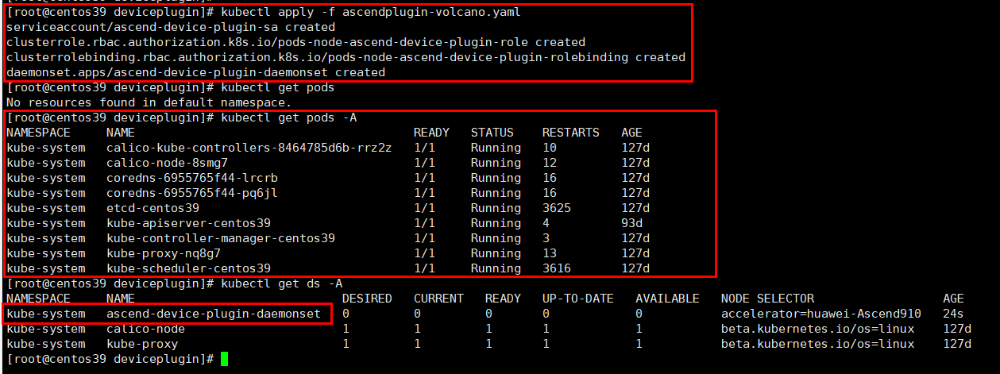

**原因分析<a name="zh-cn_topic_0000001497524633_section826014241546"></a>**

该节点可能缺少Ascend Device Plugin对应的标签，安装Ascend Device Plugin的节点必须要有“**accelerator=huawei-Ascendxxx**”标签，如：**accelerator=huawei-Ascend910**。

**解决措施<a name="zh-cn_topic_0000001497524633_section6276540648"></a>**

使用kubectl命令，参考[创建节点标签](./installation_guide.md#创建节点标签)中“节点对应的标签信息”表给节点打上对应标签。

## 日志出现connecting to container runtime failed<a name="ZH-CN_TOPIC_0000002479386406"></a>

**问题描述<a name="zh-cn_topic_0000001447124820_section11130457101417"></a>**

通过调用NPU Exporter的Metrics接口（http://_ip:port_/metrics），没有获取到NPU容器的相关信息。查看组件的日志，日志中有如下内容。

```
failed to init devices parser: connecting to container runtime failed: context deadline exceeded
```

**原因分析<a name="zh-cn_topic_0000001447124820_section25715114151"></a>**

NPU Exporter启动参数“-containerd”和“-endpoint”默认配置的socket文件路径不正确，该文件在不同操作系统下位置可能不同。

**解决措施<a name="zh-cn_topic_0000001447124820_section51310561518"></a>**

-   NPU Exporter的启动参数为“-containerMode=docker”；表示K8s使用Docker作为容器运行时，需要根据Docker作为容器运行时来配置“-containerd”和“-endpoint”参数。可参考[表1](#zh-cn_topic_0000001447124820_table248215493284)确认socket的位置，修改YAML挂载路径和NPU Exporter启动参数后，再重启服务。
-   NPU Exporter的启动参数为“-containerMode=containerd”时，操作与“-containerMode=docker”参数一致，同时还需要将YAML中name为“docker-shim”的挂载路径删除。

**表 1**  containerd和endpoint参数配置

|启动参数|容器模式|修改默认值|
|--|--|--|
|-containerd|若containerMode=docker，默认配置的socket文件路径为/var/run/docker/containerd/docker-containerd.sock；连接失败后，自动尝试连接：unix:///run/containerd/containerd.sock。若containerMode=containerd，默认配置的socket文件路径为/run/containerd/containerd.sock。|一般情况下该参数保持默认即可，除非用户自行修改了Containerd的sock文件路径，可通过**ps aux | grep "containerd.sock"**命令查询。|
|-endpoint|若containerMode=docker，将连接到Dockershim获取容器列表，默认配置的socket文件路径为/var/run/dockershim.sock；若containerMode=containerd，默认配置的socket文件路径为/run/containerd/containerd.sock。|一般情况下该参数保持默认即可，除非用户自行修改了Dockershim或者Containerd的sock文件路径。|


## 手动安装Volcano后，Pod状态为：CrashLoopBackOff<a name="ZH-CN_TOPIC_0000002511426385"></a>

**问题描述<a name="zh-cn_topic_0000001497524653_section11943134893010"></a>**

Volcano在运行时，其Pod状态为“CrashLoopBackOff”。

示例如下：

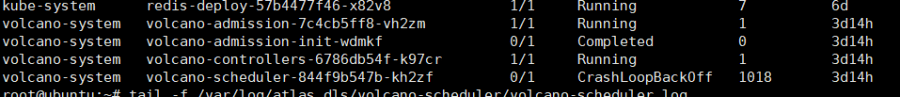

查看Volcano对应Pod的日志。

-   出现“permission denied”报错。

    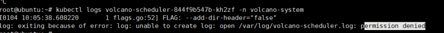

-   streamwatcher.go等待超时。

    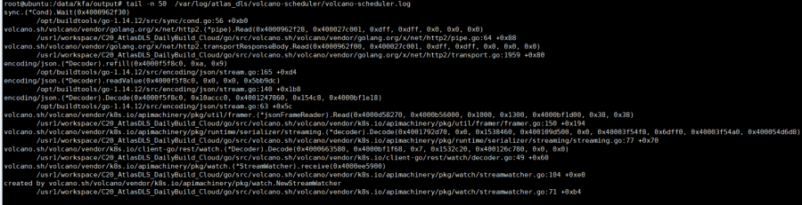

**原因分析<a name="zh-cn_topic_0000001497524653_section1968145716302"></a>**

手动安装时，Volcano的日志权限不对。


**解决措施<a name="zh-cn_topic_0000001497524653_section1583914319315"></a>**

-   执行以下命令，为volcano-controller组件重新设置Volcano日志目录属组和权限。

    ```
    chown -R hwMindX:hwMindX /var/log/mindx-dl/volcano-controller
    chmod 750 /var/log/mindx-dl/volcano-controller
    chmod 640 /var/log/mindx-dl/volcano-controller/volcano-controller.log
    ```

-   执行以下命令，为volcano-scheduler组件重新设置Volcano日志目录属组和权限。

    ```
    chown -R hwMindX:hwMindX /var/log/mindx-dl/volcano-scheduler
    chmod 750 /var/log/mindx-dl/volcano-scheduler
    chmod 640 /var/log/mindx-dl/volcano-scheduler/volcano-scheduler.log
    ```

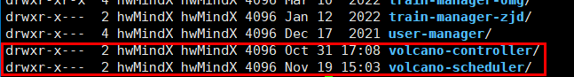

等待Pod恢复或删除有问题的Pod。

## Volcano组件工作异常，日志出现Failed to get plugin<a name="ZH-CN_TOPIC_0000002479386372"></a>

**问题描述<a name="zh-cn_topic_0000001446805012_section23959345610"></a>**

Volcano的Pod  volcano-scheduler-xxxx状态为Running，但是出现调度异常。查看volcano-scheduler的日志，日志中出现如下信息。

```
E1026 10:55:44.995088       1 framework.go:38] Failed to get plugin volcano-npu_v{version}_linux-aarch64
```

**原因分析<a name="zh-cn_topic_0000001446805012_section2075214152580"></a>**

Volcano的启动YAML中指定了使用的调度插件的名称。

```
...
# Source: volcano/templates/scheduler.yaml
apiVersion: v1
kind: ConfigMap
metadata:
  name: volcano-scheduler-configmap
  namespace: volcano-system
data:
  volcano-scheduler.conf: |
    actions: "enqueue, allocate, backfill"
    tiers:
    - plugins:
      - name: priority
      - name: gang
      - name: conformance
      - name: volcano-npu_v{version}_linux-aarch64  # 调度插件名称
    - plugins:
      - name: drf
      - name: predicates
...
```

制作镜像时拷贝了当前目录下的调度插件so文件到容器内，供volcano-scheduler使用。

```
FROM alpine:latest

COPY vc-scheduler /vc-scheduler
COPY volcano-npu_*.so plugins/
...
```

如果拷贝到容器内供volcano-scheduler使用的调度插件的名称与YAML中配置的不一致，会导致“Failed to get plugin”错误。

**解决措施<a name="zh-cn_topic_0000001446805012_section2880151056"></a>**

1.  使用配套的YAML和调度插件so文件，重新制作volcano-scheduler的镜像。
2.  卸载Volcano，再重新安装Volcano。

## Ascend Operator日志打印Failed to watch \*v1alpha1.Job<a name="ZH-CN_TOPIC_0000002511426321"></a>

**问题描述<a name="zh-cn_topic_0000001497364825_section10651143572620"></a>**

Ascend Operator日志出现如下内容。

```
E1024 19:45:08.438884       6 reflector.go:127] K8s.io/client-go@v1.19.4-h4/tools/cache/reflector.go:156: Failed to watch *v1alpha1.Job: the server could not find the requested resource (get jobs.batch.volcano.sh)
E1024 19:45:09.464318       6 reflector.go:127] K8s.io/client-go@v1.19.4-h4/tools/cache/reflector.go:156: Failed to watch *v1alpha1.Job: failed to list *v1alpha1.Job: the server could not find the requested resource (get jobs.batch.volcano.sh)
```

**原因分析<a name="zh-cn_topic_0000001497364825_section165111851172717"></a>**

未安装Volcano。

**解决措施<a name="zh-cn_topic_0000001497364825_section16920131712816"></a>**

安装Volcano组件后即可自动解决，日志不再打印错误内容。

## NPU Exporter检查动态路径失败，日志出现check uid or mode failed<a name="ZH-CN_TOPIC_0000002511426333"></a>

**问题描述<a name="zh-cn_topic_0000001497364825_section10651143572620"></a>**

1.  执行**kubectl get pod -A | grep npu-exporter**命令，显示NPU Exporter的容器镜像启动失败。

    ```
    npu-exporter     npu-exporter-rtgpg                         0/1     CrashLoopBackOff   2          39s
    ```

2.  执行**kubectl logs -fn npu-exporter npu-exporter-rtgpg**查看报错信息，日志显示信息如下**。**

    ```
    [INFO]     2023/10/24 09:55:04.454169 1       hwlog/api.go:108    npu-exporter.log's logger init success
    [INFO]     2023/10/24 09:55:04.454389 1       npu-exporter/main.go:205    listen on: 0.0.0.0
    [INFO]     2023/10/24 09:55:04.454607 1       npu-exporter/main.go:325    npu exporter starting and the version is v{version}_linux-aarch64
    2023/10/24 09:55:04 command exec failed, &exec.ExitError{ProcessState:(*os.ProcessState)(0x4000495c80), Stderr:[]uint8(nil)}
    [ERROR]    2023/10/24 09:55:04.458386 1       devmanager/devmanager.go:83    deviceManager init failed, prepare dcmi failed, err: &errors.errorString{s:"cannot found valid driver lib, fromEnv: lib path is invalid, [/usr/local: check uid or mode failed; /usr/local: check uid or mode failed;], fromLdCmd: can't find valid lib"}
    [ERROR]    2023/10/24 09:55:04.458589 1       collector/npu_collector.go:136    new npu collector failed, error is auto init failed, err: get chip info failed, err: device Manager is nil, may encounter an exception during initialization. You can check the system log to confirm
    [ERROR]    2023/10/24 09:55:04.458678 1       npu-exporter/main.go:329    register prometheus failed
    ```

**原因分析<a name="zh-cn_topic_0000001497364825_section165111851172717"></a>**

容器镜像内“/usr/local“目录权限不正确。

**解决措施<a name="zh-cn_topic_0000001497364825_section16920131712816"></a>**

1.  在NPU Exporter的安装路径下，执行以下命令，获取容器镜像ID。

    ```
    docker ps -a | grep npu-exporter
    ```

    回显示例如下，**15bca02e16e9**即为所需容器镜像ID。

    ```
    37a084a19207   15bca02e16e9                                                        "/bin/bash -c -- 'um…"   25 seconds ago       Exited (0) 24 seconds ago                                                                                          k8s_npu-exporter_npu-exporter-rtgpg_npu-exporter_2fa00320-fd40-4b1a-81d0-145a26a8f4e1_4
    2dbb86d6619f   k8s.gcr.io/pause:3.2                                                "/pause"                 About a minute ago   Up About a minute                                                                                                  k8s_POD_npu-exporter-rtgpg_npu-exporter_2fa00320-fd40-4b1a-81d0-145a26a8f4e1_0
    ```

2.  执行以下命令，查看镜像信息。

    ```
    docker images | grep 15bca02e16e9
    ```

    回显示例如下。

    ```
    npu-exporter                                                      v{version}                      15bca02e16e9   3 minutes ago    93.2MB
    ```

3.  依次执行以下命令，检查问题目录的权限。

    ```
    docker run -it 15bca02e16e9 bash
    ll /usr/
    ```

    回显示例如下，local/目录即为权限不正确的目录。

    ```
    total 44
    drwxr-xr-x  1 root root 4096 Oct 19  2022 ./
    drwxr-xr-x  1 root root 4096 Oct 24 09:58 ../
    drwxr-xr-x  2 root root 4096 Oct 19  2022 bin/
    drwxr-xr-x  2 root root 4096 Apr 24  2018 games/
    drwxr-xr-x  2 root root 4096 Apr 24  2018 include/
    drwxr-xr-x 10 root root 4096 Oct 19  2022 lib/
    drwxrwxrwx  1 root root 4096 Oct 19  2022 local/
    drwxr-xr-x  2 root root 4096 Oct 19  2022 sbin/
    drwxr-xr-x 33 root root 4096 Oct 19  2022 share/
    drwxr-xr-x  2 root root 4096 Apr 24  2018 src/
    ```

4.  执行以下命令，修改目录权限。

    ```
    root@493a58982af9:/# chmod 755 /usr/local
    root@493a58982af9:/# ll /usr/
    ```

    >[!NOTE] 说明 
    >493a58982af9为容器ID。

    回显示例如下，表示权限已正确设置。

    ```
    total 44
    drwxr-xr-x  1 root root 4096 Oct 19  2022 ./
    drwxr-xr-x  1 root root 4096 Oct 24 09:58 ../
    drwxr-xr-x  2 root root 4096 Oct 19  2022 bin/
    drwxr-xr-x  2 root root 4096 Apr 24  2018 games/
    drwxr-xr-x  2 root root 4096 Apr 24  2018 include/
    drwxr-xr-x 10 root root 4096 Oct 19  2022 lib/
    drwxr-xr-x  1 root root 4096 Oct 19  2022 local/
    drwxr-xr-x  2 root root 4096 Oct 19  2022 sbin/
    drwxr-xr-x 33 root root 4096 Oct 19  2022 share/
    drwxr-xr-x  2 root root 4096 Apr 24  2018 src/
    ```

5.  执行以下命令，退出容器。

    ```
    root@493a58982af9:/# exit
    ```

6.  使用容器ID和镜像名加tag，提交容器修改。

    ```
    docker commit 493a58982af9 npu-exporter:v{version}
    ```

    回显示例如下。

    ```
    sha256:34a360670e213cc8817b352a055969e620ed15ac7d26dcbO5e391f0a4ad2682a
    ```

7.  重新查看NPU Exporter的容器镜像状态。

    ```
    kubectl get po -A | grep npu-exporter
    ```

    >[!NOTE] 说明 
    >可以等待容器自动重启或者手动强制重启，查看容器镜像状态。

    回显示例如下，表示NPU Exporter的容器镜像已正常运行。

    ```
    npu-exporter     npu-exporter-rtgpg                         1/1     Running   7         10m
    ```

8.  执行以下命令，删除已创建的容器副本。

    ```
    docker rm 493a58982af9
    ```

    回显示例如下。

    ```
    493a58982af9
    ```

# 使用时出现的故障<a name="ZH-CN_TOPIC_0000002479226492"></a>


## 故障定位流程<a name="ZH-CN_TOPIC_0000002479226398"></a>

一般情况下，故障处理均需经历“收集信息 \> 定位故障 \> 排除故障”三个阶段。在收到告警信息后，通过收集故障现象信息、分析故障原因、定位故障、排除故障后，才可使业务恢复正常。常见的故障处理流程请参见[图1](#fig16356123319514)。

**图 1**  故障处理<a name="fig16356123319514"></a>  
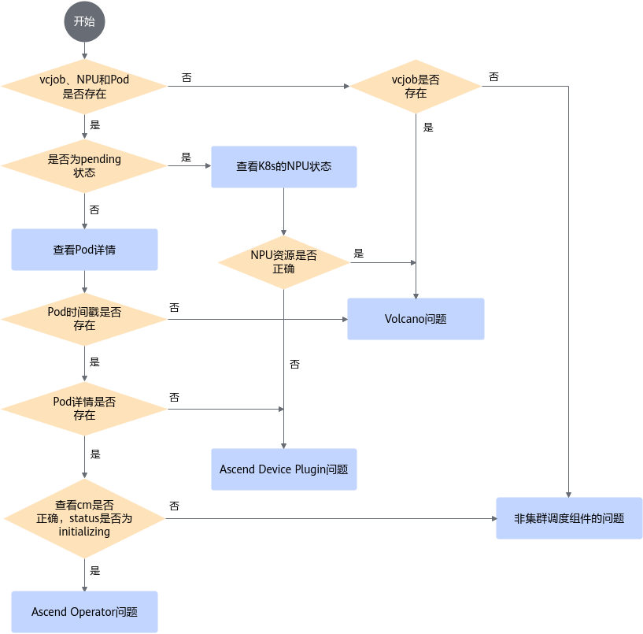

## kubelet重启后，NPU Exporter无法获取当前容器信息<a name="ZH-CN_TOPIC_0000002511346365"></a>

**问题现象描述<a name="zh-cn_topic_0000001497124765_section497987175715"></a>**

当用户重启kubelet后，发现NPU Exporter没有上报容器的相关信息。

**原因分析<a name="zh-cn_topic_0000001497124765_section3798104023112"></a>**

kubelet重启后会重新创建新dockershim.sock文件，但是NPU Exporter获取的是旧dockershim.sock文件，导致无法获取当前容器的数据信息。

**解决措施<a name="zh-cn_topic_0000001497124765_section52095015218"></a>**

选择以下方式之一进行处理。

-   方式一：无需手动处理。

    kubelet重启后，容器会自动退出，由K8s重新拉起容器后，NPU Exporter即可正常获取容器信息。容器拉起期间（大约10s），NPU Exporter会丢失所有数据信息。

-   方式二：执行以下命令，在kubelet重启时，手动删除容器。

    ```
    kubectl delete pod -n npu-exporter <npu-exporter-podname>
    ```

    >[!NOTE] 说明 
    >删除容器后，容器会被重新拉起（大约10s），NPU Exporter会丢失期间所有数据信息。

-   方式三：挂载dockershim.sock文件的目录。
    1.  在NPU Exporter启动YAML所在路径，执行以下命令，打开YAML。

        ```
        vi npu-exporter-v{version}.yaml
        ```

    2.  在NPU Exporter启动YAML中，删除以下挂载路径。

        ```
        ...
                volumeMounts:
                  - name: log-npu-exporter
        ...
                  - name: sys
                    mountPath: /sys
                    readOnly: true
                  - name: docker-shim                        # 删除以下字段                                          
                    mountPath: /var/run/dockershim.sock
                    readOnly: true
                  - name: docker 
                    mountPath: /var/run/docker
                    readOnly: true
                  - name: cri-dockerd 
                    mountPath: /var/run/cri-dockerd.sock
                    readOnly: true
        ...
              volumes:
                - name: log-npu-exporter
        ...
                - name: sys
                  hostPath:
                    path: /sys
                - name: docker-shim                    # 删除以下字段
                  hostPath:   
                    path: /var/run/dockershim.sock
                - name: docker 
                  hostPath:
                    path: /var/run/docker
                - name: cri-dockerd 
                  hostPath:
                    path: /var/run/cri-dockerd.sock
         ...
        ```

    3.  在NPU Exporter启动YAML，新增dockershim.sock文件的挂载目录。

        ```
        ...
                volumeMounts:
                  - name: log-npu-exporter
        ...
                  - name: sys
                    mountPath: /sys
                    readOnly: true
                  - name: sock
                    mountPath: /var/run        # 以实际的dockershim.sock文件目录为准
        ...
              volumes:
                - name: log-npu-exporter
        ...
                - name: sys
                  hostPath:
                    path: /sys
                - name: sock
                  hostPath:
                    path: /var/run                    # 以实际的dockershim.sock文件目录为准
                - name: containerd  
                  hostPath:
                    path: /run/containerd
        ...
        ```

## hccl.json文件没有生成<a name="ZH-CN_TOPIC_0000002511346399"></a>

**问题现象描述<a name="zh-cn_topic_0000001497124765_section497987175715"></a>**

当启动一个训练任务后，训练任务容器内部hccl.json文件处于initializing状态（文件默认路径：“/user/serverid/devindex/config/hccl.json”）。

执行**kubectl exec -it** _XXX_ **bash**命令进入容器，若Pod不在default命名空间，则需要加**-n** _XXX_指明命名空间，如：**kubectl exec -it** _XXX_ **-n **_XXX_** bash**。

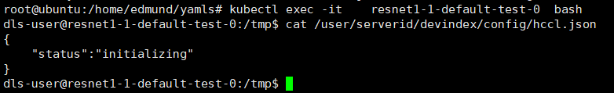

**原因分析<a name="zh-cn_topic_0000001497124765_section3798104023112"></a>**

-   原因一：Ascend Operator没有正常启动。
-   原因二：Ascend Device Plugin启动参数配置了“-volcanoType=false”，可通过如下命令进行确认。

    ```
    ps -ef | grep "device-plugin"
    ```

-   原因三：若Ascend Device Plugin组件日志出现如下内容，表示Ascend Device Plugin没有正确获取到device ip导致无法写Pod的Annotations。

    ```
    Get device ip failed
    ```

**解决措施<a name="zh-cn_topic_0000001497124765_section52095015218"></a>**

针对原因一：参考[安装Ascend Operator](./installation_guide.md#ascend-operator)章节，重新安装Ascend Operator。

针对原因二：参考[Ascend Device Plugin](./installation_guide.md#ascend-device-plugin)章节，修改Ascend Device Plugin的启动参数“-volcanoType=true”之后再重新apply对应的YAML文件。

针对原因三：正确配置device ip，请参见《MindCluster Ascend Deployer用户指南》中的“使用HCCN Tool工具配置”章节。

## K8s配置CPU绑核后无法使用npu-smi info<a name="ZH-CN_TOPIC_0000002479226454"></a>

**问题现象描述<a name="zh-cn_topic_0000001447124960_section57677224474"></a>**

在Atlas 800 推理服务器（型号 3000）（ARM），操作系统CentOS  7.6上，使用K8s（版本1.12）进行NPU相关业务调度。配置K8s的参数 --kube-reserved=cpu=2,memory=250Mi --cpu-manager-policy=static --feature-gates=CPUManager=true，开启K8s的绑核，绑核后执行npu-smi info，报错如下所示。

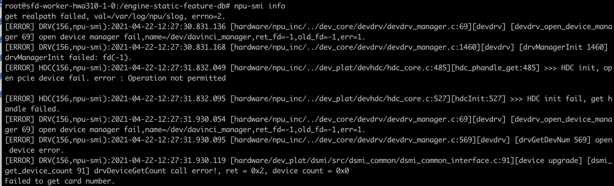

**原因分析<a name="zh-cn_topic_0000001447124960_section126373345478"></a>**

默认情况下kubelet创建的Pod都是通过CFS配额的方式来分配使用物理机的CPU资源。cpu manager启动时，如果显示none cpu manager policy，就直接返回；如果是static cpu manager则会启动一个goroutine做reconcile。

-   在reconcileState方法中，cm会不停地通过GetCPUSetOrDefault方法获取容器的cpu set，并更新容器的cpu set。
-   GetCPUSetOrDefault方法根据containerID获取cpu set，如果Pod是一个guaranteed pod，返回该容器的cpu set；否则返回default值。default值的含义是：“除了guaranteed pod分配走的CPU  core外，其余的CPU  core都在default值里”，因此所有的容器在运行过程中都会定时、动态地更新cpu set值。

Ascend Docker Runtime将昇腾驱动库的so文件和NPU设备信息通过文件挂载的方式挂载到容器中，并添加cgroup访问权限。而挂载的过程中，没有将这部分信息同步给Docker Engine。runC在update过程中调用device Set方法，根据容器的cgroup config中的内容重新调整device相关的文件，在这个过程中，就会丢失挂载时添加的cgroup访问权限。

**解决措施<a name="zh-cn_topic_0000001447124960_section162077344815"></a>**

Ascend Device Plugin插件自身可以进行（/dev/davinciX  /dev/davinci\_manager /dev/devmm\_svm）挂载，使用Ascend Device Plugin挂载覆盖Ascend Docker Runtime挂载，可以保证cgroup访问权限不丢失。用户可以修改Ascend Device Plugin驱动参数“-useAscendDocker=false”，再重新安装Ascend Device Plugin。

## 训练任务处于Pending状态，原因：nodes are unavailable<a name="ZH-CN_TOPIC_0000002511426297"></a>

**问题现象描述<a name="zh-cn_topic_0000001497364977_zh-cn_topic_0301034101_section642013366172"></a>**

下发vcjob任务后，训练任务一直未运行。

1.  执行**kubectl get pod --all-namespaces**命令，查看该训练任务所属的Pod处于**Pending**状态，如下图所示。

    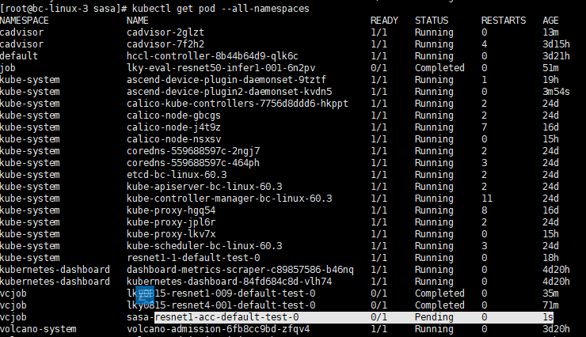

2.  执行**kubectl describe pod sasa-resnet1-acc-default-test-0**_ _**-n vcjob**命令，查看Pod的详情。在event字段中报：all nodes are unavailable: 1 node annotations\(7\) not same node idle\(8\)。

    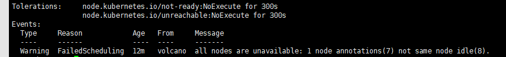

**原因分析<a name="zh-cn_topic_0000001497364977_zh-cn_topic_0301034101_section713221171813"></a>**

该节点的未使用NPU数目与Annotations中展示的未使用NPU数目不一致。Volcano认为系统处于不稳定阶段，不能进行本次NPU资源的分配。

执行**kubectl describe nodes**命令，查看节点的Allocated resources和Annotations的huawei.com/Ascend910字段。

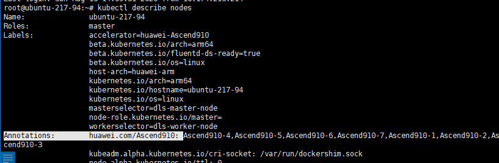

造成该问题的原因，除了任务量特别多导致K8s运行缓慢之外，主要是Ascend Device Plugin的启动方式存在问题。

**解决措施<a name="zh-cn_topic_0000001497364977_zh-cn_topic_0301034101_section104361016141818"></a>**

重新安装Ascend Device Plugin，请参见[Ascend Device Plugin](./installation_guide.md#ascend-device-plugin)章节进行操作。

## df -h执行失败，NFS启动失败<a name="ZH-CN_TOPIC_0000002511426357"></a>

**问题现象描述<a name="zh-cn_topic_0000001497205469_section1313159114111"></a>**

1.  执行**df -h**卡住。

    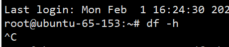

2.  使用**strace df -h**查看卡住的地方。显示如下：

    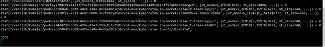

3.  重启NFS服务。显示如下信息：

    ```
    [....] Restarting nfs-kernel-server (via systemctl): nfs-kernel-server.serviceJob for nfs-server.service canceled
    failed!
    ```

**原因分析<a name="zh-cn_topic_0000001497205469_section12451158135520"></a>**

1.  查看NFS的共享配置。

    ```
    cat /etc/exports
    ```

    

2.  查看对应的共享目录。

    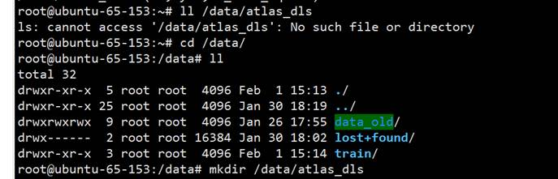

**解决措施<a name="zh-cn_topic_0000001497205469_section10951347902"></a>**

1.  创建对应的目录。

    ```
    mkdir /data/atlas_dls
    ```

2.  重启NFS服务。

    ```
    sudo /etc/init.d/nfs-kernel-server start
    ```

    

3.  执行**df -h**查看。

    执行成功。

    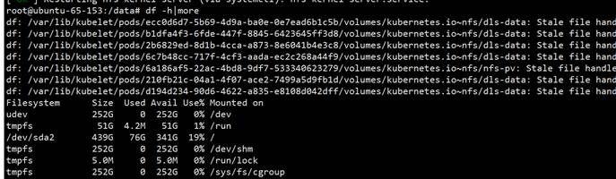

## 手动删除vcjob后Pod一直处于Terminating状态<a name="ZH-CN_TOPIC_0000002479386450"></a>

**问题现象描述<a name="zh-cn_topic_0000001497364913_section1769914599113"></a>**

使用**kubectl delete -f **_xxx_**.yaml**删除vcjob后Pod一直处于Terminating状态。

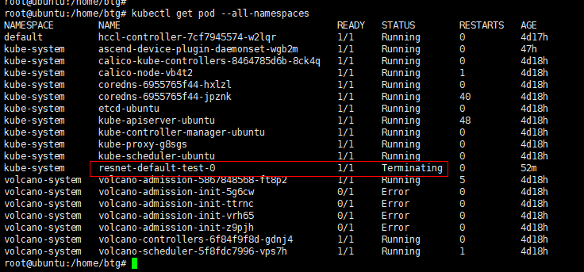

**原因分析<a name="zh-cn_topic_0000001497364913_section2053213310228"></a>**

设置了比较长的优雅退出的超时时间，导致删除任务后，任务的Pod长时间处于Terminating状态。

**解决措施<a name="zh-cn_topic_0000001497364913_section18420165910437"></a>**

方法一：卸载Pod的NFS挂载路径

1.  执行以下命令，查看Pod的NFS挂载路径。

    ```
    mount|grep NFS共享IP地址
    ```

    **图 1**  查询结果<a name="zh-cn_topic_0000001497364913_fig1050042718447"></a>  
    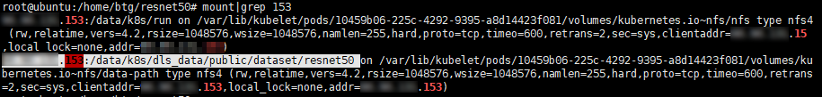

    如图，“xxx.xxx.xxx.xxx:/data/k8s/run“和“xxx.xxx.xxx.xxx:/data/k8s/dls\_data/public/dataset/resnet50“即为该Pod的NFS挂载路径。

2.  执行以下命令，卸载该Pod的所有NFS挂载路径。

    ```
    umount -f NFS挂载路径
    ```

3.  执行以下命令，查看Pod的NFS挂载路径是否已卸载。

    ```
    mount|grep NFS共享IP地址
    ```

    -   是，任务结束。
    -   否，请执行[方法二](#zh-cn_topic_0000001497364913_li12232145564418)。

方法二：删除Pod所属的Docker进程

1.  <a name="zh-cn_topic_0000001497364913_li12232145564418"></a>执行以下命令，查看Pod所属的Docker进程。

    ```
    docker ps |grep Pod名称
    ```

2.  执行以下命令，查看Docker进程占用的文件。

    ```
    ll /var/lib/docker/containers |grep Docker进程号
    ```

    查询结果示例如下。

    ```
    root@ubuntu:/data/k8s/run# ll /var/lib/docker/containers |grep 95aeeafe2db8
    drwx------ 4 root root 4096 Jun 24 16:00 95aeeafe2db898065094dd34dbfbeca04734d5248316aa802d43a36b4d8b99df/
    ```

3.  执行以下命令，删除Docker进程占用的文件。

    ```
    rm -rf /var/lib/docker/container/95aeeafe2db898065094dd34dbfbeca04734d5248316aa802d43a36b4d8b99df/
    ```

4.  <a name="zh-cn_topic_0000001497364913_li723275544411"></a>执行以下命令，查询Docker占用文件的进程ID。

    ```
    lsof |grep 95aeeafe2db8
    ```

    **图 2**  查询结果<a name="zh-cn_topic_0000001497364913_fig11232135584416"></a>  
    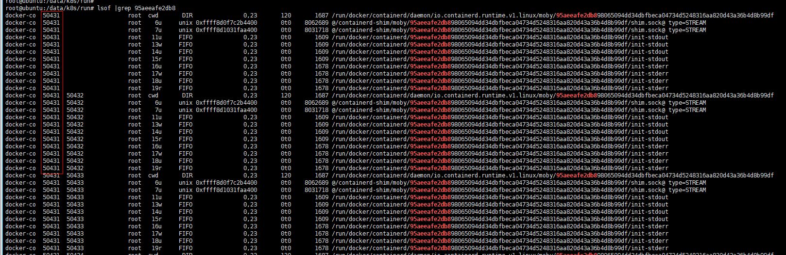

5.  执行以下命令，结束进程。

    ```
    kill -9 进程ID
    ```

6.  执行以下命令，查看进程是否已删除。

    ```
    ps -ef | grep 进程ID
    ```

    -   是，请执行[7](#zh-cn_topic_0000001497364913_li1223385564420)。
    -   否，请参考[4](#zh-cn_topic_0000001497364913_li723275544411)再次查询并结束进程后执行[7](#zh-cn_topic_0000001497364913_li1223385564420)。

7.  <a name="zh-cn_topic_0000001497364913_li1223385564420"></a>执行以下命令，删除Pod所属的Docker。

    ```
    docker rm 95aeeafe2db8
    ```

    删除之后需要等待约1分钟才能再次查看Pod信息。

## 资源不足时，任务处于Pending状态<a name="ZH-CN_TOPIC_0000002511346383"></a>

**问题现象描述<a name="zh-cn_topic_0000001447284728_section882219610200"></a>**

使用Volcano进行任务调度时，若申请的资源大于当前环境可用资源，任务将不会被调度，同时其状态会被置为Pending。若申请的资源大于集群所拥有的资源上限时，任务则会一直处于Pending状态。

以自定义命名空间mindx-test的“mindx-dls-npu-16p”任务为例进行说明（该任务在集群只有8个NPU的情况下，申请16个NPU）。

执行以下命令，查看任务详情：

```
kubectl describe vcjob -n mindx-test mindx-dls-npu-16p
```

回显示例如下：

```
Name:         mindx-dls-npu-16p
Namespace:    mindx-test
Labels:       ring-controller.atlas=ascend-910
...
  Min Available:  2
  ...
    Replicas:  2
    ...
          Resources:
            Limits:
              Cpu:                   10
              huawei.com/Ascend910:  8
              Memory:                20Gi
            Requests:
              Cpu:                   10
              huawei.com/Ascend910:  8
              Memory:                20Gi
...
Status:
  Controlled Resources:
    Plugin - Env:  env
    Plugin - Ssh:  ssh
    Plugin - Svc:  svc
  Min Available:   2
  State:
    Last Transition Time:  2021-02-09T07:38:04Z
    Phase:                 Pending
Events:                    <none>
```

由此可见该任务处于Pending状态。

**原因分析<a name="zh-cn_topic_0000001447284728_section109992019182012"></a>**

资源不够，volcano-scheduler未将任务终止。

**解决措施<a name="zh-cn_topic_0000001447284728_section1755294417536"></a>**

1.  在调用前请确保资源充足。
2.  若任务已经下发，并且处于Pending状态，可使用**kubectl get vcjob -n **_**namespace**_找到任务。

    ```
    root@ubuntu:/home/yaml# kubectl get vcjob -n mindx-test
    NAME                AGE
    mindx-dls-npu-16p   6m10s
    ```

3.  执行**kubectl delete vcjob** _mindx-dls-npu-16p__ _**-n** _namespace_命令，删除该vcjob。

    ```
    root@ubuntu:/home/yaml# kubectl delete vcjob mindx-dls-npu-16p -n mindx-test
    job.batch.volcano.sh "mindx-dls-npu-16p" deleted
    ```

    >[!NOTE] 说明 
    >-   mindcluster-dls-npu-16p：vcjob的任务名字。
    >-   mindcluster-test：该任务所属的namespace名称。

## 任务容器未成功挂载NPU<a name="ZH-CN_TOPIC_0000002479226448"></a>

**问题现象描述<a name="zh-cn_topic_0000001447284844_section11717472432"></a>**

在任务容器中，执行如下命令，系统无回显信息。此时表明容器内没有挂载上NPU设备。

```
ls /dev/davinci*
```

**原因分析<a name="zh-cn_topic_0000001447284844_section19475311104419"></a>**

Ascend Device Plugin的启动参数“useAscendDocker”默认为true，该参数表示Ascend Device Plugin需要配合Ascend Docker Runtime一起使用。若存在以下场景，可能导致Ascend Device Plugin配合Ascend Docker Runtime使用失败。

-   原因一：环境未安装Ascend Docker Runtime。
-   原因二：已安装Ascend Docker Runtime，但是未重启Docker服务。

**解决措施<a name="zh-cn_topic_0000001447284844_section7159142312466"></a>**

针对原因一：参考[Ascend Docker Runtime](./installation_guide.md#ascend-docker-runtime)安装Ascend Docker Runtime工具，然后重启Docker服务，删除旧任务，再重新下发任务。

针对原因二：重启Docker服务，删除旧任务，再重新下发任务。

Ascend Docker Runtime能够主动将指定的NPU挂载到容器内，可通过如下命令查询Docker的配置。

```
docker info 2>&1 | grep "Default Runtime"
```

回显信息中有“ascend”表示Docker使用了Ascend Docker Runtime，示例如下。

```
Default Runtime: ascend
```

## 配置正确情况下，NPU芯片故障不能触发重调度特性<a name="ZH-CN_TOPIC_0000002479226482"></a>

**问题现象描述<a name="zh-cn_topic_0000001497205481_section3885106114"></a>**

在正确配置重调度特性时，偶现芯片故障不能触发重调度特性。

**原因分析<a name="zh-cn_topic_0000001497205481_section05700329113"></a>**

开源软件问题，节点上需要重启的Pod所用的NPU数量比Node节点本身Allocatable多（芯片故障后被减去，故之前能够分配成功），导致该Node在volcano-scheduler的缓存中设置为notReady，不能传递到ascend-volcano-plugin。从而导致故障不能触发重调度特性。

**解决措施<a name="zh-cn_topic_0000001497205481_section114751493117"></a>**

该问题出现的概率较低，若出现有如下处理方法：

方法一：手动删除Pod。进入系统后台，使用命令**kubectl delete pod -n  _pod所在namespace pod名称_**即可删除Pod。

方法二：重新下发任务。

## 任务被重调度后Pod状态不一致<a name="ZH-CN_TOPIC_0000002479386470"></a>

**问题现象描述<a name="section137278575440"></a>**

多节点集群环境，下发分布式训练任务，若此时资源刚好满足，并且开启任务重调度且重调度参数“fault-scheduling”设置为“grace”。此时，如果出现故障，触发重调度，则任务重调度后概率性出现一个Pod状态为Running和一个Pod状态为Pending的情况，若后续故障恢复，状态为Pending的Pod依然Pending。

**原因分析<a name="section1724825414483"></a>**

1.  该问题是开源代码中对任务数量的判断存在问题。

    当Pod被终止时，若容器中的脚本没有返回非0的值时（即返回0值时），则Pod的状态会显示为Success（K8s机制）。此时该Pod正在释放资源，Volcano调度器则会将该Pod（未重启）算作是已经重启且状态为Success。这种情况下，刚好满足Volcano的Gang调度插件的机制，先重启的Pod会进入创建阶段。后面，当正在终止的Pod结束并重新拉起时，则会由于资源不足进入Pending状态。

2.  未使用断点续训的脚本。
3.  集群资源不够。

**解决措施<a name="section48021377576"></a>**

-   执行以下命令，手动删除已运行的Pod。

    ```
    kubectl delete pod -n pod所在的namespace pod名称
    ```

-   删除该任务重新下发。

## 使用动态虚拟化时，以普通用户运行推理业务失败<a name="ZH-CN_TOPIC_0000002479226410"></a>

**问题现象描述<a name="section464141513199"></a>**

在Atlas 推理系列产品上部署Ascend Device Plugin和Volcano组件并开启动态虚拟化开关，下发任务后虚拟设备创建成功，但推理任务运行失败。

**原因分析<a name="section1695714177204"></a>**

推理任务容器使用普通用户运行，会出现以下问题，最终导致普通用户访问root属组的vNPU设备失败，从而导致推理业务容器运行失败。

-   物理机上通过特权容器调用接口创建的vNPU为root属组，该vNPU在特权容器内“/dev“目录下不可见。
-   驱动接口创建vNPU后默认为root属组，特权容器内就无法修改新创建的vNPU属组为非root。

**解决措施<a name="section51910589213"></a>**

在Ascend Device Plugin组件的启动YAML中挂载“/dev“，示例如下。

```
command: [ "/bin/bash", "-c", "--"]
         args: [ "device-plugin  -useAscendDocker=true -volcanoType=true
                  -logFile=/var/log/mindx-dl/devicePlugin/devicePlugin.log -logLevel=0" ]
         securityContext:
           privileged: true
           readOnlyRootFilesystem: true
         imagePullPolicy: Never
         volumeMounts:
           - name: device-plugin
             mountPath: /var/lib/kubelet/device-plugins
...                                         # 此处省略若干字段
           - name: tmp
             mountPath: /tmp
           - name: dev
            mountPath: /dev            # 在此处挂载/dev
         env:
           - name: NODE_NAME
             valueFrom:
               fieldRef:
                 fieldPath: spec.nodeName
       volumes:
         - name: device-plugin
           hostPath:
             path: /var/lib/kubelet/device-plugins
...                                      # 此处省略若干字段
         - name: tmp
           hostPath:
             path: /tmp
        - name: dev                   # 在此处挂载/dev
          hostPath:
            path: /dev
```

## 使用Volcano  v1.7.0版本，无法查询Pod状态<a name="ZH-CN_TOPIC_0000002511426367"></a>

**问题现象描述<a name="section481153716213"></a>**

使用Volcano  v1.7.0版本时，若当前环境资源不足，使用**kubectl get pod --all-namespaces -o wide**命令查询Pod状态失败。

**原因分析<a name="section18260161012620"></a>**

使用Volcano  v1.7.0版本时，当资源不足时，Pod将不会被创建，无法查询Pod状态。

**解决措施<a name="section645141891110"></a>**

1.  可以通过以下命令查询所有PodGroup信息，找到任务对应的PodGroup。

    ```
    kubectl get pg -A
    ```

    回显示例如下：

    ```
    NAMESPACE   NAME                                                  STATUS    MINMEMBER   RUNNINGS   AGE
    vcjob       mindx-xxx-16-p-4bf232e4-bd48-438d-9089-02bfef354fce   Inqueue   1                      5m32s
    vcjob       mindx-xxx-2-p-8bf7f0f6-8a7e-4621-a0d0-cafa56785914    Pending   1                      5m15s
    ```

    >[!NOTE] 说明 
    >-   若“STATUS“字段显示为“Inqueue“状态时，表示此时Pod已经创建，可以查询Pod状态。
    >-   若“STATUS“字段显示为“Pending“，表示当前Pod创建失败，需要执行[步骤2](#li969719487913)进一步确认具体问题。

2.  <a name="li969719487913"></a>执行以下命令，查询对应PodGroup的详细信息。

    ```
    kubectl describe pg -n <namespace> <podgroup-name>
    ```

    _<namespace\>和__<podgroup-name\>_需要用实际的命名空间和PodGroup名称进行替换。

    示例命令如下。

    ```
    kubectl describe pg -n vcjob mindx-xxx-2-p-8bf7f0f6-8a7e-4621-a0d0-cafa56785914
    ```

    回显示例如下，该回显示例表示queue资源配额不足。

    ```
    Name:         mindx-xxx-2-p-8bf7f0f6-8a7e-4621-a0d0-cafa56785914
    Namespace:    vcjob
    Labels:       fault-scheduling=force
                  ring-controller.atlas=ascend-{xxx}b
    Annotations:  kubectl.kubernetes.io/last-applied-configuration:
                    {"apiVersion":"batch.volcano.sh/v1alpha1","kind":"Job","metadata":{"annotations":{},"labels":{"fault-scheduling":"force","ring-controller....
    API Version:  scheduling.volcano.sh/v1beta1
    Kind:         PodGroup
    Metadata:
      Creation Timestamp:  2023-07-05T09:00:02Z
      Generation:          7
      Owner References:
        API Version:           batch.volcano.sh/v1alpha1
        Block Owner Deletion:  true
        Controller:            true
        Kind:                  Job
        Name:                  mindx-xxx-2-p
        UID:                   8bf7f0f6-8a7e-4621-a0d0-cafa56785914
      Resource Version:        17544644
      Self Link:               /apis/scheduling.volcano.sh/v1beta1/namespaces/vcjob/podgroups/mindx-xxx-2-p-8bf7f0f6-8a7e-4621-a0d0-cafa56785914
      UID:                     277cc974-5eec-455f-a860-25d7d19e8335
    Spec:
      Min Member:  1
      Min Resources:
        count/pods:                     1
        huawei.com/Ascend910:           2
        Pods:                           1
        requests.huawei.com/Ascend910:  2
      Min Task Member:
        Default - Test:  1
      Queue:             default
    Status:
      Conditions:
        Last Transition Time:  2023-07-05T09:05:46Z
        Message:               1/0 tasks in gang unschedulable: pod group is not ready, 1 minAvailable
        Reason:                NotEnoughResources
        Status:                True
        Transition ID:         33585c5e-d3ad-4bc4-be0c-c09bea59520e
        Type:                  Unschedulable
      Phase:                   Pending
    Events:
      Type     Reason         Age                     From     Message
      ----     ------         ----                    ----     -------
      Warning  Unschedulable  6m22s (x12 over 6m34s)  volcano  0/0 tasks in gang unschedulable: pod group is not ready, 1 minAvailable
      Normal   Unschedulable  93s (x280 over 6m34s)   volcano  queue resource quota insufficient   # queue资源配额不足
    ```

## 执行.sh脚本，报$'\\r': command not found异常<a name="ZH-CN_TOPIC_0000002479226516"></a>

**问题现象描述<a name="zh-cn_topic_0000001497124765_section497987175715"></a>**

执行.sh脚本，报$'\\r': command not found异常。

**原因分析<a name="zh-cn_topic_0000001497124765_section3798104023112"></a>**

Windows操作系统下的换行符为\\r\\n，Linux下的换行符是\\n。如果.sh脚本中有换行符在Windows操作系统上编写后，直接上传到Linux操作系统执行，由于Linux无法识别\\r命令，就会报$’\\r’: command not found异常。

**解决措施<a name="section1160894516313"></a>**

在Linux上执行**sed -i 's/\\r//' \*.sh**命令，删除.sh脚本中的\\r字符。

## 使用Volcano和Ascend Operator组件场景下，业务面故障的任务所有Pod的Status全部变为Failed，任务无法触发无条件重试重调度<a name="ZH-CN_TOPIC_0000002479226472"></a>

**问题现象描述<a name="zh-cn_topic_0000001447284844_section11717472432"></a>**

使用Volcano和Ascend Operator组件场景下，业务面故障的任务所有Pod的Status全部转变为Failed，任务无法触发无条件重试重调度。

**原因分析<a name="zh-cn_topic_0000001447284844_section19475311104419"></a>**

当前Volcano在业务面故障的任务所有Pod的Status全部转变为Failed时，会将任务设置为失败状态，默认不会拉起无条件重试重调度。

**解决措施<a name="section773610451937"></a>**

用户可自行修改Volcano源码和任务YAML，在所有Pod的Status全部转变为Failed后会发生无条件重试故障重调度。

1.  修改开源Volcano源代码“pkg/controllers/job/state/running.go“，增加“IgnoreAction“。

    ```
    func (ps *runningState) Execute(action v1alpha1.Action) error {
         switch action {
         case v1alpha1.RestartJobAction:
              return KillJob(ps.job, PodRetainPhaseNone, func(status *vcbatch.JobStatus) bool{
                  status.State.Phase = vcbatch.Restarting
                  status.RetryCount++
                  return true
              })
         case v1alpha1.AbortJobAction:
              return KillJob(ps.job, PodRetainPhasesoft, func(status *vcbatch.Jobstatus) bool {
                  status.State.Phase = vcbatch.Aborting
                  return true
              })
         case v1alpha1.TerminateJobAction:
              return KillJob(ps.job, PodRetainPhasesoft, func(status *vcbatch.Jobstatus) bool {
                  status.State.Phase = vcbatch.Terminating
                  return true
              })
         case v1alpha1.CompleteJobAction:
              return KillJob(ps.job, PodRetainPhaseSoft, func(status *vcbatch.JobStatus) bool {
                  status.State.Phase =vcbatch.Completing
                  return true
              })
         case v1alpha1.IgnoreAction:        //增加case v1alpha1.IgnoreAction代码
              return nil
    default:
    ```

2.  修改开源Volcano源代码“vendor/volcano.sh/apis/pkg/apis/bus/v1alpha1/actions.go“，增加“IgnoreAction“。

    ```
    IgnoreAction Action = "Ignore"
    ```

## 制作镜像时找不到对应的安装包<a name="ZH-CN_TOPIC_0000002479226510"></a>

**问题现象描述<a name="zh-cn_topic_0000001951418177_zh-cn_topic_0000001497124765_section497987175715"></a>**

制作镜像时找不到对应的安装包。

**原因分析<a name="zh-cn_topic_0000001951418177_zh-cn_topic_0000001497124765_section3798104023112"></a>**

PYTHONPATH的路径可能存在错误。

**解决措施<a name="zh-cn_topic_0000001951418177_section1160894516313"></a>**

如果已有安装包找不到依赖，检查PYTHONPATH是否正确，如**Python**3.7的路径为“/usr/local/python3.7.5/lib/python3.7/site-packages“。

## 执行盘古模型的训练任务时，报错提示No module named '\_sqlite3'<a name="ZH-CN_TOPIC_0000002479386418"></a>

**问题现象描述<a name="zh-cn_topic_0000001783889885_zh-cn_topic_0000001497124765_section497987175715"></a>**

执行盘古模型的训练任务时，报错提示No module named '\_sqlite3'。

**原因分析<a name="zh-cn_topic_0000001783889885_zh-cn_topic_0000001497124765_section3798104023112"></a>**

环境中缺少盘古镜像需要的sqlite3依赖，导致训练任务失败。

**解决措施<a name="zh-cn_topic_0000001783889885_section1160894516313"></a>**

1.  根据当前的操作系统类型，执行相应的安装命令，安装sqlite3依赖。
    -   Ubuntu

        ```
        sudo apt-get install libsqlite3-dev
        ```

    -   CentOS

        ```
        sudo yum install sqlite-devel
        ```

2.  执行以下命令，以Python  3.7.5为例，重新编译Python。
    1.  下载Python软件包。

        ```
        wget https://repo.huaweicloud.com/python/3.7.5/Python-3.7.5.tar.xz
        ```

    2.  将软件包进行解压。

        ```
        tar -xf Python-3.7.5.tar.xz && cd Python-3.7.5 && ./configure --prefix=/usr/local/python3.7.5 --enable-shared
        ```

    3.  执行以下命令进行安装。

        ```
         make && make install
        ```

## 执行PyTorch框架的训练任务时，提示找不到amp\_C<a name="ZH-CN_TOPIC_0000002511426287"></a>

**问题现象描述<a name="zh-cn_topic_0000001783889885_zh-cn_topic_0000001497124765_section497987175715"></a>**

开启watchdog功能后，下发PyTorch框架的训练任务，报错提示找不到amp\_C。

**原因分析<a name="zh-cn_topic_0000001783889885_zh-cn_topic_0000001497124765_section3798104023112"></a>**

镜像中找不到megatron\_npu路径。

**解决措施<a name="zh-cn_topic_0000001783889885_section1160894516313"></a>**

在train\_start.sh中新增以下加粗的环境变量，设置megatron\_npu在Python中的环境变量。

```
...
# env for breakpoint ckpt
export RESUME_MODE_ENABLE=1

export PYTHONPATH=$PYTHONPATH:MEGATRON_LM的路径/megatron_npu
```

## 同一芯片故障反复出现，导致训练任务中断反复进行重调度<a name="ZH-CN_TOPIC_0000002479386458"></a>

**问题现象描述<a name="zh-cn_topic_0000001783889885_zh-cn_topic_0000001497124765_section497987175715"></a>**

同一芯片故障反复出现，导致训练任务中断反复进行重调度。

**原因分析<a name="zh-cn_topic_0000001783889885_zh-cn_topic_0000001497124765_section3798104023112"></a>**

芯片出现故障后，断点续训将训练进程退出并进行重调度。芯片通过自愈手段，恢复为健康状态，导致后续调度任务时，再次使用该芯片进行训练。但是该故障有较大概率在该芯片上再次出现，继续导致训练中断。

**解决措施<a name="section897110715810"></a>**

请参见[配置芯片故障频率及时长](./usage/resumable_training.md#可选配置芯片故障频率及时长)章节，配置支持该故障的最大次数和达到最大次数后的故障处理级别。

## hostNetwork设置为true后，通信阻塞超时，任务失败<a name="ZH-CN_TOPIC_0000002511346407"></a>

**问题描述<a name="section89018461129"></a>**

训练任务开启hostNetwork为true。提示如图所示报错，通信阻塞超时，任务失败

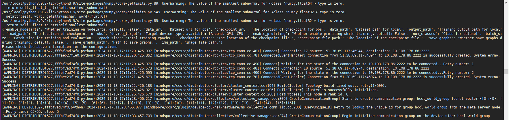

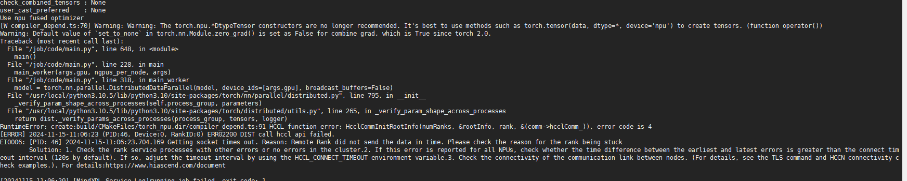

**原因分析<a name="section1175235326"></a>**

hostNetwork设置为true后，由于未在任务YAML中配置环境变量参数HCCL\_IF\_IP，HCCL无法确认与哪个网卡IP建立通信，导致HCCL通信超时。

**解决措施<a name="section1239117181811"></a>**

在任务YAML中设置hostNetwork为true后，需要在YAML中同步配置环境变量HCCL\_IF\_IP为status.hostIP，指定root通信网卡IP为hostIP，即可使HCCL成功建链，解决问题。

```
apiVersion: mindxdl.gitee.com/v1
kind: AscendJob
metadata:
  name: default-test-mindspore
  labels:
    framework: mindspore     # 训练框架名称
    ring-controller.atlas: ascend-{xxx}b  # 标识任务使用的芯片类型
spec:
  schedulerName: volcano    # 当Ascend Operator组件的启动参数enableGangScheduling为true时生效
  runPolicy:
    schedulingPolicy:      # 当Ascend Operator组件的启动参数enableGangScheduling为true时生效
      minAvailable: 2  #任务总副本数
      queue: default     # 任务所属队列
  successPolicy: AllWorkers  #任务成功的前提
  replicaSpecs:
    Scheduler:
      replicas: 1   # 任务副本数
      restartPolicy: Never
      template:
        metadata:
          labels:
            ring-controller.atlas: ascend-{xxx}b  # 标识任务使用的芯片类型
        spec:
          hostNetwork: true    # 可选值，根据实际情况填写，true支持hostIP创建Pod，false不支持hostIP创建Pod
          affinity:                                         # 本段配置表示分布式任务的Pod调度到不同节点
            podAntiAffinity:
              requiredDuringSchedulingIgnoredDuringExecution:
                - labelSelector:
                    matchExpressions:
                      - key: job-name
                        operator: In
                        values:
                          - default-test-mindspore         # 需要和上面的任务名一致
                  topologyKey: kubernetes.io/hostname
          nodeSelector:
            host-arch: huawei-arm              # 可选值，根据实际情况填写
            accelerator-type: module-{xxx}b-8   # 节点类型
          containers:
          - name: ascend                                     # 必须为ascend，不能修改
            image: mindspore-test:latest  #镜像名称
            imagePullPolicy: IfNotPresent
...
            env:                                    
              - name: HCCL_IF_IP                    # 可选值，根据实际情况填写
                valueFrom:                          # 若hostNetwork配置为true，需要同步配置HCCL_IF_IP环境变量
                  fieldRef:                         # 若hostNetwork未配置或配置为false，不可配置HCCL_IF_IP环境变量
                    fieldPath: status.hostIP        # 
...            
            ports:                          # 分布式训练集合通信端口
              - containerPort: 2222         
                name: ascendjob-port
            resources:
              limits:
                huawei.com/Ascend910: 8 # 申请的芯片数量
              requests:
                huawei.com/Ascend910: 8 #与limits取值一致
            volumeMounts:
...            
          volumes:
...            
    Worker:
      replicas: 1   #任务副本数
      restartPolicy: Never
      template:
        metadata:
          labels:
            ring-controller.atlas: ascend-{xxx}b   # 标识任务使用的芯片类型
        spec:
          hostNetwork: true    # 可选值，根据实际情况填写，true支持hostIP创建Pod，false不支持hostIP创建Pod
          affinity:            # 本段配置表示分布式任务的Pod调度到不同节点
            podAntiAffinity:
              requiredDuringSchedulingIgnoredDuringExecution:
                - labelSelector:
                    matchExpressions:
                      - key: job-name
                        operator: In
                        values:
                          - default-test-mindspore        # 需要和上面的任务名一致
                  topologyKey: kubernetes.io/hostname
          nodeSelector:
            host-arch: huawei-arm              # 可选值，根据实际情况填写
            accelerator-type: module-{xxx}b-8  # 节点类型
          containers:
          - name: ascend                            # 必须为ascend，不能修改
...
            env:                                    
              - name: HCCL_IF_IP                    # 可选值，根据实际情况填写
                valueFrom:                          # 若hostNetwork配置为true，需要同步配置HCCL_IF_IP环境变量
                  fieldRef:                         # 若hostNetwork未配置或配置为false，不可配置HCCL_IF_IP环境变量
                    fieldPath: status.hostIP        # 
...
          - name: ASCEND_VISIBLE_DEVICES                       # Ascend Docker Runtime会使用该字段
            valueFrom:
              fieldRef:
                fieldPath: metadata.annotations['huawei.com/Ascend910']               # 需要和下面resources.requests保持一致
...
            ports:                          # 分布式训练集合通信端口
              - containerPort: 2222         
                name: ascendjob-port
            resources:
              limits:
                huawei.com/Ascend910: 8 # 申请的芯片数量
              requests:
                huawei.com/Ascend910: 8 #与limits取值一致
            volumeMounts:
...
          volumes:
...
```

## ClusterD不上报ConfigMap<a name="ZH-CN_TOPIC_0000002511346375"></a>

**问题描述<a name="section196544217535"></a>**

ClusterD在运行时未正常上报ConfigMap。

**原因分析<a name="section15224728135314"></a>**

可能是集群的时钟发生了变更。

**解决措施<a name="section03452423532"></a>**

如果是集群时钟发生变化，需要执行以下命令重启ClusterD。命令示例如下：

```
kubectl delete -f clusterd-v{version}.yaml
kubectl apply -f clusterd-v{version}.yaml
```

## 启用进程级在线恢复后，报错There is unsafe data in the input tensor，恢复失败<a name="ZH-CN_TOPIC_0000002479386426"></a>

**问题描述<a name="section1034374612236"></a>**

训练任务在发生故障后启用进程级在线恢复（Step级别重计算恢复）功能，在恢复完成后继续训练，恢复训练后第一个迭代还没完成又报错unsafe data，恢复失败。

**图 1**  恢复失败<a name="fig1965816983211"></a>  
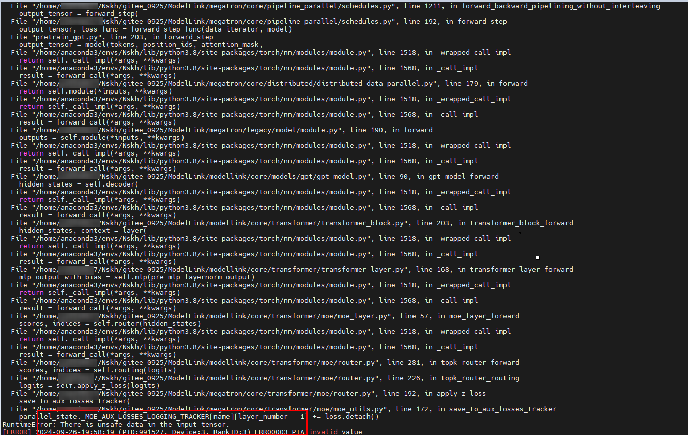

**原因分析<a name="section1541511240"></a>**

故障发生时涉及该故障的Tensor会被标记为unsafe data，数据将不再可信，如果该Tensor为全局变量，此时需要对其进行重建修复。被标记为unsafe data的Tensor在计算中被访问时会抛出错误，错误信息：“There is unsafe data in the input tensor”，此时需结合报错栈定位此时访问的Tensor对象。

**解决措施<a name="section114671413240"></a>**

当定位到该被访问的Tensor对象时，首先判断其对训练过程的影响：

-   场景一：若其与训练迭代无依赖关系，**则可在rollback阶段对其重新初始化，将其释放**。
-   场景二：若其与训练迭代有依赖关系**，且与副本优化器映射关系一致时，则需要在repair阶段对其进行重建并通过点对点通信修复该Tensor的数据**。

    >[!NOTE] 说明 
    >进程级别重调度及进程级在线恢复通过寻找有效的副本，拼凑出一份完整的优化器状态数据，当训练集群故障较多，通过副本仍然无法拼凑出一个完整副本时，则会无法完成重调度。

此外还应注意在重建或重新初始化之前**避免访问该Tensor对象**。为预防全局变量中存在被标记为unsafe data的Tensor没有被故障修复框架修复而导致修复失败，建议排查训练框架中所使用的全局Tensor，确保其被故障修复框架跟踪并正确修复。

**处理案例**

-   针对场景一的处理案例如下。

    如[图1 恢复失败](#fig1965816983211)所示，Megatron框架中，当使用TensorBoard记录训练日志等信息，并开启MoE特性时，会在\_MOE\_AUX\_LOSSES\_LOGGING\_TRACKER中创建一个Tensor记录loss数据，并被TensorBoard访问读取。该全局变量\_MOE\_AUX\_LOSSES\_LOGGING\_TRACKER中的Tensor发生故障被标记为unsafe data后，再次访问该Tensor会导致报错，根据调用栈可以找到该Tensor所在位置。

    根据代码上下文判断，该Tensor仅用于记录loss值，并且在每个迭代结束后将值置为0，因此在rollback阶段对该全局变量重新初始化为空字典，由框架在后续训练中使用，详见mindio\_ttp/adaptor/modellink\_adaptor.py中feature\_rollback函数。

-   针对场景二的处理案例如下。

    假设用户自定义的全局变量Tensor名为global\_tensor，应该在mindio\_ttp/adaptor/modellink\_adaptor.py的recv\_rank\_repair函数尾部增加重建及接收逻辑，故障卡接收副本卡保存的数据：

    recv\_tensor = torch.empty\(size, dtype=type, device="npu"\)

    torch.distributed.recv\(recv\_tensor, src=src\_rank, group=repair\_group\)

    global\_tensor.data.copy\_\(recv\_tensor\)

    并在mindio\_ttp/adaptor/modellink\_adaptor.py的send\_rank\_repair函数尾部增加发送逻辑，向故障卡发送该全局Tensor的数据：

    torch.distributed.send\(global\_tensor, dst=dest\_rank, group=repair\_group\)

## 执行MindSpore框架的模型训练任务，在编译时报错The pointer\[origin\_node\_output\_addr\] is null<a name="ZH-CN_TOPIC_0000002479386494"></a>

**问题描述<a name="section271311267578"></a>**

执行MindSpore框架的模型训练任务，在编译时出现如下报错：The pointer\[origin\_node\_output\_addr\] is null。

**图 1**  编译报错<a name="fig642585735717"></a>  
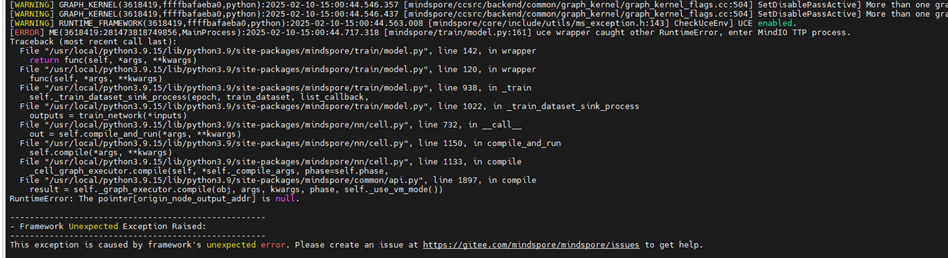

**原因分析<a name="section378617128596"></a>**

MindSpore图编译失败，可能是修改模型参数后，从缓存中加载了旧的编译数据导致报错。

**解决措施<a name="section11811344195911"></a>**

-   方式一（推荐）：删除图编译缓存路径下的文件，该路径由环境变量MS\_COMPILER\_CACHE\_PATH指定。
-   方式二：修改训练启动脚本，关闭图编译缓存功能。

    ```
    export MS_COMPILER_CACHE_ENABLE=0
    ```

## NPU Exporter组件的Pod状态为CrashLoopBackOff<a name="ZH-CN_TOPIC_0000002479386438"></a>

**问题现象描述<a name="section5257122982311"></a>**

执行**kubectl get pod -A -o wide**命令，发现NPU Exporter组件中部分Pod的状态为CrashLoopBackOff。

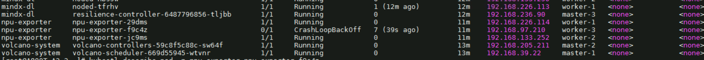

**原因分析<a name="section16806366237"></a>**

如发生以上错误，可参考以下步骤进行错误排查。

1.  <a name="li1648841855512"></a>执行以下命令查看日志报错。或查看日志**/var/log/mindx-dl/npu-exporter/npu-exporter.log**报deviceManager初始化错误，表示找不到NPU设备。

    ```
    kubectl logs -fn npu-exporter npu-exporter-8l7w2
    ```

    回显如下所示。

    ```
    [ERROR]    2024/10/28 08:50:46.650662 10      devmanager/devmanager.go:91    deviceManager init failed, prepare dcmi failed, err: dcmi init failed, error code: -8005
    [ERROR]    2024/10/28 08:50:46.652739 10      collector/npu_collector.go:467    new npu collector failed, error is auto init failed, err: get chip info failed, err: device Manager is nil, may encounter an exception during initialization. You can check the system log to confirm
    ```

2.  执行**npu-smi info**命令报错：初始化失败，返回-8005错误。此问题发生的原因是升级NPU驱动与固件后未重启服务器。

    ```
    dcmi module initialize failed. ret is -8005
    ```

**解决措施<a name="section023754832320"></a>**

查看/var/log/ascend\_seclog/ascend\_install.log日志，显示有固件升级。一般固件升级后，请根据相关提示进行重启。

如出现其他的CrashLoopBackOff状态，可通过执行[步骤1](#li1648841855512)查看上述日志进行定位。

## 执行kubectl命令报错：Error from server \(Forbidden\)， can only create tokens for individual service accounts<a name="ZH-CN_TOPIC_0000002511346413"></a>

**问题现象描述<a name="section58732052111811"></a>**

执行**kubectl**命令出现以下报错：

```
Error from server (Forbidden): error when deleting "device-plugin-310P-volcano-v6.0.RC2.yaml": serviceaccounts "ascend-device-plugin-sa-310p" is forbidden: User "system:node:worker-2" cannot delete resource "serviceaccounts" in API group "" in the namespace "kube-system": can only create tokens for individual service accounts
```

**原因分析<a name="section206801149142816"></a>**

以上命令未在管理节点执行，所以命令执行失败。

**解决方案<a name="section12660634112718"></a>**

在管理节点执行以上命令。示例如下。

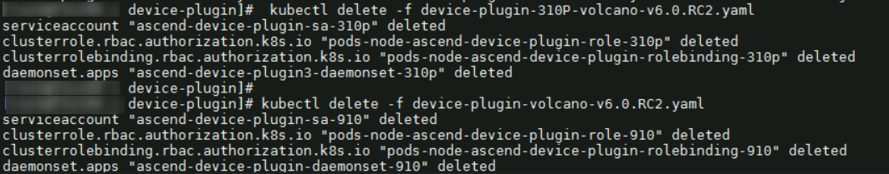

## 下发任务失败，未生成Pod<a name="ZH-CN_TOPIC_0000002479226436"></a>

**问题现象描述<a name="section57631302511"></a>**

执行**kubectl apply -f xxx.yaml**命令后，下发任务失败，提示Error from server \(NotFound\): error when creating "xxx-vcjob.yaml": namespaces "vcjob" not found。

.png)

**原因分析<a name="section45716469536"></a>**

vcjob命名空间未创建。

**解决方案<a name="section55637239545"></a>**

1.  执行以下命令创建vcjob命名空间。

    ```
    kubectl create namespace vcjob
    ```

2.  再执行命令下发任务。示例如下。

    ```
    kubectl apply -f a800_vcjob.yaml
    ```

    回显如下所示，表示任务下发成功。

    ```
    configmap/rings-config-mindx-dls-test 
    createdjob.batch.volcano.sh/mindx-dls-test created
    ```

## vcjob任务未正常拉起，get event提示tasks in gang unschedulable: pod group is not ready, 1 minAvailable<a name="ZH-CN_TOPIC_0000002511426391"></a>

**问题现象描述<a name="section15190201324417"></a>**

执行**kubectl get pod -n vcjob**命令获取集群中Pod信息时，显示Pod未正常拉起，并提示：No resources found in  vcjob namespace。再执行**kubectl get event -n vcjob**命令获取集群内的事件信息，报错：0/0 tasks in gang unschedulable: pod group is not ready, 1 minAvailable

**原因分析<a name="section7179125311173"></a>**

创建任务后，若任务Pod未处于running状态，可按照以下2种情况进行排查。

-   Pod未创建：这种情况下需查看对应的acjob或vcjob描述信息，并查看volcano-controller或Ascend Operator日志，分析任务YAML定义中是否有不合规的字段造成控制器未创建Pod。
-   Pod处于Pending状态：首先查看PodGroup描述信息，确认该状态是由哪种情况导致的。一般来说，存在以下3种情况：nodeSelector、tor-affinity、资源不足。如为nodeSelector、tor-affinity这2种情况，则需分析亲和性。如提示NotEnoughResources，则需按照以下方案进行排查。

**解决方案<a name="section1220165517183"></a>**

1.  <a name="li17475121917314"></a>可以通过以下命令查询所有PodGroup信息。提示PodGroup状态为Inqueue和Pending。

    ```
    kubectl get pg -n vcjob
    ```

    回显示例如下：

    ```
    NAME                                                  STATUS    MINMEMBER   RUNNINGS   AGE
    mindx-xxx-16-p-4bf232e4-bd48-438d-9089-02bfef354fce   Inqueue   1                      37d
    mindx-dl-deviceinfo-worker-1                          Pending   2                      88m
    ```

2.  执行以下命令，查询对应PodGroup的详细信息。

    ```
    kubectl describe pg -n <namespace> <podgroup-name>
    ```

    _<namespace\>和__<podgroup-name\>_需要用实际的命名空间和PodGroup名称进行替换。

    示例命令如下。mindx-dl-deviceinfo-worker-1为[步骤1](#li17475121917314)中查询到的PodGroup名称。

    ```
    kubectl describe pg -n vcjob mindx-dl-deviceinfo-worker-1
    ```

    回显示例如下，该回显示例表示queue资源配额不足。

    ```
    Name:         mindx-dl-deviceinfo-worker-1
    Namespace:    vcjob
    Labels:       fault-scheduling=force
                  ring-controller.atlas=ascend-{xxx}b
    Annotations:  kubectl.kubernetes.io/last-applied-configuration:
                    {"apiVersion":"batch.volcano.sh/v1alpha1","kind":"Job","metadata":{"annotations":{},"labels":{"fault-scheduling":"force","ring-controller....
    API Version:  scheduling.volcano.sh/v1beta1
    Kind:         PodGroup
    Metadata:
      Creation Timestamp:  2023-07-05T09:00:02Z
      Generation:          7
      Owner References:
        API Version:           batch.volcano.sh/v1alpha1
        Block Owner Deletion:  true
        Controller:            true
        Kind:                  Job
        Name:                  mindx-xxx-2-p
        UID:                   worker-1
      Resource Version:        17544644
      Self Link:               /apis/scheduling.volcano.sh/v1beta1/namespaces/vcjob/mindx-dl-deviceinfo-worker-1
      UID:                     277cc974-5eec-455f-a860-25d7d19e8335
    Spec:
      Min Member:  1
      Min Resources:
        count/pods:                     1
        huawei.com/Ascend910:           2
        Pods:                           1
        requests.huawei.com/Ascend910:  2
      Min Task Member:
        Default - Test:  1
      Queue:             default
    Status:
      Conditions:
        Last Transition Time:  2023-07-05T09:05:46Z
        Message:               1/0 tasks in gang unschedulable: pod group is not ready, 1 minAvailable
        Reason:                NotEnoughResources
        Status:                True
        Transition ID:         33585c5e-d3ad-4bc4-be0c-c09bea59520e
        Type:                  Unschedulable
      Phase:                   Pending
    Events:
      Type     Reason         Age                     From     Message
      ----     ------         ----                    ----     -------
      Warning  Unschedulable  6m22s (x12 over 6m34s)  volcano  0/0 tasks in gang unschedulable: pod group is not ready, 1 minAvailable
      Normal   Unschedulable  93s (x280 over 6m34s)   volcano  queue resource quota insufficient   # queue资源配额不足
    ```

3.  通过如下命令查看K8s中节点的详细情况。如果节点详情中的“Capacity“字段和“Allocatable“字段出现了昇腾AI处理器的相关信息，表示Ascend Device Plugin给K8s上报芯片正常，组件运行正常。

    ```
    kubectl describe node K8s中的节点名
    ```

    回显如下所示，提示有个节点Allocatable的huawei.com/Ascend910为7。

    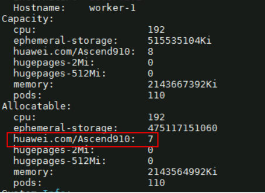

4.  执行**npu-smi info**命令，显示没有正在运行的任务。

    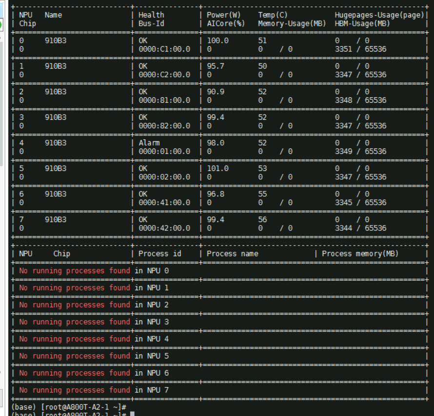

5.  执行以下命令，获取集群内所有命名空间。

    ```
    kubectl get cm -A
    ```

    回显如下所示。

    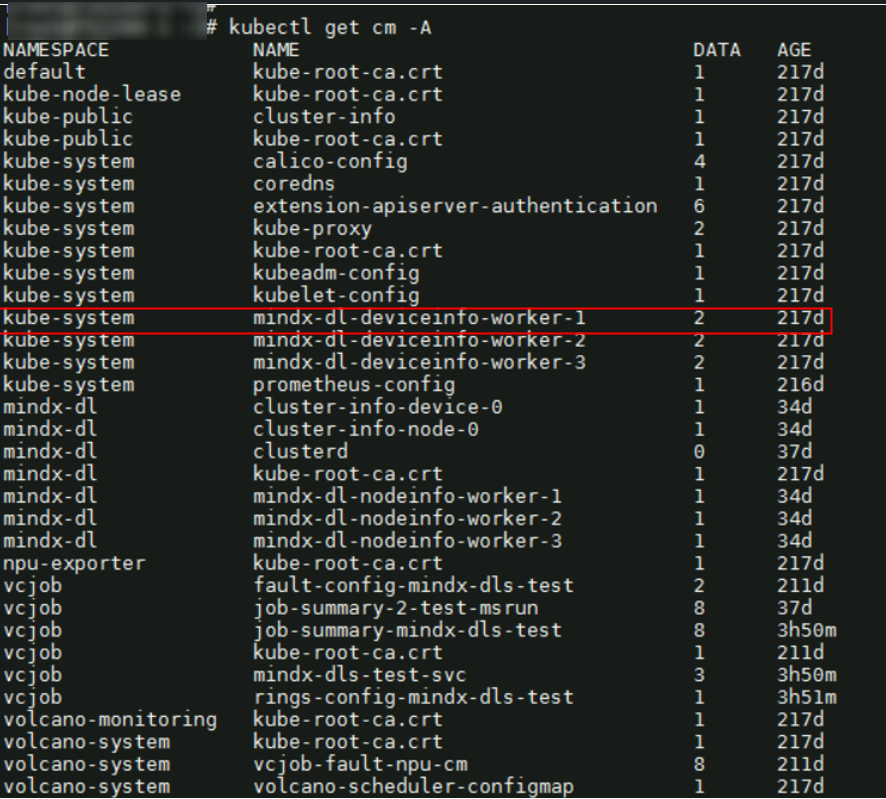

6.  执行以下命令，获取ConfigMap的全部信息。

    ```
    kubectl describe cm -n kube-system mindx-dl-deviceinfo-worker-1
    ```

    信息显示NPU device-4 CardUnhealthy，错误码为0x80CD8008。

    

7.  对错误码进行查询，可以查到的故障详细信息如下所示。

    **表 1**  故障详细信息

|EventID|所属一级模块|所属二级模块|通知类型|故障事件名称|故障解释/可能原因|故障影响|故障自处理模式|
|--|--|--|--|--|--|--|--|
|0x80CD8008|芯片故障|L2BUFF|故障事件|L2BUFF多bit ECC错误|片内SRAM软失败，导致L2BUFF多bit错误。|系统停止响应，数据错误或可能出现一致性错误。|<li>上报故障事件到设备</li><li>记录错误日志</li>|


8.  重启服务器。
9.  重启后会恢复正常。如不能恢复正常（ConfigMap状态显示Ascend910-4还是Unhealthy）则需用户确认该卡是否可用。
    -   如确认该卡可用，则执行以下命令编辑ConfigMap，并删除异常信息ManuallySeparateNPU。

        ```
        kubectl edit cm -n kube-system mindx-dl-deviceinfo-worker-1
        ```

        删除异常信息后，问题已解决。

        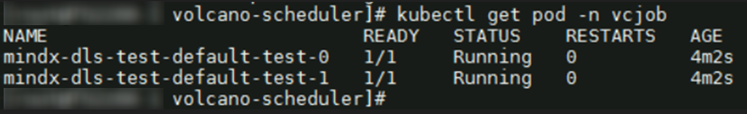

    -   如确认该卡发生硬件故障，请联系华为工程师处理。

## 查看Pod日志出现报错：NPU is busy, check again<a name="ZH-CN_TOPIC_0000002511346441"></a>

**问题现象描述<a name="section17434250162814"></a>**

执行**kubectl logs -n vcjob  default-test-pytorch-master-0  -f**命令查看Pod日志，出现报错：npu is busy, check again。

**原因分析<a name="section72991450123214"></a>**

-   原因一：NPU被其他容器占用，检查发现确实有容器在占用。
-   原因二：其他容器挂载了NPU设备，虽然没有使用NPU，但是也会导致报错

**解决措施<a name="section8204316163612"></a>**

-   方案一（推荐）：停止挂载NPU的容器。

1.  执行以下命令查询全部运行中的容器。

    ```
    docker ps
    ```

2.  执行以下命令查看指定容器是否已经正常挂载NPU。

    ```
    docker inspect 容器ID | grep davinci
    ```

3.  如果该指定的容器已挂载NPU，执行以下命令停止容器。

    ```
    docker stop 容器ID
    ```

-   方案二：YAML文件中指定为特权模式，此方法适用于其他容器没有实际使用NPU但是只是挂载了NPU的场景。

在任务YAML中添加以下字段，示例如下。

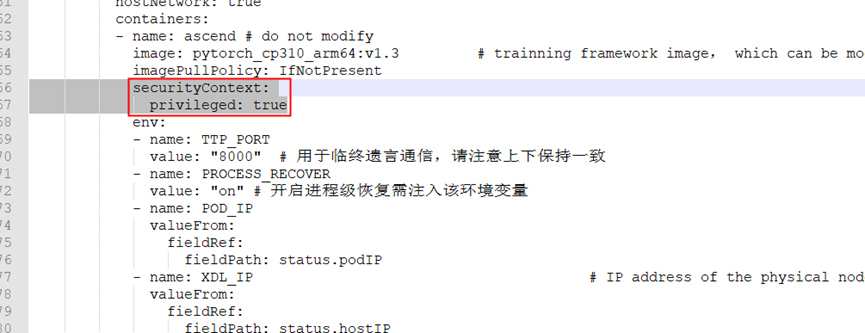

## 公共故障的恢复消息丢失，导致故障芯片一直处于隔离状态<a name="ZH-CN_TOPIC_0000002511346343"></a>

**问题现象描述<a name="section176022049125416"></a>**

在检测公共故障时，故障发送方已发送故障恢复消息，但是故障芯片一直处于隔离状态，导致任务无法调度到该芯片。

**原因分析<a name="section531191010551"></a>**

-   原因一：故障发送方没有成功发送恢复消息给ClusterD；
-   原因二：故障恢复消息发送成功，但是K8s informer的消息队列出现消息遗漏；
-   原因三：收到故障恢复消息后，ClusterD发生重启，导致内存中的故障缓存还未刷新至statistic-fault-info CM就被清理掉了。

**解决措施<a name="section11862163911551"></a>**

针对原因一：查看ClusterD日志文件中的报错信息，默认位置为/var/log/mindx-dl/clusterd/clusterd.log。

针对原因二：informer依赖K8s API Server的Watch机制，若网络不稳定或API Server压力过大，可能导致事件丢失。可以通过优化API Server性能减小消息遗漏的发生概率。

针对原因三：查询statistic-fault-info CM，根据要恢复的故障的faultId，获取故障的详细信息。手动调用[公共故障接口](./api/clusterd.md#公共故障接口)，构造故障恢复消息。

以恢复故障faultId：14715779为例，下面将详细介绍针对原因三的解决办法。

1.  执行以下命令查询statistic-fault-info CM。

    ```
    kubectl describe cm -n cluster-system statistic-fault-info
    ```

    PublicFaults对应的内容为：

    ```
    {"node173":[{"resource":"CCAE","devIds":[0,1,2],"faultId":"14715582","type":"Storage","faultCode":"010001002","level":"SubHealthFault","faultTime":1736928806},{"resource":"CCAE","devIds":[2,3,4],"faultId":"14715779","type":"Network","faultCode":"010001001","level":"SubHealthFault","faultTime":1736926605}]}
    ```

2.  将步骤1PublicFaults中faultId 14715779相关的故障信息记录如下。

    ```
    {
      "nodeName": "node173",
      "resource": "CCAE",
      "devIds": [2,3,4],
      "faultId": "14715779",
      "type": "Network",
      "faultCode": "010001001",
      "level": "SubHealthFault",
      "faultTime": 1736926605
    }
    ```

3.  调用公共故障接口，构造故障恢复消息。以ConfigMap接口为例。
    1.  执行以下命令创建名为recover的YAML。

        ```
        vi recover.yaml
        ```

    2.  编辑该YAML，将以下内容写入该YAML中。

        ```
        apiVersion: v1
        kind: ConfigMap
        metadata:
          namespace: mindx-dl
          name: mindx-dl-publicinfo
          labels:
            mc-consumer-publicfault: "true"
        data:
          PublicFault: |
            {
                "id":"11937763019444715778",
                "timestamp": 1741159983000,
                "version": "1.0",
                "resource": "CCAE",
                "faults": [
                {
                  "faultId": "14715779",
                  "faultType": "Network",
                  "faultCode": "010001001",
                  "faultTime": 1736926605000,   # 步骤1查询到的ConfigMap中本字段为10位时间戳，此处请手动填充为13位
                  "assertion": "recover",
                  "influence": [
                    {
                      "nodeName": "node173",
                      "deviceIds": [2,3,4]
                    }
                  ]
                }
                ]
            }
        ```

    3.  执行以下命令创建ConfigMap。

        ```
        kubectl apply -f recover.yaml
        ```

4.  再次查询statistic-fault-info CM，PublicFaults对应的内容如下。faultId为14715779的故障已恢复。同时，cluster-info-cm中不再出现该故障。

    ```
    {"node173":[{"resource":"CCAE","devIds":[0,1,2],"faultId":"14715582","type":"Storage","faultCode":"010001002"
    ,"level":"SeparateNPU","faultTime":1736928806}]}
    ```

## 任务申请的总芯片数量为32，sp-block设置为32可以正常训练，sp-block设置为16无法完成训练，训练容器报错提示初始化连接失败<a name="ZH-CN_TOPIC_0000002479386382"></a>

**问题现象描述<a name="section1723543355416"></a>**

在灵衢总线设备环境中，sp-block设置为32可以正常训练，sp-block设置为16无法完成训练，训练容器报错提示初始化连接失败，日志截图如下。

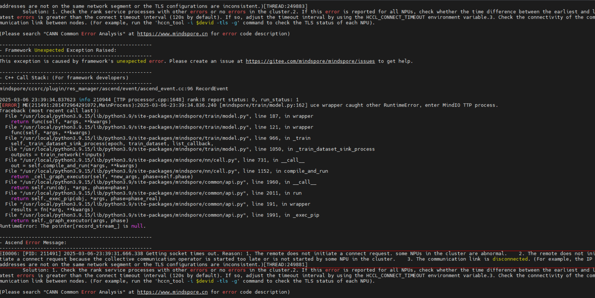

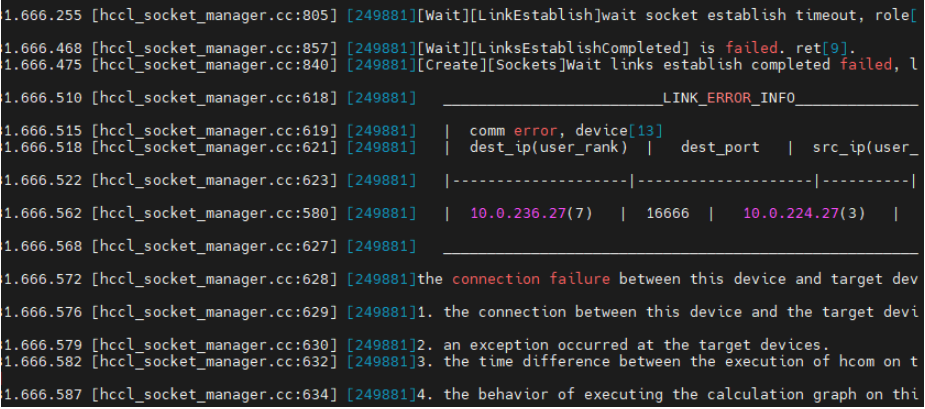

**原因分析<a name="section8220194216541"></a>**

当sp-block配置为32时，灵衢总线设备划分出来的逻辑超节点包含两个计算节点。由于任务申请的总芯片数量为32，因此本任务正好有一个逻辑超节点。

当sp-block配置为16时，灵衢总线设备划分出来的逻辑超节点包含一个计算节点。由于任务申请的总芯片数量为32，因此本任务正好有两个逻辑超节点。

在灵衢总线设备中，不同逻辑超节点内部的计算节点之间使用RoCE网络通信，而在同一个逻辑超节点内部的计算节点之间采用HCCS网络通信。

经过上面的分析，可能的一个原因是由于sp-block配置为32时，任务只分配了一个逻辑超节点，逻辑超节点内部的计算节点采用HCCS网络通信。而sp-block配置为16时，任务分配了两个逻辑超节点，而位于不同逻辑超节点的计算节点之间采用RoCE网络通信。因此很有可能是因为底层的RoCE网络没有连通导致sp-block配置为16时任务初始化连接失败。

**解决措施<a name="section2428959145411"></a>**

可以通过hccn\_tool工具测试两个计算节点之间的RoCE网络是否是连通的。方法如下：

1.  执行如下命令获取ID为0的卡的IP地址。

    ```
    hccn_tool -i 0 -ip -g
    ```

2.  执行如下命令ping其他逻辑超节点中的计算节点。

    ```
    hccn_tool -i 0 -ping -g address {其他逻辑超节点中任意计算节点的NPU卡的IP}
    ```

    -   如果能够ping通，说明RoCE网络没有问题。此时，需要根据具体的日志信息排查是否是其他问题。
    -   如果显示以下提示信息：3 packets transmitted, 0 received, 100.00% packet loss，说明RoCE网络是有问题的。此时需要解决计算节点之间RoCE网络连通性问题。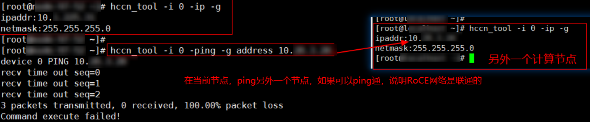

## 工作节点无训练任务执行，一直无法下发新的训练任务<a name="ZH-CN_TOPIC_0000002479226464"></a>

**问题现象描述<a name="section12422181218"></a>**

当前环境无训练任务执行，下发新的训练任务始终无法成功创建任务Pod，Pod一直处于Pending状态。

**原因分析<a name="section1026281213113"></a>**

上次环境使用过程中，删除训练任务时对应容器没有清除干净，导致后续下发训练任务时卡无法释放，无法再次拉起任务。

**解决措施<a name="section157185210120"></a>**

1.  执行如下命令查看Ascend Device Plugin组件日志。示例如下

    ```
    kubectl logs -f -n kube-system ascend-device-plugin-daemonset-910-njj49
    ```

2.  检索关键日志containerd used chips。
3.  根据日志map中的key值确认占卡容器ID，在Docker和Containerd中检索容器是否存在。
    -   Docker场景

        以容器ID：2d758ae3968b为例，介绍如何在Docker中完全删除容器。

        1.  执行以下命令检查节点中是否存在此容器。

            ```
            docker ps
            ```

        2.  若存在该容器且正在运行，执行以下命令停止此容器。

            ```
            docker stop containers 2d758ae3968b
            ```

        3.  再执行**docker ps**命令，查看该容器是否已被停止。
        4.  执行以下命令查看是否有容器残留。

            ```
            docker ps -a | grep 2d758ae3968b
            ```

        5.  （可选）若存在容器残留，请执行以下命令删除此容器。

            ```
            docker rm 2d758ae3968b
            ```

        6.  （可选）再次执行以下命令查看容器是否被删除。

            ```
            docker ps -a | grep 2d758ae3968b
            ```

    -   Containerd场景

        以容器ID：test-containerd-1为例，介绍如何在Containerd中完全删除容器。

        1.  执行以下命令检查节点中是否存在此容器。

            ```
            ctr tasks list|grep test-containerd-1
            ```

        2.  若存在该容器且正在运行，执行以下命令停止容器。

            ```
            ctr tasks kill test-containerd-1
            ```

        3.  执行以下命令检查是否存在容器残留。

            ```
            ctr containers list|grep test-containerd-1
            ```

        4.  （可选）若存在容器残留，请执行以下命令删除容器。

            ```
            ctr containers delete test-containerd-1
            ```

        5.  （可选）检查残留容器是否已删除。

            ```
            ctr tasks list |grep test-containerd-1
            ```

4.  再次检索Ascend Device Plugin组件关键日志containerd used chips，此时打印信息为空值，确认残留的占卡容器已被清空。
5.  执行**kubectl get pod -A**命令观察任务Pod状态，确认任务成功running。

## 任务重调度之后，训练日志被覆盖<a name="ZH-CN_TOPIC_0000002479226422"></a>

**问题现象描述<a name="section108351133133518"></a>**

执行训练任务中出现故障，故障Pod进行任务重调度（断点续训）之后，训练日志被覆盖，上一次训练日志丢失。

**原因分析<a name="section17208443113514"></a>**

因为不同训练框架日志生成逻辑不同，部分框架会覆盖上次日志，导致上一次训练日志丢失。

**解决措施<a name="section11536549173514"></a>**

修改训练脚本（train\_start.sh）中日志创建部分，使用date获取时间戳，在每次重调度之后生成带有时间戳的日志路径。以训练日志路径_TRAIN\_LOG\_PATH_为例：

```
timestamp=$(date +"%Y%m%d%H%M%S")
mkdir /job/code/alllogs/$MINDX_TASK_ID/trainlogs/$XDL_IP-$RANK-$timestamp    # 创建训练日志保存路径
export TRAIN_LOG_PATH=/job/code/alllogs/$MINDX_TASK_ID/trainlogs/$XDL_IP-$RANK-$timestamp   # 设置训练日志保存路径
```

## Calico网络插件Not Ready<a name="ZH-CN_TOPIC_0000002511346421"></a>

**问题描述<a name="section1338719112517"></a>**

通过**kubectl get pod -A命令**查看Calico网络插件时，READY列数字为“0/1”。

**图 1**  报错示例<a name="fig31477822019"></a>  
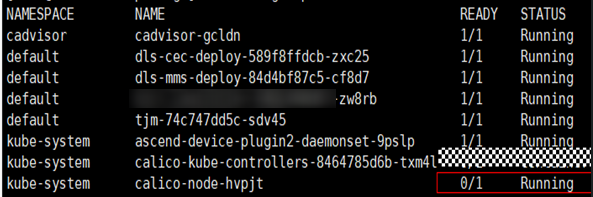

**可能原因<a name="section183433472713"></a>**

物理机网络段和配置的容器网络段冲突或者物理机处于复杂网络环境中，Calico不能正确识别master和worker的有效网卡。

**解决方法<a name="section757562742916"></a>**

检查物理机网络是否和容器网段重复，如果重复，需要重新初始化Kubernetes集群，修改pod-network-cidr参数为不冲突的网段，初始化后需要同步修改Calico。

启动YAML中默认的容器网段参数CALICO\_IPV4POOL\_CIDR，同时建议增加IP\_AUTODETECTION\_METHOD配置，value值为“can-reach=\{masterIP\}”，masterIP为Kubernetes管理节点物理机IP。下图为Calico启动文件需要修改的部分截图。Kubernetes重置和安装请参考[Kubernetes官网](https://kubernetes.io/)。

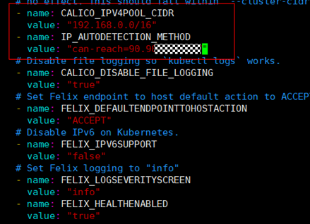

## 训练进程报错退出，Pod状态非Error无法触发业务面重调度<a name="ZH-CN_TOPIC_0000002511426343"></a>

**问题现象描述<a name="section12422181218"></a>**

执行训练，训练进程报错退出后，Pod状态为Completed，非Error。

**原因分析<a name="section1026281213113"></a>**

Pod的状态由exit退出码决定。当exit退出码为0时，Pod状态为Completed；当exit退出码非0时，Pod状态为Error。训练进程通过train\_start.sh脚本拉起，train\_start.sh中接收Python程序返回码不正确，导致exit退出码为0，Pod状态为Completed。

当退出码非0时，才可以触发业务面重调度。

**解决措施<a name="section520874815912"></a>**

train\_start.sh脚本内容存在差异，以下仅为示例，请根据实际情况修改。

1.  检查train\_start.sh脚本，核对接收Python程序返回码处的代码。

    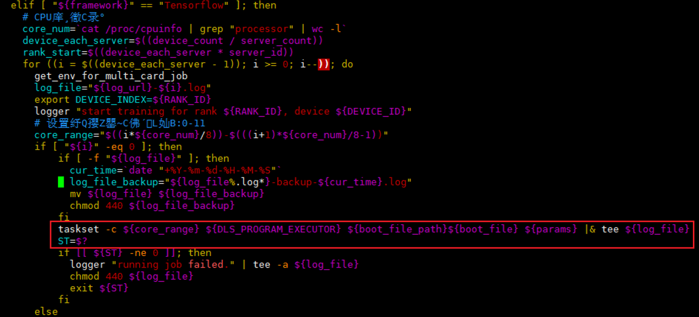

    发现调用Python程序后面有加管道（|），执行打印和保存日志的动作，$?接收的其实是tee命令的执行结果，tee命令执行没有报错，所以$?接收到的返回码为0，进程就以0退出码退出了，导致训练进程报错退出后，Pod状态为Completed，非Error，无法触发业务面重调度。

2.  修改接收Python程序退出码处的代码，使用PIPESTATUS\[0\]获取管道（|）前命令的执行结果，即Python程序本身的退出码。修改如下：

    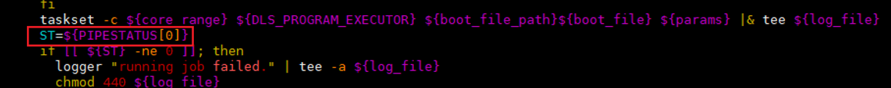

## Node信息中Allocatable. huawei.com/Ascend910对应的芯片数量为8，下发8卡任务，任务处于Pending状态<a name="ZH-CN_TOPIC_0000002511346327"></a>

**问题现象描述<a name="section108351133133518"></a>**

通过**kubectl describe node** _\{node name\}_命令查看Node信息，Allocatable.huawei.com/Ascend910对应的芯片数量为8，下发8卡任务，任务处于Pending状态。

```
Capacity:
  cpu:                   72
  ephemeral-storage:     1843598940Ki
  huawei.com/Ascend910:  8
  hugepages-1Gi:         0
  hugepages-2Mi:         0
  memory:                659447564Ki
  pods:                  110
Allocatable:
  cpu:                   72
  ephemeral-storage:     1699060780291
  huawei.com/Ascend910:  8
  hugepages-1Gi:         0
  hugepages-2Mi:         0
  memory:                659345164Ki
  pods:                  110
```

**原因分析<a name="section17208443113514"></a>**

该节点上可能存在非Ascend Device Plugin感知的公共故障。

**解决措施<a name="section11536549173514"></a>**

请参见[获取集群内当前可用设备信息](./common_operations.md#获取集群内当前可用设备信息)进行解决。

## 在Atlas 800 训练服务器上跑训练任务卡住，驱动日志报错：int\_process\_hwts\_sdma\_timeout<a name="ZH-CN_TOPIC_0000002484822296"></a>

**问题现象描述<a name="section108351133133518"></a>**

在Atlas 800 训练服务器上跑训练任务，训练任务卡住，执行如下命令收集驱动日志：

```
msnpureport -f
```

在日志中报错：int\_process\_hwts\_sdma\_timeout，如下图所示：

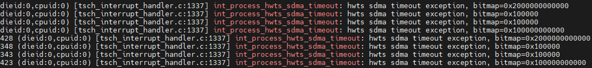

**原因分析<a name="section17208443113514"></a>**

NPU芯片处于AMP模式，而在Atlas 800 训练服务器环境中，HCCL不支持NPU芯片的AMP模式。

**解决措施<a name="section11536549173514"></a>**

将NPU工作模式切换到SMP后再跑训练任务。在iBMC下执行如下命令：

```
# 下电
ipmcset -d powerstate -v 2
# 查询NPU工作模式
ipmcget -d npuworkmode
# 切换到SMP模式
ipmcset -d npuworkmode -v 1
# 上电
ipmcset -d powerstate -v 1
```

>[!NOTE] 说明 
>若不想将NPU工作模式切换到SMP，想要继续使用NPU芯片，则需先复位NPU芯片或者重启节点。
>```
># 复位芯片，id是设备ID，chip_id是芯片ID
>npu-smi set -t reset -i id -c chip_id
># （可选）重启节点
>reboot
>```

## 同一个任务的不同Pod配置不同的nodeSelector导致重调度失败<a name="ZH-CN_TOPIC_0000002494463046"></a>

**问题现象描述<a name="section108351133133518"></a>**

同一个任务的不同Pod配置不同的nodeSelector，例如，Master Pod配置如下nodeSelector：

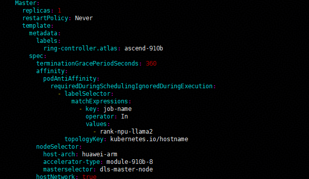

Worker Pod配置如下nodeSelector：

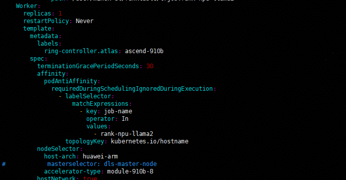

同时集群中节点的labels如下，第一次调度时，Master Pod调度到node-69-77节点；Worker Pod调度到worker-69-87节点。

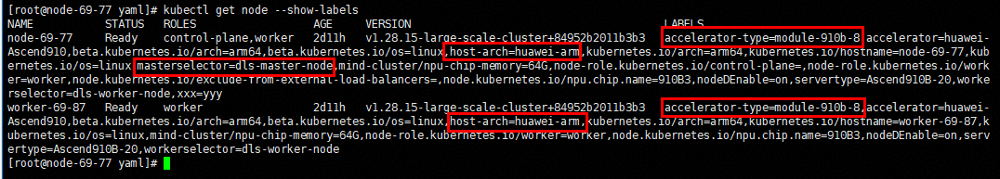

此时worker-69-87节点发生故障，进行Pod级重调度：

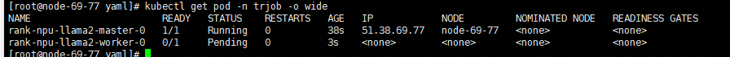

但由于资源不足，无法完成调度，升级为Job级重调度，再将故障恢复，此时资源已充足，但任务Pod仍然无法调度：


**原因分析<a name="section17208443113514"></a>**

重调度时，基于Volcano的调度逻辑，先创建的Pod会优先调度。当前场景下Worker Pod先删除先创建，其被优先调度，此时两个节点均满足条件。同时在重调度逻辑中，节点优选时，发生过故障的节点分数会被降低，所以Worker Pod选择了原Master Pod运行的节点worker-69-87。由于Master Pod包含nodeSelector "masterselector: dls-master-node"，因此无法选择worker-69-87节点。基于Volcano的一致性调度原则，导致整个任务均无法调度。

**解决措施<a name="section11536549173514"></a>**

1.  在逻辑超节点亲和性调度场景下，要求同一任务下所有Pod的调度参数，主要是nodeSelector，需要保持一致。
2.  在非逻辑超节点亲和性调度场景下，建议调度参数保持一致。若实际场景中确实需要Pod有不同的nodeSelector，需达到互斥效果，即不同的Pod只能调度到对应的节点资源池中。例如，在上述问题中，可以在Worker Pod中增加一个nodeSelector，使其不能调度到Master Pod所需要的节点上。

