# 亲和性调度<a name="ZH-CN_TOPIC_0000002525583145"></a>


## 方案介绍<a name="ZH-CN_TOPIC_0000002479386900"></a>

Volcano可实现以下2个方面的亲和性调度：基于昇腾AI处理器的亲和性、基于节点的亲和性。

**基本概念<a name="section988510210395"></a>**

-   基于昇腾AI处理器的亲和性
    -   基于昇腾AI处理器的亲和性规则：基于昇腾AI处理器的互联拓扑结构和处理逻辑，实现芯片最佳利用。
    -   亲和性调度策略：基于昇腾AI处理器的亲和性规则，实现Volcano调度器用来选取特定昇腾AI处理器的调度逻辑。基于亲和性调度策略和调度原则，可以实现资源最优分配。

-   基于节点的亲和性
    -   交换机亲和性调度：基于交换机下节点的组网配置和参数面网络配置，实现节点的最佳利用。
    -   逻辑超节点亲和性调度：对集群设备中的物理超节点根据切分策略划分出逻辑超节点，实现节点的最佳利用。

**基于昇腾AI处理器的亲和性<a name="section18208162194419"></a>**

本文档详细介绍了Atlas 训练系列产品、Atlas 200T A2 Box16 异构子框、A200T A3 Box8 超节点服务器等产品的昇腾AI处理器亲和性规则，以及在此基础上研发的Volcano组件调度规则方案。

**基于节点的亲和性<a name="section654613453444"></a>**

本文档同时介绍了基于Atlas 训练系列产品、Atlas A2 训练系列产品、Atlas 900 A3 SuperPoD 超节点的亲和性规则，即交换机的节点调度规则；对Spine-Leaf网络架构模式下，选择调用哪个交换机下的节点进行了详细介绍。

## 亲和性调度对接说明<a name="ZH-CN_TOPIC_0000002516224533"></a>

为了实现调度层与任务资源类型解耦，Ascend-for-volcano调度插件新增支持Pod级别调度策略的配置。用户可直接在Pod的metadata.labels或metadata.annotations中配置调度相关参数，无需依赖PodGroup，支持acjob、vcjob、Job、Deployment、StatefulSet等所有Pod类型。

**功能介绍<a name="section112161354155714"></a>**

通过在K8s资源的Pod模板中添加特定Label或Annotation，可控制Volcano的核心调度行为，包括但不限于：

-   昇腾AI处理器的亲和性调度
-   交换机亲和性调度
-   逻辑超节点亲和性调度
-   故障重调度

**前提条件<a name="section46282421720"></a>**

确保Kubernetes集群已经正确部署并配置了Volcano调度器，并且相关的调度插件Ascend-for-volcano已启用。

**调度策略配置示例<a name="section5997169155814"></a>**

以StatefulSet为例，所有调度相关的labels/annotations均需配置在StatefulSet.spec.template.metadata下，确保调度器可以从Pod实例中正确读取。

```
apiVersion: apps/v1
kind: StatefulSet
metadata:
  name: mindx-dls-test               # The value of this parameter must be consistent with the name of ConfigMap.
  labels:
    app: mindspore
    ring-controller.atlas: ascend-910
spec:
  replicas: 16                        # The value of replicas is 1 in a single-node scenario and N in an N-node scenario. The number of NPUs in the requests field is 8 in an N-node scenario.
  podManagementPolicy: Parallel   # 支持OrderdReady和Parallel两种模式。“OrderdReady”仅支持节点内亲和调度并且huawei.com/schedule_minAvailable只能为1。“Parallel”支持节点内和节点间亲和调度
  serviceName: service-headliness
  selector:
    matchLabels:
      app: mindspore
  template:
    metadata:
      labels:
         app: mindspore
         ring-controller.atlas: ascend-910
        fault-scheduling: force   # 故障重调度功能开关
        pod-rescheduling: "on"   # Pod级别重调度功能开关
        fault-retry-times: "85"    # 业务面故障重调度次数
        tor-affinity: large-model-schema  # 交换机亲和性调度开关
         deploy-name: mindx-dls-test # 生成rankTable必须增加该标签，取值和任务名称保持一致
      annotations:
        sp-block: "128"         # 逻辑超节点亲和性调度开关
        huawei.com/recover_policy_path: pod    # Pod级别重调度不升级为Job级开关
        huawei.com/schedule_minAvailable: "16"  # 任务调度的最小副本数，建议与任务副本数保持一致
    spec:
      schedulerName: volcano         # Use the Volcano scheduler to schedule jobs.
      nodeSelector:
        host-arch: huawei-arm        # Configure the label based on the actual job.
      containers:
        - image: ubuntu:18.04      # Training framework image, which can be modified.
          name: mindspore
          resources:
            requests:
              huawei.com/Ascend910: 16                                               # Number of required NPUs. The maximum value is 8. You can add lines below to configure resources such as memory and CPU
            limits:
              huawei.com/Ascend910: 16                                                # The value must be consistent with that in requests.
```

> [!NOTE] 说明 
>-   如果一个PodGroup被创建，则spec中的调度配置将覆盖其生成的Pod上的labels/annotations配置。
>-   对于可以生成PodGroup的资源，在PodGroup上配置对应的调度策略也可以实现亲和性调度能力。
>-   常用的Label与Annotation对照表请参见[PodGroup](./api/volcano.md#podgroup)/[Pod](./api/volcano.md#pod)。

## 亲和性调度说明<a name="ZH-CN_TOPIC_0000002511426833"></a>

亲和性调度是指通过减少资源碎片和减少网络拥塞，最大化利用昇腾AI处理器算力。

-   减少资源碎片

    任务部署后，尽量将剩余昇腾AI处理器集中在网络更通畅的单元（如节点、超节点或同一交换机下的节点）内；避免因资源分散造成昇腾AI处理器总数足够，但是任务却无法调度的场景。

-   减少网络拥塞

    昇腾AI处理器之间存在多种网络连接方式。不同产品内昇腾AI处理器的互联方式不同；产品之间根据组网的不同，昇腾AI处理器的互联方式也不同；不同的连接方式之间，网络带宽差异较大。根据不同的昇腾AI处理器互联方式，选用不同的调用策略，可以减少网络拥塞。

**基于昇腾AI处理器的亲和性调度<a name="section926413474357"></a>**

在硬件产品内部，有三种芯片链接方式。他们的调度优先级为：优先将任务调度到同一张推理卡或者训练卡内的昇腾AI处理器中；其次调度到使用HCCS互联的昇腾AI处理器中；最后调度到使用PCIe互联的昇腾AI处理器中。

> [!NOTE] 说明 
>HCCS（Huawei Cache Coherence System）是HCCL（Huawei Collective Communication Library）的硬件形态，HCCL提供了深度学习训练场景中服务器间高性能集合通信的功能。

**图 1** 昇腾AI处理器互联方式<a name="fig19751440101616"></a>  
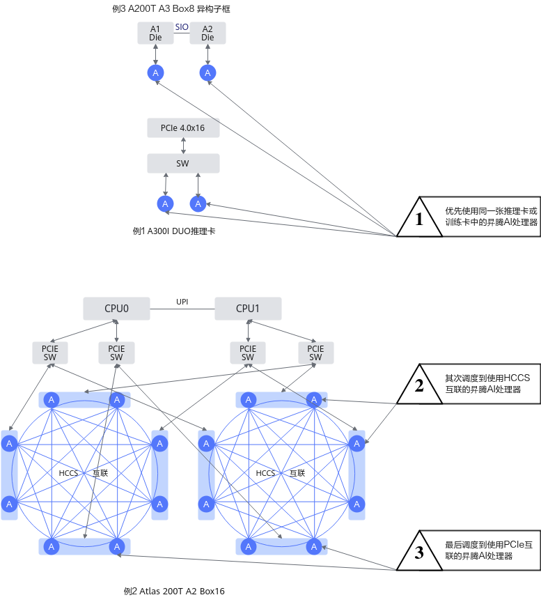

不同的硬件产品内部，可能包含这三种链接方式的一种或多种，具体的调度策略如下所示：

**表 1** **基于昇腾AI处理器的亲和性调度**

|硬件形态|昇腾AI处理器互联方式|减少网络拥塞|减少资源碎片|
|--|--|--|--|
|Atlas 训练系列产品|4个昇腾AI处理器通过HCCS互联；HCCS环间昇腾AI处理器通过PCIe互联。|申请4个及以下昇腾AI处理器的任务调度到一个HCCS环上。|若两个资源的网络情况一致，则选择调度后产生的资源碎片少的资源。|
|<p>Atlas 200T A2 Box16 异构子框</p><p>Atlas 200I A2 Box16 异构子框</p>|8个昇腾AI处理器通过HCCS互联；HCCS环间昇腾AI处理器通过PCIe互联。|<li>申请8个及以下昇腾AI处理器的任务调度到一个HCCS环上</li><li>申请8个以上昇腾AI处理器的任务平均调度到两个环上。</li>|若两个资源的网络情况一致，则选择调度后产生的资源碎片少的资源。|
|<p>Atlas 900 A3 SuperPoD 超节点</p><p>A200T A3 Box8 超节点服务器</p><p>Atlas 800I A3 超节点服务器</p><p>Atlas 800T A3 超节点服务器</p|2个昇腾AI处理器通过SIO互联，形成8个HiAM模组；每个HiAM模组通过HCCS互联。|申请的昇腾AI处理器个数为偶数时，必须调度到同一个HiAM模组上。|-|
|Atlas 800 推理服务器（型号 3000）（插Atlas 300I 推理卡）|每张推理卡内4个昇腾AI处理器互联，推理卡间不互联。|申请的昇腾AI处理器的个数为小于4，且配置了按推理卡调度时，该任务一定调度到一张推理卡上。|若两个资源的网络情况一致，则选择调度后产生的资源碎片少的资源。|
|Atlas 800 推理服务器（型号 3000）（插Atlas 300I Duo 推理卡）|每张推理卡内2个昇腾AI处理器通过HCCS互联，推理卡间通过PCIe互联。|<p>分布式推理调度，必须将任务调度到整张Atlas 300I Duo 推理卡。</p><p>若任务需要的昇腾AI处理器数量为单数时，使用单个昇腾AI处理器的部分，将优先调度到剩余昇腾AI处理器数量为1的Atlas 300I Duo 推理卡。</p>|若两个资源的网络情况一致，则选择调度后产生的资源碎片少的资源。|


**基于节点的亲和性调度<a name="section1144182323712"></a>**

节点间通过RoCE网络或者灵衢总线设备+RoCE网络连接。调度任务时，优先使用灵衢总线设备网络。RoCE网络采用Spine-Leaf网络架构，优先将网络流量控制在Leaf层内，必须使用Spine层时，保证流量均匀分布到各个Spine层。

-   采用RoCE连接的产品：Atlas 800T A2 训练服务器，Atlas 800I A2 推理服务器，A200I A2 Box 异构组件、Atlas 200T A2 Box16 异构子框、Atlas 200I A2 Box16 异构子框、Atlas 800 训练服务器（型号 9000）和Atlas 800 训练服务器（型号 9010）
-   采用RoCE连接单层连接的产品：Atlas 800I A2 推理服务器、A200I A2 Box 异构组件
-   采用灵衢+RoCE连接的产品：Atlas 900 A3 SuperPoD 超节点

**图 2**  节点间网络<a name="fig1728811518184"></a>  
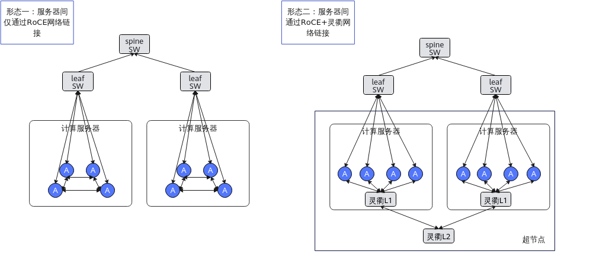

**表 2** **节点间亲和性调度**

|互联方式|昇腾AI处理器互联方式|调度方式|减少网络拥塞|减少组网成本|减少资源碎片|
|--|--|--|--|--|--|
|RoCE连接双层互联|通过Spine-Leaf全局双层互联|交换机亲和性调度1.0|<li>优先使用一个Leaf下的节点资源。</li><li>使用跨Leaf资源时，保证上行到各个Spine的流量均匀。</li><li>一个Leaf下的多个任务，最多有一个任务可以使用Spine流量，其他任务为Leaf内的小任务。</li>|-|若两个资源的网络情况一致，则选择调度后产生的资源碎片少的资源。|
|RoCE连接双层互联|通过Spine-Leaf全局双层互联|交换机亲和性调度2.0|<li>优先使用一个Leaf下的节点资源。</li><li>使用跨Leaf资源时，保证上行到各个Spine的流量均匀。</li><li>允许特定数量Leaf下的多个任务使用Spine流量。</li><li>一个Leaf下的多个任务，最多有一个任务可以使用Spine流量，其他任务为Leaf内的小任务。</li>|-|若两个资源的网络情况一致，则选择调度后产生的资源碎片少的资源。|
|RoCE连接单层连接|通过Leaf单层连接|单层交换机亲和性调度|-|使用单层组网即可满足参数面互联要求，大大降低组网成本。|若两个资源的网络情况一致，则选择调度后产生的资源碎片少的资源。|
|灵衢总线设备+RoCE|通过Spine-Leaf全局互联，通过灵衢总线设备网络形成多个超节点|逻辑超节点亲和性调度|根据任务的切分策略，获取网络通信需求高的网络亲和单元。保证每一个网络亲和单元都是分布在一个灵衢总线设备网络下。|-|若两个资源的网络情况一致，则选择调度后产生的资源碎片少的资源。|


## 基于昇腾AI处理器的亲和性<a name="ZH-CN_TOPIC_0000002511426813"></a>


### 亲和性规则<a name="ZH-CN_TOPIC_0000002479386908"></a>


#### Atlas 训练系列产品<a name="ZH-CN_TOPIC_0000002511346851"></a>

Atlas 训练系列产品的昇腾AI处理器是华为研发的一款高性能AI处理器。其内部的处理器之间采用HCCS（例如：A0\~A3为一个HCCS）方式连接。

每台设备具备两个HCCS环共8个昇腾AI处理器（A0\~A7）。每个HCCS存在4个昇腾AI处理器，同一HCCS内AI处理器可做数据交换，不同HCCS内昇腾AI处理器不能通信。同一Pod分配的昇腾AI处理器（若小于或等于4）必须在同一个HCCS环内，否则任务运行失败。Atlas 训练系列产品互联拓扑如[图1](#fig17063331201)所示，其中K0\~K3为鲲鹏处理器。

**图 1** Atlas 训练系列产品互联拓扑<a name="fig17063331201"></a>  
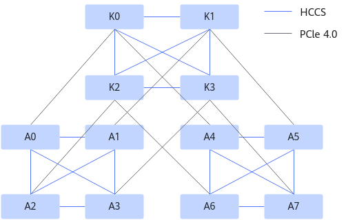

> [!NOTE] 说明 
>Atlas 800T A2 训练服务器和Atlas 900 A2 PoD 集群基础单元没有昇腾AI处理器的亲和性调度。

#### Atlas 200T A2 Box16 异构子框和Atlas 200I A2 Box16 异构子框<a name="ZH-CN_TOPIC_0000002479386922"></a>

Atlas 200T A2 Box16 异构子框和Atlas 200I A2 Box16 异构子框的昇腾AI处理器是华为研发的高性能AI处理器，其内部AI处理器之间采用HCCS互联的方式相连接。每台Atlas 200T A2 Box16 异构子框或Atlas 200I A2 Box16 异构子框具备两个HCCS互联共16个昇腾AI处理器，每个HCCS互联存在8个昇腾AI处理器，同一HCCS互联之间可以做数据交换，不同HCCS互联之间不能通信。即任务分配的昇腾AI处理器（若小于或等于8）必须在同一个HCCS互联内，否则任务运行失败。Atlas 200T A2 Box16 异构子框和Atlas 200I A2 Box16 异构子框的互联拓扑图如[图1](#fig1920102817143)所示。

**图 1** Atlas 200T A2 Box16 异构子框和Atlas 200I A2 Box16 异构子框互联拓扑<a name="fig1920102817143"></a>  
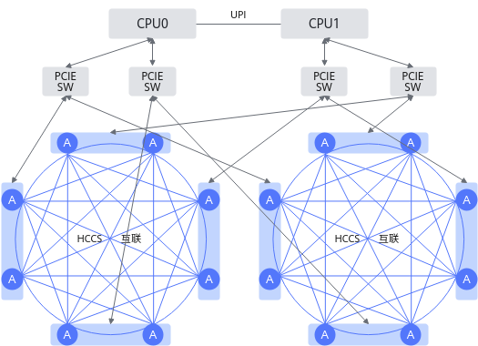

#### Atlas 900 A3 SuperPoD 超节点<a name="ZH-CN_TOPIC_0000002511346847"></a>

Atlas 900 A3 SuperPoD 超节点是华为研发的高性能AI计算集群，由多个计算节点组成。每个计算节点上，2个昇腾AI处理器之间通过SIO互联形成一个HiAM模组，例如0号和1号昇腾AI处理器形成一个HiAM模组；每个计算节点包含8个HiAM模组。HiAM模组之间采用HCCS-L1互联的方式连接；计算节点之间采用HCCS-L2互联的方式连接。通过L1端口级联和L2交换互联可以扩展多种规格的超节点。

任务可申请昇腾AI处理器的数量为1、2、4、6、8、10、12、14、16，申请的昇腾AI处理器需要优先占满整个计算节点；申请的昇腾AI处理器个数为偶数时，需要占满整个HiAM模组。例如任务申请的昇腾AI处理器数量为2，计算节点剩余的昇腾AI处理器序号为0、2、3和4时，由于只有2号和3号处于一个HiAM模组中，则该任务只能使用2号和3号昇腾AI处理器。分布式任务可申请的昇腾AI处理器的数量为2、4、6、8、10、12、14、16，若为逻辑超节点亲和任务，即任务YAML中的sp-block字段配置了逻辑超节点大小，则申请的昇腾AI处理器数量只能为16。

**灵衢总线设备节点网络说明<a name="section151785619495"></a>**

-   同一逻辑超节点中的计算节点之间使用HCCS网络通信，不同逻辑超节点中的计算节点之间使用RoCE网络通信。当任务的逻辑超节点数量（任务逻辑超节点数量=任务总芯片数量/sp-block）大于1时，请务必确保计算节点间RoCE网络的连通性。
-   譬如计算节点的芯片数量为16，任务的总芯片数量为64，sp-block为32。那么此任务将会被划分为2个逻辑超节点，即Pod（rank=0）和Pod（rank=1）会被划分为1个逻辑超节点。Pod（rank=2）和Pod（rank=3）将会被划分为另一个逻辑超节点。
-   此时Pod（rank=0）和Pod（rank=1）之间使用HCCS网络通信，Pod（rank=2）和Pod（rank=3）之间也使用HCCS网络通信。但是Pod（rank=0/1）和Pod（rank=2/3）之间使用RoCE网络通信。

**图 1**  灵衢总线设备节点网络<a name="fig1054553210321"></a>  
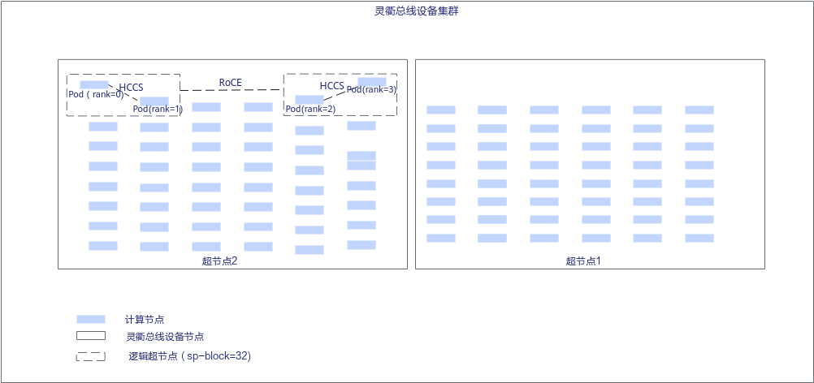

#### A200T A3 Box8 超节点服务器、Atlas 800I A3 超节点服务器和Atlas 800T A3 超节点服务器<a name="ZH-CN_TOPIC_0000002479386928"></a>

A200T A3 Box8 超节点服务器、Atlas 800I A3 超节点服务器、Atlas 800T A3 超节点服务器与Atlas 900 A3 SuperPoD 超节点的节点内亲和性基本一致。

A200T A3 Box8 超节点服务器、Atlas 800I A3 超节点服务器和Atlas 800T A3 超节点服务器的昇腾AI处理器是华为研发的高性能AI处理器，其内部每2个昇腾AI处理器之间通过SIO互联形成一个HiAM模组，例如0号和1号昇腾AI处理器形成一个HiAM模组。每个A200T A3 Box8 超节点服务器、Atlas 800I A3 超节点服务器和Atlas 800T A3 超节点服务器包含8个HiAM模组。HiAM模组之间采用HCCS互联的方式连接。

任务可申请昇腾AI处理器的数量为1、2、4、6、8、10、12、14、16，申请的昇腾AI处理器需要优先占满整个节点；申请的昇腾AI处理器个数为偶数时，需要占满整个HiAM模组。例如任务申请的昇腾AI处理器数量为2，节点剩余的昇腾AI处理器序号为0、2、3和4时，由于只有2号和3号处于一个HiAM模组中，则该任务只能使用2号和3号昇腾AI处理器。分布式任务可申请的昇腾AI处理器的数量为2、4、6、8、10、12、14、16。

#### 推理服务器（插Atlas 300I 推理卡）<a name="ZH-CN_TOPIC_0000002511426841"></a>

推理服务器（插Atlas 300I 推理卡）存在亲和性调度，如一台Atlas 800 推理服务器（型号 3000）最多支持插8张Atlas 300I 推理卡，每张Atlas 300I 推理卡存在4个昇腾AI处理器。使用推理服务器（插Atlas 300I 推理卡）的用户可以在下发任务YAML时，通过“npu-310-strategy“参数指定调度策略，只有指定按推理卡调度时，才可以实现亲和性调度。

npu-310-strategy参数取值说明如下：

-   card：按推理卡调度，request请求的昇腾AI处理器个数不超过4，使用同一张Atlas 300I 推理卡上的昇腾AI处理器。
-   chip：按昇腾AI处理器调度，请求的昇腾AI处理器个数不超过单个节点的最大值。

#### 推理服务器（插Atlas 300I Duo 推理卡）<a name="ZH-CN_TOPIC_0000002511426809"></a>

推理服务器（插Atlas 300I Duo 推理卡）存在亲和性调度，如一台Atlas 800 推理服务器（型号 3000）最多支持插4张Atlas 300I Duo 推理卡，每张Atlas 300I Duo 推理卡存在2个昇腾AI处理器。使用推理服务器（插Atlas 300I Duo 推理卡）的用户可以在下发任务YAML时，首先通过“duo“参数指定使用Atlas 300I Duo 推理卡，再通过“npu-310-strategy“参数指定调度模式，最后通过“distributed“参数指定调度策略。各参数的详细说明见[表1](#table65039365119)。

**表 1**  参数说明

|参数名|默认值|取值说明|
|--|--|--|
|duo|false|<li>true：使用Atlas 300I Duo 推理卡。</li><li>false：不使用Atlas 300I Duo 推理卡。</li>|
|npu-310-strategy|chip|<li>card：按推理卡调度，request请求的昇腾AI处理器个数不超过2，使用同一张Atlas 300I Duo 推理卡上的昇腾AI处理器。</li><li>chip：按昇腾AI处理器调度，请求的昇腾AI处理器个数不超过单个节点的最大值。</li>|
|distributed|false|<li>true：分布式推理调度策略。使用chip模式时，必须将任务调度到整张Atlas 300I Duo 推理卡。若任务需要的昇腾AI处理器数量为单数时，使用单个昇腾AI处理器的部分，将优先调度到剩余昇腾AI处理器数量为1的Atlas 300I Duo 推理卡。</li><li>false：非分布式推理调度策略。使用chip模式时，请求的昇腾AI处理器个数不超过单个节点的最大值。</li>无论是否为分布式推理，card模式的调度策略不变。|


### 单机场景亲和性策略<a name="ZH-CN_TOPIC_0000002511346873"></a>


#### Atlas 训练系列产品<a name="ZH-CN_TOPIC_0000002479226924"></a>


##### 亲和性调度策略<a name="ZH-CN_TOPIC_0000002479226916"></a>

Atlas 训练系列产品的昇腾AI处理器的特征和资源利用的规则如[表1](#table1436611225137)所示。

**表 1** Atlas 训练系列产品的AI处理器亲和性策略

|**优先级**|**策略名称**|**详细内容**|
|--|--|--|
|1|HCCS亲和性调度原则|选择同一HCCS内的昇腾AI处理器，提升通信性能。<li>如果申请昇腾AI处理器个数为1，则选择同一HCCS，且当前可用的昇腾AI处理器数量为1个的节点为最佳，3个次佳、其次是2个、4个。</li><li>如果申请昇腾AI处理器个数为2，则选择同一HCCS，且可用的昇腾AI处理器数量为2个的节点为最佳，4个次佳，其次是3个。</li><li>如果申请昇腾AI处理器个数为4，则选择同一HCCS，且可用的昇腾AI处理器数量为4个的节点。</li><li>如果申请昇腾AI处理器个数为8，则会选择申请节点的8个昇腾AI处理器。</li>|
|2|优先占满调度原则|优先分配已经分配过昇腾AI处理器的节点，减少碎片。<li>如果申请昇腾AI处理器个数为1，优先申请capacity（节点上资源容量）为8，且HCCS可用昇腾AI处理器数量为1的节点为最佳，3个次佳、其次是2个、4个。</li><li>如果申请昇腾AI处理器个数为2，优先申请capacity为8，且HCCS可用昇腾AI处理器数量为2个的节点为最佳，4个次佳，其次是3个。</li><li>如果申请昇腾AI处理器个数为4，优先申请capacity为8，且可用昇腾AI处理器数量为4个的节点。</li><li>如果申请昇腾AI处理器个数为8的正整数倍数，选择申请capacity为8，且已使用0个昇腾AI处理器的节点。</li> <p>下发分布式任务时，任务存在未按照优先占满调度原则占满某个节点。说明如下：</p><li>现象说明：如在两台Atlas 800 训练服务器（型号 9000）集群中，同时下发3卡、4卡、1卡任务，存在3卡和4卡任务调度到同一个节点，1卡任务调度到另一个节点的问题。</li><li>原因分析：因为Volcano调度完一个任务后，Ascend Device Plugin上报调度后的昇腾AI处理器的拓扑结构到mindx-dl-deviceinfo**-$***{node_name}*存在时延，导致Volcano校验该节点昇腾AI处理器数量失败，将任务调度到其他节点上。|</li>
|3|剩余偶数优先原则|优先选择满足上述1~2条调度原则的HCCS，其次选择剩余昇腾AI处理器数量为偶数的HCCS。|


##### 资源申请约束<a name="ZH-CN_TOPIC_0000002511426849"></a>

**Atlas 训练系列产品的资源申请约束<a name="section84725398320"></a>**

根据业务模型，对训练任务作如下要求：

-   训练任务申请的昇腾AI处理器数量不能大于节点昇腾AI处理器总数。
-   当训练任务申请的昇腾AI处理器数量不大于4个时，需要将所需的昇腾AI处理器调度到同一个HCCS内。
-   当训练任务申请的昇腾AI处理器数量为8个时，需要将节点的昇腾AI处理器全部分配给该任务。
-   当训练任务申请的昇腾AI处理器为虚拟设备vNPU时，申请数量只能为1。
-   遵循Volcano开源部分的其他约束。

**场景说明<a name="section102891131162919"></a>**

根据亲和性策略和业务模型梳理出的场景如[表1](#table1226225517318)所示。

**表 1** Atlas 训练系列产品亲和性策略场景

|**任务申请数**|**A**|**B**|**C**|**D**|
|--|--|--|--|--|
|1|1~[0,1,2,3,4]|3~[0,2,3,4]|2~[0,2,4]|4~[0,4]|
|2|2~[0,1,2,3,4]|4~[0,1,3,4]|3~[0,1]|-|
|4|4~[0,1,2,3,4]|-|-|-|
|8|8|-|-|-|


-   A\~D列4个分组，表示选择处理器，节点上满足昇腾AI处理器选取的四种HCCS场景。在选择昇腾AI处理器时，这四种场景的优先级逐次递减，即当A场景不满足调度要求时，才会选择B，C，D。
-   当组内满足HCCS亲和性时，节点的昇腾AI处理器剩余情况。‘\~’左边为满足要求的HCCS的昇腾AI处理器剩余情况，右边为另一个HCCS的昇腾AI处理器剩余情况。如对于申请1个昇腾AI处理器的A组情况；另一个HCCS可能为0、1、2、3、4等五种昇腾AI处理器剩余情况。
-   任务申请昇腾AI处理器数大于或等于8时，均放在A组，需要全部占用。

#### Atlas 200T A2 Box16 异构子框和Atlas 200I A2 Box16 异构子框<a name="ZH-CN_TOPIC_0000002511346843"></a>


##### 亲和性调度策略<a name="ZH-CN_TOPIC_0000002479386904"></a>

Atlas 200T A2 Box16 异构子框和Atlas 200I A2 Box16 异构子框的特征和资源利用的规则如[表1](#table768417221315)所示。

**表 1** Atlas 200T A2 Box16 异构子框和Atlas 200I A2 Box16 异构子框亲和性策略

|优先级|策略名称|策略描述|
|--|--|--|
|1|HCCS互联分配原则|如果申请昇腾AI处理器的个数为1~8，则需要调度到同一个HCCS互联。如果申请昇腾AI处理器的个数为10、12、14，需要将所需的昇腾AI处理器平均分配到两个环，相对的物理地址也一致。|
|2|优先占满原则|优先分配已经分配过昇腾AI处理器的节点，减少碎片。以1、2、4、8为例，具体如下：<li>如果申请1个昇腾AI处理器，优先申请HCCS互联可用昇腾AI处理器数量为1的节点，其次是可用数量为2个，3个，一直到8个。相同数量优先选择节点昇腾AI处理器总数量少的节点。</li><li>如果申请2个昇腾AI处理器，优先申请HCCS互联可用昇腾AI处理器数量为2的节点，其次是可用数量为3个，4个，一直到8个。相同数量优先选择节点昇腾AI处理器总数量少的节点。</li><li>如果申请4个昇腾AI处理器，优先申请HCCS互联可用昇腾AI处理器数量为4的节点，其次是可用数量为5个，6个，一直到8个。相同数量优先选择节点昇腾AI处理器总数量少的节点。</li><li>如果申请8个昇腾AI处理器，只申请HCCS互联可用昇腾AI处理器数量为8的节点。相同数量优先选择节点昇腾AI处理器总数量少的节点。</li><p>下发分布式任务时，任务存在未按照优先占满调度原则占满某个节点。说明如下：</p><li>现象说明：如在两台Atlas 200T A2 Box16 异构子框或Atlas 200I A2 Box16 异构子框集群中，同时下发5卡、4卡、3卡任务，存在4卡和3卡任务调度到同一个节点，5卡任务调度到另一个节点的问题。</li><li>原因分析：因为Volcano调度完一个任务后，Ascend Device Plugin上报调度后的昇腾AI处理器的拓扑结构到mindx-dl-deviceinfo**-$***{node_name}*存在时延，导致Volcano校验该节点昇腾AI处理器数量失败，将任务调度到其他节点上。</li>|


##### 资源申请约束<a name="ZH-CN_TOPIC_0000002511426829"></a>

**Atlas 200T A2 Box16 异构子框和Atlas 200I A2 Box16 异构子框的资源申请约束<a name="section1283218207311"></a>**

根据业务模型，对Atlas 200T A2 Box16 异构子框和Atlas 200I A2 Box16 异构子框训练任务资源申请作如下要求：

-   训练任务申请的昇腾AI处理器数量不能大于节点昇腾AI处理器总数。
-   训练任务申请的昇腾AI处理器数量为1\~8、10、12、14和16。
-   当训练任务申请的昇腾AI处理器数量不大于8个时，需要选取同一个HCCS互联内的昇腾AI处理器。
-   当训练任务申请的昇腾AI处理器数量为10、12、14时，需要将所需的昇腾AI处理器平均分配到两个环，相对的物理地址也一致。
-   当训练任务申请的昇腾AI处理器数量为16个时，需要将节点的昇腾AI处理器全部分配给该任务。
-   遵循Volcano开源部分的其他约束。

#### Atlas 900 A3 SuperPoD 超节点<a name="ZH-CN_TOPIC_0000002511346861"></a>


##### 亲和性调度策略<a name="ZH-CN_TOPIC_0000002479226958"></a>

Atlas 900 A3 SuperPoD 超节点的资源利用规则如[表1](#table42428468401)所示。

**表 1** Atlas 900 A3 SuperPoD 超节点亲和性策略

|优先级|策略名称|策略描述|
|--|--|--|
|1|优先占满节点|节点芯片数量越少，优先级越高。<p>下发单机任务时，任务存在未按照优先占满调度原则占满某个节点。说明如下：</p><li>现象说明：如在Atlas 900 A3 SuperPoD 超节点中，同时下发2卡、14卡任务，存在2卡和14卡任务未调度到同一个节点。</li><li>原因分析：因为Volcano调度完一个任务后，Ascend Device Plugin上报调度后的昇腾AI处理器的拓扑结构到mindx-dl-deviceinfo**-$***{node_name}*存在时延，导致Volcano校验该节点昇腾AI处理器数量失败，将任务调度到其他节点上。</li>|
|2|优先剩余保留节点|当超节点保留节点为2，两个超节点中分别剩余3个节点和2个节点时，优先选择剩余3个节点的超节点。|
|3|优先占满超节点|当超节点保留节点为2，两个超节点中分别剩余4个节点和3个节点时，优先选择剩余3个节点的超节点。|


##### 资源申请约束<a name="ZH-CN_TOPIC_0000002511426825"></a>

根据业务模型，对Atlas 900 A3 SuperPoD 超节点训练任务资源申请作如下要求：

-   训练任务申请的昇腾AI处理器数量不能大于节点昇腾AI处理器总数。
-   训练任务申请的昇腾AI处理器数量只能为1、2、4、6、8、10、12、14、16。
-   遵循Volcano开源部分的其他约束。

#### Atlas 800I A3 超节点服务器和Atlas 800T A3 超节点服务器<a name="ZH-CN_TOPIC_0000002479226934"></a>


##### 亲和性调度策略<a name="ZH-CN_TOPIC_0000002479226920"></a>

Atlas 800I A3 超节点服务器和Atlas 800T A3 超节点服务器的资源利用规则如[表1](#table42428468401)所示。

**表 1** Atlas 800I A3 超节点服务器和Atlas 800T A3 超节点服务器亲和性策略

|优先级|策略名称|策略描述|
|--|--|--|
|1|优先占满节点|节点芯片数量越少，优先级越高。<p>下发单机任务时，任务存在未按照优先占满调度原则占满某个节点。说明如下：</p><li>现象说明：如在Atlas 800I A3 超节点服务器和Atlas 800T A3 超节点服务器中，同时下发2卡、14卡任务，存在2卡和14卡任务未调度到同一个节点。</li><li>原因分析：因为Volcano调度完一个任务后，Ascend Device Plugin上报调度后的昇腾AI处理器的拓扑结构到mindx-dl-deviceinfo**-$***{node_name}*存在时延，导致Volcano校验该节点昇腾AI处理器数量失败，将任务调度到其他节点上。</li>|


##### 资源申请约束<a name="ZH-CN_TOPIC_0000002511346857"></a>

根据业务模型，对Atlas 800I A3 超节点服务器和Atlas 800T A3 超节点服务器训练任务资源申请作如下要求：

-   训练任务申请的昇腾AI处理器数量不能大于节点昇腾AI处理器总数。
-   训练任务申请的昇腾AI处理器数量只能为1、2、4、6、8、10、12、14、16。
-   遵循Volcano开源部分的其他约束。

#### A200T A3 Box8 超节点服务器<a name="ZH-CN_TOPIC_0000002479226954"></a>


##### 亲和性调度策略<a name="ZH-CN_TOPIC_0000002511426851"></a>

A200T A3 Box8 超节点服务器的资源利用规则如[表1 A200T A3 Box8 异构子框亲和性策略](#table42428468401)所示。

**表 1** A200T A3 Box8 超节点服务器亲和性策略

|优先级|策略名称|策略描述|
|--|--|--|
|1|优先占满节点|节点芯片数量越少，优先级越高。<p>下发分布式任务时，任务存在未按照优先占满调度原则占满某个节点。说明如下：</p><li>现象说明：如在A200T A3 Box8 超节点服务器中，同时下发2卡、14卡任务，存在2卡和14卡任务未调度到同一个节点。</li><li>原因分析：因为Volcano调度完一个任务后，Ascend Device Plugin上报调度后的昇腾AI处理器的拓扑结构到mindx-dl-deviceinfo**-$***{node_name}*存在时延，导致Volcano校验该节点昇腾AI处理器数量失败，将任务调度到其他节点上。</li>|


##### 资源申请约束<a name="ZH-CN_TOPIC_0000002511346869"></a>

根据业务模型，对A200T A3 Box8 超节点服务器训练任务资源申请作如下要求：

-   训练任务申请的昇腾AI处理器数量不能大于节点昇腾AI处理器总数。
-   训练任务申请的昇腾AI处理器数量只能为1、2、4、6、8、10、12、14、16。
-   遵循Volcano开源部分的其他约束。

#### 推理服务器（插Atlas 300I 推理卡）<a name="ZH-CN_TOPIC_0000002479226950"></a>


##### 亲和性调度策略<a name="ZH-CN_TOPIC_0000002511426811"></a>

推理服务器（插Atlas 300I 推理卡）的特征和资源利用的规则如[表1](#table768417221315)所示。

**表 1**  推理服务器（插Atlas 300I 推理卡）亲和性策略

|策略名称|策略描述|
|--|--|
|按推理卡亲和性调度原则|优先选择同一张Atlas 300I 推理卡的昇腾AI处理器。<p>申请昇腾AI处理器个数为1~4，则选择同一张Atlas 300I 推理卡，且当前可用的Atlas 300I 推理卡数量为1个的节点为最佳，3个次佳、其次是2个、4个。</p>|


##### 资源申请约束<a name="ZH-CN_TOPIC_0000002511346877"></a>

根据业务模型，对推理任务作如下要求：

-   推理任务申请的昇腾AI处理器数量不能大于节点昇腾AI处理器总数。
-   当推理任务申请的昇腾AI处理器数量小于或等于4个时，需要将推理任务调度到同一张Atlas 300I 推理卡内。
-   遵循Volcano开源部分的其他约束。

#### 推理服务器（插Atlas 300I Duo 推理卡）<a name="ZH-CN_TOPIC_0000002479386934"></a>


##### 亲和性调度策略<a name="ZH-CN_TOPIC_0000002479226926"></a>

推理服务器（插Atlas 300I Duo 推理卡）的特征和资源利用的规则如下表所示。

**表 1**  推理服务器（插Atlas 300I Duo 推理卡）亲和性策略

|策略名称|策略描述|
|--|--|
|按推理卡亲和性调度原则|优先选择同一张Atlas 300I Duo 推理卡的昇腾AI处理器。<p>申请昇腾AI处理器个数为1~2，则选择同一张Atlas 300I Duo 推理卡，且当前可用的Atlas 300I Duo 推理卡数量为1个的节点为最佳，其次是2个。</p>|
|分布式推理按昇腾AI处理器调度|必须将任务调度到整张Atlas 300I Duo 推理卡上。若任务需要的昇腾AI处理器数量为单数时，使用单个昇腾AI处理器的部分，将优先调度到剩余昇腾AI处理器数量为1的Atlas 300I Duo 推理卡上。|


##### 资源申请约束<a name="ZH-CN_TOPIC_0000002511426815"></a>

根据业务模型，对此类推理任务作如下要求：

-   推理任务申请的昇腾AI处理器数量不能大于节点昇腾AI处理器总数。
-   当推理任务申请的昇腾AI处理器数量小于或等于2个时，需要将推理任务调度到同一张Atlas 300I Duo 推理卡内。
-   当使用分布式推理时，任务所有副本只能部署在同一节点内，申请的总昇腾AI处理器数量不能大于节点昇腾AI处理器总数。
-   遵循Volcano开源部分的其他约束。

### 分布式场景亲和性策略<a name="ZH-CN_TOPIC_0000002511426821"></a>

**Atlas 训练系列产品分布式亲和性策略<a name="section141921857164115"></a>**

分布式训练任务每个节点申请的昇腾AI处理器个数支持1、2、4、8，并且每个任务需要调度到不同节点。

-   MindCluster  5.0.RC1版本之前，由于底层的限制，分布式训练任务每个节点申请的昇腾AI处理器个数只支持8个。

-   MindCluster  5.0.RC1及其之后版本，分布式训练任务每个节点申请的昇腾AI处理器个数支持1、2、4、8。其中单个节点的亲和性策略请参考[单机场景亲和性策略](#单机场景亲和性策略)。

**Atlas 200T A2 Box16 异构子框和Atlas 200I A2 Box16 异构子框分布式亲和性策略<a name="section1514432814143"></a>**

-   Atlas 200T A2 Box16 异构子框和Atlas 200I A2 Box16 异构子框分布式任务每个节点申请的昇腾AI处理器个数支持1\~8、10、12、14和16个。
-   当训练任务申请的昇腾AI处理器数量不大于8个时，需要选择HCCS互联内的昇腾AI处理器。
-   当训练任务申请的昇腾AI处理器数量为10、12、14时，仅需要将所需的昇腾AI处理器平均分配到两个环，相对的物理地址可以不一致。

**Atlas 900 A3 SuperPoD 超节点分布式亲和性策略<a name="section4162187114513"></a>**

-   若为逻辑超节点亲和任务，即任务YAML中的sp-block字段配置了逻辑超节点大小，则申请的昇腾AI处理器数量只能为16。
-   若使用非16张卡的分布式调度，将任务YAML中的huawei.com/schedule\_policy字段配置为chip2-node16后，其亲和性策略与Atlas 800T A3 超节点服务器相同。当多个任务Pod调度到单个节点上时，不支持Pod间的集合通信。

**A200T A3 Box8 超节点服务器、Atlas 800I A3 超节点服务器和Atlas 800T A3 超节点服务器分布式亲和性策略<a name="section13474194413317"></a>**

任务申请的昇腾AI处理器数量支持2、4、6、8、10、12、14、16。当多个任务Pod调度到单个节点上时，不支持Pod间的集合通信。

**推理服务器（插Atlas 300I 推理卡）分布式亲和性策略<a name="section4705578519"></a>**

-   推理任务申请的昇腾AI处理器数量不能大于节点的昇腾AI处理器总数。
-   当推理任务申请的昇腾AI处理器数量小于或等于4个时，需要将推理任务调度到同一张Atlas 300I 推理卡内。

**推理服务器（插Atlas 300I Duo 推理卡）分布式亲和性策略<a name="section195417249277"></a>**

-   推理任务申请的昇腾AI处理器数量不能大于节点的昇腾AI处理器总数。
-   当推理任务申请的昇腾AI处理器数量小于或等于2个时，需要将推理任务调度到同一张Atlas 300I Duo 推理卡内。

## 基于节点的亲和性<a name="ZH-CN_TOPIC_0000002479226930"></a>


### 方案介绍<a name="ZH-CN_TOPIC_0000002479386916"></a>

为了解决Spine-Leaf网络架构下，Spine交换机下行流量冲突问题，MindCluster为用户提供了两个版本的交换机亲和性调度。为了减少组网成本，MindCluster支持用户单层组网的交换机亲和性调度。为了最大化利用带宽更高的超节点灵衢网络，MindCluster为用户提供逻辑超节点亲和性调度。交换机亲和性，即一个Leaf交换机下有多个节点，系统会根据配置的交换机亲和性规则，选择最合适的节点分配给训练任务。

-   交换机亲和性调度1.0

    由Volcano进行亲和性调度，保证任务训练时的流量不会造成Spine交换机的下行流量冲突。当前支持的产品为Atlas 训练系列产品和Atlas A2 训练系列产品；支持的框架为PyTorch和MindSpore框架。

-   交换机亲和性调度2.0

    采用Volcano+iMaster NCE-Fabric的方案，通过iMaster NCE-Fabric来动态计算训练任务通信时的网络通路，不再使用调度器来解决Spine交换机下行流量冲突。同时支持一个交换机下的节点可以被多个跨交换机的任务使用，提高集群的资源利用率。当前支持的产品为Atlas A2 训练系列产品；支持的框架为PyTorch框架。

-   单层交换机亲和性调度

    支持Atlas 800I A2 推理服务器、A200I A2 Box 异构组件进行单层组网（只有Leaf层没有Spine层），使用单层交换机亲和性调度，选择最合适的节点分配给分布式推理任务。

-   逻辑超节点亲和性调度

    Atlas 900 A3 SuperPoD 超节点产品存在超节点，集群调度组件在下发训练任务时会对其物理超节点根据切分策略划分出逻辑超节点，用于训练产品的亲和性调度。

>> [!NOTE] 说明 
>-   当前只支持训练和推理任务进行整卡的交换机亲和性调度，不支持静态或动态vNPU调度。
>-   使用交换机亲和性调度2.0前，请先参见《[Ascend Training Solution 24.0.0 组网指南（Atlas A2训练产品）](https://support.huawei.com/enterprise/zh/doc/EDOC1100437043)》中的“参数面网络配置示例 \> 网络配置说明 \> NSLB配置策略”和“配置示例”章节，了解相关参数面组网的原理说明和操作指导。

**交换机亲和性调度1.0流程图<a name="section116221319144514"></a>**

交换机亲和性调度1.0的调度逻辑请参见[图1](#fig1189110673717)。

**图 1**  调度流程<a name="fig1189110673717"></a>  
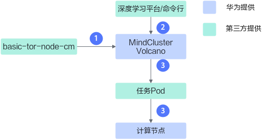

步骤说明如下：

1.  Volcano读取basic-tor-node-cm文件获取集群的拓扑信息，为调度任务做准备。
2.  用户从深度学习平台或命令行下发训练任务。
3.  Volcano根据从basic-tor-node-cm中获取的信息，将任务Pod调度到合适的计算节点上；并在任务Pod的annotation中写入该Pod调度时当前节点的交换机状态。

**交换机亲和性调度2.0流程图<a name="section109765354917"></a>**

交换机亲和性调度2.0的调度逻辑请参见[图2](#fig178701112193911)。

**图 2**  调度流程<a name="fig178701112193911"></a>  
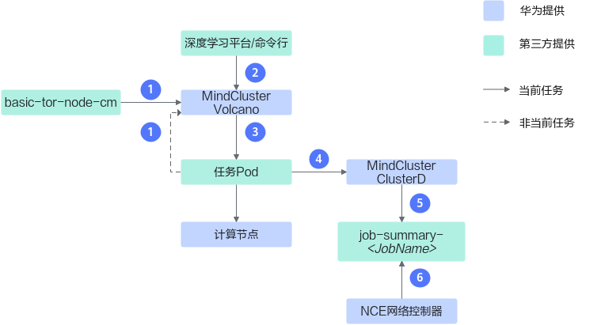

步骤说明如下：

1.  Volcano读取basic-tor-node-cm文件获取集群的拓扑信息；Volcano读取集群中所有任务Pod上的annotation来获取集群中每个交换机状态，为调度任务做准备。
2.  用户从深度学习平台或命令行下发训练任务。
3.  Volcano根据从basic-tor-node-cm中获取的信息，将任务Pod调度到合适的计算节点上；并在任务Pod的annotation中写入该Pod调度时当前节点的交换机状态。
4.  ClusterD通过informer机制感知到任务调度到合适的计算节点，并且汇集任务所有Pod的信息。
5.  ClusterD将任务信息写到job-summary-<JobName\> ConfigMap中。
6.  iMaster NCE-Fabric通过job-summary-_<JobName\>_ ConfigMap文件读取任务的信息，动态计算训练任务通信时的网络通路。

**任务说明<a name="section1853122363817"></a>**

交换机亲和性调度针对不同的任务类型，选择不同的调度策略。任务类型是下发训练任务YAML中的tor-affinity字段取值，不同任务类型对任务的副本数要求不同，具体说明如下：

**表 1**  任务类型说明

|任务类型|任务标签|任务副本数|
|--|--|--|
|普通任务|normal-schema|不限|
|大模型任务|large-model-schema|大于或等于4|
|填充任务|large-model-schema|小于4|


### 交换机亲和性调度1.0<a name="ZH-CN_TOPIC_0000002479386912"></a>

**使用说明<a name="section176781621152118"></a>**

-   同一个交换机，不能同时被多个跨交换机的任务调用。
-   本章节所指交换机默认为Leaf交换机。

**普通任务交换机亲和性<a name="section1768451918221"></a>**

-   普通任务副本数小于M时，M为一台Leaf交换机下的节点个数，优先选择满足任务副本数要求，且剩余可用节点少的交换机下的节点；其次选择未被使用的交换机下的节点；再次选择跨交换机时不会产生Spine交换机下行流量拥塞的节点；最后随机调度。
-   普通任务副本数大于或等于M时，M为一台Leaf交换机下的节点个数，优先选择满足任务副本数要求，且剩余可用节点少的交换机下的节点；其次选择跨交换机时不会产生Spine交换机下行流量拥塞的节点；最后随机调度。

**大模型任务交换机亲和性<a name="section11162033112319"></a>**

-   大模型任务副本数小于4时，优先选择满足任务副本数要求，且剩余可用节点少的交换机下的节点；其次选择未被使用的交换机下的节点。
-   大模型任务副本数大于或等于4且小于M时，M为一台Leaf交换机下的节点个数，优先选择满足任务副本数要求，且剩余可用节点少的交换机下的节点；其次选择未被使用的交换机下的节点；最后选择跨交换机时不会产生Spine交换机下行流量拥塞的节点。
-   大模型任务副本数大于或等于M时，M为一台Leaf交换机下的节点个数，优先选择满足任务副本数要求，且剩余可用节点少的交换机下的节点；其次选择跨交换机时不会产生Spine交换机下行流量拥塞的节点。

**填充任务交换机亲和性<a name="section31461971908"></a>**

填充任务优先选择满足任务副本数要求，且剩余可用节点少的交换机下的节点；其次选择未被使用的交换机下的节点。

**故障重调度<a name="section1614032710011"></a>**

当任务所在节点或昇腾AI处理器出现故障时，任务会发生故障重调度。重调度前使用正常节点的Pod将会再次调度到原节点继续训练，故障节点上的Pod重新选择节点。

### 交换机亲和性调度2.0<a name="ZH-CN_TOPIC_0000002479226944"></a>

当前只支持PyTorch框架使用交换机亲和性调度2.0。

**使用说明<a name="section12471415896"></a>**

-   本章节所指交换机默认为Leaf交换机，一个交换机下的节点可以被多个跨交换机任务调度。
-   跨交换机任务是指一个任务的Pod可以部署在多个交换机的节点下。
-   交换机存在以下几种状态，用户可以通过**kubectl describe cm -n volcano-system tor-share-cm**命令查询集群中的交换机状态。

    > [!NOTE] 说明 
    >ConfigMap中关键字段取值说明如下。
    >-   IsSharedTor：取值为0表示空闲交换机；取值为1表示共享交换机；取值为2表示独占交换机。
    >-   IsHealthy：取值为0表示健康共享交换机；取值为1表示非健康共享交换机。

    -   独占交换机：该交换机下只存在一个跨交换机任务，并且不允许新的跨交换机的任务调度到该交换机下的节点。
    -   共享交换机：被多个跨交换机任务使用的交换机。
        -   健康共享交换机：交换机下的任务使用的共享交换机数量都满足集群最大共享交换机数量要求。
        -   非健康共享交换机：交换机下任务使用的共享交换机数量大于集群最大共享交换机数量要求。

            >[!NOTE] 说明 
            >大模型任务不能调度到非健康共享交换机下的节点，填充任务和普通任务可以调度到非健康共享交换机。

    -   空闲交换机：该交换机下的节点没有任务或者只有填充任务。

-   任务使用的共享交换机数量不能超过集群共享交换机数量限制。

**普通任务交换机亲和性<a name="section2189181015505"></a>**

-   如果集群资源能满足大模型任务调度逻辑，使用大模型任务的调度逻辑进行调度。
-   如果集群资源无法满足大模型任务调度逻辑，优先占满集群中所有的空闲交换机，并且修改交换机属性为独占；剩余未调度的N个Pod使用共享交换机。剩余N个Pod优先调度到非健康的共享交换机下的节点，然后再调度到只有普通任务的共享交换机下的节点，如果还有Pod未进行调度，则将任务状态修改为Pending。

**大模型任务交换机亲和性<a name="section173070553422"></a>**

**表 1**  节点亲和性策略

|亲和性调度策略|详细内容|
|--|--|
|独占交换机调度策略|按照交换机下可用节点数量，从大到小依次占满空闲交换机下的节点，直到剩余N个Pod未进行调度或者无法占满单个交换机下的节点。<p>被占满的空闲交换机属性修改为独占交换机，未调度的N个Pod使用共享交换机，遵循共享交换机调度策略。</p>|
|共享交换机调度策略|优先使用独占交换机策略，占满空闲交换机下的节点后还剩余N个Pod未被调度，将采取以下共享交换机调度策略。<ul><li>集群中任务可使用的共享交换机数量为1时<ul><li>选择共享交换机节点数量最接近N的交换机进行调度。</li><li>如果没有共享交换机满足，选择空闲交换机最接近N的交换机进行调度，并将该交换机属性修改为共享交换机。</li></ul></li><li>集群中任务可使用的共享交换机数量为2时<ul><li>选择一个共享交换机下可用节点数量，或者两个共享交换机下可用节点数量之和最接近N的交换机进行调度。</li><li>如果一个交换机和两个交换机组合的节点数量相同，优先选择两个交换机的组合。</li><li>如果没有共享交换机满足，选择空闲且独占交换机最接近N的交换机进行调度，并将该交换机属性修改为共享交换机。</li></ul>|


**填充任务交换机亲和性<a name="section1252971975613"></a>**

不允许跨交换机调度，只允许将Pod部署在单个交换机内。优先使用独占交换机下节点数最接近任务Pod数的交换机下的节点，其次选择共享交换机下的节点，最后选择空闲交换机下的节点。

**故障重调度<a name="section1614032710011"></a>**

当任务所在节点或昇腾AI处理器出现故障时，任务会发生故障重调度。重调度前使用正常节点的Pod将会再次调度到原节点继续训练，故障节点上的Pod重新选择节点。优先选择重调度前任务使用的独占交换机下的其他节点，其次选择重调度前任务使用的共享交换机下的其他节点，最后使用重调度前未使用的节点。

### 单层交换机亲和性调度<a name="ZH-CN_TOPIC_0000002511346841"></a>

**使用说明<a name="section1320110477345"></a>**

-   仅支持分布式推理任务进行单层交换机亲和性调度。
-   任务副本总数不超过单个交换机下最大节点数。
-   任务只能部署在同一个交换机下。
-   满足任务需求前提下，优先选用剩余节点更少的交换机下的节点。

**故障重调度<a name="section1980293903511"></a>**

当任务所在节点或昇腾AI处理器出现故障时，任务会发生故障重调度。重调度前正常运行的节点的Pod将会再次调度到原节点继续训练，故障节点上的Pod重新选择节点。

### 逻辑超节点亲和性调度<a name="ZH-CN_TOPIC_0000002479386896"></a>

**使用说明<a name="section773381911315"></a>**

-   逻辑超节点的数量必须小于物理超节点数量。
-   逻辑超节点内的节点必须在物理超节点内。
-   逻辑超节点内的NPU卡的rank ID是连续的。

**普通任务调度<a name="section082914315117"></a>**

-   逻辑超节点调度优先保证物理超节点内有预留节点，其次优先使用剩余节点更少的超节点。
-   用户可在任务YAML中指定sp-block字段，用于指定逻辑超节点芯片数量，单机时需要和任务请求的芯片数量一致，分布式时需要是节点芯片数量的整数倍，且任务总芯片数量是其整数倍。若用户未指定该字段，Volcano调度时会将此任务的逻辑超节点大小指定为任务配置的NPU总数。

**故障任务重调度<a name="section84520611516"></a>**

-   如果逻辑超节点中的所有节点都没有故障，重调度时需继续使用该逻辑超节点下的节点。
-   若逻辑超节点中的某些节点发生故障不可用，则从所在物理超节点选取节点，其他节点保持不变。
-   若物理超节点中剩余节点已不能满足逻辑超节点，则逻辑超节点上的任务全部调度到其他物理超节点。

**MindIE Service推理任务调度<a name="section243084619505"></a>**

MindIE Service推理任务中，新增如下亲和性调度策略。如需了解该亲和性调度策略的详细配置说明，请参见[配置实例级亲和性调度](./usage/mindie_motor_best_practice.md#可选配置实例级亲和调度)章节。

-   用户可在任务YAML中指定sp-block字段，sp-block的值必须和job芯片数量一致，保证整个job调度到一个物理超节点中。

-   逻辑超节点调度优先保证物理超节点内有预留节点。
-   同一个推理任务中处于同一物理超节点的节点通信走内部HCCS网络。

-   用户设置sp-fit为idlest时，逻辑超节点会往更空闲的物理超节点调度。
-   用户设置podAffinity时，逻辑超节点会往具有更多亲和性Pod的物理超节点调度。

## 昇腾AI处理器的调度算法说明<a name="ZH-CN_TOPIC_0000002511346839"></a>


### 流程介绍<a name="ZH-CN_TOPIC_0000002511346865"></a>

调度器的调度流程主要包括任务校验、节点预选、节点优选、昇腾AI处理器选择、提交分配结果。Volcano的亲和性调度代码实现请参考[ascend-for-volcano](https://gitcode.com/Ascend/mind-cluster/tree/master/component/ascend-for-volcano)开源代码仓，用户可参考代码在其调度器中集成亲和性调度策略。下文以Atlas 训练系列产品的昇腾AI处理器为例，介绍Volcano的调度流程。

**图 1** Volcano调度流程<a name="fig17808636817"></a>  
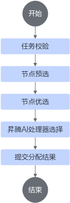

**流程说明<a name="section59871036124915"></a>**

1.  任务校验：校验单机、分布式任务请求的昇腾AI处理器数目。
2.  节点预选：判断节点NPU数量是否满足任务。
3.  节点优选：根据亲和性策略对预选后的节点进行打分。
4.  昇腾AI处理器选择：在最优的节点选取昇腾AI处理器。
5.  提交分配结果：Volcano框架将分配结果提交给Kubernetes。

### 任务校验<a name="ZH-CN_TOPIC_0000002479386894"></a>

**任务说明<a name="section188628591428"></a>**

对任务所需昇腾AI处理器数量进行判断；Atlas 训练系列产品要求的昇腾AI处理器数量只能是1、2、4、8。

**具体实现<a name="section158817331130"></a>**

具体代码实现请参考开源代码中[ValidNPUJob](https://gitcode.com/Ascend/mind-cluster/blob/branch_v7.2.RC1/component/ascend-for-volcano/internal/npu/base/frame.go)方法。ValidNPUJob用于校验用户下发配置的合理性，此时不会校验集群环境上的真实资源是否充足，而是单纯校验任务的关键字段是否完整，字段的值域是否正确，字段之间是否匹配。

### 节点预选<a name="ZH-CN_TOPIC_0000002479386932"></a>

**任务说明<a name="section134971615243"></a>**

根据任务所需昇腾AI处理器数量和节点可用昇腾AI处理器数量，判断节点是否满足任务需求。Atlas 训练系列产品要求任务所需昇腾AI处理器为1、2、4时，只能在一个HCCL环内进行选择。

例如某个任务需要4个昇腾AI处理器，某个节点具有4个昇腾AI处理器，但这4个并未在同一个HCCL环内，而是两环各两个，则不选择该节点分配任务。

**具体实现<a name="section185864321413"></a>**

具体代码实现请参考开源代码中[CheckNodeNPUByTask](https://gitcode.com/Ascend/mind-cluster/blob/branch_v7.2.RC1/component/ascend-for-volcano/internal/npu/ascend910/ascend910old/module910x8/frame.go)方法。其中通过GetTaskReqNPUNum方法获取到训练任务请求的昇腾AI处理器数量，再通过GetUsableTopFromNode方法获取到节点可用NPU资源。JudgeNodeAndTaskNPU方法实现了判断节点NPU资源是否满足任务需求的功能。

### 节点优选<a name="ZH-CN_TOPIC_0000002479226940"></a>

**任务说明<a name="section19753825358"></a>**

根据亲和性策略，对通过节点预选的所有节点打分，并由调度器选择最终的节点。

例如Pod任务需要1个昇腾AI处理器，现在有满足任务的两个节点A和B，其中节点A的某一个HCCL环剩余1个昇腾AI处理器，节点B两个环分别剩余2个和3个昇腾AI处理器，根据亲和性策略，节点A会获得更高的分数。

**具体实现<a name="section15355114514519"></a>**

具体代码实现请参考开源代码中[ScoreBestNPUNodes](https://gitcode.com/Ascend/mind-cluster/blob/branch_v7.2.RC1/component/ascend-for-volcano/internal/npu/ascend910/ascend910old/module910x8/frame.go)方法，其中getNodeBestScore方法实现了根据亲和性确定节点优先级。在选择节点时，优先检测是否配置了交换机亲和性调度和逻辑超节点亲和性调度。既没有配置交换机亲和性调度，又没有逻辑超节点亲和性调度，则使用普通节点优选原则。

**普通节点优选原则<a name="section1797111616358"></a>**

使用二维数组表示节点对任务的契合度，如affScoreList\[i\]\[j\]，i表示任务的1个Pod所需的芯片数量减1，j表示节点当前可用的芯片数量减1，affScoreList\[i\]\[j\]取值表示该节点的不契合程度。

例如任务的1个Pod所需的芯片数量为6，此时可用芯片数为1\~5的节点为完全不满足调度需求的节点，因此不契合程度就设置成最高的8。可用芯片数为6的节点刚好满足调度需求，且不会产生资源碎片，不契合程度就设置成最低的0。对于可用芯片数为7、8的节点，考虑到尽量减少资源碎片，因此他们的不契合程度分别为1，2。因此可推出：

affScoreList\[5\] = \[\]int\{8,8,8,8,8,0,1,2\}

同理可得

affScoreList\[3\] = \[\]int\{8,8,8,0,1,2,3,4\}

部分产品的总芯片数量不一致，或者存在HCCS环等情况，该二维数组存在微调，但是总体逻辑都一致。

**交换机亲和性调度节点优化原则<a name="section413414337304"></a>**

集群调度组件通过basic-tor配置文件，获取整个集群的节点与交换机的对应关系；通过Ascend Device Plugin组件上报的芯片使用信息，获取所有的Spine网络空闲交换机下的节点资源。Spine网络空闲交换机，即交换机下没有任务，或者只有不使用Spine网络的填充任务的交换机。

将空闲交换机资源分成两个二维数组，一个按照Leaf交换机下连接的节点横向划分；一个按照节点在Leaf交换机所处的相对位置竖向划分（不同Leaf交换机下不同位置的节点可以组成一个网络亲和的逻辑交换机）。两个二维数组都按照剩余节点从大到小的顺序排序。划分二维数组的方式说明如下：

-   划分方式1：按照Leaf交换机下的节点划分，如\[node1,node2,node3,node4\]一组。
-   划分方式2：按照Leaf交换机下的相对位置划分，如\[node1,node5,node9,node13,node17,node21\]一组。

**图 1**  划分二维数组<a name="fig177844214611"></a>  
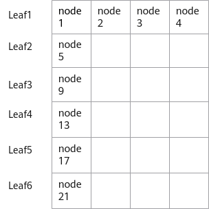

**表 1**  节点优选原则

|任务类型|任务说明|节点优化原则|
|--|--|--|
|填充任务|该任务只能下发在一个交换机下|从二维数组的末尾开始选取第一个满足任务部署的交换机，如果遍历完二维数组还不存在满足条件的，则任务等待。|
|大模型任务|该任务可以跨多个交换机，且一定满足交换机亲和性|从二维数组的开头选取完整的交换机资源，如果资源足够，则调度成功；如果资源不足。分为以下两种情况。<li>使用交换机亲和性1.0，则将剩下的交换机资源，按照Leaf交换机下的相对位置划分成二维数组，每个数组轮番选中一个，直到资源满足或者某一个数组中的数据已经被取完。</li><li>若是交换机亲和性2.0，则每个数组轮番选中一个，直到资源满足或者所有数组中的数据都被选取完。若资源仍然不足，还可以选Spine网络非空闲的交换机下的节点，且一个任务最多包含两个Spine网络非空闲的交换机。</li>|
|普通任务|该任务尽量满足交换机亲和性，资源不足时，允许随机调度该任务|普通任务前部分的调度逻辑与大模型任务一致，只是在最终逻辑交换机资源仍然不足时，允许随机使用剩余节点。|


**逻辑超节点亲和性调度<a name="section941034517442"></a>**

1.  根据任务的逻辑超节点大小，将剩余超节点分成3个队列。队列1是大于或等于逻辑超节点+备用节点数的超节点；队列2是大于或等于逻辑超节点大小，小于逻辑超节点+备用节点数大小的超节点；队列3是小于逻辑超节点数大小的节点。
2.  优先使用队列1的数据，将队列1拆分成一个三维数组。以逻辑超节点大小为16，所需逻辑超节点个数为2，预留节点数为2为例。首先按照超节点可用节点数，将其放入一个二维数组中，每个二维数组中，放置的是相同节点数的多个超节点，因此整体是一个三维数组。此时超节点选取的先后顺序如[图2](节点优选.md#fig0751121511273)所示，即优先使用可用节点数为18的超节点，不满足的话，就按照超节点可用节点18、26、19、27，一直到33的顺序，查找可用超节点。如果还找不到，后续需要按照超节点可用节点数34、35、36、37.....46、47、48的顺序优选超节点。

    **图 2**  超节点优选顺序<a name="fig0751121511273"></a>  
    

3.  若资源仍然不足，则使用队列2的资源，队列2按照剩余节点数从大到小排序，超节点选择从第一个数据开始往后选择。
4.  若资源仍然不足，并且任务配置的超节点亲和性调度策略为Soft非强制亲和性，则使用队列3资源，队列3按照剩余节点从大到小排序，超节点选择从第一个数据开始往后选择。

### 选取昇腾AI处理器<a name="ZH-CN_TOPIC_0000002511426837"></a>

**任务说明<a name="section86117242064"></a>**

Volcano框架根据节点优选得到分数后为Pod任务选择最优的节点，并将其绑定。在该过程中可以注册回调函数，依据亲和性策略，实现昇腾AI处理器选取。

例如Pod任务需要1个昇腾AI处理器，此时节点两个HCCL环分别剩余1个和3个昇腾AI处理器，那么最终会选择剩余1个昇腾AI处理器的环。

**具体实现<a name="section94176351465"></a>**

具体代码实现请参考开源代码中[UseAnnotation](https://gitcode.com/Ascend/mind-cluster/blob/branch_v7.2.RC1/component/ascend-for-volcano/internal/npu/ascend910/ascend910old/module910x8/frame.go)方法，其中SelectNPUFromNode方法实现了根据亲和性从node上选取昇腾AI处理器的功能。

# CheckPoint保存与加载优化


## 产品描述

**产品介绍**

MindCluster MindIO Async CheckPoint Persistence（下文简称MindIO ACP）加速大模型CheckPoint功能主要针对大模型训练中的CheckPoint的保存及加载进行加速，CheckPoint的数据先写入训练服务器的内存系统中，再异步写入后端的可靠性存储设备中。本文档主要介绍纵向加速部分，包含CheckPoint在本系统中的写入及读取过程。

**产品价值**

LLM（Large Language Model，大语言模型）是全球当前科技界竞争的焦点，LLM模型的训练往往需要长达数十天、甚至数月。CheckPoint是模型中断训练后恢复的关键点，CheckPoint的密集程度、保存和恢复的性能较为关键，它可以提高训练系统的有效吞吐率。MindIO ACP针对CheckPoint的加速方案，支持昇腾产品在LLM模型领域扩展市场空间。

该方案提升昇腾平台上LLM模型的训练吞吐量，性能超越[Microsoft Azure Nebula方案](https://learn.microsoft.com/zh-cn/azure/machine-learning/reference-checkpoint-performance-for-large-models?view=azureml-api-2&tabs=PYTORCH)。

**MindIO ACP架构**

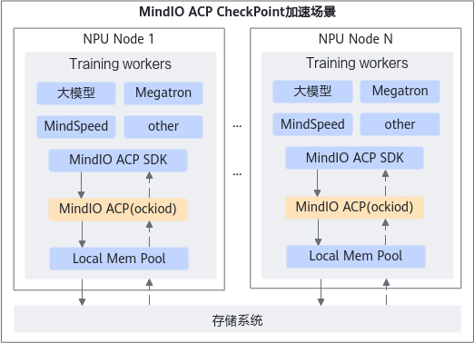

MindIO ACP加速LLM CheckPoint保存和加载的4个关键点如下：

-   异步持久化。训练框架通过mindio\_acp的save/load接口或MindSpore框架将CheckPoint保存到MindIO ACP后，直接返回继续训练，该时间为秒级；MindIO ACP会异步将CheckPoint写入持久化的分布式存储，该过程为分钟级。
-   高性能MemFS（Memory File System，内存文件系统）。MindIO ACP为实现CheckPoint极速写入，实现了全用户态的以内存为介质的文件系统；消除各种标准文件系统的系统调用和用户态到内核态的内存拷贝。
-   高效CheckPoint保存和加载。MindIO ACP为实现CheckPoint极速写入和恢复，研发了高效CheckPoint保存、加载方式。
-   MindIO ACP具备自动容错能力。当MindIO ACP服务异常导致数据读写失败、超时等异常时，能自动切换到原生数据存储方式，保证业务不中断。

    >[!CAUTION]注意
    >MindIO ACP仅保存训练过程中的CheckPoint数据，暂不支持敏感数据的保存和处理。若涉及敏感数据存储，请在前序流程完成相关脱敏操作，避免造成信息安全问题。


## 安装部署


### 安装前必读


#### 免责声明

本文档可能包含第三方信息、产品、服务、软件、组件、数据或内容（统称“第三方内容”）。华为不控制且不对第三方内容承担任何责任，包括但不限于准确性、兼容性、可靠性、可用性、合法性、适当性、性能、不侵权、更新状态等，除非本文档另有明确说明。在本文档中提及或引用任何第三方内容不代表华为对第三方内容的认可或保证。

用户若需要第三方许可，须通过合法途径获取第三方许可，除非本文档另有明确说明。


#### 约束限制

-   训练[故障快速恢复](https://www.hiascend.com/document/detail/zh/mindcluster/72rc1/clustersched/dlug/mindiotft001.html)框架正在向MindIO ACP保存CheckPoint时，如果遇到CheckPoint保存失败，当前正在保存的CheckPoint不能作为训练恢复点，训练框架需要从上一次完整的CheckPoint点进行恢复。
-   在训练过程中发生MindIO ACP故障，已经下发的业务，MindIO ACP SDK会重试3次连接，3次都失败则对接原生存储方式，重试最长等待60s；在训练开始前发生MindIO ACP故障，MindIO ACP SDK则会跳过对接MindIO ACP，CheckPoint的数据直接对接原生数据存储方式。
-   本特性与MindIO TFT[故障快速恢复](https://www.hiascend.com/document/detail/zh/mindcluster/72rc1/clustersched/dlug/mindiotft001.html)特性不兼容。
-   本特性不配套MindSpore 2.7.0之前的版本，功能无法使用。


### 安装前准备


#### 组网规划

**图 1**  部署逻辑示意图  


深度学习平台与训练任务相关的节点有计算节点和存储节点。各类节点主要功能如下：

-   计算节点：实际执行训练、推理任务的节点，MindIO ACP仅部署在计算节点。
-   存储节点：存储平台数据和用户数据，如平台日志、用户上传的数据集、训练脚本、训练输出的模型等。

网络平面划分为：

-   业务面：用于管理集群业务。管理节点和计算节点之间连接。
-   存储面：用于访问存储节点。管理节点和计算节点连接到存储节点。
-   参数面：用于分布式训练时，训练节点之间的参数交换和连接。

>[!NOTE]说明
>-   逻辑部署示意图展示深度学习平台的完整示意图，MindIO ACP作为计算节点上部署的一个组件，不涉及管理节点和存储节点的安装部署。
>-   MindIO ACP是单节点内存缓存系统，训练CheckPoint数据通过共享内存方式访问MindIO ACP，不涉及网络平面划分。


#### 环境要求

**硬件环境**

安装前，需要检查以下硬件配置，如[表1](#table_acp_01)所示。

**表 1<a name="table_acp_01"></a>**  硬件环境

|类型|配置参考|
|--|--|
|服务器（单机场景）|Atlas 800 训练服务器（型号：9000）|
|服务器（集群场景）|<li>计算节点：Atlas 800 训练服务器（型号：9000）</li> <li>存储节点：存储服务器</li>|
|内存|<li>推荐配置：≥64GB</li> <li>最低配置：≥32GB</li>|
|磁盘空间|≥1TB <br> 磁盘空间规划请参见[表3](#table_acp_03)|
|网络|<li>带外管理（BMC）：≥1Gbit/s <li>带内管理（SSH）：≥1Gbit/s <li>业务面：≥10Gbit/s <li>存储面：≥25Gbit/s <li>参数面：100Gbit/s|


**软件环境**

安装前，需要完成以下环境的安装，如[表2](#table_acp_02)所示。

**表 2<a name="table_acp_02"></a>**  软件环境

|软件|版本|安装位置|获取方式|
|--|--|--|--|
|操作系统|<li>CentOS 7.6 Arm<li>CentOS 7.6 x86<li>openEuler 20.03 Arm<li>openEuler 20.03 x86<li>openEuler 22.03 Arm<li>openEuler 22.03 x86<li>Ubuntu 20.04 Arm<li>Ubuntu 20.04 x86<li>Ubuntu 18.04.5 Arm<li>Ubuntu 18.04.5 x86<li>Ubuntu 18.04.1 Arm<li>Ubuntu 18.04.1 x86<li>Kylin V10 SP2 Arm<li>Kylin V10 SP2 x86<li>UOS20 1020e Arm|所有节点|-|
|Python|3.7或更高版本|计算节点|用户安装|
|Torch|2.7.1|计算节点|用户安装|
|MindSpore|2.7.0或更高版本|计算节点|用户安装|


**操作系统磁盘分区**

操作系统磁盘分区推荐如[表3](#table_acp_03)所示。

**表 3<a name="table_acp_03"></a>**  磁盘分区

|分区|说明|大小|bootable flag|
|--|--|--|--|
|/boot|启动分区|500MB|on|
|/var|软件运行所产生的数据存放分区，如日志、缓存等|>300GB|off|
|/|主分区|>300GB|off|


#### 准备软件包

**下载软件包**

软件安装前，请根据下表获取软件包及其数字签名文件。软件分为社区版和商用版，两者功能上无区别，区别在于下载权限和是否用于商业用途。社区版软件不需要申请下载权限可以直接下载，但不能用于商业用途；如果软件需要用于商业用途，请下载商用版软件，但需要申请下载权限。

下载本软件即表示您同意[华为企业软件许可](https://support.huawei.com/enterprise/zh/software-policy)协议的条款和条件。

**表 1**  软件下载

|组件名称|软件包|获取地址|
|--|--|--|
|MindIO ACP|内存缓存系统软件包|[获取链接](https://gitcode.com/Ascend/mind-cluster/releases)|


**软件数字签名验证**

为了防止软件包在传递过程或存储期间被恶意篡改，下载软件包时需下载对应的数字签名文件用于完整性验证。

在软件包下载之后，请参见《OpenPGP签名验证指南》，对从Support网站下载的软件包进行PGP数字签名校验。如果校验失败，请勿使用该软件包，先联系华为技术支持工程师解决。

使用软件包安装/升级之前，也需要按上述过程先验证软件包的数字签名，确保软件包未被篡改。

运营商客户请访问：[http://support.huawei.com/carrier/digitalSignatureAction](http://support.huawei.com/carrier/digitalSignatureAction)

企业客户请访问：[https://support.huawei.com/enterprise/zh/tool/pgp-verify-TL1000000054](https://support.huawei.com/enterprise/zh/tool/pgp-verify-TL1000000054)


### 在计算节点安装MindIO ACP SDK

通过使用MindIO ACP SDK对接Torch和MindSpore，加速Torch和MindSpore训练CheckPoint save和load操作。

**操作步骤**

1.  以安装用户 *{MindIO-install-user}* 登录安装节点。

    >[!NOTE]说明
    >安装用户设置的口令需符合口令复杂度要求（请参见[口令复杂度要求](#口令复杂度要求)）。密码有效期为90天，您可以在“/etc/login.defs“文件中修改有效期的天数，或者通过 **chage** 命令来设置用户的有效期，详情请参见[设置用户有效期](#设置用户有效期)。

2.  将内存缓存系统软件包上传至设备中安装用户有权限读写的路径下。

    >[!NOTE]说明
    >-   内存缓存系统软件包以获取的实际包名为准。
    >-   如果Python环境是共享目录，则在任一计算节点上传即可，否则所有计算节点都需要上传安装包。

3.  进入软件包上传路径，解压内存缓存系统软件包。

    ```
    unzip Ascend-mindxdl-mindio_{version}_linux-{arch}.zip
    ```

    **表 1**  解压后文件

    |文件|说明|
    |--|--|
    |mindio_acp-*{mindio_acp_version}*-py3-none-linux_*{arch}*.whl|MindIO ACP安装包。|
    |mindio_ttp-*{mindio_ttp_version}*-py3-none-linux_*{arch}*.whl|MindIO TFT安装包。|


4.  进入上传路径，安装MindIO ACP SDK。

    ```
    pip3 install mindio_acp-{mindio_acp_version}-py3-none-linux_{arch}.whl --force-reinstall
    ```

    -   首次安装MindIO ACP SDK回显如下，表示安装成功。

        ```
        Processing ./mindio_acp-{mindio_acp_version}-py3-none-linux_{arch}.whl
        Installing collected packages: mindio_acp
        Successfully installed mindio_acp-{version}
        ```

    -   非首次安装MindIO ACP SDK回显如下，表示安装成功。

        ```
        Processing ./mindio_acp-{mindio_acp_version}-py3-none-linux_{arch}.whl
         Installing collected packages: mindio_acp
           Attempting uninstall: mindio_acp
             Found existing installation: mindio_acp{version}
             Uninstalling mindio_acp{version}:
               Successfully uninstalled mindio_acp{version}
         Successfully installed mindio_acp{version}
        ```

5.  将软件安装目录内的可执行文件和代码脚本权限更改为550，避免出现非法篡改。

    ```
    chmod -R 550 {MindIO ACP SDK安装目录}
    ```


### 卸载MindIO ACP SDK

**操作步骤**

1.  将软件安装目录内的可执行文件和代码脚本权限更改为750。

    ```
    chmod -R 750 {MindIO ACP SDK安装目录}
    ```

2.  卸载MindIO ACP SDK。

    ```
    pip3 uninstall mindio_acp
    ```


## 使用指导


### 概述

>[!NOTE]说明
>-   MindIO ACP SDK端支持宿主机和容器内部署。
>-   容器场景的镜像制作、镜像部署、镜像安全加固等由用户保证。
>-   只支持DeepSpeed框架、X1框架、MindSpeed-LLM、K8s的固定版本。
>-   在使用MindIO ACP服务时，启动训练任务的用户需要和启动MindIO ACP守护进程的用户属于同一个主组。

安装MindIO ACP SDK之后，为了使用MindIO ACP的缓存加速能力，将训练模型中使用到Python文件中的Torch的load/save函数，替换为MindIO ACP SDK的load/save函数。

-   支持将同一份数据保存到多个路径，将训练模型中循环保存同一份数据的torch.save函数，替换为MindIO ACP SDK的mindio\_acp.multi\_save函数。
-   MindIO ACP SDK提供 **register\_checker(callback, check\_dict, user\_context, timeout\_sec)** 接口，支持将需要观察的文件夹和文件夹下的普通文件个数作为check\_dict的元素注册到MindIO ACP，MindIO ACP会在timeout\_sec时间内检查这些文件夹下的文件个数，并检查其与check\_dict元素指定的文件个数是否相同，通过注册的callback函数回调应用程序，user\_context为callback函数的第二个参数，支持用户设置callback函数中需要调用的参数；timeout\_sec为注册事件超时时间，当超过超时时间仍然检查到不符合要求，则会在回调函数中报告错误。用户可以根据检查结果处理后续业务逻辑。


### Torch对接DeepSpeed框架

1.  使用业务用户登录到计算节点。

    >[!NOTE]说明
    >业务用户不是\{MindIO-install-user\}、HwHiAiUser、hwMindX用户，由用户根据实际情况决定。

2.  进入DeepSpeed安装目录。

    ```
    cd {deepspeed安装目录}/runtime 
    ```

3.  <a name="step_acp_li001"></a>修改engine.py文件。
    1.  打开engine.py文件。

        ```
        vim engine.py
        ```

    2.  <a name="step_acp_li002"></a>按“i”进入编辑模式，修改如下内容。
        -   在文件首行加入以下内容。

            ```
            import mindio_acp
            ```

        -   将torch.load函数替换为mindio\_acp.load函数。

            替换前：

            ```
            optim_checkpoint = torch.load(optim_load_path,
                                          map_location=torch.device('cpu'))
            ```

            替换后：

            ```
            optim_checkpoint = mindio_acp.load(optim_load_path, map_location='cpu')
            ```

        -   将torch.save函数替换为mindio\_acp.save函数。

            替换前：

            ```
            torch.save(state, save_path)
            ```

            替换后：

            ```
            mindio_acp.save(state, save_path)
            ```

        -   将包含torch.save函数的with open语句整体替换为mindio\_acp.save函数。

            替换前：

            ```
            with open(self._get_optimizer_ckpt_name(save_dir, tag, expp_rank), 'wb') as fd:
                torch.save(optimizer_state, fd)
                fd.flush()
            ```

            替换后：

            ```
            mindio_acp.save(optimizer_state, self._get_optimizer_ckpt_name(save_dir, tag, expp_rank))
            ```

        -   替换DeepSpeedEngine.\_get\_expert\_ckpt\_name函数。

            替换前：

            ```
                            expert_state_dict = torch.load(DeepSpeedEngine._get_expert_ckpt_name(
                                checkpoint_path,
                                -1, # -1 means ignore layer_id
                                global_expert_id,
                                tag,
                                mpu),
                                map_location=torch.device('cpu'))
            ```

            替换后：

            ```
                            expert_state_dict = mindio_acp.load(DeepSpeedEngine._get_expert_ckpt_name(
                                checkpoint_path,
                                -1, # -1 means ignore layer_id
                                global_expert_id,
                                tag,
                                mpu),
                                map_location='cpu')
            ```

    3.  <a name="step_acp_li003"></a>按“Esc”键，输入 **:wq!** ，按“Enter”保存并退出编辑。

4.  修改module.py文件。
    1.  打开module.py文件。

        ```
        vim pipe/module.py
        ```

    2.  替换torch.save和torch.load，替换方式参见步骤[3.b](#step_acp_li002)  \~ 步骤[3.c](#step_acp_li003)。

5.  <a name="step_acp_li004"></a>修改state\_dict\_factory.py文件。
    1.  打开state\_dict\_factory.py文件。

        ```
        vim state_dict_factory.py
        ```

    2.  替换torch.save和torch.load，替换方式参见步骤[3.b](#step_acp_li002)  \~步骤  [3.c](#step_acp_li003)。

6.  完成步骤[3](#step_acp_li001)  \~ 步骤[5](#step_acp_li004)的.py文件修改，DeepSpeed即可使用MindIO ACP服务。


### Torch对接X1框架

1.  登录到计算节点。
2.  进入X1安装目录。

    ```
    cd {X1安装目录}/Megatron-LM/megatron
    ```

3.  修改checkpointing.py文件。
    1.  打开checkpointing.py文件。

        ```
        vim checkpointing.py
        ```

    2.  按“i”进入编辑模式，修改如下内容。
        -   在文件首行加入以下内容。

            ```
            import mindio_acp
            ```

        -   将torch.load函数替换为mindio\_acp.load函数。

            替换前：

            ```
            optim_checkpoint = torch.load(optim_load_path,
                                          map_location=torch.device('cpu'))
            ```

            替换后：

            ```
            optim_checkpoint = mindio_acp.load(optim_load_path, map_location='cpu')
            ```

        -   将torch.save函数替换为mindio\_acp.save函数。

            替换前：

            ```
            torch.save(state, save_path)
            ```

            替换后：

            ```
            mindio_acp.save(state, save_path)
            ```

        -   将包含torch.save函数的with open语句整体替换为mindio\_acp.save函数。

            替换前：

            ```
            with open(self._get_optimizer_ckpt_name(save_dir, tag, expp_rank), 'wb') as fd:
                torch.save(optimizer_state, fd)
                fd.flush()
            ```

            替换后：

            ```
            mindio_acp.save(optimizer_state, self._get_optimizer_ckpt_name(save_dir, tag, expp_rank))
            ```

    3.  按“Esc”键，输入 **:wq!** ，按“Enter”保存并退出编辑。


### Torch对接MindSpeed-LLM框架

**前提条件**

-   使用前请先了解MindIO ACP特性的[约束限制](#约束限制)章节。
-   MindSpeed-LLM框架准备请参见[MindSpeed-LLM](https://gitcode.com/Ascend/MindSpeed-LLM/tree/2.2.0)。匹配的Megatron-LM版本为 **core\_v0.12.1**。

>[!NOTE]说明
>本次发布包配套MindSpeed-LLM的 **2.2.0** 分支，环境、代码、数据集准备请用户参考MindSpeed-LLM仓库的相关指导说明，并确保其安全性。

**操作步骤**

1.  使用业务用户登录到计算节点。

    >[!NOTE]说明
    >业务用户不是\{MindIO-install-user\}、HwHiAiUser、hwMindX用户，由用户根据实际情况决定。

2.  进入MindSpeed-LLM安装目录。

    ```
    cd MindSpeed-LLM/
    ```

3.  <a name="step_acp_li005"></a>修改pretrain\_gpt.py文件。
    1.  打开pretrain\_gpt.py文件。

        ```
        vim pretrain_gpt.py
        ```

    2.  按“i”进入编辑模式，在文件头部找到from mindspeed\_llm import megatron\_adaptor，换行增加 **import mindio_acp**。

        ```
        from mindspeed_llm import megatron_adaptor
        import mindio_acp
        ```

    3.  按“Esc”键，输入 **:wq!**，按“Enter”保存并退出编辑。

4.  <a name="step_acp_li006"></a>编辑预训练脚本（仅供参考）。

    此处以编辑“examples/mcore/llama2/pretrain\_llama2\_7b\_ptd.sh“脚本为例。

    1.  打开“examples/mcore/llama2/pretrain\_llama2\_7b\_ptd.sh“脚本。

        ```
        vim examples/mcore/llama2/pretrain_llama2_7b_ptd.sh
        ```

    2.  按“i”进入编辑模式，在脚本中增加如下内容以开启周期性CheckPoint加速功能。
        ```
        export MINDIO_AUTO_PATCH_MEGATRON=true
        export GLOO_SOCKET_IFNAME=enp189s0f0
        export LD_LIBRARY_PATH=/usr/local/Ascend/driver/lib64/driver:$LD_LIBRARY_PATH
        source /usr/local/Ascend/cann/set_env.sh
        ```
        
        修改后的pretrain_llama2_7b_ptd.sh脚本示例如下：

        ```
        #!/bin/bash
        
        export CUDA_DEVICE_MAX_CONNECTIONS=1
        export PYTORCH_NPU_ALLOC_CONF=expandable_segments:True
        
        export MINDIO_AUTO_PATCH_MEGATRON=true
        export GLOO_SOCKET_IFNAME=enp189s0f0
        export LD_LIBRARY_PATH=/usr/local/Ascend/driver/lib64/driver:$LD_LIBRARY_PATH
        source /usr/local/Ascend/cann/set_env.sh
        
        NPUS_PER_NODE=8
        MASTER_ADDR=localhost
        MASTER_PORT=6000
        NNODES=1
        NODE_RANK=0
        WORLD_SIZE=$(($NPUS_PER_NODE*$NNODES))
        
        CKPT_SAVE_DIR="your model save ckpt path"
        DATA_PATH="your data path"
        TOKENIZER_MODEL="your tokenizer path"
        CKPT_LOAD_DIR="your model ckpt path"
        TP=1
        PP=2
        
        DISTRIBUTED_ARGS="
            --nproc_per_node $NPUS_PER_NODE \
            --nnodes $NNODES \
            --node_rank $NODE_RANK \
            --master_addr $MASTER_ADDR \
            --master_port $MASTER_PORT
        "
        
        GPT_ARGS="
            --use-mcore-models \
            --tensor-model-parallel-size ${TP} \
            --pipeline-model-parallel-size ${PP} \
            --sequence-parallel \
            --num-layers 32 \
            --hidden-size 4096 \
            --ffn-hidden-size 11008 \
            --num-attention-heads 32 \
            --tokenizer-type Llama2Tokenizer \
            --tokenizer-model ${TOKENIZER_MODEL} \
            --seq-length 4096 \
            --max-position-embeddings 4096 \
            --micro-batch-size 1 \
            --global-batch-size 256 \
            --make-vocab-size-divisible-by 1 \
            --lr 1.25e-6 \
            --train-iters 5000 \
            --lr-decay-style cosine \
            --untie-embeddings-and-output-weights \
            --disable-bias-linear \
            --attention-dropout 0.0 \
            --init-method-std 0.01 \
            --hidden-dropout 0.0 \
            --position-embedding-type rope \
            --normalization RMSNorm \
            --use-fused-rmsnorm \
            --swiglu \
            --use-flash-attn \
        
            --no-masked-softmax-fusion \
            --attention-softmax-in-fp32 \
            --min-lr 1.25e-7 \
            --weight-decay 1e-1 \
            --lr-warmup-fraction 0.01 \
            --clip-grad 1.0 \
            --adam-beta1 0.9 \
            --initial-loss-scale 65536 \
            --adam-beta2 0.95 \
            --no-gradient-accumulation-fusion \
            --no-load-optim \
            --no-load-rng \
            --use-distributed-optimizer \
            --use-fused-swiglu \
            --use-fused-rotary-pos-emb \
            --overlap-grad-reduce \
            --bf16
        "
        
        DATA_ARGS="
            --data-path $DATA_PATH \
            --split 949,50,1
        "
        
        OUTPUT_ARGS="
            --log-interval 1 \
            --save-interval 10000 \
            --eval-interval 1000 \
            --eval-iters 10 \
        "
        
        torchrun $DISTRIBUTED_ARGS pretrain_gpt.py \
            $GPT_ARGS \
            $DATA_ARGS \
            $OUTPUT_ARGS \
            --distributed-backend nccl \
            --load $CKPT_LOAD_DIR \
            --save $CKPT_SAVE_DIR \
            | tee logs/train_llama2_7b.log
        ```

        周期性CheckPoint加速功能相关参数说明如下：

        -   **MINDIO\_AUTO\_PATCH\_MEGATRON**：MindIO ACP框架自动patch Megatron的源码，用于开启加速周期性CheckPoint特性。
        -   **GLOO\_SOCKET\_IFNAME**：根据主节点高速网卡实际情况进行配置。
        -   **LD\_LIBRARY\_PATH**：CANN包驱动的so库地址，请根据CANN实际的安装路径进行修改。
        -   **set\_env.sh文件路径**：请根据CANN实际的安装路径进行修改。

    3.  按“Esc”键，输入 **:wq!** ，按“Enter”保存并退出编辑。

5.  完成步骤[3](#step_acp_li005)  \~ 步骤[4](#step_acp_li006)的.py文件修改，MindSpeed-LLM即可使用MindIO ACP加速周期性CheckPoint特性。


### 对接K8s

在容器中使用MindIO ACP加速服务时，需要将SDK安装到对应的容器中。

1.  修改创建Pod的yaml文件，下面以“/home/testuser/mygpt.yaml“文件为例，增加映射卷配置。
    1.  打开mygpt.yaml文件。

        ```
        vim /home/testuser/mygpt.yaml
        ```

    2.  按“i”进入编辑模式，修改mygpt.yaml文件。

        >[!NOTE]说明
        >-   如果volumeMounts和volumes不存在，直接在文件中添加全部内容。
        >-   如果volumeMounts和volumes已存在，只需在volumeMounts和volumes内部添加其后面的内容。

        -   （可选）如果环境中[使用了DPC访问存储](#可选使用dpc文件访问存储加速checkpoint加载)，增加卷在容器中映射路径，内容如下：

            ```
            volumeMounts:
                - mountPath: /opt/oceanstor/dataturbo/sdk/lib/libdpc_nds.so
                  name: mindio-dpc-nds
                  readOnly: false
            ```

            >[!NOTE]说明
            >“/opt/oceanstor/dataturbo/sdk/lib/libdpc\_nds.so“不可随意更改。

        -   （可选）如果环境中[使用了DPC访问存储](#可选使用dpc文件访问存储加速checkpoint加载)，增加宿主机需要映射的卷声明，增加内容如下：

            ```
            volumes:
              - name: mindio-dpc-nds
                hostPath:
                  path: /opt/oceanstor/dataturbo/sdk/lib/libdpc_nds.so
                  type: File
            ```

    3.  按“Esc”键，输入 **:wq!**，按“Enter”保存并退出编辑。

2.  使用修改后的yaml文件，创建Pod。

    ```
    kubectl apply -f mygpt.yaml
    ```

3.  登录到创建好的Pod，以命名空间“test-mindio”下名称为“mygptdd”的Pod为例。

    ```
    kubectl exec -it mygptdd -n test-mindio /bin/bash
    ```

4.  将MindIO ACP SDK上传到Pod中，并参见[在计算节点安装MindIO ACP SDK](#在计算节点安装mindio-acp-sdk)完成SDK安装。


### CheckPoint文件格式转换示例（Torch）

对于使用PyTorch框架的用户，在大模型训练结束后，CheckPoint文件需要用于推理。这里举例说明，如何将MindIO ACP保存的CheckPoint文件转换成Torch原生格式的文件。

>[!NOTE]说明
>-   **load\_dir**：替换为真实的CheckPoint保存目录。
>-   **new\_dir**：替换为CheckPoint转换后新保存的目录，建议为空目录。
>-   **iteration**：指定转换这个iteration迭代周期的所有CheckPoint文件，会和 **load\_dir** 进行拼接。

```
#  Copyright (c) Huawei Technologies Co., Ltd. 2024-2024. All rights reserved.
import os
import mindio_acp


def main():
    load_dir = ""  # Replace with the actual checkpoint directory path
    new_dir = ""  # Replace with the actual new directory path
    iteration = 2000  # Replace with the actual iteration number

    directory = 'iter_{:07d}'.format(iteration)
    common_path = os.path.join(load_dir, directory)

    if not os.path.exists(common_path):
        print(f"Source directory {common_path} does not exist.")
        return

    if not os.path.exists(new_dir):
        os.makedirs(new_dir)

    for root, _, files in os.walk(common_path):
        # Compute the relative path and target directory
        relative_path = os.path.relpath(root, common_path)
        target_dir = os.path.join(new_dir, relative_path)

        # Create directories in the target directory
        if not os.path.exists(target_dir):
            os.makedirs(target_dir)

        # Convert all files in the current directory
        for file in files:
            src_file = os.path.join(root, file)
            dst_file = os.path.join(target_dir, file)
            res = mindio_acp.convert(src_file, dst_file)
            print(f"Convert {src_file} to {dst_file}, result: {res}")


if __name__ == '__main__':
    main()
```


## 安全管理与加固


### 安全管理

>[!NOTE]说明
>MindIO ACP暂不支持公有云场景、多租户场景使用，不支持公网直接访问系统。

**防病毒软件例行检查**

定期开展对集群的防病毒扫描，防病毒例行检查会帮助集群免受病毒、恶意代码、间谍软件以及程序侵害，降低系统瘫痪、信息安全问题等风险。可以使用业界主流防病毒软件进行防病毒检查。

**日志管理**

日志管理需要关注以下两点。

-   检查系统是否可以限制单个日志文件的大小。
-   检查日志空间占满后，是否存在机制进行清理。

**漏洞/功能问题修复**

为保证生产环境的安全，降低被攻击的风险，需要定期查看开源社区修复的以下漏洞/功能问题。

-   操作系统漏洞/功能问题。
-   其他相关组件漏洞/功能问题。


### 安全加固


#### 加固须知

本文中列出的安全加固措施为基本的加固建议项。用户应根据自身业务，重新审视整个系统的网络安全加固措施，必要时可参考业界优秀加固方案和安全专家的建议。


#### 风险提醒

CheckPoint序列化使用了Python自带的pickle组件，必须确保非授权用户没有存储目录及上层目录的写权限，否则可能造成CheckPoint被篡改引起pickle反序列化注入的风险。


#### 操作系统安全加固

**防火墙配置**

操作系统安装后，若配置普通用户，可以通过在“/etc/login.defs“文件中新增“ALWAYS\_SET\_PATH=yes”配置，防止越权操作。此外，为了防止使用“su”命令切换用户时，将当前用户环境变量带入其他环境造成提权，请使用 **su - [user]** 命令进行用户切换，同时在服务器配置文件“/etc/default/su“中增加配置参数“ALWAYS\_SET\_PATH=yes”防止提权。

**设置umask**

建议用户将服务器的umask设置为027 \~ 777以限制文件权限。

以设置umask为027为例，具体操作如下。

1.  以root用户登录服务器，编辑“/etc/profile“文件。

    ```
    vim /etc/profile
    ```

2.  在“/etc/profile“文件末尾加上 **umask 027**，保存并退出。
3.  执行如下命令使配置生效。

    ```
    source /etc/profile
    ```

**无属主文件安全加固**

用户可以执行 **find / -nouser -nogroup** 命令，查找容器内或物理机上的无属主文件。根据文件的UID和GID创建相应的用户和用户组，或者修改已有用户的UID、用户组的GID来适配，赋予文件属主，避免无属主文件给系统带来安全隐患。

**端口扫描**

用户需要关注全网侦听的端口和非必要端口，如果发现非必要端口则应立即关闭。建议用户关闭不安全的服务，如Telnet、FTP等，以提升系统安全性。具体操作方法可参考所使用操作系统的官方文档。

**防DoS攻击**

用户可以根据IP地址限制与服务器的连接的速率对系统进行防DoS攻击，方法包括但不限于利用Linux系统自带Iptables防火墙进行预防、优化sysctl参数等。具体使用方法，用户可自行查阅相关资料。

**SSH加固**

由于root用户拥有最高权限，出于安全目的，建议取消root用户SSH远程登录服务器的权限，以提升系统安全性。具体操作步骤如下：

1.  登录安装MindIO ACP组件的节点。
2.  打开“/etc/ssh/sshd\_config“文件。

    ```
    vim /etc/ssh/sshd_config
    ```

3.  按“i”进入编辑模式，找到“PermitRootLogin“配置项并将其值设置为“no“。

    ```
    PermitRootLogin no
    ```

4.  按“Esc”键，输入 **:wq!**，按“Enter”保存并退出编辑。
5.  执行命令使配置生效。

    ```
    systemctl restart sshd
    ```


## API接口参考


### initialize接口

**接口功能**

初始化MindIO ACP  Client。

**接口格式**

```
mindio_acp.initialize(server_info: Dict[str, str] = None) -> int
```

**接口参数**

|参数|是否必选|说明|取值要求|
|--|--|--|--|
|server_info|可选|自启动的Server进程需要配置参数信息。若不传入该参数，则全部使用默认值。|有效参数集合或None。|


**表 1**  server\_info参数说明

|参数key|默认参数value|是否必选|说明|取值范围|
|--|--|--|--|--|
|'memfs.data_block_pool_capacity_in_gb'|'128'|可选|MindIO ACP文件系统内存分配大小，单位：GB，根据服务器内存大小来配置，建议不超过系统总内存的25%。|[1, 1024]|
|'memfs.data_block_size_in_mb'|'128'|可选|文件数据块分配最小粒度，单位：MB，根据使用场景中大多数文件的size决定配置，建议平均每个文件的数据块大小不超过128MB。|[1, 1024]|
|'memfs.write.parallel.enabled'|'true'|可选|MindIO ACP并发读写性能优化开关配置，用户需结合业务数据模型特征决定是否打开本配置。|<li>false：关闭<li>true：开启|
|'memfs.write.parallel.thread_num'|'16'|可选|MindIO ACP并发读写性能优化并发数。|[2, 96]|
|'memfs.write.parallel.slice_in_mb'|'16'|可选|MindIO ACP并发写性能优化数据切分粒度，单位：MB。|[1, 1024]|
|'background.backup.thread_num'|'32'|可选|备份线程数量。|[1, 256]|


>[!NOTE]说明
>mindio\_acp.initialize如果不传入server\_info参数，则按照表中默认参数启动Server。

**使用样例1**

```
>>> # Initialize with default param
>>> mindio_acp.initialize()
```

**使用样例2**

```
>>> # Initialize with server_info
>>> server_info = {
        'memfs.data_block_pool_capacity_in_gb': '200',
    }
>>> mindio_acp.initialize(server_info=server_info)
```

**返回值**

-   0：成功
-   -1：失败


### save接口

**接口功能**

将数据保存到指定的路径下。

**接口格式**

```
mindio_acp.save(obj, path, open_way='memfs')
```

**接口参数**

|参数|是否必选|说明|取值要求|
|--|--|--|--|
|obj|必选|需要保存的对象。|有效数据对象。|
|path|必选|数据保存路径。|有效文件路径。|
|open_way|可选|保存方式。<li>memfs：使用MindIO ACP的高性能MemFS保存数据。<li>fopen：调用C标准库中的文件操作函数保存数据，通常作为memfs方式的备份存在。<br>默认值：memfs。|<li>memfs<li>fopen|


**使用样例**

```
>>> # Save to file
>>> x = torch.tensor([0, 1, 2, 3, 4])
>>> mindio_acp.save(x, '/mnt/dpc01/tensor.pt')
```

**返回值**

-   -1：保存失败。
-   0：通过原生torch.save方式实现保存。
-   1：通过memfs方式实现保存。
-   2：通过fopen方式实现保存。


### multi\_save接口

**接口功能**

将同一个数据保存到多个文件中。

**接口格式**

```
mindio_acp.multi_save(obj, path_list)
```

**接口参数**

|参数|是否必选|说明|取值要求|
|--|--|--|--|
|obj|必选|需要保存的对象。|有效数据对象。|
|path_list|必选|数据保存路径列表。|有效文件路径列表。|


**使用样例**

```
>>> # Save to file
>>> x = torch.tensor([0, 1, 2, 3, 4])
>>> path_list = ["/mnt/dpc01/dir1/rank_1.pt","/mnt/dpc01/dir2/rank_1.pt"]
>>> mindio_acp.multi_save(x, path_list)
```

**返回值**

-   None：失败。
-   0：通过原生torch.save方式实现保存。
-   1：通过memfs方式实现保存。
-   2：通过fopen方式实现保存。


### register\_checker接口

**接口功能**

注册异步回调函数。

**接口格式**

```
mindio_acp.register_checker(callback, check_dict, user_context, timeout_sec)
```

**接口参数**

|参数|是否必选|说明|取值要求|
|--|--|--|--|
|callback|必选|回调函数（第一个参数result为数据完整性校验的结果，0为成功，其他为失败；第二个参数为user_context）。|有效函数名。|
|check_dict|必选|数据完整性校验条件，类型dict，用来校验指定path下的文件个数是否符合要求。|<li>key：path，数据路径。<li>value：对应key路径下的文件个数。|
|user_context|必选|回调函数的第二个参数。|-|
|timeout_sec|必选|回调超时时间，单位：秒。<br>如果训练客户端日志中提示："watching checkpoint failed"，则需要调大该参数。代码在mindio_acp实际安装路径（mindio_acp/acc_checkpoint/framework_acp.py）下的async_write_tracker_file函数中。|[1, 3600]|


**使用样例**

```
>>> def callback(result, user_context):
>>>    if result == 0:
>>>        print("success")
>>>    else:
>>>        print("fail")
>>> context_obj = None
>>> check_dict = {'/mnt/dpc01/checkpoint-last': 4}
>>> mindio_acp.register_checker(callback, check_dict, context_obj, 1000)
```

**返回值**

-   None：失败。
-   1：成功。


### load接口

**接口功能**

从文件中加载save/multi\_save接口持久化的对象。

**接口格式**

```
mindio_acp.load(path, open_way='memfs', map_location=None)
```

**接口参数**

|参数|是否必选|说明|取值要求|
|--|--|--|--|
|path|必选|加载路径。|有效文件路径。|
|open_way|可选|加载方式。<li>memfs：使用MindIO ACP的高性能MemFS保存数据。<li>fopen：调用C标准库中的文件操作函数保存数据，通常作为memfs方式的备份存在。<br>默认值：memfs。|<li>memfs<li>fopen|
|map_location|可选|加载时需要映射到的设备。默认值：None。|<li>None<li>cpu|


**使用样例**

```
>>> # load from file
>>> mindio_acp.load('/mnt/dpc01/checkpoint/rank-0.pt')
```

**返回值**

Any

>[!CAUTION]注意
>如同PyTorch的load接口，本接口内部也使用pickle模块，有被恶意构造的数据在unpickle期间攻击的风险。需要保证被加载的数据来源是安全存储的，仅可以load可信的数据。


### convert接口

**接口功能**

将MindIO ACP格式的CheckPoint文件转换为Torch原生保存的格式。

**接口格式**

```
mindio_acp.convert(src, dst)
```

**接口参数**

|参数|是否必选|说明|取值要求|
|--|--|--|--|
|src|必选|待转换的源路径或源文件，源路径或源文件必须存在。|有效文件路径，不能包含软链接。|
|dst|必选|待转换的目标路径或目标文件。指定路径的父目录必须存在，如果文件已存在，则会被覆盖。|有效文件路径，不能包含软链接。|


**使用样例**

```
>>> mindio_acp.convert('/mnt/dpc01/iter_0000050/mp_rank_00/distrib_optim.pt', '/mnt/dpc02/iter_0000050/mp_rank_00/distrib_optim.pt')
```

**返回值**

-   0：转换成功。
-   -1：转换失败。


### preload接口

**接口功能**

从文件中预加载使用torch保存的数据对象，并将其保存为MindIO ACP的高性能MemFS数据。

**接口格式**

```
mindio_acp.preload(*path)
```

**接口参数**

|参数|是否必选|说明|取值要求|
|--|--|--|--|
|path|必选|预加载的源文件，源文件必须存在。|有效文件路径或路径集合。|


**使用样例**

```
>>> # preload from file
>>> mindio_acp.preload('/mnt/dpc01/checkpoint/rank-0.pt')
```

**返回值**

-   0：预加载成功。
-   1：预加载失败。


### flush接口

**接口功能**

等待后台异步刷盘任务全部执行成功。

**接口格式**

```
mindio_acp.flush()
```

**接口参数**

无

**使用样例**

```
>>> # flush all data to disk
>>> mindio_acp.flush()
```

**返回值**

-   0：刷盘成功。
-   1：刷盘失败。


### open\_file接口

本接口只支持MindSpore框架。

**接口功能**

使用with调用open\_file接口，以只读的方式打开文件，并返回对应的\_ReadableFileWrapper实例。该实例提供read\(\)和close\(\)方法。

-   read：读取文件内容。

    ```
    read(self, offset=0, count=-1)
    ```

    |参数|是否必选|说明|取值要求|
    |--|--|--|--|
    |offset|可选|读取文件的偏移位置。需满足count + offset <= file_size|[0, file_size)|
    |count|可选|读取文件的大小。需满足count + offset <= file_size|<li>-1：读取整个文件。<li>(0, file_size]|


-   close：关闭文件。

    该方法在with退出上下文的时候自动调用。

    ```
    close(self)
    ```

**接口格式**

```
mindio_acp.open_file(path: str)
```

**接口参数**

|参数|是否必选|说明|取值要求|
|--|--|--|--|
|path|必选|加载路径。|有效文件路径。|


**使用样例**

```
>>> with mindio_acp.open_file('/mnt/dpc01/checkpoint/rank-0.pt') as f:
...     read_data = f.read()
```

**返回值**

\_ReadableFileWrapper实例。

>[!NOTE]说明
>接口详情请参见[MindSpore文档](https://www.mindspore.cn/docs/zh-CN/master/api_python/mindspore/mindspore.load_checkpoint.html#mindspore.load_checkpoint)。


### create\_file接口

本接口只支持MindSpore框架。

**接口功能**

使用with调用create\_file接口，用于创建文件，并返回对应的\_WriteableFileWrapper实例。该实例提供write\(\)、drop\(\)和close\(\)方法。

-   write：向文件中写入数据。

    ```
    write(self, data: bytes)
    ```

    |参数|是否必选|说明|取值要求|
    |--|--|--|--|
    |data|必选|需要写入的对象。|bytes对象。|


-   drop：删除文件。

    ```
    drop(self)
    ```

-   close：关闭文件。

    该方法在with退出上下文的时候自动调用。

    ```
    close(self)
    ```

**接口格式**

```
mindio_acp.create_file(path: str, mode: int = 0o600)
```

**接口参数**

|参数|是否必选|说明|取值要求|
|--|--|--|--|
|path|必选|数据保存路径。|有效文件路径。|
|mode|可选|文件创建权限。|[0o000, 0o777]|


**使用样例**

```
>>> x = torch.tensor([0, 1, 2, 3, 4])
>>> with mindio_acp.create_file('/mnt/dpc01/checkpoint/rank-0.pt') as f:
...     write_result = f.write(x)
```

**返回值**

\_WriteableFileWrapper实例。

>[!NOTE]说明
>接口详情请参见[MindSpore文档](https://www.mindspore.cn/docs/zh-CN/master/api_python/mindspore/mindspore.save_checkpoint.html#mindspore.save_checkpoint)。


## 告警参考


### ALM-0x1001001  MindIO ACP持久化检查点数据异常

**告警解释**

当后端存储系统故障时，产生该告警。

当后端存储系统恢复后，告警恢复。

**告警属性**

|告警ID|告警级别|是否可自动清除|
|--|--|--|
|0x1001001|重要|是|


**告警参数**

无

**对系统的影响**

MindIO ACP组件不可服务，在用户侧转为直接操作后端存储。

**可能原因**

-   后端存储系统故障。
-   操作后端存储文件的权限不足。

**处理步骤**

1.  检查后端存储状态是否正常。
    -   状态正常，执行[2](#step_acp_li007)。
    -   状态异常，执行[3](#step_acp_li008)。

2.  <a name="step_acp_li007"></a>检查后端存储内的文件归属的用户名和属组权限，与客户端进程的权限是否一致。
    -   权限一致，告警会自动清除。
    -   权限不一致，执行[3](#step_acp_li008)。

3.  <a name="step_acp_li008"></a>搜集故障或者日志信息，联系技术支持处理。

**参考信息**

不涉及

**告警清除**

此告警修复后，系统会自动清除此告警，无需手工清除。


## 附录


### （可选）使用DPC文件访问存储，加速CheckPoint加载

检查是否满足如下条件：

-   是否使用DPC（Distributed Parallel Client，分布式并行客户端）文件系统访问存储。
-   是否成功安装NDS 1.0软件包（/opt/oceanstor/dataturbo/sdk/lib/libdpc\_nds.so）。
-   训练进程（如果在容器内）能否访问此so。

如果以上条件全部满足，则自动启用NDS 1.0直通读功能，加速加载CheckPoint。

成功加载NDS 1.0的判断依据是查看日志是否出现如下字样：

```
"initial and open nds file driver success"
```

NDS 1.0更多信息请参见[《OceanStor DataTurbo 25.0.0 DTFS用户指南》](https://support.huawei.com/enterprise/zh/doc/EDOC1100446480/c6c9b5af)。

>[!CAUTION]注意
>如果使用DPC文件系统访问存储，成功安装NDS 1.0软件包，安装地址为“/opt/oceanstor/dataturbo/sdk/lib/libdpc\_nds.so“，权限设置为444即可保证功能正常，启动训练前，请用户谨慎设置此文件的权限。


### 环境变量

|参数名称|参数说明|取值范围|缺省值|
|--|--|--|--|
|MINDIO_AUTO_PATCH_MEGATRON|是否在import mindio_acp的时候自动patch Megatron框架的源代码中的CheckPoint相关函数。|<li>true或者1：开启 <li>其他值：关闭|false|
|HCOM_FILE_PATH_PREFIX|HCOM生成的文件路径的前缀，通过前缀保证文件只会在当前路径下（此路径需要已存在）创建和删除。|路径参数|${install_path}|


### 设置用户有效期

为保证用户的安全性，应设置用户的有效期，使用系统命令chage来设置用户的有效期。

命令为：

```
chage [-m mindays] [-M maxdays] [-d lastday] [-I inactive] [-E expiredate] [-W warndays] user
```

相关参数请参见[表1](#table_acp_04)。

**表 1<a name="table_acp_04"></a>**  设置用户有效期

|参数|参数说明|
|--|--|
|-d--lastday|上一次更改的日期。|
|-E--expiredate|用户到期的日期。超过该日期，此用户将不可用。|
|-h--help|显示命令帮助信息。|
|-i--iso8601|更改用户密码的过期日期并以YYYY-MM-DD格式显示。|
|-I--inactive|停滞时期。超过指定天数后，设定密码为失效状态。|
|-l--list|列出当前的设置。由非特权用户来确定口令或账户何时过期。|
|-m--mindays|口令可更改的最小天数。设置为“0”表示任何时候都可以更改口令。|
|-M--maxdays|口令保持有效的最大天数。设置为“-1”表示可删除这项口令的检测。设置为“99999”，表示无限期。|
|-R--root|将命令执行的根目录设置为指定目录。|
|-W--warndays|用户口令到期前，提前收到警告信息的天数。|


>[!NOTE]说明
>-   日期格式为YYYY-MM-DD，如 **chage -E 2017-12-01  _test_** 表示用户_test_的口令在2017年12月1日过期。
>-   user必须填写，填写时请替换为具体用户，默认为root用户。
>-   账号口令应该定期更新，否则容易导致安全风险。

举例说明：修改用户_test_的有效期为90天。

```
chage -M 90 test
```


### 口令复杂度要求

口令至少满足如下要求：

1.  口令长度至少8个字符。
2.  口令必须包含如下至少两种字符的组合：
    -   一个小写字母
    -   一个大写字母
    -   一个数字
    -   一个特殊字符：\`\~!@\#$%^&\*\(\)-\_=+\\|[\{\}];:'",<.\>/?和空格

3.  口令不能和账号一样。


### 账户一览表

|用户|描述|初始密码|密码修改方法|
|--|--|--|--|
|*{MindIO-install-user}*|MindIO ACP安装用户。|用户自定义。|使用 **passwd** 命令修改。|


>[!CAUTION]注意
>为了保护密码安全性建议用户定期修改密码。


### 公网网址说明

以下表格中列出了产品中包含的公网网址，没有安全风险。

|网址|说明|
|--|--|
|http://www.apache.org/licenses/LICENSE-2.0|该网站是开源许可证的发布地址，用于代码版权信息声明。由于系统中无对外交互场景，因此无安全风险。|


# 故障恢复加速


## 产品描述

**产品介绍**

MindCluster MindIO Training Fault Tolerance（下文简称MindIO TFT）包括临终CheckPoint保存、进程级在线恢复和进程级别重调度等功能。

-   MindCluster MindIO Try To Persist（下文简称MindIO TTP）功能，旨在针对大模型训练过程中故障恢复加速，MindIO TTP特性通过在训练过程中发生故障后，校验中间状态数据的完整性和一致性，生成一次临终CheckPoint数据，恢复训练时能够通过该CheckPoint数据恢复，减少故障造成的训练迭代损失。
-   MindCluster MindIO Uncorrectable Memory Error（下文简称MindIO UCE）功能，旨在针对大模型训练过程中片上内存的UCE故障检测，并完成在线修复，达到Step级重计算。
-   MindCluster MindIO Air Refuelling（下文简称MindIO ARF）功能，训练发生异常后，不用重启整个集群，只需以节点为单位进行重启或替换，对于部分故障仅需原地重启单进程，完成修复并继续训练。

**产品价值**

LLM（Large Language Model）是全球当前科技界竞争的焦点，LLM的训练往往需要长达数十天、甚至数月，CheckPoint是模型训练中断后恢复训练的关键点，CheckPoint过程中，整个集群中的训练任务会停滞，为了集群的利用率，CheckPoint的周期都配置得比较长，甚至达到数小时。这导致如果训练任务在即将生成CheckPoint数据的前一刻发生故障，未能生成本次CheckPoint数据，则只能从上一次的CheckPoint数据恢复，上次CheckPoint到故障前一刻的训练迭代需要重新计算，损失较大。MindIO TTP特性，在故障发生后，立即生成一次CheckPoint数据，恢复时也能立即恢复到故障前一刻的状态，减少迭代损失。

与此同时，LLM训练每一次保存CheckPoint数据并加载数据重新迭代训练所需时间同保存和加载周期CheckPoint类似都比较长，MindIO UCE在线修复，当NPU（Neural Processing Unit）发生UCE故障后，首先通过故障清理、故障恢复以及数据回滚等操作实现重新训练，恢复到故障前一刻的状态，节约训练停止重启时间；修复失败后走TTP流程作为保障措施。

**MindIO TFT架构**

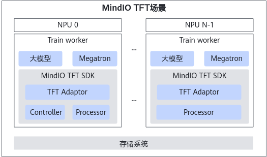

MindIO TFT的各个功能集成在一个whl包中对外提供，需要通过import模块的方式，修改MindSpeed-LLM等大模型框架适配并使用对应功能。

MindIO TFT的关键点如下：

-   MindIO TTP
    -   通过Controller和Processor模块，检测模型训练状态，并通过心跳定期汇报至Controller模块。一旦检测到故障，就开始临终CheckPoint保存。
    -   大模型训练中业界定期保存CheckPoint的时间间隔长。如果发生故障时，距离上一次保存的时间间隔过长，但又没到下一次保存的时间，此时如果重新训练就会消耗大量时间和资源。MindIO TTP提供了几乎零损时间和资源的重新训练方案，即重新训练从上一次故障处开始。

-   MindIO UCE
    -   一旦检测到UCE故障，就开始在线修复。
    -   在大模型训练中，无论是定期保存CheckPoint，还是MindIO TFT的临终CheckPoint保存，重新训练的消耗都是巨大的。UCE提供了训练框架Step级重计算能力，不需要重启进程，同时能保证续训迭代损失，UCE失败后进入TTP流程。

-   MindIO ARF
    -   针对更多的故障，不需要模型停止训练，只需通过节点重启或替换，完成修复和模型续训。
    -   对于业务进程异常故障或RestartRequest和RestartBusiness级别的芯片故障，可以通过进程级别原地恢复功能，仅重启故障进程完成修复和模型续训。

**逻辑模型**

-   Controller模块：负责分布式任务的协同，内部维护状态机，状态机支持不同场景的流程控制；实时收集各个训练进程的训练状态，当训练发生异常后，结合异常类型，触发状态机运作，将状态机对应的Action发送到Processor模块执行。
-   Processor模块：负责与训练框架交互，获取训练进程的训练状态，向Controller汇报，同时负责执行Controller模块下发的对应Action动作。
-   Adaptor模块：负责完成训练框架对MindIO TTP、MindIO UCE、MindIO ARF特性的适配。目前MindIO TFT已完成对[MindSpeed-LLM](#对接mindspeed-llm框架)训练框架的适配。对于其他训练框架，需用户参考并自行适配。

**部署形态**

-   Controller模块：在整个训练集群中，仅支持存在一个Active Controller，建议部署在集群0号节点上，并自动启动最多两个Backup Controller。
-   Processor模块：在整个训练集群中，每个训练进程均需要启动Processor。


## 安装部署


### 安装前必读


#### 免责声明

本文档可能包含第三方信息、产品、服务、软件、组件、数据或内容（统称“第三方内容”）。华为不控制且不对第三方内容承担任何责任，包括但不限于准确性、兼容性、可靠性、可用性、合法性、适当性、性能、不侵权、更新状态等，除非本文档另有明确说明。在本文档中提及或引用任何第三方内容不代表华为对第三方内容的认可或保证。

用户若需要第三方许可，须通过合法途径获取第三方许可，除非本文档另有明确说明。


#### 约束限制

-   MindIO提供TTP、UCE和ARF三种特性，其中MindIO TTP支持在Atlas 800 训练服务器（型号：9000）上使用，MindIO UCE和MindIO ARF不支持该型号设备。
-   众多大模型框架都支持ZeRO（Zero Redundancy Optimizer，零冗余优化器）来减少对显存的使用，当前MindIO TFT仅支持开启ZeRO-1，支持DP（Data Parallelism，数据并行） Size为偶数，同时使用不同的功能对DP Size有不同的限制：
    -   MindIO TTP功能
        -   为了保证故障发生后，有完整的优化器状态数据，要求DP Size能被副本数整除。
        -   开启MoE（Mixture of Experts，混合专家结构）前要求稠密层DP Size大于1；开启MoE后要求稠密层和稀疏层DP Size都大于1。
        -   针对分布式优化器，MindIO TFT在ZeRO-1功能的基础上，通过以算代传，在DP Group上重新切分优化器ZeRO-1范围，实现了优化器数据副本。

    -   MindIO UCE和MindIO ARF功能
        -   若要实现从当前Step恢复训练，对DP Size限制与MindIO TTP功能一致。
        -   对于显存有限，不做副本的情况，即DP Size = 1，此时若发生UCE或者节点故障，支持在线从周期性CheckPoint中加载模型权重和优化器参数恢复训练，损失当前Step到上次周期性CheckPoint的Step之间的训练成本。

    -   分布式优化器在开启ZeRO特性后，优化器状态数据全局只有一份，无数据冗余。MindIO TFT通过增加优化器状态冗余数据副本，保证故障场景下优化器状态数据的完整性，但同时该方案会导致片上内存使用增加。在原有的模型配置基础上，直接使用MindIO TFT可能会导致模型训练启动过程中出现片上内存OOM（Out Of Memory，内存不足）异常。在此情况下，需要通过扩容增加训练作业的片上内存总量。

        增加副本对应增加的片上内存大小计算公式：增加片上内存总量（GB） = 模型参数量N（B） \* 12 \* 副本数。其中，模型参数量的单位为B（十亿），通过以上公式，计算出需要增加的片上内存，扩容后，再使用MindIO TFT。

-   训练容错框架中有一个Active Controller与两个Backup Controller，为了包括Active Controller在内多张卡发生故障时，能够顺利切换到Backup Controller完成临终保存，需要状态正常的卡的数量大于world\_size的一半。
-   MindIO TFT会对优化器状态数据做副本，MindIO UCE或MindIO ARF修复时，寻找有效副本修复故障卡，当训练集群故障较多，通过副本仍然无法拼凑出一个完整副本时，则从Step在线修复退化为在线加载周期CheckPoint修复。
-   MindIO TFT在生成临终CheckPoint数据时，除了考虑一个完整的数据副本，还要校验数据是否一致。如果发生故障后，存在一个OS（Optimizer State，优化器状态）数据Shard长期处于修改状态，或者OS数据不同Shard间训练迭代不一致，都认为是全局数据不一致，无法生成临终CheckPoint数据。
-   MindIO TTP不使用MindIO ACP（Async Checkpoint Persistence，异步CheckPoint保存）功能。MindIO TTP完成临终CheckPoint保存后会结束训练进程。为确保在进程退出前，临终CheckPoint已经保存到持久化存储，约束MindIO TTP写数据不使用异步CheckPoint保存方式，而是直接写入到持久化存储。
-   MindIO TFT目前不支持级联故障场景。例如：当MindIO TTP正在保存时，如果出现其他故障，就会保存失败。
-   MindIO TFT会增加显存占用，详情请参见[表1 原生优化器与开启故障快速恢复特性后优化器参数的理论数值变化](#table_tft_03)。
-   默认开启TLS（Transport Layer Security，传输层安全性协议）安全特性，关闭可能导致伪造Controller连接影响训练进程。
-   MindIO ARF需要多个节点（≥2），不支持Controller节点发生故障，不支持级联故障；MindIO ARF修复失败后，由MindCluster控制后续流程。
-   日志保存路径默认在运行脚本同级目录下“logs/ttp\_log.log”文件，可在运行脚本里自行配置，默认日志级别为“INFO”，单日志文件大小限制为10MB，写方式为单个追加写，单日志文件达到大小上限后会新建滚动日志文件，滚动日志文件数量限制为5个，多个文件循环写覆盖旧文件。


### 安装前准备


#### 组网规划

**图 1**  部署逻辑示意图  


深度学习平台与训练任务相关的节点有计算节点和存储节点。各类节点主要功能如下：

-   计算节点：实际执行训练、推理任务的节点，MindIO TFT仅部署在计算节点。
-   存储节点：存储平台数据和用户数据，如平台日志、用户上传的数据集、训练脚本、训练输出的模型等。

网络平面划分为：

-   业务面：用于管理集群业务。管理节点和计算节点之间连接。
-   存储面：用于访问存储节点。管理节点和计算节点连接到存储节点。
-   参数面：用于分布式训练时，训练节点之间的参数交换和连接。

    >[!NOTE]说明
    >-   逻辑部署示意图展示深度学习平台的完整示意图，MindIO TFT特性只需要在计算节点上部署一个SDK（Software Development Kit），不涉及存储节点的安装部署。
    >-   MindIO TFT功能SDK需要在计算节点相互通信，发送心跳报文，需要使用业务面网络，SDK在所有运行大模型训练的计算节点对等部署，部署时不区分管理节点和计算节点。


#### 环境要求

**硬件环境**

安装前，需要检查以下硬件配置，如[表1](#table_tft_01)所示。

**表 1<a name="table_tft_01"></a>**  硬件环境

|类型|配置参考|
|--|--|
|服务器（单机场景）|<li>Atlas 800 训练服务器（型号：9000）：仅支持MindIO TTP功能<li>Atlas 800T A2 训练服务器<li>Atlas 900 A3 SuperPoD 超节点|
|服务器（集群场景）|计算节点：<li>Atlas 800 训练服务器（型号：9000）：仅支持MindIO TTP功能 <li>Atlas 800T A2 训练服务器 <li>Atlas 900 A3 SuperPoD 超节点<br> 存储节点：存储服务器|
|网络|<li>带外管理（BMC）：≥1Gbit/s <li>带内管理（SSH）：≥1Gbit/s <li>业务面：≥10Gbit/s <li>存储面：≥25Gbit/s <li>参数面：100Gbit/s|


**软件环境**

安装前，需要完成以下环境的安装，如[表2](#table_tft_02)所示。

**表 2<a name="table_tft_02"></a>**  软件环境

|软件|版本|安装位置|获取方式|
|--|--|--|--|
|操作系统|<li>CentOS 7.6 <li>Ubuntu 18.04 <li>Ubuntu 20.04 <li>Ubuntu 22.04|所有节点|-|
|Python|3.7 ~ 3.11|计算节点|用户安装|
|Torch|2.7.1|计算节点|用户安装|
|torch_npu|7.3.0|计算节点|用户安装|
|CANN|8.5.0|计算节点|用户安装|
|驱动与固件|25.5.0|计算节点|用户安装|


#### 准备软件包

**下载软件包**

软件安装前，请根据下表获取软件包及其数字签名文件。软件分为社区版和商用版，两者功能上无区别，区别在于下载权限和是否用于商业用途。社区版软件不需要申请下载权限可以直接下载，但不能用于商业用途；如果软件需要用于商业用途，请下载商用版软件，但需要申请下载权限。

下载本软件即表示您同意[华为企业软件许可](https://support.huawei.com/enterprise/zh/software-policy)协议的条款和条件。

**表 1**  软件下载

|组件名称|软件包|获取地址|
|--|--|--|
|MindIO TFT|内存缓存系统软件包|[获取链接](https://gitcode.com/Ascend/mind-cluster/releases)|


**软件数字签名验证**

为了防止软件包在传递过程或存储期间被恶意篡改，下载软件包时需下载对应的数字签名文件用于完整性验证。

在软件包下载之后，请参见《OpenPGP签名验证指南》，对从Support网站下载的软件包进行PGP数字签名校验。如果校验失败，请勿使用该软件包，先联系华为技术支持工程师解决。

使用软件包安装/升级之前，也需要按上述过程先验证软件包的数字签名，确保软件包未被篡改。

运营商客户请访问：[http://support.huawei.com/carrier/digitalSignatureAction](http://support.huawei.com/carrier/digitalSignatureAction)

企业客户请访问：[https://support.huawei.com/enterprise/zh/tool/pgp-verify-TL1000000054](https://support.huawei.com/enterprise/zh/tool/pgp-verify-TL1000000054)


#### （可选）启动haveged服务

1.  确认系统是否开启了haveged服务（建议一直开启）。

    ```
    systemctl status haveged.service
    ```

    或

    ```
    ps -ef | grep "haveged" | grep -v "grep"
    ```

2.  启动haveged服务，并将其设置为随系统启动，确保haveged服务一直开启。

    ```
    systemctl start haveged.service
    systemctl enable haveged.service
    ```

3.  查看屏幕输出随机数的速度。

    ```
    cat /dev/random | od -x
    ```

    查看当前熵值。

    ```
    cat /proc/sys/kernel/random/entropy_avail
    ```

    正常情况下，熵值在未启动haveged时是100多，启动haveged之后会增大到1000多甚至2000。


### 在计算节点安装MindIO TFT SDK

在大模型训练框架使用的Python环境中，安装MindIO TFT SDK，可使能训练任务的故障恢复，从而加速训练恢复。

**操作步骤**

1.  以安装用户 *{MindIO-install-user}* 登录安装节点。

    >[!NOTE]说明
    >安装用户设置的口令需符合口令复杂度要求（请参见[口令复杂度要求](#口令复杂度要求)）。密码有效期为90天，您可以在“/etc/login.defs“文件中修改有效期的天数，或者通过 **chage** 命令来设置用户的有效期，详情请参见[设置用户有效期](#设置用户有效期)。

2.  将内存缓存系统软件包上传至设备上安装用户有权限读写的路径下。

    >[!NOTE]说明 
    >-   内存缓存系统软件包以获取的实际包名为准。
    >-   如果Python环境是共享目录，则在任一计算节点上传即可，否则所有计算节点都需要上传安装包。

3.  进入软件包上传路径，解压内存缓存系统软件包。

    ```
    unzip Ascend-mindxdl-mindio_{version}_linux-{arch}.zip
    ```

    **表 1**  解压后文件

    |文件|说明|
    |--|--|
    |mindio_acp-*{mindio_acp_version}*-py3-none-linux_*{arch}*.whl|MindIO ACP安装包。|
    |mindio_ttp-*{mindio_ttp_version}*-py3-none-linux_*{arch}*.whl|MindIO TFT安装包。|


4.  进入上传路径，执行以下命令，安装MindIO TFT SDK。

    此处以mindio_ttp-_*{mindio_ttp_version}*_-py3-none-linux_*{arch}*.whl为例，请根据实际情况进行选择。

    ```
    pip3 install mindio_ttp-{mindio_ttp_version}-py3-none-linux_{arch}.whl --force-reinstall --no-index
    ```

    -   首次安装MindIO TFT SDK回显如下，表示安装成功。

        ```
        Processing ./mindio_ttp-{mindio_ttp_version}-py3-none-linux_{arch}.whl
        Installing collected packages: mindio_ttp
        Successfully installed mindio_ttp-{mindio_ttp_version}
        ```

    -   非首次安装MindIO TFT SDK回显如下，表示安装成功。

        ```
        Processing ./mindio_ttp-{mindio_ttp_version}-py3-none-linux_{arch}.whl
        Installing collected packages: mindio_ttp
          Atempting uninstall: mindio-ttp
            Found existing installation: mindio_ttp {mindio_ttp_version}
            Uninstalling mindio_ttp-{mindio_ttp_version}:
              Successfully uninstalled mindio_ttp-{mindio_ttp_version}
        Successfully installed mindio_ttp-{mindio_ttp_version}
        ```

5.  将软件安装目录内的可执行文件和代码脚本权限更改为550，避免出现非法篡改。

    ```
    chmod -R 550 {MindIO TFT SDK安装目录}
    ```


### 卸载MindIO TFT SDK

**操作步骤**

1.  将软件安装目录内的可执行文件和代码脚本权限更改为750。

    ```
    chmod -R 750 {MindIO TFT SDK安装目录}
    ```

2.  卸载MindIO TFT SDK。

    ```
    pip3 uninstall mindio_ttp
    ```


## 使用指导


### 概述

>[!NOTE]说明
>MindIO TFT以SDK的形式提供服务，支持部署在裸机和容器环境中。

安装MindIO TFT SDK之后，需要在框架中启动MindIO TFT模块，并在训练过程中同步优化器数据更新状态到该模块。


### 对接MindSpeed-LLM框架

**前提条件**

-   使用前请先了解MindIO TFT的[约束限制](#约束限制)。
-   MindSpeed-LLM框架准备参见[MindSpeed-LLM](https://gitcode.com/Ascend/MindSpeed-LLM/tree/master)。匹配的Megatron-LM的版本为 **core\_v0.12.1**。

>[!NOTE]说明
>-   本次发布包配套MindSpeed-LLM的 **master** 分支，环境、代码、数据集准备请用户参考MindSpeed-LLM仓库的相关指导说明，并确保其安全性。
>-   MindIO TFT对接MindSpeed-LLM框架，目前支持MindIO TTP、MindIO UCE和MindIO ARF功能。
>-   对于PyTorch类框架，安装或开启MindCluster后，跳过步骤[1](#step_tft_li001)对torchrun的修改，由MindCluster控制进程退出。

**操作步骤**

1.  <a name="step_tft_li001"></a>（可选）编辑“torchrun“文件。
    1.  查找环境中的“torchrun“文件。

        ```
        which torchrun
        ```

    2.  打开以上命令显示路径下的“torchrun“文件。

        ```
        vim {torchrun文件路径}/torchrun
        ```

    3.  按“i”进入编辑模式，在文件中对应位置增加 **import mindio_ttp.framework_ttp**。

        ```
        import re
        import sys
        import mindio_ttp.framework_ttp
        from torch.distributed.run import main as torch_main
        ```

    4.  按“Esc”键，输入 **:wq!**，按“Enter”保存并退出编辑。

2.  <a name="step_tft_li002"></a>编辑预训练脚本（仅供参考）。

    此处以编辑“examples/mcore/llama2/pretrain\_llama2\_7b\_ptd.sh“脚本为例。

    1.  打开“examples/mcore/llama2/pretrain\_llama2\_7b\_ptd.sh“脚本。

        ```
        vim examples/mcore/llama2/pretrain_llama2_7b_ptd.sh
        ```

    2.  按“i”进入编辑模式，开启高可用功能需要在脚本中增加如下内容。
        ```
        export GLOO_SOCKET_IFNAME=enp189s0f0
        export TTP_ADDR="master node ip"
        source /usr/local/Ascend/cann/set_env.sh

        # 在GPT_ARGS中的--bf16后增加如下内容
            \
            --enable-high-availability \
            --enable-hbmfault-repair \
            --enable-worker-reboot \
            --distributed-optimizer-no-replica \

        ```

        修改后的pretrain_llama2_7b_ptd.sh脚本示例如下：

        ```
        #!/bin/bash
        
        export CUDA_DEVICE_MAX_CONNECTIONS=1
        export PYTORCH_NPU_ALLOC_CONF=expandable_segments:True
        
        export GLOO_SOCKET_IFNAME=enp189s0f0
        export TTP_ADDR="master node ip"
        source /usr/local/Ascend/cann/set_env.sh
        
        NPUS_PER_NODE=8
        MASTER_ADDR=localhost
        MASTER_PORT=6000
        NNODES=1
        NODE_RANK=0
        WORLD_SIZE=$(($NPUS_PER_NODE*$NNODES))
        
        CKPT_SAVE_DIR="your model save ckpt path"
        DATA_PATH="your data path"
        TOKENIZER_MODEL="your tokenizer path"
        CKPT_LOAD_DIR="your model ckpt path"
        TP=1
        PP=2
        
        DISTRIBUTED_ARGS="
            --nproc_per_node $NPUS_PER_NODE \
            --nnodes $NNODES \
            --node_rank $NODE_RANK \
            --master_addr $MASTER_ADDR \
            --master_port $MASTER_PORT
        "
        
        GPT_ARGS="
            --use-mcore-models \
            --tensor-model-parallel-size ${TP} \
            --pipeline-model-parallel-size ${PP} \
            --sequence-parallel \
            --num-layers 32 \
            --hidden-size 4096 \
            --ffn-hidden-size 11008 \
            --num-attention-heads 32 \
            --tokenizer-type Llama2Tokenizer \
            --tokenizer-model ${TOKENIZER_MODEL} \
            --seq-length 4096 \
            --max-position-embeddings 4096 \
            --micro-batch-size 1 \
            --global-batch-size 256 \
            --make-vocab-size-divisible-by 1 \
            --lr 1.25e-6 \
            --train-iters 5000 \
            --lr-decay-style cosine \
            --untie-embeddings-and-output-weights \
            --disable-bias-linear \
            --attention-dropout 0.0 \
            --init-method-std 0.01 \
            --hidden-dropout 0.0 \
            --position-embedding-type rope \
            --normalization RMSNorm \
            --use-fused-rmsnorm \
            --swiglu \
            --use-flash-attn \
        
            --no-masked-softmax-fusion \
            --attention-softmax-in-fp32 \
            --min-lr 1.25e-7 \
            --weight-decay 1e-1 \
            --lr-warmup-fraction 0.01 \
            --clip-grad 1.0 \
            --adam-beta1 0.9 \
            --initial-loss-scale 65536 \
            --adam-beta2 0.95 \
            --no-gradient-accumulation-fusion \
            --no-load-optim \
            --no-load-rng \
            --use-distributed-optimizer \
            --use-fused-swiglu \
            --use-fused-rotary-pos-emb \
            --overlap-grad-reduce \
            --bf16 \
            --enable-high-availability \
            --enable-hbmfault-repair \
            --enable-worker-reboot \
            --distributed-optimizer-no-replica \
        "
        
        DATA_ARGS="
            --data-path $DATA_PATH \
            --split 949,50,1
        "
        
        OUTPUT_ARGS="
            --log-interval 1 \
            --save-interval 10000 \
            --eval-interval 1000 \
            --eval-iters 10 \
        "
        
        torchrun $DISTRIBUTED_ARGS pretrain_gpt.py \
            $GPT_ARGS \
            $DATA_ARGS \
            $OUTPUT_ARGS \
            --distributed-backend nccl \
            --load $CKPT_LOAD_DIR \
            --save $CKPT_SAVE_DIR \
            | tee logs/train_llama2_7b.log
        ```

        高可用功能相关参数说明如下：

        -   **GLOO\_SOCKET\_IFNAME**：根据主节点高速网卡实际情况进行配置。
        -   **TTP\_ADDR**：集群主节点的IPv4地址。参数详情请参见[环境变量](#环境变量)。
        -   **set\_env.sh文件路径**：请根据CANN实际的安装路径进行修改。
        -   **enable-high-availability**：MindIO TFT总开关，默认关闭，配置后默认开启临终遗言功能。

            开启MindIO TFT开关后，各类优化器显存会发生变化，变化详情请参见[表1](#table_tft_03)。

            对于分布式优化器而言，由于增加了优化器副本，导致静态内存有所增加。但是集群规模越大时，DP Size越大，平均到单卡的显存增加量很小，这样可以避免OOM，因此推荐在大集群中使用。根据显存情况选择开启与否，调节参数。

        -   **enable-hbmfault-repair**：MindIO UCE功能开关，默认关闭，配置后对片上内存进行故障检测，并完成在线修复，达到Step级重计算功能。本开关在开启enable-high-availability时生效。此特性依赖PyTorch的内存管理机制，仅在PyTorch的环境变量PYTORCH\_NO\_NPU\_MEMORY\_CACHING未配置，即开启内存复用机制时，才可使用此特性，若export PYTORCH\_NO\_NPU\_MEMORY\_CACHING = 1，则无法使用此特性。
        -   **enable-worker-reboot**：MindIO ARF功能开关，默认关闭，配置后在发生一般性故障时，进行进程级重启修复，继续训练。本开关在开启enable-high-availability时生效。
        -   **distributed-optimizer-no-replica**：开启高可用特性后，分布式优化器默认增加优化器副本，会导致片上内存使用增加，开启该开关后，分布式优化器不增加副本内存占用；在MindIO UCE和MindIO ARF场景下，直接使用周期CheckPoint进行在线修复。

        **表 1<a name="table_tft_03"></a>**  原生优化器与使用MindIO TFT后优化器参数的理论数值变化

        |优化器|原生|使用MindIO TFT|说明|
        |--|--|--|--|
        |fp16/bf16|20|20|-|
        |fp32|16|16|-|
        |fp16/bf16 Distributed|4 + 16/d|4 + 16 * N/d|d：DP Group Size<br>N：副本数，N < d|


    3.  按“Esc”键，输入 **:wq!**，按“Enter”保存并退出编辑。


### 对接MindCluster

MindIO TFT以SDK形式提供服务，不存在常驻进程。服务随着训练进程的启动而启动。当训练任务结束时，则服务退出。

与MindCluster对接时，MindCluster管理K8s容器，在K8s容器中安装对接过程与裸机安装部署一致。

**操作步骤**

-   当Python环境不是安装在共享存储中时，为了便于大集群使用，可以将MindIO TFT SDK集成到镜像中，通过镜像安装Pod时，已经安装好MindIO TFT SDK。
-   MindIO TFT服务Controller模块与Processor模块存在心跳报文，在K8s做网络隔离时，需要将通信端口添加到创建Pod时配置的yaml文件中。

    修改创建Pod时配置的yaml文件。此处以“pod.yaml“为例。

    1.  打开“pod.yaml“文件。

        ```
        vim pod.yaml
        ```

    2.  按“i”进入编辑模式，新增以下内容。

        ```
        ports:
          - containerPort: 8000    # 用于MindIO TFT服务Controller与Processor通信端口
            name: ttp-port
        ```

    3.  按“Esc”键，输入 **:wq!**，按“Enter”保存并退出编辑。

-   适配K8s网络，在步骤[2](#step_tft_li002)的预训练脚本基础上做如下修改。

    ```
    # 注释下面两行，该环境变量由MindCluster配置
    # MASTER_ADDR=$(hostname -I | awk '{print $1}')
    # MASTER_PORT=XXXX
    
    # 从K8s获取MASTER_ADDR、MASTER_PORT环境变量（K8s的service网络IP地址）
    CONTROLLER_ADDR=$(hostname -I | awk '{print $1}')
    PROCESSOR_ADDR=${MASTER_ADDR}
    export CONTROLLER_ADDR
    export PROCESSOR_ADDR
    ```


### 对接非MindSpeed-LLM框架

**前提条件**

使用前请先了解MindIO TFT的[约束限制](#约束限制)。

>[!NOTE]说明
>-   本次发布包支持类Megatron框架，环境、代码、数据集请用户自行准备，并确保其安全性。
>-   本节内容仅具有适配指导意义，具体实现细节需由用户自行实现。

**特性参考**

相关特性所需的功能适配点如[表1](#table_tft_04)所示，各功能适配点对应的代码参考链接如[表2](#table_tft_05)所示。

**表 1<a name="table_tft_04"></a>**  特性及功能适配点

|特性|需要的功能适配点序号|
|--|--|
|临终遗言|1、2、3、4、5、6、7|
|UCE快恢|1、2、3、4、5、6、8、10、11|
|网络快恢|1、2、5、6、11|
|进程快恢|1、2、3、4、5、6、9、10、11|
|亚健康热切|1、2、3、4、5、9、10、11、12|
|在线压测/借轨回切|1、2、12|


**表 2<a name="table_tft_05"></a>**  相关功能的代码参考链接

|序号|适配功能点|参考代码|
|--|--|--|
|1|初始化启动|[LLM仓参考链接](https://gitcode.com/wlwen/MindSpeed-LLM/commit/268f870b10e450feade3c98b603254851e8fa4cd?ref=pre_preparation)|
|2|上报优化器更新状态|[LLM仓参考链接](https://gitcode.com/wlwen/MindSpeed-LLM/commit/268f870b10e450feade3c98b603254851e8fa4cd?ref=pre_preparation)|
|3|创建DP副本组|[LLM仓参考链接](https://gitcode.com/wlwen/MindSpeed-LLM/commit/df6317e62ef7cefcec25ba8740f25e152eba34e4?ref=create_dp_replica_group)|
|4|优化器副本|[LLM仓参考链接](https://gitcode.com/wlwen/MindSpeed-LLM/commit/e3490911407d88f9c6d3ac0c0eb3186f1812d171?ref=replica_optimizer)|
|5|异常捕获装饰器|[LLM仓参考链接](https://gitcode.com/wlwen/MindSpeed-LLM/commit/0827869d031303a231a69897c12692fb92d8cf8d?ref=exception_handler)|
|6|算子资源清理|[LLM仓参考链接](https://gitcode.com/wlwen/MindSpeed-LLM/commit/45824ee7303c05bce1260f2cab590dd858147767?ref=stop_clean)|
|7|临终CheckPoint|[LLM仓参考链接](https://gitcode.com/wlwen/MindSpeed-LLM/commit/0e94a3fcb2643580d151b90deb205e9034adde2a?ref=dump_ckpt)|
|8|UCE模型优化器重建|[LLM仓参考链接](https://gitcode.com/wlwen/MindSpeed-LLM/commit/93f599fa480c7f7931c74e782c617e0ebaffceb9?ref=uce_clear_rebuild)|
|9|节点重启及通信重建|[LLM仓参考链接](https://gitcode.com/wlwen/MindSpeed-LLM/commit/4b490ff888cea9766e461f6bb53e73712adf097d?ref=node_reboot)|
|10|参数面在线修复|[LLM仓参考链接](https://gitcode.com/wlwen/MindSpeed-LLM/commit/9bd17ca7fdda3f8c5f70eef68cf1db4ac2ba738f?ref=online_repair_ckpt)|
|11|状态回滚|[LLM仓参考链接](https://gitcode.com/wlwen/MindSpeed-LLM/commit/7835670ec12b2ae5969bd1cd9eec72c882225c18?ref=rollback_callback)|
|12|优雅暂停|[LLM仓参考链接](https://gitcode.com/wlwen/MindSpeed-LLM/commit/db87cc048455f67218f5a8caca626f1b64d35f61?ref=active_pause)|


## 安全管理与加固


### 安全管理

>[!NOTE]说明 
>MindIO TFT暂不支持公有云场景、多租户场景使用，不支持公网直接访问系统。

**防病毒软件例行检查**

定期开展对集群的防病毒扫描，防病毒例行检查会帮助集群免受病毒、恶意代码、间谍软件以及程序侵害，降低系统瘫痪、信息安全问题等风险。可以使用业界主流防病毒软件进行防病毒检查。

**日志管理**

日志管理需要关注以下两点。

-   检查系统是否可以限制单个日志文件的大小。
-   检查日志空间占满后，是否存在机制进行清理。

**漏洞/功能问题修复**

为保证生产环境的安全，降低被攻击的风险，需要定期查看开源社区修复的以下漏洞/功能问题。

-   操作系统漏洞/功能问题。
-   其他相关组件漏洞/功能问题。


### 安全加固


#### 加固须知

本文中列出的安全加固措施为基本的加固建议项。用户应根据自身业务，重新审视整个系统的网络安全加固措施，必要时可参考业界优秀加固方案和安全专家的建议。


#### 风险提示

CheckPoint序列化过程中使用了torch.load接口，该接口中使用了Python自带的pickle组件，必须确保非授权用户没有存储目录及上层目录的写权限，需保证CheckPoint为可信数据，否则可能造成CheckPoint被篡改引起pickle反序列化注入的风险。


#### 操作系统安全加固


**防火墙配置**

操作系统安装后，若配置普通用户，可以通过在“/etc/login.defs“文件中新增“ALWAYS\_SET\_PATH=yes”配置，防止越权操作。此外，为了防止使用“su”命令切换用户时，将当前用户环境变量带入其他环境造成提权，请使用 **su - [user]** 命令进行用户切换，同时在服务器配置文件“/etc/default/su“中增加配置参数“ALWAYS\_SET\_PATH=yes”防止提权。

**设置umask**

建议用户将服务器的umask设置为027\~777以限制文件权限。

以设置umask为027为例，具体操作如下。

1.  以root用户登录服务器，编辑“/etc/profile“文件。

    ```
    vim /etc/profile
    ```

2.  在“/etc/profile“文件末尾加上 **umask 027**，保存并退出。
3.  执行如下命令使配置生效。

    ```
    source /etc/profile
    ```

**无属主文件安全加固**

用户可以执行 **find / -nouser -nogroup** 命令，查找容器内或物理机上的无属主文件。根据文件的UID和GID创建相应的用户和用户组，或者修改已有用户的UID、用户组的GID来适配，赋予文件属主，避免无属主文件给系统带来安全隐患。

**端口扫描**

用户需要关注全网侦听的端口和非必要端口，如有非必要端口请及时关闭。建议用户关闭不安全的服务，如Telnet、FTP等，以提升系统安全性。具体操作方法可参考所使用操作系统的官方文档。

**防DoS攻击**

用户可以根据IP地址限制与服务器的连接速率对系统进行防DoS攻击，方法包括但不限于利用Linux系统自带Iptables防火墙进行预防、优化sysctl参数等。具体使用方法，用户可自行查阅相关资料。

**SSH加固**

由于root用户拥有最高权限，出于安全目的，建议取消root用户SSH远程登录服务器的权限，以提升系统安全性。具体操作步骤如下：

1.  登录安装MindIO TFT组件的节点。
2.  打开“/etc/ssh/sshd\_config“文件。

    ```
    vim /etc/ssh/sshd_config
    ```

3.  按“i”进入编辑模式，找到“PermitRootLogin“配置项并将其值设置为“no“。

    ```
    PermitRootLogin no
    ```

4.  按“Esc”键，输入 **:wq!**，按“Enter”保存并退出编辑。
5.  执行命令使配置生效。

    ```
    systemctl restart sshd
    ```

**缓冲区溢出安全保护**

为阻止缓冲区溢出攻击，建议使用ASLR（Address Space Layout Randomization，内存地址随机化机制）技术，通过对堆、栈、共享库映射等线性区布局的随机化，增加攻击者预测目的地址的难度，防止攻击者直接定位攻击代码位置。该技术可作用于堆、栈、内存映射区（mmap基址、shared libraries、vdso页）。

开启方式：

```
echo 2 >/proc/sys/kernel/randomize_va_space
```


### 开启TLS认证


#### 说明

-   为了保障MindIO TFT组件内部Controller和Processor之间的通信安全，保护信息不被篡改、仿冒，建议启用TLS加密。
-   TLS加密仅用于MindIO TFT内部模块间通信，不对外提供TLS接入、认证功能。
-   因为开启安全认证依赖OpenSSL组件，所以建议用户使用OpenSSL无漏洞版本，需要配套使用GLIBC 2.33或更高版本。


#### 导入TLS证书

-   通过接口tft\_start\_controller、tft\_init\_processor配置TLS密钥证书等，进行TLS安全连接，安全选项默认开启，建议用户开启TLS加密配置，以保证通信安全，如需关闭加密功能，可以使用下面示例，调用接口进行关闭。
-   系统启动后，建议删除本地密钥证书等信息敏感文件。
-   调用该接口时，传入的文件路径应避免包含英文分号、逗号、冒号。
-   支持通过环境变量 **TTP\_ACCLINK\_CHECK\_PERIOD\_HOURS** 和 **TTP\_ACCLINK\_CERT\_CHECK\_AHEAD\_DAYS** 配置证书检查周期与证书过期预警时间。

**配置TLS接口调用示例**

-   TLS关闭（**enable\_tls**=False）时，**tls\_info**无效，无需配置。此开关不影响MindIO TFT特性功能。

    ```
    from mindio_ttp.framework_ttp import tft_start_controller, tft_init_processor
    
    tft_start_controller(bind_ip: str, port: int, enable_tls=False, tls_info='')
    tft_init_processor(rank: int, world_size: int, enable_local_copy: bool, enable_tls=False, tls_info='', enable_uce=True, enable_arf=False)
    ```

    >[!CAUTION]注意
    >-   如果关闭TLS（即**enable\_tls**=False时），会存在较高的网络安全风险。
    >-   **tft\_start\_controller** 和 **tft\_init\_processor** 的enable\_tls开关状态需要保持一致。若两个接口enable\_tls开关不同，会造成以下问题：
    >       -   模块间TLS建链失败。
    >       -   MindIO TFT无法正常运行，训练任务启动失败。

-   TLS开启（**enable\_tls**=True）时，证书相关信息，作为必选参数 **tls\_info** 用于如下接口：

    ```
    from mindio_ttp.framework_ttp import tft_start_controller, tft_init_processor, tft_register_decrypt_handler
    
    # 在tls_info中，以“;”分隔不同字段,以“,”分隔各个文件
    tls_info = r"(
    tlsCert: /etc/ssl/certs/cert.pem;
    tlsCrlPath: /etc/ssl/crl/;
    tlsCaPath: /etc/ssl/ca/;
    tlsCaFile: ca_cert_1.pem, ca_cert_2.pem;
    tlsCrlFile: crl_1.pem, crl_2.pem;
    tlsPk: private key;
    tlsPkPwd: private key pwd;
    packagePath: /etc/ssl/
    )"
    
    # 若tlsPkPwd口令为密文，则需注册口令解密函数
    tft_register_decrypt_handler(user_decrypt_callback)
    tft_start_controller(bind_ip: str, port: int, enable_tls=True, tls_info=tls_info)
    tft_init_processor(rank: int, world_size: int, enable_local_copy: bool, enable_tls=True, tls_info=tls_info, enable_uce=True, enable_arf=False)
    ```

**tls\_info中各字段含义**

|字段|含义|Required|
|--|--|--|
|tlsCert|Server证书。|是|
|tlsCaPath|CA证书存储路径。|是|
|tlsCaFile|CA证书列表。|是|
|tlsCrlPath|证书吊销列表存储路径。|否|
|tlsCrlFile|证书吊销列表。|否|
|tlsPk|私钥。|是|
|tlsPkPwd|私钥口令。|是|
|packagePath|OpenSSL库路径|是|


>[!CAUTION]注意
>证书安全要求：
>-   需使用业界公认安全可信的非对称加密算法、密钥交换算法、密钥长度、Hash算法、证书格式等。
>-   应处于有效期内。


#### （可选）证书有效性校验

如果启用TLS认证，则需要关注证书有效期。请合理规划证书有效期和证书更新周期，并在证书过期前及时更新证书，防范安全风险。MindIO TFT提供证书有效期定期巡检功能，默认巡检周期为7天，默认提前告警时间为30天，若发现证书存在过期风险，则会在环境变量 **TTP\_LOG\_PATH** 配置的日志中打印WARNING告警信息，请及时关注并处理。


## API接口参考


### 说明

所有接口参数表和回调函数参数表，默认按照函数参数顺序排列。


### tft\_init\_controller

**接口功能**

初始化MindIO TFT Controller模块。

**接口格式**

```
mindio_ttp.framework_ttp.tft_init_controller(rank: int, world_size: int, enable_local_copy: bool, enable_arf=False, enable_zit=False)
```

**接口参数**

|参数|是否必选|说明|取值要求|
|--|--|--|--|
|rank|必选|当前执行训练任务的NPU卡号。|int，[-1, world_size)。MindCluster在Torch Agent进程拉起Controller时rank值取-1。|
|world_size|必选|整个集群参与训练任务的卡数。|int，[1, 100000]。|
|enable_local_copy|必选|表示是否启用local copy。优化器更新前，先对优化器做一次备份。|<li>False：关闭 <li>True：启用|
|enable_arf|可选|MindIO ARF特性开关。|<li>False：关闭 <li>True：启用<br>默认为False。|
|enable_zit|可选|MindIO ZIT特性开关。|<li>False：关闭 <li>True：启用<br>默认为False。|


**返回值**

无返回值。出错时会打印ERROR日志并抛出异常。


### tft\_start\_controller

**接口功能**

在初始化Controller模块成功后，调用该接口以启动MindIO TFT Controller模块服务。

**接口格式**

```
mindio_ttp.framework_ttp.tft_start_controller(bind_ip: str, port: int, enable_tls=True, tls_info='')
```

**接口参数**

|参数|是否必选|说明|取值要求|
|--|--|--|--|
|bind_ip|必选|Controller所在节点IP地址或域名。|符合IP地址规范的IPv4地址，位于集群节点IP地址中，禁止全零IP地址，支持域名。|
|port|必选|Controller侦听端口号。|[1024, 65535]|
|enable_tls|可选|TLS加密传输开关。|<li>False：关闭 <li>True：启用<br>默认为True。|
|tls_info|可选|TLS的证书配置。|默认为空，当开启TLS认证时，需要配置证书信息，具体字段应以键值对形式组织。具体配置指导见[导入TLS证书](#导入tls证书)。|


**返回值**

无返回值。出错时会打印ERROR日志并抛出异常。


### tft\_destroy\_controller

**接口功能**

在训练完成后，调用该接口以关闭MindIO TFT Controller服务。

**接口格式**

```
mindio_ttp.framework_ttp.tft_destroy_controller()
```

**接口参数**

无

**返回值**

无返回值。出错时会打印ERROR日志并抛出异常。


### tft\_init\_processor

**接口功能**

初始化MindIO TFT Processor模块。

**接口格式**

```
mindio_ttp.framework_ttp.tft_init_processor(rank: int, world_size: int, enable_local_copy: bool, enable_tls=True, tls_info='', enable_uce=True, enable_arf=False, enable_zit=False)
```

**接口参数**

|参数|是否必选|说明|取值要求|
|--|--|--|--|
|rank|必选|当前执行训练任务NPU卡号。|int，[0, world_size)。|
|world_size|必选|参与训练任务的集群卡数。|int，[1, 100000]。|
|enable_local_copy|必选|是否启用local copy。|<li>False：关闭 <li>True：启用|
|enable_tls|可选|TLS加密传输开关。|<li>False：关闭 <li>True：启用 <br>默认为True。|
|tls_info|可选|TLS的证书配置。|默认为空，当开启TLS认证时，需要配置证书信息，具体字段应以键值对形式组织。具体配置指导见[导入TLS证书](#导入tls证书)。|
|enable_uce|可选|MindIO UCE特性开关。|<li>False：关闭 <li>True：启用 <br>默认为True。|
|enable_arf|可选|MindIO ARF特性开关。|<li>False：关闭 <li>True：启用 <br>默认为False。|
|enable_zit|可选|MindIO ZIT特性开关。|<li>False：关闭 <li>True：启用 <br>默认为False。|


**返回值**

无返回值。出错时会打印ERROR日志并抛出异常。


### tft\_start\_processor

**接口功能**

在初始化Processor模块成功后，调用该接口以启动MindIO TFT Processor模块服务。

**接口格式**

```
mindio_ttp.framework_ttp.tft_start_processor(master_ip: str, port: int, local_ip='')
```

**接口参数**

|参数|是否必选|说明|取值要求|
|--|--|--|--|
|master_ip|必选|Controller所在节点IP地址或域名。|符合IP地址规范的IPv4地址，位于集群节点IP地址中，禁止全零IP地址，支持域名。|
|port|必选|Controller侦听端口号。|[1024, 65535]|
|local_ip|可选|K8s中Processor所在节点的Service IP地址或域名。|符合IP地址规范的IPv4地址，位于集群节点IP地址中，禁止全零IP地址，支持域名。|


**返回值**

无返回值。出错时会打印ERROR日志并抛出异常。


### tft\_destroy\_processor

**接口功能**

在训练完成后，调用该接口以关闭MindIO TFT Processor服务。

**接口格式**

```
mindio_ttp.framework_ttp.tft_destroy_processor()
```

**接口参数**

无

**返回值**

无返回值。出错时会打印ERROR日志并抛出异常。


### tft\_start\_updating\_os

**接口功能**

在优化器状态更新前，调用该接口以更新optimizer state为Updating。

**接口格式**

```
mindio_ttp.framework_ttp.tft_start_updating_os(backup_step: int)
```

**接口参数**

|参数|是否必选|说明|取值要求|
|--|--|--|--|
|backup_step|必选|备份的step。|-1或自然数，范围[-1, 9223372036854775807)。<li>-1：表示不使用备份step。 <li>自然数：优化器更新前，备份的优化器状态数据对应的step。|


**返回值**

无返回值。出错时会打印ERROR日志并抛出异常。


### tft\_start\_copy\_os

**接口功能**

通知Processor开始copy优化器状态。

**接口格式**

```
mindio_ttp.framework_ttp.tft_start_copy_os()
```

**接口参数**

无

**返回值**

无返回值。出错时会打印ERROR日志并抛出异常。


### tft\_end\_updating\_os

**接口功能**

在优化器状态更新完成后，调用该接口以更新optimizer state为Updated。

**接口格式**

```
mindio_ttp.framework_ttp.tft_end_updating_os(step: int)
```

**接口参数**

|参数|是否必选|说明|取值要求|
|--|--|--|--|
|step|必选|当前的step。|正整数，范围[1, 9223372036854775807)。|


**返回值**

无返回值。出错时会打印ERROR日志并抛出异常。


### tft\_set\_optimizer\_replica

**接口功能**

设置rank对应的优化器状态数据副本关系。

**接口格式**

```
mindio_ttp.framework_ttp.tft_set_optimizer_replica(rank: int, replica_info: list)
```

**接口参数**

|参数|是否必选|说明|取值要求|
|--|--|--|--|
|rank|必选|当前执行训练任务的NPU卡号。|int，[0, 100000)。|
|replica_info|必选|副本关系list，其中每个元素是一个字典，字典按照ATTENTION：0、MOE：1的索引顺序排列。|[<br>{<br>"rank_list":list,对应的一组副本关系rank列表，PyTorch场景为DP组rank list,MindSpore场景为该卡对应的所有副本卡的list <br>"replica_cnt":int，副本数，PyTorch场景为副本数，MindSpore场景为rank_list的长度 <br>"replica_shift":int，PyTorch场景有效<br>},<br>]|


**返回值**

无返回值。出错时会打印ERROR日志并抛出异常。


### tft\_exception\_handler

**接口功能**

装饰器，对MindSpeed-LLM的train方法进行装饰，捕获训练状态异常以及上报处理，对于用户的其他训练框架，本接口仅提供参考示例功能。

**接口格式**

```
mindio_ttp.framework_ttp.tft_exception_handler(func: Callable)
```

**接口参数**

|参数|是否必选|说明|取值要求|
|--|--|--|--|
|func|必选|函数作为参数。|框架的train方法。|


**返回值**

装饰器返回的func。


### tft\_set\_step\_args

**接口功能**

训练框架设置的参数集合。

>[!NOTE]说明
>对于MindSpeed-LLM训练框架，设置功能已经由MindIO TFT完成适配，不需要调用。

**接口格式**

```
mindio_ttp.framework_ttp.tft_set_step_args(args)
```

**接口参数**

|参数|是否必选|说明|取值要求|
|--|--|--|--|
|args|必选|训练框架设置需要保存的参数集合。MindIO TFT在stop/clean/repair/rollback等阶段调用注册的回调函数时，将参数集合传回，框架根据参数集合完成相应功能。|由训练框架决定，MindIO TFT不访问也不修改该参数集合，在stop/clean/repair/rollback等阶段时调用注册的业务回调将其传回，业务回调负责对取值范围进行校验。|


**返回值**

无返回值。出错时会打印ERROR日志并抛出异常。


### tft\_register\_rename\_handler

**接口功能**

注册框架侧rename回调函数。

>[!NOTE]说明 
>对于MindSpeed-LLM训练框架，回调函数已经由MindIO TFT完成适配；而对于其他框架，用户需要自行确保回调函数的安全性。

**接口格式**

```
mindio_ttp.framework_ttp.tft_register_rename_handler(func: Callable, ctx = None)
```

**接口参数**

|参数|是否必选|说明|取值要求|
|--|--|--|--|
|func|必选|rename函数，将保存成功的临终CheckPoint重命名，与原生框架CheckPoint命名规则一致。|回调函数，不为空，回调函数的入参要求请参见[表 1](#table_tft_06)和[表 2](#table_tft_07)，约定该回调函数无返回值，执行失败抛出异常。|
|ctx|可选|回调函数上下文。|默认为空。|


**表 1<a name="table_tft_06"></a>**  MindSpore回调函数参数

|参数|是否必选|说明|取值要求|
|--|--|--|--|
|step|-|dump优化器数据时对应的step。|正整数。|
|ctx|-|回调函数上下文。|由注册方决定。|


**表 2<a name="table_tft_07"></a>**  非MindSpore回调函数参数

|参数|是否必选|说明|取值要求|
|--|--|--|--|
|step|-|dump优化器数据时对应的step。|正整数。|
|args|-|tft_set_step_args设置的参数。|由注册方决定。|


**返回值**

无返回值。出错时会打印ERROR日志并抛出异常。


### tft\_register\_save\_ckpt\_handler

**接口功能**

注册框架侧dump回调函数。

>[!NOTE]说明
>对于MindSpeed-LLM训练框架，回调函数已经由MindIO TFT完成适配；而对于其他框架，用户需要自行确保回调函数的安全性。

**接口格式**

```
mindio_ttp.framework_ttp.tft_register_save_ckpt_handler(func: Callable, ctx = None)
```

**接口参数**

|参数|是否必选|说明|取值要求|
|--|--|--|--|
|func|必选|临终CheckPoint保存函数，完成保存临终CheckPoint的功能。|回调函数，不为空，回调函数的入参要求请参见[表1](#table_tft_08)，约定该回调函数无返回值，执行失败抛出异常。|
|ctx|可选|回调函数上下文。|默认为空。|


**表 1<a name="table_tft_08"></a>**  回调函数参数

|参数|是否必选|说明|取值要求|
|--|--|--|--|
|step|-|dump优化器数据时对应的step。|正整数。|
|save_info|-|不同优化器参与保存临终遗言时的rank list，其中每个元素是一个字典，字典按照ATTENTION（0）、MOE（1）的索引顺序排列。|[<br>{<br>"type": int，优化器类型 <br>"ranks": list，参与对应优化器保存临终遗言时的rank列表<br>},<br>]|
|args|-|tft_set_step_args设置的参数。|由注册方决定。|
|ctx|-|回调函数上下文。|由注册方决定。|


**返回值**

无返回值。出错时会打印ERROR日志并抛出异常。


### tft\_register\_exit\_handler

**接口功能**

向MindIO TFT注册用户自定义退出方法。

>[!NOTE]说明 
>目前仅针对MindSpore框架提供了注册退出回调的功能，用户需要自行确保回调函数的安全性；其他框架的退出则由MindIO TFT负责。

**接口格式**

```
mindio_ttp.framework_ttp.tft_register_exit_handler(func: Callable, ctx = None)
```

**接口参数**

|参数|是否必选|说明|取值要求|
|--|--|--|--|
|func|必选|完成退出的回调函数。|回调函数，不为空，回调函数的入参要求请参见[表1](#table_tft_09)，约定该回调函数无返回值，执行失败抛出异常。|
|ctx|可选|回调函数上下文。|默认为空。|


**表 1<a name="table_tft_09"></a>**  回调函数参数

|参数|是否必选|说明|取值要求|
|--|--|--|--|
|ctx|-|回调函数上下文。|由注册方决定。|


**返回值**

无返回值。出错时会打印ERROR日志并抛出异常。


### tft\_register\_stop\_handler

**接口功能**

在恢复过程中注册停止训练的回调函数。

>[!NOTE]说明
>对于MindSpeed-LLM训练框架，回调函数已经由MindIO TFT完成适配；而对于其他框架，用户需要自行确保回调函数的安全性。

**接口格式**

```
mindio_ttp.framework_ttp.tft_register_stop_handler(func: Callable, ctx = None)
```

**接口参数**

|参数|是否必选|说明|取值要求|
|--|--|--|--|
|func|必选|停止训练的回调函数，实现停止训练的功能，并抛出FORCE STOP异常将训练主线程控制权交由装饰器接管。|回调函数，不为空，回调函数的入参要求请参见[表1](#table_tft_10)，约定该回调函数无返回值，执行失败抛出异常。|
|ctx|可选|回调函数上下文。|默认为空。|


**表 1<a name="table_tft_10"></a>**  回调函数参数

|参数|是否必选|说明|取值要求|
|--|--|--|--|
|args|-|tft_set_step_args设置的参数。|由注册方决定。|
|ctx|-|回调函数上下文。|由注册方决定。|


**返回值**

无返回值。出错时会打印ERROR日志并抛出异常。


### tft\_register\_clean\_handler

**接口功能**

在恢复过程中注册清理残留算子执行的回调函数。

>[!NOTE]说明 
>对于MindSpeed-LLM训练框架，回调函数已经由MindIO TFT完成适配；而对于其他框架，用户需要自行确保回调函数的安全性。

**接口格式<**

```
mindio_ttp.framework_ttp.tft_register_clean_handler(func: Callable, ctx = None)
```

**接口参数**

|参数|是否必选|说明|取值要求|
|--|--|--|--|
|func|必选|清理残留算子执行的回调函数，完成清理残留算子、底层故障的功能。|回调函数，不为空，回调函数的入参要求请参见[表1](table_tft_10)。约定该回调函数返回值： <li>0：成功。 <li>1：失败。 <li>2：UCE场景且无需重建模型优化器。|
|ctx|可选|回调函数上下文。|默认为空。|


**表 1<a name="table_tft_10"></a>**  回调函数参数

|参数|是否必选|说明|取值要求|
|--|--|--|--|
|is_uce_error|-|表示该卡是否发生UCE故障。|<li>False：未发生UCE故障。 <li>True：发生UCE故障。|
|args|-|tft_set_step_args设置的参数。|由注册方决定。|
|ctx|-|回调函数上下文。|由注册方决定。|


**返回值**

无返回值。出错时会打印ERROR日志并抛出异常。


### tft\_register\_rebuild\_group\_handler

**接口功能**

注册MindIO ARF重新建组的回调函数。

>[!NOTE]说明
>对于MindSpeed-LLM训练框架，回调函数已经由MindIO TFT完成适配；而对于其他框架，用户需要自行确保回调函数的安全性。

**接口格式**

```
mindio_ttp.framework_ttp.tft_register_rebuild_group_handler(func: Callable, ctx = None)
```

**接口参数**

|参数|是否必选|说明|取值要求|
|--|--|--|--|
|func|必选|MindIO ARF重新建组的回调函数，完成正常节点与重启节点清理旧通信组并重建新通信组的功能。回调函数执行超时时间默认为180秒。若超时，会导致流程执行失败。用户可通过环境变量TTP_NORMAL_ACTION_TIME_LIMIT来设置超时时间。|回调函数，不为空，回调函数的入参要求请参见[表1](#table_tft_11)，约定该回调函数无返回值，执行失败抛出异常。|
|ctx|可选|回调函数上下文。|默认为空。|


**表 1<a name="table_tft_11"></a>**  回调函数参数

|参数|是否必选|说明|取值要求|
|--|--|--|--|
|fault_ranks|-|故障卡集合。|list。|
|args|-|tft_set_step_args设置的参数。|由注册方决定。|
|ctx|-|回调函数上下文。|由注册方决定。|


**返回值**

无返回值。出错时会打印ERROR日志并抛出异常。


### tft\_register\_repair\_handler

**接口功能**

注册repair回调函数。

>[!NOTE]说明
>-   对于MindSpeed-LLM训练框架，回调函数已经由MindIO TFT完成适配；而对于其他框架，用户需要自行确保回调函数的安全性。
>-   MindIO TFT已在回调函数中对模型优化器中的变量进行重建与覆写，用户在框架中自定义的其他参与计算的变量，需在repair中自行实现对其的重建与覆写。

**接口格式**

```
mindio_ttp.framework_ttp.tft_register_repair_handler(func: Callable, ctx = None)
```

**接口参数**

|参数|是否必选|说明|取值要求|
|--|--|--|--|
|func|必选|repair回调函数，完成优化器修复等数据修复功能。回调函数执行超时时间默认为180秒。若超时，会导致流程执行失败。用户可通过环境变量TTP_NORMAL_ACTION_TIME_LIMIT来设置超时时间。|回调函数，不为空，回调函数的入参要求请参见[表1](#table_tft_12)，约定该回调函数无返回值，执行失败抛出异常。|
|ctx|可选|回调上下文。|默认为空。|


**表 1<a name="table_tft_12"></a>**  回调函数参数

|参数|是否必选|说明|取值要求|
|--|--|--|--|
|step|-|修复时对应的step。|正整数。|
|need_rebuild|-|修复是否需要重建模型和优化器。|<li>False：无需重建。 <li>True：需要重建。|
|error_ranks|-|需要修复的故障卡list。|list。|
|repair_info|-|修复策略dict，其中优化器类型按照ATTENTION（0）、MOE（1）的关系对应。|{<br>"type": int，优化器类型 <br>"repair_type": Enum，枚举类型取值参见[RepairType](#repairtype) <br>"src": list，优化器修复数据的来源卡列表 <br>"dst": list，优化器修复数据的目的卡列表 <br>"rank_list": list，修复通信组建立所需要的卡列表 <br>}|
|args|-|tft_set_step_args设置的参数。|由注册方决定。|
|ctx|-|回调函数上下文。|由注册方决定。|


**返回值**

无返回值。出错时会打印ERROR日志并抛出异常。


### tft\_register\_rollback\_handler

**接口功能**

注册rollback回滚函数。

>[!NOTE]说明 
>对于MindSpeed-LLM训练框架，回调函数已经由MindIO TFT完成适配；而对于其他框架，用户需要自行确保回调函数的安全性。

**接口格式**

```
mindio_ttp.framework_ttp.tft_register_rollback_handler(func: Callable, ctx = None)
```

**接口参数**

|参数|是否必选|说明|取值要求|
|--|--|--|--|
|func|必选|rollback回调函数，完成数据集回滚等重置操作。回调函数执行超时时间默认为180秒。若超时，会导致流程执行失败。用户可通过设置环境变量TTP_NORMAL_ACTION_TIME_LIMIT来设置超时时间。|回调函数，不为空，回调函数的入参要求请参见[表1](#table_tft_13)，约定该回调函数无返回值，执行失败抛出异常。|
|ctx|可选|回调函数上下文。|默认为空。|


**表 1<a name="table_tft_13"></a>**  回调函数参数

|参数|是否必选|说明|取值要求|
|--|--|--|--|
|step|-|回滚到的step。|正整数。|
|args|-|tft_set_step_args设置的参数。|由注册方决定。|
|ctx|-|回调函数上下文。|由注册方决定。|


**返回值**

无返回值。出错时会打印ERROR日志并抛出异常。


### tft\_register\_stream\_sync\_handler

**接口功能**

注册同步回调函数。

>[!NOTE]说明
>对于MindSpeed-LLM训练框架，回调函数已经由MindIO TFT完成适配；而对于其他框架，用户需要自行确保回调函数的安全性。

**接口格式**

```
mindio_ttp.framework_ttp.tft_register_stream_sync_handler(func: Callable, ctx=None)
```

**接口参数**

|参数|是否必选|说明|取值要求|
|--|--|--|--|
|func|必选|同步回调函数，完成训练暂停后同步操作。避免在暂停训练后算子队列有残留算子未执行完。|回调函数，不为空。回调函数无参数，约定该回调函数无返回值，执行失败抛出异常。|
|ctx|-|回调函数上下文。|由注册方决定。|


**返回值**

无返回值。出错时会打印ERROR日志并抛出异常。


### tft\_register\_zit\_upgrade\_rollback\_handler

**接口功能**

训练框架向Processor注册升级回滚回调函数。

>[!NOTE]说明
>对于MindSpeed-LLM训练框架，回调函数已经完成适配；而对于其他框架，用户需要自行确保回调函数的安全性。

**接口格式**

```
mindio_ttp.framework_ttp.tft_register_zit_upgrade_rollback_handler(func: Callable, ctx = None)
```

**接口参数**

|参数|是否必选|说明|取值要求|
|--|--|--|--|
|func|必选|rollback回调函数，完成数据集回滚等重置操作。回调函数执行超时时间默认为180秒。若超时，会导致流程执行失败。用户可通过环境变量TTP_NORMAL_ACTION_TIME_LIMIT来设置超时时间。|回调函数，不为空，约定该回调函数无返回值，执行失败抛出异常。|
|ctx|可选|回调函数上下文。|默认为空。|


**返回值**

无返回值。出错时会打印ERROR日志并抛出异常。


### tft\_register\_zit\_upgrade\_repair\_handler

**接口功能**

训练框架向Processor注册升级修复回调函数。

>[!NOTE]说明
>对于MindSpeed-LLM训练框架，回调函数已经完成适配；而对于其他框架，用户需要自行确保回调函数的安全性。

**接口格式**

```
mindio_ttp.framework_ttp.tft_register_zit_upgrade_repair_handler(func: Callable, ctx = None)
```

**接口参数<a name="section34575883518"></a>**

|参数|是否必选|说明|取值要求|
|--|--|--|--|
|func|必选|repair回调函数，完成优化器修复等数据修复操作。回调函数执行超时时间默认为180秒。若超时，会导致流程执行失败。用户可通过环境变量TTP_NORMAL_ACTION_TIME_LIMIT来设置超时时间。|回调函数，不为空，约定该回调函数无返回值，执行失败抛出异常。|
|ctx|可选|回调函数上下文。|默认为空。|


**返回值**

无返回值。出错时会打印ERROR日志并抛出异常。


### tft\_register\_zit\_upgrade\_rebuild\_handler

**接口功能**

训练框架向Processor注册升级重建组回调函数。

>[!NOTE]说明 
>对于MindSpeed-LLM训练框架，回调函数已经完成适配；而对于其他框架，用户需要自行确保回调函数的安全性。

**接口格式**

```
mindio_ttp.framework_ttp.tft_register_zit_upgrade_rebuild_handler(func: Callable, ctx = None)
```

**接口参数<a name="section34575883518"></a>**

|参数|是否必选|说明|取值要求|
|--|--|--|--|
|func|必选|rollback回调函数，完成升级重建组修复操作。回调函数执行超时时间默认为180秒
。若超时，会导致流程执行失败。用户可通过环境变量TTP_NORMAL_ACTION_TIME_LIMIT来设置超时时间。|回调函数，不为空，约定该回调函数无返回值，执行失败抛出异常。|
|ctx|可选|回调函数上下文。|默认为空。|


**返回值**

无返回值。出错时会打印ERROR日志并抛出异常。


### tft\_register\_zit\_downgrade\_rebuild\_handler

**接口功能**

训练框架向Processor注册降级重建修复回调函数。

>[!NOTE]说明
>对于MindSpeed-LLM训练框架，回调函数已经完成适配；而对于其他框架，用户需要自行确保回调函数的安全性。

**接口格式**

```
mindio_ttp.framework_ttp.tft_register_zit_downgrade_rebuild_handler(func: Callable, ctx = None)
```

**接口参数=**

|参数|是否必选|说明|取值要求|
|--|--|--|--|
|func|必选|rollback回调函数，完成升级回滚等重置操作。回调函数执行超时时间默认为180秒。若超时，会导致流程执行失败。用户可通过环境变量TTP_NORMAL_ACTION_TIME_LIMIT来设置超时时间。|回调函数，不为空，约定该回调函数无返回值，执行失败抛出异常。|
|ctx|可选|回调函数上下文。|默认为空。|


**返回值**

无返回值。出错时会打印ERROR日志并抛出异常。


### tft\_report\_error

**接口功能**

上报错误类型。

**接口格式**

```
mindio_ttp.framework_ttp.tft_report_error(error_type: ReportState)
```

**接口参数**

|参数|是否必选|说明|取值要求|
|--|--|--|--|
|error_type|必选|上报异常类型，用以决定后续修复流程。|实际错误类型。取值范围请参见[ReportState](#reportstate)。|


**返回值**

无返回值。出错时会打印ERROR日志并抛出异常。


### tft\_wait\_next\_action

**接口功能**

修复期间，训练主线程在装饰器中调用该接口等待从线程完成业务数据修复。

>[!NOTE]说明
>该接口为阻塞接口，在未获取到下一次action前，会一直阻塞。

**接口格式**

```
mindio_ttp.framework_ttp.tft_wait_next_action()
```

**接口参数**

无

**返回值**

-   0：成功
-   1：失败


### tft\_get\_repair\_step

**接口功能**

查询修复位置的step值。

**接口格式**

```
mindio_ttp.framework_ttp.tft_get_repair_step()
```

**接口参数**

无

**返回值**

修复使用的step，返回0表示无效值。


### tft\_get\_repair\_type

**接口功能**

提供给MindSpore调用，用于在stop/clean/repair阶段的回调中查询修复类型。

**接口格式**

```
mindio_ttp.framework_ttp.tft_get_repair_step()
```

**接口参数**

无

**返回值**

str类型。

-   retry：执行UCE修复。
-   recover：执行ARF修复。
-   dump：执行临终遗言。
-   unknow：未找到修复类型。


### tft\_is\_reboot\_node

**接口功能**

MindIO ARF功能流程中，判断当前进程是否为故障后重新拉起的节点，仅支持在tft\_start\_processor接口调用成功后立即调用，且仅支持调用一次。

**接口格式**

```
mindio_ttp.framework_ttp.tft_is_reboot_node()
```

**接口参数**

无

**返回值**

bool值，表示是否为故障后重新拉起的节点。


### tft\_get\_reboot\_type

**接口功能**

提供给MindSpore调用，在故障重新拉起节点后，训练框架从mindio\_ttp获取节点重启场景类型，进程启动后仅支持调用一次。

**接口格式**

```
mindio_ttp.framework_ttp.tft_get_reboot_type()
```

**接口参数**

无

**返回值**

str类型。

-   arf：代表进程重调度。
-   hot switch：代表亚健康热切。


### tft\_reset\_limit\_step

**接口功能**

更新Processor中prelock标记为true，并重置limitStep\_为最大值。

**接口格式**

```
mindio_ttp.framework_ttp.tft_reset_limit_step()
```

**接口参数**

无

**返回值**

无返回值。出错时会打印ERROR日志并抛出异常。


### tft\_set\_dp\_group\_info

**接口功能**

训练框架向Processor注册DP组信息。

**接口格式**

```
mindio_ttp.controller_ttp.tft_set_dp_group_info(rank: int, dp_rank_list: list)
```

**接口参数**

|参数|是否必选|说明|取值要求|
|--|--|--|--|
|rank|可选|当前rank。|大于或等于0。|
|dp_rank_list|可选|DP组信息。|非空。|


**返回值**

无返回值。出错时会打印ERROR日志并抛出异常。


### tft\_report\_load\_ckpt\_step

**接口功能**

使用周期CheckPoint修复时，上报从CheckPoint加载的步数。

**接口格式**

```
mindio_ttp.framework_ttp.tft_report_load_ckpt_step(step: int)
```

**接口参数**

|参数|是否必选|说明|取值要求|
|--|--|--|--|
|step|必选|从CheckPoint加载的步数。|非负整数。|


**返回值**

无


### tft\_register\_decrypt\_handler

**接口功能**

如果用户开启TLS加密，则需要使用该接口注册私钥口令解密函数。

**接口格式**

```
mindio_ttp.framework_ttp.tft_register_decrypt_handler(decryptor: Callable)
```

**接口参数**

|参数|是否必选|说明|取值要求|
|--|--|--|--|
|decryptor|必选|用户自定义的私钥口令解密函数。|通过tft_start_controller和tft_init_processor配置TLS加密，并且如果口令为密文，则需注册解密函数。具体配置指导见[导入TLS证书](#导入tls证书)。|


**回调函数参数**

|参数|是否必选|说明|取值要求|
|--|--|--|--|
|cipherText|-|需要解密的私钥口令。|由注册方决定。|


**回调函数返回值**为plainText : str，即解密后的私钥口令。

**返回值**

无返回值。出错时会打印ERROR日志并抛出异常。


### tft\_notify\_controller\_dump

**接口功能**

提供给MindCluster调用，通知MindIO TFT主动停止训练，执行dump后退出训练。

**接口格式**

```
mindio_ttp.controller_ttp.tft_notify_controller_dump()
```

**接口参数**

无

**返回值**

-   0：调用成功
-   1：调用失败


### tft\_notify\_controller\_stop\_train

**接口功能**

提供给MindCluster调用，通知MindIO TFT主动停止训练，并告知MindIO TFT发生故障的卡信息。

**接口格式**

```
mindio_ttp.controller_ttp.tft_notify_controller_stop_train(fault_ranks: dict, stop_type: str = "stop", timeout: int = None)
```

**接口参数**

|参数|是否必选|说明|取值要求|
|--|--|--|--|
|fault_ranks|必选|发生故障的卡信息。|<int key, int errorType>字典：<ul><li>key为故障卡的rank号 <li>errorType为故障类型：<ul><li>0：UCE故障 <li>1：非UCE故障</ul></ul>|
|stop_type|可选|停止训练的类型。|字符串，支持以下两种方式：<li>"stop"：暂停训练，taskabort方式。 <li>"pause"：暂停训练，非taskabort方式。|
|timeout|可选|暂停训练之后等待MindCluster做下一步通知的超时时间。|非负整数。|


**返回值>**

-   0：调用成功
-   1：调用失败


### tft\_notify\_controller\_on\_global\_rank

**接口功能**

提供给MindCluster调用，通知MindIO TFT全局的故障卡信息。

**接口格式**

```
mindio_ttp.controller_ttp.tft_notify_controller_on_global_rank(fault_ranks: dict,time:int=1)
```

**接口参数**

|参数|是否必选|说明|取值要求|
|--|--|--|--|
|fault_ranks|必选|发生故障的卡信息。|<int key, int errorType>字典：<ul><li>key为故障卡的rank号<li>errorType为故障类型：<ul><li>0：UCE故障。 <li>1：非UCE故障。</ul></ul>|
|time|可选|根据环境变量设置，决定与MindCluster的修复策略交互的最大时间。|int，取值范围：[1, 3600]，默认值：1。|


**返回值**

-   0：调用成功
-   1：调用失败


### tft\_notify\_controller\_prepare\_action

**接口功能**

提供给MindCluster调用，通知MindIO TFT要执行的修复策略。

>[!NOTE]说明
>该修复策略必须在MindCluster和MindIO TFT协商的可选修复策略范围内。

**接口格式**

```
mindio_ttp.controller_ttp.tft_notify_controller_prepare_action(action: str, fault_ranks: dict = None)
```

**接口参数**

|参数|是否必选|说明|取值要求|
|--|--|--|--|
|action|必选|通知MindIO TFT亚健康迁移热切动作。|str，支持的修复策略如下：<li>hot switch <li>stop switch|
|fault_ranks|可选|发生故障的卡信息。|dict，key为rank号，取值范围0\~10W，value为errtype，取值范围0\~2。|


**返回值**

-   0：调用成功
-   1：调用失败


### tft\_notify\_controller\_change\_strategy

**接口功能**

提供给MindCluster调用，通知MindIO TFT要执行的修复策略。

>[!NOTE]说明
>该修复策略必须在MindCluster和MindIO TFT协商的可选修复策略范围内。

**接口格式**

```
mindio_ttp.controller_ttp.tft_notify_controller_change_strategy(strategy: str, params: str = "")
```

**接口参数**

|参数|是否必选|说明|取值要求|
|--|--|--|--|
|strategy|必选|通知MindIO TFT修复策略。|str，支持的修复策略如下：<li>retry <li>downgrade <li>upgrade <li>recover <li>dump <li>continue <li>migratione <li>xit|
|params|降级训练必选其他可选|降级训练参数。|str，默认值：""。|


**返回值**

-   0：调用成功
-   1：调用失败


### tft\_register\_mindx\_callback

**接口功能**

提供给MindCluster调用，向MindIO TFT注册修复流程回调函数接口。

**接口格式**

```
mindio_ttp.controller_ttp.tft_register_mindx_callback(action: str, func: Callable)
```

**接口参数**

|参数|是否必选|说明|取值要求|
|--|--|--|--|
|action|必选|回调函数要注册的动作名。|str，支持的动作名如下：<li>report_fault_ranks <li>report_stop_complete <li>report_strategiesreport_result|
|func|必选|要注册的函数。|回调函数，不为空，回调函数入参详情请参见[表1](#table_tft_14) ~ [表4](#table_tft_17)。|


**表 1<a name="table_tft_14"></a>**  action为report\_fault\_ranks时回调函数参数

|参数|是否必选|说明|取值要求|
|--|--|--|--|
|error_rank_dict|-|发生故障的卡信息。|<int key, int errorType>字典：<ul><li>key为故障卡的rank号。</li> <li>errorType为故障类型：</li> <ul><li>0：UCE故障。</li> <li>1：非UCE故障。</li></ul></ul>|


**表 2<a name="table_tft_15"></a>**  action为report\_stop\_complete时回调函数参数

|参数|是否必选|说明|取值要求|
|--|--|--|--|
|code|-|action执行结果。|<li>0：成功。 <li>400：普通错误。 <li>401：MindCluster task id不存在。 <li>402：模型错误。 <li>403：顺序错误。 <li>404：Processor未全部准备就绪。|
|msg|-|训练是否停止消息。|str。|
|error_rank_dict|-|发生故障的卡信息。|<int key, int errorType>字典：<ul><li>key为故障卡的rank号。</li> <li>errorType为故障类型：</li> <ul><li>0：UCE故障。</li> <li>1：非UCE故障。</li></ul></ul>|


**表 3<a name="table_tft_16"></a>**  action为report\_strategies时回调函数参数

|参数|是否必选|说明|取值要求|
|--|--|--|--|
|error_rank_dict|-|发生故障的卡信息。|<int key, int errorType>字典：<ul><li>key为故障卡的rank号。</li> <li>errorType为故障类型：</li> <ul><li>0：UCE故障。</li> <li>1：非UCE故障。</li></ul></ul>|
|strategy_list|-|基于当前可用的副本信息，MindIO TFT支持的修复策略列表。|list，支持的修复策略可选值如下（str）：<li>retry：执行UCE修复。 <li>recover：执行ARF修复。 <li>dump：执行临终遗言。 <li>exit：退出。|


**表 4<a name="table_tft_17"></a>**  action为report\_result时回调函数参数

|参数|是否必选|说明|取值要求|
|--|--|--|--|
|code|-|action的执行结果。|<li>0：修复成功。 <li>405：retry修复失败，支持做recover、dump、exit修复策略。 <li>406：修复失败，支持做dump或exit修复策略。 <li>499：修复失败，仅支持exit策略。|
|msg|-|修复成功或失败的消息。|str|
|error_rank_dict|-|发生故障的卡信息。|<int key, int errorType>字典：<ul><li>key为故障卡的rank号。</li> <li>errorType为故障类型：</li> <ul><li>0：UCE故障。</li> <li>1：非UCE故障。</li></ul></ul>|
|curr_strategy|-|本次修复策略。|str，支持的修复策略取值范围为表3中的strategy_list。|


**返回值**

-   0：调用成功
-   1：调用失败


### tft\_query\_high\_availability\_switch

**接口功能**

提供给MindCluster调用，实时查询是否开启高可用。

**接口格式**

```
mindio_ttp.controller_ttp.tft_query_high_availability_switch()
```

**接口参数**

无

**返回值**

bool值，是否开启高可用。


### tft\_can\_do\_uce\_repair

**接口功能**

提供给MindSpore调用，根据L2 Cache触发的UCE故障时间和优化器更新前后时间，判断优化器数据在时间维度是否有被污染可能，进而返回是否能修复的判断结果。

>[!NOTE]说明
>该接口仅从时间区间交集上判断优化器数据是否有被污染可能，无法根据内存地址判断。

**接口格式**

```
mindio_ttp.framework_ttp.tft_can_do_uce_repair(hbm_error_time: int, start_time: int = None, end_time: int = None)
```

**接口参数**

|参数|是否必选|说明|取值要求|
|--|--|--|--|
|hbm_error_time|必选|L2 Cache触发的UCE故障时间。|int|
|start_time|可选|优化器在本地更新前从device获取的时间。|int|
|end_time|可选|优化器在本地更新后从device获取的时间。|int|


**返回值**

bool值，根据时间交集判断是否可以进行UCE快恢的判断结果。


### tft\_set\_update\_start\_time

**接口功能**

设置优化器更新开始时间，用于判断优化器数据在时间维度是否有被污染可能，进而返回是否能修复的判断结果。

**接口格式**

```
mindio_ttp.utils.tft_set_update_start_time(start_time: int = None)
```

**接口参数**

|参数|是否必选|说明|取值要求|
|--|--|--|--|
|start_time|可选|优化器在本地更新前从device获取的时间。|int|


**返回值**

无


### tft\_set\_update\_end\_time

**接口功能**

设置优化器更新结束时间，用于判断优化器数据在时间维度是否有被污染可能，进而返回是否能修复的判断结果。

**接口格式**

```
mindio_ttp.utils.tft_set_update_end_time(end_time: int = None)
```

**接口参数**

|参数|是否必选|说明|取值要求|
|--|--|--|--|
|end_time|可选|优化器在本地更新后从device获取的时间。|int|


**返回值**

无


### tft\_pause\_train

**接口功能**

将训练暂停在某一个step。

**接口格式**

```
mindio_ttp.framework_ttp.tft_pause_train(cur_step: int)
```

**接口参数**

|参数|是否必选|说明|取值要求|
|--|--|--|--|
|cur_step|必选|当前训练框架执行的步数。|非负整数。|


**返回值**

无


### OptimizerType

**接口功能**

定义优化器类型枚举。

**接口格式**

```
mindio_ttp.framework_ttp.OptimizerType
```

**接口参数**

|参数|是否必选|说明|取值要求|
|--|--|--|--|
|OptimizerType|必选|区分优化器类型：<li>ATTENTION：注意力机制类型。 <li>MOE：MOE场景。|<li>ATTENTION：0 <li>MOE：1|


**返回值**

无


### Action

**接口功能**

主线程上报异常后的动作类型枚举。

**接口格式**

```
mindio_ttp.framework_ttp.Action
```

**接口参数**

|参数|是否必选|说明|取值要求|
|--|--|--|--|
|Action|必选|区分主线程上报异常后的动作类型，具体如下：<li>RETRY：修复成功后续训。 <li>EXIT：退出。|<li>RETRY：0 <li>EXIT：1|


**返回值**

无


### ReportState

**接口功能**

装饰器上报训练状态枚举。

**接口格式**

```
mindio_ttp.framework_ttp.ReportState
```

**接口参数**

|参数|是否必选|说明|取值要求|
|--|--|--|--|
|ReportState|必选|区分上报的训练状态类型：<li>RS_NORMAL：正常状态。 <li>RS_UCE：UCE错误。 <li>RS_UCE_CORRUPTED：HBM MULTI BIT ECC故障。 <li>RS_HCCL_FAILED：HCCL重计算失败。 <li>RS_UNKNOWN：其他错误。 <li>RS_INIT_FINISH：在MindSpore框架中，ARF新启动的节点在训练进程完成初始化后抛出的异常。 <li>RS_PREREPAIR_FINISH：ARF新启动的节点抛出的异常。 <li>RS_STEP_FINISH：亚健康热切中step级暂停已经完成抛出的异常。|<li>RS_NORMAL.value：ttp_c2python_api.ReportState_RS_NORMAL。 <li>RS_UCE.value：ttp_c2python_api.ReportState_RS_UCE。 <li>RS_UCE_CORRUPTED：ttp_c2python_api.ReportState_RS_UCE_CORRUPTED。 <li>RS_HCCL_FAILED.value: ttp_c2python_api.ReportState_RS_HCCL_FAILED。 <li>RS_UNKNOWN.value：ttp_c2python_api.ReportState_RS_UNKNOWN。 <li>RS_INIT_FINISH：ttp_c2python_api.ReportState_RS_INIT_FINISH。 <li>RS_PREREPAIR_FINISH.value：ttp_c2python_api.ReportState_RS_PREREPAIR_FINISH。 <li>RS_STEP_FINISH：ttp_c2python_api.ReportState_RS_STEP_FINISH。|


**返回值**

无


### RepairType

**接口功能**

定义修复类型枚举。

**接口格式**

```
mindio_ttp.framework_ttp.RepairType
```

**接口参数**

|参数|是否必选|说明|取值要求|
|--|--|--|--|
|RepairType|必选|区分修复类型：<li>RT_SEND：备份卡发送数据。 <li>RT_UCE_HIGHLEVEL：故障卡需要优化器和模型重建。 <li>RT_UCE_LOWLEVEL：故障卡不需要优化器和模型重建。 <li>RT_ROLLBACK：回滚数据集。 <li>RT_RECV_REPAIR：ARF新拉起卡接收数据。 <li>RT_LOAD_CKPT：周期CheckPoint数据修复。 <li>RT_LOAD_REBUILD：重建模型优化器周期CheckPoint数据修复。|<li>RT_SEND.value：ttp_c2python_api.RepairType_RT_SEND。 <li>RT_UCE_HIGHLEVEL.value：ttp_c2python_api.RepairType_RT_UCE_HIGHLEVEL。 <li>RT_UCE_LOWLEVEL.value：ttp_c2python_api.RepairType_RT_UCE_LOWLEVEL。 <li>RT_ROLLBACK.value：ttp_c2python_api.RepairType_RT_ROLLBACK。 <li>RT_RECV_REPAIR.value：ttp_c2python_api.RepairType_RT_RECV_REPAIR。 <li>RT_LOAD_CKPT.value：ttp_c2python_api.RepairType_RT_LOAD_CKPT。 <li>RT_LOAD_REBUILD.value：ttp_c2python_api.RepairType_RT_LOAD_REBUILD。|


**返回值**

无


## 附录


### 环境变量

>[!NOTE]说明
>加粗显示的环境变量为常用环境变量。

|参数名称|参数说明|取值范围|缺省值|
|--|--|--|--|
|**TTP_LOG_PATH**|MindIO TFT日志路径。禁止配置软链接，日志文件名补充为ttp_log.log，建议日志路径中包含日期时间，避免多次训练记录在同一个日志中，造成循环覆写。推荐在训练启动脚本中按如下方式配置日志路径： <br>date_time=\$(date +%Y-%m-%d-%H_%M_%S) <br>export TTP_LOG_PATH=logs/\${date_time} <br>当使用共享存储时，建议按照节点配置日志路径：<br>export TTP_LOG_PATH=logs/\${nodeId}|文件夹路径。|logs|
|**TTP_LOG_LEVEL**|MindIO TFT日志等级。<li>DEBUG：细节信息，仅当诊断问题时适用。 <li>INFO：确认程序按预期运行。 <li>WARNING：表明有已经或即将发生的意外。程序仍按预期进行。 <li>ERROR：由于严重的问题，程序的某些功能已经不能正常执行。|<li>DEBUG <li>INFO <li>WARNING <li>ERROR|INFO|
|TTP_LOG_MODE|MindIO TFT日志模式。<li>ONLY_ONE：所有MindIO TFT进程写一个日志。 <li>PER_PROC：每个MindIO TFT进程写独立日志，日志文件路径为 {TTP_LOG_PATH}/ttp_log.log.{pid}。|<li>ONLY_ONE <li>PER_PROC(若非指定ONLY_ONE，则默认为PER_PROC)|PER_PROC|
|TTP_LOG_STDOUT|MindIO TFT日志记录方式。<li>0：将MindIO TFT运行日志记录到对应的日志文件中。 <li>1：直接打印MindIO TFT运行日志，不在本地存储。|<li>0 <li>1|0|
|MASTER_ADDR|训练主节点IP地址或域名。|IPv4地址或域名。|-|
|MASTER_PORT|训练主节点通信端口，端口可配。|[1024, 65535]|-|
|TTP_RETRY_TIMES|Processor TCP（Transmission Control Protocol）建链尝试次数。|[1, 300]|10|
|MINDIO_WAIT_MINDX_TIME|Controller等待MindCluster响应的最大时间，单位：s。|[1, 3600]|30|
|TTP_ACCLINK_CHECK_PERIOD_HOURS|开启TLS认证后，MindIO TFT检查证书有效性的周期，单位：h。|[24, 720]|168|
|TTP_ACCLINK_CERT_CHECK_AHEAD_DAYS|开启TLS认证后，MindIO TFT检查证书过期日提前告警的时长，单位：天，需满足证书过期提前告警时长不小于巡检周期，保证及时发现证书过期风险并告警。|[7, 180]，且需满足TTP_ACCLINK_CERT_CHECK_AHEAD_DAYS * 24 ≥ TTP_ACCLINK_CHECK_PERIOD_HOURS。|30|
|TTP_NORMAL_ACTION_TIME_LIMIT|故障恢复流程中，执行rebuild/repair/rollback回调执行的超时时间，单位：s。|[30, 1800]|180|
|MINDIO_FOR_MINDSPORE|表示是否启用MindSpore开关，传入True（不区分大小写）或1时，开启MindSpore开关，其他值关闭MindSpore开关。|<li>True（不区分大小写）或1：启用MindSpore。 <li>其他：关闭MindSpore。|False|
|MINDX_TASK_ID|MindIO ARF特性使用，MindCluster任务ID，由ClusterD配置，无需用户干预。|字符串。|-|
|TORCHELASTIC_USE_AGENT_STORE|PyTorch环境变量，控制创建TCP Store Server还是Client，MindIO TFT在临终CheckPoint保存且Torch Agent TCP Store Server连接失败场景下使用。|<li>True：创建Client。 <li>False：创建Server。|-|
|TTP_STOP_CLEAN_BEFORE_DUMP|MindIO TFT特性使用，控制MindIO TTP在保存临终CheckPoint前是否做stop&clean操作。|<li>0：关闭临终前stop&clean操作。 <li>1：启用临终前stop&clean操作。|0|


### 设置用户有效期

为保证用户的安全性，应设置用户的有效期，使用系统命令 **chage** 来设置用户的有效期。

命令为：

```
chage [-m mindays] [-M maxdays] [-d lastday] [-I inactive] [-E expiredate] [-W warndays] user
```

相关参数请参见[表1](#table_tft_18)。

**表 1<a name="table_tft_18"></a>**  设置用户有效期
|参数|参数说明|
|--|--|
|-d--lastday|上一次更改的日期。|
|-E--expiredate|用户到期的日期。超过该日期，此用户将不可用。|
|-h--help|显示命令帮助信息。|
|-i--iso8601|更改用户密码的过期日期并以YYYY-MM-DD格式显示。|
|-I--inactive|停滞时期。过期指定天数后，设定密码为失效状态。|
|-l--list|列出当前的设置。由非特权用户来确定口令或账户何时过期。|
|-m--mindays|口令可更改的最小天数。设置为“0”表示任何时候都可以更改口令。|
|-M--maxdays|口令保持有效的最大天数。设置为“-1”表示可删除这项口令的检测。设置为“99999”，表示无限期。|
|-R--root|将命令执行的根目录设置为指定目录。|
|-W--warndays|用户口令到期前，提前收到警告信息的天数。|


>[!NOTE]说明 
>-   日期格式为YYYY-MM-DD，如chage -E 2017-12-01 *test* 表示用户 *test* 的口令在2017年12月1日过期。
>-   user必须填写，填写时请替换为具体用户，默认为root用户。
>-   账号口令应该定期更新，否则容易导致安全风险。

举例说明：修改用户_test_的有效期为90天。

```
chage -M 90 test
```


### 口令复杂度要求

口令至少满足如下要求：

1.  口令长度至少8个字符。
2.  口令必须包含如下至少两种字符的组合：
    -   一个小写字母
    -   一个大写字母
    -   一个数字
    -   一个特殊字符：\`\~!@\#$%^&\*\(\)-\_=+\\|[\{\}];:'",<.\>/?和空格

3.  口令不能和账号一样。


### 账户一览表

|用户|描述|初始密码|密码修改方法|
|--|--|--|--|
| *{MindIO-install-user}* |MindIO TFT安装用户。|用户自定义。|使用 **passwd** 命令修改。|


# 安全加固<a name="ZH-CN_TOPIC_0000002493263486"></a>


## 加固须知<a name="ZH-CN_TOPIC_0000002511346367"></a>

本文中列出的安全加固措施为基本的加固建议项。用户应根据自身业务，重新审视整个系统的网络安全加固措施，必要时可参考业界优秀加固方案和安全专家的建议。

## 操作系统安全加固<a name="ZH-CN_TOPIC_0000002511346385"></a>


### 防火墙配置<a name="ZH-CN_TOPIC_0000002511426355"></a>

操作系统安装后，若配置普通用户，可以通过在“/etc/login.defs”文件中新增ALWAYS\_SET\_PATH字段并设置为yes，防止越权操作。

### 设置umask<a name="ZH-CN_TOPIC_0000002511426335"></a>

建议用户将宿主机和容器中的umask设置为027及其以上，提高文件权限。

以设置umask为027为例，具体操作如下所示。

1.  以root用户登录服务器，编辑“/etc/profile“文件。

    ```
    vim /etc/profile
    ```

2.  在“/etc/profile“文件末尾加上**umask 027**，保存并退出。
3.  执行如下命令使配置生效。

    ```
    source /etc/profile
    ```

### 无属主文件安全加固<a name="ZH-CN_TOPIC_0000002479386436"></a>

因为官方Docker镜像与物理机上的操作系统存在差异，系统中的用户可能不能一一对应，导致物理机或容器运行过程中产生的文件变成无属主文件。

用户可以执行**find / -nouser -o -nogroup**命令，查找容器内或物理机上的无属主文件。根据文件的UID和GID创建相应的用户和用户组，或者修改已有用户的UID、用户组的GID来适配，赋予文件属主，避免无属主文件给系统带来安全隐患。

### 端口扫描<a name="ZH-CN_TOPIC_0000002511346359"></a>

需要关注全网侦听的端口和非必要端口，如有非必要端口请及时关闭。建议用户关闭不安全的服务，如Telnet、FTP等。具体关闭方法请参考所使用的操作系统相关文档。

### 防DoS攻击<a name="ZH-CN_TOPIC_0000002511426325"></a>

用户可以按IP限制与服务器的连接的速率对系统进行防DoS攻击，方法包括但不限于利用Linux系统自带Iptables防火墙进行预防、优化sysctl参数等。具体使用方法，用户可自行查阅相关资料。

### 合理配置sudo选项<a name="ZH-CN_TOPIC_0000002511346403"></a>

-   将**sudo命令**中targetpw选项设置为默认要求输入目标用户的密码；防止增加sudo规则后，所有用户不需要输入root密码，就可以提权root账号执行系统命令，导致普通用户越权执行命令。该选项默认不添加，建议添加该选项。

    执行**cat** **/etc/sudoers | grep -E "^\[^\#\]\*Defaults\[\[:space:\]\]+targetpw"**命令检查是否存在“Defaults targetpw“或“Defaults rootpw“配置项。如果不存在，请在“/etc/sudoers“文件的“\#Defaults specification”下添加“Defaults targetpw“或者“Defaults rootpw“配置项。

-   禁止普通用户或组通过所有命令提权到root用户。

    执行**cat /etc/sudoers**命令检查“/etc/sudoers“文件中是否存在“root   ALL=\(ALL:ALL\) ALL“和“root   ALL=\(ALL\) ALL“之外的其他用户或组的\(ALL\) ALL和\(ALL:ALL\) ALL。如果存在，请根据实际业务场景确认是否需要，如果确认不需要，请删除。例如user ALL=\(ALL\) ALL、%admin ALL=\(ALL\) ALL或%sudo ALL=\(ALL:ALL\) ALL。

### 增强抵抗漏洞攻击的能力<a name="ZH-CN_TOPIC_0000002479386454"></a>

使用Linux自带的ASLR（Address Space Layout Randomization）功能，增强漏洞攻击防护能力。

在“/proc/sys/kernel/randomize\_va\_space“文件中写入2。

## 对Docker进行安全加固<a name="ZH-CN_TOPIC_0000002479386408"></a>


### 启用对Docker的审计功能<a name="ZH-CN_TOPIC_0000002479226438"></a>

**审计内容<a name="zh-cn_topic_0000001446964952_section1555621244310"></a>**

-   Docker守护进程在主机里是以root权限运行的，权限很大。建议用户在主机上配置一种对Docker守护进程运行和使用状态的审计机制。一旦Docker守护进程出现越权攻击行为，可以追溯攻击事件根源。开启审计功能请参见[开启对Docker的审计功能](#zh-cn_topic_0000001446964952_section6418640104317)。

-   以下目录存放着跟容器相关的重要信息，建议对如下目录和关键文件配置审计功能。

    -   /usr/bin/dockerd
    -   /var/lib/docker
    -   /etc/docker
    -   /etc/default/docker
    -   /etc/sysconfig/docker
    -   /etc/docker/daemon.json
    -   /usr/bin/docker-containerd
    -   /usr/bin/containerd
    -   /usr/bin/docker-runc
    -   docker.service
    -   docker.socket

    以上目录为Docker默认的安装目录，如果为Docker创建了单独的分区，路径可能会变。开启审计功能请参见[开启对Docker的审计功能](#zh-cn_topic_0000001446964952_section6418640104317)。

**开启对Docker的审计功能<a name="zh-cn_topic_0000001446964952_section6418640104317"></a>**

开启审计功能，系统会收集日志等相关信息。默认情况下主机没有开启审计功能，可以通过以下方式添加审计规则。

>[!NOTE] 说明 
>开启审计机制需要安装auditd软件，如Ubuntu可使用**apt install -y auditd**命令进行安装。

1.  在文件“/etc/audit/audit.rules“中添加规则，每个规则为一行，规则的格式如下。

    ```
    -w file_path -k docker
    ```

    **表 1**  参数说明

|参数|说明|
|--|--|
|**-w**|筛选文件路径。|
|*file_path*|开启审计规则的文件路径，如：<li>file_path为/usr/bin/docker时，表示开启主机对Docker守护进程的审计。</li><li>file_path为/etc/docker时，表示开启主机对Docker相关目录和关键文件审计。</li>|
|**-k**|筛选字符串，用于按照规定的关键字筛选。|


>[!NOTE] 说明 
>如果“/etc/audit/audit.rules“文件中有“This file is automatically generated from /etc/audit/rules.d”，此时修改“/etc/audit/audit.rules“文件无效，需要修改“/etc/audit/rules.d/audit.rules“文件才能生效。如在Ubuntu系统中需要修改“/etc/audit/rules.d/audit.rules“文件。

2.  配置完成后需要重启日志守护进程。

    ```
    service auditd restart
    ```

### 设置Docker配置文件权限<a name="ZH-CN_TOPIC_0000002479226446"></a>

**TLS CA证书权限配置<a name="zh-cn_topic_0000001497205397_zh-cn_topic_0273637460_section776865651617"></a>**

-   TLS CA证书文件属主和属组设为root:root，权限设为400。

    保护TLS CA证书文件（用参数**--tlscacert**指定CA证书文件的路径），防止其被篡改。证书文件用于指定的CA证书认证Docker服务器。因此，其属主和属组必须是root，权限必须为400，才能保证CA证书的完整性。

    可以通过以下方式设置。

    1.  执行以下命令，将文件的属主和属组设为root。

        ```
        chown root:root <path to TLS CA certificate file>
        ```

        >[!NOTE] 说明 
        >_path to TLS CA certificate file_路径一般为“/usr/local/share/ca-certificates“。

    2.  将文件权限设为400。

        ```
        chmod 400 <path to TLS CA certificate file>
        ```

**“/etc/docker/daemon.json“文件权限配置<a name="zh-cn_topic_0000001497205397_section2824195145813"></a>**

-   “daemon.json“文件属主和属组设为root:root，文件权限设为600。

    “daemon.json“文件包含更改Docker守护进程的敏感参数，是重要的全局配置文件，其属主和属组必须是root，且只对root可写，以保证文件的完整性，该文件并不是默认存在的。

    -   如果“daemon.json“文件默认不存在，说明产品没有使用该文件进行配置，那么可以执行以下命令，在启动参数中将配置文件设置为空，不使用该文件作为默认配置文件，避免被攻击者恶意创建并修改配置。

        ```
        docker --config-file=""
        ```

    -   如果产品环境存在“daemon.json“文件，说明已经使用了该文件进行配置操作，需要设置相应权限，防止被恶意修改。
        1.  执行以下命令，将文件的属主和属组设为root。

            ```
            chown root:root /etc/docker/daemon.json
            ```

        2.  执行以下命令，将文件权限设为600。

            ```
            chmod 600 /etc/docker/daemon.json
            ```

**Docker相关目录和文件权限控制<a name="zh-cn_topic_0000001497205397_section1997971395714"></a>**

**表 1** Docker相关目录和文件权限控制

|目录|文件属主|文件权限|
|--|--|--|
|/etc/default/docker|root:root|644或更严格|
|/etc/sysconfig/docker|root:root|644或更严格|
|docker.service|root:root|644|
|docker.sock|root:docker|660|
|/etc/docker|root:root|755或更严格|
|docker.socket|root:root|644或更严格|


>[!NOTE] 说明 
>文件或目录不存在时可忽略。

### 控制Docker容器的运行用户<a name="ZH-CN_TOPIC_0000002511426373"></a>

使用Docker时，建议客户在运行容器时使用非root用户或root用户非特权容器的方式。

### 关闭容器中不安全的协议<a name="ZH-CN_TOPIC_0000002511426313"></a>

为避免安全风险，建议用户使用安全协议，如SSHv2、TLS1.2、TLS1.3、IPsec、SFTP和SNMPv3等。若容器中使用了不安全协议，如Telnet、FTP、SSH v1.x、TFTP、SNMPv1、SNMPv2c、SSL2.0、SSL3.0和TLS1.0等，在不影响业务正常运行的情况下建议关闭或使用安全协议替代。

### 为Docker创建单独分区<a name="ZH-CN_TOPIC_0000002511426363"></a>

Docker安装后默认目录是“/var/lib/docker“，用于存放Docker相关的文件，包括镜像、容器等。当该目录存储已满时，Docker和主机可能无法使用。因此，建议创建一个单独的分区（逻辑卷），用来存放Docker文件。

-   新安装的设备，创建一个单独的分区，用于挂载“/var/lib/docker“目录，请参见[操作系统磁盘分区](./installation_guide.md#软硬件规格要求)。
-   已完成安装的系统，请使用逻辑卷管理器（LVM）创建分区。

### 限制容器的文件句柄和fork进程数<a name="ZH-CN_TOPIC_0000002479386446"></a>

为避免攻击者在容器内使用命令启动fork炸弹，造成拒绝服务，建议用户设置全局默认的ulimit，对创建的文件句柄、进程数进行限制。

1.  打开配置文件。
    -   CentOS  7.6默认为“/usr/lib/systemd/system/docker.service“文件。
    -   Ubuntu  22.04默认为“/lib/systemd/system/docker.service“文件。

2.  修改配置文件。

    在配置文件中找到“/usr/bin/dockerd“所在行，并在该行后面增加nofile（创建的文件句柄）参数和nproc（进程）参数的限制。

    修改示例如下，请根据实际情况设置对应的值。

    ```
    ...
    # the default is not to use systemd for cgroups because the delegate issues still
    # exists and systemd currently does not support the cgroup feature set required
    # for containers run by docker
    /usr/bin/dockerd --default-ulimit nofile=20480:40960 --default-ulimit nproc=1024:2048
    ...
    ```

    其中--default-ulimit nproc=1024:2048表示限制进程数量为1024个，可以在进程中修改该值，但是不能超过2048，且第一个值要小于或等于第二个值。**nofile**配置含义同**nproc**。

### 容器镜像安全加固<a name="ZH-CN_TOPIC_0000002479226470"></a>

-   建议在基础镜像中创建非root用户，并且以非root用户启动镜像、启动进程，同时仅授予用户必要的capability，避免高权限用户造成容器逃逸等安全风险。
-   合理控制镜像中文件的属主和权限，避免不必要的越权访问造成容器逃逸等安全风险。
-   及时修复基础镜像中的漏洞。
-   分发镜像时，建议开启Docker的Content Trust功能。
-   应避免在Dockerfile中使用ADD指令，使用ADD操作未知来源的文件，存在安全风险。
-   应避免在Dockerfile中存储敏感信息。
-   应避免单独使用update更新指令。
-   为容器增加健康检查机制，并核查健康检查指定的脚本或命令的合法性，需要确保脚本或命令不会导致业务或系统异常。
-   应避免在容器中包含SUID和SGID权限的文件和目录。
-   为容器设置系统资源的配额，避免容器占用过多的系统资源，导致资源耗尽。系统资源包括但不限于CPU、内存。

### 启用Live Restore功能<a name="ZH-CN_TOPIC_0000002479386398"></a>

默认情况下，当Docker守护程序终止时，会关闭正在运行的容器。启用该功能后，守护程序不可用时容器会继续运行。具体配置请参考[Docker官方资料](https://docs.docker.com/config/containers/live-restore/)。

### 限制容器间不受控的互相网络通信<a name="ZH-CN_TOPIC_0000002479386420"></a>

同一主机上所有容器间默认不限制网络通信。因此，每个容器都可以读取同一主机上容器网络中的所有报文，这可能导致信息在无意中被泄露到其他容器。因此，建议对容器间的通信进行限制。

修改Docker的启动参数，增加“--icc=false”参数，关闭容器之间的通信，示例如下所示。

```
……
[Service]
Type=notify
# the default is not to use systemd for cgroups because the delegate issues still
# exists and systemd currently does not support the cgroup feature set required
# for containers run by docker
ExecStart=/usr/bin/dockerd  --userland-proxy=false --icc=false -H fd:// --containerd=/run/containerd/containerd.sock
ExecReload=/bin/kill -s HUP $MAINPID
TimeoutSec=0
RestartSec=2
Restart=always
……
```

### 禁用用户空间代理<a name="ZH-CN_TOPIC_0000002479226462"></a>

建议修改Docker的启动参数，增加“--userland-proxy=false”参数，在启动时禁用用户空间代理，减小设备的攻击面。示例如下所示。

```
……
[Service]
Type=notify
# the default is not to use systemd for cgroups because the delegate issues still
# exists and systemd currently does not support the cgroup feature set required
# for containers run by docker
ExecStart=/usr/bin/dockerd  --userland-proxy=false --icc=false -H fd:// --containerd=/run/containerd/containerd.sock
ExecReload=/bin/kill -s HUP $MAINPID
TimeoutSec=0
RestartSec=2
Restart=always
……
```

## 容器安全加固<a name="ZH-CN_TOPIC_0000002511426345"></a>

建议用户在生产环境中进行如下操作，加固镜像。

-   在基础镜像中创建非root用户，并且以非root用户启动镜像、启动进程，同时仅授予用户必要的capability，避免高权限用户造成容器逃逸等安全风险。
-   合理控制镜像中文件的属主和权限，避免不必要的越权访问造成容器逃逸等安全风险。
-   及时修复基础镜像中的漏洞。
-   分发镜像时，建议开启Docker的Content Trust功能。

**Seccomp配置<a name="section1330962354513"></a>**

seccomp配置可约束容器的系统调用，减少容器对系统的影响面，具体参见[seccomp.md](https://github.com/kubernetes/design-proposals-archive/blob/main/node/seccomp.md)。

在Kubernetes的1.19以下的版本中，seccomp使用的是annotations\[seccomp.security.alpha.kubernetes.io/pod\]注解方式。在1.19及以上的版本，seccomp特性已经GA。1.19及以上版本推荐使用securityContext.seccompProfile进行配置，并且1.27版本开始注解方式不再生效，具体参见：**[Kubernetes Removals and Major Changes In v1.27](https://kubernetes.io/blog/2023/03/17/upcoming-changes-in-kubernetes-v1-27/#support-for-deprecated-seccomp-annotations)**  。所以用户需要根据不同的Kubernetes版本与容器安全需求，自行修改seccomp配置。

需要修改启动配置文件的MindCluster组件中已经提供了两种不同的配置方式。以下是Resilience Controller的seccomp配置，其他组件都预留了相关的配置。

>[!NOTE] 说明 
>-   除Elastic Agent、TaskD组件外，所有MindCluster组件都需修改启动配置文件。
>-   各组件配置文件的说明请参见[表1](./installation_guide.md#获取软件包)。

```
    metadata:
      labels:
        app: resilience-controller
      ##### For Kubernetes versions lower than 1.19, seccomp is used with annotations.
      annotations:
        seccomp.security.alpha.kubernetes.io/pod: runtime/default
    spec:
      ##### For Kubernetes versions 1.19 and above, seccomp is used with securityContext.
#      securityContext:
#        seccompProfile:
#          type: RuntimeDefault
...
```

## Kubernetes安全加固<a name="ZH-CN_TOPIC_0000002479386428"></a>

Kubernetes需要进行如下加固：

-   kube-apiserver加强：
    -   修改启动参数“--profiling“的值设置为“false“，防止用户动态修改kube-apiserver日志级别。
    -   修改或增加启动参数“--tls-cipher-suites“，设置它的值如下，避免使用不安全的TLS加密套件带来风险。

        ```
        --tls-cipher-suites=TLS_ECDHE_ECDSA_WITH_AES_128_GCM_SHA256,TLS_ECDHE_RSA_WITH_AES_128_GCM_SHA256,TLS_ECDHE_ECDSA_WITH_CHACHA20_POLY1305,TLS_ECDHE_RSA_WITH_AES_256_GCM_SHA384,TLS_ECDHE_RSA_WITH_CHACHA20_POLY1305,TLS_ECDHE_ECDSA_WITH_AES_256_GCM_SHA384
        ```

    -   修改或增加启动参数“--audit-policy-file“，配置K8s的审计策略，具体配置可参考[Kubernetes官方文档](https://kubernetes.io/zh-cn/docs/tasks/debug/debug-cluster/audit/)。

-   kubelet加强：
    -   为防止单Pod占用过多进程数，可以开启SupportPodPidsLimit，并设置**--pod-max-pids**。在kubelet配置文件的KUBELET\_KUBEADM\_ARGS项增加--feature-gates=SupportPodPidsLimit=true --pod-max-pids=<max pid number\>，配置修改后，重启生效。具体可参考[Kubernetes官方文档](https://kubernetes.io/zh-cn/docs/concepts/policy/pid-limiting/)。
    -   修改或增加启动参数“--tls-cipher-suites“，设置它的值如下，避免使用不安全的TLS加密套件带来风险。

        ```
        --tls-cipher-suites=TLS_ECDHE_ECDSA_WITH_AES_128_GCM_SHA256,TLS_ECDHE_RSA_WITH_AES_128_GCM_SHA256,TLS_ECDHE_ECDSA_WITH_CHACHA20_POLY1305,TLS_ECDHE_RSA_WITH_AES_256_GCM_SHA384,TLS_ECDHE_RSA_WITH_CHACHA20_POLY1305,TLS_ECDHE_ECDSA_WITH_AES_256_GCM_SHA384
        ```

        >[!NOTE] 说明 
        >K8s  v1.19及以上版本支持TLS v1.3的加密套件，建议使用高版本的K8s时，加上TLS v1.3的加密套件。

-   若K8s集群使用的OS kernel内核版本大于或等于4.6，安装完K8s后手动开启AppArmor或者SELinux。
-   其余安全加固内容可参考Kubernetes官方文档[Security](https://kubernetes.io/zh-cn/docs/concepts/security/)相关内容，也可以参考业界其他优秀加固方案。
-   请在K8s中为上层业务平台配置合适的权限，如限制账号可访问的API组等，避免上层业务操作不必要的K8s资源，详细可参考[官方文档](https://kubernetes.io/zh-cn/docs/reference/access-authn-authz/)。

## ClusterD安全加固<a name="ZH-CN_TOPIC_0000002479226456"></a>

ClusterD运行后，会启动gRPC服务端侦听训练容器内gRPC客户端的消息，完成断点续训特性。ClusterD默认情况下会使用非安全的gRPC通信方式，用户可采用TLS/SSL加密方式通信，防止通信过程被攻击。

下面将以ClusterD和NodeD的双向认证为例，介绍ClusterD安全加固的详细步骤。在本示例中，ClusterD为服务端，NodeD为客户端。

**前提条件<a name="section10669832105619"></a>**

在进行双向认证前，用户需准备好以下证书文件。

-   rootCA.crt
-   client.crt
-   client.key
-   server.crt
-   server.key

**操作步骤<a name="section2636144475610"></a>**

1.  拉取nginx镜像。

    ```
    docker pull nginx
    ```

2.  <a name="li188871536105918"></a>在路径A下创建文件夹cert，将[前提条件](#section10669832105619)中的证书文件rootCA.crt、server.crt、server.key放入cert文件夹下。
3.  <a name="li463812451313"></a>在路径A下新建一个文件夹conf，在该文件夹下新建一个名为nginx.conf的文件，并将以下内容写入文件中：

    ```
       worker_processes 1;
       worker_cpu_affinity 0001;
    
       worker_rlimit_nofile 4096;
       events {
           worker_connections 4096;
       }
    
       http {
        port_in_redirect off;
        server_tokens off;
        autoindex off;
    
        access_log /var/log/nginx/access.log;
        error_log /var/log/nginx/error.log info;
    
        limit_req_zone global zone=req_zone:100m rate=20r/s;
        limit_conn_zone global zone=north_conn_zone:100m;
    
        server {
         listen <ClusterD的pod IP>:9500 ssl;  # ClusterD的Pod IP地址，端口与ClusterD配置文件中的端口保持一致
         http2 on;
    
    
         proxy_ssl_session_reuse off;
    
         add_header Referrer-Policy "no-referrer";
         add_header X-XSS-Protection "1; mode=block";
         add_header X-Frame-Options DENY;
         add_header X-Content-Type-Options nosniff;
         add_header Strict-Transport-Security " max-age=31536000; includeSubDomains ";
         add_header Content-Security-Policy "default-src 'self'";
         add_header Cache-control "no-cache, no-store, must-revalidate";
         add_header Pragma no-cache;
         add_header Expires 0;
    
         ssl_session_tickets off;
    
         ssl_certificate     /etc/nginx/conf.d/cert/server.crt;                     # 服务端证书路径（权限400）
         ssl_certificate_key /etc/nginx/conf.d/cert/server.key;              # 服务端私钥路径，私钥不能明文配置(权限400)
         ssl_client_certificate /etc/nginx/conf.d/cert/rootCA.crt;
         ssl_verify_client on;
         ssl_verify_depth 2; 
         send_timeout 60;
    
         limit_req zone=req_zone burst=20 nodelay;
         limit_conn north_conn_zone 20;
         keepalive_timeout  60;
         proxy_read_timeout 900;
         proxy_connect_timeout   60;
         proxy_send_timeout      60;
         client_header_timeout   60;
         client_body_timeout 10;
         client_header_buffer_size  2k;
         large_client_header_buffers 4 8k;
         client_body_buffer_size 16K;
         client_max_body_size 20m;
         ssl_protocols TLSv1.2 TLSv1.3;
         ssl_ciphers "ECDHE-ECDSA-AES256-GCM-SHA384:ECDHE-ECDSA-AES128-GCM-SHA256:ECDHE-RSA-AES256-GCM-SHA384:ECDHE-RSA-AES128-GCM-SHA256 !aNULL !eNULL !LOW !3DES !MD5 !EXP !PSK !SRP !DSS !RC4"; 
         ssl_session_timeout 10s;
         ssl_session_cache shared:SSL:10m;
    
         location / {
          grpc_pass grpc://<ClusterD的pod IP>:8899;                    # ClusterD的Pod IP地址。如果ClusterD启动参数useProxy开启，此处IP地址为127.0.0.1
           }
        }
       }
    ```

4.  在ClusterD启动YAML文件中修改或新增以下加粗字段。

    ```
       # ClusterD启动命令中配置-useProxy=true，使能本地代理
       args: [ "/usr/local/bin/clusterd -logFile=/var/log/mindx-dl/clusterd/clusterd.log -logLevel=0 -useProxy=true" ]
       # Deployment中的containers项增加
               - name: nginx
                 image: nginx:latest
                 imagePullPolicy: Never
                 command: [ "/bin/bash", "-c", "--"]
                 args: [ "sleep infinity" ]
                 volumeMounts:
                   - name: nginx-cert
                     mountPath: /etc/nginx/conf.d/cert
                   - name: nginx-conf
                     mountPath: /etc/nginx/conf
    
       # Deployment中的volumes项增加
               - name: nginx-cert
                 hostPath:
                   path: /{路径A}/cert           # x509证书、私钥目录路径，请将路径A替换成[步骤2](#li188871536105918)中的文件路径
               - name: nginx-conf
                 hostPath:
                   path: /{路径A}/config       # nginx启动配置文件，请将路径A替换成[步骤2](#li188871536105918)中的文件路径
    
    
       # Service中的ports项改为如下
           - protocol: TCP
             port: 8899
             targetPort: 9500
    ```

5.  执行以下命令启动ClusterD服务。

    ```
    kubectl apply -f clusterd-v{version}.yaml
    ```

6.  执行以下命令查看ClusterD的Pod IP，将查询到的Pod IP写入[步骤3](#li463812451313)的nginx.conf文件中。

    ```
    kubectl get pod -A -o wide | grep clusterd
    ```

7.  启动nginx。

    ```
    ## 进入nginx容器 
    kubectl exec -it -n mindx-dl clusterd-{xxx} -c nginx bash      #请将{xxx}替换为ClusterD的Pod启动以后K8s随机生成的Pod ID  
    ## 执行以下命令启动nginx，并根据提示输入密钥口令 
    nginx -c /etc/nginx/conf/nginx.conf
    ```

8.  启动NodeD服务。
    1.  在路径B中创建文件夹cert，将[前提条件](#section10669832105619)中的证书文件rootCA.crt、client.crt、client.key放入cert文件夹下。
    2.  在路径B下新建一个文件夹conf，在该文件夹下新建一个名为nginx.conf的文件，并将以下内容写入文件中：

        ```
           worker_processes 1;
           worker_cpu_affinity 0001;
        
           worker_rlimit_nofile 4096;
           events {
               worker_connections 4096;
           }
        
           http {
            port_in_redirect off;
            server_tokens off;
            autoindex off;
        
            access_log /var/log/nginx/access.log;
            error_log /var/log/nginx/error.log;
        
            grpc_buffer_size 16M;
        
            limit_req_zone global zone=req_zone:100m rate=20r/s;
            limit_conn_zone global zone=north_conn_zone:100m;
        
            server {
             listen 127.0.0.1:8899; 
             http2 on;     
        
             ssl_session_tickets off;
        
             limit_req zone=req_zone burst=20 nodelay;
             limit_conn north_conn_zone 20;
             keepalive_timeout  60;
             proxy_read_timeout 900;
             proxy_connect_timeout   60;
             proxy_send_timeout      60;
             client_header_timeout   60;
             client_body_timeout 10;
             client_header_buffer_size  200k;
             large_client_header_buffers 4 800k;
             client_body_buffer_size 160K;
             client_max_body_size 20m;
        
             location / {
              grpc_pass grpcs://<ClusterD的service IP>:9500;                    # ClusterD的service IP地址，service IP可通过以下命令进行查询：kubectl get svc -A | grep clusterd
              grpc_ssl_verify on;
              grpc_ssl_trusted_certificate /etc/nginx/conf.d/cert/rootCA.crt;
              grpc_ssl_verify_depth 2;
              grpc_ssl_certificate /etc/nginx/conf.d/cert/client.crt;
              grpc_ssl_certificate_key /etc/nginx/conf.d/cert/client.key;
              grpc_ssl_protocols TLSv1.2 TLSv1.3;
              grpc_ssl_ciphers "ECDHE-ECDSA-AES256-GCM-SHA384:ECDHE-ECDSA-AES128-GCM-SHA256:ECDHE-RSA-AES256-GCM-SHA384:ECDHE-RSA-AES128-GCM-SHA256 !aNULL !eNULL !LOW !3DES !MD5 !EXP !PSK !SRP !DSS !RC4";
              grpc_ssl_name <服务证书中的SAN或CN>;     # 服务证书的SAN或CN
               }
            }
           }
        ```

    3.  在NodeD的启动YAML文件中新增以下加粗字段。

        ```
           # 新增启动参数 sleep 150  
                args: [ "sleep 150; /usr/local/bin/noded -logFile=/var/log/mindx-dl/noded/noded.log -logLevel=0" ]
        
           # containers项增加
                   - name: nginx
                     image: nginx:latest
                     imagePullPolicy: Never
                     command: [ "/bin/bash", "-c", "--"]
                     args: [ "sleep infinity" ]
                     volumeMounts:
                       - name: nginx-cert
                         mountPath: /etc/nginx/conf.d/cert
                       - name: nginx-conf
                         mountPath: /etc/nginx/conf
        
           # volumes项增加
                   - name: nginx-cert
                     hostPath:
                       path: /{路径B}/cert          # x509证书、私钥目录路径
                   - name: nginx-conf
                     hostPath:
                       path: /{路径B}/config      # nginx启动配置文件
        ```

    4.  执行以下命令启动NodeD。

        ```
        kubectl apply -f noded-v{version}.yaml
        ```

    5.  进入NodeD容器，新增域名解析规则。

        ```
        ## 进入noded容器 
        kubectl exec -it -n <noded pod ns> <noded pod name> bash  
        ## 新增域名映射规则 
        echo 127.0.0.1 clusterd-grpc-svc.mindx-dl.svc.cluster.local >> /etc/hosts
        ```

    6.  启动nginx。

        ```
        ## 进入nginx容器 
        kubectl exec -it -n mindx-dl noded-{xxx} -c nginx bash      # {xxx}表示NodeD的Pod启动以后K8s随机生成的Pod id  
        ## 启动nginx 
        nginx -c /etc/nginx/conf/nginx.conf
        ```

## TaskD安全加固<a name="ZH-CN_TOPIC_0000002511346377"></a>

TaskD运行后，会启动gRPC客户端与ClusterD进行gRPC通信，同时TaskD内部组件（Manager、Proxy、Agent、Worker）之间也存在gRPC通信。TaskD默认情况下会使用非安全的gRPC通信方式，用户可采用TLS/SSL加密方式通信，防止通信过程被攻击。

下面将以nginx为例，指导用户通过本地网络代理对TaskD跨节点的通信进行加密认证。

**前提条件<a name="section10669832105619"></a>**

在进行双向认证前，用户需准备好以下证书文件。

-   rootCA.crt
-   client.crt
-   client.key
-   server.crt
-   server.key

**操作步骤<a name="section39311920145712"></a>**

1.  拉取nginx镜像。

    ```
    docker pull nginx
    ```

2.  <a name="li115126401711"></a>将[前提条件](#section10669832105619)中的全部证书文件放入路径A下。
3.  准备master Pod的nginx代理配置文件。在路径A下新建一个文件夹conf，在该文件夹下新建一个名为master\_nginx.conf的文件，并将以下内容写入文件中：

    ```
    worker_processes 1;
    worker_cpu_affinity 0001;
    
    worker_rlimit_nofile 4096;
    events {
     worker_connections 4096;
    }
    http {
     access_log /etc/nginx/access.log;
     error_log /etc/nginx/error.log;
     server {
      listen 127.0.0.1:8899;
                    http2 on;
      location / {
       grpc_pass grpcs://{ClusterD的Pod IP}:9500;
       grpc_ssl_verify on;
       grpc_ssl_trusted_certificate /etc/nginx/rootCA.crt;
       grpc_ssl_certificate /etc/nginx/client.crt;
       grpc_ssl_certificate_key /etc/nginx/client.key;
       grpc_ssl_verify_depth 2;
       grpc_ssl_protocols TLSv1.2 TLSv1.3;
       grpc_ssl_ciphers "ECDHE-ECDSA-AES256-GCM-SHA384:ECDHE-ECDSA-AES128-GCM-SHA256:ECDHE-RSA-AES256-GCM-SHA384:ECDHE-RSA-AES128-GCM-SHA256 !aNULL !eNULL !LOW !3DES !MD5 !EXP !PSK !SRP !DSS !RC4";
       grpc_ssl_name {服务证书中的SAN或CN};   
      }
     }
    
            # 单Pod任务无需配置如下server
     server {
      listen {master Pod的IP}:9601 ssl;
      proxy_ssl_session_reuse off;
      http2 on;
      ssl_certificate     /etc/nginx/server.crt;      # 服务端证书路径（权限400）
      ssl_certificate_key /etc/nginx/server.key;      # 服务端私钥路径，私钥不能明文配置(权限400)
      ssl_client_certificate /etc/nginx/rootCA.crt;   # 根证书路径
      ssl_verify_client on;
      ssl_verify_depth 2;
      ssl_protocols TLSv1.2 TLSv1.3;
      ssl_ciphers "ECDHE-ECDSA-AES256-GCM-SHA384:ECDHE-ECDSA-AES128-GCM-SHA256:ECDHE-RSA-AES256-GCM-SHA384:ECDHE-RSA-AES128-GCM-SHA256 !aNULL !eNULL !LOW !3DES !MD5 !EXP !PSK !SRP !DSS !RC4";
      location / {
       grpc_pass grpc://127.0.0.1:9601;
      }
     }
    }
    ```

4.  单Pod任务请跳过本步骤。准备worker Pod的nginx代理配置文件。在路径A下新建一个文件夹conf，在该文件夹下新建一个名为worker\_nginx.conf的文件，并将以下内容写入文件中。

    ```
    worker_processes 1;
    worker_cpu_affinity 0001;
    worker_rlimit_nofile 4096;
    events {
     worker_connections 4096;
    }
    http {
     access_log /etc/nginx/access.log;
     error_log /etc/nginx/error.log;
     server {
      listen 127.0.0.1:9601;
                    http2 on;
      location / {
       grpc_pass grpcs://{master svc ip}:9601;  # svc ip地址可通过kubectl get svc -A |grep {jobname}命令进行查询
       grpc_ssl_verify on;
       grpc_ssl_trusted_certificate /etc/nginx/rootCA.crt;
       grpc_ssl_certificate /etc/nginx/client.crt;
       grpc_ssl_certificate_key /etc/nginx/client.key;
       grpc_ssl_verify_depth 2;
       grpc_ssl_protocols TLSv1.2 TLSv1.3;
       grpc_ssl_ciphers "ECDHE-ECDSA-AES256-GCM-SHA384:ECDHE-ECDSA-AES128-GCM-SHA256:ECDHE-RSA-AES256-GCM-SHA384:ECDHE-RSA-AES128-GCM-SHA256 !aNULL !eNULL !LOW !3DES !MD5 !EXP !PSK !SRP !DSS !RC4";
       grpc_ssl_name DomainCA.com;
      }
     }
    }
    ```

5.  在任务YAML中注入使用本地代理的环境变量。

    ```
              env:
                  - name: TTP_PORT             
                    value: "8000"
                  - name: LOCAL_PROXY_ENABLE
                    value: "on"          # 使用本地代理通信的开关
    ```

6.  在任务Pod中新增如下加粗字段。

    ```
        # Deployment中的containers项增加
               - name: nginx
                 image: nginx:latest
                 imagePullPolicy: Never
                 command: [ "/bin/bash", "-c", "--"]
                 args: [ "sleep infinity" ]
                 volumeMounts:
                   - name: nginx-conf
                     mountPath: /etc/nginx
    
       # Deployment中的volumes项增加
               - name: nginx-conf
                 hostPath:
                   path: /{路径A}/       # nginx启动配置文件和证书密钥文件所在路径，请将路径A替换成[步骤2](#li115126401711)中的文件路径
    
    ```

7.  进入任务Pod启动nginx，包括master pod nginx和worker pod nginx。单Pod任务请跳过本步骤。

    ```
    ## 进入nginx容器 
    kubectl exec -it -n {任务 namespace} {任务Pod name} -c nginx bash       
    ## 执行以下命令启动nginx，并根据提示输入密钥口令 
    nginx -c /etc/nginx/conf/{master或worker}_nginx.conf
    ```

## Elastic Agent安全加固<a name="ZH-CN_TOPIC_0000002511346397"></a>

>[!NOTE] 说明 
>Elastic Agent组件即将日落。

Elastic Agent的安全加固请参见[TaskD安全加固](#taskd安全加固)章节。

## 查看命令行操作记录<a name="ZH-CN_TOPIC_0000002524473029"></a>

命令行操作日志记录在系统history中。

**查看执行命令的历史记录<a name="section1220492120526"></a>**

当安装、升级、卸载Container Manager，或者通过Container Manager查询容器恢复进度等时，会将history中的历史命令记录保存到“\~/.bash\_history“文件中。所以，可以直接查看.bash\_history文件就能找到命令行的记录。

历史命令会先缓存在内存中，只有当终端正常退出时才会写入“\~/.bash\_history“文件。执行以下命令可立即将内存中的历史记录写入.bash\_history文件：

```
history -a
```

**修改历史记录的保存数量<a name="section56389529527"></a>**

在Linux系统中，history命令一般默认保存最新的1000条命令。如果需要修改保存的命令数量，比如只保留200条历史命令，则可以在“/etc/profile“文件中修改HISTSIZE环境变量。修改方法如下：

-   使用编辑器（如vim编辑器）修改。
-   使用sed直接修改，命令如下：

    **sed -i 's/^HISTSIZE=**_number_**/HISTSIZE=**_newNumber_**/' /etc/profile**，_number_表示修改前的命令数量，_newNumber_表示修改后的命令数量。以保存的命令数量从1000改为200为例：

    ```
    sed -i 's/^HISTSIZE=1000/HISTSIZE=200/' /etc/profile
    ```

修改完成之后需要执行**source /etc/profile**使环境变量生效。

**修改历史命令文件时间戳<a name="section18178420544"></a>**

如果需要在历史命令文件中有时间戳记录（搭配用户、IP 这些自定义信息），可以在“/etc/profile“中添加如下配置：

**export HISTTIMEFORMAT="%F %T $USER\_IP:\`whoami\` "**

添加完成之后需要执行**source /etc/profile**命令使环境变量生效。添加时间戳之后，history命令结果如下所示：（示例中的ip为50.38.66.66，用户为root）

```
2025-12-02 20:44:34 50.38.66.66:root systemctl start container-manager.service
2025-12-02 20:44:34 50.38.66.66:root systemctl restart container-manager.timer 
2025-12-02 20:44:34 50.38.66.66:root systemctl restart container-manager.service
2025-12-02 20:44:34 50.38.66.66:root systemctl statuscontainer-manager.service
2025-12-02 20:44:34 50.38.66.66:root systemctl status container-manager.service
```

此外，如果需要将历史命令记录在自定义文件中，可以在“/etc/profile“中设置HISTFILE环境变量，设置完成之后执行**source /etc/profile**命令使环境变量生效。比如：

```
HISTDIR=~/log/container-manager   # 配置历史命令记录保存文件
HISTFILE="$HISTDIR/container-manager.log"
mkdir -p $HISTDIR
chmod 750 $HISTDIR
touch $HISTFILE
chmod 640 $HISTFILE
USER_IP=`who -u am i 2>/dev/null| awk '{print $NF}'|sed -e 's/[()]//g'`
if [ -z $USER_IP ]
then
  USER_IP=`hostname`
fi
export HISTTIMEFORMAT="%F %T $USER_IP:`whoami` "    # history命令显示格式：时间、IP、用户名、执行命令 
PROMPT_COMMAND=' { date "+%Y-%m-%d %T - $(history 1 | { read x cmd; echo "$cmd"; })"; } >> $HISTFILE'    # 实时将history命令写到配置的文件里
```

其中日志文件路径为“\~/log/container-manager“，请保证磁盘空间足够，日志文件设置权限为640。

