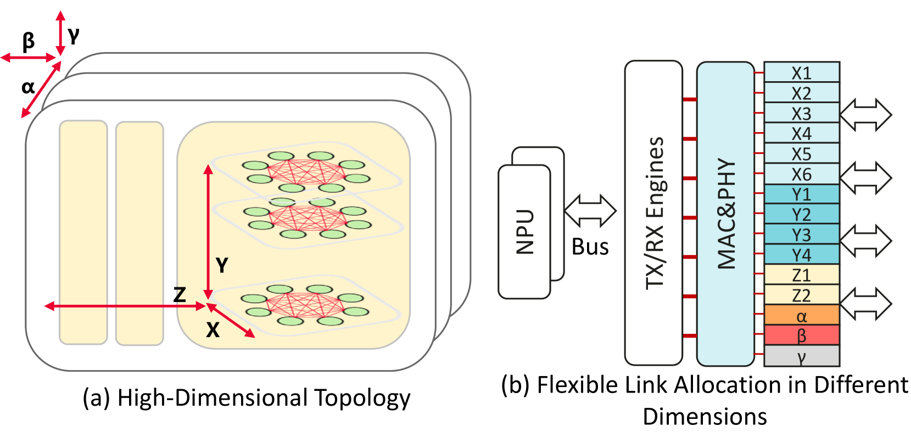

# 基于昇腾AI处理器的亲和性

## 亲和性规则

### Atlas 训练系列产品

Atlas 训练系列产品的昇腾AI处理器是华为研发的一款高性能AI处理器。其内部的处理器之间采用HCCS（例如：A0\~A3为一个HCCS）方式连接。

每台设备具备两个HCCS环共8个昇腾AI处理器（A0\~A7）。每个HCCS存在4个昇腾AI处理器，同一HCCS内AI处理器可做数据交换，不同HCCS内昇腾AI处理器不能通信。同一Pod分配的昇腾AI处理器（若小于或等于4）必须在同一个HCCS环内，否则任务运行失败。Atlas 训练系列产品互联拓扑如[图1](#fig17063331201)所示，其中K0\~K3为鲲鹏处理器。

**图 1** Atlas 训练系列产品互联拓扑  

> [!NOTE] 
>Atlas 800T A2 训练服务器和Atlas 900 A2 PoD 集群基础单元没有昇腾AI处理器的亲和性调度。

### Atlas 200T A2 Box16 异构子框和Atlas 200I A2 Box16 异构子框

Atlas 200T A2 Box16 异构子框和Atlas 200I A2 Box16 异构子框的昇腾AI处理器是华为研发的高性能AI处理器，其内部AI处理器之间采用HCCS互联的方式相连接。每台Atlas 200T A2 Box16 异构子框或Atlas 200I A2 Box16 异构子框具备两个HCCS互联共16个昇腾AI处理器，每个HCCS互联存在8个昇腾AI处理器，同一HCCS互联之间可以做数据交换，不同HCCS互联之间不能通信。即任务分配的昇腾AI处理器（若小于或等于8）必须在同一个HCCS互联内，否则任务运行失败。Atlas 200T A2 Box16 异构子框和Atlas 200I A2 Box16 异构子框的互联拓扑图如[图1](#fig1920102817143)所示。

**图 1** Atlas 200T A2 Box16 异构子框和Atlas 200I A2 Box16 异构子框互联拓扑  

### Atlas 900 A3 SuperPoD 超节点

Atlas 900 A3 SuperPoD 超节点是华为研发的高性能AI计算集群，由多个计算节点组成。每个计算节点上，2个昇腾AI处理器之间通过SIO互联形成一个HiAM模组，例如0号和1号昇腾AI处理器形成一个HiAM模组；每个计算节点包含8个HiAM模组。HiAM模组之间采用HCCS-L1互联的方式连接；计算节点之间采用HCCS-L2互联的方式连接。通过L1端口级联和L2交换互联可以扩展多种规格的超节点。

任务可申请昇腾AI处理器的数量为1、2、4、6、8、10、12、14、16，申请的昇腾AI处理器需要优先占满整个计算节点；申请的昇腾AI处理器个数为偶数时，需要占满整个HiAM模组。例如任务申请的昇腾AI处理器数量为2，计算节点剩余的昇腾AI处理器序号为0、2、3和4时，由于只有2号和3号处于一个HiAM模组中，则该任务只能使用2号和3号昇腾AI处理器。分布式任务可申请的昇腾AI处理器的数量为2、4、6、8、10、12、14、16，若为逻辑超节点亲和任务，即任务YAML中的sp-block字段配置了逻辑超节点大小，则申请的昇腾AI处理器数量只能为16。

**灵衢总线设备节点网络说明**

- 同一逻辑超节点中的计算节点之间使用HCCS网络通信，不同逻辑超节点中的计算节点之间使用RoCE网络通信。当任务的逻辑超节点数量（任务逻辑超节点数量=任务总芯片数量/sp-block）大于1时，请务必确保计算节点间RoCE网络的连通性。
- 譬如计算节点的芯片数量为16，任务的总芯片数量为64，sp-block为32。那么此任务将会被划分为2个逻辑超节点，即Pod（rank=0）和Pod（rank=1）会被划分为1个逻辑超节点。Pod（rank=2）和Pod（rank=3）将会被划分为另一个逻辑超节点。
- 此时Pod（rank=0）和Pod（rank=1）之间使用HCCS网络通信，Pod（rank=2）和Pod（rank=3）之间也使用HCCS网络通信。但是Pod（rank=0/1）和Pod（rank=2/3）之间使用RoCE网络通信。

**图 1**  灵衢总线设备节点网络  

### A200T A3 Box8 超节点服务器、Atlas 800I A3 超节点服务器和Atlas 800T A3 超节点服务器

A200T A3 Box8 超节点服务器、Atlas 800I A3 超节点服务器、Atlas 800T A3 超节点服务器与Atlas 900 A3 SuperPoD 超节点的节点内亲和性基本一致。

A200T A3 Box8 超节点服务器、Atlas 800I A3 超节点服务器和Atlas 800T A3 超节点服务器的昇腾AI处理器是华为研发的高性能AI处理器，其内部每2个昇腾AI处理器之间通过SIO互联形成一个HiAM模组，例如0号和1号昇腾AI处理器形成一个HiAM模组。每个A200T A3 Box8 超节点服务器、Atlas 800I A3 超节点服务器和Atlas 800T A3 超节点服务器包含8个HiAM模组。HiAM模组之间采用HCCS互联的方式连接。

任务可申请昇腾AI处理器的数量为1、2、4、6、8、10、12、14、16，申请的昇腾AI处理器需要优先占满整个节点；申请的昇腾AI处理器个数为偶数时，需要占满整个HiAM模组。例如任务申请的昇腾AI处理器数量为2，节点剩余的昇腾AI处理器序号为0、2、3和4时，由于只有2号和3号处于一个HiAM模组中，则该任务只能使用2号和3号昇腾AI处理器。分布式任务可申请的昇腾AI处理器的数量为2、4、6、8、10、12、14、16。

### Atlas 850 系列硬件产品 超节点服务器

Atlas 850 系列硬件产品 超节点服务器的昇腾AI处理器是华为研发的高性能AI处理器，其内部由2个计算DIE和2个IO DIE合封成一个芯片。每个Atlas 850 系列硬件产品 超节点服务器包含8个昇腾AI处理器。昇腾AI处理器之间采用HCCS互联的方式组成Mesh全连接。服务器之间通过5808交换机连接，每个5808下面最多连接16个Atlas 850 系列硬件产品 超节点服务器，共128个昇腾AI处理器。两层5808交换机组网可支持1K规模超节点，可根据需求灵活定制超节点规模。

单机任务可申请昇腾AI处理器的数量为1、2、4、8，申请的昇腾AI处理器需要优先占满整个节点。而分布式任务只支持满卡调度，即配置为8。调度优先级按照通信效率从高到低排序，即优先调度到节点内，若节点资源不足，则调度到超节点内的昇腾AI处理器。

### Atlas 950 SuperPoD

Atlas 950 SuperPoD的昇腾AI处理器是华为研发的高性能AI处理器，其内部由2个计算DIE和2个IO DIE合封成一个芯片。每个Atlas 950 SuperPoD包含8个昇腾AI处理器。昇腾AI处理器之间采用HCCS互联的方式组成Mesh全连接，构成1D-FullMesh中的X轴。Atlas 950 SuperPoD的机架包含8个OS，机架内Y轴同位置的昇腾AI处理器通过LRS实现跨板互联，8个OS共64个昇腾AI处理器实现2D全互联，构成2D-FullMesh中的Y轴。Atlas 950 SuperPoD的机架之间通过LRS输出UB x128 IO用于Z轴连接，多个机架组成一个物理超节点，形成直接的全互联，构成3D-FullMesh中的Z轴。匹配LLM流量局部性，X-Y-Z轴提供逐级收敛带宽。

**图 1** Atlas 950 SuperPoD互联拓扑  

单机任务可申请昇腾AI处理器的数量为1-8，申请的昇腾AI处理器需要优先占满整个节点。而分布式任务只支持满卡调度，即配置为8。调度优先级按照通信效率从高到低排序，即优先调度到1D-FullMesh中的X轴（节点内），若X轴资源不足，则调度到2D-FullMesh中的Y轴（框内），若Y轴资源不足，则调度到3D-FullMesh中的Z轴（超节点内）。

### 推理服务器（插Atlas 300I 推理卡）

推理服务器（插Atlas 300I 推理卡）存在亲和性调度，如一台Atlas 800 推理服务器（型号 3000）最多支持插8张Atlas 300I 推理卡，每张Atlas 300I 推理卡存在4个昇腾AI处理器。使用推理服务器（插Atlas 300I 推理卡）的用户可以在下发任务YAML时，通过“npu-310-strategy”参数指定调度策略，只有指定按推理卡调度时，才可以实现亲和性调度。

npu-310-strategy参数取值说明如下：

- card：按推理卡调度，request请求的昇腾AI处理器个数不超过4，使用同一张Atlas 300I 推理卡上的昇腾AI处理器。
- chip：按昇腾AI处理器调度，请求的昇腾AI处理器个数不超过单个节点的最大值。

### 推理服务器（插Atlas 300I Duo 推理卡）

推理服务器（插Atlas 300I Duo 推理卡）存在亲和性调度，如一台Atlas 800 推理服务器（型号 3000）最多支持插4张Atlas 300I Duo 推理卡，每张Atlas 300I Duo 推理卡存在2个昇腾AI处理器。使用推理服务器（插Atlas 300I Duo 推理卡）的用户可以在下发任务YAML时，首先通过“duo”参数指定使用Atlas 300I Duo 推理卡，再通过“npu-310-strategy”参数指定调度模式，最后通过“distributed”参数指定调度策略。各参数的详细说明见[表1](#table65039365119)。

**表 1**  参数说明

|参数名|默认值|取值说明|
|--|--|--|
|duo|false|<ul><li>true：使用Atlas 300I Duo 推理卡。</li><li>false：不使用Atlas 300I Duo 推理卡。</li></ul>|
|npu-310-strategy|chip|<ul><li>card：按推理卡调度，request请求的昇腾AI处理器个数不超过2，使用同一张Atlas 300I Duo 推理卡上的昇腾AI处理器。</li><li>chip：按昇腾AI处理器调度，请求的昇腾AI处理器个数不超过单个节点的最大值。</li></ul>|
|distributed|false|<ul><li>true：分布式推理调度策略。使用chip模式时，必须将任务调度到整张Atlas 300I Duo 推理卡。若任务需要的昇腾AI处理器数量为单数时，使用单个昇腾AI处理器的部分，将优先调度到剩余昇腾AI处理器数量为1的Atlas 300I Duo 推理卡。</li><li>false：非分布式推理调度策略。使用chip模式时，请求的昇腾AI处理器个数不超过单个节点的最大值。</li></ul>无论是否为分布式推理，card模式的调度策略不变。|

## 单机场景亲和性策略

### Atlas 训练系列产品

#### 亲和性调度策略

Atlas 训练系列产品的昇腾AI处理器的特征和资源利用的规则如[表1](#table1436611225137)所示。

**表 1** Atlas 训练系列产品的AI处理器亲和性策略

|**优先级**|**策略名称**|**详细内容**|
|--|--|--|
|1|HCCS亲和性调度原则|选择同一HCCS内的昇腾AI处理器，提升通信性能。<ul><li>如果申请昇腾AI处理器个数为1，则选择同一HCCS，且当前可用的昇腾AI处理器数量为1个的节点为最佳，3个次佳、其次是2个、4个。</li><li>如果申请昇腾AI处理器个数为2，则选择同一HCCS，且可用的昇腾AI处理器数量为2个的节点为最佳，4个次佳，其次是3个。</li><li>如果申请昇腾AI处理器个数为4，则选择同一HCCS，且可用的昇腾AI处理器数量为4个的节点。</li><li>如果申请昇腾AI处理器个数为8，则会选择申请节点的8个昇腾AI处理器。</li></ul>|
|2|优先占满调度原则|优先分配已经分配过昇腾AI处理器的节点，减少碎片。<ul><li>如果申请昇腾AI处理器个数为1，优先申请capacity（节点上资源容量）为8，且HCCS可用昇腾AI处理器数量为1的节点为最佳，3个次佳、其次是2个、4个。</li><li>如果申请昇腾AI处理器个数为2，优先申请capacity为8，且HCCS可用昇腾AI处理器数量为2个的节点为最佳，4个次佳，其次是3个。</li><li>如果申请昇腾AI处理器个数为4，优先申请capacity为8，且可用昇腾AI处理器数量为4个的节点。</li><li>如果申请昇腾AI处理器个数为8的正整数倍数，选择申请capacity为8，且已使用0个昇腾AI处理器的节点。</li></ul>
下发分布式任务时，任务存在未按照优先占满调度原则占满某个节点。说明如下：
<ul><li>现象说明：如在两台Atlas 800 训练服务器（型号 9000）集群中，同时下发3卡、4卡、1卡任务，存在3卡和4卡任务调度到同一个节点，1卡任务调度到另一个节点的问题。</li><li>原因分析：因为Volcano调度完一个任务后，Ascend Device Plugin上报调度后的昇腾AI处理器的拓扑结构到mindx-dl-deviceinfo-${node_name}存在时延，导致Volcano校验该节点昇腾AI处理器数量失败，将任务调度到其他节点上。</li></ul>|
|3|剩余偶数优先原则|优先选择满足上述1~2条调度原则的HCCS，其次选择剩余昇腾AI处理器数量为偶数的HCCS。|

#### 资源申请约束

**Atlas 训练系列产品的资源申请约束**

根据业务模型，对训练任务作如下要求：

- 训练任务申请的昇腾AI处理器数量不能大于节点昇腾AI处理器总数。
- 当训练任务申请的昇腾AI处理器数量不大于4个时，需要将所需的昇腾AI处理器调度到同一个HCCS内。
- 当训练任务申请的昇腾AI处理器数量为8个时，需要将节点的昇腾AI处理器全部分配给该任务。
- 当训练任务申请的昇腾AI处理器为虚拟设备vNPU时，申请数量只能为1。
- 遵循Volcano开源部分的其他约束。

**场景说明**

根据亲和性策略和业务模型梳理出的场景如[表1](#table1226225517318)所示。

**表 1** Atlas 训练系列产品亲和性策略场景

|**任务申请数**|**A**|**B**|**C**|**D**|
|--|--|--|--|--|
|1|1~[0,1,2,3,4]|3~[0,2,3,4]|2~[0,2,4]|4~[0,4]|
|2|2~[0,1,2,3,4]|4~[0,1,3,4]|3~[0,1]|-|
|4|4~[0,1,2,3,4]|-|-|-|
|8|8|-|-|-|

- A\~D列4个分组，表示选择处理器，节点上满足昇腾AI处理器选取的四种HCCS场景。在选择昇腾AI处理器时，这四种场景的优先级逐次递减，即当A场景不满足调度要求时，才会选择B，C，D。
- 当组内满足HCCS亲和性时，节点的昇腾AI处理器剩余情况。‘\~’左边为满足要求的HCCS的昇腾AI处理器剩余情况，右边为另一个HCCS的昇腾AI处理器剩余情况。如对于申请1个昇腾AI处理器的A组情况；另一个HCCS可能为0、1、2、3、4等五种昇腾AI处理器剩余情况。
- 任务申请昇腾AI处理器数大于或等于8时，均放在A组，需要全部占用。

### Atlas 200T A2 Box16 异构子框和Atlas 200I A2 Box16 异构子框

#### 亲和性调度策略

Atlas 200T A2 Box16 异构子框和Atlas 200I A2 Box16 异构子框的特征和资源利用的规则如[表1](#table768417221315)所示。

**表 1** Atlas 200T A2 Box16 异构子框和Atlas 200I A2 Box16 异构子框亲和性策略

|优先级|策略名称|策略描述|
|--|--|--|
|1|HCCS互联分配原则|如果申请昇腾AI处理器的个数为1~8，则需要调度到同一个HCCS互联。如果申请昇腾AI处理器的个数为10、12、14，需要将所需的昇腾AI处理器平均分配到两个环，相对的物理地址也一致。|
|2|优先占满原则|优先分配已经分配过昇腾AI处理器的节点，减少碎片。以1、2、4、8为例，具体如下：<ul><li>如果申请1个昇腾AI处理器，优先申请HCCS互联可用昇腾AI处理器数量为1的节点，其次是可用数量为2个，3个，一直到8个。相同数量优先选择节点昇腾AI处理器总数量少的节点。</li><li>如果申请2个昇腾AI处理器，优先申请HCCS互联可用昇腾AI处理器数量为2的节点，其次是可用数量为3个，4个，一直到8个。相同数量优先选择节点昇腾AI处理器总数量少的节点。</li><li>如果申请4个昇腾AI处理器，优先申请HCCS互联可用昇腾AI处理器数量为4的节点，其次是可用数量为5个，6个，一直到8个。相同数量优先选择节点昇腾AI处理器总数量少的节点。</li><li>如果申请8个昇腾AI处理器，只申请HCCS互联可用昇腾AI处理器数量为8的节点。相同数量优先选择节点昇腾AI处理器总数量少的节点。</li></ul>
下发分布式任务时，任务存在未按照优先占满调度原则占满某个节点。说明如下：
<ul><li>现象说明：如在两台Atlas 200T A2 Box16 异构子框或Atlas 200I A2 Box16 异构子框集群中，同时下发5卡、4卡、3卡任务，存在4卡和3卡任务调度到同一个节点，5卡任务调度到另一个节点的问题。</li><li>原因分析：因为Volcano调度完一个任务后，Ascend Device Plugin上报调度后的昇腾AI处理器的拓扑结构到mindx-dl-deviceinfo-${node_name}存在时延，导致Volcano校验该节点昇腾AI处理器数量失败，将任务调度到其他节点上。</li></ul>|

#### 资源申请约束

**Atlas 200T A2 Box16 异构子框和Atlas 200I A2 Box16 异构子框的资源申请约束**

根据业务模型，对Atlas 200T A2 Box16 异构子框和Atlas 200I A2 Box16 异构子框训练任务资源申请作如下要求：

- 训练任务申请的昇腾AI处理器数量不能大于节点昇腾AI处理器总数。
- 训练任务申请的昇腾AI处理器数量为1\~8、10、12、14和16。
- 当训练任务申请的昇腾AI处理器数量不大于8个时，需要选取同一个HCCS互联内的昇腾AI处理器。
- 当训练任务申请的昇腾AI处理器数量为10、12、14时，需要将所需的昇腾AI处理器平均分配到两个环，相对的物理地址也一致。
- 当训练任务申请的昇腾AI处理器数量为16个时，需要将节点的昇腾AI处理器全部分配给该任务。
- 遵循Volcano开源部分的其他约束。

### Atlas 900 A3 SuperPoD 超节点

#### 亲和性调度策略

Atlas 900 A3 SuperPoD 超节点的资源利用规则如[表1](#table42428468401)所示。

**表 1** Atlas 900 A3 SuperPoD 超节点亲和性策略

|优先级|策略名称|策略描述|
|--|--|--|
|1|优先占满节点|节点芯片数量越少，优先级越高。
下发单机任务时，任务存在未按照优先占满调度原则占满某个节点。说明如下：
<ul><li>现象说明：如在Atlas 900 A3 SuperPoD 超节点中，同时下发2卡、14卡任务，存在2卡和14卡任务未调度到同一个节点。</li><li>原因分析：因为Volcano调度完一个任务后，Ascend Device Plugin上报调度后的昇腾AI处理器的拓扑结构到mindx-dl-deviceinfo-${node_name}存在时延，导致Volcano校验该节点昇腾AI处理器数量失败，将任务调度到其他节点上。</li></ul>|
|2|优先剩余保留节点|当超节点保留节点为2，两个超节点中分别剩余3个节点和2个节点时，优先选择剩余3个节点的超节点。|
|3|优先占满超节点|当超节点保留节点为2，两个超节点中分别剩余4个节点和3个节点时，优先选择剩余3个节点的超节点。|

#### 资源申请约束

根据业务模型，对Atlas 900 A3 SuperPoD 超节点训练任务资源申请作如下要求：

- 训练任务申请的昇腾AI处理器数量不能大于节点昇腾AI处理器总数。
- 训练任务申请的昇腾AI处理器数量只能为1、2、4、6、8、10、12、14、16。
- 遵循Volcano开源部分的其他约束。

### Atlas 800I A3 超节点服务器和Atlas 800T A3 超节点服务器

#### 亲和性调度策略

Atlas 800I A3 超节点服务器和Atlas 800T A3 超节点服务器的资源利用规则如[表1](#table424284684011)所示。

**表 1** Atlas 800I A3 超节点服务器和Atlas 800T A3 超节点服务器亲和性策略

|优先级|策略名称|策略描述|
|--|--|--|
|1|优先占满节点|节点芯片数量越少，优先级越高。
下发单机任务时，任务存在未按照优先占满调度原则占满某个节点。说明如下：
<ul><li>现象说明：如在Atlas 800I A3 超节点服务器和Atlas 800T A3 超节点服务器中，同时下发2卡、14卡任务，存在2卡和14卡任务未调度到同一个节点。</li><li>原因分析：因为Volcano调度完一个任务后，Ascend Device Plugin上报调度后的昇腾AI处理器的拓扑结构到mindx-dl-deviceinfo-${node_name}存在时延，导致Volcano校验该节点昇腾AI处理器数量失败，将任务调度到其他节点上。</li></ul>|

#### 资源申请约束

根据业务模型，对Atlas 800I A3 超节点服务器和Atlas 800T A3 超节点服务器训练任务资源申请作如下要求：

- 训练任务申请的昇腾AI处理器数量不能大于节点昇腾AI处理器总数。
- 训练任务申请的昇腾AI处理器数量只能为1、2、4、6、8、10、12、14、16。
- 遵循Volcano开源部分的其他约束。

### A200T A3 Box8 超节点服务器

#### 亲和性调度策略

A200T A3 Box8 超节点服务器的资源利用规则如[表1](#table424284684013)所示。

**表 1** A200T A3 Box8 超节点服务器亲和性策略

|优先级|策略名称|策略描述|
|--|--|--|
|1|优先占满节点|节点芯片数量越少，优先级越高。
下发分布式任务时，任务存在未按照优先占满调度原则占满某个节点。说明如下：
<ul><li>现象说明：如在A200T A3 Box8 超节点服务器中，同时下发2卡、14卡任务，存在2卡和14卡任务未调度到同一个节点。</li><li>原因分析：因为Volcano调度完一个任务后，Ascend Device Plugin上报调度后的昇腾AI处理器的拓扑结构到mindx-dl-deviceinfo-${node_name}存在时延，导致Volcano校验该节点昇腾AI处理器数量失败，将任务调度到其他节点上。</li></ul>|

#### 资源申请约束

根据业务模型，对A200T A3 Box8 超节点服务器训练任务资源申请作如下要求：

- 训练任务申请的昇腾AI处理器数量不能大于节点昇腾AI处理器总数。
- 训练任务申请的昇腾AI处理器数量只能为1、2、4、6、8、10、12、14、16。
- 遵循Volcano开源部分的其他约束。

### 推理服务器（插Atlas 300I 推理卡）

#### 亲和性调度策略

推理服务器（插Atlas 300I 推理卡）的特征和资源利用的规则如[表1](#table768417221315)所示。

**表 1**  推理服务器（插Atlas 300I 推理卡）亲和性策略

|策略名称|策略描述|
|--|--|
|按推理卡亲和性调度原则|优先选择同一张Atlas 300I 推理卡的昇腾AI处理器。
申请昇腾AI处理器个数为1~4，则选择同一张Atlas 300I 推理卡，且当前可用的Atlas 300I 推理卡数量为1个的节点为最佳，3个次佳、其次是2个、4个。
|

#### 资源申请约束

根据业务模型，对推理任务作如下要求：

- 推理任务申请的昇腾AI处理器数量不能大于节点昇腾AI处理器总数。
- 当推理任务申请的昇腾AI处理器数量小于或等于4个时，需要将推理任务调度到同一张Atlas 300I 推理卡内。
- 遵循Volcano开源部分的其他约束。

### 推理服务器（插Atlas 300I Duo 推理卡）

#### 亲和性调度策略

推理服务器（插Atlas 300I Duo 推理卡）的特征和资源利用的规则如下表所示。

**表 1**  推理服务器（插Atlas 300I Duo 推理卡）亲和性策略

|策略名称|策略描述|
|--|--|
|按推理卡亲和性调度原则|优先选择同一张Atlas 300I Duo 推理卡的昇腾AI处理器。
申请昇腾AI处理器个数为1~2，则选择同一张Atlas 300I Duo 推理卡，且当前可用的Atlas 300I Duo 推理卡数量为1个的节点为最佳，其次是2个。
|
|分布式推理按昇腾AI处理器调度|必须将任务调度到整张Atlas 300I Duo 推理卡上。若任务需要的昇腾AI处理器数量为单数时，使用单个昇腾AI处理器的部分，将优先调度到剩余昇腾AI处理器数量为1的Atlas 300I Duo 推理卡上。|

#### 资源申请约束

根据业务模型，对此类推理任务作如下要求：

- 推理任务申请的昇腾AI处理器数量不能大于节点昇腾AI处理器总数。
- 当推理任务申请的昇腾AI处理器数量小于或等于2个时，需要将推理任务调度到同一张Atlas 300I Duo 推理卡内。
- 当使用分布式推理时，任务所有副本只能部署在同一节点内，申请的总昇腾AI处理器数量不能大于节点昇腾AI处理器总数。
- 遵循Volcano开源部分的其他约束。

### Atlas 350 标卡（无互联节点内8卡）

#### 亲和性调度策略

Atlas 350 标卡（无互联节点内8卡）的特征和资源利用的规则如下表所示。

**表 1**  Atlas 350 标卡（无互联节点内8卡）亲和性策略

|优先级|策略名称|策略描述|
|--|--|--|
|1|优先占满节点|节点芯片数量越少，优先级越高。
下发单机任务时，任务存在未按照优先占满调度原则占满某个节点。说明如下：
<ul><li>现象说明：如在Atlas 350 标卡中，同时下发2卡、6卡任务，存在2卡和6卡任务未调度到同一个节点。</li><li>原因分析：因为Volcano调度完一个任务后，Ascend Device Plugin上报调度后的昇腾AI处理器的拓扑结构到mindx-dl-deviceinfo-${node_name}存在时延，导致Volcano校验该节点昇腾AI处理器数量失败，将任务调度到其他节点上。</li></ul>|

#### 资源申请约束

- 标卡内有8个昇腾AI处理器，内部无互联。
- 单机/分布式任务申请的昇腾AI处理器数量支持1-8。
- 当多个任务Pod调度到单个节点时，不支持Pod间的集合通信。

### Atlas 350 标卡（无互联节点内16卡）

#### 亲和性调度策略

Atlas 350 标卡（无互联节点内16卡）的特征和资源利用的规则如下表所示。

**表 1**  Atlas 350 标卡（无互联节点内16卡）亲和性策略

|优先级|策略名称|策略描述|
|--|--|--|
|1|优先占满节点|节点芯片数量越少，优先级越高。
下发单机任务时，任务存在未按照优先占满调度原则占满某个节点。说明如下：
<ul><li>现象说明：如在Atlas 350 标卡中，同时下发2卡、14卡任务，存在2卡和14卡任务未调度到同一个节点。</li><li>原因分析：因为Volcano调度完一个任务后，Ascend Device Plugin上报调度后的昇腾AI处理器的拓扑结构到mindx-dl-deviceinfo-${node_name}存在时延，导致Volcano校验该节点昇腾AI处理器数量失败，将任务调度到其他节点上。</li></ul>|

#### 资源申请约束

- 标卡内有16个昇腾AI处理器，内部无互联。
- 单机/分布式任务申请的昇腾AI处理器数量支持1-16。
- 当多个任务Pod调度到单个节点时，不支持Pod间的集合通信。

### Atlas 350 标卡（4P mesh 8卡）

#### 亲和性调度策略

Atlas 350 标卡（4P mesh 8卡）的特征和资源利用的规则如下表所示。

**表 1**  Atlas 350 标卡（4P mesh 8卡）亲和性策略

|优先级|策略名称|策略描述|
|--|--|--|
|1|优先占满节点|节点芯片数量越少，优先级越高。
下发单机任务时，任务存在未按照优先占满调度原则占满某个节点。说明如下：
<ul><li>现象说明：如在Atlas 350 标卡中，同时下发2卡、6卡任务，存在2卡和6卡任务未调度到同一个节点。</li><li>原因分析：因为Volcano调度完一个任务后，Ascend Device Plugin上报调度后的昇腾AI处理器的拓扑结构到mindx-dl-deviceinfo-${node_name}存在时延，导致Volcano校验该节点昇腾AI处理器数量失败，将任务调度到其他节点上。</li></ul>|

#### 资源申请约束

- 标卡内有8个昇腾AI处理器，内部4个昇腾处理器互联。
- 单机/分布式任务申请的昇腾AI处理器数量支持1、2、3、4、8（满足亲和性），而申请5、6、7时则不保证亲和性。
- 当多个任务Pod调度到单个节点时，不支持Pod间的集合通信。

### Atlas 350 标卡（4P mesh 16卡）

#### 亲和性调度策略

Atlas 350 标卡（4P mesh 16卡）的特征和资源利用的规则如下表所示。

**表 1**  Atlas 350 标卡（4P mesh 16卡）亲和性策略

|优先级|策略名称|策略描述|
|--|--|--|
|1|优先占满节点|节点芯片数量越少，优先级越高。
下发单机任务时，任务存在未按照优先占满调度原则占满某个节点。说明如下：
<ul><li>现象说明：如在Atlas 350 标卡中，同时下发2卡、14卡任务，存在2卡和14卡任务未调度到同一个节点。</li><li>原因分析：因为Volcano调度完一个任务后，Ascend Device Plugin上报调度后的昇腾AI处理器的拓扑结构到mindx-dl-deviceinfo-${node_name}存在时延，导致Volcano校验该节点昇腾AI处理器数量失败，将任务调度到其他节点上。</li></ul>|

#### 资源申请约束

- 标卡内有16个昇腾AI处理器，内部4个昇腾处理器互联。
- 单机/分布式任务申请的昇腾AI处理器数量支持1、2、3、4、8、12、16（满足亲和性），而申请5、6、7、9、10、11、13、14、15时则不保证亲和性。
- 当多个任务Pod调度到单个节点时，不支持Pod间的集合通信。

### Atlas 850 系列硬件产品（普通集群）

#### 亲和性调度策略

Atlas 850 系列硬件产品（普通集群）的特征和资源利用的规则如下表所示。

**表 1**  Atlas 850 系列硬件产品（普通集群）亲和性策略

|优先级|策略名称|策略描述|
|--|--|--|
|1|优先占满节点|节点芯片数量越少，优先级越高。
下发单机任务时，任务存在未按照优先占满调度原则占满某个节点。说明如下：
<ul><li>现象说明：如在Atlas 850 系列硬件产品中，同时下发2卡、6卡任务，存在2卡和6卡任务未调度到同一个节点。</li><li>原因分析：因为Volcano调度完一个任务后，Ascend Device Plugin上报调度后的昇腾AI处理器的拓扑结构到mindx-dl-deviceinfo-${node_name}存在时延，导致Volcano校验该节点昇腾AI处理器数量失败，将任务调度到其他节点上。</li></ul>|

#### 资源申请约束

- 服务器内8个昇腾AI处理器，内部8个昇腾处理器全互联。
- 单机/分布式任务申请的昇腾AI处理器数量支持1、2、4、8（满足亲和性）。
- 当多个任务Pod调度到单个节点时，不支持Pod间的集合通信。

### Atlas 850 系列硬件产品（超节点）

#### 亲和性调度策略

Atlas 850 系列硬件产品（超节点）的特征和资源利用的规则如下表所示。

**表 1**  Atlas 850 系列硬件产品（超节点）亲和性策略

|优先级|策略名称|策略描述|
|--|--|--|
|1|优先占满节点|节点芯片数量越少，优先级越高。
下发单机任务时，任务存在未按照优先占满调度原则占满某个节点。说明如下：
<ul><li>现象说明：如在Atlas 850 系列硬件产品（超节点）中，同时下发2卡、6卡任务，存在2卡和6卡任务未调度到同一个节点。</li><li>原因分析：因为Volcano调度完一个任务后，Ascend Device Plugin上报调度后的昇腾AI处理器的拓扑结构到mindx-dl-deviceinfo-${node_name}存在时延，导致Volcano校验该节点昇腾AI处理器数量失败，将任务调度到其他节点上。</li></ul>|
|2|优先剩余保留节点|当超节点保留节点为2，两个超节点中分别剩余3个节点和2个节点时，优先选择剩余3个节点的超节点。|
|3|优先占满超节点|当超节点保留节点为2，两个超节点中分别剩余4个节点和3个节点时，优先选择剩余3个节点的超节点。|

#### 资源申请约束

- 服务器内8个昇腾AI处理器，内部8个昇腾处理器全互联。
- 单机任务申请的昇腾AI处理器数量支持1、2、4、8（满足亲和性），而分布式任务只支持满卡调度，即配置为8。
- 当多个任务Pod调度到单个节点时，不支持Pod间的集合通信。

### Atlas 950 SuperPoD

#### 亲和性调度策略

Atlas 950 SuperPoD的特征和资源利用的规则如下表所示。

**表 1**  Atlas 950 SuperPoD亲和性策略

|优先级|策略名称|策略描述|
|--|--|--|
|1|优先占满节点|节点芯片数量越少，优先级越高。
下发单机任务时，任务存在未按照优先占满调度原则占满某个节点。说明如下：
<ul><li>现象说明：如在Atlas 950 SuperPoD中，同时下发2卡、6卡任务，存在2卡和6卡任务未调度到同一个节点。</li><li>原因分析：因为Volcano调度完一个任务后，Ascend Device Plugin上报调度后的昇腾AI处理器的拓扑结构到mindx-dl-deviceinfo-${node_name}存在时延，导致Volcano校验该节点昇腾AI处理器数量失败，将任务调度到其他节点上。</li></ul>|
|2|优先剩余保留节点|当超节点保留节点为2，两个超节点中分别剩余3个节点和2个节点时，优先选择剩余3个节点的超节点。|
|3|优先占满超节点|当超节点保留节点为2，两个超节点中分别剩余4个节点和3个节点时，优先选择剩余3个节点的超节点。|

#### 资源申请约束

- OS内8个昇腾AI处理器，内部8个昇腾处理器全互联。
- 单机任务申请的昇腾AI处理器数量支持1-8（满足亲和性），而分布式任务只支持满卡调度，即配置为8。
- 当多个任务Pod调度到单个节点时，不支持Pod间的集合通信。

## 分布式场景亲和性策略

**Atlas 训练系列产品分布式亲和性策略**

分布式训练任务每个节点申请的昇腾AI处理器个数支持1、2、4、8，并且每个任务需要调度到不同节点。

- MindCluster  5.0.RC1版本之前，由于底层的限制，分布式训练任务每个节点申请的昇腾AI处理器个数只支持8个。

- MindCluster  5.0.RC1及其之后版本，分布式训练任务每个节点申请的昇腾AI处理器个数支持1、2、4、8。其中单个节点的亲和性策略请参考[单机场景亲和性策略](#单机场景亲和性策略)。

**Atlas 200T A2 Box16 异构子框和Atlas 200I A2 Box16 异构子框分布式亲和性策略**

- Atlas 200T A2 Box16 异构子框和Atlas 200I A2 Box16 异构子框分布式任务每个节点申请的昇腾AI处理器个数支持1\~8、10、12、14和16个。
- 当训练任务申请的昇腾AI处理器数量不大于8个时，需要选择HCCS互联内的昇腾AI处理器。
- 当训练任务申请的昇腾AI处理器数量为10、12、14时，仅需要将所需的昇腾AI处理器平均分配到两个环，相对的物理地址可以不一致。

**Atlas 900 A3 SuperPoD 超节点分布式亲和性策略**

- 若为逻辑超节点亲和任务，即任务YAML中的sp-block字段配置了逻辑超节点大小，则申请的昇腾AI处理器数量只能为16。
- 若使用非16张卡的分布式调度，将任务YAML中的huawei.com/schedule\_policy字段配置为chip2-node16后，其亲和性策略与Atlas 800T A3 超节点服务器相同。当多个任务Pod调度到单个节点上时，不支持Pod间的集合通信。

**A200T A3 Box8 超节点服务器、Atlas 800I A3 超节点服务器和Atlas 800T A3 超节点服务器分布式亲和性策略**

任务申请的昇腾AI处理器数量支持2、4、6、8、10、12、14、16。当多个任务Pod调度到单个节点上时，不支持Pod间的集合通信。

**推理服务器（插Atlas 300I 推理卡）分布式亲和性策略**

- 推理任务申请的昇腾AI处理器数量不能大于节点的昇腾AI处理器总数。
- 当推理任务申请的昇腾AI处理器数量小于或等于4个时，需要将推理任务调度到同一张Atlas 300I 推理卡内。

**推理服务器（插Atlas 300I Duo 推理卡）分布式亲和性策略**

- 推理任务申请的昇腾AI处理器数量不能大于节点的昇腾AI处理器总数。
- 当推理任务申请的昇腾AI处理器数量小于或等于2个时，需要将推理任务调度到同一张Atlas 300I Duo 推理卡内。

**Atlas 850 系列硬件产品（普通集群）分布式亲和性策略**

- 任务申请的昇腾AI处理器数量不能大于节点的昇腾AI处理器总数。
- 当任务申请的昇腾AI处理器数量小于或等于8个时，需要将任务调度到同一个Atlas 850 系列硬件产品内。

**Atlas 850 系列硬件产品（超节点）分布式亲和性策略**

- Atlas 850 系列硬件产品（超节点）分布式任务每个节点申请的昇腾AI处理器个数固定为8个，服务器内8卡为FullMesh全互联。
- 若为逻辑超节点亲和任务，即任务YAML中的sp-block字段配置了逻辑超节点大小，则申请的昇腾AI处理器数量只能为sp-block的倍数。

**Atlas 950 SuperPoD分布式亲和性策略**

- Atlas 950 SuperPoD分布式任务每个节点申请的昇腾AI处理器个数固定为8个，OS内8卡为FullMesh全互联。
- 若为逻辑超节点亲和任务，即任务YAML中的sp-block字段配置了逻辑超节点大小，则申请的昇腾AI处理器数量只能为sp-block的倍数。
- 若为框亲和任务，即任务YAML中的ra-block字段配置了逻辑框大小，则申请的昇腾AI处理器数量需为ra-block和sp-block的公倍数。
