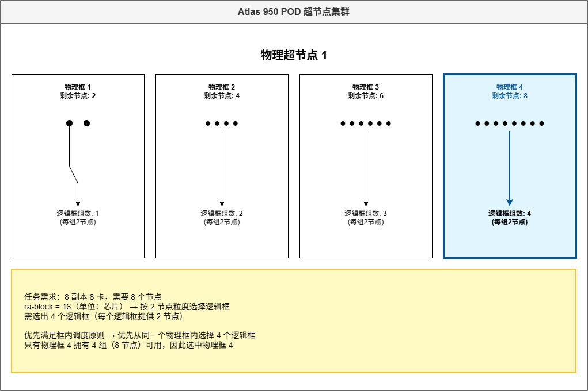

# 昇腾AI处理器的调度算法说明

## 流程介绍

调度器的调度流程主要包括任务校验、节点预选、节点优选、昇腾AI处理器选择、提交分配结果。Volcano的亲和性调度代码实现请参考[ascend-for-volcano](https://gitcode.com/Ascend/mind-cluster/tree/master/component/ascend-for-volcano)开源代码仓，用户可参考代码在其调度器中集成亲和性调度策略。下文以Atlas 训练系列产品的昇腾AI处理器为例，介绍Volcano的调度流程。

**图 1** Volcano调度流程  

**流程说明**

1. 任务校验：校验单机、分布式任务请求的昇腾AI处理器数目。
2. 节点预选：判断节点NPU数量是否满足任务。
3. 节点优选：根据亲和性策略对预选后的节点进行打分。
4. 昇腾AI处理器选择：在最优的节点选取昇腾AI处理器。
5. 提交分配结果：Volcano框架将分配结果提交给Kubernetes。

## 任务校验

**任务说明**

对任务所需昇腾AI处理器数量进行判断；Atlas 训练系列产品要求的昇腾AI处理器数量只能是1、2、4、8。

**具体实现**

具体代码实现请参考开源代码中[ValidNPUJob](https://gitcode.com/Ascend/mind-cluster/blob/branch_v26.0.0/component/ascend-for-volcano/internal/npu/base/frame.go)方法。ValidNPUJob用于校验用户下发配置的合理性，此时不会校验集群环境上的真实资源是否充足，而是单纯校验任务的关键字段是否完整，字段的值域是否正确，字段之间是否匹配。

## 节点预选

**任务说明**

根据任务所需昇腾AI处理器数量和节点可用昇腾AI处理器数量，判断节点是否满足任务需求。Atlas 训练系列产品要求任务所需昇腾AI处理器为1、2、4时，只能在一个HCCL环内进行选择。

例如某个任务需要4个昇腾AI处理器，某个节点具有4个昇腾AI处理器，但这4个并未在同一个HCCL环内，而是两环各两个，则不选择该节点分配任务。

**具体实现**

具体代码实现请参考开源代码中[CheckNodeNPUByTask](https://gitcode.com/Ascend/mind-cluster/blob/branch_v26.0.0/component/ascend-for-volcano/internal/npu/ascend910/ascend910old/module910x8/frame.go)方法。其中通过GetTaskReqNPUNum方法获取到训练任务请求的昇腾AI处理器数量，再通过GetUsableTopFromNode方法获取到节点可用NPU资源。JudgeNodeAndTaskNPU方法实现了判断节点NPU资源是否满足任务需求的功能。

## 节点优选

**任务说明**

根据亲和性策略，对通过节点预选的所有节点打分，并由调度器选择最终的节点。

例如Pod任务需要1个昇腾AI处理器，现在有满足任务的两个节点A和B，其中节点A的某一个HCCL环剩余1个昇腾AI处理器，节点B两个环分别剩余2个和3个昇腾AI处理器，根据亲和性策略，节点A会获得更高的分数。

**具体实现**

具体代码实现请参考开源代码中[ScoreBestNPUNodes](https://gitcode.com/Ascend/mind-cluster/blob/branch_v26.0.0/component/ascend-for-volcano/internal/npu/ascend910/ascend910old/module910x8/frame.go)方法，其中getNodeBestScore方法实现了根据亲和性确定节点优先级。在选择节点时，优先检测是否配置了交换机亲和性调度和逻辑超节点亲和性调度。既没有配置交换机亲和性调度，又没有逻辑超节点亲和性调度，则使用普通节点优选原则。

**普通节点优选原则**

使用二维数组表示节点对任务的契合度，如affScoreList\[i\]\[j\]，i表示任务的1个Pod所需的芯片数量减1，j表示节点当前可用的芯片数量减1，affScoreList\[i\]\[j\]取值表示该节点的不契合程度。

例如任务的1个Pod所需的芯片数量为6，此时可用芯片数为1\~5的节点为完全不满足调度需求的节点，因此不契合程度就设置成最高的8。可用芯片数为6的节点刚好满足调度需求，且不会产生资源碎片，不契合程度就设置成最低的0。对于可用芯片数为7、8的节点，考虑到尽量减少资源碎片，因此它们的不契合程度分别为1，2。因此可推出：

affScoreList\[5\] = \[\]int\{8,8,8,8,8,0,1,2\}

同理可得

affScoreList\[3\] = \[\]int\{8,8,8,0,1,2,3,4\}

部分产品的总芯片数量不一致，或者存在HCCS环等情况，该二维数组存在微调，但是总体逻辑都一致。

**交换机亲和性调度节点优化原则**

集群调度组件通过basic-tor配置文件，获取整个集群的节点与交换机的对应关系；通过Ascend Device Plugin组件上报的芯片使用信息，获取所有的Spine网络空闲交换机下的节点资源。Spine网络空闲交换机，即交换机下没有任务，或者只有不使用Spine网络的填充任务的交换机。

将空闲交换机资源分成两个二维数组，一个按照Leaf交换机下连接的节点横向划分；一个按照节点在Leaf交换机所处的相对位置竖向划分（不同Leaf交换机下不同位置的节点可以组成一个网络亲和的逻辑交换机）。两个二维数组都按照剩余节点从大到小的顺序排序。划分二维数组的方式说明如下：

- 划分方式1：按照Leaf交换机下的节点划分，如\[node1,node2,node3,node4\]一组。
- 划分方式2：按照Leaf交换机下的相对位置划分，如\[node1,node5,node9,node13,node17,node21\]一组。

**图 1**  划分二维数组  

**表 1**  节点优选原则

|任务类型|任务说明|节点优化原则|
|--|--|--|
|填充任务|该任务只能下发在一个交换机下|从二维数组的末尾开始选取第一个满足任务部署的交换机，如果遍历完二维数组还不存在满足条件的，则任务等待。|
|大模型任务|该任务可以跨多个交换机，且一定满足交换机亲和性|从二维数组的开头选取完整的交换机资源，如果资源足够，则调度成功；如果资源不足。分为以下两种情况。<ul><li>使用交换机亲和性1.0，则将剩下的交换机资源，按照Leaf交换机下的相对位置划分成二维数组，每个数组轮番选中一个，直到资源满足或者某一个数组中的数据已经被取完。</li><li>若是交换机亲和性2.0，则每个数组轮番选中一个，直到资源满足或者所有数组中的数据都被选取完。若资源仍然不足，还可以选Spine网络非空闲的交换机下的节点，且一个任务最多包含两个Spine网络非空闲的交换机。</li></ul>|
|普通任务|该任务尽量满足交换机亲和性，资源不足时，允许随机调度该任务|普通任务前部分的调度逻辑与大模型任务一致，只是在最终逻辑交换机资源仍然不足时，允许随机使用剩余节点。|

**逻辑超节点亲和性调度**

1. 根据任务的逻辑超节点大小，将剩余超节点分成3个队列。队列1是大于或等于逻辑超节点+备用节点数的超节点；队列2是大于或等于逻辑超节点大小，小于逻辑超节点+备用节点数大小的超节点；队列3是小于逻辑超节点数大小的节点。
2. 优先使用队列1的数据，将队列1拆分成一个三维数组。以逻辑超节点大小为16，所需逻辑超节点个数为2，预留节点数为2为例。首先按照超节点可用节点数，将其放入一个二维数组中，每个二维数组中，放置的是相同节点数的多个超节点，因此整体是一个三维数组。此时超节点选取的先后顺序如[图2](#fig0751121511273)所示，即优先使用可用节点数为18的超节点，不满足的话，就按照超节点可用节点18、26、19、27，一直到33的顺序，查找可用超节点。如果还找不到，后续需要按照超节点可用节点数34、35、36、37.....46、47、48的顺序优选超节点。

    **图 2**  超节点优选顺序  
    

3. 若资源仍然不足，则使用队列2的资源，队列2按照剩余节点数从大到小排序，超节点选择从第一个数据开始往后选择。
4. 若资源仍然不足，并且任务配置的超节点亲和性调度策略为Soft非强制亲和性，则使用队列3资源，队列3按照剩余节点从大到小排序，超节点选择从第一个数据开始往后选择。

**逻辑框亲和性调度**

1. 根据任务的逻辑框大小，将任务所需节点数转化为所需逻辑框的数量，以逻辑框大小为16，任务所需芯片总数64为例，则逻辑框数量X=4。
2. 框亲和性调度是将任务所需的X个逻辑框优先调度一个物理框内，以当前超节点中物理框分别剩余可用节点为2、4、6、8为例，任务会被优先调度到剩余可用节点为8的物理框中。

    **图 2**  逻辑框优选顺序  
    

3. 若超节点中只存在剩余可用节点为2、4、6的物理框，则按照最小碎片化原则，依次选择剩余节点为2的物理框，剩余节点为4的物理框，剩余节点为6的物理框。
4. 若超节点中只存在剩余可用节点为2、4的物理框，且开启了Soft软亲和策略，则会从其他超节点中进行选择，选择策略为按照剩余节点数从小到大排序。

## 选取昇腾AI处理器

**任务说明**

Volcano框架根据节点优选得到分数后为Pod任务选择最优的节点，并将其绑定。在该过程中可以注册回调函数，依据亲和性策略，实现昇腾AI处理器选取。

例如Pod任务需要1个昇腾AI处理器，此时节点两个HCCL环分别剩余1个和3个昇腾AI处理器，那么最终会选择剩余1个昇腾AI处理器的环。

**具体实现**

具体代码实现请参考开源代码中[UseAnnotation](https://gitcode.com/Ascend/mind-cluster/blob/branch_v26.0.0/component/ascend-for-volcano/internal/npu/ascend910/ascend910old/module910x8/frame.go)方法，其中SelectNPUFromNode方法实现了根据亲和性从node上选取昇腾AI处理器的功能。
