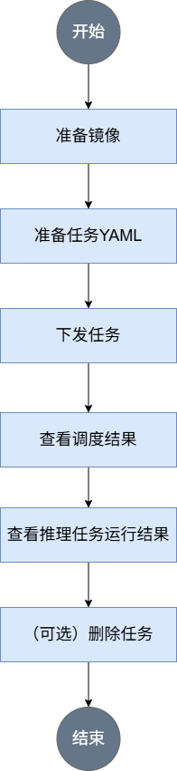

# Infer Operator推理任务最佳实践

## 使用前必读

MindCluster集群调度组件支持用户通过Infer Operator部署推理任务进行调度和故障实例重调度。

本章节仅说明相关特性原理及对应配置示例。用户可以参考配置示例部署Infer Operator推理任务。

**前提条件**

在部署Infer Operator推理任务前，需要确保相关组件已经安装，若没有安装，可以参考[安装部署](../installation_guide.md#安装部署)章节进行操作。

-   Volcano
-   Ascend Device Plugin
-   Ascend Docker Runtime
-   Infer Operator
-   ClusterD
-   NodeD（可选）

**支持的产品形态**

-   Atlas 800I A2 推理服务器
-   Atlas 800I A3 超节点服务器

**使用方式**

MindCluster集群调度组件支持用户通过以下2种方式部署Infer Operator推理任务。

-   基于vLLM Proxy部署Infer Operator推理任务。
-   基于MindIE-PyMotor部署Infer Operator推理任务。

## 基于vLLM Proxy部署Infer Operator推理任务

MindCluster集群调度组件支持用户通过两种方式部署基于vLLM Proxy的Infer Operator推理任务。

-   通过命令行使用：通过配置的YAML文件部署任务。
-   通过MindCluster社区部署工具一键部署使用：通过自动化脚本参考设计部署任务。

### 实现原理

1.  集群调度组件定期上报节点和芯片信息；kubelet上报节点芯片数量到节点对象（node）中。
    -   Ascend Device Plugin上报芯片内存和拓扑信息。

        对于包含片上内存的芯片，Ascend Device Plugin启动时上报芯片内存情况，见node-label说明；上报整卡信息，将芯片的物理ID上报到device-info-cm中；可调度的芯片总数量（allocatable）、已使用的芯片数量（allocated）和芯片的基础信息（device ip和super\_device\_ip）上报到node中，用于整卡调度。

    -   当节点上存在故障时，NodeD定期上报节点健康状态、节点硬件故障信息、节点DPC共享存储故障信息到node-info-cm中。

2.  ClusterD读取device-info-cm和node-info-cm中的信息后，将信息整合到cluster-info-cm中。
3.  用户通过kubectl或者其他深度学习平台下发Infer Operator组件的InferServiceSet推理任务，Infer Operator根据推理任务的配置生成Deployment、Statefulset等子工作负载，再由对应的子工作负载生成多个推理服务的任务Pod。
4.  Infer Operator根据推理任务的配置为任务创建相应的PodGroup。关于PodGroup的详细说明，可以参见[开源Volcano官方文档](https://volcano.sh/zh/docs/v1-9-0/podgroup/)。
5.  volcano-scheduler根据节点内存、CPU及标签、亲和性为Pod选择合适的节点，并在Pod的annotation上写入选择的芯片信息以及节点硬件信息。
6.  kubelet创建容器时，调用Ascend Device Plugin挂载芯片，Ascend Device Plugin或volcano-scheduler在Pod的annotation上写入芯片和节点硬件信息。Ascend Docker Runtime协助挂载相应资源。

### 通过命令行使用

#### 流程说明

基于vLLM Proxy的Infer Operator推理任务包含Routing  Pod和推理实例Pod，推理实例Pod可以分为Prefill实例Pod和Decode实例Pod，其中Routing  Pod不需要使用NPU资源，Infer Operator根据不同的推理服务配置方式生成不同的工作负载，用于创建不同的推理实例，并由Router统一对外提供推理服务。


**使用流程**

通过命令行使用MindCluster集群调度组件部署基于vLLM Proxy的Infer Operator推理任务时，使用流程如[图1](#fig38991911205816)所示。

**图 1**  使用流程  


#### 准备任务YAML

用户可根据实际情况完成制作镜像的准备工作，然后选择相应的YAML示例，对示例进行修改。

**前提条件**

已完成镜像的准备工作。vLLM推理镜像可参考[vllm-ascend官方文档](https://vllm-ascend.readthedocs.io/)获取。

**选择YAML示例**

当前，基于vLLM Proxy的Infer Operator推理任务由InferServiceSet自定义CRD部署，Infer Operator的部署请参见[安装部署](../installation_guide.md#infer-operator)。

以下是一个适配示例，用户可根据需求进行修改。

```
apiVersion: mindcluster.huawei.com/v1
kind: InferServiceSet
metadata:
  name: "my-test"
  namespace: default
spec:
  replicas: 1 # 推理服务副本数
  template:
    roles:
    - name: prefill # prefill定义
      replicas: 1   # prefill副本数
      workload:     # prefill中实例的CRD类型信息
        apiVersion: apps/v1
        kind: StatefulSet
      metadata:
        labels: 
          infer.huawei.com/gang-schedule: 'false' # 关闭gang调度，开启时会为每一个workload实例创建PodGroup
      spec:
        replicas: 1 # prefill中workload的pod副本数
        selector:
          matchLabels:
            app: test-prefill
        template:
          metadata:
            labels:
              app: test-prefill
              fault-scheduling: 'grace' # 开启重调度
              fault-retry-times: 10
              ring-controller.atlas: ascend-910b
          spec:
            schedulerName: volcano # 指定调度器为Volcano
            nodeSelector:
              accelerator-type: module-910b-8 # 根据硬件形态设置
            containers:
            - name: prefill
              image: vllm-ascend:xxx
              ...
              resources:
                requests:
                  huawei.com/Ascend910: 8
                limits:
                  huawei.com/Ascend910: 8
    ...
    - name: decode  # decode定义
      replicas: 1   # decode副本数
      workload:     # decode中实例的CRD类型信息
        apiVersion: apps/v1
        kind: StatefulSet
      metadata:
        labels: 
          infer.huawei.com/gang-schedule: 'false' # 关闭gang调度，开启时会为每一个workload实例创建PodGroup
      spec:
        replicas: 1 # decode中workload的pod副本数
        selector:
          matchLabels:
            app: test-decode
        template:
          metadata:
            labels:
              app: test-decode
              fault-scheduling: 'grace' # 开启重调度
              fault-retry-times: 10
              ring-controller.atlas: ascend-910b
          spec:
            schedulerName: volcano # 指定调度器为Volcano
            nodeSelector:
              accelerator-type: module-910b-8 # 根据硬件形态设置
            containers:
            - name: decode
              image: vllm-ascend:xxx
              ...
              resources:
                requests:
                  huawei.com/Ascend910: 8
                limits:
                  huawei.com/Ascend910: 8
    ...
    - name: router  # router定义
      replicas: 1   # router副本数
      services:     # router services定义，此处定义的service在一个角色范围内仅创建一个
      - name: vllm-router-service
        spec:
          ports:    # service的端口定义
          - port: 1026 
            protocol: TCP
            targetPort: 1026
            selector: 
              app: test-router
            type: ClusterIP
      workload:     # router中实例的CRD类型信息
        apiVersion: apps/v1
        kind: Deployment
      spec:
        replicas: 1 # router中workload的pod副本数
        selector:
          matchLabels:
            app: test-router
        template:
          metadata:
            labels:
              app: test-router
          spec:
            schedulerName: volcano # 指定调度器为Volcano
            containers:
            - name: router
              image: xxx:yyy
              ...
```

#### YAML参数说明

下表对InferServiceSet YAML中与MindCluster相关的字段进行说明。

**表 1**  YAML参数说明

<table><thead align="left"><tr><th class="cellrowborder" valign="top" width="27.16%" ><p>参数</p>
</th>
<th class="cellrowborder" valign="top" width="36.28%" ><p >取值</p>
</th>
<th class="cellrowborder" valign="top" width="36.559999999999995%" ><p >说明</p>
</th>
</tr>
</thead>
<tbody>
<tr ><td class="cellrowborder" valign="top" width="27.16%" headers="mcps1.2.4.1.1 "><p >schedulerName</p>
</td>
<td class="cellrowborder" valign="top" width="36.28%" headers="mcps1.2.4.1.2 "><p >取值为<span class="parmvalue" >“volcano”</span>。</p>
</td>
<td class="cellrowborder" valign="top" width="36.559999999999995%" headers="mcps1.2.4.1.3 "><p >配置调度器为<span >Volcano</span>。</p>
</td>
</tr>
<tr ><td class="cellrowborder" valign="top" width="27.16%" headers="mcps1.2.4.1.1 "><p >（可选）host-arch</p>
</td>
<td class="cellrowborder" valign="top" width="36.28%" headers="mcps1.2.4.1.2 "><ul ><li><span >Arm</span>环境：<span >huawei-arm</span></li><li><span >x86_64</span>环境：<span >huawei-x86</span></li></ul>
</td>
<td class="cellrowborder" valign="top" width="36.559999999999995%" headers="mcps1.2.4.1.3 "><p >需要运行训练任务的节点架构，请根据实际修改。</p>
</td>
</tr>
<tr ><td class="cellrowborder" valign="top" width="27.16%" headers="mcps1.2.4.1.1 "><p >pod-rescheduling</p>
</td>
<td class="cellrowborder" valign="top" width="36.28%" headers="mcps1.2.4.1.2 "><ul ><li>on：开启<span >Pod</span>级别重调度。</li><li>其他值或不使用该字段：关闭<span >Pod</span>级别重调度。</li></ul>
</td>
<td class="cellrowborder" valign="top" width="36.559999999999995%" headers="mcps1.2.4.1.3 "><p ><span >Pod</span>级重调度，表示任务发生故障后，不会删除PodGroup内的所有任务<span >Pod</span>，而是将发生故障的<span >Pod</span>进行删除，由控制器重新创建新<span >Pod</span>后进行重调度。</p>
<p>PD实例必须配置此字段，router实例可不配置</p>
</td>
</tr>
<tr ><td class="cellrowborder" valign="top" width="27.16%" headers="mcps1.2.4.1.1 "><p >infer.huawei.com/gang-schedule</p>
</td>
<td class="cellrowborder" valign="top" width="36.28%" headers="mcps1.2.4.1.2 "><ul ><li>true：开启组调度。</li><li>其他值或不使用该字段：关闭组调度。默认关闭。</li></ul>
</td>
<td class="cellrowborder" valign="top" width="36.559999999999995%" headers="mcps1.2.4.1.3 "><p >开启组调度后，Infer Operator将为每个实例（workload）创建对应的PodGroup，确保同一PodGroup内的所有Pod能够同时启动。</p>
</td>
</tr>
<tr ><td class="cellrowborder" valign="top" width="27.16%" headers="mcps1.2.4.1.1 "><p >accelerator-type</p>
</td>
<td class="cellrowborder" valign="top" width="36.28%" headers="mcps1.2.4.1.2 "><ul ><li><span >Atlas 800I A2 推理服务器</span>：module-910b-8</li><li><span >Atlas 800I A3 超节点服务器</span>：module-a3-16</li>
</ul>
</td>
<td class="cellrowborder" valign="top" width="36.559999999999995%" headers="mcps1.2.4.1.3 "><p >根据需要运行训练任务的节点类型，选取不同的值。</p>
</td>
</tr>
<tr ><td class="cellrowborder" valign="top" width="27.16%" headers="mcps1.2.4.1.1 "><p >huawei.com/Ascend910</p>
</td>
<td class="cellrowborder" valign="top" width="36.28%" headers="mcps1.2.4.1.2 "><ul ><li><span >Atlas 800I A2 推理服务器</span>：8</li><li><span >Atlas 800I A3 超节点服务器</span>: 16</li></ul>
</td>
<td class="cellrowborder" valign="top" width="36.559999999999995%" headers="mcps1.2.4.1.3 "><p >请求的NPU数量。当前仅支持整机调度，请根据实际硬件卡数进行修改。</p>
</td>
</tr>
<tr ><td class="cellrowborder" valign="top" width="27.16%" headers="mcps1.2.4.1.1 "><p >env[name==ASCEND_VISIBLE_DEVICES].valueFrom.fieldRef.fieldPath</p>
</td>
<td class="cellrowborder" valign="top" width="36.28%" headers="mcps1.2.4.1.2 "><p >取值为metadata.annotations['huawei.com/Ascend910']，和环境上实际的芯片类型保持一致。</p>
</td>
<td class="cellrowborder" valign="top" width="36.559999999999995%" headers="mcps1.2.4.1.3 "><p ><span >Ascend Docker Runtime</span>会获取该参数值，用于给容器挂载相应类型的NPU。</p>
<p >该参数只支持使用<span >Volcano</span>调度器的整卡调度特性，使用静态vNPU调度和其他调度器的用户需要删除示例YAML中该参数的相关字段。</p>
</td>
</tr>
<tr ><td class="cellrowborder" rowspan="5" valign="top" width="27.16%" headers="mcps1.2.4.1.1 "><p >fault-scheduling</p>
</td>
<td class="cellrowborder" valign="top" width="36.28%" headers="mcps1.2.4.1.2 "><p >grace</p>
</td>
<td class="cellrowborder" valign="top" width="36.559999999999995%" headers="mcps1.2.4.1.3 "><p >配置任务采用优雅删除模式，并在过程中先优雅删除原<span >Pod</span>，15分钟后若还未成功，使用强制删除原<span >Pod</span>。</p>
</td>
</tr>
<tr ><td class="cellrowborder" valign="top" headers="mcps1.2.4.1.1 "><p >force</p>
</td>
<td class="cellrowborder" valign="top" headers="mcps1.2.4.1.2 "><p >配置任务采用强制删除模式，在过程中强制删除原<span >Pod</span>。</p>
</td>
</tr>
<tr ><td class="cellrowborder" valign="top" headers="mcps1.2.4.1.1 "><p >off</p>
</td>
<td class="cellrowborder" rowspan="3" valign="top" headers="mcps1.2.4.1.2 "><p >该推理任务不使用故障重调度特性。</p>
</td>
</tr>
<tr ><td class="cellrowborder" valign="top" headers="mcps1.2.4.1.1 "><p >无（无fault-scheduling字段）</p>
</td>
</tr>
<tr ><td class="cellrowborder" valign="top" headers="mcps1.2.4.1.1 "><p >其他值</p>
</td>
</tr>
<tr ><td class="cellrowborder" rowspan="2" valign="top" width="27.16%" headers="mcps1.2.4.1.1 "><p >fault-retry-times</p>
</td>
<td class="cellrowborder" valign="top" width="36.28%" headers="mcps1.2.4.1.2 "><p >0 &lt; fault-retry-times</p>
</td>
<td class="cellrowborder" valign="top" width="36.559999999999995%" headers="mcps1.2.4.1.3 "><p >处理业务面故障，必须配置业务面无条件重试的次数。</p>
</td>
</tr>
<tr ><td class="cellrowborder" valign="top" headers="mcps1.2.4.1.1 "><p >无（无fault-retry-times）或0</p>
</td>
<td class="cellrowborder" valign="top" headers="mcps1.2.4.1.2 "><p >该任务不使用无条件重试功能，发生业务面故障之后<span >Volcano</span>不会主动删除故障的<span >Pod</span>。</p>
</td>
</tr>
</tbody>
</table>

#### 下发任务
用户可以使用kubectl命令行工具下发InferServiceSet任务

  ```
    kubectl apply -f <job-yaml> # 下发准备好的YAML文件
  ```

#### 查看调度结果
用户可以使用kubectl命令行工具查看任务运行状态:

  ```
    kubectl get pod -n <namespace> # 查看相关推理实例pod是否拉起，namespace为用户定义的命名空间
    kubectl get instanceset -n <namespace> # 查看相关推理角色(prefill实例集、decode实例集等)是否拉起
    kubectl get inferservice -n <namespace> # 查看相关推理服务是否拉起
    kubectl get inferserviceset -n <namespace> # 查看相关推理服务集合是否拉起
  ```

#### 查看推理任务运行结果
用户可以在推理任务运行后，请求推理接口验证运行结果。

  ```
    curl http://<routing-podip>:8080/v1/completions \
    -H "Content-Type: application/json" \
    -d '{
    "model": "<模型名称>",
    "prompt": "Who are you?",
    "max_tokens": 10,
    "temperature": 0
    }'
  ```

>[!NOTE] 说明
><routing-podip\>为Routing Pod的IP地址，可以通过以下命令查找router实例pod的IP。
>```
  >kubectl get pod -n <namespace> -o wide
  >```

若推理任务运行成功，上述指令将返回推理结果。若返回失败，可通过kubectl命令行工具查看业务容器中的运行日志：

  ```
    kubectl logs -n <namespace> <pod-name> # 查看相应实例容器中的推理业务运行日志
  ```

#### 删除任务

用户可以使用kubectl命令行工具删除InferServiceSet任务:

  ```
    kubectl delete -f <job-yaml> # 删除<job-yaml>文件定义的推理任务
  ```

### 通过MindCluster社区部署工具一键部署使用

用户在K8s集群中部署Infer Operator推理任务，手动编写和维护K8s YAML文件效率低下且容易出错。为此，MindCluster社区为用户提供了一个Infer Operator推理任务的一键式部署工具，替代繁琐的手动操作。用户只需提供基本的应用信息（如应用名、镜像版本、副本数等），脚本就能自动生成所有必要的、符合规范的InferServiceSet YAML文件，并直接部署到指定集群，同时，该部署工具提供一种简单的方式（如指定同一个应用名）一键删除所有相关资源。

当前脚本支持P/D分离以及PD混合部署。

**前提条件<a name="section178303526285"></a>**

-   MindCluster相关组件安装完成。
-   环境已安装Python，并可联网下载依赖包。
-   存在KubeConfig文件，可以与K8s集群正常通信。

**操作步骤<a name="section582414444317"></a>**

1.  从mindcluster-deploy仓库获取源码，进入“infer-operator-deploy-tool”目录。

    ```
    git clone https://gitcode.com/Ascend/mindcluster-deploy.git && cd mindcluster-deploy/infer-operator-deploy-tool
    ```

2.  （可选）创建并激活Python虚拟环境。该操作可以使得不同Python项目使用不同版本的库而互不干扰。

    ```
    python -m venv infer-operator-deploy-tool && source infer-operator-deploy-tool/bin/activate
    ```

    根据环境实际情况选择使用Python或Python3。

3.  安装依赖。

    ```
    pip install -r requirements.txt
    ```

4.  （可选）复制启动脚本到主机其他目录或集群其他节点，确保其他节点的启动脚本路径与主机一致。如果用户环境为单机环境，可以跳过该步骤。如果用户环境包含共享存储，也可以将脚本文件复制到共享存储，并将共享存储挂载给推理服务。
    ```
    cp src/start/*  <target_dir>/src/start/
    scp src/start/* <user>@<IP>:<target_dir>/src/start/
    ```

5.  编辑用户配置文件“config/user-config.yaml”。

    1.  打开“config/user-config.yaml”文件。

        ```
        vi config/user-config.yaml
        ```

    2.  按“i”进入编辑模式，按实际情况修改文件中的字段。
    3.  按“Esc”键，输入:wq!，按“Enter”保存并退出编辑。

    >[!NOTE] 说明
    > 用户配置文件中的配置字段说明可参考：[infer-operator-deploy-tool](https://gitcode.com/Ascend/mindcluster-deploy/blob/master/infer-operator-deploy-tool/README.md)

6.  （可选）创建任务名称空间，vllm-test为“config/user-config.yaml”设置的“deploy_config.namespace”。如果“deploy_config.namespace”为“default”或未设置，可以不创建名称空间。

    ```
    kubectl create ns vllm-test
    ```

7. 部署推理任务。在k8s的控制平面或具备k8s权限的节点上执行部署指令：

    ```
    python main.py deploy -c config/user-config.yaml
    ```

   根据环境实际情况使用Python或Python3。参数说明如下：

    -   -c, --config：配置文件路径，选填。默认值为config/user-config.yaml。
    -   -k, --kubeconfig：KubeConfig文件路径，选填。默认值为\~/.kube/config。
    -   --dry-run：试运行（不实际部署，展示生成的YAML），选填。

8. 查看任务运行状态。

   用户可以使用kubectl命令行工具查看任务运行状态:
    ```
    kubectl get pod -n <namespace> # 查看相关推理实例pod是否拉起，namespace为user-config.yaml中配置的namespace，默认为default
    kubectl get instanceset -n <namespace> # 查看相关推理角色(prefill实例集、decode实例集等)是否拉起
    kubectl get inferservice -n <namespace> # 查看相关推理服务是否拉起
    kubectl get inferserviceset -n <namespace> # 查看相关推理服务集合是否拉起
    ```

9. 新建终端窗口，在当前K8s集群的节点中执行以下命令，访问推理服务。若请求成功返回，表示推理服务部署成功。

    ```
    curl http://<routing-podip>:8080/v1/completions \
    -H "Content-Type: application/json" \
    -d '{
    "model": "<模型名称>",
    "prompt": "Who are you?",
    "max_tokens": 10,
    "temperature": 0
    }'
    ```

   >[!NOTE] 说明
   >- <routing-podip\>为Routing Pod的IP地址，可以通过以下命令查找router实例pod的IP。
   >```
    >kubectl get pod -n <namespace> -o wide
    >```
    >- <模型名称>取配置文件中的`engine_common_config.serve_name`字段。

10. （可选）删除推理任务。若用户需要删除任务，可以执行该步骤。

    ```
    python main.py delete -n my-test -ns default
    ```

    参数说明如下：

    -   -n, --app-name：应用名称，必填。应用名取配置文件中的`deploy_config.job_name`字段。
    -   -ns, --namespace：应用命名空间，选填。默认值为"default" 。
    -   -k, --kubeconfig：KubeConfig文件路径，选填。默认值为\~/.kube/config。

## 基于MindIE-PyMotor部署Infer Operator推理任务

MindIE-PyMotor是昇腾自研的推理集群管理框架，MindIE-PyMotor支持生成并部署Infer Operator推理任务。了解基于MindIE-PyMotor下发推理任务的详细部署流程可参见：[CRD 方式部署设计文档](https://gitcode.com/Ascend/MindIE-PyMotor/blob/master/docs/zh/developer_guide/crd_deployment/crd_deployment_design.md)