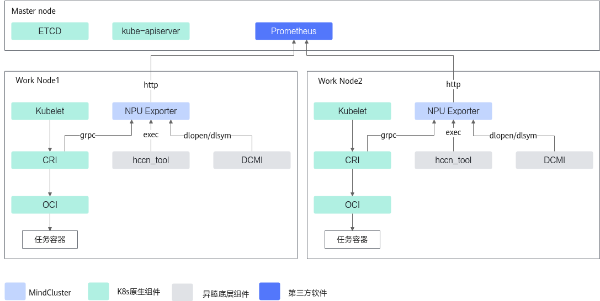
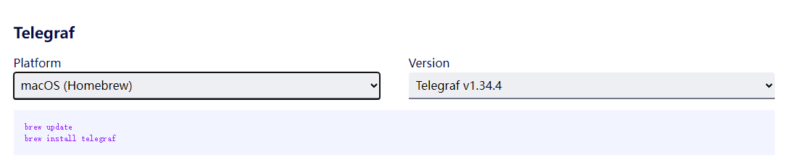

# 资源监测特性指南<a name="ZH-CN_TOPIC_0000002479387040"></a>

## 使用前必读<a name="ZH-CN_TOPIC_0000002479387018"></a>

资源监测主要包含2个方面的实时监测：对虚拟NPU（vNPU）的AI Core利用率、vNPU总内存和vNPU使用中内存进行监测；对训练或者推理任务中NPU资源各种数据信息的实时监测，即实时获取昇腾AI处理器利用率、温度、电压、内存，以及昇腾AI处理器在容器中的分配状况等信息。

资源监测特性是一个基础特性，不区分训练或者推理场景；同时也不区分使用Volcano调度器或者使用其他调度器场景。资源监测特性需要用户配合Prometheus或Telegraf中的一种使用，如果配合Prometheus使用，则需要在部署Prometheus后通过调用NPU Exporter相关接口，实现资源监测，如果配合Telegraf使用，则需要部署和运行Telegraf，实现资源监测。

-   Prometheus是一个开源的完整监测解决方案，具有易管理、高效、可扩展、可视化等特点，搭配NPU Exporter组件使用，可实现对昇腾AI处理器利用率、温度、电压、内存，以及昇腾AI处理器在容器中的分配状况等信息的实时监测。支持对虚拟NPU（vNPU）的AI Core利用率、vNPU总内存和vNPU使用中内存进行监测。
-   Telegraf用于收集系统和服务的统计数据，具有内存占用小和支持其他服务的扩展等功能。搭配NPU Exporter组件使用，可以在环境上通过回显查看上报的昇腾AI处理器的相关信息。

**前提条件<a name="section1632062465010"></a>**

-   在使用资源监测特性前，需要确保NPU Exporter组件已经安装，若没有安装，可以参考[安装部署](../installation_guide.md#安装部署)章节进行操作。
-   NPU Exporter启动前，请确保NPU卡在位。

**使用说明<a name="section44381612353"></a>**

资源监测可以和训练场景下的所有特性一起使用，也可以和推理场景的所有特性一起使用。

**支持的产品形态<a name="section169961844182917"></a>**

支持以下产品使用资源监测。

-   Atlas 训练系列产品
-   Atlas A2 训练系列产品
-   Atlas A3 训练系列产品
-   推理服务器（插Atlas 300I 推理卡）
-   Atlas 推理系列产品
-   Atlas 800I A2 推理服务器
-   A200I A2 Box 异构组件
-   Atlas 800I A3 超节点服务器


## 实现原理<a name="ZH-CN_TOPIC_0000002511346971"></a>

资源监测特性的实现原理如[图1](#fig167794421598)所示。

**图 1**  特性原理<a name="fig167794421598"></a>  


NPU Exporter组件通过gRPC服务调用K8s中的标准化接口CRI，获取容器相关信息；通过exec调用hccn\_tool工具，获取芯片的网络信息；通过dlopen/dlsym调用DCMI接口，获取芯片信息，并上报给Prometheus。

>[!NOTE] 说明 
>使用Telegraf的用户，直接调用NPU Exporter组件，获取相关信息。


## 通过Prometheus使用<a name="ZH-CN_TOPIC_0000002511426931"></a>

本章节指导用户安装部署Prometheus相关软件，并通过Prometheus查看资源监测的相关数据信息，数据信息的相关说明可参见[Prometheus Metrics接口](../api/npu_exporter.md#prometheus-metrics接口)章节。

-   [直接对接Prometheus](#zh-cn_topic_0000001447284876_section875071183215)：NPU Exporter可以直接将NPU设备的数据信息导入到Prometheus中，无需额外的中间件或代理，架构更加简单。
-   [通过Prometheus Operator对接Prometheus](#section1031014512341)：NPU Exporter通过Prometheus Operator插件对接Prometheus，帮助用户快速、简便地实现Prometheus服务的平台化，提高监测系统的可靠性和可维护性。

**直接对接Prometheus<a name="zh-cn_topic_0000001447284876_section875071183215"></a>**

1.  进入[mindcluster-deploy](https://gitcode.com/Ascend/mindxdl-deploy)仓库，根据[mindcluster-deploy开源仓版本说明](../appendix.md#mindcluster-deploy开源仓版本说明)进入版本对应分支，获取“samples/utils/prometheus/base“目录下的prometheus.yaml文件。
2.  <a name="zh-cn_topic_0000001447284876_li127175170321"></a>在管理节点执行以下命令获取镜像。

    ```
    docker pull prom/prometheus:v2.10.0
    ```

    >[!NOTE] 说明 
    >-   获取镜像前，请确保能够正常访问互联网。
    >-   若不使用集群调度提供的prometheus.yaml，需要参考该YAML在相应位置加上app: prometheus字段，否则可能出现NPU Exporter连接超时。

3.  prometheus.yaml已经默认包含获取NPU-Exporter metrics的相关的配置文件，用户可以根据需求自行修改相应的配置。以下从job_name开始之后的内容为获取的NPU-Exporter metrics的相关配置。

    ```
    ...
    apiVersion: v1
    kind: ConfigMap
    metadata:
      name: prometheus-config
      namespace: kube-system
    data:
      prometheus.yml: |
        global:
          scrape_interval:     15s
          evaluation_interval: 15s
        scrape_configs:
    ...
        - job_name: 'kubernetes-npu-exporter'
          kubernetes_sd_configs:
          - role: pod
          scheme: http
          relabel_configs:
          - action: keep
            source_labels: [__meta_kubernetes_namespace]
            regex: npu-exporter
          - source_labels: [__meta_kubernetes_pod_node_name]
            target_label: job
            replacement: ${1}
    ...
    ```

4.  执行以下命令，给管理节点打标签。

    ```
    kubectl label nodes <管理节点Hostname> masterselector=dls-master-node --overwrite=true
    ```

5.  将“prometheus.yaml“上传至[2](#zh-cn_topic_0000001447284876_li127175170321)节点的任意路径下。
6.  在“prometheus.yaml“存放路径，执行以下命令，安装Prometheus服务。

    ```
    kubectl apply -f prometheus.yaml
    ```

    回显如下，表示安装成功。

    ```
    [root@centos check_env]# kubectl apply -f prometheus.yaml 
    clusterrole.rbac.authorization.k8s.io/prometheus created
    serviceaccount/prometheus created
    clusterrolebinding.rbac.authorization.k8s.io/prometheus created
    service/prometheus created
    deployment.apps/prometheus created
    configmap/prometheus-config created
    ```

7.  执行以下命令，查看Prometheus是否启动成功。

    ```
    kubectl get pods --all-namespaces | grep prometheus
    ```

    回显示例如下，出现Running状态表示Prometheus启动成功。

    ```
    kube-system      prometheus-58c69548b4-rhxsc                1/1     Running            0          6d14h
    ```

8.  登录Prometheus服务，查看监测的数据信息。
    1.  打开浏览器。
    2.  在浏览器中输入“http://_管理节点IP地址_:_端口号_”并按“Enter”。

        在prometheus.yaml文件中找到nodePort字段，该字段的值为Prometheus服务的端口号，默认为30003。

    3.  选择NPU的相关标签，查看对应数据信息。

**通过Prometheus Operator对接Prometheus<a name="section1031014512341"></a>**

1.  执行以下命令，获取Prometheus Operator插件源码。

    ```
    git clone https://github.com/prometheus-operator/kube-prometheus.git
    ```

    >[!NOTE] 说明 
    >-   请根据[官方文档](https://github.com/prometheus-operator/kube-prometheus/tree/release-0.7)的兼容性列表，获取与K8s配套的Prometheus Operator源码分支。
    >-   若已经安装Prometheus Operator和Prometheus，可以直接执行[步骤4](#li15822115020428)。

2.  安装Prometheus Operator插件。
    1.  执行以下命令，安装Prometheus Operator。

        ```
        kubectl create -f manifests/setup/
        ```

        回显示例如下，表示Prometheus Operator安装成功。

        ```
        namespace/monitoring created
        ...
        deployment.apps/prometheus-operator created
        service/prometheus-operator created
        serviceaccount/prometheus-operator created
        ```

    2.  执行以下命令，查看Prometheus Operator是否启动成功。

        ```
        kubectl get pod -A -o wide|grep prometheus-operator
        ```

        回显示例如下，出现**Running**表示Prometheus Operator启动成功。

        ```
        monitoring     prometheus-operator-7649c7454f-wp84n       2/2     Running   0          58s   192.168.xx.xx   node133   <none>           <none>
        ```

3.  安装Prometheus。
    1.  <a name="li601241164212"></a>进入[mindcluster-deploy](https://gitcode.com/Ascend/mindxdl-deploy)仓库，根据[mindcluster-deploy开源仓版本说明](../appendix.md#mindcluster-deploy开源仓版本说明)进入版本对应分支，获取“samples/utils/prometheus/base“目录下的prometheus.yaml文件。
    2.  将步骤[1](#li601241164212)中获取到的prometheus.yaml上传至环境任意路径。
    3.  在“prometheus.yaml“存放路径，执行以下命令，安装Prometheus。

        ```
        kubectl apply -f prometheus.yaml
        ```

        回显如下，表示安装成功。

        ```
        service/prometheus created
        prometheus.monitoring.coreos.com/prometheus created
        serviceaccount/prometheus-service-account created
        clusterrole.rbac.authorization.k8s.io/prometheus-cluster-role created
        clusterrolebinding.rbac.authorization.k8s.io/prometheus-cluster-role-binding created
        ```

    4.  执行以下命令，查看Prometheus是否启动成功。

        ```
        kubectl get pods --all-namespaces | grep prometheus
        ```

        回显示例如下：

        ```
        kube-system    prometheus-prometheus-0                    2/2     Running   1          3m47s   192.168.xx.xx   node133   <none>           <none>
        monitoring     prometheus-operator-7649c7454f-wp84n       2/2     Running   0          5m52s   192.168.xx.xx   node133   <none>           <none>
        ```

4.  <a name="li15822115020428"></a>NPU Exporter通过Prometheus Operator对接Prometheus。
    1.  获取[npu-exporter-svc.yaml](https://gitcode.com/Ascend/mindxdl-deploy/blob/branch_v7.2.RC1/samples/utils/prometheus/prometheus_operator/npu-exporter-svc.yaml)和[servicemonitor.yaml](https://gitcode.com/Ascend/mindxdl-deploy/blob/branch_v7.2.RC1/samples/utils/prometheus/prometheus_operator/servicemonitor.yaml)。

        >[!NOTE] 说明 
        >若已经提前安装Prometheus，需要确保servicemonitor.yaml的以下字段，和已经部署的Prometheus中serviceMonitorSelector配置的matchLabels标签一致。
        >```
        >...
        >  labels:                               
        >    serviceMonitorSelector: prometheus
        >...
        >```
        >matchLabels标签可通过执行以下命令进行查询。
        >```
        >kubectl describe pod <pod-name>
        >```

    2.  （可选）可根据实际情况修改NPU Exporter的标签，不修改则直接跳过该步骤。
        1.  在npu-exporter-svc.yaml中，根据实际情况修改标签。

            ```
            apiVersion: v1
            kind: Service
            metadata:
              namespace: npu-exporter   # 命名空间为npu-exporter
              name: npu-exporter             
              labels:                        
                app: npu-exporter-svc   # NPU Exporter service的标签
            spec:
              type: ClusterIP
              ports:
              - port: 8082             # NPU Exporter的服务端口号
                targetPort: 8082      
            ...
            ```

        2.  在servicemonitor.yaml中，根据实际情况修改NPU Exporter的标签，并确保修改内容与npu-exporter-svc.yaml中一致。

            ```
            ...
            spec:
              endpoints:
              - interval: 10s
                targetPort: 8082                                 # NPU Exporter的服务端口号
                path: /metrics
              namespaceSelector:
                matchNames:
                - npu-exporter                                   # 命名空间为npu-exporter
              selector:
                matchLabels:                                     
                  app: npu-exporter-svc                          # NPU Exporter service的标签
            ```

    3.  依次执行以下命令，使用NPU Exporter通过Prometheus Operator对接Prometheus。

        ```
        kubectl apply -f servicemonitor.yaml
        kubectl apply -f npu-exporter-svc.yaml
        ```

    4.  执行以下命令，查看NPU Exporter对接Prometheus Operator是否成功。

        ```
        kubectl get svc -A|grep npu-exporter
        ```

        回显示例如下，表示NPU Exporter对接Prometheus Operator成功。

        ```
        npu-exporter   npu-exporter          ClusterIP   10.98.xx.xx     <none>        8082/TCP                       31s
        ```

    5.  执行以下命令，查看Prometheus Operator对接Prometheus是否成功。

        ```
        kubectl get servicemonitor -A|grep npu-exporter
        ```

        回显示例如下，表示Prometheus Operator对接Prometheus成功。

        ```
        kube-system   npu-exporter   55s
        ```

5.  登录Prometheus服务，查看监测的数据信息。
    1.  打开浏览器。
    2.  在浏览器中输入“http://_管理节点IP地址_:_端口号_”并按“Enter”。

        在prometheus.yaml文件中找到nodePort字段，该字段的值为Prometheus服务的端口号，默认为30003。

    3.  选择NPU的相关标签，查看对应数据信息。


## 通过Telegraf使用<a name="ZH-CN_TOPIC_0000002479227042"></a>

本章节指导用户安装部署Telegraf软件，并通过Telegraf查看资源监测的相关数据信息，数据信息的相关说明可参见[Telegraf数据信息说明](../api/npu_exporter.md#telegraf数据信息说明)章节。

**二进制集成Telegraf<a name="section31082142614"></a>**

>[!NOTE] 说明 
>除了二进制集成外，集群调度支持通过修改NPU Exporter开源代码，集成Telegraf源码。

1.  （可选）如果没有创建NPU Exporter的日志目录，需要依次执行以下命令，创建日志目录。

    ```
    mkdir -m 750 /var/log/mindx-dl/npu-exporter
    chown hwMindX:hwMindX /var/log/mindx-dl/npu-exporter
    ```

2.  从[昇腾社区](https://www.hiascend.com/zh/developer/download/community/result?module=dl+cann)获取NPU Exporter软件包，并从中解压出NPU Exporter二进制文件npu-exporter，并上传至环境任意路径（如“/home/npu\_plugin“）。
3.  执行以下命令，创建npu\_plugin.conf文件。

    ```
    vi npu_plugin.conf
    ```

    在文件中添加NPU Exporter二进制文件路径，示例如下。

    ```
    [[inputs.execd]]
      command = ["/home/npu_plugin/npu-exporter", "-platform=Telegraf", "-poll_interval=10s", "-hccsBWProfilingTime=200"] 
      signal = "none"  
    [[outputs.file]] 
      files=["stdout"]
    ```

    command字段的输入参数说明如[表1](#table5347115241118)所示。

    **表 1**  参数说明

|参数名|类型|默认值|取值说明|是否必选|
|--|--|--|--|--|
|-platform|string|Prometheus|指定对接平台，取值如下：<li>Prometheus：对接Prometheus</li><li>Telegraf：对接Telegraf</li>|是|
|-poll_interval|duration(int)|1s|Telegraf数据上报的间隔时间，此参数在对接Telegraf平台时才起作用，即需要指定-platform=Telegraf时才生效，否则该参数不生效。|否|
|-hccsBWProfilingTime|int|200|HCCS链路带宽采样时长，取值范围[1，1000]，单位为ms。|否|


4.  （可选）如果没有安装Telegraf，需执行以下步骤安装Telegraf。
    -   **离线安装（推荐）**
        1.  进入[Telegraf下载页面](https://github.com/influxdata/telegraf/releases)。
        2.  选择需要安装的版本，完成下载，如：telegraf-1.34.3\_linux\_arm64.tar.gz。
        3.  将上述安装包上传到服务器的任意路径下。
        4.  在软件包所在目录执行如下命令进行解压。示例如下。

            ```
            tar -zxvf telegraf-1.34.3_linux_arm64.tar.gz
            ```

        5.  进入解压目录，在./usr/bin路径下找到Telegraf二进制文件，将该文件拷贝到任意路径下（如“/home/npu\_plugin”）。

    -   **在线安装**
        1.  进入[Telegraf下载页面](https://www.influxdata.com/downloads/)。
        2.  在下拉框选择操作系统及Telegraf版本。

            **图 1**  下载Telegraf<a name="fig131640329479"></a>  
            

        3.  拷贝弹框中的安装命令到待安装设备上，执行命令，完成安装。

5.  执行以下命令，运行Telegraf。
    -   如使用离线安装，请执行以下命令运行Telegraf。

        ```
        ./telegraf --config npu_plugin.conf
        ```

    -   如使用在线安装，请执行以下命令运行Telegraf。

        ```
        telegraf --config npu_plugin.conf
        ```

        Telegraf运行成功后，回显示例如下，从npu_chip_link_speed开始之后的信息即为监测的昇腾AI处理器的数据信息。

        ```
        2023-09-15T10:11:31Z I! Loading config file: ../npu_plugin.conf
        2023-09-15T10:11:31Z I! Starting Telegraf 1.26.0
        2023-09-15T10:11:31Z I! Available plugins: 236 inputs, 9 aggregators, 27 processors, 22 parsers, 57 outputs, 2 secret-stores2023-09-15T10:11:31Z I! Loaded inputs: execd
        2023-09-15T10:11:31Z I! Loaded aggregators: 
        2023-09-15T10:11:31Z I! Loaded processors: 
        2023-09-15T10:11:31Z I! Loaded secretstores: 
        2023-09-15T10:11:31Z I! Loaded outputs: file
        2023-09-15T10:11:31Z I! Tags enabled: host=xxx
        2023-09-15T10:11:31Z I! [agent] Config: Interval:10s, Quiet:false, Hostname:"xxx", Flush Interval:10s
        2023-09-15T10:11:31Z I! [inputs.execd] Starting process: /xxx/npu-exporter [-platform=Telegraf -poll_interval=1m]
        Ascend910-0,host=xxx npu_chip_link_speed=104857600000i,npu_chip_roce_rx_cnp_pkt_num=0i,npu_chip_roce_unexpected_ack_num=0i,npu_chip_optical_vcc=3245.1,npu_chip_optical_rx_power_1=0.8585,npu_chip_info_hbm_used_memory=0i,npu_chip_mac_rx_pause_num=0i,npu_chip_roce_tx_all_pkt_num=0i,npu_chip_roce_tx_cnp_pkt_num=0i,npu_chip_info_temperature=46,npu_chip_mac_rx_bad_pkt_num=0i,npu_chip_roce_tx_err_pkt_num=0i,npu_chip_optical_rx_power_3=0.8466,npu_chip_optical_rx_power_0=0.7933,npu_chip_info_network_status=0i,npu_chip_mac_rx_pfc_pkt_num=0i,npu_chip_mac_tx_bad_pkt_num=0i,npu_chip_roce_rx_all_pkt_num=0i,npu_chip_mac_rx_bad_oct_num=0i,npu_chip_optical_tx_power_1=0.9162,npu_chip_info_utilization=0,npu_chip_info_power=73.9000015258789,npu_chip_info_link_status=1i,npu_chip_info_bandwidth_rx=0,npu_chip_mac_tx_pfc_pkt_num=0i,npu_chip_roce_rx_err_pkt_num=0i,npu_chip_roce_verification_err_num=0i,npu_chip_optical_state=1i,npu_chip_info_bandwidth_tx=0,npu_chip_mac_tx_bad_oct_num=0i,npu_chip_roce_out_of_order_num=0i,npu_chip_roce_qp_status_err_num=0i,npu_chip_optical_rx_power_2=0.855,npu_chip_optical_tx_power_0=0.9095,npu_chip_info_hbm_utilization=0,npu_chip_link_up_num=2i,npu_chip_info_health_status=1i,npu_chip_mac_tx_pause_num=0i,npu_chip_roce_new_pkt_rty_num=0i,npu_chip_optical_temp=53,npu_chip_optical_tx_power_2=1.0342,npu_chip_optical_tx_power_3=0.9715 1694772754612200641
        ```


