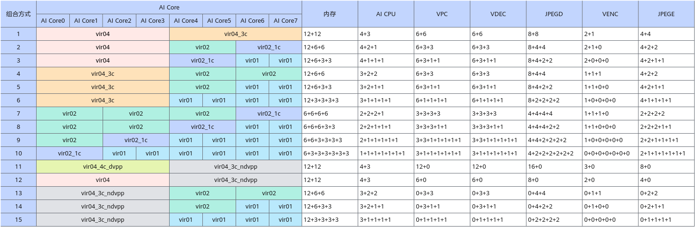
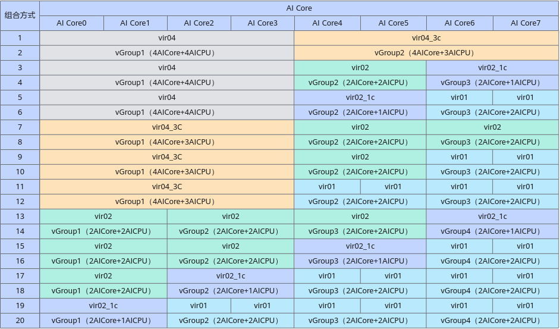
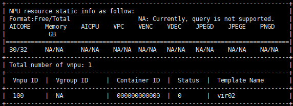

# 虚拟化实例特性指南<a name="ZH-CN_TOPIC_0000002511426957"></a>

## 特性说明<a name="ZH-CN_TOPIC_0000002511426281"></a>

虚拟化实例功能是指通过资源虚拟化的方式将物理机或虚拟机配置的NPU切分成若干份vNPU（虚拟NPU）挂载到容器中使用，虚拟化管理能够实现统一不同规格资源的分配和回收处理，满足多用户反复申请/释放资源的操作请求。

昇腾虚拟化实例功能的优点是可实现多个用户按需申请共同使用一台服务器，降低了用户使用NPU算力的门槛和成本。多个用户共同使用一台服务器的NPU，并借助容器进行资源隔离，资源隔离性好，保证运行环境的平稳和安全，且资源分配，资源回收过程统一，方便多租户管理。

关于虚拟化实例特性的详细介绍请参见[虚拟化实例](../introduction.md#虚拟化实例)章节。

**产品支持说明<a name="section17326115542216"></a>**

**表 1**  产品支持情况说明

<a name="table32786155236"></a>
<table><thead align="left"><tr id="row4278815202313"><th class="cellrowborder" valign="top" width="31.78%" id="mcps1.2.5.1.1"><p id="p22785157230"><a name="p22785157230"></a><a name="p22785157230"></a>产品系列</p>
</th>
<th class="cellrowborder" valign="top" width="33.339999999999996%" id="mcps1.2.5.1.2"><p id="p7669919322"><a name="p7669919322"></a><a name="p7669919322"></a>支持的场景</p>
</th>
<th class="cellrowborder" valign="top" width="21.87%" id="mcps1.2.5.1.3"><p id="p127814159230"><a name="p127814159230"></a><a name="p127814159230"></a>虚拟化方式</p>
</th>
<th class="cellrowborder" valign="top" width="13.01%" id="mcps1.2.5.1.4"><p id="p20791155318232"><a name="p20791155318232"></a><a name="p20791155318232"></a>是否支持</p>
</th>
</tr>
</thead>
<tbody><tr id="row147414361945"><td class="cellrowborder" valign="top" width="31.78%" headers="mcps1.2.5.1.1 "><p id="p1842320153510"><a name="p1842320153510"></a><a name="p1842320153510"></a><span id="ph118421720103512"><a name="ph118421720103512"></a><a name="ph118421720103512"></a>Atlas 推理系列产品</span></p>
<a name="ul3750195712510"></a><a name="ul3750195712510"></a><ul id="ul3750195712510"><li><span id="ph9750185716519"><a name="ph9750185716519"></a><a name="ph9750185716519"></a>Atlas 300I Pro 推理卡</span></li><li><span id="ph17500571858"><a name="ph17500571858"></a><a name="ph17500571858"></a>Atlas 300V 视频解析卡</span></li><li><span id="ph1475016578518"><a name="ph1475016578518"></a><a name="ph1475016578518"></a>Atlas 300V Pro 视频解析卡</span></li><li><span id="ph167502575514"><a name="ph167502575514"></a><a name="ph167502575514"></a>Atlas 300I Duo 推理卡</span></li><li><span id="ph271718714435"><a name="ph271718714435"></a><a name="ph271718714435"></a>Atlas 200I SoC A1 核心板</span></li></ul>
</td>
<td class="cellrowborder" valign="top" width="33.339999999999996%" headers="mcps1.2.5.1.2 "><p id="p11251183411474"><a name="p11251183411474"></a><a name="p11251183411474"></a>在物理机划分vNPU，挂载vNPU到容器</p>
</td>
<td class="cellrowborder" valign="top" width="21.87%" headers="mcps1.2.5.1.3 "><p id="p753561834914"><a name="p753561834914"></a><a name="p753561834914"></a>静态虚拟化</p>
</td>
<td class="cellrowborder" valign="top" width="13.01%" headers="mcps1.2.5.1.4 "><p id="p125113347470"><a name="p125113347470"></a><a name="p125113347470"></a>是</p>
</td>
</tr>
<tr id="row798113134910"><td class="cellrowborder" valign="top" width="31.78%" headers="mcps1.2.5.1.1 "><p id="p52561887496"><a name="p52561887496"></a><a name="p52561887496"></a><span id="ph32565816491"><a name="ph32565816491"></a><a name="ph32565816491"></a>Atlas 推理系列产品</span></p>
<a name="ul12655521159"></a><a name="ul12655521159"></a><ul id="ul12655521159"><li><span id="ph12659521752"><a name="ph12659521752"></a><a name="ph12659521752"></a>Atlas 300I Pro 推理卡</span></li><li><span id="ph1651052155"><a name="ph1651052155"></a><a name="ph1651052155"></a>Atlas 300V 视频解析卡</span></li><li><span id="ph46595214515"><a name="ph46595214515"></a><a name="ph46595214515"></a>Atlas 300V Pro 视频解析卡</span></li><li><span id="ph454745517216"><a name="ph454745517216"></a><a name="ph454745517216"></a>Atlas 200I SoC A1 核心板</span></li></ul>
</td>
<td class="cellrowborder" valign="top" width="33.339999999999996%" headers="mcps1.2.5.1.2 "><p id="p152563874915"><a name="p152563874915"></a><a name="p152563874915"></a>在物理机划分vNPU，挂载vNPU到容器</p>
</td>
<td class="cellrowborder" valign="top" width="21.87%" headers="mcps1.2.5.1.3 "><p id="p22562816494"><a name="p22562816494"></a><a name="p22562816494"></a>动态虚拟化</p>
</td>
<td class="cellrowborder" valign="top" width="13.01%" headers="mcps1.2.5.1.4 "><p id="p125614814491"><a name="p125614814491"></a><a name="p125614814491"></a>是</p>
</td>
</tr>
<tr id="row1327811510231"><td class="cellrowborder" rowspan="3" valign="top" width="31.78%" headers="mcps1.2.5.1.1 "><p id="p1868751772016"><a name="p1868751772016"></a><a name="p1868751772016"></a><span id="ph20484134417286"><a name="ph20484134417286"></a><a name="ph20484134417286"></a>Atlas 推理系列产品</span></p>
<a name="ul937113279519"></a><a name="ul937113279519"></a><ul id="ul937113279519"><li><span id="ph1837112720513"><a name="ph1837112720513"></a><a name="ph1837112720513"></a>Atlas 300I Pro 推理卡</span></li><li><span id="ph13371927759"><a name="ph13371927759"></a><a name="ph13371927759"></a>Atlas 300V 视频解析卡</span></li><li><span id="ph73711027752"><a name="ph73711027752"></a><a name="ph73711027752"></a>Atlas 300V Pro 视频解析卡</span></li><li><span id="ph1037114272517"><a name="ph1037114272517"></a><a name="ph1037114272517"></a>Atlas 300I Duo 推理卡</span></li></ul>
</td>
<td class="cellrowborder" valign="top" width="33.339999999999996%" headers="mcps1.2.5.1.2 "><p id="p85154811485"><a name="p85154811485"></a><a name="p85154811485"></a>在物理机划分vNPU，挂载vNPU到虚拟机</p>
</td>
<td class="cellrowborder" valign="top" width="21.87%" headers="mcps1.2.5.1.3 "><p id="p22781615142312"><a name="p22781615142312"></a><a name="p22781615142312"></a>静态虚拟化</p>
</td>
<td class="cellrowborder" valign="top" width="13.01%" headers="mcps1.2.5.1.4 "><p id="p16791753182316"><a name="p16791753182316"></a><a name="p16791753182316"></a>是</p>
</td>
</tr>
<tr id="row11765455154717"><td class="cellrowborder" valign="top" headers="mcps1.2.5.1.1 "><p id="p1470994219485"><a name="p1470994219485"></a><a name="p1470994219485"></a>在物理机划分vNPU，挂载vNPU到虚拟机，在虚拟机内将vNPU挂载到容器</p>
</td>
<td class="cellrowborder" valign="top" headers="mcps1.2.5.1.2 "><p id="p107651055174716"><a name="p107651055174716"></a><a name="p107651055174716"></a>静态虚拟化</p>
</td>
<td class="cellrowborder" valign="top" headers="mcps1.2.5.1.3 "><p id="p7765955134713"><a name="p7765955134713"></a><a name="p7765955134713"></a>是</p>
</td>
</tr>
<tr id="row250075974919"><td class="cellrowborder" valign="top" headers="mcps1.2.5.1.1 "><p id="p450045915490"><a name="p450045915490"></a><a name="p450045915490"></a>在物理机直通NPU到虚拟机，在虚拟机内划分vNPU，再将vNPU挂载到虚拟机内的容器</p>
</td>
<td class="cellrowborder" valign="top" headers="mcps1.2.5.1.2 "><p id="p1150005964915"><a name="p1150005964915"></a><a name="p1150005964915"></a>静态虚拟化</p>
</td>
<td class="cellrowborder" valign="top" headers="mcps1.2.5.1.3 "><p id="p185001059104912"><a name="p185001059104912"></a><a name="p185001059104912"></a>是</p>
</td>
</tr>
<tr id="row258393195019"><td class="cellrowborder" valign="top" width="31.78%" headers="mcps1.2.5.1.1 "><p id="p8957191110518"><a name="p8957191110518"></a><a name="p8957191110518"></a><span id="ph3957151113515"><a name="ph3957151113515"></a><a name="ph3957151113515"></a>Atlas 推理系列产品</span></p>
<a name="ul12701420650"></a><a name="ul12701420650"></a><ul id="ul12701420650"><li><span id="ph3701162014511"><a name="ph3701162014511"></a><a name="ph3701162014511"></a>Atlas 300I Pro 推理卡</span></li><li><span id="ph197019201513"><a name="ph197019201513"></a><a name="ph197019201513"></a>Atlas 300V 视频解析卡</span></li><li><span id="ph187019209515"><a name="ph187019209515"></a><a name="ph187019209515"></a>Atlas 300V Pro 视频解析卡</span></li></ul>
</td>
<td class="cellrowborder" valign="top" width="33.339999999999996%" headers="mcps1.2.5.1.2 "><p id="p1945835955014"><a name="p1945835955014"></a><a name="p1945835955014"></a>在物理机直通NPU到虚拟机，在虚拟机内划分vNPU，再将vNPU挂载到虚拟机内的容器</p>
</td>
<td class="cellrowborder" valign="top" width="21.87%" headers="mcps1.2.5.1.3 "><p id="p204261621515"><a name="p204261621515"></a><a name="p204261621515"></a>动态虚拟化</p>
</td>
<td class="cellrowborder" valign="top" width="13.01%" headers="mcps1.2.5.1.4 "><p id="p1458343205019"><a name="p1458343205019"></a><a name="p1458343205019"></a>是</p>
</td>
</tr>
<tr id="row0278415202314"><td class="cellrowborder" valign="top" width="31.78%" headers="mcps1.2.5.1.1 "><p id="p6398459171311"><a name="p6398459171311"></a><a name="p6398459171311"></a><span id="ph158146714142"><a name="ph158146714142"></a><a name="ph158146714142"></a>Atlas 800 训练服务器</span></p>
</td>
<td class="cellrowborder" valign="top" width="33.339999999999996%" headers="mcps1.2.5.1.2 "><p id="p10669161183218"><a name="p10669161183218"></a><a name="p10669161183218"></a>在物理机划分vNPU，挂载vNPU到虚拟机</p>
</td>
<td class="cellrowborder" valign="top" width="21.87%" headers="mcps1.2.5.1.3 "><p id="p1252932516357"><a name="p1252932516357"></a><a name="p1252932516357"></a>静态虚拟化</p>
</td>
<td class="cellrowborder" valign="top" width="13.01%" headers="mcps1.2.5.1.4 "><p id="p1679165352319"><a name="p1679165352319"></a><a name="p1679165352319"></a>是</p>
</td>
</tr>
<tr id="row2010035054514"><td class="cellrowborder" valign="top" width="31.78%" headers="mcps1.2.5.1.1 "><p id="p510014508453"><a name="p510014508453"></a><a name="p510014508453"></a><span id="ph327965117217"><a name="ph327965117217"></a><a name="ph327965117217"></a>Atlas 训练系列产品</span></p>
<a name="ul20127114712811"></a><a name="ul20127114712811"></a><ul id="ul20127114712811"><li><span id="ph1412724722816"><a name="ph1412724722816"></a><a name="ph1412724722816"></a>Atlas 300T 训练卡（型号 9000）</span></li><li><span id="ph1012754772811"><a name="ph1012754772811"></a><a name="ph1012754772811"></a>Atlas 300T Pro 训练卡（型号 9000）</span></li><li><span id="ph0127347172818"><a name="ph0127347172818"></a><a name="ph0127347172818"></a>Atlas 800 训练服务器（型号 9000）</span></li><li><span id="ph912713473289"><a name="ph912713473289"></a><a name="ph912713473289"></a>Atlas 800 训练服务器（型号 9010）</span></li><li><span id="ph012784742819"><a name="ph012784742819"></a><a name="ph012784742819"></a>Atlas 900 PoD（型号 9000）</span></li><li><span id="ph1012713477284"><a name="ph1012713477284"></a><a name="ph1012713477284"></a>Atlas 900T PoD Lite</span></li></ul>
</td>
<td class="cellrowborder" valign="top" width="33.339999999999996%" headers="mcps1.2.5.1.2 "><p id="p710095010451"><a name="p710095010451"></a><a name="p710095010451"></a>在物理机划分vNPU，挂载vNPU到容器</p>
</td>
<td class="cellrowborder" valign="top" width="21.87%" headers="mcps1.2.5.1.3 "><p id="p4222125217395"><a name="p4222125217395"></a><a name="p4222125217395"></a>静态虚拟化</p>
</td>
<td class="cellrowborder" valign="top" width="13.01%" headers="mcps1.2.5.1.4 "><p id="p19101175084517"><a name="p19101175084517"></a><a name="p19101175084517"></a>是</p>
</td>
</tr>
<tr id="row32781215162311"><td class="cellrowborder" valign="top" width="31.78%" headers="mcps1.2.5.1.1 "><p id="p162786153239"><a name="p162786153239"></a><a name="p162786153239"></a><span id="ph151431757142112"><a name="ph151431757142112"></a><a name="ph151431757142112"></a><term id="zh-cn_topic_0000001519959665_term57208119917"><a name="zh-cn_topic_0000001519959665_term57208119917"></a><a name="zh-cn_topic_0000001519959665_term57208119917"></a>Atlas A2 训练系列产品</term></span></p>
</td>
<td class="cellrowborder" valign="top" width="33.339999999999996%" headers="mcps1.2.5.1.2 "><p id="p366920193216"><a name="p366920193216"></a><a name="p366920193216"></a>-</p>
</td>
<td class="cellrowborder" valign="top" width="21.87%" headers="mcps1.2.5.1.3 "><p id="p42788151236"><a name="p42788151236"></a><a name="p42788151236"></a>-</p>
</td>
<td class="cellrowborder" valign="top" width="13.01%" headers="mcps1.2.5.1.4 "><p id="p1154214466369"><a name="p1154214466369"></a><a name="p1154214466369"></a>否</p>
</td>
</tr>
<tr id="row11243152011236"><td class="cellrowborder" valign="top" width="31.78%" headers="mcps1.2.5.1.1 "><p id="p18243192015230"><a name="p18243192015230"></a><a name="p18243192015230"></a><span id="ph18411121792018"><a name="ph18411121792018"></a><a name="ph18411121792018"></a><term id="zh-cn_topic_0000001519959665_term26764913715"><a name="zh-cn_topic_0000001519959665_term26764913715"></a><a name="zh-cn_topic_0000001519959665_term26764913715"></a>Atlas A3 训练系列产品</term></span></p>
</td>
<td class="cellrowborder" valign="top" width="33.339999999999996%" headers="mcps1.2.5.1.2 "><p id="p82441020122317"><a name="p82441020122317"></a><a name="p82441020122317"></a>-</p>
</td>
<td class="cellrowborder" valign="top" width="21.87%" headers="mcps1.2.5.1.3 "><p id="p1724417204233"><a name="p1724417204233"></a><a name="p1724417204233"></a>-</p>
</td>
<td class="cellrowborder" valign="top" width="13.01%" headers="mcps1.2.5.1.4 "><p id="p2244122042319"><a name="p2244122042319"></a><a name="p2244122042319"></a>否</p>
</td>
</tr>
<tr id="row18359185713363"><td class="cellrowborder" valign="top" width="31.78%" headers="mcps1.2.5.1.1 "><p id="p18176151918"><a name="p18176151918"></a><a name="p18176151918"></a><span id="ph996833614580"><a name="ph996833614580"></a><a name="ph996833614580"></a><term id="zh-cn_topic_0000001094307702_term99602034117"><a name="zh-cn_topic_0000001094307702_term99602034117"></a><a name="zh-cn_topic_0000001094307702_term99602034117"></a>Atlas A2 推理系列产品</term></span></p>
</td>
<td class="cellrowborder" valign="top" width="33.339999999999996%" headers="mcps1.2.5.1.2 "><p id="p1035910576364"><a name="p1035910576364"></a><a name="p1035910576364"></a>-</p>
</td>
<td class="cellrowborder" valign="top" width="21.87%" headers="mcps1.2.5.1.3 "><p id="p1535975773615"><a name="p1535975773615"></a><a name="p1535975773615"></a>-</p>
</td>
<td class="cellrowborder" valign="top" width="13.01%" headers="mcps1.2.5.1.4 "><p id="p143597578361"><a name="p143597578361"></a><a name="p143597578361"></a>否</p>
</td>
</tr>
<tr id="row188952007382"><td class="cellrowborder" valign="top" width="31.78%" headers="mcps1.2.5.1.1 "><p id="p1746332773811"><a name="p1746332773811"></a><a name="p1746332773811"></a><span id="ph97104582114"><a name="ph97104582114"></a><a name="ph97104582114"></a><term id="zh-cn_topic_0000001519959665_term169221139190"><a name="zh-cn_topic_0000001519959665_term169221139190"></a><a name="zh-cn_topic_0000001519959665_term169221139190"></a>Atlas 200/300/500 推理产品</term></span></p>
</td>
<td class="cellrowborder" valign="top" width="33.339999999999996%" headers="mcps1.2.5.1.2 "><p id="p1089520010381"><a name="p1089520010381"></a><a name="p1089520010381"></a>-</p>
</td>
<td class="cellrowborder" valign="top" width="21.87%" headers="mcps1.2.5.1.3 "><p id="p188951909380"><a name="p188951909380"></a><a name="p188951909380"></a>-</p>
</td>
<td class="cellrowborder" valign="top" width="13.01%" headers="mcps1.2.5.1.4 "><p id="p148955013384"><a name="p148955013384"></a><a name="p148955013384"></a>否</p>
</td>
</tr>
<tr id="row946362719389"><td class="cellrowborder" valign="top" width="31.78%" headers="mcps1.2.5.1.1 "><p id="p17582910104710"><a name="p17582910104710"></a><a name="p17582910104710"></a><span id="ph5263854152111"><a name="ph5263854152111"></a><a name="ph5263854152111"></a><term id="zh-cn_topic_0000001519959665_term7466858493"><a name="zh-cn_topic_0000001519959665_term7466858493"></a><a name="zh-cn_topic_0000001519959665_term7466858493"></a>Atlas 200I/500 A2 推理产品</term></span></p>
</td>
<td class="cellrowborder" valign="top" width="33.339999999999996%" headers="mcps1.2.5.1.2 "><p id="p194639272387"><a name="p194639272387"></a><a name="p194639272387"></a>-</p>
</td>
<td class="cellrowborder" valign="top" width="21.87%" headers="mcps1.2.5.1.3 "><p id="p2463827143819"><a name="p2463827143819"></a><a name="p2463827143819"></a>-</p>
</td>
<td class="cellrowborder" valign="top" width="13.01%" headers="mcps1.2.5.1.4 "><p id="p94636273386"><a name="p94636273386"></a><a name="p94636273386"></a>否</p>
</td>
</tr>
</tbody>
</table>

**使用说明<a name="section1296713336303"></a>**

-   如果使用动态虚拟化功能，请直接参见[动态虚拟化](#动态虚拟化)章节，不需要提前使用npu-smi命令创建vNPU。
-   如果使用静态虚拟化功能，需要先参见[创建vNPU](#创建vnpu)，再进行挂载到容器操作。
-   Atlas 推理系列产品的物理NPU虚拟化出vNPU后，模型在使用vNPU进行推理时可能会出现性能下降。如果出现性能下降的情况，建议使用vir04+vir04\_3c或者vir04+vir02+vir02\_1c的组合（对应的硬件资源可参见[虚拟化规则](#虚拟化规则)章节中的“虚拟化模板”）划分vNPU。
-   用户使用vNPU训练模型时，可以使用AOE调优工具进一步优化模型性能，详情请参见《CANN AOE调优工具用户指南》。

**使用约束<a name="section911013420264"></a>**

-   物理NPU虚拟化出vNPU后，不支持再将该物理NPU挂载到容器使用，也不支持再将该物理NPU直通到虚拟机使用。
-   一个vNPU只能被一个任务容器使用，不支持多个任务容器使用同一个vNPU。
-   Atlas 300I Duo 推理卡上两个芯片的工作模式必须一致。即均使用虚拟化实例功能，或均整卡使用。请根据业务自行规划。
-   虚拟化实例模板是用于对整台服务器上所有NPU进行资源切分，不支持不同规格的标卡混插。如Atlas 300V Pro 视频解析卡支持24G和48G内存规格，不支持这两种内存规格的卡混插进行虚拟化；不支持30个AICore的Atlas 训练系列产品和32个AICore的Atlas 训练系列产品混插。
-   当服务器为Atlas 训练系列产品时，仅NPU芯片工作在AMP模式时支持虚拟化功能，不支持SMP模式。查询和设置NPU芯片工作模式操作步骤如下（确保服务器操作系统处于下电状态）。

    1.  登录iBMC命令行。
    2.  执行**ipmcget -d npuworkmode**命令查询NPU芯片的工作模式，若为AMP模式，则无需切换。
    3.  执行**ipmcset -d npuworkmode -v 0**命令设置NPU芯片的工作模式为AMP模式。

    查询和设置NPU芯片工作模式的详细介绍请参见《[Atlas 800 训练服务器 iBMC用户指南（型号 9000）](https://support.huawei.com/enterprise/zh/doc/EDOC1100136583)》中的“命令行介绍 \> 服务器命令 \>  [查询和设置NPU芯片工作模式（npuworkmode）](https://support.huawei.com/enterprise/zh/doc/EDOC1100136583/b6e6ed5a)”章节。


## 虚拟化规则<a name="ZH-CN_TOPIC_0000002511346345"></a>

**虚拟化模板<a name="zh-cn_topic_0000002038226813_section13183017526"></a>**

当前各处理器及型号包含的硬件资源如[表1](#zh-cn_topic_0000002038226813_table73599224238)所示。

**表 1**  产品规格

<a name="zh-cn_topic_0000002038226813_table73599224238"></a>
<table><thead align="left"><tr id="zh-cn_topic_0000002038226813_row236016224231"><th class="cellrowborder" valign="top" width="19.000000000000007%" id="mcps1.2.11.1.1"><p id="zh-cn_topic_0000002038226813_p19360102282316"><a name="zh-cn_topic_0000002038226813_p19360102282316"></a><a name="zh-cn_topic_0000002038226813_p19360102282316"></a>处理器型号</p>
</th>
<th class="cellrowborder" valign="top" width="9.000000000000002%" id="mcps1.2.11.1.2"><p id="zh-cn_topic_0000002038226813_p5984105517236"><a name="zh-cn_topic_0000002038226813_p5984105517236"></a><a name="zh-cn_topic_0000002038226813_p5984105517236"></a>AI Core核数</p>
</th>
<th class="cellrowborder" valign="top" width="9.000000000000002%" id="mcps1.2.11.1.3"><p id="zh-cn_topic_0000002038226813_p139281363243"><a name="zh-cn_topic_0000002038226813_p139281363243"></a><a name="zh-cn_topic_0000002038226813_p139281363243"></a>内存</p>
</th>
<th class="cellrowborder" valign="top" width="9.000000000000002%" id="mcps1.2.11.1.4"><p id="zh-cn_topic_0000002038226813_p20360102292318"><a name="zh-cn_topic_0000002038226813_p20360102292318"></a><a name="zh-cn_topic_0000002038226813_p20360102292318"></a>AI CPU</p>
</th>
<th class="cellrowborder" valign="top" width="9.000000000000002%" id="mcps1.2.11.1.5"><p id="zh-cn_topic_0000002038226813_p1636032222317"><a name="zh-cn_topic_0000002038226813_p1636032222317"></a><a name="zh-cn_topic_0000002038226813_p1636032222317"></a>VPC总核数</p>
</th>
<th class="cellrowborder" valign="top" width="8.99%" id="mcps1.2.11.1.6"><p id="zh-cn_topic_0000002038226813_p14360142220233"><a name="zh-cn_topic_0000002038226813_p14360142220233"></a><a name="zh-cn_topic_0000002038226813_p14360142220233"></a>VDEC总核数</p>
</th>
<th class="cellrowborder" valign="top" width="9.010000000000002%" id="mcps1.2.11.1.7"><p id="zh-cn_topic_0000002038226813_p103601222132313"><a name="zh-cn_topic_0000002038226813_p103601222132313"></a><a name="zh-cn_topic_0000002038226813_p103601222132313"></a>JPEGD总核数</p>
</th>
<th class="cellrowborder" valign="top" width="9.000000000000002%" id="mcps1.2.11.1.8"><p id="zh-cn_topic_0000002038226813_p12360112214236"><a name="zh-cn_topic_0000002038226813_p12360112214236"></a><a name="zh-cn_topic_0000002038226813_p12360112214236"></a>PNGD总核数</p>
</th>
<th class="cellrowborder" valign="top" width="9.000000000000002%" id="mcps1.2.11.1.9"><p id="zh-cn_topic_0000002038226813_p193601322142310"><a name="zh-cn_topic_0000002038226813_p193601322142310"></a><a name="zh-cn_topic_0000002038226813_p193601322142310"></a>VENC总核数</p>
</th>
<th class="cellrowborder" valign="top" width="9.000000000000002%" id="mcps1.2.11.1.10"><p id="zh-cn_topic_0000002038226813_p20360102217230"><a name="zh-cn_topic_0000002038226813_p20360102217230"></a><a name="zh-cn_topic_0000002038226813_p20360102217230"></a>JPEGE总核数</p>
</th>
</tr>
</thead>
<tbody><tr id="zh-cn_topic_0000002038226813_row362310284565"><td class="cellrowborder" valign="top" width="19.000000000000007%" headers="mcps1.2.11.1.1 "><p id="zh-cn_topic_0000002038226813_p996185211470"><a name="zh-cn_topic_0000002038226813_p996185211470"></a><a name="zh-cn_topic_0000002038226813_p996185211470"></a><span id="zh-cn_topic_0000002038226813_ph19456121122413"><a name="zh-cn_topic_0000002038226813_ph19456121122413"></a><a name="zh-cn_topic_0000002038226813_ph19456121122413"></a>Atlas 训练系列产品</span>（30个AI Core）</p>
</td>
<td class="cellrowborder" valign="top" width="9.000000000000002%" headers="mcps1.2.11.1.2 "><p id="zh-cn_topic_0000002038226813_p39614520478"><a name="zh-cn_topic_0000002038226813_p39614520478"></a><a name="zh-cn_topic_0000002038226813_p39614520478"></a>30</p>
</td>
<td class="cellrowborder" valign="top" width="9.000000000000002%" headers="mcps1.2.11.1.3 "><p id="zh-cn_topic_0000002038226813_p12982141175918"><a name="zh-cn_topic_0000002038226813_p12982141175918"></a><a name="zh-cn_topic_0000002038226813_p12982141175918"></a>32G</p>
</td>
<td class="cellrowborder" valign="top" width="9.000000000000002%" headers="mcps1.2.11.1.4 "><p id="zh-cn_topic_0000002038226813_p159828116596"><a name="zh-cn_topic_0000002038226813_p159828116596"></a><a name="zh-cn_topic_0000002038226813_p159828116596"></a>14</p>
</td>
<td class="cellrowborder" valign="top" width="9.000000000000002%" headers="mcps1.2.11.1.5 "><p id="zh-cn_topic_0000002038226813_p9982111105917"><a name="zh-cn_topic_0000002038226813_p9982111105917"></a><a name="zh-cn_topic_0000002038226813_p9982111105917"></a>16</p>
</td>
<td class="cellrowborder" valign="top" width="8.99%" headers="mcps1.2.11.1.6 "><p id="zh-cn_topic_0000002038226813_p1398291113591"><a name="zh-cn_topic_0000002038226813_p1398291113591"></a><a name="zh-cn_topic_0000002038226813_p1398291113591"></a>16</p>
</td>
<td class="cellrowborder" valign="top" width="9.010000000000002%" headers="mcps1.2.11.1.7 "><p id="zh-cn_topic_0000002038226813_p179831311165916"><a name="zh-cn_topic_0000002038226813_p179831311165916"></a><a name="zh-cn_topic_0000002038226813_p179831311165916"></a>16</p>
</td>
<td class="cellrowborder" valign="top" width="9.000000000000002%" headers="mcps1.2.11.1.8 "><p id="zh-cn_topic_0000002038226813_p0983111135918"><a name="zh-cn_topic_0000002038226813_p0983111135918"></a><a name="zh-cn_topic_0000002038226813_p0983111135918"></a>24</p>
</td>
<td class="cellrowborder" valign="top" width="9.000000000000002%" headers="mcps1.2.11.1.9 "><p id="zh-cn_topic_0000002038226813_p179831011185919"><a name="zh-cn_topic_0000002038226813_p179831011185919"></a><a name="zh-cn_topic_0000002038226813_p179831011185919"></a>NA</p>
</td>
<td class="cellrowborder" valign="top" width="9.000000000000002%" headers="mcps1.2.11.1.10 "><p id="zh-cn_topic_0000002038226813_p12983201195918"><a name="zh-cn_topic_0000002038226813_p12983201195918"></a><a name="zh-cn_topic_0000002038226813_p12983201195918"></a>8</p>
</td>
</tr>
<tr id="zh-cn_topic_0000002038226813_row9360102215232"><td class="cellrowborder" valign="top" width="19.000000000000007%" headers="mcps1.2.11.1.1 "><p id="zh-cn_topic_0000002038226813_p14162191585110"><a name="zh-cn_topic_0000002038226813_p14162191585110"></a><a name="zh-cn_topic_0000002038226813_p14162191585110"></a><span id="zh-cn_topic_0000002038226813_ph327965117217"><a name="zh-cn_topic_0000002038226813_ph327965117217"></a><a name="zh-cn_topic_0000002038226813_ph327965117217"></a>Atlas 训练系列产品</span>（32个AI Core）</p>
</td>
<td class="cellrowborder" valign="top" width="9.000000000000002%" headers="mcps1.2.11.1.2 "><p id="zh-cn_topic_0000002038226813_p23601222142312"><a name="zh-cn_topic_0000002038226813_p23601222142312"></a><a name="zh-cn_topic_0000002038226813_p23601222142312"></a>32</p>
</td>
<td class="cellrowborder" valign="top" width="9.000000000000002%" headers="mcps1.2.11.1.3 "><p id="zh-cn_topic_0000002038226813_p163601922172313"><a name="zh-cn_topic_0000002038226813_p163601922172313"></a><a name="zh-cn_topic_0000002038226813_p163601922172313"></a>32G</p>
</td>
<td class="cellrowborder" valign="top" width="9.000000000000002%" headers="mcps1.2.11.1.4 "><p id="zh-cn_topic_0000002038226813_p17361022142311"><a name="zh-cn_topic_0000002038226813_p17361022142311"></a><a name="zh-cn_topic_0000002038226813_p17361022142311"></a>14</p>
</td>
<td class="cellrowborder" valign="top" width="9.000000000000002%" headers="mcps1.2.11.1.5 "><p id="zh-cn_topic_0000002038226813_p431114795610"><a name="zh-cn_topic_0000002038226813_p431114795610"></a><a name="zh-cn_topic_0000002038226813_p431114795610"></a>16</p>
</td>
<td class="cellrowborder" valign="top" width="8.99%" headers="mcps1.2.11.1.6 "><p id="zh-cn_topic_0000002038226813_p3311154714563"><a name="zh-cn_topic_0000002038226813_p3311154714563"></a><a name="zh-cn_topic_0000002038226813_p3311154714563"></a>16</p>
</td>
<td class="cellrowborder" valign="top" width="9.010000000000002%" headers="mcps1.2.11.1.7 "><p id="zh-cn_topic_0000002038226813_p5311547185615"><a name="zh-cn_topic_0000002038226813_p5311547185615"></a><a name="zh-cn_topic_0000002038226813_p5311547185615"></a>16</p>
</td>
<td class="cellrowborder" valign="top" width="9.000000000000002%" headers="mcps1.2.11.1.8 "><p id="zh-cn_topic_0000002038226813_p1631184785614"><a name="zh-cn_topic_0000002038226813_p1631184785614"></a><a name="zh-cn_topic_0000002038226813_p1631184785614"></a>24</p>
</td>
<td class="cellrowborder" valign="top" width="9.000000000000002%" headers="mcps1.2.11.1.9 "><p id="zh-cn_topic_0000002038226813_p431164710566"><a name="zh-cn_topic_0000002038226813_p431164710566"></a><a name="zh-cn_topic_0000002038226813_p431164710566"></a>NA</p>
</td>
<td class="cellrowborder" valign="top" width="9.000000000000002%" headers="mcps1.2.11.1.10 "><p id="zh-cn_topic_0000002038226813_p93114474569"><a name="zh-cn_topic_0000002038226813_p93114474569"></a><a name="zh-cn_topic_0000002038226813_p93114474569"></a>8</p>
</td>
</tr>
<tr id="zh-cn_topic_0000002038226813_row139061813161319"><td class="cellrowborder" valign="top" width="19.000000000000007%" headers="mcps1.2.11.1.1 "><p id="zh-cn_topic_0000002038226813_p10973233175616"><a name="zh-cn_topic_0000002038226813_p10973233175616"></a><a name="zh-cn_topic_0000002038226813_p10973233175616"></a><span id="zh-cn_topic_0000002038226813_ph1623844892113"><a name="zh-cn_topic_0000002038226813_ph1623844892113"></a><a name="zh-cn_topic_0000002038226813_ph1623844892113"></a>Atlas 推理系列产品</span>（8个AI Core）</p>
</td>
<td class="cellrowborder" valign="top" width="9.000000000000002%" headers="mcps1.2.11.1.2 "><p id="zh-cn_topic_0000002038226813_p897343317566"><a name="zh-cn_topic_0000002038226813_p897343317566"></a><a name="zh-cn_topic_0000002038226813_p897343317566"></a>8</p>
</td>
<td class="cellrowborder" valign="top" width="9.000000000000002%" headers="mcps1.2.11.1.3 "><p id="zh-cn_topic_0000002038226813_p17973163345614"><a name="zh-cn_topic_0000002038226813_p17973163345614"></a><a name="zh-cn_topic_0000002038226813_p17973163345614"></a>24G</p>
</td>
<td class="cellrowborder" valign="top" width="9.000000000000002%" headers="mcps1.2.11.1.4 "><p id="zh-cn_topic_0000002038226813_p189732033175610"><a name="zh-cn_topic_0000002038226813_p189732033175610"></a><a name="zh-cn_topic_0000002038226813_p189732033175610"></a>7</p>
</td>
<td class="cellrowborder" valign="top" width="9.000000000000002%" headers="mcps1.2.11.1.5 "><p id="zh-cn_topic_0000002038226813_p17973123319563"><a name="zh-cn_topic_0000002038226813_p17973123319563"></a><a name="zh-cn_topic_0000002038226813_p17973123319563"></a>12</p>
</td>
<td class="cellrowborder" valign="top" width="8.99%" headers="mcps1.2.11.1.6 "><p id="zh-cn_topic_0000002038226813_p1297319334565"><a name="zh-cn_topic_0000002038226813_p1297319334565"></a><a name="zh-cn_topic_0000002038226813_p1297319334565"></a>12</p>
</td>
<td class="cellrowborder" valign="top" width="9.010000000000002%" headers="mcps1.2.11.1.7 "><p id="zh-cn_topic_0000002038226813_p1597463315567"><a name="zh-cn_topic_0000002038226813_p1597463315567"></a><a name="zh-cn_topic_0000002038226813_p1597463315567"></a>16</p>
</td>
<td class="cellrowborder" valign="top" width="9.000000000000002%" headers="mcps1.2.11.1.8 "><p id="zh-cn_topic_0000002038226813_p99745330561"><a name="zh-cn_topic_0000002038226813_p99745330561"></a><a name="zh-cn_topic_0000002038226813_p99745330561"></a>NA</p>
</td>
<td class="cellrowborder" valign="top" width="9.000000000000002%" headers="mcps1.2.11.1.9 "><p id="zh-cn_topic_0000002038226813_p897483395613"><a name="zh-cn_topic_0000002038226813_p897483395613"></a><a name="zh-cn_topic_0000002038226813_p897483395613"></a>3</p>
</td>
<td class="cellrowborder" valign="top" width="9.000000000000002%" headers="mcps1.2.11.1.10 "><p id="zh-cn_topic_0000002038226813_p49749338561"><a name="zh-cn_topic_0000002038226813_p49749338561"></a><a name="zh-cn_topic_0000002038226813_p49749338561"></a>8</p>
</td>
</tr>
</tbody>
</table>

>[!NOTE] 说明 
>昇腾AI处理器包含AI Core、AI CPU、DVPP、内存等硬件资源，主要用途如下：
>-   AI Core主要用于矩阵乘等计算，适用于卷积模型。
>-   AI CPU主要负责执行CPU类算子（包括控制算子、标量和向量等通用计算）。
>-   虚拟化实例（创建指定芯片的vNPU）会使能SRIOV，将data CPU转化为AI CPU，因此会导致NPU信息中的AI CPU个数发生变化。
>-   DVPP为数字视觉预处理模块，提供对特定格式的视频和图像进行解码、缩放等预处理操作，以及对处理后的视频、图像进行编码再输出的能力，包含VPC、VDEC、JPEGD、PNGD、VENC、JPEGE模块。
>    -   VPC：视觉预处理核心，提供对图像进行缩放、色域转换、降bit数处理、存储格式转换、区块切割转换等能力。
>    -   VDEC：视频解码器，提供对特定格式的视频进行解码的能力。
>    -   JPEGD：JPEG图像解码器，提供对JPEG格式的图像进行解码的能力。
>    -   PNGD：PNG图像解码器，提供对PNG格式的图像进行解码的能力。
>    -   VENC：视频编码器，提供对特定格式的视频进行编码的能力。
>    -   JPEGE：JPEG图像编码器，提供对图像进行编码输出为JPEG格式的能力。

**表 2**  虚拟化实例模板

<a name="zh-cn_topic_0000002038226813_table140421911260"></a>
<table><thead align="left"><tr id="zh-cn_topic_0000002038226813_row44052019192619"><th class="cellrowborder" valign="top" width="20%" id="mcps1.2.4.1.1"><p id="zh-cn_topic_0000002038226813_p0405619192614"><a name="zh-cn_topic_0000002038226813_p0405619192614"></a><a name="zh-cn_topic_0000002038226813_p0405619192614"></a>产品型号</p>
</th>
<th class="cellrowborder" valign="top" width="40%" id="mcps1.2.4.1.2"><p id="zh-cn_topic_0000002038226813_p1405719182610"><a name="zh-cn_topic_0000002038226813_p1405719182610"></a><a name="zh-cn_topic_0000002038226813_p1405719182610"></a>虚拟化实例模板</p>
</th>
<th class="cellrowborder" valign="top" width="40%" id="mcps1.2.4.1.3"><p id="zh-cn_topic_0000002038226813_p656845723818"><a name="zh-cn_topic_0000002038226813_p656845723818"></a><a name="zh-cn_topic_0000002038226813_p656845723818"></a>说明</p>
</th>
</tr>
</thead>
<tbody><tr id="row0927135124115"><td class="cellrowborder" valign="top" width="20%" headers="mcps1.2.4.1.1 "><p id="zh-cn_topic_0000002038226813_p440510194265"><a name="zh-cn_topic_0000002038226813_p440510194265"></a><a name="zh-cn_topic_0000002038226813_p440510194265"></a><span id="zh-cn_topic_0000002038226813_ph082215581414"><a name="zh-cn_topic_0000002038226813_ph082215581414"></a><a name="zh-cn_topic_0000002038226813_ph082215581414"></a>Atlas 训练系列产品</span>（30或32个AI Core）</p>
</td>
<td class="cellrowborder" valign="top" width="40%" headers="mcps1.2.4.1.2 "><p id="zh-cn_topic_0000002038226813_p1911275193112"><a name="zh-cn_topic_0000002038226813_p1911275193112"></a><a name="zh-cn_topic_0000002038226813_p1911275193112"></a>虚拟化实例模板包括：vir02、vir04、vir08、vir16。</p>
</td>
<td class="cellrowborder" valign="top" width="40%" headers="mcps1.2.4.1.3 "><a name="ul1497517366417"></a><a name="ul1497517366417"></a><ul id="ul1497517366417"><li>vir后面的数字表示AI Core数量。</li><li>c前面的数字表示AI CPU数量。</li><li>dvpp表示虚拟化时包含所有数字视觉预处理模块（即VPC，VDEC，JPEGD，PNGD，VENC，JPEGE）。</li><li>ndvpp表示虚拟化时没有数字视觉预处理硬件资源。</li></ul>
</td>
</tr>
<tr id="zh-cn_topic_0000002038226813_row8875174319569"><td class="cellrowborder" valign="top" width="20%" headers="mcps1.2.4.1.1 "><p id="zh-cn_topic_0000002038226813_p16751182616200"><a name="zh-cn_topic_0000002038226813_p16751182616200"></a><a name="zh-cn_topic_0000002038226813_p16751182616200"></a><span id="zh-cn_topic_0000002038226813_ph0201674116"><a name="zh-cn_topic_0000002038226813_ph0201674116"></a><a name="zh-cn_topic_0000002038226813_ph0201674116"></a>Atlas 推理系列产品</span>（8个AI Core）</p>
</td>
<td class="cellrowborder" valign="top" width="40%" headers="mcps1.2.4.1.2 "><p id="zh-cn_topic_0000002038226813_p38351631163114"><a name="zh-cn_topic_0000002038226813_p38351631163114"></a><a name="zh-cn_topic_0000002038226813_p38351631163114"></a>虚拟化实例模板包括：vir01、vir02、vir04、vir02_1c、vir04_3c、vir04_3c_ndvpp、vir04_4c_dvpp。</p>
</td>
<td class="cellrowborder" valign="top" width="40%" headers="mcps1.2.4.1.3 "><a name="zh-cn_topic_0000002038226813_ul13761191443910"></a><a name="zh-cn_topic_0000002038226813_ul13761191443910"></a><ul id="zh-cn_topic_0000002038226813_ul13761191443910"><li>vir后面的数字表示AI Core数量。</li><li>c前面的数字表示AI CPU数量。</li><li>dvpp表示虚拟化时包含所有数字视觉预处理模块（即VPC，VDEC，JPEGD，PNGD，VENC，JPEGE）。</li><li>ndvpp表示虚拟化时没有数字视觉预处理硬件资源。</li></ul>
</td>
</tr>
</tbody>
</table>

**表 3**  各虚拟化实例模板对应的资源信息

<a name="zh-cn_topic_0000002038226813_table11718174116410"></a>
<table><thead align="left"><tr id="zh-cn_topic_0000002038226813_row109681741134118"><th class="cellrowborder" valign="top" width="11.000000000000004%" id="mcps1.2.12.1.1"><p id="zh-cn_topic_0000002038226813_p19968104144113"><a name="zh-cn_topic_0000002038226813_p19968104144113"></a><a name="zh-cn_topic_0000002038226813_p19968104144113"></a>处理器型号</p>
</th>
<th class="cellrowborder" valign="top" width="11.000000000000004%" id="mcps1.2.12.1.2"><p id="zh-cn_topic_0000002038226813_p59688417412"><a name="zh-cn_topic_0000002038226813_p59688417412"></a><a name="zh-cn_topic_0000002038226813_p59688417412"></a>虚拟化实例模板</p>
</th>
<th class="cellrowborder" valign="top" width="11.000000000000004%" id="mcps1.2.12.1.3"><p id="zh-cn_topic_0000002038226813_p1796915413419"><a name="zh-cn_topic_0000002038226813_p1796915413419"></a><a name="zh-cn_topic_0000002038226813_p1796915413419"></a>AI Core核数</p>
</th>
<th class="cellrowborder" valign="top" width="11.000000000000004%" id="mcps1.2.12.1.4"><p id="zh-cn_topic_0000002038226813_p13969114164117"><a name="zh-cn_topic_0000002038226813_p13969114164117"></a><a name="zh-cn_topic_0000002038226813_p13969114164117"></a>内存</p>
</th>
<th class="cellrowborder" valign="top" width="8.000000000000002%" id="mcps1.2.12.1.5"><p id="zh-cn_topic_0000002038226813_p23332558528"><a name="zh-cn_topic_0000002038226813_p23332558528"></a><a name="zh-cn_topic_0000002038226813_p23332558528"></a>AI CPU</p>
</th>
<th class="cellrowborder" valign="top" width="7.990000000000001%" id="mcps1.2.12.1.6"><p id="zh-cn_topic_0000002038226813_p156933713614"><a name="zh-cn_topic_0000002038226813_p156933713614"></a><a name="zh-cn_topic_0000002038226813_p156933713614"></a>VPC</p>
</th>
<th class="cellrowborder" valign="top" width="8.010000000000002%" id="mcps1.2.12.1.7"><p id="zh-cn_topic_0000002038226813_p95693372615"><a name="zh-cn_topic_0000002038226813_p95693372615"></a><a name="zh-cn_topic_0000002038226813_p95693372615"></a>VDEC</p>
</th>
<th class="cellrowborder" valign="top" width="8.000000000000002%" id="mcps1.2.12.1.8"><p id="zh-cn_topic_0000002038226813_p1456916371067"><a name="zh-cn_topic_0000002038226813_p1456916371067"></a><a name="zh-cn_topic_0000002038226813_p1456916371067"></a>JPEGD</p>
</th>
<th class="cellrowborder" valign="top" width="8.000000000000002%" id="mcps1.2.12.1.9"><p id="zh-cn_topic_0000002038226813_p7569237168"><a name="zh-cn_topic_0000002038226813_p7569237168"></a><a name="zh-cn_topic_0000002038226813_p7569237168"></a>PNGD</p>
</th>
<th class="cellrowborder" valign="top" width="8.000000000000002%" id="mcps1.2.12.1.10"><p id="zh-cn_topic_0000002038226813_p17570133716620"><a name="zh-cn_topic_0000002038226813_p17570133716620"></a><a name="zh-cn_topic_0000002038226813_p17570133716620"></a>VENC</p>
</th>
<th class="cellrowborder" valign="top" width="8.000000000000002%" id="mcps1.2.12.1.11"><p id="zh-cn_topic_0000002038226813_p1457020371863"><a name="zh-cn_topic_0000002038226813_p1457020371863"></a><a name="zh-cn_topic_0000002038226813_p1457020371863"></a>JPEGE</p>
</th>
</tr>
</thead>
<tbody><tr id="zh-cn_topic_0000002038226813_row10970141144114"><td class="cellrowborder" rowspan="4" valign="top" width="11.000000000000004%" headers="mcps1.2.12.1.1 "><p id="zh-cn_topic_0000002038226813_p14970184144117"><a name="zh-cn_topic_0000002038226813_p14970184144117"></a><a name="zh-cn_topic_0000002038226813_p14970184144117"></a><span id="zh-cn_topic_0000002038226813_ph1634912122816"><a name="zh-cn_topic_0000002038226813_ph1634912122816"></a><a name="zh-cn_topic_0000002038226813_ph1634912122816"></a>Atlas 训练系列产品</span>（30或32个AI Core）</p>
</td>
<td class="cellrowborder" valign="top" width="11.000000000000004%" headers="mcps1.2.12.1.2 "><p id="zh-cn_topic_0000002038226813_p997044113415"><a name="zh-cn_topic_0000002038226813_p997044113415"></a><a name="zh-cn_topic_0000002038226813_p997044113415"></a>vir16</p>
</td>
<td class="cellrowborder" valign="top" width="11.000000000000004%" headers="mcps1.2.12.1.3 "><p id="zh-cn_topic_0000002038226813_p14970204111414"><a name="zh-cn_topic_0000002038226813_p14970204111414"></a><a name="zh-cn_topic_0000002038226813_p14970204111414"></a>16</p>
</td>
<td class="cellrowborder" valign="top" width="11.000000000000004%" headers="mcps1.2.12.1.4 "><p id="zh-cn_topic_0000002038226813_p397014113413"><a name="zh-cn_topic_0000002038226813_p397014113413"></a><a name="zh-cn_topic_0000002038226813_p397014113413"></a>16G</p>
</td>
<td class="cellrowborder" valign="top" width="8.000000000000002%" headers="mcps1.2.12.1.5 "><p id="zh-cn_topic_0000002038226813_p1733365517529"><a name="zh-cn_topic_0000002038226813_p1733365517529"></a><a name="zh-cn_topic_0000002038226813_p1733365517529"></a>7</p>
</td>
<td class="cellrowborder" valign="top" width="7.990000000000001%" headers="mcps1.2.12.1.6 "><p id="zh-cn_topic_0000002038226813_p0971114144115"><a name="zh-cn_topic_0000002038226813_p0971114144115"></a><a name="zh-cn_topic_0000002038226813_p0971114144115"></a>8</p>
</td>
<td class="cellrowborder" valign="top" width="8.010000000000002%" headers="mcps1.2.12.1.7 "><p id="zh-cn_topic_0000002038226813_p1797144184118"><a name="zh-cn_topic_0000002038226813_p1797144184118"></a><a name="zh-cn_topic_0000002038226813_p1797144184118"></a>8</p>
</td>
<td class="cellrowborder" valign="top" width="8.000000000000002%" headers="mcps1.2.12.1.8 "><p id="zh-cn_topic_0000002038226813_p189711941194112"><a name="zh-cn_topic_0000002038226813_p189711941194112"></a><a name="zh-cn_topic_0000002038226813_p189711941194112"></a>8</p>
</td>
<td class="cellrowborder" valign="top" width="8.000000000000002%" headers="mcps1.2.12.1.9 "><p id="zh-cn_topic_0000002038226813_p10971144154120"><a name="zh-cn_topic_0000002038226813_p10971144154120"></a><a name="zh-cn_topic_0000002038226813_p10971144154120"></a>12</p>
</td>
<td class="cellrowborder" valign="top" width="8.000000000000002%" headers="mcps1.2.12.1.10 "><p id="zh-cn_topic_0000002038226813_p1097184115418"><a name="zh-cn_topic_0000002038226813_p1097184115418"></a><a name="zh-cn_topic_0000002038226813_p1097184115418"></a>NA</p>
</td>
<td class="cellrowborder" valign="top" width="8.000000000000002%" headers="mcps1.2.12.1.11 "><p id="zh-cn_topic_0000002038226813_p1697112413416"><a name="zh-cn_topic_0000002038226813_p1697112413416"></a><a name="zh-cn_topic_0000002038226813_p1697112413416"></a>4</p>
</td>
</tr>
<tr id="zh-cn_topic_0000002038226813_row39711841124112"><td class="cellrowborder" valign="top" headers="mcps1.2.12.1.1 "><p id="zh-cn_topic_0000002038226813_p14627519516"><a name="zh-cn_topic_0000002038226813_p14627519516"></a><a name="zh-cn_topic_0000002038226813_p14627519516"></a>vir08</p>
</td>
<td class="cellrowborder" valign="top" headers="mcps1.2.12.1.2 "><p id="zh-cn_topic_0000002038226813_p13971941104113"><a name="zh-cn_topic_0000002038226813_p13971941104113"></a><a name="zh-cn_topic_0000002038226813_p13971941104113"></a>8</p>
</td>
<td class="cellrowborder" valign="top" headers="mcps1.2.12.1.3 "><p id="zh-cn_topic_0000002038226813_p1797154120415"><a name="zh-cn_topic_0000002038226813_p1797154120415"></a><a name="zh-cn_topic_0000002038226813_p1797154120415"></a>8G</p>
</td>
<td class="cellrowborder" valign="top" headers="mcps1.2.12.1.4 "><p id="zh-cn_topic_0000002038226813_p533313554527"><a name="zh-cn_topic_0000002038226813_p533313554527"></a><a name="zh-cn_topic_0000002038226813_p533313554527"></a>3</p>
</td>
<td class="cellrowborder" valign="top" headers="mcps1.2.12.1.5 "><p id="zh-cn_topic_0000002038226813_p2097204164114"><a name="zh-cn_topic_0000002038226813_p2097204164114"></a><a name="zh-cn_topic_0000002038226813_p2097204164114"></a>4</p>
</td>
<td class="cellrowborder" valign="top" headers="mcps1.2.12.1.6 "><p id="zh-cn_topic_0000002038226813_p1697214413413"><a name="zh-cn_topic_0000002038226813_p1697214413413"></a><a name="zh-cn_topic_0000002038226813_p1697214413413"></a>4</p>
</td>
<td class="cellrowborder" valign="top" headers="mcps1.2.12.1.7 "><p id="zh-cn_topic_0000002038226813_p1197284154111"><a name="zh-cn_topic_0000002038226813_p1197284154111"></a><a name="zh-cn_topic_0000002038226813_p1197284154111"></a>4</p>
</td>
<td class="cellrowborder" valign="top" headers="mcps1.2.12.1.8 "><p id="zh-cn_topic_0000002038226813_p18972124114114"><a name="zh-cn_topic_0000002038226813_p18972124114114"></a><a name="zh-cn_topic_0000002038226813_p18972124114114"></a>6</p>
</td>
<td class="cellrowborder" valign="top" headers="mcps1.2.12.1.9 "><p id="zh-cn_topic_0000002038226813_p1497213416419"><a name="zh-cn_topic_0000002038226813_p1497213416419"></a><a name="zh-cn_topic_0000002038226813_p1497213416419"></a>NA</p>
</td>
<td class="cellrowborder" valign="top" headers="mcps1.2.12.1.10 "><p id="zh-cn_topic_0000002038226813_p11972144194118"><a name="zh-cn_topic_0000002038226813_p11972144194118"></a><a name="zh-cn_topic_0000002038226813_p11972144194118"></a>2</p>
</td>
</tr>
<tr id="zh-cn_topic_0000002038226813_row397284112416"><td class="cellrowborder" valign="top" headers="mcps1.2.12.1.1 "><p id="zh-cn_topic_0000002038226813_p1846212511558"><a name="zh-cn_topic_0000002038226813_p1846212511558"></a><a name="zh-cn_topic_0000002038226813_p1846212511558"></a>vir04</p>
</td>
<td class="cellrowborder" valign="top" headers="mcps1.2.12.1.2 "><p id="zh-cn_topic_0000002038226813_p3972741114114"><a name="zh-cn_topic_0000002038226813_p3972741114114"></a><a name="zh-cn_topic_0000002038226813_p3972741114114"></a>4</p>
</td>
<td class="cellrowborder" valign="top" headers="mcps1.2.12.1.3 "><p id="zh-cn_topic_0000002038226813_p99721341174110"><a name="zh-cn_topic_0000002038226813_p99721341174110"></a><a name="zh-cn_topic_0000002038226813_p99721341174110"></a>4G</p>
</td>
<td class="cellrowborder" valign="top" headers="mcps1.2.12.1.4 "><p id="zh-cn_topic_0000002038226813_p7334155535217"><a name="zh-cn_topic_0000002038226813_p7334155535217"></a><a name="zh-cn_topic_0000002038226813_p7334155535217"></a>1</p>
</td>
<td class="cellrowborder" valign="top" headers="mcps1.2.12.1.5 "><p id="zh-cn_topic_0000002038226813_p1397310416412"><a name="zh-cn_topic_0000002038226813_p1397310416412"></a><a name="zh-cn_topic_0000002038226813_p1397310416412"></a>2</p>
</td>
<td class="cellrowborder" valign="top" headers="mcps1.2.12.1.6 "><p id="zh-cn_topic_0000002038226813_p1297324117417"><a name="zh-cn_topic_0000002038226813_p1297324117417"></a><a name="zh-cn_topic_0000002038226813_p1297324117417"></a>2</p>
</td>
<td class="cellrowborder" valign="top" headers="mcps1.2.12.1.7 "><p id="zh-cn_topic_0000002038226813_p597311417414"><a name="zh-cn_topic_0000002038226813_p597311417414"></a><a name="zh-cn_topic_0000002038226813_p597311417414"></a>2</p>
</td>
<td class="cellrowborder" valign="top" headers="mcps1.2.12.1.8 "><p id="zh-cn_topic_0000002038226813_p697313419416"><a name="zh-cn_topic_0000002038226813_p697313419416"></a><a name="zh-cn_topic_0000002038226813_p697313419416"></a>3</p>
</td>
<td class="cellrowborder" valign="top" headers="mcps1.2.12.1.9 "><p id="zh-cn_topic_0000002038226813_p1973241164116"><a name="zh-cn_topic_0000002038226813_p1973241164116"></a><a name="zh-cn_topic_0000002038226813_p1973241164116"></a>NA</p>
</td>
<td class="cellrowborder" valign="top" headers="mcps1.2.12.1.10 "><p id="zh-cn_topic_0000002038226813_p1897374112415"><a name="zh-cn_topic_0000002038226813_p1897374112415"></a><a name="zh-cn_topic_0000002038226813_p1897374112415"></a>1</p>
</td>
</tr>
<tr id="zh-cn_topic_0000002038226813_row0973841164111"><td class="cellrowborder" valign="top" headers="mcps1.2.12.1.1 "><p id="zh-cn_topic_0000002038226813_p1546225110515"><a name="zh-cn_topic_0000002038226813_p1546225110515"></a><a name="zh-cn_topic_0000002038226813_p1546225110515"></a>vir02</p>
</td>
<td class="cellrowborder" valign="top" headers="mcps1.2.12.1.2 "><p id="zh-cn_topic_0000002038226813_p159731741134113"><a name="zh-cn_topic_0000002038226813_p159731741134113"></a><a name="zh-cn_topic_0000002038226813_p159731741134113"></a>2</p>
</td>
<td class="cellrowborder" valign="top" headers="mcps1.2.12.1.3 "><p id="zh-cn_topic_0000002038226813_p89731441184115"><a name="zh-cn_topic_0000002038226813_p89731441184115"></a><a name="zh-cn_topic_0000002038226813_p89731441184115"></a>2G</p>
</td>
<td class="cellrowborder" valign="top" headers="mcps1.2.12.1.4 "><p id="zh-cn_topic_0000002038226813_p2334155545214"><a name="zh-cn_topic_0000002038226813_p2334155545214"></a><a name="zh-cn_topic_0000002038226813_p2334155545214"></a>1</p>
</td>
<td class="cellrowborder" valign="top" headers="mcps1.2.12.1.5 "><p id="zh-cn_topic_0000002038226813_p20974941174117"><a name="zh-cn_topic_0000002038226813_p20974941174117"></a><a name="zh-cn_topic_0000002038226813_p20974941174117"></a>1</p>
</td>
<td class="cellrowborder" valign="top" headers="mcps1.2.12.1.6 "><p id="zh-cn_topic_0000002038226813_p1597444194118"><a name="zh-cn_topic_0000002038226813_p1597444194118"></a><a name="zh-cn_topic_0000002038226813_p1597444194118"></a>1</p>
</td>
<td class="cellrowborder" valign="top" headers="mcps1.2.12.1.7 "><p id="zh-cn_topic_0000002038226813_p29741941164118"><a name="zh-cn_topic_0000002038226813_p29741941164118"></a><a name="zh-cn_topic_0000002038226813_p29741941164118"></a>1</p>
</td>
<td class="cellrowborder" valign="top" headers="mcps1.2.12.1.8 "><p id="zh-cn_topic_0000002038226813_p397474154120"><a name="zh-cn_topic_0000002038226813_p397474154120"></a><a name="zh-cn_topic_0000002038226813_p397474154120"></a>1</p>
</td>
<td class="cellrowborder" valign="top" headers="mcps1.2.12.1.9 "><p id="zh-cn_topic_0000002038226813_p7974141194117"><a name="zh-cn_topic_0000002038226813_p7974141194117"></a><a name="zh-cn_topic_0000002038226813_p7974141194117"></a>NA</p>
</td>
<td class="cellrowborder" valign="top" headers="mcps1.2.12.1.10 "><p id="zh-cn_topic_0000002038226813_p797414115410"><a name="zh-cn_topic_0000002038226813_p797414115410"></a><a name="zh-cn_topic_0000002038226813_p797414115410"></a>0</p>
</td>
</tr>
<tr id="row1851805894710"><td class="cellrowborder" rowspan="7" valign="top" width="11.000000000000004%" headers="mcps1.2.12.1.1 "><p id="zh-cn_topic_0000002038226813_p958871912575"><a name="zh-cn_topic_0000002038226813_p958871912575"></a><a name="zh-cn_topic_0000002038226813_p958871912575"></a><span id="ph132981951194619"><a name="ph132981951194619"></a><a name="ph132981951194619"></a>Atlas 推理系列产品</span>（8个AI Core）</p>
<p id="p1897448184819"><a name="p1897448184819"></a><a name="p1897448184819"></a></p>
<p id="p896154815480"><a name="p896154815480"></a><a name="p896154815480"></a></p>
<p id="p994114813487"><a name="p994114813487"></a><a name="p994114813487"></a></p>
<p id="p1092104815484"><a name="p1092104815484"></a><a name="p1092104815484"></a></p>
<p id="p1891164810484"><a name="p1891164810484"></a><a name="p1891164810484"></a></p>
<p id="p9891748114811"><a name="p9891748114811"></a><a name="p9891748114811"></a></p>
</td>
<td class="cellrowborder" valign="top" width="11.000000000000004%" headers="mcps1.2.12.1.2 "><p id="zh-cn_topic_0000002038226813_p195881019205720"><a name="zh-cn_topic_0000002038226813_p195881019205720"></a><a name="zh-cn_topic_0000002038226813_p195881019205720"></a>vir04</p>
</td>
<td class="cellrowborder" valign="top" width="11.000000000000004%" headers="mcps1.2.12.1.3 "><p id="zh-cn_topic_0000002038226813_p18588119195716"><a name="zh-cn_topic_0000002038226813_p18588119195716"></a><a name="zh-cn_topic_0000002038226813_p18588119195716"></a>4</p>
</td>
<td class="cellrowborder" valign="top" width="11.000000000000004%" headers="mcps1.2.12.1.4 "><p id="zh-cn_topic_0000002038226813_p15588201955711"><a name="zh-cn_topic_0000002038226813_p15588201955711"></a><a name="zh-cn_topic_0000002038226813_p15588201955711"></a>12G</p>
</td>
<td class="cellrowborder" valign="top" width="8.000000000000002%" headers="mcps1.2.12.1.5 "><p id="zh-cn_topic_0000002038226813_p125881919125720"><a name="zh-cn_topic_0000002038226813_p125881919125720"></a><a name="zh-cn_topic_0000002038226813_p125881919125720"></a>4</p>
</td>
<td class="cellrowborder" valign="top" width="7.990000000000001%" headers="mcps1.2.12.1.6 "><p id="zh-cn_topic_0000002038226813_p058816191577"><a name="zh-cn_topic_0000002038226813_p058816191577"></a><a name="zh-cn_topic_0000002038226813_p058816191577"></a>6</p>
</td>
<td class="cellrowborder" valign="top" width="8.010000000000002%" headers="mcps1.2.12.1.7 "><p id="zh-cn_topic_0000002038226813_p1358831945718"><a name="zh-cn_topic_0000002038226813_p1358831945718"></a><a name="zh-cn_topic_0000002038226813_p1358831945718"></a>6</p>
</td>
<td class="cellrowborder" valign="top" width="8.000000000000002%" headers="mcps1.2.12.1.8 "><p id="zh-cn_topic_0000002038226813_p1758818199574"><a name="zh-cn_topic_0000002038226813_p1758818199574"></a><a name="zh-cn_topic_0000002038226813_p1758818199574"></a>8</p>
</td>
<td class="cellrowborder" valign="top" width="8.000000000000002%" headers="mcps1.2.12.1.9 "><p id="zh-cn_topic_0000002038226813_p5588819155714"><a name="zh-cn_topic_0000002038226813_p5588819155714"></a><a name="zh-cn_topic_0000002038226813_p5588819155714"></a>NA</p>
</td>
<td class="cellrowborder" valign="top" width="8.000000000000002%" headers="mcps1.2.12.1.10 "><p id="zh-cn_topic_0000002038226813_p958801914572"><a name="zh-cn_topic_0000002038226813_p958801914572"></a><a name="zh-cn_topic_0000002038226813_p958801914572"></a>2</p>
</td>
<td class="cellrowborder" valign="top" width="8.000000000000002%" headers="mcps1.2.12.1.11 "><p id="zh-cn_topic_0000002038226813_p75881619145718"><a name="zh-cn_topic_0000002038226813_p75881619145718"></a><a name="zh-cn_topic_0000002038226813_p75881619145718"></a>4</p>
</td>
</tr>
<tr id="row14518105814711"><td class="cellrowborder" valign="top" headers="mcps1.2.12.1.1 "><p id="zh-cn_topic_0000002038226813_p1258921985710"><a name="zh-cn_topic_0000002038226813_p1258921985710"></a><a name="zh-cn_topic_0000002038226813_p1258921985710"></a>vir04_3c</p>
</td>
<td class="cellrowborder" valign="top" headers="mcps1.2.12.1.2 "><p id="zh-cn_topic_0000002038226813_p55891319115710"><a name="zh-cn_topic_0000002038226813_p55891319115710"></a><a name="zh-cn_topic_0000002038226813_p55891319115710"></a>4</p>
</td>
<td class="cellrowborder" valign="top" headers="mcps1.2.12.1.3 "><p id="zh-cn_topic_0000002038226813_p1058961915576"><a name="zh-cn_topic_0000002038226813_p1058961915576"></a><a name="zh-cn_topic_0000002038226813_p1058961915576"></a>12G</p>
</td>
<td class="cellrowborder" valign="top" headers="mcps1.2.12.1.4 "><p id="zh-cn_topic_0000002038226813_p95892019185711"><a name="zh-cn_topic_0000002038226813_p95892019185711"></a><a name="zh-cn_topic_0000002038226813_p95892019185711"></a>3</p>
</td>
<td class="cellrowborder" valign="top" headers="mcps1.2.12.1.5 "><p id="zh-cn_topic_0000002038226813_p1358901916576"><a name="zh-cn_topic_0000002038226813_p1358901916576"></a><a name="zh-cn_topic_0000002038226813_p1358901916576"></a>6</p>
</td>
<td class="cellrowborder" valign="top" headers="mcps1.2.12.1.6 "><p id="zh-cn_topic_0000002038226813_p158917197571"><a name="zh-cn_topic_0000002038226813_p158917197571"></a><a name="zh-cn_topic_0000002038226813_p158917197571"></a>6</p>
</td>
<td class="cellrowborder" valign="top" headers="mcps1.2.12.1.7 "><p id="zh-cn_topic_0000002038226813_p11589119145713"><a name="zh-cn_topic_0000002038226813_p11589119145713"></a><a name="zh-cn_topic_0000002038226813_p11589119145713"></a>8</p>
</td>
<td class="cellrowborder" valign="top" headers="mcps1.2.12.1.8 "><p id="zh-cn_topic_0000002038226813_p7589219115716"><a name="zh-cn_topic_0000002038226813_p7589219115716"></a><a name="zh-cn_topic_0000002038226813_p7589219115716"></a>NA</p>
</td>
<td class="cellrowborder" valign="top" headers="mcps1.2.12.1.9 "><p id="zh-cn_topic_0000002038226813_p9589161912573"><a name="zh-cn_topic_0000002038226813_p9589161912573"></a><a name="zh-cn_topic_0000002038226813_p9589161912573"></a>1</p>
</td>
<td class="cellrowborder" valign="top" headers="mcps1.2.12.1.10 "><p id="zh-cn_topic_0000002038226813_p18589819205720"><a name="zh-cn_topic_0000002038226813_p18589819205720"></a><a name="zh-cn_topic_0000002038226813_p18589819205720"></a>4</p>
</td>
</tr>
<tr id="row09417713483"><td class="cellrowborder" valign="top" headers="mcps1.2.12.1.1 "><p id="zh-cn_topic_0000002038226813_p1589219145714"><a name="zh-cn_topic_0000002038226813_p1589219145714"></a><a name="zh-cn_topic_0000002038226813_p1589219145714"></a>vir02</p>
</td>
<td class="cellrowborder" valign="top" headers="mcps1.2.12.1.2 "><p id="zh-cn_topic_0000002038226813_p155896195574"><a name="zh-cn_topic_0000002038226813_p155896195574"></a><a name="zh-cn_topic_0000002038226813_p155896195574"></a>2</p>
</td>
<td class="cellrowborder" valign="top" headers="mcps1.2.12.1.3 "><p id="zh-cn_topic_0000002038226813_p1358912199579"><a name="zh-cn_topic_0000002038226813_p1358912199579"></a><a name="zh-cn_topic_0000002038226813_p1358912199579"></a>6G</p>
</td>
<td class="cellrowborder" valign="top" headers="mcps1.2.12.1.4 "><p id="zh-cn_topic_0000002038226813_p19589151945718"><a name="zh-cn_topic_0000002038226813_p19589151945718"></a><a name="zh-cn_topic_0000002038226813_p19589151945718"></a>2</p>
</td>
<td class="cellrowborder" valign="top" headers="mcps1.2.12.1.5 "><p id="zh-cn_topic_0000002038226813_p115891419115714"><a name="zh-cn_topic_0000002038226813_p115891419115714"></a><a name="zh-cn_topic_0000002038226813_p115891419115714"></a>3</p>
</td>
<td class="cellrowborder" valign="top" headers="mcps1.2.12.1.6 "><p id="zh-cn_topic_0000002038226813_p45902199572"><a name="zh-cn_topic_0000002038226813_p45902199572"></a><a name="zh-cn_topic_0000002038226813_p45902199572"></a>3</p>
</td>
<td class="cellrowborder" valign="top" headers="mcps1.2.12.1.7 "><p id="zh-cn_topic_0000002038226813_p159031935719"><a name="zh-cn_topic_0000002038226813_p159031935719"></a><a name="zh-cn_topic_0000002038226813_p159031935719"></a>4</p>
</td>
<td class="cellrowborder" valign="top" headers="mcps1.2.12.1.8 "><p id="zh-cn_topic_0000002038226813_p159017190572"><a name="zh-cn_topic_0000002038226813_p159017190572"></a><a name="zh-cn_topic_0000002038226813_p159017190572"></a>NA</p>
</td>
<td class="cellrowborder" valign="top" headers="mcps1.2.12.1.9 "><p id="zh-cn_topic_0000002038226813_p55901619165720"><a name="zh-cn_topic_0000002038226813_p55901619165720"></a><a name="zh-cn_topic_0000002038226813_p55901619165720"></a>1</p>
</td>
<td class="cellrowborder" valign="top" headers="mcps1.2.12.1.10 "><p id="zh-cn_topic_0000002038226813_p459061911577"><a name="zh-cn_topic_0000002038226813_p459061911577"></a><a name="zh-cn_topic_0000002038226813_p459061911577"></a>2</p>
</td>
</tr>
<tr id="row69411326154819"><td class="cellrowborder" valign="top" headers="mcps1.2.12.1.1 "><p id="zh-cn_topic_0000002038226813_p95904195570"><a name="zh-cn_topic_0000002038226813_p95904195570"></a><a name="zh-cn_topic_0000002038226813_p95904195570"></a>vir02_1c</p>
</td>
<td class="cellrowborder" valign="top" headers="mcps1.2.12.1.2 "><p id="zh-cn_topic_0000002038226813_p1459014197575"><a name="zh-cn_topic_0000002038226813_p1459014197575"></a><a name="zh-cn_topic_0000002038226813_p1459014197575"></a>2</p>
</td>
<td class="cellrowborder" valign="top" headers="mcps1.2.12.1.3 "><p id="zh-cn_topic_0000002038226813_p9590121995716"><a name="zh-cn_topic_0000002038226813_p9590121995716"></a><a name="zh-cn_topic_0000002038226813_p9590121995716"></a>6G</p>
</td>
<td class="cellrowborder" valign="top" headers="mcps1.2.12.1.4 "><p id="zh-cn_topic_0000002038226813_p959091985718"><a name="zh-cn_topic_0000002038226813_p959091985718"></a><a name="zh-cn_topic_0000002038226813_p959091985718"></a>1</p>
</td>
<td class="cellrowborder" valign="top" headers="mcps1.2.12.1.5 "><p id="zh-cn_topic_0000002038226813_p0590319155713"><a name="zh-cn_topic_0000002038226813_p0590319155713"></a><a name="zh-cn_topic_0000002038226813_p0590319155713"></a>3</p>
</td>
<td class="cellrowborder" valign="top" headers="mcps1.2.12.1.6 "><p id="zh-cn_topic_0000002038226813_p359081910575"><a name="zh-cn_topic_0000002038226813_p359081910575"></a><a name="zh-cn_topic_0000002038226813_p359081910575"></a>3</p>
</td>
<td class="cellrowborder" valign="top" headers="mcps1.2.12.1.7 "><p id="zh-cn_topic_0000002038226813_p35901119155715"><a name="zh-cn_topic_0000002038226813_p35901119155715"></a><a name="zh-cn_topic_0000002038226813_p35901119155715"></a>4</p>
</td>
<td class="cellrowborder" valign="top" headers="mcps1.2.12.1.8 "><p id="zh-cn_topic_0000002038226813_p12590111916573"><a name="zh-cn_topic_0000002038226813_p12590111916573"></a><a name="zh-cn_topic_0000002038226813_p12590111916573"></a>NA</p>
</td>
<td class="cellrowborder" valign="top" headers="mcps1.2.12.1.9 "><p id="zh-cn_topic_0000002038226813_p2590171910574"><a name="zh-cn_topic_0000002038226813_p2590171910574"></a><a name="zh-cn_topic_0000002038226813_p2590171910574"></a>0</p>
</td>
<td class="cellrowborder" valign="top" headers="mcps1.2.12.1.10 "><p id="zh-cn_topic_0000002038226813_p17590101965718"><a name="zh-cn_topic_0000002038226813_p17590101965718"></a><a name="zh-cn_topic_0000002038226813_p17590101965718"></a>2</p>
</td>
</tr>
<tr id="row1694222624818"><td class="cellrowborder" valign="top" headers="mcps1.2.12.1.1 "><p id="zh-cn_topic_0000002038226813_p7590119105710"><a name="zh-cn_topic_0000002038226813_p7590119105710"></a><a name="zh-cn_topic_0000002038226813_p7590119105710"></a>vir01</p>
</td>
<td class="cellrowborder" valign="top" headers="mcps1.2.12.1.2 "><p id="zh-cn_topic_0000002038226813_p5591819155716"><a name="zh-cn_topic_0000002038226813_p5591819155716"></a><a name="zh-cn_topic_0000002038226813_p5591819155716"></a>1</p>
</td>
<td class="cellrowborder" valign="top" headers="mcps1.2.12.1.3 "><p id="zh-cn_topic_0000002038226813_p3591101914573"><a name="zh-cn_topic_0000002038226813_p3591101914573"></a><a name="zh-cn_topic_0000002038226813_p3591101914573"></a>3G</p>
</td>
<td class="cellrowborder" valign="top" headers="mcps1.2.12.1.4 "><p id="zh-cn_topic_0000002038226813_p13591519165717"><a name="zh-cn_topic_0000002038226813_p13591519165717"></a><a name="zh-cn_topic_0000002038226813_p13591519165717"></a>1</p>
</td>
<td class="cellrowborder" valign="top" headers="mcps1.2.12.1.5 "><p id="zh-cn_topic_0000002038226813_p959118191571"><a name="zh-cn_topic_0000002038226813_p959118191571"></a><a name="zh-cn_topic_0000002038226813_p959118191571"></a>1</p>
</td>
<td class="cellrowborder" valign="top" headers="mcps1.2.12.1.6 "><p id="zh-cn_topic_0000002038226813_p1159121915711"><a name="zh-cn_topic_0000002038226813_p1159121915711"></a><a name="zh-cn_topic_0000002038226813_p1159121915711"></a>1</p>
</td>
<td class="cellrowborder" valign="top" headers="mcps1.2.12.1.7 "><p id="zh-cn_topic_0000002038226813_p17591111975718"><a name="zh-cn_topic_0000002038226813_p17591111975718"></a><a name="zh-cn_topic_0000002038226813_p17591111975718"></a>2</p>
</td>
<td class="cellrowborder" valign="top" headers="mcps1.2.12.1.8 "><p id="zh-cn_topic_0000002038226813_p259171955719"><a name="zh-cn_topic_0000002038226813_p259171955719"></a><a name="zh-cn_topic_0000002038226813_p259171955719"></a>NA</p>
</td>
<td class="cellrowborder" valign="top" headers="mcps1.2.12.1.9 "><p id="zh-cn_topic_0000002038226813_p155911119115714"><a name="zh-cn_topic_0000002038226813_p155911119115714"></a><a name="zh-cn_topic_0000002038226813_p155911119115714"></a>0</p>
</td>
<td class="cellrowborder" valign="top" headers="mcps1.2.12.1.10 "><p id="zh-cn_topic_0000002038226813_p125911119135710"><a name="zh-cn_topic_0000002038226813_p125911119135710"></a><a name="zh-cn_topic_0000002038226813_p125911119135710"></a>1</p>
</td>
</tr>
<tr id="row2942926164811"><td class="cellrowborder" valign="top" headers="mcps1.2.12.1.1 "><p id="zh-cn_topic_0000002038226813_p129441155533"><a name="zh-cn_topic_0000002038226813_p129441155533"></a><a name="zh-cn_topic_0000002038226813_p129441155533"></a>vir04_3c_ndvpp</p>
</td>
<td class="cellrowborder" valign="top" headers="mcps1.2.12.1.2 "><p id="zh-cn_topic_0000002038226813_p199441755834"><a name="zh-cn_topic_0000002038226813_p199441755834"></a><a name="zh-cn_topic_0000002038226813_p199441755834"></a>4</p>
</td>
<td class="cellrowborder" valign="top" headers="mcps1.2.12.1.3 "><p id="zh-cn_topic_0000002038226813_p7944125518313"><a name="zh-cn_topic_0000002038226813_p7944125518313"></a><a name="zh-cn_topic_0000002038226813_p7944125518313"></a>12G</p>
</td>
<td class="cellrowborder" valign="top" headers="mcps1.2.12.1.4 "><p id="zh-cn_topic_0000002038226813_p1594435515316"><a name="zh-cn_topic_0000002038226813_p1594435515316"></a><a name="zh-cn_topic_0000002038226813_p1594435515316"></a>3</p>
</td>
<td class="cellrowborder" valign="top" headers="mcps1.2.12.1.5 "><p id="zh-cn_topic_0000002038226813_p1694412551639"><a name="zh-cn_topic_0000002038226813_p1694412551639"></a><a name="zh-cn_topic_0000002038226813_p1694412551639"></a>0</p>
</td>
<td class="cellrowborder" valign="top" headers="mcps1.2.12.1.6 "><p id="zh-cn_topic_0000002038226813_p159441355436"><a name="zh-cn_topic_0000002038226813_p159441355436"></a><a name="zh-cn_topic_0000002038226813_p159441355436"></a>0</p>
</td>
<td class="cellrowborder" valign="top" headers="mcps1.2.12.1.7 "><p id="zh-cn_topic_0000002038226813_p17944165518318"><a name="zh-cn_topic_0000002038226813_p17944165518318"></a><a name="zh-cn_topic_0000002038226813_p17944165518318"></a>0</p>
</td>
<td class="cellrowborder" valign="top" headers="mcps1.2.12.1.8 "><p id="zh-cn_topic_0000002038226813_p494445515317"><a name="zh-cn_topic_0000002038226813_p494445515317"></a><a name="zh-cn_topic_0000002038226813_p494445515317"></a>NA</p>
</td>
<td class="cellrowborder" valign="top" headers="mcps1.2.12.1.9 "><p id="zh-cn_topic_0000002038226813_p19446551318"><a name="zh-cn_topic_0000002038226813_p19446551318"></a><a name="zh-cn_topic_0000002038226813_p19446551318"></a>0</p>
</td>
<td class="cellrowborder" valign="top" headers="mcps1.2.12.1.10 "><p id="zh-cn_topic_0000002038226813_p1794513551839"><a name="zh-cn_topic_0000002038226813_p1794513551839"></a><a name="zh-cn_topic_0000002038226813_p1794513551839"></a>0</p>
</td>
</tr>
<tr id="row14941575481"><td class="cellrowborder" valign="top" headers="mcps1.2.12.1.1 "><p id="zh-cn_topic_0000002038226813_p146031015416"><a name="zh-cn_topic_0000002038226813_p146031015416"></a><a name="zh-cn_topic_0000002038226813_p146031015416"></a>vir04_4c_dvpp</p>
</td>
<td class="cellrowborder" valign="top" headers="mcps1.2.12.1.2 "><p id="zh-cn_topic_0000002038226813_p116031301849"><a name="zh-cn_topic_0000002038226813_p116031301849"></a><a name="zh-cn_topic_0000002038226813_p116031301849"></a>4</p>
</td>
<td class="cellrowborder" valign="top" headers="mcps1.2.12.1.3 "><p id="zh-cn_topic_0000002038226813_p660319014418"><a name="zh-cn_topic_0000002038226813_p660319014418"></a><a name="zh-cn_topic_0000002038226813_p660319014418"></a>12G</p>
</td>
<td class="cellrowborder" valign="top" headers="mcps1.2.12.1.4 "><p id="zh-cn_topic_0000002038226813_p14603501847"><a name="zh-cn_topic_0000002038226813_p14603501847"></a><a name="zh-cn_topic_0000002038226813_p14603501847"></a>4</p>
</td>
<td class="cellrowborder" valign="top" headers="mcps1.2.12.1.5 "><p id="zh-cn_topic_0000002038226813_p196031901844"><a name="zh-cn_topic_0000002038226813_p196031901844"></a><a name="zh-cn_topic_0000002038226813_p196031901844"></a>12</p>
</td>
<td class="cellrowborder" valign="top" headers="mcps1.2.12.1.6 "><p id="zh-cn_topic_0000002038226813_p9603140948"><a name="zh-cn_topic_0000002038226813_p9603140948"></a><a name="zh-cn_topic_0000002038226813_p9603140948"></a>12</p>
</td>
<td class="cellrowborder" valign="top" headers="mcps1.2.12.1.7 "><p id="zh-cn_topic_0000002038226813_p56031801846"><a name="zh-cn_topic_0000002038226813_p56031801846"></a><a name="zh-cn_topic_0000002038226813_p56031801846"></a>16</p>
</td>
<td class="cellrowborder" valign="top" headers="mcps1.2.12.1.8 "><p id="zh-cn_topic_0000002038226813_p1360317017418"><a name="zh-cn_topic_0000002038226813_p1360317017418"></a><a name="zh-cn_topic_0000002038226813_p1360317017418"></a>NA</p>
</td>
<td class="cellrowborder" valign="top" headers="mcps1.2.12.1.9 "><p id="zh-cn_topic_0000002038226813_p17603401144"><a name="zh-cn_topic_0000002038226813_p17603401144"></a><a name="zh-cn_topic_0000002038226813_p17603401144"></a>3</p>
</td>
<td class="cellrowborder" valign="top" headers="mcps1.2.12.1.10 "><p id="zh-cn_topic_0000002038226813_p46031801046"><a name="zh-cn_topic_0000002038226813_p46031801046"></a><a name="zh-cn_topic_0000002038226813_p46031801046"></a>8</p>
</td>
</tr>
</tbody>
</table>

**虚拟化实例组合<a name="zh-cn_topic_0000002038226813_section17995312115215"></a>**

Atlas 推理系列产品支持虚拟化实例组合如[图1](#zh-cn_topic_0000002038226813_fig36028506507)所示，1个昇腾AI处理器最大支持切分7个虚拟化实例，用户需要按照组合规格对NPU硬件资源进行虚拟化切分。

由于Atlas 推理系列产品只配置7个AI CPU，因此导致对Atlas 推理系列产品进行虚拟化时，无法做到资源均衡的划分vNPU，vNPU支持的划分组合如[图1](#zh-cn_topic_0000002038226813_fig36028506507)所示，因此您在使用Atlas 推理系列产品进行虚拟化实例功能前，需要评估现场服务器上推理应用所需的资源要求，比如划分6个vir01后，无法再切分2个vir01，只能再划分一个vir02\_1c（或者一个vir01，但是会浪费一个AICore），所以建议您的推理应用正式使用vNPU前，可以先划分vNPU进行测试验证，找到最佳的切分策略。

如果您需要了解典型模型在vNPU上推理的性能数据，您可以联系华为技术支持工程师获取信息。

**图 1** Atlas 推理系列产品支持虚拟化实例组合<a name="zh-cn_topic_0000002038226813_fig36028506507"></a>  


Atlas 训练系列产品的虚拟化实例组合不一一列举，虚拟化机制为在一个NPU上创建的虚拟实例包含的AICore数量达到了NPU实际AICore数量后就不能够继续切分，如昇腾AI处理器为30个AICore时，则不能切分两个vir16，只能切分一个vir16，剩余的14个AICore则可以按照vir08+vir04+vir02切分，而昇腾AI处理器为32个AICore时，则支持两个vir16。昇腾AI处理器为30个AICore时，最大支持切分15个虚拟化实例，昇腾AI处理器为32个AICore时，最大支持切分16个虚拟化实例。

**虚拟化模式<a name="zh-cn_topic_0000002038226813_section13213194425210"></a>**

虚拟化模式包含硬件虚拟化和软件虚拟化两种模式，两种模式说明如下：

-   硬件虚拟化是指NPU虚拟化为vNPU后，该vNPU对应的AICore、AICPU、内存等硬件资源和其他vNPU相互隔离，为AI任务分配一个vNPU后，该任务可单独使用为其分配的硬件资源，互不影响。
-   软件虚拟化是指用户创建vNPU时，相当于创建一个虚拟实例，而NPU的硬件资源相当于一个资源池，虚拟实例分配给AI任务使用时，该虚拟实例从资源池调用对应的硬件资源。

Atlas 训练系列产品只支持软件虚拟化方式，而Atlas 推理系列产品中vir04、vir04\_3c、vir02、vir02\_1c、vir04\_3c\_ndvpp、vir04\_4c\_dvpp模板为硬件虚拟化模式，vir01模板为软件虚拟化模式。

Atlas 推理系列产品虚拟化实例还涉及vGroup的概念：

-   vGroup是指虚拟化时NPU根据用户指定的虚拟化模板划分出虚拟资源组vGroup，每个vGroup包含若干AICore、AICPU、片上内存、DVPP资源；
-   如果用户使用模板vir04、vir04\_3c、vir02、vir02\_1c、vir04\_3c\_ndvpp、vir04\_4c\_dvpp，那么系统就会创建一个对应资源的vGroup，该vGroup包含与虚拟化实例模板匹配的AICore和其他硬件资源，vGroup再将资源提供给vNPU使用，虚拟化实例模板组合和vGroup的分配关系如[图2](#zh-cn_topic_0000002038226813_fig1059652844919)所示；
-   Atlas 推理系列产品最多支持划分4个vGroup，vGroup至少包含2个AICore，如果用户使用模板vir01（无论是1个vir01还是2个vir01），NPU分配的vGroup同样包含2个AICore，vNPU通过分时复用的方式使用vGroup资源，比如通过2个vir01模板切分的2个vNPU，那么每个vNPU会通过串行的方式轮流使用vGroup的资源（如vNPU1使用1毫秒，然后vNPU2使用1毫秒）。

**图 2**  vGroup和虚拟化实例模板组合的对应关系<a name="zh-cn_topic_0000002038226813_fig1059652844919"></a>  



## 创建vNPU<a name="ZH-CN_TOPIC_0000002479226382"></a>

-   在物理机和虚拟机使用npu-smi工具创建vNPU的命令基本相同，所以本节命令可以适用于物理机和虚拟机，其中只有Atlas 推理系列产品支持在虚拟机创建vNPU。
-   当使用**静态虚拟化**创建vNPU并挂载到容器时，需要使用**npu-smi**命令创建vNPU，再参考[挂载vNPU](#挂载vnpu)。
-   当使用**动态虚拟化**时，无需提前创建vNPU，请跳过本节，直接在容器拉起时按以下要求进行参数配置。
    -   使用Ascend Docker Runtime：参考[方式一：Ascend Docker Runtime挂载vNPU](#方式一ascend-docker-runtime挂载vnpu)，通过ASCEND\_VISIBLE\_DEVICES和ASCEND\_VNPU\_SPECS参数从物理芯片上虚拟化出多个vNPU并挂载至容器。
    -   使用MindCluster集群调度组件（Ascend Device Plugin和Volcano）：参考[动态虚拟化](#动态虚拟化)，运行任务时自动按照配置要求调用接口创建vNPU。

**创建vNPU方法<a name="section206799361399"></a>**

-   在物理机执行以下命令设置虚拟化模式（如果是在虚拟机内划分vNPU，不需要执行本命令），命令格式如下。

    **npu-smi set -t vnpu-mode -d** _mode_

    **表 1**  参数说明

    <a name="table11489191211336"></a>
    <table><thead align="left"><tr id="row9490191233316"><th class="cellrowborder" valign="top" width="50%" id="mcps1.2.3.1.1"><p id="p858383112334"><a name="p858383112334"></a><a name="p858383112334"></a>类型</p>
    </th>
    <th class="cellrowborder" valign="top" width="50%" id="mcps1.2.3.1.2"><p id="p9583531183318"><a name="p9583531183318"></a><a name="p9583531183318"></a>描述</p>
    </th>
    </tr>
    </thead>
    <tbody><tr id="row7490191211335"><td class="cellrowborder" valign="top" width="50%" headers="mcps1.2.3.1.1 "><p id="p9583131163313"><a name="p9583131163313"></a><a name="p9583131163313"></a><em id="i1958303112333"><a name="i1958303112333"></a><a name="i1958303112333"></a>mode</em></p>
    </td>
    <td class="cellrowborder" valign="top" width="50%" headers="mcps1.2.3.1.2 "><p id="p1058315311336"><a name="p1058315311336"></a><a name="p1058315311336"></a>虚拟化实例模式。取值为0或1：</p>
    <a name="ul6583103113316"></a><a name="ul6583103113316"></a><ul id="ul6583103113316"><li>0：虚拟化实例容器模式</li><li>1：虚拟化实例虚拟机模式</li></ul>
    </td>
    </tr>
    </tbody>
    </table>

-   创建vNPU。命令格式如下：

    **npu-smi set -t create-vnpu -i** _id_ **-c** _chip\_id_ **-f** _vnpu\_config_  \[**-v** _vnpu\_id_\] \[**-g** _vgroup\_id_\]

    <a name="table1654283920393"></a>
    <table><thead align="left"><tr id="row1257933983913"><th class="cellrowborder" valign="top" width="15.879999999999999%" id="mcps1.1.3.1.1"><p id="p6579539143910"><a name="p6579539143910"></a><a name="p6579539143910"></a>类型</p>
    </th>
    <th class="cellrowborder" valign="top" width="84.11999999999999%" id="mcps1.1.3.1.2"><p id="p057943915394"><a name="p057943915394"></a><a name="p057943915394"></a>描述</p>
    </th>
    </tr>
    </thead>
    <tbody><tr id="row157953914395"><td class="cellrowborder" valign="top" width="15.879999999999999%" headers="mcps1.1.3.1.1 "><p id="p8579103993910"><a name="p8579103993910"></a><a name="p8579103993910"></a><em id="i16579173917391"><a name="i16579173917391"></a><a name="i16579173917391"></a>id</em></p>
    </td>
    <td class="cellrowborder" valign="top" width="84.11999999999999%" headers="mcps1.1.3.1.2 "><p id="p13579739143918"><a name="p13579739143918"></a><a name="p13579739143918"></a>设备id。通过<strong id="zh-cn_topic_0000002027367297_zh-cn_topic_0000001220576470_b17974719418"><a name="zh-cn_topic_0000002027367297_zh-cn_topic_0000001220576470_b17974719418"></a><a name="zh-cn_topic_0000002027367297_zh-cn_topic_0000001220576470_b17974719418"></a>npu-smi info -l</strong>命令查出的NPU ID即为设备id。</p>
    </td>
    </tr>
    <tr id="row5580539113920"><td class="cellrowborder" valign="top" width="15.879999999999999%" headers="mcps1.1.3.1.1 "><p id="p12580123915398"><a name="p12580123915398"></a><a name="p12580123915398"></a><em id="i55801539193917"><a name="i55801539193917"></a><a name="i55801539193917"></a>chip_id</em></p>
    </td>
    <td class="cellrowborder" valign="top" width="84.11999999999999%" headers="mcps1.1.3.1.2 "><p id="p1858023943917"><a name="p1858023943917"></a><a name="p1858023943917"></a>芯片id。通过<strong id="zh-cn_topic_0000002027367297_zh-cn_topic_0000001220576470_b109740194113"><a name="zh-cn_topic_0000002027367297_zh-cn_topic_0000001220576470_b109740194113"></a><a name="zh-cn_topic_0000002027367297_zh-cn_topic_0000001220576470_b109740194113"></a>npu-smi info -m</strong>命令查出的Chip ID即为芯片id。</p>
    </td>
    </tr>
    <tr id="row10580193983918"><td class="cellrowborder" valign="top" width="15.879999999999999%" headers="mcps1.1.3.1.1 "><p id="p155801839193919"><a name="p155801839193919"></a><a name="p155801839193919"></a><em id="i758010392398"><a name="i758010392398"></a><a name="i758010392398"></a>vnpu_config</em></p>
    </td>
    <td class="cellrowborder" valign="top" width="84.11999999999999%" headers="mcps1.1.3.1.2 "><p id="p1558013919399"><a name="p1558013919399"></a><a name="p1558013919399"></a>虚拟化实例模板名称，可参见<a href="#虚拟化规则">虚拟化规则</a>章节中的“虚拟化模板”。</p>
    </td>
    </tr>
    <tr id="row058063919393"><td class="cellrowborder" valign="top" width="15.879999999999999%" headers="mcps1.1.3.1.1 "><p id="p1258073915392"><a name="p1258073915392"></a><a name="p1258073915392"></a><em id="i11580839153914"><a name="i11580839153914"></a><a name="i11580839153914"></a>vnpu_id</em></p>
    </td>
    <td class="cellrowborder" valign="top" width="84.11999999999999%" headers="mcps1.1.3.1.2 "><p id="p1758012395391"><a name="p1758012395391"></a><a name="p1758012395391"></a>指定需要创建的vNPU的id。</p>
    <a name="ul189644316519"></a><a name="ul189644316519"></a><ul id="ul189644316519"><li>首次创建可以不指定该参数，由系统默认分配。若重启后业务需要使用重启前的vnpu_id，可以使用-v参数指定重启前的vnpu_id进行恢复。</li><li>取值范围。<a name="ul16405125810516"></a><a name="ul16405125810516"></a><ul id="ul16405125810516"><li><span id="ph174815428012"><a name="ph174815428012"></a><a name="ph174815428012"></a>Atlas 推理系列产品</span><p id="p99171343201"><a name="p99171343201"></a><a name="p99171343201"></a><em id="zh-cn_topic_0000002027362421_i12588517806"><a name="zh-cn_topic_0000002027362421_i12588517806"></a><a name="zh-cn_topic_0000002027362421_i12588517806"></a>vnpu_id</em>的取值范围为[<em id="zh-cn_topic_0000002027362421_i1742542315514"><a name="zh-cn_topic_0000002027362421_i1742542315514"></a><a name="zh-cn_topic_0000002027362421_i1742542315514"></a>phy_id</em>*16 + 100, <em id="zh-cn_topic_0000002027362421_i137304339514"><a name="zh-cn_topic_0000002027362421_i137304339514"></a><a name="zh-cn_topic_0000002027362421_i137304339514"></a>phy_id </em>* 16+107]。</p>
    </li><li><span id="ph131281531709"><a name="ph131281531709"></a><a name="ph131281531709"></a>Atlas 训练系列产品</span><p id="p168119552003"><a name="p168119552003"></a><a name="p168119552003"></a><em id="zh-cn_topic_0000002027367297_i12579165151"><a name="zh-cn_topic_0000002027367297_i12579165151"></a><a name="zh-cn_topic_0000002027367297_i12579165151"></a>vnpu_id</em>的取值范围为[<em id="zh-cn_topic_0000002027367297_i1957842812517"><a name="zh-cn_topic_0000002027367297_i1957842812517"></a><a name="zh-cn_topic_0000002027367297_i1957842812517"></a>phy_id</em>*16 + 100, <em id="zh-cn_topic_0000002027367297_i58641736654"><a name="zh-cn_topic_0000002027367297_i58641736654"></a><a name="zh-cn_topic_0000002027367297_i58641736654"></a>phy_id</em> * 16+115]。</p>
    </li></ul>
    <div class="note" id="note11481165845313"><a name="note11481165845313"></a><a name="note11481165845313"></a><span class="notetitle"> 说明： </span><div class="notebody"><p id="p1148111585535"><a name="p1148111585535"></a><a name="p1148111585535"></a>phy_id表示芯片物理ID，可通过执行<strong id="b9486163384911"><a name="b9486163384911"></a><a name="b9486163384911"></a>ls /dev/davinci*</strong>命令获取芯片的物理ID。例如/dev/davinci0，表示芯片的物理ID为0。</p>
    </div></div>
    </li><li>vnpu_id传入4294967295时表示不指定虚拟设备号。</li><li>同一台服务器内不可重复创建相同vnpu_id的vNPU。</li></ul>
    </td>
    </tr>
    <tr id="row858023916393"><td class="cellrowborder" valign="top" width="15.879999999999999%" headers="mcps1.1.3.1.1 "><p id="p95803397394"><a name="p95803397394"></a><a name="p95803397394"></a><em id="i8580193993911"><a name="i8580193993911"></a><a name="i8580193993911"></a>vgroup_id</em></p>
    </td>
    <td class="cellrowborder" valign="top" width="84.11999999999999%" headers="mcps1.1.3.1.2 "><p id="p158133915399"><a name="p158133915399"></a><a name="p158133915399"></a>虚拟资源组vGroup的id，取值范围0~3。vGroup的概念可以参见<a href="#虚拟化规则">虚拟化规则</a>章节中的“虚拟化模式”，仅<span id="ph14347102111377"><a name="ph14347102111377"></a><a name="ph14347102111377"></a>Atlas 推理系列产品</span>支持本参数。</p>
    </td>
    </tr>
    </tbody>
    </table>

    使用示例如下：

    -   在设备0中编号为0的芯片上根据模板vir02创建vNPU。

        ```
        npu-smi set -t create-vnpu -i 0 -c 0 -f vir02
                Status : OK         Message : Create vnpu success
        ```

    -   在设备0中编号为0的芯片上指定vnpu\_id为103创建vNPU设备，此vNPU的模板为vir02。

        ```
        npu-smi set -t create-vnpu -i 0 -c 0 -f vir02 -v 103
                Status : OK         Message : Create vnpu success
        ```

    -   在设备0中编号为0的芯片上指定vnpu\_id为100并指定vgroup\_id为1创建vNPU设备，此vNPU的模板为vir02。

        ```
        npu-smi set -t create-vnpu -i 0 -c 0 -f vir02 -v 100 -g 1
                Status : OK         Message : Create vnpu success
        ```

-   配置vNPU恢复状态。该参数用于设备重启时，设备能够保存vNPU配置信息，重启后，vNPU配置依然有效。

    **npu-smi set -t vnpu-cfg-recover -d** _mode_

    _mode_表示vNPU的配置恢复使能状态，“1“表示开启状态，“0“表示关闭状态，默认为使能状态。

    执行如下命令设置vNPU的配置恢复状态，以下命令表示将vNPU的配置恢复状态设置为使能状态。

    **npu-smi set -t vnpu-cfg-recover -d** _1_

    ```
           Status : OK
           Message : The VNPU config recover mode Enable is set successfully.
    ```

-   查询vNPU的配置恢复状态。

    以下命令表示查询当前环境中vNPU的配置恢复使能状态。

    **npu-smi info -t vnpu-cfg-recover**

    ```
    VNPU config recover mode : Enable
    ```

-   查询vNPU信息。命令格式：

    **npu-smi info -t info-vnpu -i** _id_ **-c** _chip\_id_

    <a name="table1585213289319"></a>
    <table><thead align="left"><tr id="zh-cn_topic_0000001991007846_zh-cn_topic_0000001220416486_zh-cn_topic_0000001168070435_row57216019"><th class="cellrowborder" valign="top" width="30%" id="mcps1.1.3.1.1"><p id="zh-cn_topic_0000001991007846_zh-cn_topic_0000001220416486_zh-cn_topic_0000001168070435_p3985976"><a name="zh-cn_topic_0000001991007846_zh-cn_topic_0000001220416486_zh-cn_topic_0000001168070435_p3985976"></a><a name="zh-cn_topic_0000001991007846_zh-cn_topic_0000001220416486_zh-cn_topic_0000001168070435_p3985976"></a>类型</p>
    </th>
    <th class="cellrowborder" valign="top" width="70%" id="mcps1.1.3.1.2"><p id="zh-cn_topic_0000001991007846_zh-cn_topic_0000001220416486_zh-cn_topic_0000001168070435_p54428625"><a name="zh-cn_topic_0000001991007846_zh-cn_topic_0000001220416486_zh-cn_topic_0000001168070435_p54428625"></a><a name="zh-cn_topic_0000001991007846_zh-cn_topic_0000001220416486_zh-cn_topic_0000001168070435_p54428625"></a>描述</p>
    </th>
    </tr>
    </thead>
    <tbody><tr id="zh-cn_topic_0000001991007846_zh-cn_topic_0000001220416486_zh-cn_topic_0000001168070435_row20095581"><td class="cellrowborder" valign="top" width="30%" headers="mcps1.1.3.1.1 "><p id="zh-cn_topic_0000001991007846_zh-cn_topic_0000001220416486_zh-cn_topic_0000001168070435_p57396781"><a name="zh-cn_topic_0000001991007846_zh-cn_topic_0000001220416486_zh-cn_topic_0000001168070435_p57396781"></a><a name="zh-cn_topic_0000001991007846_zh-cn_topic_0000001220416486_zh-cn_topic_0000001168070435_p57396781"></a><em id="zh-cn_topic_0000001991007846_zh-cn_topic_0000001220416486_zh-cn_topic_0000001168070435_i162411212177"><a name="zh-cn_topic_0000001991007846_zh-cn_topic_0000001220416486_zh-cn_topic_0000001168070435_i162411212177"></a><a name="zh-cn_topic_0000001991007846_zh-cn_topic_0000001220416486_zh-cn_topic_0000001168070435_i162411212177"></a>id</em></p>
    </td>
    <td class="cellrowborder" valign="top" width="70%" headers="mcps1.1.3.1.2 "><p id="zh-cn_topic_0000001991007846_zh-cn_topic_0000001220416486_zh-cn_topic_0000001168070435_p45299595"><a name="zh-cn_topic_0000001991007846_zh-cn_topic_0000001220416486_zh-cn_topic_0000001168070435_p45299595"></a><a name="zh-cn_topic_0000001991007846_zh-cn_topic_0000001220416486_zh-cn_topic_0000001168070435_p45299595"></a>设备id。通过<strong id="zh-cn_topic_0000001991007846_zh-cn_topic_0000001220416486_zh-cn_topic_0000001168070435_zh-cn_topic_0159185044_b380865519132"><a name="zh-cn_topic_0000001991007846_zh-cn_topic_0000001220416486_zh-cn_topic_0000001168070435_zh-cn_topic_0159185044_b380865519132"></a><a name="zh-cn_topic_0000001991007846_zh-cn_topic_0000001220416486_zh-cn_topic_0000001168070435_zh-cn_topic_0159185044_b380865519132"></a>npu-smi info -l</strong>命令查出的NPU ID即为设备id。</p>
    </td>
    </tr>
    <tr id="zh-cn_topic_0000001991007846_zh-cn_topic_0000001220416486_zh-cn_topic_0000001168070435_row11151504449"><td class="cellrowborder" valign="top" width="30%" headers="mcps1.1.3.1.1 "><p id="zh-cn_topic_0000001991007846_zh-cn_topic_0000001220416486_zh-cn_topic_0000001168070435_p1171850174418"><a name="zh-cn_topic_0000001991007846_zh-cn_topic_0000001220416486_zh-cn_topic_0000001168070435_p1171850174418"></a><a name="zh-cn_topic_0000001991007846_zh-cn_topic_0000001220416486_zh-cn_topic_0000001168070435_p1171850174418"></a><em id="zh-cn_topic_0000001991007846_zh-cn_topic_0000001220416486_zh-cn_topic_0000001168070435_i455981174512"><a name="zh-cn_topic_0000001991007846_zh-cn_topic_0000001220416486_zh-cn_topic_0000001168070435_i455981174512"></a><a name="zh-cn_topic_0000001991007846_zh-cn_topic_0000001220416486_zh-cn_topic_0000001168070435_i455981174512"></a>chip_id</em></p>
    </td>
    <td class="cellrowborder" valign="top" width="70%" headers="mcps1.1.3.1.2 "><p id="zh-cn_topic_0000001991007846_zh-cn_topic_0000001220416486_zh-cn_topic_0000001168070435_p1438614481266"><a name="zh-cn_topic_0000001991007846_zh-cn_topic_0000001220416486_zh-cn_topic_0000001168070435_p1438614481266"></a><a name="zh-cn_topic_0000001991007846_zh-cn_topic_0000001220416486_zh-cn_topic_0000001168070435_p1438614481266"></a>芯片id。通过<strong id="zh-cn_topic_0000001991007846_zh-cn_topic_0000001220416486_zh-cn_topic_0000001168070435_b543721419403"><a name="zh-cn_topic_0000001991007846_zh-cn_topic_0000001220416486_zh-cn_topic_0000001168070435_b543721419403"></a><a name="zh-cn_topic_0000001991007846_zh-cn_topic_0000001220416486_zh-cn_topic_0000001168070435_b543721419403"></a>npu-smi info -m</strong>命令查出的Chip ID即为芯片id。</p>
    </td>
    </tr>
    </tbody>
    </table>

    执行如下命令查询vNPU信息。以下命令表示查询设备0中编号为0的芯片的vNPU信息。

    **npu-smi info -t info-vnpu -i** _0_ **-c** _0_

    

    >[!NOTE] 说明 
    >Atlas 推理系列产品支持返回AICPU，Vgroup ID信息，Atlas 训练系列产品不支持返回AICPU，Vgroup ID信息。


## 销毁vNPU<a name="ZH-CN_TOPIC_0000002479386366"></a>

销毁指定vNPU。

**命令格式<a name="section397122431219"></a>**

**npu-smi set -t destroy-vnpu -i **_id _**-c** _chip\_id_ **-v** _vnpu\_id_

**使用示例<a name="section198531444111215"></a>**

执行**npu-smi set -t destroy-vnpu -i  0  -c 0 -v 103**销毁设备0编号0的芯片中编号为103的vNPU设备。回显以下信息表示销毁成功。

```
       Status : OK
       Message : Destroy vnpu 103 success
```

>[!NOTE] 说明 
>在销毁指定vNPU之前，请确保此设备未被使用。


## 挂载vNPU<a name="ZH-CN_TOPIC_0000002479386388"></a>

### 基于原生Docker挂载vNPU<a name="ZH-CN_TOPIC_0000002479226416"></a>

原生Docker场景下（未部署MindCluster集群调度组件），需要使用npu-smi工具创建vNPU后，将vNPU挂载到容器。具体操作请参见《Atlas 中心训练服务器 25.0.RC1 NPU驱动和固件安装指南》的“算力切分容器场景下的安装与卸载\>[多容器场景下安装](https://support.huawei.com/enterprise/zh/doc/EDOC1100468904/5b32515a)”章节，该章节指导用户安装Docker和将vNPU挂载进容器。


### 基于MindCluster组件挂载vNPU<a name="ZH-CN_TOPIC_0000002511346329"></a>

#### 方式一：Ascend Docker Runtime挂载vNPU<a name="ZH-CN_TOPIC_0000002479386376"></a>

单独结合Ascend Docker Runtime（容器引擎插件）使用，将vNPU挂载到容器。

**使用前提<a name="section18128140645"></a>**

需要先获取Ascend-docker-runtime\__\{version\}_\_linux-_\{arch\}_.run，并安装容器引擎插件，方法可参见[Ascend Docker Runtime](../installation_guide.md#ascend-docker-runtime)。

**Ascend Docker Runtime使用vNPU方法<a name="section514441719341"></a>**

选择以下两种方式之一进行使用：

-   静态虚拟化：用户已通过npu-smi工具创建vNPU，在拉起容器时执行以下命令将vNPU挂载至容器中。以下命令表示用户在拉起容器时，挂载虚拟芯片ID为100的芯片。

    ```
    docker run -it -e ASCEND_VISIBLE_DEVICES=100 -e ASCEND_RUNTIME_OPTIONS=VIRTUAL image-name:tag /bin/bash
    ```

-   动态虚拟化：用户在拉起容器时，执行以下命令虚拟化资源，以下命令表示从物理芯片ID为0的芯片上，切分出4个AI Core作为vNPU并挂载至容器。以此方式拉起的容器，在结束容器进程时，虚拟设备会自动销毁。

    ```
    docker run -it --rm -e ASCEND_VISIBLE_DEVICES=0 -e ASCEND_VNPU_SPECS=vir04 image-name:tag /bin/bash
    ```

>[!NOTE] 说明 
>-   使用动态虚拟化时，需要关闭vNPU的恢复使能功能，该功能的详细说明和操作指导请参考《Atlas 中心推理卡  25.0.RC1 npu-smi 命令参考》中的“算力切分相关命令\>[设置vNPU的配置恢复使能状态](https://support.huawei.com/enterprise/zh/doc/EDOC1100468892/149c9c)”章节。
>-   可用的芯片ID可通过如下方式查询确认：
>    -   物理芯片ID：
>        ```
>        ls /dev/davinci*
>        ```
>    -   虚拟芯片ID：
>        ```
>        ls /dev/vdavinci*
>        ```
>-   image-name:tag：镜像名称与标签，请根据实际情况修改。如“ascend-tensorflow:tensorflow\_TAG”。
>-   用户在使用过程中，请勿重复定义和在容器镜像中固定ASCEND\_VISIBLE\_DEVICES、ASCEND\_RUNTIME\_OPTIONS和ASCEND\_VNPU\_SPECS环境变量。

**表 1**  参数解释

<a name="zh-cn_topic_0000001136053188_table19948947144812"></a>
<table><thead align="left"><tr id="zh-cn_topic_0000001136053188_row294944704812"><th class="cellrowborder" valign="top" width="18.35183518351835%" id="mcps1.2.4.1.1"><p id="zh-cn_topic_0000001136053188_p1094984717488"><a name="zh-cn_topic_0000001136053188_p1094984717488"></a><a name="zh-cn_topic_0000001136053188_p1094984717488"></a>参数</p>
</th>
<th class="cellrowborder" valign="top" width="42.03420342034204%" id="mcps1.2.4.1.2"><p id="zh-cn_topic_0000001136053188_p19949194711486"><a name="zh-cn_topic_0000001136053188_p19949194711486"></a><a name="zh-cn_topic_0000001136053188_p19949194711486"></a>说明</p>
</th>
<th class="cellrowborder" valign="top" width="39.613961396139615%" id="mcps1.2.4.1.3"><p id="zh-cn_topic_0000001136053188_p09492047124817"><a name="zh-cn_topic_0000001136053188_p09492047124817"></a><a name="zh-cn_topic_0000001136053188_p09492047124817"></a>举例</p>
</th>
</tr>
</thead>
<tbody><tr id="zh-cn_topic_0000001136053188_row222813801116"><td class="cellrowborder" valign="top" width="18.35183518351835%" headers="mcps1.2.4.1.1 "><p id="zh-cn_topic_0000001136053188_p19424814155713"><a name="zh-cn_topic_0000001136053188_p19424814155713"></a><a name="zh-cn_topic_0000001136053188_p19424814155713"></a>ASCEND_VISIBLE_DEVICES</p>
</td>
<td class="cellrowborder" valign="top" width="42.03420342034204%" headers="mcps1.2.4.1.2 "><p id="p868055016598"><a name="p868055016598"></a><a name="p868055016598"></a>必须使用ASCEND_VISIBLE_DEVICES环境变量指定被挂载至容器中的NPU设备，否则挂载NPU设备失败；使用NPU设备序号指定设备，支持单个和范围指定且支持混用；使用NPU名称指定设备，支持同时指定多个同类型的NPU名称。</p>
</td>
<td class="cellrowborder" valign="top" width="39.613961396139615%" headers="mcps1.2.4.1.3 "><a name="ul16489101673214"></a><a name="ul16489101673214"></a><ul id="ul16489101673214"><li><strong id="b1732984817485"><a name="b1732984817485"></a><a name="b1732984817485"></a>静态虚拟化</strong>：<a name="ul1067211202110"></a><a name="ul1067211202110"></a><ul id="ul1067211202110"><li>ASCEND_VISIBLE_DEVICES=100表示将100号vNPU挂载入容器中。</li><li>ASCEND_VISIBLE_DEVICES=101,103表示将101、103号vNPU挂载入容器中。</li><li>ASCEND_VISIBLE_DEVICES=100-102表示将100号至102号vNPU（包含100号和102号）挂载入容器中，效果同ASCEND_VISIBLE_DEVICES=100,101,102。</li><li>ASCEND_VISIBLE_DEVICES=100-102,104表示将100号至102号以及104号vNPU挂载入容器，效果同ASCEND_VISIBLE_DEVICES=100,101,102,104。</li><li>ASCEND_VISIBLE_DEVICES=AscendXXX-Y，其中XXX表示NPU的型号，支持的取值为910，310和310P；Y表示vNPU的ID。<a name="ul520820512375"></a><a name="ul520820512375"></a><ul id="ul520820512375"><li>ASCEND_VISIBLE_DEVICES=Ascend910-101，表示把101号vNPU挂载进容器。</li><li>ASCEND_VISIBLE_DEVICES=Ascend910-101,Ascend910-103，表示把101号vNPU和103号vNPU挂载进容器。</li></ul>
<div class="note" id="note915954711277"><a name="note915954711277"></a><a name="note915954711277"></a><span class="notetitle"> 说明： </span><div class="notebody"><a name="ul5360941163914"></a><a name="ul5360941163914"></a><ul id="ul5360941163914"><li>NPU类型需要和实际环境的芯片类型保持一致，否则将会挂载失败。</li><li>不支持在一个参数里既指定vNPU设备序号又指定vNPU名称，即不支持ASCEND_VISIBLE_DEVICES=100，Ascend910-101。</li><li>必须搭配ASCEND_RUNTIME_OPTIONS，取值必须包含VIRTUAL，表示挂载的是vNPU。</li></ul>
</div></div>
</li></ul>
</li><li><strong id="b1988854124810"><a name="b1988854124810"></a><a name="b1988854124810"></a>动态虚拟化</strong>：<div class="p" id="p1393919203"><a name="p1393919203"></a><a name="p1393919203"></a>ASCEND_VISIBLE_DEVICES=0表示从0号NPU设备中划分出一定数量的AI Core。<div class="note" id="note16111143591319"><a name="note16111143591319"></a><a name="note16111143591319"></a><span class="notetitle"> 说明： </span><div class="notebody"><a name="ul1423334182912"></a><a name="ul1423334182912"></a><ul id="ul1423334182912"><li>一条动态虚拟化的命令只能指定一个物理NPU的ID进行动态虚拟化。</li><li>必须搭配ASCEND_VNPU_SPECS，表示在指定的NPU上划分出的AI Core数量。</li><li>可以搭配ASCEND_RUNTIME_OPTIONS，但是只能取值为NODRV，表示不挂载驱动相关目录。</li></ul>
</div></div>
</div>
</li></ul>
</td>
</tr>
<tr id="row10222841163014"><td class="cellrowborder" valign="top" width="18.35183518351835%" headers="mcps1.2.4.1.1 "><p id="zh-cn_topic_0000001136053188_p9949124720488"><a name="zh-cn_topic_0000001136053188_p9949124720488"></a><a name="zh-cn_topic_0000001136053188_p9949124720488"></a>ASCEND_RUNTIME_OPTIONS</p>
</td>
<td class="cellrowborder" valign="top" width="42.03420342034204%" headers="mcps1.2.4.1.2 "><p id="zh-cn_topic_0000001136053188_p16949147204819"><a name="zh-cn_topic_0000001136053188_p16949147204819"></a><a name="zh-cn_topic_0000001136053188_p16949147204819"></a>对参数ASCEND_VISIBLE_DEVICES中指定的芯片ID作出限制：</p>
<a name="zh-cn_topic_0000001136053188_ul39715143537"></a><a name="zh-cn_topic_0000001136053188_ul39715143537"></a><ul id="zh-cn_topic_0000001136053188_ul39715143537"><li>NODRV：表示不挂载驱动相关目录。</li><li>VIRTUAL：表示挂载的是虚拟芯片。</li><li>NODRV,VIRTUAL：表示挂载的是虚拟芯片，并且不挂载驱动相关目录。</li></ul>
</td>
<td class="cellrowborder" valign="top" width="39.613961396139615%" headers="mcps1.2.4.1.3 "><a name="zh-cn_topic_0000001136053188_ul14996184635618"></a><a name="zh-cn_topic_0000001136053188_ul14996184635618"></a><ul id="zh-cn_topic_0000001136053188_ul14996184635618"><li>ASCEND_RUNTIME_OPTIONS=NODRV</li><li>ASCEND_RUNTIME_OPTIONS=VIRTUAL</li><li>ASCEND_RUNTIME_OPTIONS=NODRV,VIRTUAL</li></ul>
</td>
</tr>
<tr id="row18903338368"><td class="cellrowborder" valign="top" width="18.35183518351835%" headers="mcps1.2.4.1.1 "><p id="p390314314361"><a name="p390314314361"></a><a name="p390314314361"></a>ASCEND_VNPU_SPECS</p>
</td>
<td class="cellrowborder" valign="top" width="42.03420342034204%" headers="mcps1.2.4.1.2 "><p id="p270411825214"><a name="p270411825214"></a><a name="p270411825214"></a>从物理NPU设备中划分出一定数量的AI Core，指定为虚拟设备。支持的取值为（vir01，vir02，vir02_1c，vir04，vir04_3c，vir08，vir16、vir04_4c_dvpp、vir04_3c_ndvpp）。</p>
<a name="ul2622192873516"></a><a name="ul2622192873516"></a><ul id="ul2622192873516"><li><span id="ph327965117217"><a name="ph327965117217"></a><a name="ph327965117217"></a>Atlas 训练系列产品</span>（30或32个AI Core）处理器支持vir02、vir04、vir08和vir16。</li><li><span id="ph1623844892113"><a name="ph1623844892113"></a><a name="ph1623844892113"></a>Atlas 推理系列产品</span>处理器支持vir01、vir02、vir02_1c、vir04、vir04_3c、vir04_4c_dvpp、vir04_3c_ndvpp。</li></ul>
<p id="p1526142153915"><a name="p1526142153915"></a><a name="p1526142153915"></a>需配合参数“ASCEND_VISIBLE_DEVICES”一起使用，参数“ASCEND_VISIBLE_DEVICES”指定用于虚拟化的物理NPU设备。</p>
</td>
<td class="cellrowborder" valign="top" width="39.613961396139615%" headers="mcps1.2.4.1.3 "><p id="p22341038133513"><a name="p22341038133513"></a><a name="p22341038133513"></a>ASCEND_VNPU_SPECS=vir04表示划分4个AI Core作为vNPU，挂载至容器。</p>
</td>
</tr>
</tbody>
</table>


#### 方式二：Kubernetes挂载vNPU<a name="ZH-CN_TOPIC_0000002511346321"></a>

##### 使用vNPU说明<a name="ZH-CN_TOPIC_0000002511426303"></a>

在Kubernetes场景，当用户需要使用vNPU资源时，需要通过结合集群调度组件Ascend Device Plugin的使用，使Kubernetes可以管理昇腾处理器资源。使用方式又按照是否需要提前切分好vNPU，划分为静态虚拟化和动态虚拟化两种，且两种模式不能混用，也不能和之前章节提到的Ascend Docker Runtime使用方式混合使用。昇腾虚拟化实例特性支持的产品型号情况如下表所示：

**表 1**  支持的硬件型号

<a name="table19103194217329"></a>
<table><thead align="left"><tr id="row5103242103213"><th class="cellrowborder" valign="top" width="11.677219849801206%" id="mcps1.2.5.1.1"><p id="p2103642143218"><a name="p2103642143218"></a><a name="p2103642143218"></a>特性</p>
</th>
<th class="cellrowborder" valign="top" width="24.82697688116625%" id="mcps1.2.5.1.2"><p id="p619110456115"><a name="p619110456115"></a><a name="p619110456115"></a>需要的集群调度组件</p>
</th>
<th class="cellrowborder" valign="top" width="27.978206449712857%" id="mcps1.2.5.1.3"><p id="p710324263216"><a name="p710324263216"></a><a name="p710324263216"></a><span id="ph15606535134417"><a name="ph15606535134417"></a><a name="ph15606535134417"></a>Atlas 训练系列产品</span>支持情况</p>
</th>
<th class="cellrowborder" valign="top" width="35.517596819319685%" id="mcps1.2.5.1.4"><p id="p9103442103218"><a name="p9103442103218"></a><a name="p9103442103218"></a><span id="ph1830655573718"><a name="ph1830655573718"></a><a name="ph1830655573718"></a>Atlas 推理系列产品</span>支持情况</p>
</th>
</tr>
</thead>
<tbody><tr id="row61035425322"><td class="cellrowborder" rowspan="3" valign="top" width="11.677219849801206%" headers="mcps1.2.5.1.1 "><p id="p310384263219"><a name="p310384263219"></a><a name="p310384263219"></a>静态虚拟化</p>
</td>
<td class="cellrowborder" valign="top" width="24.82697688116625%" headers="mcps1.2.5.1.2 "><p id="p4191645116"><a name="p4191645116"></a><a name="p4191645116"></a><span id="ph1795411794410"><a name="ph1795411794410"></a><a name="ph1795411794410"></a>Ascend Device Plugin</span></p>
</td>
<td class="cellrowborder" rowspan="3" valign="top" width="27.978206449712857%" headers="mcps1.2.5.1.3 "><p id="p010374219321"><a name="p010374219321"></a><a name="p010374219321"></a>支持全部<span id="ph46641640144418"><a name="ph46641640144418"></a><a name="ph46641640144418"></a>Atlas 训练系列产品</span></p>
<p id="p1154693443"><a name="p1154693443"></a><a name="p1154693443"></a></p>
<p id="p1115769184412"><a name="p1115769184412"></a><a name="p1115769184412"></a></p>
</td>
<td class="cellrowborder" valign="top" width="35.517596819319685%" headers="mcps1.2.5.1.4 "><p id="p479935573414"><a name="p479935573414"></a><a name="p479935573414"></a><span id="ph916315614437"><a name="ph916315614437"></a><a name="ph916315614437"></a>Atlas 300I Pro 推理卡</span></p>
</td>
</tr>
<tr id="row1844495022714"><td class="cellrowborder" valign="top" headers="mcps1.2.5.1.1 "><p id="p574771602812"><a name="p574771602812"></a><a name="p574771602812"></a>（可选）<span id="ph1610211588167"><a name="ph1610211588167"></a><a name="ph1610211588167"></a>Volcano</span></p>
</td>
<td class="cellrowborder" valign="top" headers="mcps1.2.5.1.2 "><p id="p1529224582810"><a name="p1529224582810"></a><a name="p1529224582810"></a><span id="ph193309207439"><a name="ph193309207439"></a><a name="ph193309207439"></a>Atlas 300V Pro 视频解析卡</span></p>
</td>
</tr>
<tr id="row18230132874912"><td class="cellrowborder" valign="top" headers="mcps1.2.5.1.1 "><p id="p11381824102511"><a name="p11381824102511"></a><a name="p11381824102511"></a>（可选）<span id="ph1566531814589"><a name="ph1566531814589"></a><a name="ph1566531814589"></a>Ascend Operator</span></p>
</td>
<td class="cellrowborder" valign="top" headers="mcps1.2.5.1.2 "><p id="p17841125753817"><a name="p17841125753817"></a><a name="p17841125753817"></a><span id="ph1653016814441"><a name="ph1653016814441"></a><a name="ph1653016814441"></a>Atlas 300I Duo 推理卡</span></p>
</td>
</tr>
<tr id="row610314214324"><td class="cellrowborder" rowspan="3" valign="top" width="11.677219849801206%" headers="mcps1.2.5.1.1 "><p id="p11036426328"><a name="p11036426328"></a><a name="p11036426328"></a>动态虚拟化</p>
</td>
<td class="cellrowborder" valign="top" width="24.82697688116625%" headers="mcps1.2.5.1.2 "><p id="p1219211451715"><a name="p1219211451715"></a><a name="p1219211451715"></a><span id="ph12922181924413"><a name="ph12922181924413"></a><a name="ph12922181924413"></a>Ascend Device Plugin</span></p>
</td>
<td class="cellrowborder" rowspan="3" valign="top" width="27.978206449712857%" headers="mcps1.2.5.1.3 "><p id="p7104124218326"><a name="p7104124218326"></a><a name="p7104124218326"></a>不支持</p>
</td>
<td class="cellrowborder" valign="top" width="35.517596819319685%" headers="mcps1.2.5.1.4 "><p id="p072912459620"><a name="p072912459620"></a><a name="p072912459620"></a><span id="ph39973465617"><a name="ph39973465617"></a><a name="ph39973465617"></a>Atlas 300I Pro 推理卡</span></p>
</td>
</tr>
<tr id="row54985543224"><td class="cellrowborder" rowspan="2" valign="top" headers="mcps1.2.5.1.1 "><p id="p1919210451511"><a name="p1919210451511"></a><a name="p1919210451511"></a><span id="ph13691142411165"><a name="ph13691142411165"></a><a name="ph13691142411165"></a>Volcano</span></p>
</td>
<td class="cellrowborder" valign="top" headers="mcps1.2.5.1.2 "><p id="p9340611152714"><a name="p9340611152714"></a><a name="p9340611152714"></a><span id="ph1717141395"><a name="ph1717141395"></a><a name="ph1717141395"></a>Atlas 300V 视频解析卡</span></p>
</td>
</tr>
<tr id="row964515918503"><td class="cellrowborder" valign="top" headers="mcps1.2.5.1.1 "><p id="p186451459175010"><a name="p186451459175010"></a><a name="p186451459175010"></a><span id="ph159684381471"><a name="ph159684381471"></a><a name="ph159684381471"></a>Atlas 300V Pro 视频解析卡</span></p>
</td>
</tr>
</tbody>
</table>

>[!NOTE] 说明 
>Ascend Device Plugin组件的安装请参见[Ascend Device Plugin](../installation_guide.md#ascend-device-plugin)。
>在静态虚拟化场景下，组件的可选性说明如下。
>-   Volcano：用户若使用自己的调度组件，需要进行参数配置，请参见[表2](#table1064314568229)；用户也可直接使用该组件进行任务调度。
>-   Ascend Operator：在使用Atlas 训练系列产品时才需要选择该组件；使用Atlas 推理系列产品时可不选择。


##### 静态虚拟化<a name="ZH-CN_TOPIC_0000002479226392"></a>

**使用限制<a name="section785220396317"></a>**

-   当前vNPU仅支持单个vNPU单容器任务，不支持创建多副本任务。
-   任务运行过程中，不支持卸载Volcano。
-   目前任务的每个Pod请求的NPU设备数量规则如下：

    使用切分后的vNPU，则仅支持1个。

-   静态虚拟化场景，如果创建或者销毁vNPU，需要重启Ascend Device Plugin。

**表 1**  虚拟化实例模板与虚拟设备类型关系表

<a name="table47415104403"></a>
<table><thead align="left"><tr id="row67416101402"><th class="cellrowborder" valign="top" width="20%" id="mcps1.2.5.1.1"><p id="p117491014400"><a name="p117491014400"></a><a name="p117491014400"></a>NPU类型</p>
</th>
<th class="cellrowborder" valign="top" width="19.96%" id="mcps1.2.5.1.2"><p id="p177431064013"><a name="p177431064013"></a><a name="p177431064013"></a>虚拟化实例模板</p>
</th>
<th class="cellrowborder" valign="top" width="20.04%" id="mcps1.2.5.1.3"><p id="p1374210134015"><a name="p1374210134015"></a><a name="p1374210134015"></a>vNPU类型</p>
</th>
<th class="cellrowborder" valign="top" width="40%" id="mcps1.2.5.1.4"><p id="p1041963771317"><a name="p1041963771317"></a><a name="p1041963771317"></a>具体虚拟设备名称（以vNPU ID100、物理卡ID0为例）</p>
</th>
</tr>
</thead>
<tbody><tr id="row5741710164014"><td class="cellrowborder" rowspan="4" valign="top" width="20%" headers="mcps1.2.5.1.1 "><p id="p074181014408"><a name="p074181014408"></a><a name="p074181014408"></a><span id="ph327965117217"><a name="ph327965117217"></a><a name="ph327965117217"></a>Atlas 训练系列产品</span>（30或32个AI Core）</p>
</td>
<td class="cellrowborder" valign="top" width="19.96%" headers="mcps1.2.5.1.2 "><p id="p974510184017"><a name="p974510184017"></a><a name="p974510184017"></a>vir02</p>
</td>
<td class="cellrowborder" valign="top" width="20.04%" headers="mcps1.2.5.1.3 "><p id="p1575171019404"><a name="p1575171019404"></a><a name="p1575171019404"></a>Ascend910-2c</p>
</td>
<td class="cellrowborder" valign="top" width="40%" headers="mcps1.2.5.1.4 "><p id="p1285818202139"><a name="p1285818202139"></a><a name="p1285818202139"></a>Ascend910-2c-100-0</p>
</td>
</tr>
<tr id="row12751210194016"><td class="cellrowborder" valign="top" headers="mcps1.2.5.1.1 "><p id="p177517101404"><a name="p177517101404"></a><a name="p177517101404"></a>vir04</p>
</td>
<td class="cellrowborder" valign="top" headers="mcps1.2.5.1.2 "><p id="p47513108403"><a name="p47513108403"></a><a name="p47513108403"></a>Ascend910-4c</p>
</td>
<td class="cellrowborder" valign="top" headers="mcps1.2.5.1.3 "><p id="p17858172017137"><a name="p17858172017137"></a><a name="p17858172017137"></a>Ascend910-4c-100-0</p>
</td>
</tr>
<tr id="row375141064019"><td class="cellrowborder" valign="top" headers="mcps1.2.5.1.1 "><p id="p197501044011"><a name="p197501044011"></a><a name="p197501044011"></a>vir08</p>
</td>
<td class="cellrowborder" valign="top" headers="mcps1.2.5.1.2 "><p id="p1275161004018"><a name="p1275161004018"></a><a name="p1275161004018"></a>Ascend910-8c</p>
</td>
<td class="cellrowborder" valign="top" headers="mcps1.2.5.1.3 "><p id="p168581220181315"><a name="p168581220181315"></a><a name="p168581220181315"></a>Ascend910-8c-100-0</p>
</td>
</tr>
<tr id="row20758109404"><td class="cellrowborder" valign="top" headers="mcps1.2.5.1.1 "><p id="p1375910194012"><a name="p1375910194012"></a><a name="p1375910194012"></a>vir16</p>
</td>
<td class="cellrowborder" valign="top" headers="mcps1.2.5.1.2 "><p id="p075131044012"><a name="p075131044012"></a><a name="p075131044012"></a>Ascend910-16c</p>
</td>
<td class="cellrowborder" valign="top" headers="mcps1.2.5.1.3 "><p id="p188588202135"><a name="p188588202135"></a><a name="p188588202135"></a>Ascend910-16c-100-0</p>
</td>
</tr>
<tr id="row84911853114212"><td class="cellrowborder" rowspan="7" valign="top" width="20%" headers="mcps1.2.5.1.1 "><p id="p1868751772016"><a name="p1868751772016"></a><a name="p1868751772016"></a><span id="ph1623844892113"><a name="ph1623844892113"></a><a name="ph1623844892113"></a>Atlas 推理系列产品</span>（8个AI Core）</p>
<p id="p12827141603014"><a name="p12827141603014"></a><a name="p12827141603014"></a></p>
</td>
<td class="cellrowborder" valign="top" width="19.96%" headers="mcps1.2.5.1.2 "><p id="p11312190431"><a name="p11312190431"></a><a name="p11312190431"></a>vir01</p>
</td>
<td class="cellrowborder" valign="top" width="20.04%" headers="mcps1.2.5.1.3 "><p id="p9491185334212"><a name="p9491185334212"></a><a name="p9491185334212"></a>Ascend310P-1c</p>
</td>
<td class="cellrowborder" valign="top" width="40%" headers="mcps1.2.5.1.4 "><p id="p785817208133"><a name="p785817208133"></a><a name="p785817208133"></a>Ascend310P-1c-100-0</p>
</td>
</tr>
<tr id="row025285715427"><td class="cellrowborder" valign="top" headers="mcps1.2.5.1.1 "><p id="p42104229438"><a name="p42104229438"></a><a name="p42104229438"></a>vir02</p>
</td>
<td class="cellrowborder" valign="top" headers="mcps1.2.5.1.2 "><p id="p15252157204214"><a name="p15252157204214"></a><a name="p15252157204214"></a>Ascend310P-2c</p>
</td>
<td class="cellrowborder" valign="top" headers="mcps1.2.5.1.3 "><p id="p5858122031313"><a name="p5858122031313"></a><a name="p5858122031313"></a>Ascend310P-2c-100-0</p>
</td>
</tr>
<tr id="row97276094310"><td class="cellrowborder" valign="top" headers="mcps1.2.5.1.1 "><p id="p21621623154317"><a name="p21621623154317"></a><a name="p21621623154317"></a>vir04</p>
</td>
<td class="cellrowborder" valign="top" headers="mcps1.2.5.1.2 "><p id="p7727808436"><a name="p7727808436"></a><a name="p7727808436"></a>Ascend310P-4c</p>
</td>
<td class="cellrowborder" valign="top" headers="mcps1.2.5.1.3 "><p id="p88588203133"><a name="p88588203133"></a><a name="p88588203133"></a>Ascend310P-4c-100-0</p>
</td>
</tr>
<tr id="row1924012424312"><td class="cellrowborder" valign="top" headers="mcps1.2.5.1.1 "><p id="p864822594315"><a name="p864822594315"></a><a name="p864822594315"></a>vir02_1c</p>
</td>
<td class="cellrowborder" valign="top" headers="mcps1.2.5.1.2 "><p id="p9240174124315"><a name="p9240174124315"></a><a name="p9240174124315"></a>Ascend310P-2c.1cpu</p>
</td>
<td class="cellrowborder" valign="top" headers="mcps1.2.5.1.3 "><p id="p7858122011317"><a name="p7858122011317"></a><a name="p7858122011317"></a>Ascend310P-2c.1cpu-100-0</p>
</td>
</tr>
<tr id="row15871137104318"><td class="cellrowborder" valign="top" headers="mcps1.2.5.1.1 "><p id="p17120529164318"><a name="p17120529164318"></a><a name="p17120529164318"></a>vir04_3c</p>
</td>
<td class="cellrowborder" valign="top" headers="mcps1.2.5.1.2 "><p id="p1287219754318"><a name="p1287219754318"></a><a name="p1287219754318"></a>Ascend310P-4c.3cpu</p>
</td>
<td class="cellrowborder" valign="top" headers="mcps1.2.5.1.3 "><p id="p2858132091317"><a name="p2858132091317"></a><a name="p2858132091317"></a>Ascend310P-4c.3cpu-100-0</p>
</td>
</tr>
<tr id="row33716311573"><td class="cellrowborder" valign="top" headers="mcps1.2.5.1.1 "><p id="p03711631778"><a name="p03711631778"></a><a name="p03711631778"></a>vir04_3c_ndvpp</p>
</td>
<td class="cellrowborder" valign="top" headers="mcps1.2.5.1.2 "><p id="p237116311471"><a name="p237116311471"></a><a name="p237116311471"></a>Ascend310P-4c.3cpu.ndvpp</p>
</td>
<td class="cellrowborder" valign="top" headers="mcps1.2.5.1.3 "><p id="p23716311171"><a name="p23716311171"></a><a name="p23716311171"></a>Ascend310P-4c.3cpu.ndvpp-100-0</p>
</td>
</tr>
<tr id="row595773615716"><td class="cellrowborder" valign="top" headers="mcps1.2.5.1.1 "><p id="p119572361679"><a name="p119572361679"></a><a name="p119572361679"></a>vir04_4c_dvpp</p>
</td>
<td class="cellrowborder" valign="top" headers="mcps1.2.5.1.2 "><p id="p995718366710"><a name="p995718366710"></a><a name="p995718366710"></a>Ascend310P-4c.4cpu.dvpp</p>
</td>
<td class="cellrowborder" valign="top" headers="mcps1.2.5.1.3 "><p id="p9957636276"><a name="p9957636276"></a><a name="p9957636276"></a>Ascend310P-4c.4cpu.dvpp-100-0</p>
</td>
</tr>
</tbody>
</table>

**前提条件<a name="section18128140645"></a>**

1.  需要先获取“Ascend-docker-runtime\_\{version\}\_linux-\{arch\}.run“，安装容器引擎插件。
2.  参见[安装部署](../installation_guide.md#安装部署)章节，完成各组件的安装。

    虚拟化实例涉及到需要修改相关参数的集群调度组件为Volcano和Ascend Device Plugin，请按如下要求修改并使用对应的YAML安装部署。

    -   亲和性场景：需要安装Volcano。
    -   非亲和性场景：不需要安装Volcano，只会上报设备数量给节点的K8s。

    1.  Ascend Device Plugin参数修改及启动说明：

        虚拟化实例启动参数说明如下：

        **表 2** Ascend Device Plugin启动参数

        <a name="table1064314568229"></a>
        <table><thead align="left"><tr id="row1164315632218"><th class="cellrowborder" valign="top" width="20%" id="mcps1.2.5.1.1"><p id="p176431856192214"><a name="p176431856192214"></a><a name="p176431856192214"></a>参数</p>
        </th>
        <th class="cellrowborder" valign="top" width="15%" id="mcps1.2.5.1.2"><p id="p76431556122218"><a name="p76431556122218"></a><a name="p76431556122218"></a>类型</p>
        </th>
        <th class="cellrowborder" valign="top" width="15%" id="mcps1.2.5.1.3"><p id="p36431656182212"><a name="p36431656182212"></a><a name="p36431656182212"></a>默认值</p>
        </th>
        <th class="cellrowborder" valign="top" width="50%" id="mcps1.2.5.1.4"><p id="p14643165619226"><a name="p14643165619226"></a><a name="p14643165619226"></a>说明</p>
        </th>
        </tr>
        </thead>
        <tbody><tr id="row147967195431"><td class="cellrowborder" valign="top" width="20%" headers="mcps1.2.5.1.1 "><p id="p13644556142217"><a name="p13644556142217"></a><a name="p13644556142217"></a>-volcanoType</p>
        </td>
        <td class="cellrowborder" valign="top" width="15%" headers="mcps1.2.5.1.2 "><p id="p1564425682216"><a name="p1564425682216"></a><a name="p1564425682216"></a>bool</p>
        </td>
        <td class="cellrowborder" valign="top" width="15%" headers="mcps1.2.5.1.3 "><p id="p76441056102218"><a name="p76441056102218"></a><a name="p76441056102218"></a>false</p>
        </td>
        <td class="cellrowborder" valign="top" width="50%" headers="mcps1.2.5.1.4 "><p id="p1164405622217"><a name="p1164405622217"></a><a name="p1164405622217"></a>是否使用<span id="ph2977131831719"><a name="ph2977131831719"></a><a name="ph2977131831719"></a>Volcano</span>进行调度，如使用动态虚拟化，需要设置为true。</p>
        </td>
        </tr>
        <tr id="row89141810131416"><td class="cellrowborder" valign="top" width="20%" headers="mcps1.2.5.1.1 "><p id="p1291431016147"><a name="p1291431016147"></a><a name="p1291431016147"></a>-presetVirtualDevice</p>
        </td>
        <td class="cellrowborder" valign="top" width="15%" headers="mcps1.2.5.1.2 "><p id="p591461020148"><a name="p591461020148"></a><a name="p591461020148"></a>bool</p>
        </td>
        <td class="cellrowborder" valign="top" width="15%" headers="mcps1.2.5.1.3 "><p id="p12914410141413"><a name="p12914410141413"></a><a name="p12914410141413"></a>true</p>
        </td>
        <td class="cellrowborder" valign="top" width="50%" headers="mcps1.2.5.1.4 "><p id="p73991313228"><a name="p73991313228"></a><a name="p73991313228"></a>静态虚拟化功能开关，目前支持<span id="ph127231857134413"><a name="ph127231857134413"></a><a name="ph127231857134413"></a>Atlas 训练系列产品</span>、<span id="ph196481326163812"><a name="ph196481326163812"></a><a name="ph196481326163812"></a>Atlas 推理系列产品</span>，且值只能为true。</p>
        <p id="p199141410191410"><a name="p199141410191410"></a><a name="p199141410191410"></a>如使用动态虚拟化，需要设置为false。目前支持<span id="ph4338133473813"><a name="ph4338133473813"></a><a name="ph4338133473813"></a>Atlas 推理系列产品</span>的动态虚拟化，且需要同步开启<span id="ph106441921181719"><a name="ph106441921181719"></a><a name="ph106441921181719"></a>Volcano</span>使用，即设置<span class="parmname" id="parmname48693348182"><a name="parmname48693348182"></a><a name="parmname48693348182"></a>“-volcanoType”</span>参数为true。</p>
        </td>
        </tr>
        </tbody>
        </table>

        YAML启动说明如下：

        -   K8s集群中存在使用Atlas 推理系列产品节点（Ascend Device Plugin独立工作，不使用Volcano调度器）。

            ```
            kubectl apply -f device-plugin-310P-v{version}.yaml
            ```

        -   K8s集群中存在使用Atlas 训练系列产品节点（Ascend Device Plugin独立工作，不配合Volcano和Ascend Operator使用）。

            ```
            kubectl apply -f device-plugin-910-v{version}.yaml
            ```

        -   K8s集群中存在使用Atlas 推理系列产品节点（使用Volcano调度器，支持NPU虚拟化，YAML默认关闭动态虚拟化）。

            ```
            kubectl apply -f device-plugin-310P-volcano-v{version}.yaml
            ```

        -   K8s集群中存在使用Atlas 训练系列产品节点（配合Volcano和Ascend Operator使用，支持NPU虚拟化，YAML默认关闭动态虚拟化）。

            ```
            kubectl apply -f device-plugin-volcano-v{version}.yaml
            ```

        如果K8s集群使用了多种类型的昇腾AI处理器，请分别执行对应命令。

    2.  Volcano参数修改及启动说明：

        在Volcano部署文件“volcano-v\{version\}.yaml“中，需要配置“presetVirtualDevice”且值只能为“true”。

        ```
        ...
        data:
          volcano-scheduler.conf: |
            actions: "enqueue, allocate, backfill"
            tiers:
            - plugins:
              - name: priority
              - name: gang
              - name: conformance
              - name: volcano-npu-v7.3.0_linux-aarch64    # 其中7.3.0为MindCluster的版本号，根据不同版本，该处取值不同
            - plugins:
              - name: drf
              - name: predicates
              - name: proportion
              - name: nodeorder
              - name: binpack
            configurations:
             ...
              - name: init-params
                arguments: {"grace-over-time":"900","presetVirtualDevice":"true"}  
        ...
        ```

**使用方法<a name="section514441719341"></a>**

-   创建训练任务时，需要在创建YAML文件时，修改如下配置。以Atlas 训练系列产品使用为例。

    resources中设定的requests和limits资源类型，应修改为huawei.com/Ascend910-**_Y_**，其中**_Y_**值和vNPU类型相关，具体取值参考[表 虚拟化实例模板与虚拟设备类型关系表](#table47415104403)中的虚拟类型。

    ```
    ...
              resources:  
                requests:
                  huawei.com/Ascend910-Y: 1          # 请求的vNPU数量，最大值为1。
                limits:
                  huawei.com/Ascend910-Y: 1          # 数值与请求数量一致。
    ...
    ```

-   创建推理任务时，需要在创建YAML文件时，修改如下配置。以Atlas 推理系列产品使用为例。

    resources中设定的requests和limits资源类型，应修改为huawei.com/Ascend310P-**_Y_**，其中**_Y_**值和vNPU类型相关，具体取值参考[表 虚拟化实例模板与虚拟设备类型关系表](#table47415104403)中的虚拟类型。

    ```
    ...
              resources:  
                requests:
                  huawei.com/Ascend310P-Y: 1          # 请求的vNPU数量，最大值为1。
                limits:
                  huawei.com/Ascend310P-Y: 1          # 数值与请求数量一致。
    ...
    ```


##### 动态虚拟化<a name="ZH-CN_TOPIC_0000002511426291"></a>

使用动态虚拟化前，需要提前了解[表1](#table625511844619)中的相关使用说明。

**使用说明<a name="section1576110260450"></a>**

**表 1**  场景说明

<a name="table625511844619"></a>
<table><thead align="left"><tr id="row9255148204610"><th class="cellrowborder" valign="top" width="19.98%" id="mcps1.2.3.1.1"><p id="p4381442125317"><a name="p4381442125317"></a><a name="p4381442125317"></a>场景</p>
</th>
<th class="cellrowborder" valign="top" width="80.02%" id="mcps1.2.3.1.2"><p id="p2255984464"><a name="p2255984464"></a><a name="p2255984464"></a>说明</p>
</th>
</tr>
</thead>
<tbody><tr id="row132012115910"><td class="cellrowborder" rowspan="4" valign="top" width="19.98%" headers="mcps1.2.3.1.1 "><p id="p1950512911598"><a name="p1950512911598"></a><a name="p1950512911598"></a>通用说明</p>
</td>
<td class="cellrowborder" valign="top" width="80.02%" headers="mcps1.2.3.1.2 "><p id="p450516910592"><a name="p450516910592"></a><a name="p450516910592"></a>分配的芯片信息会在Pod的annotation中体现出来，关于Pod annotation的详细说明请参见<a href="../api/k8s.md">Pod annotation</a>中的huawei.com/npu-core、huawei.com/AscendReal参数。</p>
</td>
</tr>
<tr id="row48061646595"><td class="cellrowborder" valign="top" headers="mcps1.2.3.1.1 "><p id="p1749665239"><a name="p1749665239"></a><a name="p1749665239"></a>同一时刻，只能下发相同<a href="#虚拟化规则">虚拟化模板</a>的任务。</p>
</td>
</tr>
<tr id="row18542176195917"><td class="cellrowborder" valign="top" headers="mcps1.2.3.1.1 "><p id="p450559185914"><a name="p450559185914"></a><a name="p450559185914"></a>动态分配vNPU时，经<span id="ph19255162231216"><a name="ph19255162231216"></a><a name="ph19255162231216"></a>MindCluster</span>调度，将优先占满剩余算力最少的物理NPU。</p>
</td>
</tr>
<tr id="row11648825917"><td class="cellrowborder" valign="top" headers="mcps1.2.3.1.1 "><p id="p19505796596"><a name="p19505796596"></a><a name="p19505796596"></a>目前任务的每个Pod请求的NPU数量为1个。</p>
</td>
</tr>
<tr id="row32567817461"><td class="cellrowborder" rowspan="3" valign="top" width="19.98%" headers="mcps1.2.3.1.1 "><p id="p1325613818460"><a name="p1325613818460"></a><a name="p1325613818460"></a>特性支持的场景</p>
</td>
<td class="cellrowborder" valign="top" width="80.02%" headers="mcps1.2.3.1.2 "><p id="p32561983469"><a name="p32561983469"></a><a name="p32561983469"></a>支持多副本，但多副本中的每个pod都必须使用vNPU。</p>
</td>
</tr>
<tr id="row5256198134612"><td class="cellrowborder" valign="top" headers="mcps1.2.3.1.1 "><p id="p72561586465"><a name="p72561586465"></a><a name="p72561586465"></a>支持K8s的机制，如亲和性等。</p>
</td>
</tr>
<tr id="row825611817468"><td class="cellrowborder" valign="top" headers="mcps1.2.3.1.1 "><p id="p2795151384913"><a name="p2795151384913"></a><a name="p2795151384913"></a>支持芯片故障和节点故障的重调度。具体参考<span id="ph1389215534914"><a name="ph1389215534914"></a><a name="ph1389215534914"></a><a href="./basic_scheduling.md#推理卡故障恢复">推理卡故障恢复</a></span>和<a href="./basic_scheduling.md#推理卡故障重调度">推理卡故障重调度</a>章节。</p>
</td>
</tr>
<tr id="row237762345420"><td class="cellrowborder" rowspan="4" valign="top" width="19.98%" headers="mcps1.2.3.1.1 "><p id="p840574125511"><a name="p840574125511"></a><a name="p840574125511"></a>特性不支持的场景</p>
<p id="p17835104672517"><a name="p17835104672517"></a><a name="p17835104672517"></a></p>
<p id="p36763525314"><a name="p36763525314"></a><a name="p36763525314"></a></p>
<p id="p767616565314"><a name="p767616565314"></a><a name="p767616565314"></a></p>
<p id="p667616595317"><a name="p667616595317"></a><a name="p667616595317"></a></p>
</td>
<td class="cellrowborder" valign="top" width="80.02%" headers="mcps1.2.3.1.2 "><p id="p14377152385414"><a name="p14377152385414"></a><a name="p14377152385414"></a>不支持不同芯片在一个任务内混用。</p>
</td>
</tr>
<tr id="row1625614818462"><td class="cellrowborder" valign="top" headers="mcps1.2.3.1.1 "><p id="p32566874611"><a name="p32566874611"></a><a name="p32566874611"></a>任务运行过程中，不支持卸载<span id="ph42462611516"><a name="ph42462611516"></a><a name="ph42462611516"></a>Volcano</span>。</p>
</td>
</tr>
<tr id="row1854910515540"><td class="cellrowborder" valign="top" headers="mcps1.2.3.1.1 "><p id="p12256108124616"><a name="p12256108124616"></a><a name="p12256108124616"></a>K8s场景会自动创建与销毁vNPU，不能与Docker场景的操作混用。</p>
</td>
</tr>
<tr id="row151011624135113"><td class="cellrowborder" valign="top" headers="mcps1.2.3.1.1 "><p id="p18102182414515"><a name="p18102182414515"></a><a name="p18102182414515"></a>进行动态虚拟化的节点不能对芯片的CPU进行设置。详情请参考<span id="ph373734654014"><a name="ph373734654014"></a><a name="ph373734654014"></a>《Atlas 中心推理卡  25.0.RC1 npu-smi 命令参考》中的“信息查询&gt;<a href="https://support.huawei.com/enterprise/zh/doc/EDOC1100468892/e8cb36b3" target="_blank" rel="noopener noreferrer">查询所有芯片的AI CPU、control CPU和data CPU数量</a>”</span>章节。</p>
</td>
</tr>
<tr id="row192561854613"><td class="cellrowborder" rowspan="3" valign="top" width="19.98%" headers="mcps1.2.3.1.1 "><p id="p1125610854611"><a name="p1125610854611"></a><a name="p1125610854611"></a><span id="ph10445185418466"><a name="ph10445185418466"></a><a name="ph10445185418466"></a>Atlas 推理系列产品</span>（8个AI Core）使用说明</p>
<p id="p1173133213564"><a name="p1173133213564"></a><a name="p1173133213564"></a></p>
</td>
<td class="cellrowborder" valign="top" width="80.02%" headers="mcps1.2.3.1.2 "><p id="p02561481463"><a name="p02561481463"></a><a name="p02561481463"></a>任务请求的AI Core数量，为vNPU时，按实际填写1、2、4；整张物理NPU时，需要为8以及8的倍数。</p>
</td>
</tr>
<tr id="row11782173617479"><td class="cellrowborder" valign="top" headers="mcps1.2.3.1.1 "><p id="p18782936144718"><a name="p18782936144718"></a><a name="p18782936144718"></a>默认需要容器以root用户启动，若需要以普通用户运行推理任务，需要参考<a href="../faq.md#使用动态虚拟化时以普通用户运行推理业务失败">使用动态虚拟化时，以普通用户运行推理业务容器失败</a>章节进行操作。</p>
</td>
</tr>
<tr id="row117233216566"><td class="cellrowborder" valign="top" headers="mcps1.2.3.1.1 "><p id="p18081933105617"><a name="p18081933105617"></a><a name="p18081933105617"></a>vNPU动态创建和销毁仅在<span id="ph20808153335610"><a name="ph20808153335610"></a><a name="ph20808153335610"></a>Atlas 推理系列产品</span>上有效，并且需要配套<span id="ph13808233145619"><a name="ph13808233145619"></a><a name="ph13808233145619"></a>Volcano</span>使用。</p>
</td>
</tr>
</tbody>
</table>

**表 2**  虚拟化实例模板与虚拟设备类型关系表

<a name="table47415104403"></a>
<table><thead align="left"><tr id="row67416101402"><th class="cellrowborder" valign="top" width="20%" id="mcps1.2.5.1.1"><p id="p117491014400"><a name="p117491014400"></a><a name="p117491014400"></a>NPU类型</p>
</th>
<th class="cellrowborder" valign="top" width="19.98%" id="mcps1.2.5.1.2"><p id="p177431064013"><a name="p177431064013"></a><a name="p177431064013"></a>虚拟化实例模板</p>
</th>
<th class="cellrowborder" valign="top" width="20.02%" id="mcps1.2.5.1.3"><p id="p1374210134015"><a name="p1374210134015"></a><a name="p1374210134015"></a>vNPU类型</p>
</th>
<th class="cellrowborder" valign="top" width="40%" id="mcps1.2.5.1.4"><p id="p1041963771317"><a name="p1041963771317"></a><a name="p1041963771317"></a>具体虚拟设备名称（以vNPU ID100、物理卡ID0为例）</p>
</th>
</tr>
</thead>
<tbody><tr id="row84911853114212"><td class="cellrowborder" rowspan="7" valign="top" width="20%" headers="mcps1.2.5.1.1 "><p id="p1868751772016"><a name="p1868751772016"></a><a name="p1868751772016"></a><span id="ph1534112451967"><a name="ph1534112451967"></a><a name="ph1534112451967"></a>Atlas 推理系列产品</span>（8个AI Core）</p>
</td>
<td class="cellrowborder" valign="top" width="19.98%" headers="mcps1.2.5.1.2 "><p id="p11312190431"><a name="p11312190431"></a><a name="p11312190431"></a>vir01</p>
</td>
<td class="cellrowborder" valign="top" width="20.02%" headers="mcps1.2.5.1.3 "><p id="p9491185334212"><a name="p9491185334212"></a><a name="p9491185334212"></a>Ascend310P-1c</p>
</td>
<td class="cellrowborder" valign="top" width="40%" headers="mcps1.2.5.1.4 "><p id="p785817208133"><a name="p785817208133"></a><a name="p785817208133"></a>Ascend310P-1c-100-0</p>
</td>
</tr>
<tr id="row025285715427"><td class="cellrowborder" valign="top" headers="mcps1.2.5.1.1 "><p id="p42104229438"><a name="p42104229438"></a><a name="p42104229438"></a>vir02</p>
</td>
<td class="cellrowborder" valign="top" headers="mcps1.2.5.1.2 "><p id="p15252157204214"><a name="p15252157204214"></a><a name="p15252157204214"></a>Ascend310P-2c</p>
</td>
<td class="cellrowborder" valign="top" headers="mcps1.2.5.1.3 "><p id="p5858122031313"><a name="p5858122031313"></a><a name="p5858122031313"></a>Ascend310P-2c-100-0</p>
</td>
</tr>
<tr id="row97276094310"><td class="cellrowborder" valign="top" headers="mcps1.2.5.1.1 "><p id="p21621623154317"><a name="p21621623154317"></a><a name="p21621623154317"></a>vir04</p>
</td>
<td class="cellrowborder" valign="top" headers="mcps1.2.5.1.2 "><p id="p7727808436"><a name="p7727808436"></a><a name="p7727808436"></a>Ascend310P-4c</p>
</td>
<td class="cellrowborder" valign="top" headers="mcps1.2.5.1.3 "><p id="p88588203133"><a name="p88588203133"></a><a name="p88588203133"></a>Ascend310P-4c-100-0</p>
</td>
</tr>
<tr id="row1924012424312"><td class="cellrowborder" valign="top" headers="mcps1.2.5.1.1 "><p id="p864822594315"><a name="p864822594315"></a><a name="p864822594315"></a>vir02_1c</p>
</td>
<td class="cellrowborder" valign="top" headers="mcps1.2.5.1.2 "><p id="p9240174124315"><a name="p9240174124315"></a><a name="p9240174124315"></a>Ascend310P-2c.1cpu</p>
</td>
<td class="cellrowborder" valign="top" headers="mcps1.2.5.1.3 "><p id="p7858122011317"><a name="p7858122011317"></a><a name="p7858122011317"></a>Ascend310P-2c.1cpu-100-0</p>
</td>
</tr>
<tr id="row15871137104318"><td class="cellrowborder" valign="top" headers="mcps1.2.5.1.1 "><p id="p17120529164318"><a name="p17120529164318"></a><a name="p17120529164318"></a>vir04_3c</p>
</td>
<td class="cellrowborder" valign="top" headers="mcps1.2.5.1.2 "><p id="p1287219754318"><a name="p1287219754318"></a><a name="p1287219754318"></a>Ascend310P-4c.3cpu</p>
</td>
<td class="cellrowborder" valign="top" headers="mcps1.2.5.1.3 "><p id="p2858132091317"><a name="p2858132091317"></a><a name="p2858132091317"></a>Ascend310P-4c.3cpu-100-0</p>
</td>
</tr>
<tr id="row33716311573"><td class="cellrowborder" valign="top" headers="mcps1.2.5.1.1 "><p id="p03711631778"><a name="p03711631778"></a><a name="p03711631778"></a>vir04_3c_ndvpp</p>
</td>
<td class="cellrowborder" valign="top" headers="mcps1.2.5.1.2 "><p id="p237116311471"><a name="p237116311471"></a><a name="p237116311471"></a>Ascend310P-4c.3cpu.ndvpp</p>
</td>
<td class="cellrowborder" valign="top" headers="mcps1.2.5.1.3 "><p id="p23716311171"><a name="p23716311171"></a><a name="p23716311171"></a>Ascend310P-4c.3cpu.ndvpp-100-0</p>
</td>
</tr>
<tr id="row595773615716"><td class="cellrowborder" valign="top" headers="mcps1.2.5.1.1 "><p id="p119572361679"><a name="p119572361679"></a><a name="p119572361679"></a>vir04_4c_dvpp</p>
</td>
<td class="cellrowborder" valign="top" headers="mcps1.2.5.1.2 "><p id="p995718366710"><a name="p995718366710"></a><a name="p995718366710"></a>Ascend310P-4c.4cpu.dvpp</p>
</td>
<td class="cellrowborder" valign="top" headers="mcps1.2.5.1.3 "><p id="p9957636276"><a name="p9957636276"></a><a name="p9957636276"></a>Ascend310P-4c.4cpu.dvpp-100-0</p>
</td>
</tr>
</tbody>
</table>

**前提条件<a name="section18128140645"></a>**

1.  需要先获取“Ascend-docker-runtime\_\{version\}\_linux-\{arch\}.run“，安装容器引擎插件。
2.  参见[安装部署](../installation_guide.md#安装部署)章节，完成各组件的安装。

    虚拟化实例涉及到需要修改相关参数的集群调度组件为Volcano和Ascend Device Plugin，请按如下要求修改并使用对应的YAML安装部署。

    1.  Ascend Device Plugin参数修改及启动说明。

        虚拟化实例启动参数说明如下：

        **表 3** Ascend Device Plugin启动参数

        <a name="table1064314568229"></a>
        <table><thead align="left"><tr id="row1164315632218"><th class="cellrowborder" valign="top" width="20%" id="mcps1.2.5.1.1"><p id="p176431856192214"><a name="p176431856192214"></a><a name="p176431856192214"></a>参数</p>
        </th>
        <th class="cellrowborder" valign="top" width="15%" id="mcps1.2.5.1.2"><p id="p76431556122218"><a name="p76431556122218"></a><a name="p76431556122218"></a>类型</p>
        </th>
        <th class="cellrowborder" valign="top" width="15%" id="mcps1.2.5.1.3"><p id="p36431656182212"><a name="p36431656182212"></a><a name="p36431656182212"></a>默认值</p>
        </th>
        <th class="cellrowborder" valign="top" width="50%" id="mcps1.2.5.1.4"><p id="p14643165619226"><a name="p14643165619226"></a><a name="p14643165619226"></a>说明</p>
        </th>
        </tr>
        </thead>
        <tbody><tr id="row147967195431"><td class="cellrowborder" valign="top" width="20%" headers="mcps1.2.5.1.1 "><p id="p13644556142217"><a name="p13644556142217"></a><a name="p13644556142217"></a>-volcanoType</p>
        </td>
        <td class="cellrowborder" valign="top" width="15%" headers="mcps1.2.5.1.2 "><p id="p1564425682216"><a name="p1564425682216"></a><a name="p1564425682216"></a>bool</p>
        </td>
        <td class="cellrowborder" valign="top" width="15%" headers="mcps1.2.5.1.3 "><p id="p76441056102218"><a name="p76441056102218"></a><a name="p76441056102218"></a>false</p>
        </td>
        <td class="cellrowborder" valign="top" width="50%" headers="mcps1.2.5.1.4 "><p id="p1164405622217"><a name="p1164405622217"></a><a name="p1164405622217"></a>是否使用<span id="ph10322145911174"><a name="ph10322145911174"></a><a name="ph10322145911174"></a>Volcano</span>进行调度，如使用动态虚拟化，需要设置为true。</p>
        </td>
        </tr>
        <tr id="row89141810131416"><td class="cellrowborder" valign="top" width="20%" headers="mcps1.2.5.1.1 "><p id="p1291431016147"><a name="p1291431016147"></a><a name="p1291431016147"></a>-presetVirtualDevice</p>
        </td>
        <td class="cellrowborder" valign="top" width="15%" headers="mcps1.2.5.1.2 "><p id="p591461020148"><a name="p591461020148"></a><a name="p591461020148"></a>bool</p>
        </td>
        <td class="cellrowborder" valign="top" width="15%" headers="mcps1.2.5.1.3 "><p id="p12914410141413"><a name="p12914410141413"></a><a name="p12914410141413"></a>true</p>
        </td>
        <td class="cellrowborder" valign="top" width="50%" headers="mcps1.2.5.1.4 "><p id="p73991313228"><a name="p73991313228"></a><a name="p73991313228"></a>静态虚拟化功能开关，目前支持<span id="ph327965117217"><a name="ph327965117217"></a><a name="ph327965117217"></a>Atlas 训练系列产品</span>和<span id="ph194018535399"><a name="ph194018535399"></a><a name="ph194018535399"></a>Atlas 推理系列产品</span>，且值只能为true。</p>
        <p id="p199141410191410"><a name="p199141410191410"></a><a name="p199141410191410"></a>如使用动态虚拟化，需要设置为false。目前支持<span id="ph136107004019"><a name="ph136107004019"></a><a name="ph136107004019"></a>Atlas 推理系列产品</span>的动态虚拟化，需要同步开启<span id="ph85138221820"><a name="ph85138221820"></a><a name="ph85138221820"></a>Volcano</span>使用。</p>
        </td>
        </tr>
        </tbody>
        </table>

        YAML启动说明如下：

        K8s集群中存在使用Atlas 推理系列产品的节点，需要在device-plugin-310P-volcano-v\{version\}中将“presetVirtualDevice“字段修改为“false“（协同Volcano使用，支持NPU虚拟化，YAML默认关闭动态虚拟化）。

        ```
        ...
        args: [ "device-plugin  -useAscendDocker=true -volcanoType=true -presetVirtualDevice=false
                   -logFile=/var/log/mindx-dl/devicePlugin/devicePlugin.log -logLevel=0" ]
        ...
        ```

    2.  Volcano参数修改及启动说明。

        在Volcano部署文件“volcano-v_\{version\}_.yaml“中，需要配置“presetVirtualDevice”的值为“false“。

        ```
        ...
        data:
          volcano-scheduler.conf: |
            actions: "enqueue, allocate, backfill"
            tiers:
            - plugins:
              - name: priority
              - name: gang
              - name: conformance
              - name: volcano-npu-v{version}_linux-aarch64   
            - plugins:
              - name: drf
              - name: predicates
              - name: proportion
              - name: nodeorder
              - name: binpack
            configurations:
             ...
              - name: init-params
                arguments: {"grace-over-time":"900","presetVirtualDevice":"false"}  # 开启动态虚拟化，presetVirtualDevice的值需要设置为false
        ...
        ```

**使用方法<a name="section514441719341"></a>**

创建推理任务时，需要在创建YAML文件时，修改如下配置。以Atlas 推理系列产品使用为例。

resources中设定的requests和limits资源类型，申请一个AI Core，应修改为huawei.com/npu-core。以deployment部署方式为例：

```
apiVersion: apps/v1
kind: Deployment
metadata:
  name: deploy-with-volcano
  labels:
    app: tf
  namespace: vnpu
spec:
  replicas: 1
  selector:
    matchLabels:
      app: tf
  template:
    metadata:
      labels:
        app: tf
        ring-controller.atlas: ascend-310P  # 参见[表4](#table1084325844716)
        fault-scheduling: "grace"           # 重调度所使用的label
        vnpu-dvpp: "yes"                    # 参见[表4](#table1084325844716)
        vnpu-level: "low"                   # 参见[表4](#table1084325844716)
    spec:
      schedulerName: volcano  # 需要使用MindCluster的调度器Volcano
      nodeSelector:
        host-arch: huawei-arm
      containers:
        - image: ubuntu:22.04   # 示例镜像
          imagePullPolicy: IfNotPresent
          name: tf
          command:
          - "/bin/bash"
          - "-c"
          args: [ "客户自己的运行脚本"  ]
          resources:
            requests:
              huawei.com/npu-core: 1        # 使用vir01模板动态虚拟化NPU
            limits:
              huawei.com/npu-core: 1        # 数值与requests一致。
 ....
```

**表 4**  虚拟化实例任务YAML中label说明

<a name="table1084325844716"></a>
<table><thead align="left"><tr id="row13843105815479"><th class="cellrowborder" valign="top" width="17.88178817881788%" id="mcps1.2.4.1.1"><p id="p1879944394819"><a name="p1879944394819"></a><a name="p1879944394819"></a>key</p>
</th>
<th class="cellrowborder" valign="top" width="31.053105310531055%" id="mcps1.2.4.1.2"><p id="p6307191712494"><a name="p6307191712494"></a><a name="p6307191712494"></a>value</p>
</th>
<th class="cellrowborder" valign="top" width="51.06510651065107%" id="mcps1.2.4.1.3"><p id="p571812231496"><a name="p571812231496"></a><a name="p571812231496"></a>说明</p>
</th>
</tr>
</thead>
<tbody><tr id="row11843135814719"><td class="cellrowborder" rowspan="2" valign="top" width="17.88178817881788%" headers="mcps1.2.4.1.1 "><p id="p11799943114814"><a name="p11799943114814"></a><a name="p11799943114814"></a>vnpu-level</p>
<p id="p127511550154811"><a name="p127511550154811"></a><a name="p127511550154811"></a></p>
</td>
<td class="cellrowborder" valign="top" width="31.053105310531055%" headers="mcps1.2.4.1.2 "><p id="p73071317144911"><a name="p73071317144911"></a><a name="p73071317144911"></a>low</p>
</td>
<td class="cellrowborder" valign="top" width="51.06510651065107%" headers="mcps1.2.4.1.3 "><p id="p20719152316493"><a name="p20719152316493"></a><a name="p20719152316493"></a>低配，默认值，选择最低配置的“虚拟化实例模板”。</p>
</td>
</tr>
<tr id="row1475114503484"><td class="cellrowborder" valign="top" headers="mcps1.2.4.1.1 "><p id="p12307151724910"><a name="p12307151724910"></a><a name="p12307151724910"></a>high</p>
</td>
<td class="cellrowborder" valign="top" headers="mcps1.2.4.1.2 "><p id="p1271902314916"><a name="p1271902314916"></a><a name="p1271902314916"></a>性能优先。</p>
<p id="p071922312490"><a name="p071922312490"></a><a name="p071922312490"></a>在集群资源充足的情况下，将选择尽量高配的虚拟化实例模板；在整个集群资源已使用过多的情况下，如大部分物理NPU都已使用，每个物理NPU只剩下小部分AI Core，不足以满足高配虚拟化实例模板时，将使用相同AI Core数量下较低配置的其他模板。具体选择请参考<a href="#table83781115185619">表5</a>。</p>
</td>
</tr>
<tr id="row8843145854711"><td class="cellrowborder" rowspan="3" valign="top" width="17.88178817881788%" headers="mcps1.2.4.1.1 "><p id="p168872618492"><a name="p168872618492"></a><a name="p168872618492"></a>vnpu-dvpp</p>
</td>
<td class="cellrowborder" valign="top" width="31.053105310531055%" headers="mcps1.2.4.1.2 "><p id="p2030751719499"><a name="p2030751719499"></a><a name="p2030751719499"></a>yes</p>
</td>
<td class="cellrowborder" valign="top" width="51.06510651065107%" headers="mcps1.2.4.1.3 "><p id="p971972316498"><a name="p971972316498"></a><a name="p971972316498"></a>该Pod使用DVPP。</p>
</td>
</tr>
<tr id="row165811357114820"><td class="cellrowborder" valign="top" headers="mcps1.2.4.1.1 "><p id="p1630820172490"><a name="p1630820172490"></a><a name="p1630820172490"></a>no</p>
</td>
<td class="cellrowborder" valign="top" headers="mcps1.2.4.1.2 "><p id="p5719152304920"><a name="p5719152304920"></a><a name="p5719152304920"></a>该Pod不使用DVPP。</p>
</td>
</tr>
<tr id="row173650119495"><td class="cellrowborder" valign="top" headers="mcps1.2.4.1.1 "><p id="p12308131744912"><a name="p12308131744912"></a><a name="p12308131744912"></a>null</p>
</td>
<td class="cellrowborder" valign="top" headers="mcps1.2.4.1.2 "><p id="p1871982374915"><a name="p1871982374915"></a><a name="p1871982374915"></a>默认值。不关注是否使用DVPP。</p>
</td>
</tr>
<tr id="row184385814710"><td class="cellrowborder" valign="top" width="17.88178817881788%" headers="mcps1.2.4.1.1 "><p id="p1680094354812"><a name="p1680094354812"></a><a name="p1680094354812"></a>ring-controller.atlas</p>
</td>
<td class="cellrowborder" valign="top" width="31.053105310531055%" headers="mcps1.2.4.1.2 "><p id="p530851794913"><a name="p530851794913"></a><a name="p530851794913"></a>ascend-310P</p>
</td>
<td class="cellrowborder" valign="top" width="51.06510651065107%" headers="mcps1.2.4.1.3 "><p id="p1871918233494"><a name="p1871918233494"></a><a name="p1871918233494"></a>任务使用<span id="ph968626194020"><a name="ph968626194020"></a><a name="ph968626194020"></a>Atlas 推理系列产品</span>的标识。</p>
</td>
</tr>
</tbody>
</table>

>[!NOTE] 说明 
>vnpu-level和vnpu-dvpp的选择结果，具体请参见[表5](#table83781115185619)。
>-   表中“降级”表示AI Core满足的情况下，其他资源不够（如AI CPU）时，模板会选择同AI Core下的其他满足资源要求的模板。如在只剩一颗芯片上只有2个AI Core，1个AI CPU时，vir02模板会降级为vir02\_1c。
>-   表中“选择模板“中的值来源于<a href="#虚拟化规则">虚拟化规则</a>的“虚拟化模板”中Atlas 推理系列产品、“虚拟化实例模板“列的取值。
>-   表中“vnpu-level“列的“其他值“表示除去“low“和“high“后的任意取值。
>-   整卡（core的请求数量为8的倍数）场景下vnpu-dvpp与vnpu-level可以取任意值。

**表 5**  dvpp和level作用结果表

<a name="table83781115185619"></a>
<table><thead align="left"><tr id="row1837817157565"><th class="cellrowborder" valign="top" width="17.2982701729827%" id="mcps1.2.7.1.1"><p id="p11560216112"><a name="p11560216112"></a><a name="p11560216112"></a>产品型号</p>
</th>
<th class="cellrowborder" valign="top" width="16.42835716428357%" id="mcps1.2.7.1.2"><p id="p1024717408463"><a name="p1024717408463"></a><a name="p1024717408463"></a>AI Core请求数量</p>
</th>
<th class="cellrowborder" valign="top" width="15.768423157684234%" id="mcps1.2.7.1.3"><p id="p192479402463"><a name="p192479402463"></a><a name="p192479402463"></a>vnpu-dvpp</p>
</th>
<th class="cellrowborder" valign="top" width="20.987901209879013%" id="mcps1.2.7.1.4"><p id="p1024716402460"><a name="p1024716402460"></a><a name="p1024716402460"></a>vnpu-level</p>
</th>
<th class="cellrowborder" valign="top" width="8.52914708529147%" id="mcps1.2.7.1.5"><p id="p8247440174613"><a name="p8247440174613"></a><a name="p8247440174613"></a>是否降级</p>
</th>
<th class="cellrowborder" valign="top" width="20.987901209879013%" id="mcps1.2.7.1.6"><p id="p0247164034611"><a name="p0247164034611"></a><a name="p0247164034611"></a>选择模板</p>
</th>
</tr>
</thead>
<tbody><tr id="row1517703912018"><td class="cellrowborder" rowspan="12" valign="top" width="17.2982701729827%" headers="mcps1.2.7.1.1 "><p id="p8916171416125"><a name="p8916171416125"></a><a name="p8916171416125"></a><span id="ph1856391311016"><a name="ph1856391311016"></a><a name="ph1856391311016"></a>Atlas 推理系列产品</span>（8个AI Core）</p>
<p id="p317720394019"><a name="p317720394019"></a><a name="p317720394019"></a></p>
<p id="p717811391508"><a name="p717811391508"></a><a name="p717811391508"></a></p>
<p id="p16324345105912"><a name="p16324345105912"></a><a name="p16324345105912"></a></p>
<p id="p5934321617"><a name="p5934321617"></a><a name="p5934321617"></a></p>
<p id="p209341921210"><a name="p209341921210"></a><a name="p209341921210"></a></p>
<p id="p59341821618"><a name="p59341821618"></a><a name="p59341821618"></a></p>
<p id="p9797183210114"><a name="p9797183210114"></a><a name="p9797183210114"></a></p>
<p id="p19813153915118"><a name="p19813153915118"></a><a name="p19813153915118"></a></p>
<p id="p1481383919117"><a name="p1481383919117"></a><a name="p1481383919117"></a></p>
</td>
<td class="cellrowborder" valign="top" width="16.42835716428357%" headers="mcps1.2.7.1.2 "><p id="p191771939903"><a name="p191771939903"></a><a name="p191771939903"></a>1</p>
</td>
<td class="cellrowborder" valign="top" width="15.768423157684234%" headers="mcps1.2.7.1.3 "><p id="p14248174010469"><a name="p14248174010469"></a><a name="p14248174010469"></a>null</p>
</td>
<td class="cellrowborder" valign="top" width="20.987901209879013%" headers="mcps1.2.7.1.4 "><p id="p1385717396538"><a name="p1385717396538"></a><a name="p1385717396538"></a>任意值</p>
</td>
<td class="cellrowborder" valign="top" width="8.52914708529147%" headers="mcps1.2.7.1.5 "><p id="p38575391531"><a name="p38575391531"></a><a name="p38575391531"></a>-</p>
</td>
<td class="cellrowborder" valign="top" width="20.987901209879013%" headers="mcps1.2.7.1.6 "><p id="p385603935319"><a name="p385603935319"></a><a name="p385603935319"></a>vir01</p>
</td>
</tr>
<tr id="row11177839600"><td class="cellrowborder" rowspan="3" valign="top" headers="mcps1.2.7.1.1 "><p id="p1317733915013"><a name="p1317733915013"></a><a name="p1317733915013"></a>2</p>
<p id="p8178439503"><a name="p8178439503"></a><a name="p8178439503"></a></p>
<p id="p1732216453596"><a name="p1732216453596"></a><a name="p1732216453596"></a></p>
</td>
<td class="cellrowborder" rowspan="3" valign="top" headers="mcps1.2.7.1.2 "><p id="p1248174014614"><a name="p1248174014614"></a><a name="p1248174014614"></a>null</p>
<p id="p13302164084616"><a name="p13302164084616"></a><a name="p13302164084616"></a></p>
<p id="p1448013112212"><a name="p1448013112212"></a><a name="p1448013112212"></a></p>
</td>
<td class="cellrowborder" valign="top" headers="mcps1.2.7.1.3 "><p id="p14619832145315"><a name="p14619832145315"></a><a name="p14619832145315"></a>low/其他值</p>
</td>
<td class="cellrowborder" valign="top" headers="mcps1.2.7.1.4 "><p id="p126198326538"><a name="p126198326538"></a><a name="p126198326538"></a>-</p>
</td>
<td class="cellrowborder" valign="top" headers="mcps1.2.7.1.5 "><p id="p3248164094613"><a name="p3248164094613"></a><a name="p3248164094613"></a>vir02_1c</p>
</td>
</tr>
<tr id="row117818394016"><td class="cellrowborder" rowspan="2" valign="top" headers="mcps1.2.7.1.1 "><p id="p162489402463"><a name="p162489402463"></a><a name="p162489402463"></a>high</p>
<p id="p143218450593"><a name="p143218450593"></a><a name="p143218450593"></a></p>
</td>
<td class="cellrowborder" valign="top" headers="mcps1.2.7.1.2 "><p id="p22482040124615"><a name="p22482040124615"></a><a name="p22482040124615"></a>否</p>
</td>
<td class="cellrowborder" valign="top" headers="mcps1.2.7.1.3 "><p id="p182481740174611"><a name="p182481740174611"></a><a name="p182481740174611"></a>vir02</p>
</td>
</tr>
<tr id="row16943192222113"><td class="cellrowborder" valign="top" headers="mcps1.2.7.1.1 "><p id="p1324834017468"><a name="p1324834017468"></a><a name="p1324834017468"></a>是</p>
</td>
<td class="cellrowborder" valign="top" headers="mcps1.2.7.1.2 "><p id="p16248840154619"><a name="p16248840154619"></a><a name="p16248840154619"></a>vir02_1c</p>
</td>
</tr>
<tr id="row15502725152112"><td class="cellrowborder" rowspan="7" valign="top" headers="mcps1.2.7.1.1 "><p id="p1531894575910"><a name="p1531894575910"></a><a name="p1531894575910"></a>4</p>
<p id="p231434585920"><a name="p231434585920"></a><a name="p231434585920"></a></p>
<p id="p793462111111"><a name="p793462111111"></a><a name="p793462111111"></a></p>
<p id="p1793418218114"><a name="p1793418218114"></a><a name="p1793418218114"></a></p>
<p id="p16934112119119"><a name="p16934112119119"></a><a name="p16934112119119"></a></p>
<p id="p1879713323111"><a name="p1879713323111"></a><a name="p1879713323111"></a></p>
<p id="p68138391419"><a name="p68138391419"></a><a name="p68138391419"></a></p>
</td>
<td class="cellrowborder" valign="top" headers="mcps1.2.7.1.2 "><p id="p10248164012460"><a name="p10248164012460"></a><a name="p10248164012460"></a>yes</p>
</td>
<td class="cellrowborder" rowspan="3" valign="top" headers="mcps1.2.7.1.3 "><p id="p3248184024610"><a name="p3248184024610"></a><a name="p3248184024610"></a>low/其他值</p>
</td>
<td class="cellrowborder" rowspan="3" valign="top" headers="mcps1.2.7.1.4 "><p id="p4249114074618"><a name="p4249114074618"></a><a name="p4249114074618"></a>-</p>
<p id="p1631211451596"><a name="p1631211451596"></a><a name="p1631211451596"></a></p>
<p id="p189347217116"><a name="p189347217116"></a><a name="p189347217116"></a></p>
</td>
<td class="cellrowborder" valign="top" headers="mcps1.2.7.1.5 "><p id="p8249540164619"><a name="p8249540164619"></a><a name="p8249540164619"></a>vir04_4c_dvpp</p>
</td>
</tr>
<tr id="row1631142722119"><td class="cellrowborder" valign="top" headers="mcps1.2.7.1.1 "><p id="p192491540164619"><a name="p192491540164619"></a><a name="p192491540164619"></a>no</p>
</td>
<td class="cellrowborder" valign="top" headers="mcps1.2.7.1.2 "><p id="p5249124011467"><a name="p5249124011467"></a><a name="p5249124011467"></a>vir04_3c_ndvpp</p>
</td>
</tr>
<tr id="row493411217111"><td class="cellrowborder" valign="top" headers="mcps1.2.7.1.1 "><p id="p424914004612"><a name="p424914004612"></a><a name="p424914004612"></a>null</p>
</td>
<td class="cellrowborder" valign="top" headers="mcps1.2.7.1.2 "><p id="p192493409466"><a name="p192493409466"></a><a name="p192493409466"></a>vir04_3c</p>
</td>
</tr>
<tr id="row139342211813"><td class="cellrowborder" valign="top" headers="mcps1.2.7.1.1 "><p id="p924924018462"><a name="p924924018462"></a><a name="p924924018462"></a>yes</p>
</td>
<td class="cellrowborder" rowspan="4" valign="top" headers="mcps1.2.7.1.2 "><p id="p2249440184619"><a name="p2249440184619"></a><a name="p2249440184619"></a>high</p>
</td>
<td class="cellrowborder" rowspan="2" valign="top" headers="mcps1.2.7.1.3 "><p id="p14272035114811"><a name="p14272035114811"></a><a name="p14272035114811"></a>-</p>
<p id="p021482217814"><a name="p021482217814"></a><a name="p021482217814"></a></p>
</td>
<td class="cellrowborder" valign="top" headers="mcps1.2.7.1.4 "><p id="p1324984017461"><a name="p1324984017461"></a><a name="p1324984017461"></a>vir04_4c_dvpp</p>
</td>
</tr>
<tr id="row1993412116119"><td class="cellrowborder" valign="top" headers="mcps1.2.7.1.1 "><p id="p824916403462"><a name="p824916403462"></a><a name="p824916403462"></a>no</p>
</td>
<td class="cellrowborder" valign="top" headers="mcps1.2.7.1.2 "><p id="p15249440164616"><a name="p15249440164616"></a><a name="p15249440164616"></a>vir04_3c_ndvpp</p>
</td>
</tr>
<tr id="row2797113219118"><td class="cellrowborder" rowspan="2" valign="top" headers="mcps1.2.7.1.1 "><p id="p1824974014620"><a name="p1824974014620"></a><a name="p1824974014620"></a>null</p>
<p id="p1681315391419"><a name="p1681315391419"></a><a name="p1681315391419"></a></p>
</td>
<td class="cellrowborder" valign="top" headers="mcps1.2.7.1.2 "><p id="p10249124011467"><a name="p10249124011467"></a><a name="p10249124011467"></a>否</p>
</td>
<td class="cellrowborder" valign="top" headers="mcps1.2.7.1.3 "><p id="p324964074618"><a name="p324964074618"></a><a name="p324964074618"></a>vir04</p>
</td>
</tr>
<tr id="row16813143918117"><td class="cellrowborder" valign="top" headers="mcps1.2.7.1.1 "><p id="p2249340144615"><a name="p2249340144615"></a><a name="p2249340144615"></a>是</p>
</td>
<td class="cellrowborder" valign="top" headers="mcps1.2.7.1.2 "><p id="p924924064613"><a name="p924924064613"></a><a name="p924924064613"></a>vir04_3c</p>
</td>
</tr>
<tr id="row1781312397116"><td class="cellrowborder" valign="top" headers="mcps1.2.7.1.1 "><p id="p102497405465"><a name="p102497405465"></a><a name="p102497405465"></a>8或8的倍数</p>
</td>
<td class="cellrowborder" valign="top" headers="mcps1.2.7.1.2 "><p id="p42491440174615"><a name="p42491440174615"></a><a name="p42491440174615"></a>任意值</p>
</td>
<td class="cellrowborder" valign="top" headers="mcps1.2.7.1.3 "><p id="p5249114074614"><a name="p5249114074614"></a><a name="p5249114074614"></a>任意值</p>
</td>
<td class="cellrowborder" valign="top" headers="mcps1.2.7.1.4 "><p id="p1224920403467"><a name="p1224920403467"></a><a name="p1224920403467"></a>-</p>
</td>
<td class="cellrowborder" valign="top" headers="mcps1.2.7.1.5 "><p id="p55031522345"><a name="p55031522345"></a><a name="p55031522345"></a>-</p>
</td>
</tr>
<tr id="row74471126913"><td class="cellrowborder" colspan="6" valign="top" headers="mcps1.2.7.1.1 mcps1.2.7.1.2 mcps1.2.7.1.3 mcps1.2.7.1.4 mcps1.2.7.1.5 mcps1.2.7.1.6 "><p id="p627014191100"><a name="p627014191100"></a><a name="p627014191100"></a>注：</p>
<p id="p9942971914"><a name="p9942971914"></a><a name="p9942971914"></a>如果是<span id="ph884102218100"><a name="ph884102218100"></a><a name="ph884102218100"></a>Atlas 推理系列产品</span>（8个AI Core），必须申请AI Core数量为8或8的倍数。</p>
</td>
</tr>
</tbody>
</table>

>[!NOTICE] 须知 
>上表中对于芯片虚拟化（非整卡），vnpu-dvpp的值只能为表中对应的值，其他值会导致任务不能下发。


