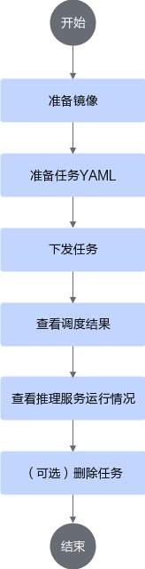
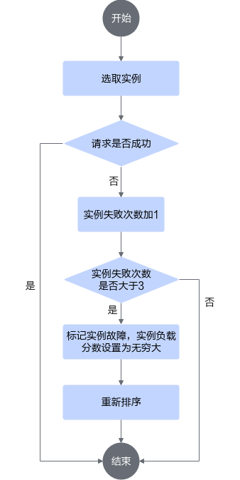
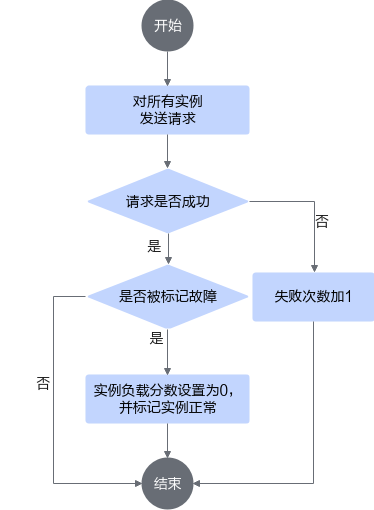

# vLLM推理任务最佳实践<a name="ZH-CN_TOPIC_0000002484280680"></a>

## 使用前必读<a name="ZH-CN_TOPIC_0000002516292409"></a>

MindCluster集群调度组件支持用户通过[AIBrix](https://github.com/vllm-project/aibrix)服务框架定义的[StormService](https://aibrix.readthedocs.io/latest/designs/aibrix-stormservice.html)工作负载部署vLLM推理任务进行调度和故障实例重调度。当前适配的AIBrix版本为[v0.5.0](https://github.com/vllm-project/aibrix/tree/v0.5.0)；适配的[vLLM-Ascend](https://github.com/vllm-project/vllm-ascend)版本为main分支commit ID为[41fbc5e](https://github.com/vllm-project/vllm-ascend/commit/41fbc5ebc9b35bb81f3f14dbe55a76539f6675f5)及之后的版本。

本章节说明相关特性原理及对应配置示例，用户可以参考配置示例部署基于AIBrix的vLLM推理任务。

**前提条件<a name="zh-cn_topic_0000002322062116_section52051339787"></a>**

在部署vLLM推理任务前，需要确保相关组件已经安装，若没有安装，可以参考[安装部署](../installation_guide.md#安装部署)章节进行操作。

-   Volcano
-   Ascend Device Plugin
-   Ascend Docker Runtime
-   ClusterD
-   NodeD（可选）

**支持的产品形态<a name="zh-cn_topic_0000002322062116_section169961844182917"></a>**

-   Atlas 800I A2 推理服务器
-   Atlas 800I A3 超节点服务器

**使用方式<a name="zh-cn_topic_0000002322062116_section6771194616104"></a>**

MindCluster集群调度组件支持用户通过以下方式进行vLLM推理服务的容器化部署、故障重调度。本章节仅介绍通过命令行使用和通过脚本一键式部署使用方式。

-   通过命令行使用：通过配置的YAML文件部署任务。
-   通过脚本一键式部署使用：通过自动化脚本参考设计部署任务。
-   集成后使用：将集群调度组件集成到已有的第三方AI平台或者基于集群调度组件开发的AI平台。


## 部署vLLM推理任务<a name="ZH-CN_TOPIC_0000002516412957"></a>

### 实现原理<a name="ZH-CN_TOPIC_0000002484053032"></a>

1.  集群调度组件定期上报节点和芯片信息；kubelet上报节点芯片数量到节点对象（node）中。
    -   Ascend Device Plugin上报芯片内存和拓扑信息。

        对于包含片上内存的芯片，Ascend Device Plugin启动时上报芯片内存情况，见node-label说明；上报整卡信息，将芯片的物理ID上报到device-info-cm中；可调度的芯片总数量（allocatable）、已使用的芯片数量（allocated）和芯片的基础信息（device ip和super\_device\_ip）上报到node中，用于整卡调度。

    -   当节点上存在故障时，NodeD定期上报节点健康状态、节点硬件故障信息、节点DPC共享存储故障信息到node-info-cm中。

2.  ClusterD读取device-info-cm和node-info-cm中的信息后，将信息整合到cluster-info-cm中。
3.  用户通过kubectl或者其他深度学习平台下发AIBrix框架的StormSevice推理任务，aibrix-controller-manager根据推理任务的配置生成RoleSet或者PodSet的子工作负载，再由对应的子工作负载生成多个推理服务的任务Pod。关于RoleSet或者PodSet的详细说明，可以参见[AIBrix文档](https://aibrix.readthedocs.io/latest/designs/aibrix-stormservice.html)。
4.  volcano-controller为任务创建相应的PodGroup。关于PodGroup的详细说明，可以参见[开源Volcano官方文档](https://volcano.sh/zh/docs/v1-9-0/podgroup/)。
5.  volcano-scheduler根据节点内存、CPU及标签、亲和性为Pod选择合适的节点，并在Pod的annotation上写入选择的芯片信息以及节点硬件信息。
6.  kubelet创建容器时，调用Ascend Device Plugin挂载芯片，Ascend Device Plugin或volcano-scheduler在Pod的annotation上写入芯片和节点硬件信息。Ascend Docker Runtime协助挂载相应资源。


### 通过命令行使用<a name="ZH-CN_TOPIC_0000002484213018"></a>

#### 流程说明<a name="ZH-CN_TOPIC_0000002516292977"></a>

基于AIBrix的vLLM推理任务包含Routing  Pod和推理实例Pod，推理实例Pod可以分为Prefill实例Pod和Decode实例Pod，其中Routing  Pod不需要使用NPU资源，AIBrix根据不同的推理服务配置方式生成不同的工作负载，用于创建不同的推理实例，并由Router统一对外提供推理服务。

关于AIBrix任务部署的详细说明可参见[AIBrix文档](https://aibrix.readthedocs.io/latest/designs/aibrix-stormservice.html)。

**使用流程<a name="section19644656124210"></a>**

通过命令行使用MindCluster集群调度组件部署基于AIBrix的vLLM推理任务时，使用流程如[图1](#fig38991911205815)所示。

**图 1**  使用流程<a name="fig38991911205815"></a>  



#### 准备任务YAML<a name="ZH-CN_TOPIC_0000002516412959"></a>

用户可根据实际情况完成制作镜像的准备工作，然后选择相应的YAML示例，对示例进行修改。

**前提条件<a name="section3759720141513"></a>**

已完成镜像的准备工作。vLLM推理镜像可参考[vllm-ascend官方文档](https://vllm-ascend.readthedocs.io/)获取。

**选择YAML示例<a name="section1419519264165"></a>**

当前，基于AIBrix框架的vllm-ascend推理任务由StormService自定义CRD部署，StormService的使用和部署请参见[Aibrix StormService文档](https://aibrix.readthedocs.io/latest/designs/aibrix-stormservice.html)。StormService的YAML示例请参见[YAML](https://github.com/vllm-project/aibrix/blob/v0.5.0/samples/disaggregation/vllm/1p1d.yaml)。

AIBrix官方提供的示例均基于GPU，使用NPU时需要适配，以下是一个适配示例，用户可根据实际需求进行修改。

```
apiVersion: orchestration.aibrix.ai/v1alpha1
kind: StormService
metadata:
  name: "my-test"
  namespace: "default"
spec:
  replicas: 1                # 当前不支持修改，仅为1
  updateStrategy:
    type: "InPlaceUpdate"
  stateful: true
  selector:
    matchLabels:
      app: "my-test"
  template:
    metadata:
      labels:
        app: "my-test"
    spec:
      roles:
        - name: "prefill"         # prefill定义
          replicas: 1             # prefill副本数
          podGroupSize: 1         # prefill Pod副本数
          stateful: true          # 当前仅支持设置为true
          template:
            metadata:
              labels:
                model.aibrix.ai/name: "qwen3-moe"  # aibrix所需label，根据实际情况填写
                model.aibrix.ai/port: "8000"
                model.aibrix.ai/engine: "vllm"
                fault-scheduling: "force"          # 开启重调度
                pod-rescheduling："on"         # 如果podGroupSize为1，pod-rescheduling需要配置为"on"；如果podGroupSize大于1，则不需要配置，删除该参数。
              annotations:
                huawei.com/schedule_minAvailable: "1" # Gang调度策略下最小调度的副本数，在StormService中所有podGroupSize为1的实例会组成一个podGroup进行调度，其最小调度的副本数范围为[1, 实例replicas之和]，建议配置为实例replicas之和；podGroupSize大于1的实例各自组成一个podGroup，其最小调度的副本数范围为[1, podGroupSize]，建议配置为podGroupSize。例如，prefill实例的podGroupSize为1，decode实例的podGroupSize为2，则prefill实例的最小调度副本数设置为prefill实例的replicas，decode实例的最小调度副本数设置为decode实例的podGroupSize。
                huawei.com/recover_policy_path: "pod"  # pod-rescheduling为"on"时任务执行恢复的路径。设置为"pod"，表明Pod级重调度失败时，不升级到Job级重调度。因为当前podGroup中的每一个Pod都是一个独立的实例，所以其故障处理不能扩散到其他实例。
            spec:
              schedulerName: volcano           # 指定调度器为Volcano
              nodeSelector:
                accelerator-type: "module-a3-16-super-pod"  # 根据硬件形态设置
              containers:
                - name: prefill
                  image: vllm-ascend:xxx        # 镜像名称
                  ...
                  resources:
                    limits:
                      "huawei.com/Ascend910": 16  # 配置NPU数量
                    requests:
                      "huawei.com/Ascend910": 16
        ...                  
        - name: decode       # decode定义
          replicas: 1        # decode副本数
          podGroupSize: 2    # decode pod副本数
          stateful: true
          template:
            metadata:
              labels:
                model.aibrix.ai/name: "qwen3-moe"
                model.aibrix.ai/port: "8000"
                model.aibrix.ai/engine: vllm
                fault-scheduling: "force"    # 开启重调度
              annotations:
                huawei.com/schedule_minAvailable: "2" # 见prefill实例参数说明
            spec:
              schedulerName: volcano
              nodeSelector:
                accelerator-type:  "module-a3-16-super-pod"
              containers:
                - name: decode
                  image: vllm-ascend:xxx
                  
                  ...
                  resources:
                    limits:
                      "huawei.com/Ascend910": 16  # 配置NPU数量
                    requests:
                      "huawei.com/Ascend910": 16
        ...
        - name: routing    # routing定义
          replicas: 1      # routing副本数
          stateful: true
          template：
            spec:
              containers:
              - name: router
                image: xxx:yyy   # routing镜像
                ...
```


#### YAML参数说明<a name="ZH-CN_TOPIC_0000002484053034"></a>

下表仅说明AIBrix的StormService YAML中与MindCluster有关的字段。

**表 1**  YAML参数说明

<a name="zh-cn_topic_0000002329010086_table7602101418317"></a>
<table><thead align="left"><tr id="zh-cn_topic_0000002329010086_zh-cn_topic_0000001951418201_row1460212146313"><th class="cellrowborder" valign="top" width="27.16%" id="mcps1.2.4.1.1"><p id="zh-cn_topic_0000002329010086_zh-cn_topic_0000001951418201_p196029147318"><a name="zh-cn_topic_0000002329010086_zh-cn_topic_0000001951418201_p196029147318"></a><a name="zh-cn_topic_0000002329010086_zh-cn_topic_0000001951418201_p196029147318"></a>参数</p>
</th>
<th class="cellrowborder" valign="top" width="36.28%" id="mcps1.2.4.1.2"><p id="zh-cn_topic_0000002329010086_zh-cn_topic_0000001951418201_p1560213143314"><a name="zh-cn_topic_0000002329010086_zh-cn_topic_0000001951418201_p1560213143314"></a><a name="zh-cn_topic_0000002329010086_zh-cn_topic_0000001951418201_p1560213143314"></a>取值</p>
</th>
<th class="cellrowborder" valign="top" width="36.559999999999995%" id="mcps1.2.4.1.3"><p id="zh-cn_topic_0000002329010086_zh-cn_topic_0000001951418201_p106023141317"><a name="zh-cn_topic_0000002329010086_zh-cn_topic_0000001951418201_p106023141317"></a><a name="zh-cn_topic_0000002329010086_zh-cn_topic_0000001951418201_p106023141317"></a>说明</p>
</th>
</tr>
</thead>
<tbody><tr id="zh-cn_topic_0000002329010086_zh-cn_topic_0000001951418201_row1960421417318"><td class="cellrowborder" valign="top" width="27.16%" headers="mcps1.2.4.1.1 "><p id="zh-cn_topic_0000002329010086_zh-cn_topic_0000001951418201_p460415143318"><a name="zh-cn_topic_0000002329010086_zh-cn_topic_0000001951418201_p460415143318"></a><a name="zh-cn_topic_0000002329010086_zh-cn_topic_0000001951418201_p460415143318"></a>schedulerName</p>
</td>
<td class="cellrowborder" valign="top" width="36.28%" headers="mcps1.2.4.1.2 "><p id="zh-cn_topic_0000002329010086_zh-cn_topic_0000001951418201_p56045145317"><a name="zh-cn_topic_0000002329010086_zh-cn_topic_0000001951418201_p56045145317"></a><a name="zh-cn_topic_0000002329010086_zh-cn_topic_0000001951418201_p56045145317"></a>取值为<span class="parmvalue" id="zh-cn_topic_0000002329010086_zh-cn_topic_0000001951418201_parmvalue10604111417319"><a name="zh-cn_topic_0000002329010086_zh-cn_topic_0000001951418201_parmvalue10604111417319"></a><a name="zh-cn_topic_0000002329010086_zh-cn_topic_0000001951418201_parmvalue10604111417319"></a>“volcano”</span>。</p>
</td>
<td class="cellrowborder" valign="top" width="36.559999999999995%" headers="mcps1.2.4.1.3 "><p id="p7109162113916"><a name="p7109162113916"></a><a name="p7109162113916"></a>配置调度器为<span id="zh-cn_topic_0000002322062116_ph175881448132716"><a name="zh-cn_topic_0000002322062116_ph175881448132716"></a><a name="zh-cn_topic_0000002322062116_ph175881448132716"></a>Volcano</span>。</p>
</td>
</tr>
<tr id="zh-cn_topic_0000002329010086_zh-cn_topic_0000001951418201_row260820141037"><td class="cellrowborder" valign="top" width="27.16%" headers="mcps1.2.4.1.1 "><p id="zh-cn_topic_0000002329010086_zh-cn_topic_0000001951418201_p1860814141536"><a name="zh-cn_topic_0000002329010086_zh-cn_topic_0000001951418201_p1860814141536"></a><a name="zh-cn_topic_0000002329010086_zh-cn_topic_0000001951418201_p1860814141536"></a>（可选）host-arch</p>
</td>
<td class="cellrowborder" valign="top" width="36.28%" headers="mcps1.2.4.1.2 "><a name="ul451248112016"></a><a name="ul451248112016"></a><ul id="ul451248112016"><li><span id="zh-cn_topic_0000002329010086_zh-cn_topic_0000001951418201_ph5608814330"><a name="zh-cn_topic_0000002329010086_zh-cn_topic_0000001951418201_ph5608814330"></a><a name="zh-cn_topic_0000002329010086_zh-cn_topic_0000001951418201_ph5608814330"></a>Arm</span>环境：<span id="ph27942615713"><a name="ph27942615713"></a><a name="ph27942615713"></a>huawei-arm</span></li><li><span id="zh-cn_topic_0000002329010086_zh-cn_topic_0000001951418201_ph186088141531"><a name="zh-cn_topic_0000002329010086_zh-cn_topic_0000001951418201_ph186088141531"></a><a name="zh-cn_topic_0000002329010086_zh-cn_topic_0000001951418201_ph186088141531"></a>x86_64</span>环境：<span id="ph27919313716"><a name="ph27919313716"></a><a name="ph27919313716"></a>huawei-x86</span></li></ul>
</td>
<td class="cellrowborder" valign="top" width="36.559999999999995%" headers="mcps1.2.4.1.3 "><p id="zh-cn_topic_0000002329010086_zh-cn_topic_0000001951418201_p1060801414315"><a name="zh-cn_topic_0000002329010086_zh-cn_topic_0000001951418201_p1060801414315"></a><a name="zh-cn_topic_0000002329010086_zh-cn_topic_0000001951418201_p1060801414315"></a>需要运行训练任务的节点架构，请根据实际修改。</p>
<p id="zh-cn_topic_0000002329010086_zh-cn_topic_0000001951418201_p76084142313"><a name="zh-cn_topic_0000002329010086_zh-cn_topic_0000001951418201_p76084142313"></a><a name="zh-cn_topic_0000002329010086_zh-cn_topic_0000001951418201_p76084142313"></a>分布式任务中，请确保运行训练任务的节点架构相同。</p>
</td>
</tr>
<tr id="zh-cn_topic_0000002329010086_zh-cn_topic_0000001951418201_row56081214237"><td class="cellrowborder" valign="top" width="27.16%" headers="mcps1.2.4.1.1 "><p id="zh-cn_topic_0000002329010086_zh-cn_topic_0000001951418201_p1960818141031"><a name="zh-cn_topic_0000002329010086_zh-cn_topic_0000001951418201_p1960818141031"></a><a name="zh-cn_topic_0000002329010086_zh-cn_topic_0000001951418201_p1960818141031"></a>sp-block</p>
</td>
<td class="cellrowborder" valign="top" width="36.28%" headers="mcps1.2.4.1.2 "><p id="zh-cn_topic_0000002039339953_p14755536454"><a name="zh-cn_topic_0000002039339953_p14755536454"></a><a name="zh-cn_topic_0000002039339953_p14755536454"></a>指定逻辑超节点芯片数量。</p>
<p id="p161001559326"><a name="p161001559326"></a><a name="p161001559326"></a>需要是节点芯片数量的整数倍，且P/D实例的总芯片数量是其整数倍。</p>
</td>
<td class="cellrowborder" valign="top" width="36.559999999999995%" headers="mcps1.2.4.1.3 "><p id="p1670155202912"><a name="p1670155202912"></a><a name="p1670155202912"></a>指定sp-block字段，集群调度组件会在物理超节点上根据切分策略划分出逻辑超节点，用于训练任务的亲和性调度。<span id="zh-cn_topic_0000002511347099_ph521204025916"><a name="zh-cn_topic_0000002511347099_ph521204025916"></a><a name="zh-cn_topic_0000002511347099_ph521204025916"></a>若用户未指定该字段，</span><span id="zh-cn_topic_0000002511347099_ph172121408590"><a name="zh-cn_topic_0000002511347099_ph172121408590"></a><a name="zh-cn_topic_0000002511347099_ph172121408590"></a>Volcano</span><span id="zh-cn_topic_0000002511347099_ph192121140135911"><a name="zh-cn_topic_0000002511347099_ph192121140135911"></a><a name="zh-cn_topic_0000002511347099_ph192121140135911"></a>调度时会将此任务的逻辑超节点大小指定为任务配置的NPU总数。</span></p>
<p id="p19701652112917"><a name="p19701652112917"></a><a name="p19701652112917"></a>了解详细说明请参见<a href="../references.md#atlas-900-a3-superpod-超节点">灵衢总线设备节点网络说明</a>。</p>
<div class="note" id="note47015215291"><a name="note47015215291"></a><a name="note47015215291"></a><span class="notetitle">[!NOTE] 说明 </span><div class="notebody"><p id="p12461828061"><a name="p12461828061"></a><a name="p12461828061"></a>仅支持在<span id="ph914694014812"><a name="ph914694014812"></a><a name="ph914694014812"></a>Atlas 900 A3 SuperPoD 超节点</span>中使用该字段。</p>
</div></div>
</td>
</tr>
<tr id="zh-cn_topic_0000002329010086_zh-cn_topic_0000001951418201_row46101144312"><td class="cellrowborder" valign="top" width="27.16%" headers="mcps1.2.4.1.1 "><p id="zh-cn_topic_0000002329010086_zh-cn_topic_0000001951418201_p1861010140316"><a name="zh-cn_topic_0000002329010086_zh-cn_topic_0000001951418201_p1861010140316"></a><a name="zh-cn_topic_0000002329010086_zh-cn_topic_0000001951418201_p1861010140316"></a>pod-rescheduling</p>
</td>
<td class="cellrowborder" valign="top" width="36.28%" headers="mcps1.2.4.1.2 "><a name="zh-cn_topic_0000002329010086_zh-cn_topic_0000001951418201_ul186101614131"></a><a name="zh-cn_topic_0000002329010086_zh-cn_topic_0000001951418201_ul186101614131"></a><ul id="zh-cn_topic_0000002329010086_zh-cn_topic_0000001951418201_ul186101614131"><li>on：开启<span id="ph164712399403"><a name="ph164712399403"></a><a name="ph164712399403"></a>Pod</span>级别重调度。</li><li>其他值或不使用该字段：关闭<span id="ph126431540134014"><a name="ph126431540134014"></a><a name="ph126431540134014"></a>Pod</span>级别重调度。</li></ul>
</td>
<td class="cellrowborder" valign="top" width="36.559999999999995%" headers="mcps1.2.4.1.3 "><p id="zh-cn_topic_0000002329010086_zh-cn_topic_0000001951418201_p661016141437"><a name="zh-cn_topic_0000002329010086_zh-cn_topic_0000001951418201_p661016141437"></a><a name="zh-cn_topic_0000002329010086_zh-cn_topic_0000001951418201_p661016141437"></a><span id="ph4287194517407"><a name="ph4287194517407"></a><a name="ph4287194517407"></a>Pod</span>级重调度，表示任务发生故障后，不会删除PodGroup内的所有任务<span id="ph1595595534015"><a name="ph1595595534015"></a><a name="ph1595595534015"></a>Pod</span>，而是将发生故障的<span id="ph750524344015"><a name="ph750524344015"></a><a name="ph750524344015"></a>Pod</span>进行删除，由控制器重新创建新<span id="ph1521154416407"><a name="ph1521154416407"></a><a name="ph1521154416407"></a>Pod</span>后进行重调度。</p>
<div class="note" id="zh-cn_topic_0000002329010086_zh-cn_topic_0000001951418201_note1561010145316"><a name="zh-cn_topic_0000002329010086_zh-cn_topic_0000001951418201_note1561010145316"></a><a name="zh-cn_topic_0000002329010086_zh-cn_topic_0000001951418201_note1561010145316"></a><span class="notetitle">[!NOTE] 说明</span><div class="notebody"><p id="p1745415523710"><a name="p1745415523710"></a><a name="p1745415523710"></a>如果podGroupSize为1，pod-rescheduling需要配置为"on"；podGroupSize大于1时，不配置该参数。</p>
</div></div>
</td>
</tr>
<tr id="row1350395294311"><td class="cellrowborder" valign="top" width="27.16%" headers="mcps1.2.4.1.1 "><p id="p1950335234319"><a name="p1950335234319"></a><a name="p1950335234319"></a>huawei.com/schedule_minAvailable</p>
</td>
<td class="cellrowborder" valign="top" width="36.28%" headers="mcps1.2.4.1.2 "><p id="p7503135219437"><a name="p7503135219437"></a><a name="p7503135219437"></a>数字类型字符串</p>
</td>
<td class="cellrowborder" valign="top" width="36.559999999999995%" headers="mcps1.2.4.1.3 "><p id="p99129343327"><a name="p99129343327"></a><a name="p99129343327"></a>Gang调度策略下最小调度的副本数。在StormService中，</p>
<a name="ul585819537354"></a><a name="ul585819537354"></a><ul id="ul585819537354"><li>所有podGroupSize为1的实例会组成一个podGroup进行调度，其最小调度的副本数范围为[1, 实例replicas之和]，建议配置为实例replicas之和；</li><li>podGroupSize大于1的实例各自组成一个podGroup，其最小调度副本数范围为[1, podGroupSize]，建议配置为podGroupSize。</li></ul>
<p id="p550316525433"><a name="p550316525433"></a><a name="p550316525433"></a>例如，prefill实例的podGroupSize为1，decode实例的podGroupSize为2，那么prefill实例的最小调度副本数设置为prefill实例的replicas，decode实例的最小调度副本数设置为decode实例的podGroupSize。</p>
</td>
</tr>
<tr id="row1371059114414"><td class="cellrowborder" valign="top" width="27.16%" headers="mcps1.2.4.1.1 "><p id="p28155984416"><a name="p28155984416"></a><a name="p28155984416"></a>huawei.com/recover_policy_path</p>
</td>
<td class="cellrowborder" valign="top" width="36.28%" headers="mcps1.2.4.1.2 "><p id="p1880125114317"><a name="p1880125114317"></a><a name="p1880125114317"></a>"pod"</p>
</td>
<td class="cellrowborder" valign="top" width="36.559999999999995%" headers="mcps1.2.4.1.3 "><p id="p8818595449"><a name="p8818595449"></a><a name="p8818595449"></a>pod-rescheduling为"on"时任务执行恢复的路径。设置为"pod"，表明Pod级重调度失败时，不升级到Job级重调度。因为当前podGroup中的每一个Pod都是一个独立的实例，所以其故障处理不能扩散到其他实例。</p>
</td>
</tr>
<tr id="zh-cn_topic_0000002329010086_zh-cn_topic_0000001951418201_row36114148312"><td class="cellrowborder" valign="top" width="27.16%" headers="mcps1.2.4.1.1 "><p id="zh-cn_topic_0000002329010086_zh-cn_topic_0000001951418201_p1461116146318"><a name="zh-cn_topic_0000002329010086_zh-cn_topic_0000001951418201_p1461116146318"></a><a name="zh-cn_topic_0000002329010086_zh-cn_topic_0000001951418201_p1461116146318"></a>accelerator-type</p>
</td>
<td class="cellrowborder" valign="top" width="36.28%" headers="mcps1.2.4.1.2 "><a name="zh-cn_topic_0000002329010086_zh-cn_topic_0000001951418201_ul461118141037"></a><a name="zh-cn_topic_0000002329010086_zh-cn_topic_0000001951418201_ul461118141037"></a><ul id="zh-cn_topic_0000002329010086_zh-cn_topic_0000001951418201_ul461118141037"><li><span id="ph16267162611508"><a name="ph16267162611508"></a><a name="ph16267162611508"></a>Atlas 800I A2 推理服务器</span>：module-910b-8</li><li><span id="ph2385246171619"><a name="ph2385246171619"></a><a name="ph2385246171619"></a>Atlas 800I A3 超节点服务器</span>：module-a3-16</li><li><span id="ph261924414289"><a name="ph261924414289"></a><a name="ph261924414289"></a>Atlas 900 A3 SuperPoD 超节点</span>：module-a3-16-super-pod</li></ul>
</td>
<td class="cellrowborder" valign="top" width="36.559999999999995%" headers="mcps1.2.4.1.3 "><p id="zh-cn_topic_0000002329010086_zh-cn_topic_0000001951418201_p6612914039"><a name="zh-cn_topic_0000002329010086_zh-cn_topic_0000001951418201_p6612914039"></a><a name="zh-cn_topic_0000002329010086_zh-cn_topic_0000001951418201_p6612914039"></a>根据需要运行训练任务的节点类型，选取不同的值。</p>
</td>
</tr>
<tr id="zh-cn_topic_0000002329010086_zh-cn_topic_0000001951418201_row18613714439"><td class="cellrowborder" valign="top" width="27.16%" headers="mcps1.2.4.1.1 "><p id="zh-cn_topic_0000002329010086_zh-cn_topic_0000001951418201_p196131140315"><a name="zh-cn_topic_0000002329010086_zh-cn_topic_0000001951418201_p196131140315"></a><a name="zh-cn_topic_0000002329010086_zh-cn_topic_0000001951418201_p196131140315"></a>huawei.com/Ascend910</p>
</td>
<td class="cellrowborder" valign="top" width="36.28%" headers="mcps1.2.4.1.2 "><a name="ul5849154316123"></a><a name="ul5849154316123"></a><ul id="ul5849154316123"><li><span id="ph20407103618121"><a name="ph20407103618121"></a><a name="ph20407103618121"></a>Atlas 800I A2 推理服务器</span>：8</li><li><span id="zh-cn_topic_0000002329010086_ph747840144217"><a name="zh-cn_topic_0000002329010086_ph747840144217"></a><a name="zh-cn_topic_0000002329010086_ph747840144217"></a>Atlas 900 A3 SuperPoD 超节点</span>、<span id="ph2061955101216"><a name="ph2061955101216"></a><a name="ph2061955101216"></a>Atlas 800I A3 超节点服务器</span>: 16</li></ul>
</td>
<td class="cellrowborder" valign="top" width="36.559999999999995%" headers="mcps1.2.4.1.3 "><p id="zh-cn_topic_0000002329010086_zh-cn_topic_0000001951418201_p561713141331"><a name="zh-cn_topic_0000002329010086_zh-cn_topic_0000001951418201_p561713141331"></a><a name="zh-cn_topic_0000002329010086_zh-cn_topic_0000001951418201_p561713141331"></a>请求的NPU数量。当前仅支持整机调度，请根据实际硬件卡数进行修改。</p>
</td>
</tr>
<tr id="zh-cn_topic_0000002329010086_zh-cn_topic_0000001951418201_row11621414533"><td class="cellrowborder" valign="top" width="27.16%" headers="mcps1.2.4.1.1 "><p id="zh-cn_topic_0000002329010086_zh-cn_topic_0000001951418201_p894317013244"><a name="zh-cn_topic_0000002329010086_zh-cn_topic_0000001951418201_p894317013244"></a><a name="zh-cn_topic_0000002329010086_zh-cn_topic_0000001951418201_p894317013244"></a>env[name==ASCEND_VISIBLE_DEVICES].valueFrom.fieldRef.fieldPath</p>
</td>
<td class="cellrowborder" valign="top" width="36.28%" headers="mcps1.2.4.1.2 "><p id="zh-cn_topic_0000002329010086_zh-cn_topic_0000001951418201_p7622914235"><a name="zh-cn_topic_0000002329010086_zh-cn_topic_0000001951418201_p7622914235"></a><a name="zh-cn_topic_0000002329010086_zh-cn_topic_0000001951418201_p7622914235"></a>取值为metadata.annotations['huawei.com/Ascend910']，和环境上实际的芯片类型保持一致。</p>
</td>
<td class="cellrowborder" valign="top" width="36.559999999999995%" headers="mcps1.2.4.1.3 "><p id="zh-cn_topic_0000002329010086_zh-cn_topic_0000001951418201_p136226142031"><a name="zh-cn_topic_0000002329010086_zh-cn_topic_0000001951418201_p136226142031"></a><a name="zh-cn_topic_0000002329010086_zh-cn_topic_0000001951418201_p136226142031"></a><span id="zh-cn_topic_0000002362968521_ph230432885618"><a name="zh-cn_topic_0000002362968521_ph230432885618"></a><a name="zh-cn_topic_0000002362968521_ph230432885618"></a>Ascend Docker Runtime</span>会获取该参数值，用于给容器挂载相应类型的NPU。</p>
<div class="note" id="zh-cn_topic_0000002329010086_zh-cn_topic_0000001951418201_note462214141730"><a name="zh-cn_topic_0000002329010086_zh-cn_topic_0000001951418201_note462214141730"></a><a name="zh-cn_topic_0000002329010086_zh-cn_topic_0000001951418201_note462214141730"></a><span class="notetitle">[!NOTE] 说明</span><div class="notebody"><p id="zh-cn_topic_0000002329010086_zh-cn_topic_0000001951418201_p186225141637"><a name="zh-cn_topic_0000002329010086_zh-cn_topic_0000001951418201_p186225141637"></a><a name="zh-cn_topic_0000002329010086_zh-cn_topic_0000001951418201_p186225141637"></a>该参数只支持使用<span id="ph123731542141613"><a name="ph123731542141613"></a><a name="ph123731542141613"></a>Volcano</span>调度器的整卡调度特性，使用静态vNPU调度和其他调度器的用户需要删除示例YAML中该参数的相关字段。</p>
</div></div>
</td>
</tr>
<tr id="zh-cn_topic_0000002329010086_zh-cn_topic_0000001951418201_row662216141939"><td class="cellrowborder" rowspan="5" valign="top" width="27.16%" headers="mcps1.2.4.1.1 "><p id="zh-cn_topic_0000002329010086_zh-cn_topic_0000001951418201_p106221514533"><a name="zh-cn_topic_0000002329010086_zh-cn_topic_0000001951418201_p106221514533"></a><a name="zh-cn_topic_0000002329010086_zh-cn_topic_0000001951418201_p106221514533"></a>fault-scheduling</p>
</td>
<td class="cellrowborder" valign="top" width="36.28%" headers="mcps1.2.4.1.2 "><p id="zh-cn_topic_0000002329010086_zh-cn_topic_0000001951418201_p206221814637"><a name="zh-cn_topic_0000002329010086_zh-cn_topic_0000001951418201_p206221814637"></a><a name="zh-cn_topic_0000002329010086_zh-cn_topic_0000001951418201_p206221814637"></a>grace</p>
</td>
<td class="cellrowborder" valign="top" width="36.559999999999995%" headers="mcps1.2.4.1.3 "><p id="zh-cn_topic_0000002329010086_zh-cn_topic_0000001951418201_p1462216142314"><a name="zh-cn_topic_0000002329010086_zh-cn_topic_0000001951418201_p1462216142314"></a><a name="zh-cn_topic_0000002329010086_zh-cn_topic_0000001951418201_p1462216142314"></a>配置任务采用优雅删除模式，并在过程中先优雅删除原<span id="ph12553844101710"><a name="ph12553844101710"></a><a name="ph12553844101710"></a>Pod</span>，15分钟后若还未成功，使用强制删除原<span id="ph1086910463172"><a name="ph1086910463172"></a><a name="ph1086910463172"></a>Pod</span>。</p>
</td>
</tr>
<tr id="zh-cn_topic_0000002329010086_zh-cn_topic_0000001951418201_row1262313144314"><td class="cellrowborder" valign="top" headers="mcps1.2.4.1.1 "><p id="zh-cn_topic_0000002329010086_zh-cn_topic_0000001951418201_p762371419310"><a name="zh-cn_topic_0000002329010086_zh-cn_topic_0000001951418201_p762371419310"></a><a name="zh-cn_topic_0000002329010086_zh-cn_topic_0000001951418201_p762371419310"></a>force</p>
</td>
<td class="cellrowborder" valign="top" headers="mcps1.2.4.1.2 "><p id="zh-cn_topic_0000002329010086_zh-cn_topic_0000001951418201_p562301420319"><a name="zh-cn_topic_0000002329010086_zh-cn_topic_0000001951418201_p562301420319"></a><a name="zh-cn_topic_0000002329010086_zh-cn_topic_0000001951418201_p562301420319"></a>配置任务采用强制删除模式，在过程中强制删除原<span id="ph7477195381711"><a name="ph7477195381711"></a><a name="ph7477195381711"></a>Pod</span>。</p>
</td>
</tr>
<tr id="zh-cn_topic_0000002329010086_zh-cn_topic_0000001951418201_row46230146312"><td class="cellrowborder" valign="top" headers="mcps1.2.4.1.1 "><p id="zh-cn_topic_0000002329010086_zh-cn_topic_0000001951418201_p126231144312"><a name="zh-cn_topic_0000002329010086_zh-cn_topic_0000001951418201_p126231144312"></a><a name="zh-cn_topic_0000002329010086_zh-cn_topic_0000001951418201_p126231144312"></a>off</p>
</td>
<td class="cellrowborder" rowspan="3" valign="top" headers="mcps1.2.4.1.2 "><p id="zh-cn_topic_0000002329010086_zh-cn_topic_0000001951418201_p26233141317"><a name="zh-cn_topic_0000002329010086_zh-cn_topic_0000001951418201_p26233141317"></a><a name="zh-cn_topic_0000002329010086_zh-cn_topic_0000001951418201_p26233141317"></a>该推理任务不使用故障重调度特性。</p>
</td>
</tr>
<tr id="zh-cn_topic_0000002329010086_zh-cn_topic_0000001951418201_row7623191419310"><td class="cellrowborder" valign="top" headers="mcps1.2.4.1.1 "><p id="zh-cn_topic_0000002329010086_zh-cn_topic_0000001951418201_p11624181414311"><a name="zh-cn_topic_0000002329010086_zh-cn_topic_0000001951418201_p11624181414311"></a><a name="zh-cn_topic_0000002329010086_zh-cn_topic_0000001951418201_p11624181414311"></a>无（无fault-scheduling字段）</p>
</td>
</tr>
<tr id="zh-cn_topic_0000002329010086_zh-cn_topic_0000001951418201_row106241614036"><td class="cellrowborder" valign="top" headers="mcps1.2.4.1.1 "><p id="zh-cn_topic_0000002329010086_zh-cn_topic_0000001951418201_p9624191420310"><a name="zh-cn_topic_0000002329010086_zh-cn_topic_0000001951418201_p9624191420310"></a><a name="zh-cn_topic_0000002329010086_zh-cn_topic_0000001951418201_p9624191420310"></a>其他值</p>
</td>
</tr>
<tr id="zh-cn_topic_0000002329010086_zh-cn_topic_0000001951418201_row76241014637"><td class="cellrowborder" rowspan="2" valign="top" width="27.16%" headers="mcps1.2.4.1.1 "><p id="zh-cn_topic_0000002329010086_zh-cn_topic_0000001951418201_p262451412319"><a name="zh-cn_topic_0000002329010086_zh-cn_topic_0000001951418201_p262451412319"></a><a name="zh-cn_topic_0000002329010086_zh-cn_topic_0000001951418201_p262451412319"></a>fault-retry-times</p>
</td>
<td class="cellrowborder" valign="top" width="36.28%" headers="mcps1.2.4.1.2 "><p id="zh-cn_topic_0000002329010086_zh-cn_topic_0000001951418201_p76249141830"><a name="zh-cn_topic_0000002329010086_zh-cn_topic_0000001951418201_p76249141830"></a><a name="zh-cn_topic_0000002329010086_zh-cn_topic_0000001951418201_p76249141830"></a>0 &lt; fault-retry-times</p>
</td>
<td class="cellrowborder" valign="top" width="36.559999999999995%" headers="mcps1.2.4.1.3 "><p id="zh-cn_topic_0000002329010086_zh-cn_topic_0000001951418201_p9624101418314"><a name="zh-cn_topic_0000002329010086_zh-cn_topic_0000001951418201_p9624101418314"></a><a name="zh-cn_topic_0000002329010086_zh-cn_topic_0000001951418201_p9624101418314"></a>处理业务面故障，必须配置业务面无条件重试的次数。</p>
</td>
</tr>
<tr id="zh-cn_topic_0000002329010086_zh-cn_topic_0000001951418201_row06256141536"><td class="cellrowborder" valign="top" headers="mcps1.2.4.1.1 "><p id="zh-cn_topic_0000002329010086_zh-cn_topic_0000001951418201_p1462511141837"><a name="zh-cn_topic_0000002329010086_zh-cn_topic_0000001951418201_p1462511141837"></a><a name="zh-cn_topic_0000002329010086_zh-cn_topic_0000001951418201_p1462511141837"></a>无（无fault-retry-times）或0</p>
</td>
<td class="cellrowborder" valign="top" headers="mcps1.2.4.1.2 "><p id="zh-cn_topic_0000002329010086_zh-cn_topic_0000001951418201_p12625914632"><a name="zh-cn_topic_0000002329010086_zh-cn_topic_0000001951418201_p12625914632"></a><a name="zh-cn_topic_0000002329010086_zh-cn_topic_0000001951418201_p12625914632"></a>该任务不使用无条件重试功能，发生业务面故障之后<span id="ph174393280178"><a name="ph174393280178"></a><a name="ph174393280178"></a>Volcano</span>不会主动删除故障的<span id="ph210853715184"><a name="ph210853715184"></a><a name="ph210853715184"></a>Pod</span>。</p>
</td>
</tr>
<tr id="row125252918159"><td class="cellrowborder" valign="top" width="27.16%" headers="mcps1.2.4.1.1 "><p id="zh-cn_topic_0000002329010086_zh-cn_topic_0000001951418201_p462713149315"><a name="zh-cn_topic_0000002329010086_zh-cn_topic_0000001951418201_p462713149315"></a><a name="zh-cn_topic_0000002329010086_zh-cn_topic_0000001951418201_p462713149315"></a>restartPolicy</p>
</td>
<td class="cellrowborder" valign="top" width="36.28%" headers="mcps1.2.4.1.2 "><a name="zh-cn_topic_0000002329010086_zh-cn_topic_0000001951418201_ul36271614531"></a><a name="zh-cn_topic_0000002329010086_zh-cn_topic_0000001951418201_ul36271614531"></a><ul id="zh-cn_topic_0000002329010086_zh-cn_topic_0000001951418201_ul36271614531"><li>Never：从不重启</li><li>Always：总是重启</li><li>OnFailure：失败时重启</li><li>ExitCode：根据进程退出码决定是否重启Pod，错误码是1~127时不重启，128~255时重启Pod。<div class="note" id="zh-cn_topic_0000002329010086_zh-cn_topic_0000001951418201_note156280141037"><a name="zh-cn_topic_0000002329010086_zh-cn_topic_0000001951418201_note156280141037"></a><a name="zh-cn_topic_0000002329010086_zh-cn_topic_0000001951418201_note156280141037"></a><span class="notetitle">[!NOTE] 说明</span><div class="notebody"><p id="zh-cn_topic_0000002329010086_zh-cn_topic_0000001951418201_p17628131415316"><a name="zh-cn_topic_0000002329010086_zh-cn_topic_0000001951418201_p17628131415316"></a><a name="zh-cn_topic_0000002329010086_zh-cn_topic_0000001951418201_p17628131415316"></a>vcjob类型的训练任务不支持ExitCode。</p>
</div></div>
</li></ul>
</td>
<td class="cellrowborder" valign="top" width="36.559999999999995%" headers="mcps1.2.4.1.3 "><p id="zh-cn_topic_0000002329010086_zh-cn_topic_0000001951418201_p762813148318"><a name="zh-cn_topic_0000002329010086_zh-cn_topic_0000001951418201_p762813148318"></a><a name="zh-cn_topic_0000002329010086_zh-cn_topic_0000001951418201_p762813148318"></a>容器重启策略。当配置业务面故障无条件重试时，容器重启策略取值必须为<span class="parmvalue" id="zh-cn_topic_0000002329010086_zh-cn_topic_0000001951418201_parmvalue18628191413311"><a name="zh-cn_topic_0000002329010086_zh-cn_topic_0000001951418201_parmvalue18628191413311"></a><a name="zh-cn_topic_0000002329010086_zh-cn_topic_0000001951418201_parmvalue18628191413311"></a>“Never”</span>。</p>
</td>
</tr>
</tbody>
</table>


#### 推理任务的下发、查看与删除<a name="ZH-CN_TOPIC_0000002484213020"></a>

用户完成任务YAML的准备工作之后，就可以进行以下操作：

1.  下发推理任务
2.  查看调度结果
3.  查看推理任务运行情况
4.  （可选）删除任务

了解以上步骤的详细说明，请参见[AIBrix文档](https://aibrix.readthedocs.io/latest/getting_started/quickstart.html)。


### 通过脚本一键式部署使用<a name="ZH-CN_TOPIC_0000002516330447"></a>

用户在K8s集群中部署多个相关联的推理任务，手动编写和维护大量的K8s YAML文件效率低下且容易出错。为此，MindCluster提供一个自动化脚本参考设计，替代繁琐的手动操作。用户只需提供基本的应用信息（如应用名、镜像版本、副本数等），脚本就能自动生成所有必要的、符合规范的K8s YAML文件，并直接部署到指定集群。同时，MindCluster提供一种简单的方式（如指定同一个应用名）一键删除所有相关资源。

当前脚本仅支持P/D分离部署。

**前提条件<a name="section178303526285"></a>**

-   MindCluster、AIBrix相关组件安装完成。
-   环境已安装Python，并可联网下载依赖包。
-   存在KubeConfig文件，可以与K8s集群正常通信。

**操作步骤<a name="section582414444317"></a>**

1.  从mindcluster-deploy仓库获取源码，进入“k8s-deploy-tool“目录。

    ```
    git clone https://gitcode.com/Ascend/mindcluster-deploy.git && cd mindcluster-deploy/k8s-deploy-tool
    ```

2.  （可选）创建并激活Python虚拟环境。该操作可以使得不同Python项目使用不同版本的库而互不干扰。

    ```
    python -m venv k8s-deploy-tool && source k8s-deploy-tool/bin/activate
    ```

    根据环境实际情况选择使用Python或Python3。

3.  安装依赖。

    ```
    pip install -r requirements.txt
    ```

4.  （可选）修改实例启动脚本。用户可根据模型实际情况进行修改。
    1.  打开“example/scripts/start\_server.sh“文件。

        ```
        vi example/scripts/start_server.sh
        ```

    2.  按“i”进入编辑模式，根据模型实际情况，修改vLLM进程启动命令，例如max-model-len、max-num-batched-tokens等。
    3.  按“Esc”键，输入**:wq!**，按“Enter”保存并退出编辑。

5.  （可选）复制启动脚本到主机其他目录或集群其他节点。如果用户环境为单机环境，可以跳过该步骤。如果用户环境包含共享存储，也可以将脚本文件复制到共享存储，并将共享存储挂载给推理服务。

    >[!NOTE] 说明 
    >scripts文件夹中默认的[代理脚本](https://gitcode.com/Ascend/mindcluster-deploy/blob/master/k8s-deploy-tool/example/scripts/load_balance_proxy_layerwise_server_example.py)会开启故障隔离功能，若无需该功能，请使用[原生代理脚本](https://github.com/vllm-project/vllm-ascend/blob/main/examples/disaggregated_prefill_v1/load_balance_proxy_layerwise_server_example.py)替换scripts文件夹中的代理脚本。

    ```
    cp example/scripts/*  <tartget_dir> 
    scp example/scripts/* <user>@<IP>:<tartget_dir>
    ```

6.  （可选）编辑YAML模板，配置模型、脚本挂载路径。用户可以根据模型和脚本实际路径配置YAML模板。
    1.  打开“src/templates/aibrix/stormservice.yaml.j2“文件。

        ```
        vi src/templates/aibrix/stormservice.yaml.j2
        ```

    2.  按“i”进入编辑模式，修改容器中模型存放目录。

        ```
        volumeMounts:
        - name: model
        mountPath: /mnt/models
        volumes:                  #修改挂载的volume
        - name: model             #设置为模型实际存放目录
        hostPath:
        path: /mnt/models
        - name: scripts           #设置为启动脚本实际存放目录
        hostPath:
        path: /scripts
        ```

    3.  按“Esc”键，输入**:wq!**，按“Enter”保存并退出编辑。

7.  编辑用户配置文件“config/stormservice-config.yaml“。

    1.  打开“config/stormservice-config.yaml“文件。

        ```
        vi config/stormservice-config.yaml
        ```

    2.  按“i”进入编辑模式，按实际情况修改文件中的字段。
    3.  按“Esc”键，输入**:wq!**，按“Enter”保存并退出编辑。

    >[!NOTE] 说明 
    >-   “dp\_size“需要为“podGroupSize“的整数倍。
    >-   当“dp\_size“设置为“1“时，“distributed\_dp“只能为“false“，大于“1“时才能设置为“true“。

8.  （可选）创建任务名称空间，vllm-test为“config/stormservice-config.yaml“设置的“app\_namespace“。如果“app\_namespace“为“default“或未设置，可以不创建名称空间。

    ```
    kubectl create ns vllm-test
    ```

9.  设置服务框架类型为aibrix。

    ```
    export SERVING_FRAMEWORK=aibrix
    ```

10. 部署推理任务。

    ```
    python main.py deploy -c config/stormservice-config.yaml
    ```

    根据环境实际情况使用Python或Python3。参数说明如下：

    -   -c, --config：配置文件路径，必填。
    -   -k, --kubeconfig：KubeConfig文件路径，选填。默认值为\~/.kube/config。
    -   --dry-run：试运行（不实际部署，展示生成的YAML），选填。

11. 查看任务运行状态。

    ```
    python main.py status -n my-test -ns default
    ```

    参数说明如下：

    -   -n, --app-name：应用名称，必填。
    -   -ns, --namespace：应用命名空间，选填。默认值为"default" 。
    -   -k, --kubeconfig：KubeConfig文件路径，选填。默认值为\~/.kube/config。

    >[!NOTE] 说明 
    >用户也可以使用kubectl命令行工具查看任务运行状态。

12. 新建终端窗口，在当前K8s集群的节点中执行以下命令，访问推理服务。若请求成功返回，表示推理服务部署成功。

    ```
    curl http://<routing-podip>:8080/v1/completions \
    -H "Content-Type: application/json" \
    -d '{
    "model": "<模型名称>",
    "prompt": "Who are you?",
    "max_tokens": 10,
    "temperature": 0
    }'
    ```

    >[!NOTE] 说明 
    ><routing-podip\>为Routing Pod的IP地址，可以通过以下命令查看。
    >```
    >kubectl get pod -A -o wide
    >```

13. （可选）删除推理任务。若用户需要删除任务，可以执行该步骤。

    ```
    python main.py delete -n my-test -ns default
    ```

    参数说明如下：

    -   -n, --app-name：应用名称，必填。
    -   -ns, --namespace：应用命名空间，选填。默认值为"default" 。
    -   -k, --kubeconfig：KubeConfig文件路径，选填。默认值为\~/.kube/config。


## 配置推理任务实例重调度<a name="ZH-CN_TOPIC_0000002484224852"></a>

**前提条件<a name="section12668751507"></a>**

已完成AIBrix服务部署，详细请参见[AIBrix文档](https://aibrix.readthedocs.io/latest/designs/aibrix-stormservice.html)。

**支持的故障类型<a name="section17669195209"></a>**

芯片、软件故障

**重调度原理<a name="section06701958011"></a>**

AIBrix根据任务YAML中的role实例生成PodGroup，对应实例发生故障时，重调度实例PodGroup下的所有Pod，若实例配置的podGroupSize均配置为1，只会生成一个PodGroup，发生故障时重调度对应实例的故障Pod。

**配置实例级重调度<a name="section86725515019"></a>**

以StormService YAML为例配置实例级重调度，添加以下加粗部分配置。

```
apiVersion: orchestration.aibrix.ai/v1alpha1
kind: StormService
metadata:
  name: vllm-1p1d
spec:
  replicas: 1
  updateStrategy:
    type: InPlaceUpdate
  stateful: true
  selector:
    matchLabels:
      app: vllm-1p1d
  template:
    metadata:
      labels:
        app: vllm-1p1d
    spec:
      roles:
        - name: prefill
          replicas: 1
          stateful: true
          podGroupSize: 2
          template:
            metadata:
              labels:
                model.aibrix.ai/name: qwen3-8B
                model.aibrix.ai/port: "8000"
                model.aibrix.ai/engine: vllm
                fault-scheduling: "force"
                #pod-rescheduling: "on"   # 若podGroupSize均为1则需配置该标签，podGroupSize大于1时，无需配置
                fault-retry-times: "10"
            spec:
              schedulerName: volcano  # 指定调度器
              restartPolicy: Never
              nodeSelector:
                accelerator-type: module-910b-8
              containers:
                - name: prefill
...
                  resources:
                    limits:
                      huawei.com/Ascend910: 8  # 配置所需NPU数
                    requests:
                      huawei.com/Ascend910: 8
                  securityContext:
...
        - name: decode
          replicas: 1
          podGroupSize: 2
          stateful: true
          template:
            metadata:
              labels:
                model.aibrix.ai/name: qwen3-8B
                model.aibrix.ai/port: "8000"
                model.aibrix.ai/engine: vllm
                fault-scheduling: "force"
                #pod-rescheduling: "on"   # 若podGroupSize均为1则需配置该标签，podGroupSize大于1时，无需配置
                fault-retry-times: "10"
            spec:
              nodeSelector:
                accelerator-type: module-910b-8
              schedulerName: volcano
              restartPolicy: Never
              containers:
                - name: decode
...
                  resources:
                    limits:
                      huawei.com/Ascend910: 8
                    requests:
                      huawei.com/Ascend910: 8
                  securityContext:
...
```


## 配置故障隔离<a name="ZH-CN_TOPIC_0000002516596047"></a>

vLLM Ascend提供的[原生代理脚本](https://github.com/vllm-project/vllm-ascend/blob/main/examples/disaggregated_prefill_v1/load_balance_proxy_layerwise_server_example.py)将vLLM服务封装为实例对象，并根据实例对象的负载分数分别建立Prefill实例堆和Decode实例堆（小根堆是一种特殊的数据结构，堆顶的元素是整个堆里最小的）。当请求到达代理时，该代理会从实例堆中选择实例（即负载分数最小的），选择该实例后会对负载分数进行更新，从而实现实例的负载均衡。

由于原生代理脚本中未对实例进行是否可服务的探测与处理，因此在原生代理脚本基础上，增加了故障隔离功能。故障隔离功能的目的是将无法正常运行的服务隔离开来，防止流量到达故障实例从而无法服务。同时增加健康探测功能，用于辅助故障隔离功能。

**故障隔离原理<a name="section9781175017252"></a>**

在代理脚本中，增加了实例对象的失败次数和故障检查。具体流程如[图1](#fig158696279554)所示。

**图 1**  故障隔离流程图<a name="fig158696279554"></a>  


1.  从堆中选取实例。
2.  路由请求到该实例上。
    -   若请求成功，则无需处理。
    -   若请求失败，则将该实例的失败次数加1。

3.  当某实例的失败次数大于3时，则将该实例标记为故障，并将其负载分数设置为无穷大。
4.  根据小根堆的特性，故障实例会被堆按负载分数排序到堆底，优先级降到最低。

>[!NOTE] 说明 
>由于代理脚本实现中并未将故障实例从堆中移除，因此选取实例的逻辑由1次改为循环获取未故障的实例，若堆中所有的实例均已故障，则当前代理无法服务。

**健康探测原理<a name="section02001212616"></a>**

在代理脚本中，默认开启健康探测协程，会对所有实例对象进行探测，根据探测结果进行后续处理，具体流程如[图2](#fig175216161511)所示。

**图 2**  健康探测流程图<a name="fig175216161511"></a>  


1.  健康探测功能会每间隔5s，对所有实例对象进行探测（调用/health接口）。
2.  若请求失败则该实例失败次数加1。
3.  若请求成功，分为以下两种情况：
    -   当前实例未标记为故障，则该实例正常无需变动。
    -   当前实例标记为故障，则将该实例的负载分数设置为0，并标记实例正常，该实例后续可以正常处理请求。

**部署使用<a name="section1321166353"></a>**

详细请参见[通过脚本一键式部署使用](#通过脚本一键式部署使用)。


